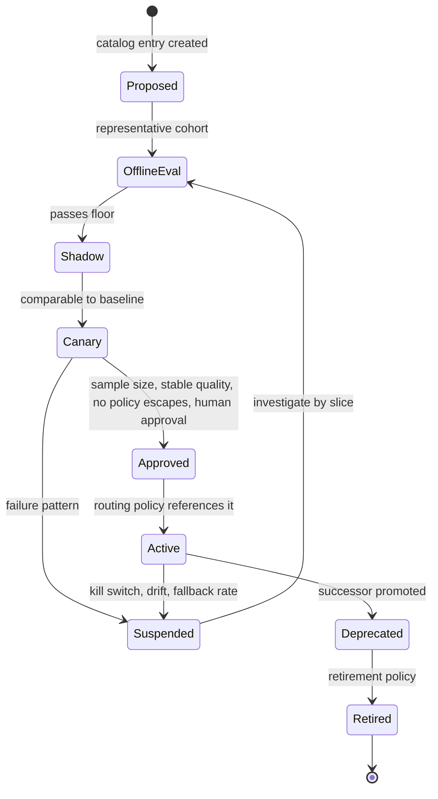
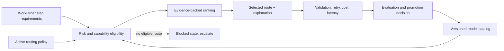
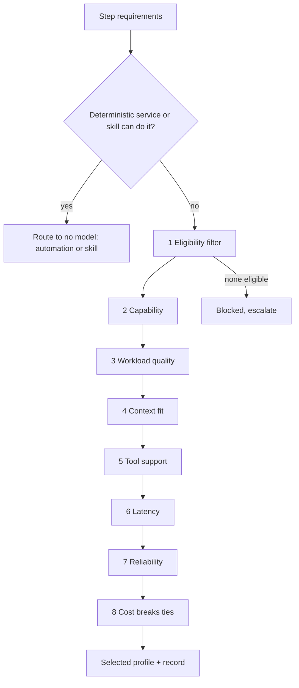

# 17. Models: routing, profiles, and capability selection

Chapter 15 established that the model is one replaceable component in an agent's composition. This chapter is about how you replace it well: how to describe a model as a versioned profile rather than a brand name, how a router chooses among qualified profiles for one step of work, how new routes are proven and rolled back, and why the human cost of switching models is a real engineering constraint rather than a preference. After reading it you should be able to design routing for a factory's operating lanes and explain every fallback that remains forbidden.

## The problem

No model is best for every factory operation. Strong models cost more and may be slower. Fast models may lack tool use, context length, reliability, or risk approval. Provider outages and rate limits make any single route fragile. And choosing purely by price or by benchmark rank can lower total system performance, because raw success hides retries, human intervention, and validation cost.

The problem persists because capability changes quickly and varies by task, tool, prompt, context, and evaluation. A provider name does not describe operational fitness. A route that is good for planning may be poor for a long-running implementation or an independent review. Practitioners already route intuitively: on the HumanLayer and BAML livestream the hosts describe using Codex for engineering execution, reaching for Opus or Fable when the work is UI or writing, and spinning up sub-agents on a different model for code writing, research, and web search inside the same harness. A factory has to make that intuition explicit, governed, and recorded.

## How it works

### Models are interchangeable execution resources

The design commitment is that the factory is **model-independent**: it works across multiple models and providers rather than being tied to one. The harness, not the model, creates production reliability, because the harness owns tools, state, permissions, recovery, stop conditions, sandboxing, and observability. The model supplies reasoning capability of a measured quality at a measured price. That makes it an execution resource, like a compute pool, and the factory should choose it the way a scheduler chooses a machine: by declared requirements, against a catalog, under policy, with a record.

**Model routing** is the act of selecting the most appropriate model for a step based on task type, complexity, cost, latency, risk, and confidentiality. **Model abstraction** is the interface that lets different models and providers sit behind one calling convention so routing is possible at all.

### Capability, not identity

Model independence begins with a change in what a workflow is allowed to ask for. It never says "use vendor X." It says: I need this level of reasoning, this much coding ability, this context size, tool use, this latency, eligibility for this data classification, this reliability, and this cost profile. Those are **model capabilities**; the vendor and version that happen to satisfy them today are **model identity**. Separate the two and the workflow stops caring which one is on the other end.

> *Models are capabilities, not architecture.*

Two components make the separation real. **Provider adapters** translate one calling convention (messages, tools, structured output, streaming, cancellation) into each provider's API, so the harness has one integration to maintain. A **capability registry** records what each profile can actually do, and it is populated by evidence rather than by the vendor's launch post.

| Registry entry | What it holds |
|---|---|
| Workload-specific evaluation results | Scores on this factory's task classes, not public benchmarks |
| Context limits | Input and output windows, and how quality behaves near them |
| Tool capabilities | Function calling, structured output, parallel calls, schema fidelity |
| Data eligibility | Which classifications, tenants, and regions the profile is approved for |
| Latency | Time to first token and throughput under real prompt sizes |
| Reliability | Error rates, rate-limit behavior, availability history |
| Economics | Price per token and, more usefully, cost per accepted outcome |

Routing should start transparent and rule-based: a human can read the policy and predict the route. It becomes adaptive only as production evidence accumulates, and only for lanes where the evidence is dense enough to trust. Models are not perfectly interchangeable; prompting, tool behavior, reasoning style, and failure modes all differ. So a switch is a re-evaluation and tuning exercise, never an architectural rewrite. If a switch requires a rewrite, the abstraction was never there. And if a switch requires no evaluation, the independence is unproven.

> *Without evaluation, model independence is architecture theater.*

### A model profile is the unit of selection

The router never selects "GPT-something" or "Claude-something." It selects a **model profile**, which pins everything that affects behavior: provider and model identifier; version or snapshot; region; input classes; task eligibility; system prompt; sampling settings; token limits; structured-output and tool settings; safety policy; fallback order; budgets; evaluation suite; and retirement policy. The 12-layer stack calls this **task-specific model profiles**: one profile for classification, another for generation, another for verification, each matched to what that task needs.

Two properties of a profile deserve their own attention. **Structured-output reliability** is how consistently a profile returns valid output against a schema, and it has to be measured per profile, because a model that is excellent at prose may be unreliable at strict JSON, and an agent whose tool calls fail to parse is an agent that cannot act. And a provider **alias** (a name such as "latest" that changes behavior without an exact version) is a profile with a hole in it; if you must use one, add drift monitoring and stronger admission controls.

A profile has a **configuration lifecycle** of its own.

<!-- infographic: model-profile-lifecycle -->
> **Infographic — Model profile lifecycle.** *(Jay's graphic goes here.)* Until then, the diagram below carries the same concept.

Roll out every profile change through offline evaluation, shadow comparison, bounded canary, outcome observation, and governed promotion. Preserve the prior profile and the rollback conditions. Model capability does not grant autonomy: routing selects an eligible component inside the operating system, and policy, evidence, and human accountability still govern the result.

### The router chooses among qualified profiles only

Keep three things separate. The **model catalog** records provider identity, version, tier, capabilities, availability, deprecation, risk approval, and cost estimate. The **routing policy** defines lane pools, minimum quality, fallback, budget, canary, and kill switch. A **routing decision** freezes, for one run, the inputs, the alternatives considered, the rejection reasons, the selected model, the source of the selection, and the policy version. Catalog is fact, policy is rule, decision is record.

Think of an air-traffic controller assigning a runway. The controller does not pick the closest strip; they pick the closest strip that is long enough for this aircraft, clear of traffic, within the wind limits, and open. Distance breaks ties among runways that qualify. A router works the same way: resolve the lowest-cost approved route that satisfies risk, complexity, capabilities, context, tool support, availability, latency, budget, and quality floor, and let cost break ties only among eligible routes.

<!-- infographic: model-router -->
> **Infographic — The model router.** *(Jay's graphic goes here.)* Until then, the diagram below carries the same concept.

The router evaluates ten criteria for each step. **Task type** (plan, implement, review, classify, summarize). **Capability** (tool use, structured output, multimodal input, reasoning depth). **Quality** on the evaluation suite for this task type. **Latency** against the step's budget. **Cost** per accepted outcome, not per token. **Context window** against the compiled package size. **Security and data policy** (which providers, regions, retention, and data classes are permitted for this tenant and content). **Availability** (health, rate limits, quota). **Historical task performance** on comparable work. And **fallback behavior**: what the route does when its first choice is unavailable.

That last criterion has a hard rule. Fallback may relax cost or latency. It may not relax required capability, risk approval, or policy. "No eligible model" is an actionable blocked state, not permission to use an arbitrary default. The router fails closed.

### The order of the criteria, and the answer that is not a model

The ten criteria are not weighed together in one score. They are applied in an order, and the order is the point. Routing is task-aware, not model-popularity-aware.

1. **Eligibility first.** Is this profile approved for this data classification, this tenant, this task class, this region? A profile that fails here is not "a weaker candidate"; it does not exist for this step.
2. **Capability.** Can it do what the step requires: tool use, structured output, context size, reasoning depth?
3. **Workload-specific quality.** How does it score on this factory's evaluation suite for this task type?
4. **Context requirements.** Does the compiled package fit, with headroom?
5. **Tool support.** Does it call the required tools reliably, with schema fidelity?
6. **Latency.** Does it meet the step's budget?
7. **Production reliability.** What is its error and rate-limit history on comparable work?
8. **Cost.** Among everything that survived the first seven, which is cheapest?

The result is the lowest-cost capability that reliably meets the quality, security, and latency requirements. Cost is the tie-breaker at the end, never the filter at the front.

The diagram has one branch the ten criteria do not mention. One valid routing outcome is *no LLM at all*. If a deterministic service, a lint rule, a codemod, or a mature skill produces the outcome reliably, the router should send the step there, at zero model cost and with a deterministic result. A factory that reaches for a model by reflex is spending money to add variance.

> *The best model for some tasks is no model at all.*

### Token economics is an architecture problem

Token spend is usually handed to finance as a bill to be explained. It is better treated as an architecture signal, because the cheapest model is rarely the cheapest system. Consider a cheaper profile that needs three attempts to pass validation and then costs a senior engineer thirty to forty-five minutes of rework. One successful run on a stronger profile would have cost less, even at several times the token price, once retries, validator runs, and human attention are counted. The unit that matters is **cost per trusted outcome**: everything spent, including human time, divided by outcomes that were accepted and stayed accepted.

> *Cost per trusted outcome, not cost per token.*

The levers are structural rather than negotiated.

| Lever | What it does to cost per trusted outcome |
|---|---|
| Smaller models for simpler work | Removes premium reasoning from steps that do not need it |
| Strong models only where reasoning creates value | Concentrates spend where a wrong answer is expensive |
| Deterministic automation | Removes the model, and its variance, from steps that have stabilized |
| Targeted retrieval | Shrinks the context each call pays for |
| Caching | Avoids paying twice for identical, policy-safe work |
| Bounded loops | Stops the third identical retry before it happens |
| Explicit budgets and stopping conditions | Turns runaway spend into a recorded stop |
| Avoiding unnecessary multi-agent coordination | Removes hand-off tokens and duplicate context |
| Measuring human rework | Makes the hidden half of the cost visible |
| Attributing cost by team, workflow, model, and outcome | Shows which lever to pull next |

**Budgets** and **stopping conditions** are first-class execution controls, not reporting fields: tokens, model spend, tool calls, execution time, retries, and compute, each with an objective limit so a stuck agent does not reason indefinitely. And budget data is feedback for the router. A skill that costs five times as much as another for the same accepted outcome should lose routing weight, and the difference should show up in the improvement queue.

> *Economics should influence architecture continuously, not arrive as a surprise on the monthly bill.*

### Operating lanes

A factory routes by **lane**, a pool of profiles bound to a kind of work. Five cover most of it: PLAN (reasoning over intent and design, tolerant of latency), EXECUTE (long implementation with tool use and structured output), REVIEW (independent verification, ideally on a different provider or method than EXECUTE), LOCAL (small or self-hosted models for classification, redaction, and sensitive data that must not leave the boundary), and LONG_RUNNING (profiles selected for stability, cost, and checkpoint-friendly behavior over hours). High-risk or large work is pinned to the most capable tier regardless of cost.

Validator independence is a routing decision. Running implementer and validator through the same model, prompt family, and context invites correlated failure: the same blind spot approves its own work. Depending on risk, independence may require a different provider, a different method, different tools, or deterministic verification instead of a second model. Not every lane needs the same provider diversity, but REVIEW does.

### Evaluate the complete configuration

A model evaluation is not portable without its prompt, tools, context, temperature, runtime, and verifier. Evaluate routes on representative WorkOrder cohorts and measure criterion-level validation, retry-free completion, human acceptance, latency, cost, policy compliance, and failure severity. Benchmark scores are useful priors; they are not promotion evidence. New routes begin on a small comparable cohort. Promotion requires a minimum sample size, stable quality, no critical policy escapes, and human approval. Suspend on defined failure patterns and keep the prior policy for rollback. [Chapter 23](../04-prove/23-evaluation-engineering.md) covers the evaluation program itself.

### The hidden cost of switching models

The livestream conversation surfaced a constraint that catalogs and policies do not capture. A model is not only a capability; it is a workflow that a human has learned. One host had tried and failed to move his team wholesale from one model to another, because the way a person works with a model is personal. Some engineers plan hard up front and remove roadblocks before starting; others iterate. Neither is wrong, and forcing either to work the other way makes them slower and unhappier. Each model has its own tweaks and nuance to learn, and the analogy the hosts reached for was switching keyboards: after moving to a Kinesis, one of them felt he had lost three months before his hands caught up. The productivity dip is real, and the payoff is intuition, not output.

That gives the factory four terms it should treat as **model-switching ergonomics**. **Model-workflow fit** is how well a model's behavior matches a task and the way a person works on it. **Model-switching cost** is the productivity and intuition lost while a person or a team relearns a model's habits. A **user workflow profile** captures a builder's preferred planning style, models, and interaction patterns so that routing for interactive work respects it rather than overriding it. **Prompt portability** is how much of a prompt, skill, or instruction bundle survives a move between models without rework, and it is the lever that makes switching cheaper.

The practical consequence is that routing policy for autonomous lanes can change freely under evaluation, but routing that a human interacts with directly should change deliberately, with prompt portability tested and the switching cost budgeted like any other migration.

## How to build it

1. Build the catalog first. Register each profile with provider, model, exact version or snapshot, region, tier, capabilities, input classes, task eligibility, availability, deprecation, risk approval, cost estimate, evaluation suite, fallback order, and retirement policy.
2. Define lanes and policy. For each lane, set the pool, quality floor, budget, fallback chain, canary rules, and kill switch. Pin high-risk work to the powerful tier.
3. Implement the resolver as deterministic code. Filter out deprecated, unavailable, rate-limited, unapproved, incapable, and over-budget profiles; then rank the remainder by evidence; then let cost break ties.
4. Fix the precedence of overrides: authorized run override, then matching policy rule, then lane pool, then workflow tier, then agent override, then workspace defaults, then safe fallback.
5. Record every routing decision with inputs, candidates, rejection reasons, selected profile, exact version, source, policy version, and usage, and store it against the Attempt's execution manifest.
6. Roll out changes through offline evaluation, shadow, canary, outcome observation, and human promotion. The operational rule Mission Control's guide uses is the first 25 comparable runs and seven days after activation, with canary suspension, fallback-rate rollback, and provider-diversity stops.
7. Measure per lane: validation pass rate, retry-free completion, human acceptance, latency, token cost per accepted outcome, fallback rate, and policy escapes. Slice by task type and risk.
8. Maintain user workflow profiles for interactive lanes and test prompt portability before any model change reaches builders.

Weigh the routing styles with open eyes. Static routing is predictable but ages quickly. Dynamic routing adapts to availability and cost but needs trustworthy catalog data and explanations. Learned routing may outperform rules once enough comparable outcomes exist; before that it amplifies sparse or biased data. Multi-provider resilience improves continuity and independence at the cost of integration, privacy, and procurement burden.

## Failure modes

| Failure | Detection | Response |
|---|---|---|
| Provider outage or rate limit | Health probe, error class | Approved equivalent fallback or explicit pause; record the changed profile |
| Quality drift on an alias | Slice evaluation, drift monitor | Restrict the profile, route to the previous exact version, investigate by slice |
| Cost spike | Budget telemetry | Admission and budget control; never bypass safety validation to save tokens |
| Weak canary | Below floor on comparable cohort | Suspend, keep the prior policy, do not extend the cohort to chase a result |
| Correlated validator failure | Same-provider implementer and reviewer | Enforce provider or method diversity in REVIEW |
| Fallback relaxes capability or policy | Decision record review | Treat as a policy defect; fail closed instead |
| Structured-output failures | Parse-error rate per profile | Bounded schema repair; lower the profile's eligibility for tool-heavy lanes |
| Routing by benchmark alone | Promotion without cohort evidence | Require representative-cohort results and human approval |
| Silent model swap for interactive work | Builder complaints, acceptance drop | Respect user workflow profiles; migrate with portability tests |
| Cheapest token price chosen as the filter | Retry count and human rework climb while model spend falls | Rank by cost per trusted outcome; cost breaks ties after eligibility and quality |
| Workflow names a vendor | Switching a provider requires code changes | Request capabilities through the registry; fix the adapter, not the workflow |
| Model used where automation would do | Variance on a deterministic step; spend with no judgment involved | Route to a deterministic service or skill; the best model for some tasks is no model |
| Agent reasons indefinitely | Budget telemetry; no progress against acceptance criteria | Objective stopping conditions on tokens, spend, tool calls, time, and retries |
| Independence claimed without evaluation | A switch breaks prompts and tool behavior in production | Re-evaluate and tune on the workload suite before any switch; treat unproven independence as unproven |

## In Mission Control

At commit [`b31e275`](https://github.com/jaydubya818/MissionControl/tree/b31e27564deb1c03c167e61b5ee094567c2ba7b1), Mission Control has model catalog records, versioned routing policies, lane pools, rules, fallback chains, per-agent and per-run overrides, canaries, budgets, a kill switch, routing decisions, and selection explanations. This is implemented.

The pure resolver filters deprecated, unavailable, rate-limited, unapproved, incapable, and over-budget models. High-risk or large work requires the POWERFUL tier. Candidate precedence is authorized run override, matching policy rule, lane pool, workflow tier, agent override, workspace defaults, then safe fallback. Context evaluations compare candidates against baselines, and the operating guide recommends the first 25 comparable runs and seven days after activation, canary suspension, fallback-rate rollback, and provider-diversity stops.

**Partial.** It is not yet an outcome-trained router. Provider identities and prices include generic routes, automatic canary suspension is a roadmap item, normalized outcome feedback is incomplete, and some health and cost signals are proxy data. **Future.** Routing should use normalized validation receipts and production outcomes to estimate quality-adjusted cost with confidence intervals, detect drift, suspend canaries automatically under approved rules, model provider capacity, and expose policy diffs and rollback. Human promotion remains required. User workflow profiles and prompt-portability testing are not present in the pinned commit.

## Retain this

- Models are interchangeable execution resources; the harness, not the model, creates reliability.
- The unit of selection is a model profile that pins provider, exact version, region, eligibility, prompt, sampling, limits, structured-output and tool settings, safety policy, fallback, budgets, evaluation suite, and retirement.
- Catalog is fact, policy is rule, decision is record. Keep them separate and freeze the decision with the Attempt.
- Route on task type, capability, quality, latency, cost, context window, security and data policy, availability, historical performance, and fallback behavior. Cost breaks ties only among eligible routes.
- Fallback may relax cost or latency, never capability, risk approval, or policy. No eligible route is a blocked state, not a default.
- Models are capabilities, not architecture. Workflows request capabilities; provider adapters and an evidence-backed capability registry supply identity. Without evaluation, model independence is architecture theater.
- Apply the criteria in order: eligibility, capability, workload quality, context, tool support, latency, reliability, then cost. One valid outcome is no model at all.
- Optimize cost per trusted outcome, not cost per token. Budgets and stopping conditions are execution controls, and budget data feeds routing and improvement.
- Evaluate the whole configuration on representative cohorts; benchmarks are priors. Promote through shadow, canary, sample size, and human approval; keep the prior policy for rollback.
- Validator independence is a routing decision: different provider, method, or deterministic check for REVIEW.
- Switching models costs humans intuition; respect user workflow profiles and test prompt portability before changing interactive routes.

## Go deeper

- Related chapters: [15. Agent architecture](./15-agent-architecture.md) for the model literacy table and the execution manifest; [18. Agent and loop engineering](./18-agent-and-loop-engineering.md) for sub-agents on different models; [23. Evaluation engineering](../04-prove/23-evaluation-engineering.md); [33. Governed learning](../06-improve/33-governed-learning-and-compounding-engineering.md) for promotion gates; [29. Resilience](../05-operate/29-resilience-incidents-and-the-control-tower.md) for provider failover.
- Mission Control at `b31e275`: [routing resolver](https://github.com/jaydubya818/MissionControl/blob/b31e27564deb1c03c167e61b5ee094567c2ba7b1/convex/lib/modelRouting.ts), [routing policies](https://github.com/jaydubya818/MissionControl/blob/b31e27564deb1c03c167e61b5ee094567c2ba7b1/convex/modelRoutingPolicies.ts), [routing decisions](https://github.com/jaydubya818/MissionControl/blob/b31e27564deb1c03c167e61b5ee094567c2ba7b1/convex/modelRoutingDecisions.ts), [context evaluations](https://github.com/jaydubya818/MissionControl/blob/b31e27564deb1c03c167e61b5ee094567c2ba7b1/convex/context/evals.ts), [operating standard](https://github.com/jaydubya818/MissionControl/blob/b31e27564deb1c03c167e61b5ee094567c2ba7b1/docs/software-factory/MODEL_ROUTING_OPERATIONS.md).
- Sources: HumanLayer × BAML livestream, "Software factory design patterns" (routing by task, sub-agents by model, the hidden cost of switching models); Jay West, "Factory in one line" notes (models as interchangeable execution resources; the ten router criteria); Jay West, factory architecture notes (capability versus identity, the capability registry, ordered routing, the no-model outcome, token economics and budgets); the 12-layer production AI agent stack (Model Engineering: task-specific profiles, configuration lifecycle, structured-output reliability, model-switching ergonomics); the AI Software Factory study guide, chapter 6 (model routing).
- [Glossary](../appendix/glossary.md).
