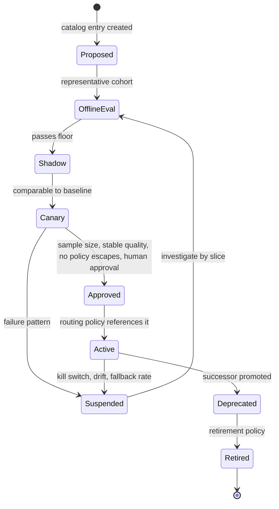
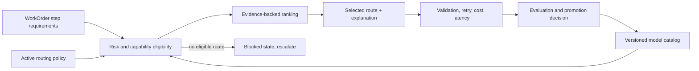
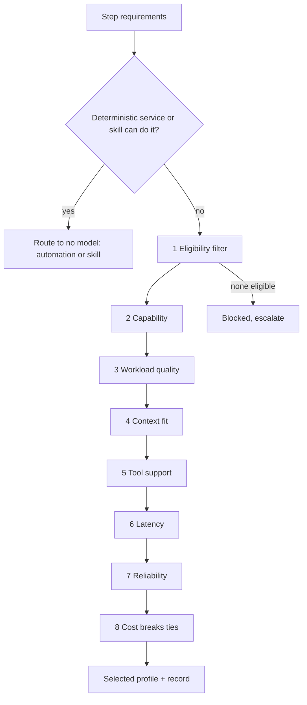
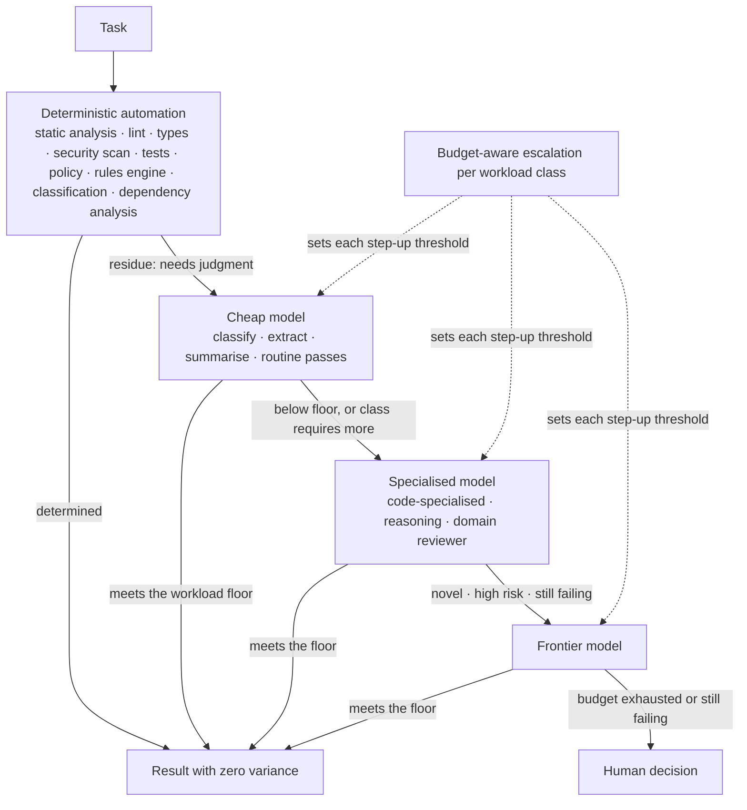
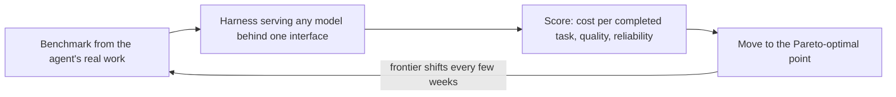
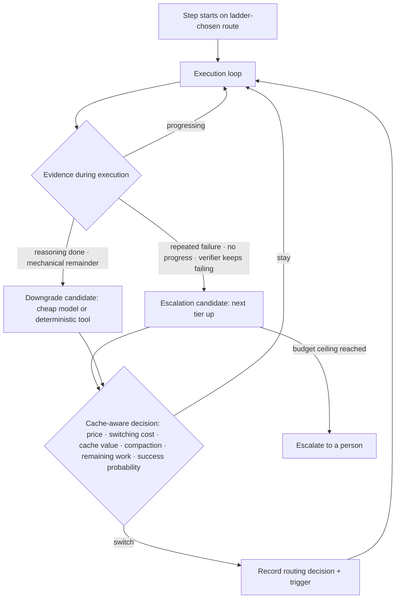

# 17. Models: routing, profiles, and capability selection

Chapter 15 established that the model is one replaceable component in an agent's composition. This chapter is about how you replace it well: how to describe a model as a versioned profile rather than a brand name, how a router chooses among qualified profiles for one step of work, how new routes are proven and rolled back, and why the human cost of switching models is a real engineering constraint rather than a preference. After reading it you should be able to design routing for a factory's operating lanes and explain every fallback that remains forbidden.

## The problem

No model is best for every factory operation. Strong models cost more and may be slower. Fast models may lack tool use, context length, reliability, or risk approval. Provider outages and rate limits make any single route fragile. And choosing purely by price or by benchmark rank can lower total system performance, because raw success hides retries, human intervention, and validation cost.

The problem persists because capability changes quickly and varies by task, tool, prompt, context, and evaluation. A provider name does not describe operational fitness. A route that is good for planning may be poor for a long-running implementation or an independent review. Practitioners already route intuitively: on the HumanLayer and BAML livestream the hosts describe using Codex for engineering execution, reaching for Opus or Fable when the work is UI or writing, and spinning up sub-agents on a different model for code writing, research, and web search inside the same harness. A factory has to make that intuition explicit, governed, and recorded.

## How it works

### Models are interchangeable execution resources

The design commitment is that the factory is **model-independent**: it works across multiple models and providers rather than being tied to one. The harness, not the model, creates production reliability, because the harness owns tools, state, permissions, recovery, stop conditions, sandboxing, and observability. The model supplies reasoning capability of a measured quality at a measured price. That makes it an execution resource, like a compute pool, and the factory should choose it the way a scheduler chooses a machine: by declared requirements, against a catalog, under policy, with a record.

**Model routing** is the act of selecting the most appropriate model for a step based on task type, complexity, cost, latency, risk, and confidentiality. **Model abstraction** is the interface that lets different models and providers sit behind one calling convention so routing is possible at all.

### Capability, not identity

Model independence begins with a change in what a workflow is allowed to ask for. It never says "use vendor X." It says: I need this level of reasoning, this much coding ability, this context size, tool use, this latency, eligibility for this data classification, this reliability, and this cost profile. Those are **model capabilities**; the vendor and version that happen to satisfy them today are **model identity**. Separate the two and the workflow stops caring which one is on the other end.

> *Models are capabilities, not architecture.*

Two components make the separation real. **Provider adapters** translate one calling convention (messages, tools, structured output, streaming, cancellation) into each provider's API, so the harness has one integration to maintain. A **capability registry** records what each profile can actually do, and it is populated by evidence rather than by the vendor's launch post.

| Registry entry | What it holds |
|---|---|
| Workload-specific evaluation results | Scores on this factory's task classes, not public benchmarks |
| Context limits | Input and output windows, and how quality behaves near them |
| Tool capabilities | Function calling, structured output, parallel calls, schema fidelity |
| Data eligibility | Which classifications, tenants, and regions the profile is approved for |
| Latency | Time to first token and throughput under real prompt sizes |
| Reliability | Error rates, rate-limit behavior, availability history |
| Economics | Price per token and, more usefully, cost per accepted outcome |

Routing should start transparent and rule-based: a human can read the policy and predict the route. It becomes adaptive only as production evidence accumulates, and only for lanes where the evidence is dense enough to trust. Models are not perfectly interchangeable; prompting, tool behavior, reasoning style, and failure modes all differ. So a switch is a re-evaluation and tuning exercise, never an architectural rewrite. If a switch requires a rewrite, the abstraction was never there. And if a switch requires no evaluation, the independence is unproven.

> *Without evaluation, model independence is architecture theater.*

### Specialisation, eligibility, and fallback

Model independence does not mean every model is the same. It means the differences are recorded where the router can read them. **Model specialisation** is the first difference: models are built and priced for different jobs, and a factory should expect to hold several kinds at once.

| Kind | What it is for | Where it usually routes |
|---|---|---|
| **Code-specialised** | Editing, completion, refactoring, and test writing with strong tool fidelity | EXECUTE, test generation, mechanical refactors |
| **Reasoning** | Long-horizon planning, ambiguous specifications, root-cause analysis | PLAN, incident diagnosis, high-risk review |
| **Frontier** | The strongest general capability available, at the highest price and often the highest latency | Novel or high-risk work pinned to the top tier |
| **Lower-cost** | Classification, extraction, summarisation, subagent tasks with well-defined inputs | Subagent default, triage, routine review passes |
| **Hosted** versus self-hosted | Provider-served models against models run inside the factory's own boundary | LOCAL lane for sensitive data; hosted for the rest |

The **model capability registry** is where those differences live, and the table above is its index. Every profile in it carries the evidence-backed fields listed earlier and three more that the router applies before anything else. **Model eligibility** is the set of task classes, data classifications, tenants, regions, and risk tiers a profile is approved for; it is a policy fact, not a capability score, and a profile that is ineligible for a step does not exist for that step. **Fallback models** are the ordered list of eligible profiles the route may fall to when the first choice is unavailable, rate-limited, or over budget, each pre-qualified for the same lane so that a fallback never relaxes capability or policy. And a **model adapter** is the per-provider translation that lets one profile be called through the factory's single calling convention; [Chapter 10](./10-the-agent-factory.md) sets the rule for it (standardise the core contract, optimise adapters at the edge), and the registry records which adapter version each profile was evaluated through, because the same model through two adapters is two configurations.

> *The model is a replaceable capability, not the architecture.*

### A model profile is the unit of selection

The router never selects "GPT-something" or "Claude-something." It selects a **model profile**, which pins everything that affects behavior: provider and model identifier; version or snapshot; region; input classes; task eligibility; system prompt; sampling settings; token limits; structured-output and tool settings; safety policy; fallback order; budgets; evaluation suite; and retirement policy. The 12-layer stack calls this **task-specific model profiles**: one profile for classification, another for generation, another for verification, each matched to what that task needs.

Two properties of a profile deserve their own attention. **Structured-output reliability** is how consistently a profile returns valid output against a schema, and it has to be measured per profile, because a model that is excellent at prose may be unreliable at strict JSON, and an agent whose tool calls fail to parse is an agent that cannot act. And a provider **alias** (a name such as "latest" that changes behavior without an exact version) is a profile with a hole in it; if you must use one, add drift monitoring and stronger admission controls.

A profile has a **configuration lifecycle** of its own.

<!-- infographic: model-profile-lifecycle -->
> **Infographic — Model profile lifecycle.** *(Jay's graphic goes here.)* Until then, the diagram below carries the same concept.

Roll out every profile change through offline evaluation, shadow comparison, bounded canary, outcome observation, and governed promotion. Preserve the prior profile and the rollback conditions. Model capability does not grant autonomy: routing selects an eligible component inside the operating system, and policy, evidence, and human accountability still govern the result.

### The router chooses among qualified profiles only

Keep three things separate. The **model catalog** records provider identity, version, tier, capabilities, availability, deprecation, risk approval, and cost estimate. The **routing policy** defines lane pools, minimum quality, fallback, budget, canary, and kill switch. A **routing decision** freezes, for one run, the inputs, the alternatives considered, the rejection reasons, the selected model, the source of the selection, and the policy version. Catalog is fact, policy is rule, decision is record.

Think of an air-traffic controller assigning a runway. The controller does not pick the closest strip; they pick the closest strip that is long enough for this aircraft, clear of traffic, within the wind limits, and open. Distance breaks ties among runways that qualify. A router works the same way: resolve the lowest-cost approved route that satisfies risk, complexity, capabilities, context, tool support, availability, latency, budget, and quality floor, and let cost break ties only among eligible routes.

<!-- infographic: model-router -->
> **Infographic — The model router.** *(Jay's graphic goes here.)* Until then, the diagram below carries the same concept.

The router evaluates ten criteria for each step. **Task type** (plan, implement, review, classify, summarize). **Capability** (tool use, structured output, multimodal input, reasoning depth). **Quality** on the evaluation suite for this task type. **Latency** against the step's budget. **Cost** per accepted outcome, not per token. **Context window** against the compiled package size. **Security and data policy** (which providers, regions, retention, and data classes are permitted for this tenant and content). **Availability** (health, rate limits, quota). **Historical task performance** on comparable work. And **fallback behavior**: what the route does when its first choice is unavailable.

That last criterion has a hard rule. Fallback may relax cost or latency. It may not relax required capability, risk approval, or policy. "No eligible model" is an actionable blocked state, not permission to use an arbitrary default. The router fails closed.

### The order of the criteria, and the answer that is not a model

The ten criteria are not weighed together in one score. They are applied in an order, and the order is the point. Routing is task-aware, not model-popularity-aware.

1. **Eligibility first.** Is this profile approved for this data classification, this tenant, this task class, this region? A profile that fails here is not "a weaker candidate"; it does not exist for this step.
2. **Capability.** Can it do what the step requires: tool use, structured output, context size, reasoning depth?
3. **Workload-specific quality.** How does it score on this factory's evaluation suite for this task type?
4. **Context requirements.** Does the compiled package fit, with headroom?
5. **Tool support.** Does it call the required tools reliably, with schema fidelity?
6. **Latency.** Does it meet the step's budget?
7. **Production reliability.** What is its error and rate-limit history on comparable work?
8. **Cost.** Among everything that survived the first seven, which is cheapest?

The result is the lowest-cost capability that reliably meets the quality, security, and latency requirements. Cost is the tie-breaker at the end, never the filter at the front.

The diagram has one branch the ten criteria do not mention. One valid routing outcome is *no LLM at all*. If a deterministic service, a lint rule, a codemod, or a mature skill produces the outcome reliably, the router should send the step there, at zero model cost and with a deterministic result. A factory that reaches for a model by reflex is spending money to add variance.

> *The best model for some tasks is no model at all.*

### The routing dimensions and the workload taxonomy

The ordered criteria above are one way to read the router. Another is by the dimension each rule is *aware of*, which is the vocabulary a routing policy is written in. Eight dimensions cover a factory's policies, and a policy that names which of them it uses is one a human can audit.

| Routing dimension | The question it asks | What it reads |
|---|---|---|
| **Capability-aware** | Can this profile do what the step needs? | Registry: tool use, structured output, context, reasoning depth |
| **Complexity-aware** | How hard is this instance of the task? | Workload class, change size, dependency impact, novelty, prior failures |
| **Risk-aware** | What happens if the answer is wrong? | Risk tier from the WorkOrder and repository profile |
| **Cost-aware** | What does an accepted outcome cost on this route? | Cost per accepted outcome, budget remaining |
| **Quality-aware** | Does this route meet the floor for this workload? | Workload-specific evaluation results |
| **Latency-aware** | Does it fit the step's time budget? | Measured time to first token and throughput at real prompt sizes |
| **Security-aware** | May this content go to this provider, region, and retention policy? | Data classification, tenant, residency, provider terms |
| **Fallback** | What happens when the chosen route is unavailable? | Ordered fallback models, all pre-qualified for the lane |

Complexity-aware routing depends on knowing what kind of work a step is, and that is the job of the **workload taxonomy**: a classification of every task the factory runs into workload classes, each with a default lane, a quality floor, an eligible model tier range, and a typical budget. A first taxonomy is short: classify, extract, summarise, retrieve-and-answer, generate code, refactor mechanically, write tests, review for one finding class, plan, diagnose an incident. The taxonomy is what turns "route by task type" from a slogan into a lookup, and it is where **budget-aware escalation** is defined: for each class, the point at which a cheaper route's failure justifies spending on the next tier, and the point at which no further spend is justified and the step escalates to a human instead.

Three mechanisms prove a route before it carries production work, and all three produce records. **Shadow mode** runs a candidate profile on the same inputs as the active route without its output being used, so that the two can be compared on real work at no risk. **Canary evaluation** gives the candidate a bounded share of live steps in one lane, with a frozen baseline, a minimum sample, and a stop condition, and promotes it only on stable quality, no policy escapes, and human approval. The **routing policy** is the versioned document those decisions change: lane pools, floors, fallback chains, budgets, canary rules, and the kill switch, with a diff between versions that an operator can read.

And every route taken leaves a **routing trace**: the routing decision record (inputs, candidates, rejection reasons, selected profile, source, policy version) joined to what happened next (usage, latency, fallback events, validation result, acceptance). A routing decision alone says what the router chose; a routing trace says whether it was right, and it is the raw material of every promotion decision above and of the cost attribution in [Chapter 8](../02-design/08-economics-metrics-and-human-attention.md). The question the whole apparatus exists to answer, for every step, is one sentence:

> *What is the cheapest capability that reliably satisfies this task's quality, security, latency, and risk requirements? It need not be an LLM.*

### Deterministic automation and the escalation ladder

The last clause of that question deserves its own section, because the reflex it corrects is the most expensive habit a factory can have: sending everything to the frontier model. Most of what a software change needs to know about itself can be determined by software that already exists and never hallucinates. **Deterministic automation** is the practice of running that software first, and **deterministic preprocessing** is the specific step of running it before any model is consulted, so that the model, if one is needed at all, receives facts rather than raw material.

The preprocessing set is familiar because every mature engineering organisation already runs it in CI; the factory moves it to the front of the agent's path and treats its output as classified input. Static analysis and linting find the defects that have names. Type checking settles what the compiler can settle. Security scanning flags known patterns and vulnerable dependencies. The existing test suite reports what already breaks. Policy checks and a **rules engine** apply the organisation's stated rules, from "no secrets in source" to "this path requires a security reviewer", as decisions rather than opinions. **Change classification** labels the change by kind, size, and touched boundaries. **Dependency analysis** computes the impact set from the changed symbols. The result is a task that is smaller, better labelled, and often already answered.

*Don't spend inference on what software can determine reliably.*

What remains climbs an **escalation ladder**, and the ladder runs in one direction: cheapest reliable capability first, frontier last, with a recorded reason for every step up.

<!-- infographic: escalation-ladder -->
> **Infographic — The escalation ladder.** *(Jay's graphic goes here.)* Until then, the diagram below carries the same concept.

Read the ladder as *Deterministic → cheap model → specialised model → frontier model*, not *everything → frontier*. Each rung has a condition for stepping up, set per workload class by the taxonomy, and a budget beyond which the step up is refused and the work goes to a person. The ladder is also why deterministic capabilities belong in the Agent Factory's registry with the same envelope as skills ([Chapter 10](./10-the-agent-factory.md)): a linter with a version, an owner, and a certification scope is a rung the router can resolve to; a linter someone remembers to run is not.

The cost consequence is large and easy to state. On the ladder, frontier inference is spent on the fraction of work that needs it; off the ladder, it is spent on all of it, and the variance comes free. A code-review pipeline that runs static analysis, classification, and dependency impact first, then a cheap pass for routine findings, then a specialised reviewer only on the risky subset, will typically send a small minority of its pull requests to a frontier model and produce fewer false findings on the rest, because most of what the frontier model would have "found" was already a fact.

### Token economics is an architecture problem

Token spend is usually handed to finance as a bill to be explained. It is better treated as an architecture signal, because the cheapest model is rarely the cheapest system. Consider a cheaper profile that needs three attempts to pass validation and then costs a senior engineer thirty to forty-five minutes of rework. One successful run on a stronger profile would have cost less, even at several times the token price, once retries, validator runs, and human attention are counted. The unit that matters is **cost per trusted outcome**: everything spent, including human time, divided by outcomes that were accepted and stayed accepted.

> *Cost per trusted outcome, not cost per token.*

The levers are structural rather than negotiated.

| Lever | What it does to cost per trusted outcome |
|---|---|
| Smaller models for simpler work | Removes premium reasoning from steps that do not need it |
| Strong models only where reasoning creates value | Concentrates spend where a wrong answer is expensive |
| Deterministic automation | Removes the model, and its variance, from steps that have stabilized |
| Targeted retrieval | Shrinks the context each call pays for |
| Caching | Avoids paying twice for identical, policy-safe work |
| Bounded loops | Stops the third identical retry before it happens |
| Explicit budgets and stopping conditions | Turns runaway spend into a recorded stop |
| Avoiding unnecessary multi-agent coordination | Removes hand-off tokens and duplicate context |
| Measuring human rework | Makes the hidden half of the cost visible |
| Attributing cost by team, workflow, model, and outcome | Shows which lever to pull next |

**Budgets** and **stopping conditions** are first-class execution controls, not reporting fields: tokens, model spend, tool calls, execution time, retries, and compute, each with an objective limit so a stuck agent does not reason indefinitely. And budget data is feedback for the router. A skill that costs five times as much as another for the same accepted outcome should lose routing weight, and the difference should show up in the improvement queue.

> *Economics should influence architecture continuously, not arrive as a surprise on the monthly bill.*

### Operating lanes

A factory routes by **lane**, a pool of profiles bound to a kind of work. Five cover most of it: PLAN (reasoning over intent and design, tolerant of latency), EXECUTE (long implementation with tool use and structured output), REVIEW (independent verification, ideally on a different provider or method than EXECUTE), LOCAL (small or self-hosted models for classification, redaction, and sensitive data that must not leave the boundary), and LONG_RUNNING (profiles selected for stability, cost, and checkpoint-friendly behavior over hours). High-risk or large work is pinned to the most capable tier regardless of cost.

Validator independence is a routing decision. Running implementer and validator through the same model, prompt family, and context invites correlated failure: the same blind spot approves its own work. Depending on risk, independence may require a different provider, a different method, different tools, or deterministic verification instead of a second model. Not every lane needs the same provider diversity, but REVIEW does.

### Evaluate the complete configuration

A model evaluation is not portable without its prompt, tools, context, temperature, runtime, and verifier. Evaluate routes on representative WorkOrder cohorts and measure criterion-level validation, retry-free completion, human acceptance, latency, cost, policy compliance, and failure severity. Benchmark scores are useful priors; they are not promotion evidence. New routes begin on a small comparable cohort. Promotion requires a minimum sample size, stable quality, no critical policy escapes, and human approval. Suspend on defined failure patterns and keep the prior policy for rollback. [Chapter 23](../04-prove/23-evaluation-engineering.md) covers the evaluation program itself.

### Benchmark-driven, Pareto-optimal selection

The evaluation rule above has a practical form that one large engineering organisation has published for every managed agent it runs, and it is the same four steps each time. First, **build a benchmark from the agent's own real work**: not a public leaderboard, but the pull requests, alerts, or tickets that agent actually handles, with known-good answers. Second, **run the agent on a harness that serves any model behind one interface**, frontier or open-weight, so that a model change is a configuration change and the comparison is fair. Third, **score cost per completed task, output quality, and reliability**, together, on that benchmark. Fourth, **move to whatever is Pareto-optimal and keep moving**, because the frontier of price against quality shifts every few weeks and a choice that was optimal in spring is a legacy default by autumn.

The worked example is that organisation's AI code-review agent, which reviews every pull request. Its benchmark is a set of real PRs with known bugs, graded easy, medium, and hard. The scores are precision, recall, and F1 on the bugs found, plus cost per review, latency, timeout rate, and noise (findings a reviewer would dismiss). Ten model-and-harness configurations were plotted on cost against F1. The production choice was the configuration with the best F1 of the ten at about a fifth of the price of the most expensive one: not the cheapest, not the strongest by reputation, but the point on the frontier where quality stopped rising with price. The detail that matters most for this chapter is that *the same model in two different harnesses was 2.4× apart on price alone*. The harness decides how many turns, requests, and tokens a task takes; the model decides the price of each. A benchmark that scores only the model has measured half the system. An internal software-engineering benchmark over thousands of real PRs informs selection across all of that organisation's managed agents, which is the evaluation suite the registry entry above asks for, populated at scale.

> *Cost per outcome, never cost per token.*

Two disciplines follow. The first is to **hold the model constant to measure your own gains**. If the model changes at the same time as the harness, the defaults, or the context, nobody can say which change did what. The published unit-cost improvements in [Chapter 8](../02-design/08-economics-metrics-and-human-attention.md) were measured with the model fixed for that reason, and every factory should be able to make the same separation: this much from routing, this much from the loop, this much from the vendor.

The second is that **default model selection is routing policy**, and for interactive work two defaults govern most of the token distribution: the model an initial session starts on, and the model a subagent starts on. The subagent default is the more powerful lever and a growing one. A subagent does a well-defined task with specified inputs, and rarely needs frontier reasoning; the primary model decomposes and evaluates, subagents execute. So subagents default to a weaker, cheaper profile, with an override for the cases that need more. In this chapter's terms, that is a lane pool with a cheaper default and a documented escalation path, and it belongs in the routing policy rather than in each engineer's configuration ([Chapter 18](./18-agent-and-loop-engineering.md) holds the loop-level defaults that sit beside it).

Where this leads is **dynamic routing**: selecting the model per task from language, repository, modality, and history rather than per lane. That organisation lists it as roadmap, not as something it runs, and the ordering matters. Dynamic routing is safe only after the benchmark, the model-agnostic harness, and the per-agent scoring exist, because a router without them is choosing on folklore. It is the "learned routing" of the styles weighed below, and it waits for the evidence.

### Agent effectiveness, not leaderboard rank

The benchmark-from-real-work method has a name for what it measures, and the name is worth keeping because it names what a leaderboard does not. **Agent effectiveness** is the measured ability of a configuration — model, harness, profile, context, and tools together — to achieve accepted outcomes across the real workload at acceptable quality, latency, and cost. The question is "which configuration works on our work," and a public leaderboard cannot answer it, because it ranks models on tasks that are not yours, in a harness that is not yours, with no verifier and no reviewer in the loop. A model that leads a coding leaderboard by three points can trail on a factory's own migration tasks by twenty, and the only way to know is to run it there.

What "our work" means is the **workload distribution**: the actual distribution of task types, complexity, risk, domains, and recurring patterns the factory runs, measured from its own history rather than assumed. The workload taxonomy above is the classification; the distribution is the weights — how much of the work is routine test repair, how much is cross-service refactoring, how much touches security boundaries. The distribution is the routing target. A router tuned on an evenly weighted benchmark optimises for a factory that does not exist; a router tuned on the distribution puts its accuracy where the volume is and its spend where the risk is. It is also what turns the Pareto rule into a policy: **Pareto-optimal routing** is the lowest-cost route that satisfies the quality, security, latency, and risk requirements *for each class in the distribution*, and the frontier is drawn per class, not once for the whole factory.

### Adaptive routing during execution

Everything above routes before a step begins. The ladder climbs at the start of a step and the routing decision is frozen into the Attempt. But a step is not one model call; it is a loop with dozens of them, and the evidence about whether the chosen capability is enough arrives while the loop runs. **Dynamic intelligence escalation** upgrades the model mid-execution when that evidence shows the current capability is unlikely to succeed — repeated errors with no strategy change, a plan that keeps being revised, a verifier failing on the same claim — moving cheap → specialised → frontier without discarding the work done so far. Its mirror is **intelligence downgrading**: once a strong model has done the reasoning, it hands the mechanical remainder — applying the plan across forty files, writing the boilerplate tests, formatting — to a cheap model or a deterministic tool. Together they are **adaptive model routing during execution**, and they replace a single up-front bet with a sequence of smaller ones.

The naive form is a trap, and the trap has a name. A model call carries state: the prompt cache, the compacted context, the working memory of what the loop has learned. Switching models can destroy that state, and the cheapest model is not cheapest if the switch costs a full re-read of the repository and a compaction pass. **Cache-aware routing** puts six inputs into the mid-execution decision instead of one:

| Input | What it asks |
| --- | --- |
| Candidate price | The raw per-token cost of the route the naive router would pick |
| Switching cost | What is lost when the route changes: cache, compacted context, in-flight tool state |
| Cache value | How much of the current context is cached and would be paid for again |
| Compaction cost | The tokens and quality lost to summarising the window for a new model |
| Expected remaining work | How much of the step is left to pay for on either route |
| Success probability | How likely each route is to finish without another escalation |

The decision is the expected cost to a verified outcome on each route, given all six, and it often says "stay" where price alone says "switch." Every escalation and downgrade is a routing decision in its own right, recorded in the routing trace with the evidence that triggered it, so that the meta-loop of [Chapter 33](../06-improve/33-governed-learning-and-compounding-engineering.md) can later see which triggers were worth acting on.

<!-- infographic: adaptive-routing -->
> **Infographic — Escalate, downgrade, stay: routing while the loop runs.** *(Jay's graphic goes here.)* Until then, the diagram below carries the same concept.

### The intelligence budget and parallel candidates

The ladder and the adaptive router decide route by route. Above them sits an allocation the factory should be able to state before any route is chosen: the **intelligence budget**, the amount and class of reasoning a piece of work is allotted according to its complexity, risk, and value. Four examples fix the scale. Renaming a variable across a module gets a cheap model or a codemod. A bounded feature inside an existing module gets a specialised code model. A cross-system architectural change gets a frontier model. A security-critical migration gets a frontier model *and* multiple independent validators, because here the budget buys verification as well as generation. The budget is set by the risk tier of [Chapter 7](../02-design/07-governance-policy-and-risk-proportional-approval.md) — risk determines verification depth and model spend — and the tier is why a rename never reaches the frontier and a migration never runs on the cheap route to save money.

At the top of the budget is a technique that is easy to over-use. **Parallel candidate execution** runs several independent agents on the same problem and then selects, combines, or verifies the results. It raises the chance of a good candidate at the cost of multiplying inference, and it adds a selection step that is itself a judgment. It is worth it in one condition: when the value of the outcome clearly exceeds the multiplied inference cost — a hard design problem, an incident where an hour matters, a migration whose failure costs more than ten runs. It is not worth it as a default, and a factory that runs three candidates for every step has tripled its bill to raise its success rate on work that one candidate was already passing. The with/without evaluation of [Chapter 23](../04-prove/23-evaluation-engineering.md) is the test: measure the marginal value of the extra candidates per workload class, keep the technique where the ratio is high, and remove it where it is not. Parallel candidates are also a place where correlated failure hides; three runs of the same model on the same context are not three opinions, and a selection among them is not independent verification.

### Opinionated defaults, open contracts

Two design commitments hold the whole chapter together, and they pull in opposite directions on purpose. The first is **opinionated defaults**: the factory ships strong defaults for its common workflows — the lane pools, the subagent model, the escalation thresholds, the intelligence budget per tier — so that a builder never has to choose a model to get good work. The second is **open contracts**: everything those defaults are made of — the calling convention, the tool schemas, the skill format, the context package, the state records, the verification contract — is portable, so that a default can be replaced without rewriting anything that depends on it. Defaults are where the factory's opinion lives; contracts are what keep the opinion from becoming a dependency.

Behind both is a design assumption that this chapter has been making since its first section, and it is better stated than implied. **Intelligence commoditisation** is the expectation that differentiation moves away from raw model access and toward the systems that apply intelligence — context, workflow, harness, verification, integration, data, policy, learning, and adoption. It is an assumption, not a certainty; models may keep differentiating for years. But a factory designed as if the model were the moat is fragile in exactly the way this chapter has been describing: it names a vendor, it cannot switch, and its advantage expires with the next release. A factory designed as if intelligence were a commodity treats every model as a profile in a catalog, invests in the harness and the verifiers that are its own, and is not surprised when the frontier moves. If the assumption turns out wrong, that factory has still lost nothing; if it turns out right, it is the only kind that survives.

### The hidden cost of switching models

The livestream conversation surfaced a constraint that catalogs and policies do not capture. A model is not only a capability; it is a workflow that a human has learned. One host had tried and failed to move his team wholesale from one model to another, because the way a person works with a model is personal. Some engineers plan hard up front and remove roadblocks before starting; others iterate. Neither is wrong, and forcing either to work the other way makes them slower and unhappier. Each model has its own tweaks and nuance to learn, and the analogy the hosts reached for was switching keyboards: after moving to a Kinesis, one of them felt he had lost three months before his hands caught up. The productivity dip is real, and the payoff is intuition, not output.

That gives the factory four terms it should treat as **model-switching ergonomics**. **Model-workflow fit** is how well a model's behavior matches a task and the way a person works on it. **Model-switching cost** is the productivity and intuition lost while a person or a team relearns a model's habits. A **user workflow profile** captures a builder's preferred planning style, models, and interaction patterns so that routing for interactive work respects it rather than overriding it. **Prompt portability** is how much of a prompt, skill, or instruction bundle survives a move between models without rework, and it is the lever that makes switching cheaper.

The practical consequence is that routing policy for autonomous lanes can change freely under evaluation, but routing that a human interacts with directly should change deliberately, with prompt portability tested and the switching cost budgeted like any other migration.

## How to build it

1. Build the catalog first. Register each profile with provider, model, exact version or snapshot, region, tier, capabilities, input classes, task eligibility, availability, deprecation, risk approval, cost estimate, evaluation suite, fallback order, and retirement policy.
2. Define lanes and policy. For each lane, set the pool, quality floor, budget, fallback chain, canary rules, and kill switch. Pin high-risk work to the powerful tier.
3. Implement the resolver as deterministic code. Filter out deprecated, unavailable, rate-limited, unapproved, incapable, and over-budget profiles; then rank the remainder by evidence; then let cost break ties.
4. Fix the precedence of overrides: authorized run override, then matching policy rule, then lane pool, then workflow tier, then agent override, then workspace defaults, then safe fallback.
5. Record every routing decision with inputs, candidates, rejection reasons, selected profile, exact version, source, policy version, and usage, and store it against the Attempt's execution manifest.
6. Roll out changes through offline evaluation, shadow, canary, outcome observation, and human promotion. The operational rule Mission Control's guide uses is the first 25 comparable runs and seven days after activation, with canary suspension, fallback-rate rollback, and provider-diversity stops.
7. Measure per lane: validation pass rate, retry-free completion, human acceptance, latency, token cost per accepted outcome, fallback rate, and policy escapes. Slice by task type and risk.
8. Maintain user workflow profiles for interactive lanes and test prompt portability before any model change reaches builders.

Weigh the routing styles with open eyes. Static routing is predictable but ages quickly. Dynamic routing adapts to availability and cost but needs trustworthy catalog data and explanations. Learned routing may outperform rules once enough comparable outcomes exist; before that it amplifies sparse or biased data. Multi-provider resilience improves continuity and independence at the cost of integration, privacy, and procurement burden.

## Failure modes

| Failure | Detection | Response |
|---|---|---|
| Provider outage or rate limit | Health probe, error class | Approved equivalent fallback or explicit pause; record the changed profile |
| Quality drift on an alias | Slice evaluation, drift monitor | Restrict the profile, route to the previous exact version, investigate by slice |
| Cost spike | Budget telemetry | Admission and budget control; never bypass safety validation to save tokens |
| Weak canary | Below floor on comparable cohort | Suspend, keep the prior policy, do not extend the cohort to chase a result |
| Correlated validator failure | Same-provider implementer and reviewer | Enforce provider or method diversity in REVIEW |
| Fallback relaxes capability or policy | Decision record review | Treat as a policy defect; fail closed instead |
| Structured-output failures | Parse-error rate per profile | Bounded schema repair; lower the profile's eligibility for tool-heavy lanes |
| Routing by benchmark alone | Promotion without cohort evidence | Require representative-cohort results and human approval |
| Silent model swap for interactive work | Builder complaints, acceptance drop | Respect user workflow profiles; migrate with portability tests |
| Cheapest token price chosen as the filter | Retry count and human rework climb while model spend falls | Rank by cost per trusted outcome; cost breaks ties after eligibility and quality |
| Workflow names a vendor | Switching a provider requires code changes | Request capabilities through the registry; fix the adapter, not the workflow |
| Model used where automation would do | Variance on a deterministic step; spend with no judgment involved | Route to a deterministic service or skill; the best model for some tasks is no model |
| Agent reasons indefinitely | Budget telemetry; no progress against acceptance criteria | Objective stopping conditions on tokens, spend, tool calls, time, and retries |
| Independence claimed without evaluation | A switch breaks prompts and tool behavior in production | Re-evaluate and tune on the workload suite before any switch; treat unproven independence as unproven |
| Model benchmarked without its harness | Two harnesses on the same model differ severalfold in cost per task and the difference is invisible | Benchmark model-and-harness configurations together; score cost per completed task, quality, and reliability |
| Frontier choice left to age | A configuration chosen months ago is still the default while cheaper points on the price-quality frontier have appeared | Re-run the benchmark on a cadence; treat Pareto-optimal as a moving target |
| Gains measured while the model moved | Routing, defaults, and vendor changes land together and the improvement cannot be attributed | Hold the model constant when measuring your own optimisations |
| Subagents on the primary model | Well-defined subtasks run on frontier reasoning by default | Set a cheaper subagent default in routing policy with an explicit override |
| Dynamic routing before evidence | A learned router selects on sparse or biased data | Benchmark, model-agnostic harness, and per-agent scoring first; dynamic routing after |
| Everything to frontier | Frontier share of steps near 100 percent; findings the linter already reported | Deterministic preprocessing first; climb the escalation ladder with a recorded reason per step |
| Workload unclassified | Routing rules keyed on agent name or lane only; complexity invisible | A workload taxonomy with class, floor, tier range, budget, and escalation thresholds |
| Route without a trace | Decisions exist, outcomes are elsewhere; promotion argued from anecdote | Join every routing decision to usage, fallback events, validation, and acceptance as a routing trace |
| Fallback list unqualified | The fallback model was never evaluated for the lane it falls into | Pre-qualify every fallback profile for the same lane and eligibility as the primary |
| Specialisation ignored | A reasoning model runs mechanical edits; a code model plans an incident response | Registry records specialisation; workload classes map to kinds |
| Routed by leaderboard | The model that tops a public ranking underperforms on the factory's own migrations | Measure agent effectiveness on the workload distribution; draw the Pareto frontier per class |
| Route frozen for the whole loop | A cheap model fails the same claim five times and the step runs to its budget before anyone escalates | Dynamic intelligence escalation on in-loop evidence; downgrade the mechanical remainder |
| Switch destroys the cache | The router moves to a cheaper model mid-step and pays for a full re-read and compaction | Cache-aware routing: price, switching cost, cache value, compaction cost, remaining work, success probability |
| Parallel candidates by default | Three candidates per step triple the bill on work one candidate was passing; the selection among them is mistaken for verification | Reserve parallel candidate execution for outcomes whose value exceeds the multiplied cost; measure with/without per class; never count correlated candidates as independent |
| Vendor as moat | The factory's advantage is a model contract that expires with the next release | Opinionated defaults over open contracts; design as if intelligence were a commodity and invest in harness, context, and verification |

## In Mission Control

At commit [`b31e275`](https://github.com/jaydubya818/MissionControl/tree/b31e27564deb1c03c167e61b5ee094567c2ba7b1), Mission Control has model catalog records, versioned routing policies, lane pools, rules, fallback chains, per-agent and per-run overrides, canaries, budgets, a kill switch, routing decisions, and selection explanations. This is implemented.

The pure resolver filters deprecated, unavailable, rate-limited, unapproved, incapable, and over-budget models. High-risk or large work requires the POWERFUL tier. Candidate precedence is authorized run override, matching policy rule, lane pool, workflow tier, agent override, workspace defaults, then safe fallback. Context evaluations compare candidates against baselines, and the operating guide recommends the first 25 comparable runs and seven days after activation, canary suspension, fallback-rate rollback, and provider-diversity stops.

**Partial.** It is not yet an outcome-trained router. Provider identities and prices include generic routes, automatic canary suspension is a roadmap item, normalized outcome feedback is incomplete, and some health and cost signals are proxy data. **Future.** Routing should use normalized validation receipts and production outcomes to estimate quality-adjusted cost with confidence intervals, detect drift, suspend canaries automatically under approved rules, model provider capacity, and expose policy diffs and rollback. Human promotion remains required. User workflow profiles and prompt-portability testing are not present in the pinned commit.

## Retain this

- Models are interchangeable execution resources, not architecture; the harness creates reliability. Workflows request capabilities, never a vendor name — provider adapters and an evidence-backed capability registry supply identity, and without evaluation that independence is architecture theater.
- The unit of selection is a model profile that pins provider, exact version, region, eligibility, prompt, sampling, limits, structured-output and tool settings, safety policy, fallback, budgets, evaluation suite, and retirement. Catalog is fact, policy is rule, decision is record — freeze the decision with the Attempt.
- Apply the routing criteria in order — eligibility, capability, workload quality, context, tool support, latency, reliability, then cost — and let cost break ties only among eligible routes. Fallback may relax cost or latency, never capability or policy; no eligible route is a blocked state, not a default; one valid outcome is no model at all.
- Optimize cost per trusted outcome, not cost per token: benchmark model and harness together on the agent's own real work, score cost per completed task with quality and reliability, and move to the Pareto-optimal point as it shifts. Hold the model constant to measure your own gains.
- Don't spend inference on what software can determine reliably. Deterministic preprocessing runs first; the residue climbs Deterministic → cheap model → specialised model → frontier model, never everything → frontier — and measure agent effectiveness against the real workload distribution, not leaderboard rank.
- Route while the loop runs: escalate on evidence of failure, downgrade the mechanical remainder, and decide each switch cache-aware — price, switching cost, cache value, compaction cost, remaining work, success probability. The cheapest model is not cheapest if the switch destroys the context.
- Set an intelligence budget by complexity, risk, and value, and prefer opinionated defaults over open contracts: assume intelligence commoditises — differentiation lives in context, workflow, harness, verification, and data — and design so that being wrong about it costs nothing.

## Go deeper

- Related chapters: [15. Agent architecture](./15-agent-architecture.md) for the model literacy table and the execution manifest; [18. Agent and loop engineering](./18-agent-and-loop-engineering.md) for sub-agents on different models; [23. Evaluation engineering](../04-prove/23-evaluation-engineering.md); [33. Governed learning](../06-improve/33-governed-learning-and-compounding-engineering.md) for promotion gates; [29. Resilience](../05-operate/29-resilience-incidents-and-the-control-tower.md) for provider failover.
- Mission Control at `b31e275`: [routing resolver](https://github.com/jaydubya818/MissionControl/blob/b31e27564deb1c03c167e61b5ee094567c2ba7b1/convex/lib/modelRouting.ts), [routing policies](https://github.com/jaydubya818/MissionControl/blob/b31e27564deb1c03c167e61b5ee094567c2ba7b1/convex/modelRoutingPolicies.ts), [routing decisions](https://github.com/jaydubya818/MissionControl/blob/b31e27564deb1c03c167e61b5ee094567c2ba7b1/convex/modelRoutingDecisions.ts), [context evaluations](https://github.com/jaydubya818/MissionControl/blob/b31e27564deb1c03c167e61b5ee094567c2ba7b1/convex/context/evals.ts), [operating standard](https://github.com/jaydubya818/MissionControl/blob/b31e27564deb1c03c167e61b5ee094567c2ba7b1/docs/software-factory/MODEL_ROUTING_OPERATIONS.md).
- Sources: HumanLayer × BAML livestream, "Software factory design patterns" (routing by task, sub-agents by model, the hidden cost of switching models); Jay West, "Factory in one line" notes (models as interchangeable execution resources; the ten router criteria); Jay West, factory architecture notes (capability versus identity, the capability registry, ordered routing, the no-model outcome, token economics and budgets, model specialisation and eligibility, fallback models, the eight routing dimensions, the workload taxonomy, shadow mode and canary evaluation, routing traces, deterministic preprocessing, and the escalation ladder); the 12-layer production AI agent stack (Model Engineering: task-specific profiles, configuration lifecycle, structured-output reliability, model-switching ergonomics); the AI Software Factory study guide, chapter 6 (model routing).
- Public sources: Uber Engineering, *Running a Software Factory Efficiently at Uber Scale* (2026) for the four-step benchmark-driven selection method, the code-review agent example and its Pareto plot, the subagent default model, and dynamic routing as roadmap; *Six layers of a working agentic system* (public post, 2026) for the rule that a model swap is one configuration change because no vendor is hardcoded; public practitioner talks, 2026, for agent effectiveness and the workload distribution, Pareto-optimal routing per class, dynamic intelligence escalation and downgrading, cache-aware routing, the intelligence budget, parallel candidate execution, opinionated defaults with open contracts, and intelligence commoditisation as a design assumption.
- Where the tier that sets the intelligence budget is defined: [7. Governance, policy, and risk-proportional approval](../02-design/07-governance-policy-and-risk-proportional-approval.md). Where the with/without test for parallel candidates lives: [23. Evaluation engineering](../04-prove/23-evaluation-engineering.md).
- [Glossary](../appendix/glossary.md).
