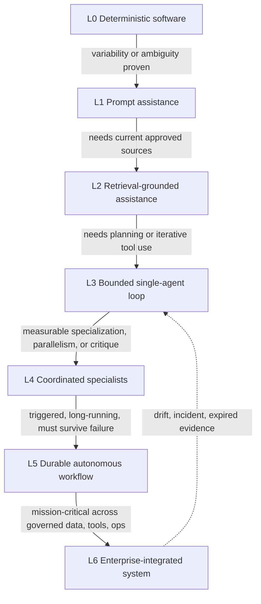
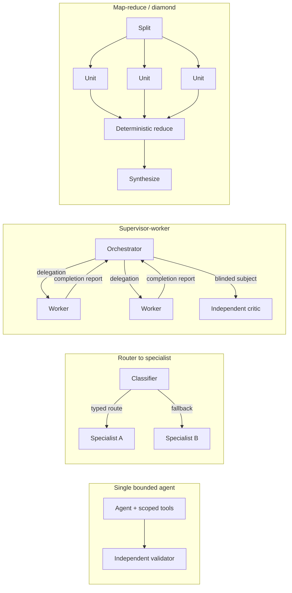
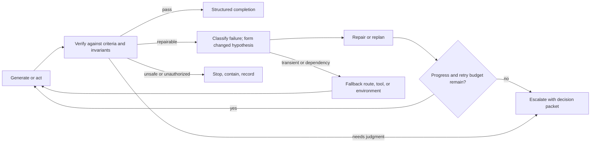

# 18. Agent and loop engineering

An agent can reason, act, observe, and continue. That is enough for a demo and not nearly enough for a factory. Production work needs decisions the model cannot make for itself: which tasks deserve an agent at all, which agent configuration is eligible, whether one agent or several should be involved, what happens after a failed attempt, and when continuing is wasteful or unsafe. This chapter covers the two disciplines that answer those questions. **Agent engineering** orchestrates agents, tools, state, and conditional routing. **Loop engineering** controls what happens after every attempt: verify, correct, retry, stop, or escalate. After reading it you should be able to pick the minimum sufficient architecture for a task, draw the work as a graph, write the contracts that let several agents collaborate without pretending to be independent, and define the stop conditions that keep a loop honest.

## The problem

The bottleneck in software engineering is no longer intelligence; it is human attention. Luke, who started the Goose project at Block and now leads a core agent harness at Factory, puts it plainly: an engineer with fifty items in the backlog can push a handful forward per day, because every task needs attention and every commit needs review. Today's models could attempt all fifty; there is not enough human bandwidth to supervise them. So what if a human decides what to build and a system figures out how, working for hours or days while the human does something else?

That question is where agent and loop engineering begins, and where most attempts go wrong. Without explicit patterns, multi-agent systems become role-play: several prompts on one model, sharing one context and the same blind spots, agreeing with each other and calling it review. Retries repeat the same mistake with the same inputs. Validators quietly repair the work they were supposed to judge. The factory optimizes activity instead of convergence.

Two facts explain why. Models are good at ambiguous interpretation and generation; deterministic code is better at schema validation, state transitions, policy, arithmetic, hashing, and repeatable routing, and agent engineering fails when responsibilities are assigned by novelty rather than fitness. And loop failures are invisible from a single turn: an agent may oscillate between two fixes, regenerate the same output, consume budget without reducing uncertainty, or declare completion after a tool failure. Only a loop that keeps state, measures progress, classifies retries, and answers to an external stop authority can see any of that.

## How it works

### Use the least agentic mechanism that solves the problem

Every increase in autonomy adds state, permissions, evaluation, cost, uncertainty, security exposure, and recovery obligations. The right habit is to start from the outcome and eliminate simpler eligible designs only with evidence. Think of it as choosing a vehicle for a delivery: a bicycle courier is not a lesser version of a freight train, it is the correct choice for a package across town, and you only pay for the train when the load demands it.

The **selection ladder** runs from fully deterministic to enterprise-integrated. It is a decision ladder, not a maturity score; a lower level is often the correct production architecture.

<!-- infographic: autonomy-selection -->
> **Infographic — Minimum-sufficient autonomy selection.** *(Jay's graphic goes here.)* Until then, the diagram below carries the same concept.



| Level | Pattern | Suitable problem | State and authority | Verification and oversight |
| --- | --- | --- | --- | --- |
| 0 | Deterministic software or fixed automation | Stable rules and known inputs | Explicit state; fixed service authority | Unit and contract tests; normal change control |
| 1 | Prompt-and-response assistance | Drafting, explanation, low-impact recommendation | Session only; no direct side effects | Human evaluates every consequential output |
| 2 | Retrieval-grounded assistance | Answers need current approved sources and citations | Query and context record; read-only source access | Permission, freshness, citation, faithfulness checks |
| 3 | Bounded single-agent tool loop | Complex task needs planning or iterative tool use | Attempt state, scoped tools, budgets, stop conditions | Independent validators and a human gate for consequence |
| 4 | Coordinated multi-agent specialization | Distinct specialties, parallel work, or independent critique are measurably useful | Durable delegations, shared-state contracts, bounded child authority | Correlation controls, join policy, disagreement resolution |
| 5 | Durable autonomous workflow | Triggered, long-running process must survive failures and queues | Persistent graph, leases, retries, reconciliation, gates | SLOs, incident control, evidence, human intervention |
| 6 | Enterprise-integrated factory system | Mission-critical use across governed data, tools, delivery, and operations | Inventory, identities, policy, tenancy, lifecycle, continuity | Full governance, control testing, monitoring, recertification |

Each level carries its own contract. Levels 0 to 2 keep stable rules in code, label prompt outputs as proposals with source disclosure, and give retrieval a source registry, permission filtering before ranking, exact citations, freshness, contradiction handling, and revocation; memory is unnecessary unless a measured cross-session need exists. Level 3 freezes model, prompt, context, skills, tools, policy, budgets, and quality contract; persists attempt state outside the model; restricts tools by resource and side effect; stops on acceptance, attempts, tool calls, time, tokens, cost, no improvement, denial, cancellation, or dependency failure; and puts a human in front of consequential results with independent evidence. Level 4 adds agents only for a measurable specialization, parallelism, or assurance reason, with delegation, context, authority, handoff, join, disagreement, partial-result, and correlation contracts. Level 5 adds triggers, admission, a queue, a durable graph, leases, idempotency, reconciliation, pause/cancel/quarantine, SLOs, on-call ownership, and evidence gates; autonomy applies to a bounded workflow, never an unrestricted goal. Level 6 adds governed inventory, workload identity, tenancy, policy decision points, capability and knowledge lifecycles, data classification, independent assurance, delivery and rollback, incident response, continuity, cost attribution, supplier controls, and recertification.

To move up a level, answer ten questions: which capability is impossible or materially worse below; what variability, ambiguity, or scale justifies probabilistic behavior; which tools and side effects are required and whether authority can be narrower; which state survives a crash, replay, or pause; how correct behavior, failure sensitivity, and accepted outcomes are evaluated; what evidence and human decision precede consequence; what the latency, capacity, cost, and attention budgets are; which new failure and attack modes appear; what the fallback to a lower level is; and what evidence would justify more autonomy later. If the higher level cannot show measurable benefit against the simpler baseline, reject it.

Promotion is earned with baseline-versus-candidate evaluation, non-regression on critical slices, failure injection, recovery proof, security and privacy review, capacity and cost evidence, a named owner, an approved ceiling, and a tested fallback; widen scope, side effects, duration, or reduce review one dimension at a time. Drift, an incident, expired evidence, or a supplier change may demote the system automatically. Compare levels on lead time, accepted quality, failure rate, time to recovery, model/tool/environment cost, coordination overhead, and human attention. Never optimize token price in isolation: the unit of value is an accepted outcome under the required safety and reliability contract.

### The shape of the work is a graph

A prompt is a sentence. A loop is a cycle. A harness is the floor the agent stands on. But the shape of the work, what runs before what, what can run at the same time, what has to wait for everything else, is a graph. Most people who build a multi-step agent end up with a straight line: step one, then two, then three, each waiting politely for the last. Nine times out of ten, half of those steps never needed to wait. The 0xCodez "graph engineering" roadmap turns that line into a graph in fourteen moves, compressed here because the whole factory depends on them.

1. **Nodes are jobs, edges are what flows.** A node is one bounded job with one input and one output. An edge exists only when data actually moves. "And then" is not an edge.
2. **A linear script is a degenerate graph.** Redraw the chain; cut every arrow that carries no data and the chain collapses into independent nodes feeding one that needs them all.
3. **Give every node a contract.** Bounded input passed explicitly, never assumed from a shared window; a validated output schema so the next node consumes it without guessing.
4. **Treat the edge as a data contract.** Name the edge by its shape, not its order, so either end can be swapped. Flatten, dedupe, and filter are edges, and edges are code: zero tokens. Save agents for judgment, not plumbing.
5. **Fan out.** N independent units run at once; one failed unit resolves to nothing rather than sinking the batch; concurrency is capped and the excess queues.
6. **Fan in at a barrier** only when a stage needs every prior result together: a cross-set dedupe, a rank by impact, an early exit on an empty total.
7. **The diamond**, split → work → merge, is the workhorse topology. Its canonical form is fan out → reduce → synthesize.
8. **Route the edge at runtime.** An agent classifies; code picks the edge. Judgment lives in the node, reliability in the edge, and "the agent decided to skip the audit" cannot happen because the skip is not in the graph.
9. **Put a verifier on the edge.** Its only job is to try to kill the finding. Three patterns: adversarial skeptics that vote, perspective-diverse lenses (correctness, security, reproduction), and a judge panel that scores several attempts and grafts the best of the runners-up.
10. **Isolate nodes** so one failure cannot poison the graph. Design every fan-in to tolerate missing inputs. When nodes write in parallel, give each its own worktree; it is a seatbelt for that topology, not a tax on every run.
11. **Add a cycle, but make it converge.** Loop-until-dry: keep spawning finders until K consecutive rounds surface nothing new. Dedupe against everything seen, not just confirmed results, or rejected findings reappear every round and the loop never runs dry.
12. **Tier the models across nodes.** Cheap models for bounded repetitive nodes; expensive tokens where judgment lives.
13. **Topology is your cost and latency.** Default to a streaming pipeline; reach for a barrier only when a stage truly needs the whole set. "Separate" is not the same as "synchronized".
14. **Let the system draw the graph** for jobs you cannot plan in advance, then save the good ones as versioned, re-runnable workflows.

The lesson underneath the roadmap is the one this guide keeps returning to: coordination should be code, not conversation. When orchestration is a script, it costs no model tokens, it runs the same way every time, and the agent's own context never has to hold nine sources at once.

### Task-specific agent profiles and conditional routing

A **Task-Specific Agent Profile** records what a class of work needs: reasoning depth, context window, tool use, structured output, repository scale, environment, latency, cost, security, privacy, availability, and historical evaluation. It binds an eligible model route, instructions, skills, tools, context policy, harness capabilities, budgets, and verifier requirements. Profiles reflect task roles such as classification, planning, implementation, review, recovery, or summarization. They are eligibility templates, not permanent assignments to one provider; Chapter 17 covers how routes are qualified.

Luke's team calls the skill of placing models "droid whispering": planning benefits from slow, careful reasoning; implementation from fast code fluency; validation from precise instruction-following. No single model or provider is best at all three, and a model-agnostic architecture is only as strong as its weakest seat. A validator on a different model family is not only cheaper insurance against correlated error; it is a way to avoid being biased by the same training data as the builder.

**Conditional routing** selects a permitted next node from observable state: task type, risk, complexity, repository, and required capability; confidence or ambiguity calibrated on representative cases; tool, provider, environment, and capacity availability; cost, latency, retry, and attention budgets; prior failures and changed hypotheses; and required independence or human authority. Deterministic routing handles known rules. A model may propose a route for ambiguous input, but the orchestrator filters the proposal through eligibility and records the alternatives, reason, uncertainty, and fallback. The best router usually filters with deterministic policy first and only then asks a model to rank the eligible choices.

### Topologies: when several agents earn their cost

Agent count is an architecture cost to justify, not a maturity signal. Multi-agent designs can decompose large work and add useful independent critique; they also multiply state, context, cost, attack surface, correlated error, handoff ambiguity, and partial failure. Luke's taxonomy gives the five primitives every framework is built from: **delegation** (one agent spawns another and gets a result back; the simplest and most common), **creator-verifier** (a fresh agent with fresh context checks the work, because the implementer has a cost bias toward believing its own code works, which is also why humans do code review), **direct communication** (agents message each other without a coordinator; state fragments and there is no source of truth, so it is hard to get right), **negotiation** (agents contend over a shared resource such as the same API or the same region of the codebase; best when there is a positive-sum trade), and **broadcast** (one agent sends shared constraints or context to many; unglamorous but essential for coherence over long runs).

<!-- infographic: agent-topologies -->
> **Infographic — Agent topologies and collaboration contracts.** *(Jay's graphic goes here.)* Until then, the diagram below carries the same concept.



The catalog below merges the orchestration patterns and topology selection rules from the earlier guide. Each row names the pattern, when it fits, the control it requires, and the principal risk that appears when it is misused.

| Pattern | Use when | Required control | Principal risk / prefer simpler when |
| --- | --- | --- | --- |
| Single bounded agent with tools | One coherent tool loop with clear acceptance and one authority set | Stop conditions, scoped tools, independent validation | Broad context and self-confirmation; steps are fully deterministic |
| Router to specialist | Requests divide into stable capability families with materially different profiles | Typed route, fallback, confidence and misroute evaluation | Misclassification and hidden fallback; one workflow handles all cases well |
| Planner then executor | Upfront decomposition reduces implementation ambiguity, or planning and execution need different context or authority | Approved plan baseline; no executor self-expansion | Plan goes stale or invents requirements; plan is already deterministic |
| Generator then independent verifier / independent critic | Output needs separate assurance; producer assumptions need challenge | Independent model, context, tool path; blinded subject where useful | Correlated model, context, or tool failure; critic shares the same failure source |
| Parallel fan-out / fan-in | Independent research or candidate generation benefits from parallelism | Parent budget, per-child limits, join policy | Cost, duplication, synthesis error |
| Map-reduce | Work divides into uniform independent units | Partition, per-unit contract, deterministic aggregation checks | Lost global invariant; units share state or ordering |
| Supervisor-worker | Dynamic delegation is required; a central coordinator assigns bounded specialists | Durable graph, delegation ledger, join policy | Supervisor becomes an unbounded authority bottleneck; coordination becomes a conversational free-for-all |
| Peer collaboration | Work partitions with explicit merge semantics | Ownership partition, shared-state versioning, conflict resolution | Shared editing creates more conflicts than speed |
| Specialist review | Domain-specific checks need distinct capabilities | Review contract, evidence schema, disposition owner | A deterministic validator covers the rule |
| Debate or adversarial review | Real ambiguity benefits from structured alternatives; a consequential judgment | Bounded rounds, claims/evidence format, final decision owner | Confident argument without external evidence; consensus mistaken for correctness |
| Recovery agent | Diagnosis and repair can be safely separated from failed execution | Read-first authority, incident scope, approval before mutation | Ordinary deterministic recovery exists |
| Human escalation | Meaning, risk, authority, or unresolved ambiguity exceeds automation | Decision packet with options and evidence | Poor packet and approval fatigue |

Luke's "Missions" system composes four of those primitives into one workflow and is worth remembering as a worked example. An **orchestrator** plans: it asks the strategic questions, surfaces unclear requirements, and produces features, milestones, and a **validation contract** that defines "done" before any code exists, sometimes hundreds of assertions. **Workers** implement one feature each with clean context and commit through git so the next inherits a working codebase. **Validators** never saw the code: a scrutiny validator runs the suite, types, lint, and per-feature review agents; a user-testing validator behaves like a QA engineer, launching the application and exercising it through computer use. Tests written after implementation confirm decisions rather than catch bugs, which is why the contract is written during planning. Most of a mission's wall-clock time goes to that real-world execution, not to generating tokens.

Two operating choices carry over directly. **Serial execution with targeted internal parallelism**: one worker or validator at a time, because parallel agents in a codebase step on each other, duplicate work, and make inconsistent architectural decisions until coordination overhead eats the speed; read-only work such as codebase search, API research, and review is parallelized freely. The error rate drops and correctness compounds over a multi-day run. **Structured handoffs**: a worker records what was completed, what was left undone, which commands ran with which exit codes, what issues were found, and whether it followed the orchestrator's procedures; errors are caught at milestone boundaries and corrective work is scoped. Their longest mission ran sixteen days on about seven hundred lines of prompts and skills plus a thin deterministic layer that runs validation and blocks progress on unaddressed handoff issues. Structure provides discipline; models provide intelligence.

### Collaboration contracts

Conversational memory is not a reliable handoff. Every delegated assignment declares parent work, delegator identity, delegate profile and version, purpose, owned scope, allowed tools and data, maximum delegation depth, input package, expected output schema, completion criteria, deadline, budget, evidence requirement, failure policy, and return channel. The delegate cannot widen scope, re-delegate unless explicitly allowed, or claim acceptance.

```yaml
delegation:
  id: delegation-204
  parent_attempt: attempt-31
  delegator: agent:supervisor@7
  delegate: agent:security-reviewer@4
  purpose: "Review changed authorization paths"
  scope: [files:security/**]
  authority: [repository-read, test-run]
  context_package: context:sec-review-88
  completion: schema:security-findings@3
  deadline: 2026-08-30T19:00:00Z
  budget: {model_calls: 6, cost_usd: 3}
  on_failure: return-partial-and-escalate
```

Context and shared state follow the same discipline. Use private context when independence or least privilege matters. Use shared state only through versioned records with ownership and merge rules. Never pass an unbounded transcript as the only handoff; summaries identify source, author, confidence, unresolved questions, and exact artifacts. Governing contracts are immutable: a delegate's observation cannot overwrite them.

A **completion report** carries the assignment digest, work performed, tool calls, artifacts, findings, evidence, costs, uncertainty, unresolved items, and a machine-readable status of `complete`, `partial`, `blocked`, `failed`, or `quarantined`. The receiver validates schema and subject before merging. Disagreement is retained as structured claims with cited evidence, severity, and recommended disposition; resolution uses deterministic policy, an independent tie-break evaluator, or a named human, never the highest-confidence voice or a majority vote while material risk remains.

Independence is a designed property, not an assumption. Compare producer and reviewer on model profile, prompt, context sources, tools, environment, code path, evaluator, and organization, and choose different failure sources where consequences are large: separate execution, different tools or methods, deterministic checks, blinded context, different model families, or human review. Detect agreement without evidence, copied findings, shared retrieval omissions, and cross-agent prompt contamination. A specialist reviewer may still be advisory; proof eligibility follows the quality contract in Chapter 24. Above all, the verifier must not silently edit the candidate it is certifying.

Concurrency needs budgets. Reserve a parent budget before fan-out, allocate per-child limits, and preserve capacity for aggregation, verification, and cancellation. Concurrency keys protect shared repositories and environments. Choose the **join policy** before execution: `all`, `quorum`, `first-qualified`, or `best-effort-with-gaps`. A timeout records which child effects and results are known, unknown, or absent. Never discard useful partial evidence merely because the whole graph failed.

### The attempt loop

The canonical loop is **Generate → Verify → Diagnose → Repair or Replan → Retry → Escalate or Stop**. Verification produces structured findings linked to criteria. A retry requires a changed hypothesis, input, tool, configuration, or recovery action; repeating the same conditions is not a strategy, it is repeated cost.

<!-- infographic: loop-catalog -->
> **Infographic — The generate → verify → repair → retry → escalate loop catalog.** *(Jay's graphic goes here.)* Until then, the diagram below carries the same concept.



Six actions look alike from outside and must be kept distinct in the record. **Retry** repeats a logical operation after a transient or corrected failure. **Repair** changes the artifact or the local implementation hypothesis. **Replan** changes the authorized sequence while preserving approved intent and scope; a material change requires a new Plan revision. **Fallback** selects a different eligible route, tool, or environment under policy. **Escalation** asks a human or higher authority to resolve a bounded decision. **Stop** contains unsafe, unauthorized, or non-converging work. Each creates new history; none may overwrite the failed Attempt or hide why the strategy changed.

**Convergence** is measured, not felt. Track resolved criteria, failing tests, finding count and severity, changed uncertainty, artifact distance, policy state, and consumed budgets. Stop or escalate when the required outcome is independently verified; a hard gate fails; the work needs authority the Attempt does not hold; the retry, token, time, tool, compute, or monetary budget is exhausted; consecutive iterations produce no material progress; the loop oscillates between prior states; new work expands the approved scope; the environment or a dependency is not trustworthy; evidence becomes stale or contradictory; or a human decision is required. An iteration limit is the final containment boundary, not the only convergence mechanism, and convergence belongs to the runtime contract, not to the model's confidence.

Around the attempt loop sit three larger loops that Dru Knox of Tessl uses to describe harness engineering (which, he notes, some now call loop engineering). The **inner loop** runs while the agent works on a change before the pull request exists: fast, cheap checks (the suite, linters, skills) that correct the agent without a human and so drive autonomy. The **outer loop** runs once at the pull-request boundary: slower, more expensive checks that replace human review time, such as agent QA that exercises the product, deeper review, and mutation testing of the suite. The **meta loop** watches agent logs, pull requests, the tracker, and user feedback for mistakes that escaped or that a human corrected, and feeds a fix back into the inner or outer loop so the mistake happens once (Chapter 33). The attempt loop lives inside the inner loop; the inner/outer boundary is where verification independence must be established.

IndyDevDan's phrasing for the division of labor is the one to keep: **agents propose, code disposes**. Code runs the tests and only failures go back into the agent's context; there is no reason to pass passing tests into a context window. Deterministic gates at the end of every phase, typed outputs validated before the next phase, and orchestration in plain code are what let a workflow succeed on the thousandth run, not just the first.

## How to build it

1. **Classify the task before choosing a mechanism.** Write the outcome, consequences, owner, and acceptance criteria. Walk the ladder from level 0, record which capability forces each step up, and record the rejected alternatives so a reviewer can challenge the choice without knowing the vendor stack.
2. **Draw the graph.** One-job nodes; an edge only where a variable crosses; mark every fan-out, barrier, router, verifier, and cycle; decide which edges are code and which nodes are agents.
3. **Write a profile per role** (classification, planning, implementation, review, recovery, summarization) bound to eligible routes, instructions, skills, tools, context policy, harness capabilities, budgets, and verifier requirements. Tier the models.
4. **Route as policy first, model second.** Deterministic rules for known cases; model proposals for ambiguous ones, filtered through eligibility with alternatives, reason, uncertainty, and fallback recorded.
5. **Write the collaboration contracts:** the delegation fields above; the completion report and its five statuses; and for every fan-out the parent reservation, per-child limits, concurrency keys, join policy, timeout semantics, and partial-result handling.
6. **Engineer independence by consequence.** For each verifier, state which of model, prompt, context, tools, environment, code path, evaluator, and organization differ from the producer, and add an injected-fault test proving the verifier catches what the producer misses.
7. **Write the loop contract:** progress measures, the six-way action classification, budgets by dimension, the full stop-condition list, oscillation and no-progress detection, and the escalation packet (current hypothesis, progress, retries, strategy changes, correlated-verifier risk, remaining budgets, why the loop stopped).
8. **Version it as a Workflow Contract.** Topology, role profiles, collaboration schemas, join policies, verification, failure policy, stop conditions, and evaluation suite are versioned together; changing authority or merge semantics is breaking.
9. **Evaluate against a single-agent baseline before promotion** on accepted outcome, consistency, cost, coordination latency, duplicated work, review burden, correlated failure, policy compliance, and recovery. Multi-agent designs must earn their place.
10. **Instrument for operators.** Trace parent-child relationships, delegations, shared-state versions, context packages, model and tool calls, joins, disagreements, decisions, costs, and cancellations, so a human can see what the active worker is doing, read the handoffs, and decide whether to intervene or go home.

## Failure modes

| Failure | How you notice | Containment and recovery |
| --- | --- | --- |
| Retry without a changed hypothesis | Same inputs, same failure, budget falling | Reject the retry at the loop contract; require a named change; escalate on the second identical attempt |
| Oscillation between two candidates | Artifact distance alternates; finding set flips | Detect state recurrence; stop; escalate with both candidates in the packet |
| No-progress iteration | Consecutive attempts with unchanged resolved criteria | No-improvement detector; reduce autonomy or escalate |
| Scope expansion inside the loop | Diff touches files outside the WorkOrder; new requirements appear | Gateway denies; new Plan revision required; supervisor pauses the branch |
| Verifier repairs what it judges | Candidate hash changes during verification | Verifier is read-only by authority; findings are the only output |
| Correlated reviewers miss a defect | Agreement without evidence; copied findings; shared retrieval omission | Independence monitor and injected faults; replace the review path and rerun affected evidence |
| Delegate exceeds scope | Attempted tool calls outside authority | Gateway denies; supervisor pauses branch; reissue a narrower assignment if safe |
| Child fails after mutation | Partial effect on shared state | Stop sibling work on dependent state; reconcile, compensate, or replan |
| Supervisor fails | Orphaned children, unclaimed leases | Durable graph and delegation ledger preserve state; a new controller reconciles leases and child results |
| Conflicting edits | Ownership or merge conflict at aggregation | Aggregation blocked; rebase or a deterministic conflict owner decides |
| Budget fan-out | New children requested beyond parent reservation | Parent reservation denies; return partial results and escalate |
| Misroute with hidden fallback | Task lands on an ineligible profile; fallback undocumented | Typed routes, confidence evaluation, recorded alternatives |
| Stale plan | Executor invents requirements the plan never held | Approved plan baseline; executor cannot self-expand |
| Approval fatigue | Trivial uncertainty escalated; queue grows | Better decision packets; calibrated escalation thresholds; deterministic policy for the trivial cases |
| Non-converging cycle | Rounds keep rediscovering rejected findings | Dedupe against everything seen; loop-until-dry with K empty rounds |

Each step up the ladder adds a dominant new failure and its required containment: prompt assistance adds hallucinated or misleading proposals (advisory boundary, human review); retrieval adds unauthorized, stale, poisoned, or contradictory sources (pre-ranking permission, lineage, revocation); a single agent adds tool misuse, nonconvergence, and hidden state (scoped gateway, durable attempt, hard stops); multi-agent adds correlated error, delegation drift, and fan-out cost (collaboration contract, independence tests, parent budget); durable workflows add duplicate and partial effects and orphaned work (idempotency, leases, reconciliation, emergency control; see Chapter 12); enterprise integration adds cross-tenant impact and governance and supplier failure (inventory, identity, policy, control tower, continuity, recertification). Design the containment before adopting the level, not after the first incident.

## In Mission Control

At study commit [`d902fae`](https://github.com/jaydubya818/MissionControl/tree/d902fae7032c0696b531c44ae88829c652516fc6), Mission Control has graph workflows with dependency validation and bounded concurrency, versioned agent records, model routing, immutable Attempts, retry budgets, leases, reasoned retry, human-intervention events, separate verifier Attempts, learning signals, and explicit terminal completion states. Plan approval and WorkOrder scope are preserved outside the agent loop, so graph execution cannot grant new scope. The maturity map records loop and graph engineering as implemented in bounded slices, with browser evidence for failure containment and the human gate.

What the studied evidence does not establish: a canonical library of orchestration patterns as versioned Workflow Contracts, a production-qualified Task-Specific Agent Profile registry, a cross-pattern benchmark against a single-agent baseline, a general no-progress or oscillation detector, or automated conditional-routing calibration across production workflows. The mechanisms support the patterns in this chapter; they do not yet prove them as a complete operating system. The intended direction is for each pattern to become a versioned Workflow Contract with typed handoffs, eligible profiles, independent verification, progress measures, failure policy, stop conditions, and an evaluation suite, and for operators to see hypothesis, progress, retries, strategy changes, correlated-verifier risk, remaining budgets, and the reason a loop stopped.

## Retain this

- Choose the least agentic mechanism that solves the problem. The ladder is a decision tool, not a maturity score, and a lower level is often the right production answer.
- Draw the work as a graph. Nodes do the thinking; edges carry data and are code. Fan out where work is independent, barrier only where a stage needs the whole set, gate edges with verifiers where confidence matters, tier models where judgment does not live.
- Agents propose, code disposes. Coordination in code costs no tokens and runs the same way every time.
- Multi-agent designs are justified only by measurable independence, parallelism, specialization, or context isolation. Several prompts on one model with one context are not independent verification.
- Every handoff is a typed contract; conversational memory is not one. Delegates cannot widen scope, re-delegate without permission, or claim acceptance.
- The loop is Generate → Verify → Diagnose → Repair or Replan → Retry → Escalate or Stop. A retry without a changed hypothesis is repeated cost, not recovery.
- Retry, repair, replan, fallback, escalation, and stop are different actions with different records. Convergence belongs to the runtime contract, not the model's confidence.
- Serial execution with targeted read-only parallelism, structured handoffs, and the right model in each seat are what let a run last for days without drifting.

## Go deeper

- [15. Agent architecture: loop, MCP, tools, context, and memory](./15-agent-architecture.md) for the single-agent loop this chapter builds on.
- [17. Models: routing, profiles, and capability selection](./17-models-routing-and-capability-selection.md) for how profiles are qualified.
- [12. Durable execution](./12-durable-execution.md) for Attempts, leases, and idempotency that make retry safe.
- [19. The 12-layer production AI agent stack](./19-the-12-layer-production-ai-agent-stack.md) for where Agent and Loop Engineering sit among the other ten disciplines.
- [20. Autonomous engineering workflows](./20-autonomous-engineering-workflows.md) for the workflow products these patterns serve.
- [24. Quality contracts, proof packages, and certificates](../04-prove/24-quality-contracts-proof-packages-and-certificates.md) for when a reviewer's finding counts as proof.
- [33. Governed learning and compounding engineering](../06-improve/33-governed-learning-and-compounding-engineering.md) for the meta loop.
- Lab: [Orchestration failure recovery and cost](../appendix/labs/11-orchestration-failure-recovery-and-cost-lab.md); [Authority containment and decision replay](../appendix/labs/10-authority-containment-and-decision-replay-lab.md).
- Appendix: [Mission Control capability, workflow, and admission map](../appendix/mission-control/03-capability-workflow-and-admission-map.md), assessed at `d902fae`; [Glossary](../appendix/glossary.md).
- Sources: Luke (Goose / Factory), "Multi-agent systems and the bottleneck of human attention"; 0xCodez, "Graph engineering: the 14-step roadmap from linear chains to routed, branching, parallel graphs"; Dru Knox (Tessl), AI Engineer SF talk on harness engineering and the inner, outer, and meta loops; IndyDevDan, "Software factories give leverage on your prompt"; the 12-layer production AI agent stack definitions of Agent Engineering and Loop Engineering.
- Primary references: Anthropic, "Building Effective Agents"; OpenAI, "A Practical Guide to Building Agents"; LangGraph documentation (all accessed 2026-08-30).
