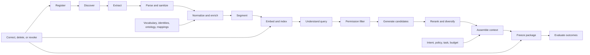
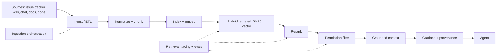
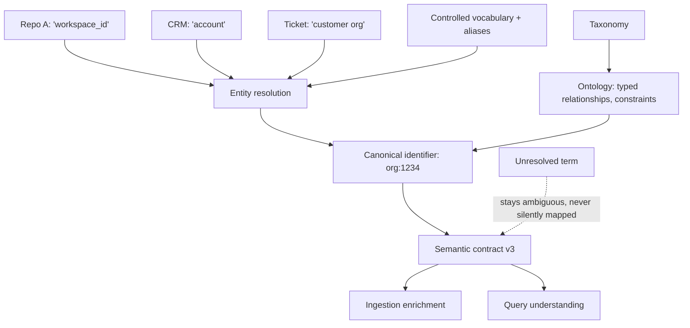
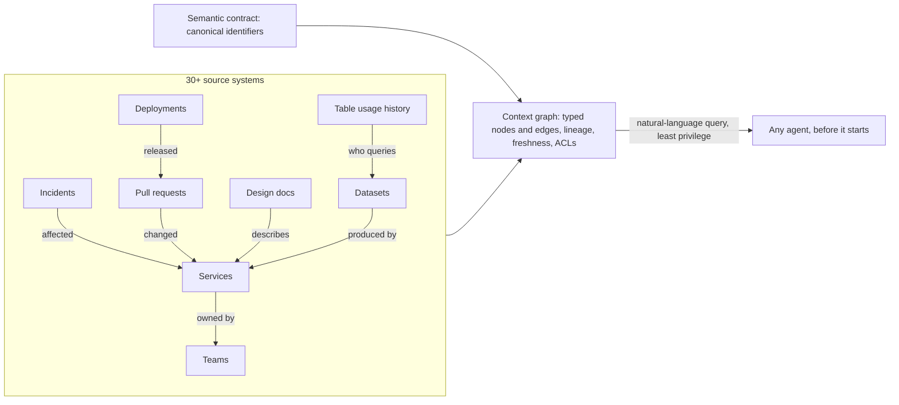

# 19. Data, knowledge, and semantic engineering

Before retrieval can be trusted, the underlying data must be usable, the corpus governed, and the organization's terms made executable. This chapter separates data understanding, knowledge engineering, and semantic engineering so a failure can be attributed to the layer that owns it.

## The problem

An agent cannot reliably compensate for missing, stale, contradictory, or misunderstood information. If a source omits the latest policy, if two systems use different meanings for the same word, or if retrieval picks the wrong document, the model receives a defective decision environment before it reasons at all. Many agent failures are therefore data, knowledge, semantic, or context failures wearing a model's face. Calling all four "RAG" hides which engineering system has to be fixed.

The problem exists because operational information is scattered across repositories, requirements, design documents, tickets, incidents, conversations, telemetry, and databases, each with its own authority, freshness, permissions, structure, and failure modes. Retrieval can return a relevant but obsolete document. A correct document can use language the agent maps to the wrong concept. A large context window can hold all of it and still emphasize the wrong evidence. And when the audit of the earlier curriculum looked for these layers, it found data understanding and semantic engineering missing entirely and knowledge engineering collapsed into context selection. The highest-value correction it recommended was to separate what had been compressed together: knowledge preparation, then context selection, then harness execution, then workflow governance.

## How it works

### Four disciplines, four moments

The 12-layer production stack in [chapter 25](./25-the-12-layer-production-ai-agent-stack.md) names four of its layers for these disciplines, and each works at a different moment.

**Data Understanding** profiles completeness, missingness, quality, freshness, and provenance. It decides whether source data is fit for use at all. **Knowledge Engineering** turns raw information into structured, retrievable, traceable knowledge; it prepares the corpus. **Semantic Engineering** normalizes terminology and resolves meaning so the system operates on concepts rather than raw strings; it makes "customer," "account," "workspace," or "release" mean one thing across agents, repositories, datasets, and tools. **Context Engineering** selects the right subset of knowledge for each decision; it chooses for this attempt.

Two sentences carry the distinctions. *Knowledge Engineering prepares the corpus; Context Engineering selects the subset for this attempt.* And: *provenance tells you where data came from; data understanding tells you whether it is usable for this decision.* A library is the analogy. Acquisitions decides which books are worth shelving (data understanding). Cataloguing shelves and indexes them (knowledge engineering). The subject thesaurus makes sure "automobiles" and "cars" land on the same shelf (semantic engineering). The reference librarian pulls the three books you need for today's question and leaves the rest where they are (context engineering).

### The handoff from source fact to model context

Every handoff along the path must retain source identity, version or observation time, authority class, sensitivity, tenant, transformation lineage, and the reason for selection. A model citation is worth something only when the system can resolve it back to the exact material that was used.

<!-- infographic: knowledge-pipeline -->
> **Infographic — From registered source to frozen context package.**



The pipeline registers approved sources, ingests and transforms their content, maintains searchable representations, retrieves eligible candidates, and compiles the smallest sufficient context for one attempt. It does not grant tool authority, redefine business intent, or make untrusted source instructions governing. Ownership is split: the knowledge owner is accountable for source, connector, transformation, index, retrieval, and revocation contracts; source owners keep authority over the underlying facts; security owns access policy; workflow owners define task relevance; quality owns independent evaluation.

### Data understanding: is this usable for this decision?

**Data profiling** is the act of measuring a source before trusting it. A source profile should answer eight questions: Is required data present, or missing? Is it current enough for this decision? Are its schema and meaning stable? Is it duplicated or contradictory? Which system and owner are authoritative? Which tenants, identities, and purposes may use it? Which transformations have been applied? How are correction, retention, and deletion propagated?

The vocabulary behind those questions is worth having exactly. **Completeness and missingness** measure whether required fields and records exist. The **data quality dimensions** are completeness, validity, consistency, accuracy, timeliness, and uniqueness. **Freshness and staleness** describe how far the observed value lags the real one; a **freshness SLO** puts a bound on it. **Source authority** and **system of record** name which system is allowed to be right when two disagree. **Data lineage** records the transformations applied; **provenance** records the origin. **Schema drift** is an unannounced change in structure or meaning; **duplication and inconsistency** are the same fact appearing twice with different values. **Sensitivity and classification** determine who may see the data and where it may travel, and **retention and deletion** determine how long it lives and how removal propagates. **Data-quality gates** block a workflow when thresholds fail; **missing-data handling** defines what happens when required facts are absent; **data observability** monitors all of this continuously rather than at onboarding.

A **Data Contract** makes the expectations explicit: schema, semantics, quality thresholds, freshness, owner, sensitivity, lineage, allowed uses, and failure behavior. The rule that matters most is about absence: missing data must produce an explicit unknown or blocked state when the workflow cannot proceed safely. It must never be converted into a confident default.

### Knowledge engineering: a governed lifecycle

Knowledge engineering covers source registration, connector identity, checkpointed ingestion, parsing, normalization, chunking, metadata enrichment, indexing, correction, reprocessing, and retirement. The system should know which source version and transformation produced every indexed unit.

The **source registry** is the list of approved sources with owner, authority class, classification, tenant scope, allowed purposes, freshness SLO, retention, and correction behavior. A source moves through states: `proposed`, `approved`, `active`, `degraded`, `suspended`, `revoked`, `retiring`, `deleted`. The **ingestion pipeline** extracts content through an identified connector; **incremental ingestion** with **checkpoints** binds connector version, source cursor, schema, transformation, and content digest so that reprocessing the same source version under the same pipeline version is idempotent. **Parsing and normalization** turn each format into clean, sanitized text and structure. A **chunking strategy** segments documents into retrievable units; fine-grained chunks improve targeted retrieval but can strip necessary context, while large chunks preserve narrative and consume budget and blur ranking. **Metadata enrichment** attaches authority, classification, semantic identifiers, permissions, and lineage to each unit. Each unit, a **knowledge artifact**, has its own states: `processing`, `indexed`, `stale`, `invalid`, `quarantined`, `deleted`. **Corpus freshness** is the aggregate lag between sources and index.

Retrieval combines several methods, and none is universally best. **BM25** and other **lexical search** find exact names, identifiers, and uncommon tokens; **embeddings** turn content into vectors and **vector search** finds conceptual similarity; **metadata filtering** applies scope and authority; **hybrid retrieval** fuses lexical and vector candidate sets, for example with reciprocal rank fusion; **graph traversal** follows explicit relationships and lineage, which is what a **knowledge graph** and **GraphRAG** add; **query rewriting** expands or reformulates the question before any of that; and **reranking** reorders candidates for the actual task. Code symbols and policy identifiers reward lexical search, natural-language concepts reward embeddings, and blast-radius questions reward graphs. Hybrid retrieval is justified by measured improvement, not by default complexity.

Two properties are not optional. **Permission-aware retrieval** filters by requester, tenant, purpose, lifecycle, and freshness before content reaches ranking or generation, so that an unauthorized document can never be "very relevant." The unit of that filter is the individual artifact, carrying its own ACL reference from enrichment onward (**per-document access control**); a permission decided at the level of a whole source or index is too coarse to be trusted, because one wiki space holds both the public runbook and the incident post-mortem. **Citation and source attribution** tie every excerpt to its artifact, source version, and permission; a citation without source identity, version, and permission is decoration.

### The enterprise retrieval pipeline, end to end

Seen from the agent's side, the whole apparatus above collapses into one path from raw sources to a grounded, cited context. It is worth drawing that path on its own, because it is the shape a platform team actually builds and operates, and because every stage on it exists for a reason a plain vector store does not have.



Two details of the drawing matter. The dotted boxes are not optional extras: ingestion orchestration (scheduling, checkpoints, reprocessing) and retrieval tracing with evaluations are part of the platform, not a later add-on, because without them nobody can say why a document was or was not retrieved. And the permission filter appears late in this operator's view only because it is drawn as the last gate before the agent; in the contract that follows in "How to build it" it also runs *before* ranking, so that unauthorized material never competes for a rank at all. Filter early to keep it out of the ranking; filter late to prove nothing slipped through.

Enterprise retrieval is more than vector search: lexical plus semantic candidates, reranking, repository-aware retrieval, metadata filtering, and where it earns its cost, graph relationships. But the mechanics are the easy half. The hard questions are the ones a consumer search engine never has to answer.

| Question | Why a consumer search engine can skip it | Why the factory cannot |
|---|---|---|
| Is this builder authorized to see this? | Everything indexed is public | A relevant answer built on unauthorized data is a leak with a citation |
| Where did it come from? | Nobody audits a web result | Evidence and review depend on knowing the source |
| How fresh is it? | Stale pages are an annoyance | An agent acts on it; stale means wrong |
| Which version applies? | One page, one version | Architecture docs, APIs, and policies have revisions that conflict |
| Can the output be traced back to what influenced it? | Not required | Required to explain, debug, and revoke |

> *Enterprise context is relevant + authoritative + fresh + permission-aware + attributable.*

Two failures show why all five properties have to hold at once. In the first, an agent produces a well-grounded, fully cited plan from the architecture documents it retrieved, and the documents describe a service that was decommissioned last quarter. Every citation is real; the answer is still wrong, because grounding on obsolete material is grounding on the wrong world. In the second, an agent finds exactly the document that answers the question, and the builder who asked was never permitted to read it. That answer is worse than wrong: it is a policy violation dressed as helpfulness. Relevance was satisfied in both cases. Freshness failed in the first; permission failed in the second. Retrieval is a permissions, provenance, freshness, and evaluation problem at least as much as it is a search problem, and a retrieval team that measures only ranking quality will ship both failures.

### Semantic engineering: executable meaning

<!-- infographic: semantic-layer -->
> **Infographic — The semantic layer.**



A **controlled vocabulary** defines preferred terms, aliases, and deprecated terms; a **domain lexicon** is the same idea scoped to one business domain. A **taxonomy** organizes concepts into a hierarchy. An **ontology** adds typed relationships and constraints between them. A **canonical identifier** is the one stable ID a concept or entity has regardless of which system named it, and **entity resolution** maps the different source identifiers onto it while preserving the source-specific identities. **Synonym and alias mapping** and **semantic normalization** collapse variant spellings and phrasings; **schema and field mapping** does the same for column and property names across systems. **Disambiguation** decides which of several meanings applies, and the rule is that an unresolved term stays ambiguous rather than being silently mapped. A **terminology registry** holds all of this under ownership and version. **Concept drift** is meaning changing over time; **semantic versioning** of the contract is how you detect and manage it, because semantic changes can invalidate retrieval results, context packages, evaluations, and downstream evidence.

This is not the cryptographic canonicalization that the evidence chapters use to hash records. That makes bytes identical; this makes meanings identical.

A **Semantic Contract** defines canonical concepts, identifiers, allowed relationships, disambiguation rules, source mappings, owner, version, and compatibility policy. Keep the layer as small as possible and as explicit as necessary. An ontology earns its cost when several sources repeatedly disagree about meaning; it is premature when a small controlled vocabulary and stable identifiers solve the actual problem. Semantic engineering removes measured ambiguity; it does not build a speculative enterprise model of everything.

### Ground first: the context graph

Everything above is about whether the agent's context is *right*. There is an economic argument for grounding that is just as strong, and it is easy to miss because the failure it describes does not look like a failure. *An ungrounded agent fails slowly rather than cheaply.* Given a question it cannot answer from what it has been handed, an agent does not stop; it searches one more place, re-sending its whole expanding context on every turn, spawns a helper, hits an error, and reasons its way to a confident wrong conclusion. Every one of those turns is billed. Richer information up front is the single most powerful lever on the "requests per turn" term of the cost equation in [Chapter 8](../02-design/08-economics-metrics-and-human-attention.md), and grounding is therefore a cost control as much as a quality control.

The pattern that one large engineering organisation built for this is a **context graph**: a single graph, integrating the organisation's internal systems, whose nodes are the entities an engineer reasons about (services, teams, incidents, pull requests, design documents, deployments, datasets, historical table usage) and whose edges are the relationships between them (owns, depends on, deployed, caused, queried), which any agent can query in natural language before it starts work. Its published scale gives a sense of what "single graph" means in practice: about 24 million nodes and 80 million edges, 86 node types and 117 edge types, drawn from more than thirty internal systems. Those are one organisation's numbers; the shape transfers at any size.

<!-- infographic: context-graph -->
> **Infographic — The context graph.**



The comparison that organisation published is the whole argument in one pair of runs. Same prompt, same model, asked whether a dataset was queryable. The grounded agent queried the graph's historical usage, found the table that more than fifty analysts already use, and answered in 38 seconds. The ungrounded agent spent 20 minutes reading service code, spawned two subagents, hit three errors, and concluded, wrongly, that the dataset could not be queried. The second run was not only slower and more expensive; it was confidently incorrect, which is the most expensive kind of wrong because a human then has to discover it.

A context graph is the knowledge graph of the retrieval section, built at organisational scope, and it is governed by the same rules. Its nodes need the semantic layer's canonical identifiers, or "service" in the incident system and "service" in the deployment system become two nodes for one thing. Its edges need lineage, so an answer can say which system asserted the relationship and when. Its freshness needs an SLO per source, because a graph that still shows last quarter's ownership grounds the agent on the wrong world. And its queries run under least privilege: the graph is a retrieval source like any other, filtered per node by requester, tenant, and purpose before anything reaches the model. The **trusted context** layer of the six-layer view in [chapter 18](./18-agent-architecture.md), systems of record, a read-only data layer, schema and semantic catalog, scoped knowledge, lineage and freshness, retrieved just in time under least privilege, is the same thing said as an architecture. The line that goes with it is worth keeping verbatim: *trusted context is 80 percent of the agent's success; skip it and the agent hallucinates.* The remaining 20 percent is everything else in this book.

## How to build it

### The records

Four reference schemas anchor the pipeline. Two are shown as documents; two as required-field lists.

```yaml
# SourceRegistration
id: source:engineering-policy
owner: role:policy-owner
authority_class: governing
connector_identity: workload://connector/policy
location: system://policy-service
classification: confidential
tenant_scope: [tenant-a]
allowed_purposes: [software-delivery]
freshness_slo: PT1H
retention_policy: retention:policy@2
correction_and_deletion: source-authoritative
state: active
```

```yaml
# KnowledgeArtifact
id: ka:8f73
source_id: source:engineering-policy
source_version: 31
observed_at: 2026-08-30T18:00:00Z
pipeline_version: ingest@8
content_digest: sha256:...
segment_locator: section:release-controls
semantic_ids: [concept:consequential-release]
classification: confidential
permissions_ref: acl:policy-31
lineage: [extract:90, sanitize:22, segment:15]
state: indexed
```

| Record | Required fields |
|---|---|
| `RetrievalRequest` | Requester and workload identity, tenant, purpose, query, task type, repositories, required authority classes, time boundary, classification ceiling, token budget, retrieval policy version |
| `RetrievalCandidate` | Artifact and source versions, candidate method, raw and normalized scores, permission decision, freshness, authority, contradiction group, exclusion reason, lineage |
| `ContextSelection` | Request, selected and excluded candidates, reranker version, diversity and contradiction decisions, token allocation, selection rationale, evaluator signals |
| `ContextPackage` | Immutable digest, attempt and manifest, instruction hierarchy, exact excerpts, citations, source and policy versions, classification, expiry, cache key, unresolved missing or conflicting facts |

## Failure modes

| Failure | Detection | Runtime behavior | Recovery proof |
|---|---|---|---|
| Connector lag | Freshness SLO | Mark degraded; block freshness-critical tasks | Checkpoint catches up and gap scan passes |
| Schema change | Parser or contract error | Stop the affected partition, preserve checkpoint | New parser version and reprocessing comparison |
| Permission mismatch | Negative authorization test | Deny candidate before ranking | ACL reconciliation and tenant-isolation suite |
| Stale governing source | Authority and freshness rule | Exclude, and block if required | Current source retrieved and package regenerated |
| Contradictory authorities | Contradiction group | Surface uncertainty and escalate | Named owner resolves or workflow records an exception |
| Poisoning signal | Provenance, dominance, behavior anomaly | Suspend source and affected packages | Root cause, clean rebuild, red-team and regression tests |
| Index unavailable | Health or circuit state | Approved fallback or explicit unavailable state | Index restored and missed-change reconciliation |
| Missing authoritative data | Data-quality gate | Explicit blocked state, never a confident default | Owner supplies data; gate passes |
| Silent alias mapping | Semantic evaluation | Term stays ambiguous; escalate | Contract updated and versioned |
| Obsolete document ranks first | Authority tier and lifecycle filter | Excluded before compilation | Retrieval evaluation case added |
| Whole-window stuffing | Context size flat regardless of change size; token cost per accepted outcome high | Retrieve from the change upward: changed symbols, dependency context, review history, then only the levels the scope requires | Context evals show packages are minimal and sufficient |
| Local convention overrides a global standard | Precedence check in compilation | Global material allocated first and never compressed below governing clauses | Standard present in the package; evaluation case added |
| Change level missing | Agent reads whole files to find what the diff touches | Changed-symbol retrieval and dependency context from the code index | Retrieval trace shows symbol-level candidates |
| Context edited in place | An installed rule or skill file changes with no version; forty repositories change behaviour at once | Publish creates an immutable version; installs bind exact versions; the CBOM names what each run saw | Drift report from discover is empty; CBOM resolves every package |
| Memory read as instruction | A retrieved memory entry is treated as policy or as satisfying a criterion | Retrieved text is untrusted: no approval, no tool call, no acceptance from memory | Policy decision trace cites no memory input |
| Graph walk exposes the corpus | One query traverses the whole graph and returns it to the model | Hard caps on depth, fan-out, and result size; edge kinds visible | Query trace shows caps applied and edge kinds |
| Sufficiency loop widens scope | Reformulation reaches a source outside the requester's tenant or classification ceiling | Every iteration runs under the frozen authorization scope; escalation is refused | Retrieval trace shows identical scope on every iteration |
| Ranking without components | A governing document is outranked and nobody can say by what | Score components and provenance visible per result | Fusion strategy versioned; components logged |
| Automation before definition | A loop runs nightly against a repository with no Definition of Correct; output volume rises, acceptance does not | Write the Definition of Correct for the scope first; the loop consumes it and the verifier checks against it | Verifier rejects on a named clause, not on taste |
| Context drift | A skill names Framework X; the organisation moved to Y; agents produce well-formatted obsolete code | Compare context assertions against the repository profile, manifests, and decision records; mark drifted context stale | Drift detection lists the artifact; a new version is published and installed |
| Four versions of correct | Several competing skills or instruction files define the same standard differently; an agent loads two | Deduplicate: discover, compare, consolidate, establish a source of truth, distribute | Inventory shows one package for the standard, installed by version |
| Compensatory context outlives its reason | Workarounds written for last year's model still cost tokens on every run | Context utility measured with and without; prune what shows no delta; protect institutional context | Utility deltas recorded per source; package size falls, quality holds |
| The company brain in the window | The agent is handed everything the organisation knows; quality falls as the package grows | The brain is a source the compiler selects from, routed by task classification, never a window it fills | Package is minimal and sufficient under context evals |
| Verifier shares the producer's window | The verifier reads the producer's reasoning and agrees with a plausible explanation of a wrong result | Context firewall: verifier gets goal, artifact, and verification contract only; fresh-context verification for material claims | Verifier trace shows no producer reasoning in its package |
| Durable state treated as memory | A retrieved summary of an old plan stands in for the plan | Plans, approvals, attempts, and artifacts live in authoritative records; memory holds pointers | Policy and acceptance decisions cite records, never memory |

The rows about memory, the graph, and the sufficiency loop are the same failure seen three ways: a retrieval mechanism acquiring an authority it was never granted, either over decisions or over data it should not reach.

Two rows deserve a second look because they are the ones that pass every ranking metric. "Obsolete document ranks first" is the grounded-but-stale failure: the citations are real and the answer is wrong. "Permission mismatch" is the relevant-but-unauthorized failure: the answer is right and the builder was never allowed to have it. Neither shows up in Recall@k. Both show up in production.

The diagnostic habit is the one from the evaluation section: "the model missed it" is not a root cause until the source, ingestion, semantic, and retrieval layers have been ruled out in that order.

## In Mission Control

At study commit [`d902fae`](https://github.com/jaydubya818/MissionControl/tree/d902fae7032c0696b531c44ae88829c652516fc6), Mission Control has provenance-backed retrieval, graph relationships, planning, Attempt-bound Context Packages, context evaluations, configuration drift scans, versioned context manifests, and content-hash checks. Factory Memory is advisory and cannot satisfy acceptance. Those mechanisms are a strong context-governance foundation.

The repository glossary and lexicon reviewed 2026-09-02 name the rest of this chapter's vocabulary as contract: context packages with scope, name, content hash, quality score, and security status; the Context CDL (draft, publish, install, deprecate); the Frozen Context Package and the CBOM at run start; Factory Memory's untrusted-text rule; knowledge-graph edges typed authoritative, deterministic, or inferred under hard caps; hybrid retrieval with visible score components; the bounded sufficiency loop that never expands authorization; a Knowledge → Memory surface with Overview, Memory, Graph, and Context views; a Registry surface with Discover, Skill Inventory, Installations, CDL, Evaluate Skill, and Eval Runs; and a context CLI that discovers local `SKILL.md`, `AGENTS.md`, and `CLAUDE.md` files and syncs installations to the control plane. Factory Memory is implemented and default off by phase at the pinned commits of [Chapter 42](../06-improve/42-mission-control-as-a-living-case-study.md); the surfaces and the CLI are lexicon vocabulary at the review date, not evidence of a measured retrieval quality series.

**Partial or future.** The studied evidence does not establish a complete production source registry, a connector and checkpoint lifecycle, a data-quality gate, a semantic-contract registry, a permission-aware hybrid retrieval service, or an independently benchmarked reranking pipeline. The graph and memory mechanisms should not be presented as a general enterprise knowledge system. The specification in this chapter likewise does not claim a production source registry, benchmarked ranker, deletion guarantee, or poisoning defense; it is the target. The target state is that Mission Control registers sources with ownership, authority, classification, retention, and ingestion policy; produces versioned knowledge artifacts and semantic contracts; evaluates retrieval by workflow and persona; freezes the resulting selection into each execution manifest; and lets an operator inspect missing required data, stale sources, semantic ambiguity, retrieval candidates, reranking decisions, excluded sources, token allocation, citations, and the exact package an Attempt used. Promotion of that system requires tenant-isolation tests, correction propagation, deletion tests, representative retrieval evaluations, and end-to-end outcome evidence.

## Retain this

- Data understanding asks whether a source is usable for this decision; it does not clean or authorize it.
- Knowledge engineering governs the corpus; semantic engineering makes entities, terms, and relationships mean one thing.
- The context graph grounds retrieval in versioned entities, relationships, provenance, and permissions.
- A correct model cannot repair missing authority, stale facts, or contradictory semantics upstream.
- Evaluate each layer separately so a context failure is not misdiagnosed as a model failure.

## Go deeper

- Related chapters: [18. Agent architecture](./18-agent-architecture.md) for the compiler and the five trust categories; [25. The 12-layer stack](./25-the-12-layer-production-ai-agent-stack.md); [29. Evaluation engineering](../04-prove/29-evaluation-engineering.md); [33. Security](../04-prove/33-security.md) for poisoning and injection; [35. Observability](../05-operate/35-observability-telemetry-and-forensics.md) for lineage; [5. Authoritative records](../02-design/05-authoritative-records.md) for the systems of record this pipeline must not shadow.
- Primary sources: [Lewis et al., Retrieval-Augmented Generation](https://arxiv.org/abs/2005.11401); [Robertson and Zaragoza, The Probabilistic Relevance Framework (BM25)](https://www.staff.city.ac.uk/~sbrp622/papers/foundations_bm25_review.pdf); [Cormack, Clarke, and Buettcher, Reciprocal Rank Fusion](https://dl.acm.org/doi/10.1145/1571941.1572114); [NIST AI Risk Management Framework](https://airc.nist.gov/airmf-resources/airmf/) and [AI RMF 1.0](https://www.nist.gov/publications/artificial-intelligence-risk-management-framework-ai-rmf-10); [OWASP Agentic AI Threats and Mitigations](https://genai.owasp.org/resource/agentic-ai-threats-and-mitigations/); Mission Control [capability, workflow, and admission map](../appendix/mission-control/03-capability-workflow-and-admission-map.md) at `d902fae`.
- Transcript source: the 12-layer production AI agent stack and its coverage audit (Data Understanding, Knowledge Engineering, Semantic Engineering term lists); the agent platform technology glossary (RAG, BM25, hybrid retrieval, reranking, permission-aware retrieval, provenance, freshness); Jay West, factory architecture notes (the enterprise retrieval pipeline, the five properties of enterprise context, the four-level context hierarchy, changed-symbol retrieval, dependency context, and historical review patterns).
- Public sources: Uber Engineering, *Running a Software Factory Efficiently at Uber Scale* (2026) for the context graph, its published scale, and the grounded-versus-ungrounded comparison; *Six layers of a working agentic system* (public post, 2026) for the trusted-context layer and the "80 percent of the agent's success" line.
- Public practitioner talks, 2026: the context-centric factory, the Definition of Correct, context as code and the context lifecycle, the context inventory and its detections, context drift and deduplication, context utility and pruning, compensatory versus institutional context, the company brain, structured external state and the six-kind memory taxonomy, context routing, context shift-left, and the context firewall.
- Mission Control repository glossary and lexicon, reviewed 2026-09-02: context packages, the Context CDL, the Frozen Context Package and CBOM, Factory Memory's untrusted-text rule, knowledge-graph edge kinds and hard caps, hybrid retrieval score components, agentic retrieval and the sufficiency loop, and the context CLI.
- [Glossary](../appendix/glossary.md).
