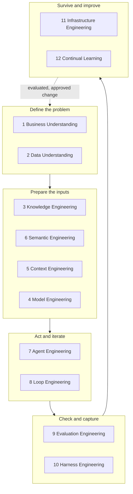
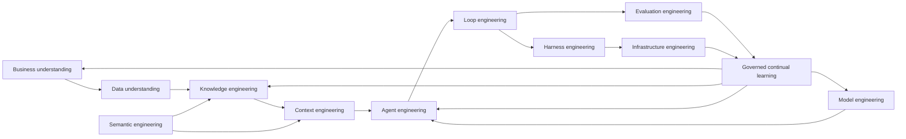

# 19. The 12-layer production AI agent stack

Building the agent is only one layer. Production AI is the engineering system around it: the system that defines the agent's problem, prepares its inputs, limits its actions, checks its work, survives failure, and governs how it improves. This chapter names the twelve disciplines that make up that system, gives each one a contract, and maps each to the chapter of this guide that covers it in depth. Tools change constantly; systems barely do. Understand why each layer exists and what failure it prevents, and you can replace the model, framework, database, vector store, or orchestration technology without losing the architecture underneath.

## The problem

A demo starts with a prompt, a model, and a few tools. Production starts with a business decision, incomplete data, conflicting terminology, changing knowledge, real permissions, costly side effects, uncertain outputs, unreliable dependencies, and accountable owners. The distance between those two settings is the engineering stack around the agent, and the failures that live in that distance are systemic rather than local. The request is underspecified before the model sees it. The system retrieves information that is stale, unauthorized, or irrelevant. The model is poorly matched to the task or the risk. Domain terms resolve to different meanings in different sources. Orchestration loses state or routes work to an ineligible capability. Retry loops repeat the same failure without changing the conditions. Evaluations cover the happy path and miss the critical slice. An apparently successful run cannot be reproduced. Provider, tool, queue, and environment failures are handled as if the model had made a mistake. Feedback changes production behavior without a controlled promotion decision.

No single framework fixes these failures because no single framework owns all of the decisions that produce them. The guide's original coverage audit found exactly this pattern in its own early chapters: strong on governance, control planes, execution state, evidence, security, recovery, and human authority, and thin or missing on the layers before execution (data understanding, knowledge preparation, semantics) and after it (evaluation operations, replay, feedback). The stack is the corrective: a responsibility model that makes every decision an owner's decision.

## How it works

### Twelve disciplines, one system

The twelve disciplines are not twelve teams. A small system combines roles freely. What must remain explicit is the responsibility and the evidence boundary: who owns which decision, and how another component can verify that the decision was made correctly. Think of a hospital rather than a workshop. A surgeon is only one specialist in the building; the outcome depends just as much on intake, diagnostics, pharmacy, anaesthesia, recovery, and the morbidity review afterward, and it depends on each of them handing over a record the next can act on. The agent is the surgeon. The other eleven layers are the hospital.

<!-- infographic: twelve-layer-stack -->
> **Infographic — The 12-layer production AI agent stack.** *(Jay's graphic goes here.)* Until then, the diagram below carries the same concept.



| Discipline | Decision it owns | Primary outputs | Failure it prevents |
| --- | --- | --- | --- |
| Business Understanding | What decision or outcome is required, for whom, under which constraints? | Problem statement, owner, acceptance criteria, risk, non-goals, escalation path | Solving the wrong problem or optimizing a proxy |
| Data Understanding | Is the available data complete, current, authoritative, sensitive, and usable? | Data profile, quality findings, lineage, access rules, missing-data policy | Invalid inputs reaching the agent as fact |
| Knowledge Engineering | How does raw information become retrievable, attributable, and revocable knowledge? | Source registry, ingestion, normalization, chunks, indexes, citations, freshness and deletion controls | Weak retrieval, unattributed claims, stale or poisoned knowledge |
| Model Engineering | Which qualified model profile is appropriate for this task and risk? | Versioned profiles, task benchmarks, routing eligibility, cost/latency envelope, fallback | Treating one model as best for every job |
| Context Engineering | What is the smallest sufficient context for this attempt? | Context manifest, selected instructions, code, state, retrieved knowledge, token budget, digest | Omission, overload, leakage, irreproducible prompts |
| Semantic Engineering | What do the domain terms, identifiers, relationships, and schemas mean? | Canonical vocabulary, ontology or schema mappings, entity resolution, validation rules | Acting on ambiguous strings or incompatible meanings |
| Agent Engineering | Which role, objective, skills, tools, state, and authority form an eligible agent? | Versioned agent specification, capability dependencies, permissions, budgets, handoff contract | Confusing capability with permission or identity |
| Loop Engineering | What happens after an attempt succeeds, fails, or remains uncertain? | Verification, repair, retry, stop, and escalation policy | Infinite, expensive, repetitive, or unsafe iteration |
| Evaluation Engineering | How will expected behavior be measured across representative cases? | Datasets, scenario slices, graders, trials, baselines, thresholds, regression gates | Promoting a demo on anecdotes |
| Harness Engineering | How is execution captured, controlled, replayed, and compared? | Run record, checkpoints, event trace, tool receipts, artifacts, replay and comparison | Irreproducible behavior and unverifiable completion |
| Infrastructure Engineering | How does execution survive dependency and platform failure? | Environments, compute, queues, leases, timeouts, backoff, circuit breakers, reconciliation, recovery | Mistaking operational failure for model failure |
| Continual Learning | How does feedback become an evaluated and reversible system change? | Feedback cases, change proposal, candidate version, evaluation evidence, approval, rollout, rollback | Uncontrolled self-modification and regression |

### The layers, one at a time

Each layer below is described the same way: the decision it owns, what it takes in, what it hands on, the failure it exists to prevent, one concrete software-factory example, and where it lives in the factory's physical architecture (the Agent Factory that packages capabilities, the control plane that governs work, the harness that runs an agent, or the environment underneath it). The chapter that goes deep on the layer is named in the heading.

### 1. Business Understanding — [Chapter 6](../02-design/06-intent-and-specification-engineering.md)

*Decides* what decision or outcome is required, for whom, under which constraints, and who owns it. *Inputs:* a customer problem, product objective, incident, security finding, or technical-debt signal; the business owner; the risk appetite. *Outputs:* a problem statement, accountable owner, acceptance criteria, risk classification, non-goals, deadline, cost ceiling, prohibited outcomes, and escalation path. *Prevents* solving the wrong problem or optimizing a proxy: the agent that closes the ticket without delivering the outcome. *Example:* an issue reading "checkout is slow" becomes a Mission with a measurable target (p95 checkout latency under 800 ms for the EU region), an owner, a rule that payment-provider integration is out of scope, and a required human approval because customer payment data is involved. *Lives in* the control plane's intent layer, as the Mission and WorkOrder records of Chapter 5.

### 2. Data Understanding — [Chapter 16](./16-data-knowledge-semantic-and-context-engineering.md)

*Decides* whether the available data is complete, current, authoritative, sensitive, and usable for this decision. *Inputs:* the sources the workflow will read (repositories, telemetry, tickets, databases), their schemas, and their classification. *Outputs:* a data profile covering completeness, missingness, freshness, provenance, sensitivity, access rules, retention, schema drift, duplication, and an explicit missing-data policy. *Prevents* invalid inputs reaching the agent as fact. Provenance tells you where data came from; data understanding tells you whether it is usable now. *Example:* before an incident-triage agent reads production logs, the profile establishes that the log stream lags by four minutes, that one region is missing entirely, and that request bodies are classified confidential and must be redacted, so the agent reports "no data for eu-west-2" instead of inferring that the region is healthy. *Lives in* the control plane's admission and preflight step, and in the environment's data access controls.

### 3. Knowledge Engineering — [Chapter 16](./16-data-knowledge-semantic-and-context-engineering.md)

*Decides* how raw information becomes retrievable, attributable, and revocable knowledge. *Inputs:* the source registry, documents, code, architecture decisions, incidents, and their permissions. *Outputs:* an ingestion pipeline, parsing and normalization, chunking, metadata enrichment, embeddings, lexical and hybrid indexes, reranking, permission-aware retrieval, citations, incremental ingestion with checkpoints, corpus freshness, and deletion controls, plus retrieval evaluation (precision and recall at k, groundedness). *Prevents* weak retrieval, unattributed claims, and stale or poisoned knowledge. *Example:* a repository's architecture decision records, runbooks, and past postmortems are indexed with commit lineage so that a planning agent's claim "this service must not call the billing API directly" is cited to ADR-014 at a specific commit, and the citation is withdrawn automatically when the ADR is superseded. *Lives in* the Agent Factory as a governed knowledge asset, served through the control plane's retrieval services. Knowledge Engineering prepares the corpus; Context Engineering selects from it.

### 4. Model Engineering — [Chapter 17](./17-models-routing-and-capability-selection.md)

*Decides* which qualified model profile is appropriate for this task and risk. *Inputs:* candidate models, the actual task distribution, cost and latency envelopes, tool compatibility, safety constraints. *Outputs:* versioned model profiles with decoding parameters, task benchmarks, routing eligibility, structured-output reliability, fallback routes, and a configuration lifecycle. *Prevents* treating one model as best for every job. *Example:* the factory qualifies a fast, inexpensive model for issue classification and test-impact summarization, a code-fluent model for implementation, and a precise instruction-following model from a different provider for validation, and records that the implementation model is not eligible for security-sensitive review. *Lives in* the Agent Factory as a versioned capability and in the control plane's model gateway and router.

### 5. Context Engineering — [Chapter 16](./16-data-knowledge-semantic-and-context-engineering.md)

*Decides* the smallest sufficient context for this attempt. *Inputs:* the WorkOrder, repository instructions, selected code, task state, retrieved knowledge, prior handoffs, and the token budget. *Outputs:* a context manifest with selection, compression, compaction, conflict resolution, and an exact digest, so the prompt is reproducible. *Prevents* omission, overload, leakage, and irreproducible prompts. *Example:* for a defect-fix Attempt, the context package contains the failing test, the three files in the stack trace, the repository's testing instructions, the relevant ADR citation, and the previous Attempt's diagnosis, with a digest recorded on the Attempt; it deliberately excludes the unrelated payments module even though a naive search would have pulled it in. *Lives in* the control plane (Attempt-bound context packages) and is consumed by the harness.

### 6. Semantic Engineering — [Chapter 16](./16-data-knowledge-semantic-and-context-engineering.md)

*Decides* what domain terms, identifiers, relationships, and schemas mean, so the system operates on concepts rather than raw strings. *Inputs:* the domain lexicon, taxonomies, ontologies, schema and field mappings, identifier systems across tools and repositories. *Outputs:* a controlled vocabulary, canonical identifiers, entity resolution, synonym and alias mapping, disambiguation rules, a terminology registry, semantic contracts, and semantic versioning with concept-drift detection. *Prevents* acting on ambiguous strings or incompatible meanings. This is different from cryptographic canonicalization; it is about "customer," "account," "workspace," and "release" meaning the same thing across agents, repositories, datasets, and tools. *Example:* the tracker calls it a "project," the billing schema calls it an "org," and the deployment system calls it a "tenant"; the semantic layer resolves all three to one canonical entity so that a migration agent does not treat them as three separate concepts and miss the tenant that only appears under one name. *Lives in* the Agent Factory as a governed vocabulary asset applied at the control plane's intake and routing boundaries.

### 7. Agent Engineering — [Chapter 15](./15-agent-architecture.md) and [Chapter 18](./18-agent-and-loop-engineering.md)

*Decides* which role, objective, skills, tools, state, and authority form an eligible agent, and how agents, tools, state, and conditional routing are orchestrated. *Inputs:* the task-specific profile, eligible model routes, skills, tool schemas and permissions, budgets, and the workflow graph. *Outputs:* a versioned agent specification with capability dependencies, permissions, budgets, and handoff contracts; the routed, branching, or parallel graph the work runs through. *Prevents* confusing capability with permission or identity: an agent that can do something is not an agent that may. *Example:* the issue-to-PR workflow routes an incoming issue through a classifier to either a small-change implementer or a planner-plus-implementer pair, gives the implementer repository-write on a branch and test-run authority, and gives the reviewer read-only authority, all recorded in the execution manifest. *Lives in* the Agent Factory (agent definitions) and the control plane's orchestrator (routing and graph).

### 8. Loop Engineering — [Chapter 18](./18-agent-and-loop-engineering.md)

*Decides* what happens after every attempt: verify, correct, retry, stop, or escalate. *Inputs:* verification findings, progress measures, remaining budgets, failure classification. *Outputs:* the verification, repair, retry, stop, and escalation policy; the escalation packet; a new immutable Attempt for every retry. *Prevents* infinite, expensive, repetitive, or unsafe iteration. *Example:* after a build agent's second Attempt fails the same integration test, the loop contract refuses a third identical Attempt, requires a changed hypothesis, and when the diagnosis reveals the failure is in an upstream fixture outside the WorkOrder's scope, escalates with a packet naming the two candidates and the scope question rather than letting the agent "fix" the fixture. *Lives in* the control plane's orchestrator (retry budgets, stop authority) with the inner iteration inside the harness.

### 9. Evaluation Engineering — [Chapter 23](../04-prove/23-evaluation-engineering.md)

*Decides* how expected behavior is measured across representative cases and how system-level performance is compared. *Inputs:* eval tasks and fixtures, golden and holdout sets, slices, graders (deterministic, model, human) with calibration, baselines. *Outputs:* datasets, scenario slices, trials, thresholds, regression gates, statistical confidence, and eval lineage. *Prevents* promoting a demo on anecdotes. *Example:* before a new implementer profile is admitted, it runs against forty representative issues including boundary, adversarial, missing-data, permission, dependency-failure, and recovery cases, and is compared against the current baseline on accepted-outcome rate and cost per accepted change, with the security-sensitive slice measured separately. *Lives in* the Agent Factory (capability certification) and the control plane's promotion gates.

### 10. Harness Engineering — [Chapter 13](./13-coding-harnesses-and-agent-protocols.md)

*Decides* how execution is captured, controlled, replayed, and compared, so failures can be reproduced and inspected. *Inputs:* the frozen agent configuration, the environment, the event stream from the coding loop. *Outputs:* a run record, checkpoints, event trace, tool receipts, artifacts, session transcripts, and the ability to replay (including mocked-tool replay) and diff trajectories between runs. *Prevents* irreproducible behavior and unverifiable completion. The inner harness is the coding loop itself (model, shell, filesystem, tools, compaction, session state); the outer harness is the organizational wrapper (skills, retries, review loops, scheduling, escalation, completion contracts). *Example:* a reviewer asks why an agent deleted a migration file; the run record shows the exact tool call, the context digest at that step, and the model route, and the team replays the Attempt with a mocked filesystem to confirm the fix. *Lives in* the harness, with records persisted to the control plane.

### 11. Infrastructure Engineering — [Chapter 12](./12-durable-execution.md) and [Chapter 14](./14-development-environments-sandboxes-and-compute.md)

*Decides* how execution survives dependency and platform failure. *Inputs:* environments, compute pools, queues, providers, and their failure characteristics. *Outputs:* environment manifests, worker fleets, leases, timeout budgets, retry policy with backoff and jitter, rate limits, circuit breakers, bulkheads, backpressure, dead-letter queues, provider failover, reconciliation, and recovery. *Prevents* mistaking operational failure for model failure. *Example:* a model provider returns 429s for eight minutes; the infrastructure layer classifies the failure as a dependency outage, backs off, fails over to a qualified fallback route, and records that the Attempt was retried for an operational reason, so the learning layer does not count it as an agent defect. *Lives in* the execution plane: environment and compute beneath the harness, with leases and queues in the control plane.

### 12. Continual Learning — [Chapter 33](../06-improve/33-governed-learning-and-compounding-engineering.md)

*Decides* how recurring production feedback becomes an evaluated, human-approved, reversible system improvement. *Inputs:* human corrections, review comments, failed evaluations, incidents, production outcomes. *Outputs:* feedback cases, a change proposal, a candidate version, evaluation evidence, an approval record, a progressive rollout, and a rollback path. *Prevents* uncontrolled self-modification and regression. *Example:* reviewers correct the same logger-import mistake in eleven pull requests; the meta loop proposes a repository instruction and a cheap verifier check, the candidate is evaluated against the regression suite, an owner approves, and the mistake stops recurring, with the change reversible if it causes a new failure. *Lives in* the Agent Factory's promotion pipeline, governed by the control plane.

### How the disciplines hand off work

<!-- infographic: layer-handoffs -->
> **Infographic — Layer hand-offs and feedback paths.** *(Jay's graphic goes here.)* Until then, the diagram below carries the same concept.



The arrows are contracts, not a waterfall. Evaluation findings may show that context selection is weak, that a semantic mapping is wrong, or that the business success criterion was never measurable. The correction returns to the discipline that owns the failed decision. The source video that introduced the stack walks the layers in a different order (knowledge, data, business, context, model, semantic, agent, loop, evaluation, harness, infrastructure, continual learning), which is a useful reminder that the stack is a set of owned decisions, not a sequence you must enter at the top. Its testbed is a medical-emergency agent system; all patient data and scenarios in it are synthetic and used only as an engineering exercise.

### Six contracts per layer

Each discipline should publish six things:

1. **Input contract:** the records, versions, classifications, and freshness it accepts.
2. **Decision contract:** the decision it alone is authorized to make.
3. **Output contract:** the record or artifact it produces for the next layer.
4. **Evidence contract:** how another component can verify its claim.
5. **Failure contract:** detectable failure classes, retry eligibility, and escalation owner.
6. **Change contract:** versioning, compatibility, rollout, rollback, and recertification triggers.

Without these, "the agent" becomes an unbounded container for policy, retrieval, state, inference, tool use, validation, and recovery, which is difficult to test and nearly impossible to govern.

### The operating loop

A production run should make the following sequence observable:

```text
admit → assemble context → select qualified capability → attempt
      → observe → independently evaluate → decide
      → accept | correct | retry | reduce autonomy | escalate | fail
      → deliver → observe outcome → propose evaluated improvement
```

Every retry is a new immutable attempt, and it must name what changed: context, model, tool availability, code, repair instruction, or dependency state. Repeating the same inputs and expecting a different result is not recovery engineering.

## How to build it

The build sequence follows the stack from the outcome inward. Keep deterministic work deterministic throughout.

1. **Define the bounded outcome.** Name the user or event, the business decision, material consequences, owner, acceptance criteria, prohibited outcomes, deadline, cost ceiling, and human authority.
2. **Establish data and semantic readiness.** Profile missingness, quality, freshness, provenance, sensitivity, access, and retention. Normalize the concepts the workflow must distinguish. Specify how unknown, conflicting, or missing facts are represented; never silently replace them with model inference.
3. **Build the knowledge and context path.** Register sources, ingest safely, preserve lineage, filter permissions before ranking, retrieve, rerank, cite, and support correction or deletion. Compile an attempt-specific context package and retain its exact digest.
4. **Qualify models and capabilities.** Benchmark candidate models on the actual task distribution. Version the chosen profile with decoding parameters, cost and latency envelope, tool compatibility, safety constraints, and fallback. Bind eligible tools and skills through explicit schemas and permissions.
5. **Define the agent and loop.** Freeze the agent version, objective, context, model, tools, policy, budget, and stop conditions for each attempt. Decide which failures are correctable, which are infrastructure failures, and which require escalation or reduced autonomy.
6. **Build evaluations before promotion.** Use representative normal, boundary, adversarial, missing-data, permission, dependency-failure, and recovery cases. Compare baseline with candidate on average performance and on critical slices.
7. **Instrument the harness and infrastructure.** Persist the run graph, tool calls, decisions, artifacts, evidence, time, cost, and failure class. Prove cancellation, timeout, retry, idempotency, reconciliation, provider fallback, and recovery from an interrupted run.
8. **Close the learning loop.** Turn recurring failures and feedback into cases, not direct production edits. Create a candidate change, rerun the relevant suite, request the required human decision, deploy progressively, observe, and retain rollback.

Use this design-review checklist before calling any layer done:

- Is the business decision and accountable owner explicit?
- Are missing, conflicting, stale, sensitive, and unauthorized data handled?
- Can every retrieved claim be traced, corrected, and revoked?
- Are domain meanings normalized before routing or action?
- Is the model profile qualified for the exact task and risk slice?
- Is the context package minimal, attributable, versioned, and reproducible?
- Are agent identity, capability, permission, and autonomy separate concepts?
- Do loops have independent evaluation, hard stops, and escalation packets?
- Do evaluations cover boundaries, attacks, dependencies, and recovery?
- Can an exact run be replayed and compared without hidden session state?
- Are timeout, retry, idempotency, fallback, reconciliation, and recovery proven?
- Can a learning change be evaluated, approved, deployed gradually, and rolled back?

## Failure modes

The most useful diagnostic habit the stack gives you is to ask, for any symptom, which discipline owns the decision that failed, and then to ask that discipline's first question.

| Symptom | Likely owning discipline | First question |
| --- | --- | --- |
| Correct answer to the wrong business question | Business Understanding | Was the decision and acceptance criterion explicit? |
| Confident answer from incomplete input | Data Understanding | Which required fact was missing, and how was missingness represented? |
| Unsupported or stale answer | Knowledge Engineering | Which source, version, citation, and freshness rule were used? |
| High cost or weak performance on one task type | Model Engineering | Was this model profile qualified for that slice? |
| Important repository or policy detail omitted | Context Engineering | Why was this item selected out of the context manifest? |
| Two systems use the same term differently | Semantic Engineering | Which canonical concept and mapping should govern? |
| Tool action exceeded intended scope | Agent Engineering | Did the capability specification include resource and side-effect limits? |
| Repeated retries without convergence | Loop Engineering | Did feedback change the next attempt, and was no-improvement detected? |
| Candidate passed but fails in production | Evaluation Engineering | Which production slice was absent or underweighted? |
| Team cannot reproduce a failure | Harness Engineering | Is the complete attempt configuration and event trace retained? |
| Duplicate action after timeout | Infrastructure Engineering | Are idempotency and reconciliation contracts implemented? |
| Feedback creates a regression | Continual Learning | Was the change evaluated, approved, progressively released, and reversible? |

A second class of failure is structural: layers collapsing into each other. The most common collapse is knowledge preparation, context selection, harness execution, and workflow governance compressed into one oversized "agent infrastructure" layer. When that happens, nobody can say which component selected a stale document, and the fix lands in the wrong place. The stack's boundaries are the cure, and the canonical definitions that keep them apart are worth stating plainly. An **agent runtime** executes one agent session or attempt. An **AI coding agent** is a tool-using agent that inspects and changes repositories under bounded authority. A **coding harness** is the runtime around it that manages tools, context, execution, and session behavior, split into an **inner harness** (the coding loop) and an **outer harness** (skills, retries, review loops, scheduling, escalation, completion contracts). The **Agent Factory** packages, versions, evaluates, governs, publishes, discovers, and retires reusable agents, skills, tools, and configurations. A **development environment** is the provisioned toolchain, checkout, services, identity, credentials, and preview facilities an execution uses, hosted on **compute infrastructure**. An **agentic workflow** is a durable workflow containing one or more bounded agent loops: the loop decides the next action; the workflow owns durable progress and authority.

## In Mission Control

At study commit [`d902fae`](https://github.com/jaydubya818/MissionControl/tree/d902fae7032c0696b531c44ae88829c652516fc6), Mission Control's records and mechanisms map to the stack unevenly, which is exactly what the audit predicted. Business Understanding is well served by Missions, Plans, WorkOrders, acceptance criteria, risk classification, and ownership. Agent Engineering and Loop Engineering are implemented in bounded slices: versioned agent records, graph workflows with dependency validation, immutable Attempts, retry budgets, leases, separate verifier Attempts, and explicit terminal states. Model Engineering has a catalog, exact route identity, evidence qualification, and immutable decision snapshots, though the production catalog held zero qualified routes and guarded-auto routing remained disabled. Context Engineering has provenance-backed retrieval and Attempt-bound context packages, with Factory Memory advisory only. Harness Engineering has a provider-neutral harness lifecycle and capability manifest with production execution unconfigured. Infrastructure Engineering has tasks, leases, heartbeats, and pause/drain/kill controls, with remote sandboxes not implemented. Evaluation Engineering has policy-driven verification subjects and quality-gate decisions. Continual Learning has learning signals and promotion governance.

Data Understanding and Semantic Engineering are the thinnest layers in the studied evidence: there is no demonstrated data-profiling or missing-data policy step before an agent reads a source, and no terminology registry or entity-resolution layer. Treat the twelve-layer mapping above as the intended shape of the system and the case-study appendix as the record of what has been exercised.

## Retain this

- Building the agent is one layer. Production AI is the engineering system around it. Tools change constantly; systems barely do.
- Twelve disciplines, each owning one decision: Business Understanding, Data Understanding, Knowledge Engineering, Model Engineering, Context Engineering, Semantic Engineering, Agent Engineering, Loop Engineering, Evaluation Engineering, Harness Engineering, Infrastructure Engineering, Continual Learning.
- Every layer publishes six contracts: input, decision, output, evidence, failure, change.
- The arrows between layers are contracts, not a waterfall. A correction returns to the discipline that owns the failed decision.
- Knowledge Engineering prepares the corpus; Context Engineering selects from it; the harness executes; the workflow governs. Keep those four apart.
- Every retry is a new immutable attempt that names what changed.
- Diagnose by owner: for any symptom, find the discipline whose decision failed and ask its first question.
- The stack is a responsibility model, not a product stack or an organization chart. More agents do not improve quality; retrieval does not prove truth; evaluation scores do not grant authority; observability records, it does not certify; and continual learning is not self-modification.

## Go deeper

- Layer chapters: [6. Intent and specification engineering](../02-design/06-intent-and-specification-engineering.md) · [16. Data, knowledge, semantic, and context engineering](./16-data-knowledge-semantic-and-context-engineering.md) · [17. Models](./17-models-routing-and-capability-selection.md) · [15. Agent architecture](./15-agent-architecture.md) · [18. Agent and loop engineering](./18-agent-and-loop-engineering.md) · [23. Evaluation engineering](../04-prove/23-evaluation-engineering.md) · [13. Coding harnesses and agent protocols](./13-coding-harnesses-and-agent-protocols.md) · [12. Durable execution](./12-durable-execution.md) · [14. Development environments, sandboxes, and compute](./14-development-environments-sandboxes-and-compute.md) · [33. Governed learning and compounding engineering](../06-improve/33-governed-learning-and-compounding-engineering.md).
- [2. The factory in one view](../01-understand/02-the-factory-in-one-view.md) for how the stack relates to the wider factory: intent, planning, records, capability supply, environments, independent verification, approval, CI/CD, deployment governance, production observation, portfolio economics, and human authority. An agent can be well engineered and still not be a software factory; a factory can use several agent architectures without changing its accountability model.
- [11. Control plane, orchestrator, and execution plane](./11-control-plane-orchestrator-and-execution-plane.md) for the runtime contracts the layers run on.
- [Glossary](../appendix/glossary.md) for the canonical stack-boundary definitions.
- Appendix: [Mission Control implementation maturity and evidence map](../appendix/mission-control/01-implementation-maturity-and-evidence-map.md), assessed at `d902fae`.
- Source: "The 12-Layer Production AI Agent Stack" (video and notes), including the coverage audit that mapped the guide's earlier chapters against the twelve layers.
