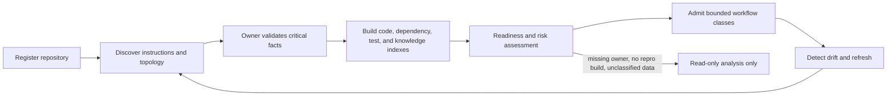
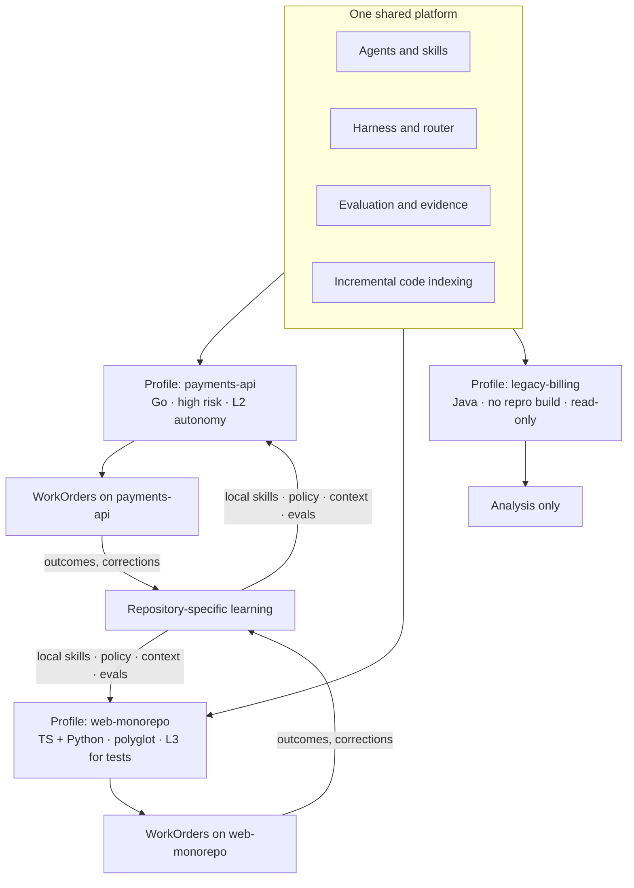
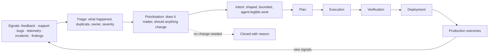
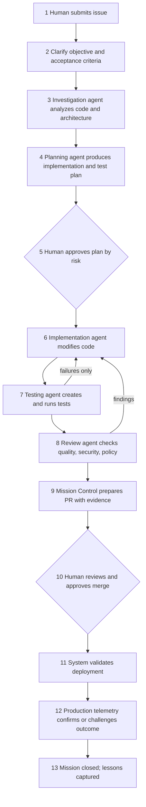
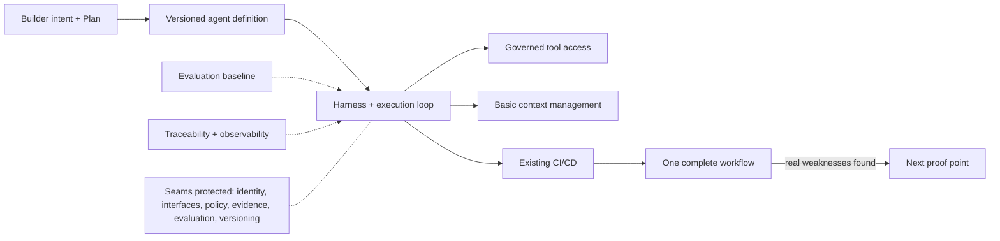
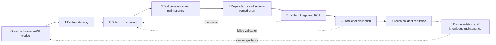
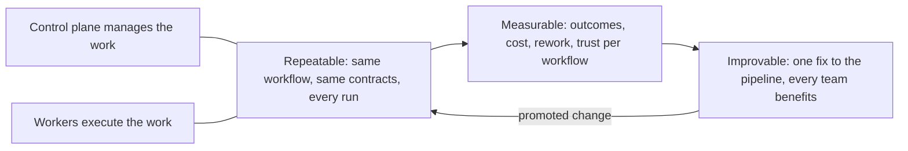

# 20. Autonomous engineering workflows

Everything in Part III so far has been about capability: agents, harnesses, environments, models, loops. This chapter is about the products those capabilities are assembled into. A **workflow** is a governed, repeatable path from a specific trigger to a specific accepted outcome, with its own evidence, its own human decisions, and its own earned autonomy. It is the unit at which a factory is actually operated, measured, and trusted. After reading this chapter you should be able to admit a repository safely, describe the first workflow worth building and why, name the eight workflows that follow, and say what proof each one owes before its output counts.

## The problem

"Autonomous software engineering" is too broad to operate. A dependency upgrade, a production incident, a feature, a test repair, and a documentation change have different inputs, failure costs, evidence, urgency, and rollback. Treating them as one generic issue-to-code loop produces vague metrics and unsafe authority. Coding agents make the implementation steps look alike (inspect files, edit, test, report), but the business workflows around those steps begin from different signals and end with different accepted outcomes. Teams automate the visible coding portion before defining who may select work or what value the workflow must prove.

Underneath that is a quieter problem: an agent can clone a repository and still know nothing it needs to change it safely. It may not know the authoritative build command, code owners, generated files, service dependencies, migration rules, test-data boundaries, deployment path, or which local instructions win when they conflict. Discovery repeated on every run is slow and inconsistent; stale discovery is worse, because it manufactures confidence from facts that no longer match the target commit. Repository knowledge is scattered across source, configuration, documentation, CI, deployment systems, package registries, ownership systems, and human memory. Monorepos contain several products with different rules. Multi-repository systems hide contracts and release order outside any single checkout. Some facts are safe to infer; others require an accountable owner.

And the reason to solve both problems is the one Luke stated in Chapter 18 and a developer-tooling founder restates from the other side in a public practitioner talk: the constraint is human attention, and the payoff of a factory is not speed with slop. Every team carries a backlog of fixes, refactors, and explorations it never gets to. With a working factory, the idea of a backlog goes away, and capacity moves to test quality, architecture, and product exploration. That only happens if workflows are legible enough to improve.

## How it works

### The front door: repository onboarding

Onboarding is not administrative setup. It is the first assurance case: evidence that the factory understands enough of the target to grant a particular kind of execution authority. Instead of a permanent "connected" flag, onboarding produces a versioned **Repository Readiness Record** covering eight dimensions.

| Dimension | Required understanding |
| --- | --- |
| Identity and ownership | Canonical repository, default branch, accountable owner, code owners, support contacts |
| Instructions | Governing repository instructions, precedence, exceptions, generated-code rules |
| Architecture | Components, boundaries, entry points, data flows, external services, critical invariants |
| Dependencies | Packages, services, schemas, repositories, runtime and release order |
| Build and test | Toolchains, setup, commands, test topology, fixtures, flaky suites, expected duration |
| Delivery | CI, artifacts, environments, deployment, feature flags, migrations, rollback |
| Security and data | Classification, secrets, network needs, licenses, sensitive paths, threat boundaries |
| Factory fit | Eligible workflows, tools, sandboxes, agents, budgets, verification, approval levels |

Four of those dimensions are produced by named discovery steps. **Instruction resolution** reads every instruction file the repository carries (root and nested `AGENTS.md` or `CLAUDE.md` files, contributor guides, generated-code markers) and resolves them into one declared precedence order, so that when two files disagree the winner is recorded rather than chosen silently at run time. **Architecture mapping** produces the component, boundary, entry-point, and data-flow view, combining human-authored architecture documents with generated maps and surfacing where they conflict. **Build/test topology** discovery establishes which build targets exist, which test suites cover which targets, how long each takes, and which are known to be flaky, so a planner can pick the cheapest sufficient verification. **Codebase indexing** is the pipeline below that turns all of this, plus the source itself, into queryable indexes with commit lineage.

The record separates two kinds of fact. **Authoritative declarations** (owner, data classification, permitted workflows, release authority) require declared sources and an accountable person. **Derived intelligence** (symbols, call graphs, ownership suggestions, test impact, architecture summaries) may be generated, and every derived view records its source commit, method, coverage, confidence, and expiry. The analogy is a building inspection: the surveyor can measure the rooms, but only the registered owner can say who is allowed to knock down a wall.

<!-- infographic: repository-onboarding -->
> **Infographic — Repository onboarding and codebase intelligence.** *(Jay's graphic goes here.)* Until then, the diagram below carries the same concept.

The **codebase intelligence pipeline** builds the indexes an agent needs at planning time: lexical and symbol search, dependency and ownership graphs, build targets, test-to-code mapping, API and schema inventories, historical change hotspots, incidents, architecture decisions, and documentation, all with source and commit lineage preserved. Uncertainty reduces scope rather than blocking everything: missing owners, nonreproducible builds, unknown deployment paths, unclassified data, or absent tests block high-risk autonomous change, while the repository may still be eligible for read-only analysis or documentation proposals. Readiness is granular by workflow and risk class, and it expires. Before each WorkOrder, preflight verifies that the required readiness evidence is still fresh for the affected scope.

There are trade-offs. Deep onboarding costs time and goes stale; incremental discovery tied to changed areas is cheaper but must not skip global controls. Human-authored architecture is more intentional; generated maps are more current; keep both and surface conflicts. Embedding every repository can improve semantic search and create privacy, cost, and freshness problems, so use hybrid retrieval only where evaluations show it improves the target tasks (Chapter 16).

### Repository intelligence at estate scale

Onboarding one repository is an assurance case. Onboarding an estate of a hundred thousand repositories is a different problem, and the two wrong answers to it are both tempting. The first is one universal agent that treats every repository the same, which works on the well-behaved majority and fails silently on the polyglot monorepo, the twenty-year-old service with no tests, and the repository whose build only works on one engineer's machine. The second is a bespoke agent, or worse a fine-tuned model, per repository, which cannot be built, evaluated, or maintained at that count. The answer between them is *one shared platform, many repository-specific profiles*: the same agents, harness, router, and evaluation machinery everywhere, configured for each codebase by a record the platform reads before it acts.

That record is the **repository profile**. It is the machine-readable core of the readiness record above, the part that preflight, the context compiler, the router, and the reviewers consult on every WorkOrder rather than the part a human reads once at admission. Its fields:

| Field | What it holds | Who consumes it |
|---|---|---|
| Languages | Primary and secondary languages with versions, and the toolchain each requires | Environment selection, capability matching |
| Polyglot handling | For **polyglot repositories**: which directories belong to which language and build, and how cross-language contracts (generated clients, schemas, FFI) are kept in step | Change classification, dependency analysis |
| Build and test systems | Authoritative build and test commands per target, expected durations, fixtures, known flaky suites | Verification planning, budgets |
| Ownership metadata | Code owners by path, accountable owner, escalation contacts, review requirements | Routing of human decisions, reviewer assignment |
| Architectural boundaries | Components, allowed dependency directions, public contracts, and the paths that are generated, vendored, or frozen | Impact analysis, scope enforcement |
| Local standards | Repository-specific guidance: instruction-file precedence, conventions, prohibited patterns, and the local skills that encode them | Context compilation, policy skills |
| Risk tier | The default risk classification for changes in this repository, and the paths that raise it | Review depth, autonomy ceiling |
| Admitted workflows | Which workflow classes may run here, at which autonomy level, with which evidence, and when that admission expires | Preflight, work selection |

A profile is versioned, owned, and mostly derived: languages, build topology, boundaries, and ownership are generated from the repository and its surrounding systems, then confirmed by an owner, while risk tier and admitted workflows are authoritative declarations. It expires like the rest of the readiness record, and drift detection refreshes it when the repository changes.

<!-- infographic: repository-profile -->
> **Infographic — One platform, many profiles.** *(Jay's graphic goes here.)* Until then, the diagram below carries the same concept.

Around the profile sit four mechanisms that keep repository intelligence current and useful at scale. **Incremental code indexing** re-indexes only what a commit changed, keyed by commit lineage, so that a hundred thousand repositories can stay fresh without a hundred thousand full rebuilds a day; a full rebuild is the exception, triggered by a toolchain or indexer version change. **Changed symbols** are computed per pull request from that index: the functions, types, and modules a diff touches, which is the seed for the change-level context of [Chapter 16](./16-data-knowledge-semantic-and-context-engineering.md) and the input to everything below. **Dependency analysis and dependency impact** follow the changed symbols outward through the dependency graph to the callers, contracts, schemas, and other repositories that could be affected, and the size and sensitivity of that set is the strongest single input to change classification and risk tier. And **repository-specific learning** closes the loop: corrections, review comments, dismissed findings, and incidents from this repository become this repository's local skills, policy exceptions, context sources, and evaluation cases, promoted through the same governed path as anything else ([Chapter 33](../06-improve/33-governed-learning-and-compounding-engineering.md)) but scoped to the profile. Repository-specific policy, skills, context, and evaluation are therefore four fields the profile *points to*, not four things it contains, and each is versioned on its own.

The division is exact. Shared and platform-owned: the agents, the harness, the router, the evaluation framework, the indexer, the profile schema. Repository-specific and profile-owned: which languages, which commands, which owners, which boundaries, which standards, which risk tier, which workflows, and what this repository has taught the factory so far. The analogy is a hospital: one set of clinical protocols and one pharmacy, and a chart at the foot of every bed. Nobody writes a new protocol per patient, and nobody treats a patient without reading the chart.

### Agent readiness

The readiness record says whether the factory understands a repository well enough to be granted authority over it. A related but different question is whether the repository is any good at being worked on by agents, and that one deserves a score. **Agent readiness** is the measured degree to which a codebase lets an agent understand, modify, execute, and verify changes without a human standing in for a missing capability. Twelve dimensions are scored: testability, CLI accessibility, build reproducibility, documentation quality, context quality, sandboxability, credential accessibility, observability, deterministic validation, architecture clarity, environment reproducibility, and dependency health. Together they produce an **Agent Readiness Score**, and the score predicts something the readiness record cannot: how many human touchpoints a task in this repository will need, and therefore what autonomy level it can economically support. Two repositories can both be admitted and differ by a factor of ten in how often an agent has to stop and ask.

The twelve dimensions group into eight readiness families, and the **Agent Readiness Assessment** is the table that scores each family with evidence rather than opinion.

| Readiness family | What is scored | Dimensions it draws on | Evidence |
|---|---|---|---|
| Context readiness | Can an agent learn what it needs from what is checked in? | Documentation quality, context quality, architecture clarity | Instruction files resolve without conflict; repository profile complete; Definition of Correct exists for admitted scopes |
| Tool readiness | Can every capability an agent needs be reached without a UI? | CLI accessibility, credential accessibility | Build, test, lint, deploy, and query all scriptable; credentials issuable to a workload identity |
| Environment readiness | Can the environment be recreated identically, on demand, in isolation? | Build reproducibility, environment reproducibility, sandboxability, dependency health | Deterministic build from a clean checkout; environment manifest; no host-only dependencies |
| Test readiness | Can an agent tell whether it broke something, quickly? | Testability | Suites mapped to targets, fast enough to run per iteration, flaky suites named |
| Observability readiness | Can an agent see what its change did at runtime? | Observability | Structured logs and metrics queryable by an agent; traces tied to a change |
| Architecture readiness | Are the boundaries the agent must respect machine-checkable? | Architecture clarity | Architecture lint rules exist and run in CI |
| Security readiness | Can an agent work without being handed more authority than the task needs? | Sandboxability, credential accessibility | Sensitive paths classified; scoped grants; secrets never in the checkout |
| Verification readiness | Can correctness be established without a human reading the diff? | Deterministic validation | Verifiers exist for the repository's Definition of Correct; feedback surface density measured |

Most of the table reduces to one property. The **deterministic feedback surface** is the set of machine-readable checks and signals that let an agent judge its own progress without human judgment: the compiler, the type checker, tests at every level, coverage, linters, architecture checks, security scans, performance thresholds, structured logs, metrics, build results, environment health, and schema validation. **Feedback surface density** is how much of that surface exists and how much of the codebase it covers. A repository with two mechanisms (it compiles, and a smoke test passes) gives an agent almost nothing to correct against; one with forty gives it a correction on nearly every mistake before a human sees it. Higher density means more self-correction, which is the inner loop of Chapter 18 made measurable, and it is the single readiness investment with the highest return, because every mechanism added to the surface is used by every agent on every run.

Architecture is the part of the surface teams most often leave as a document. **Architecture linting** turns architectural intent into machine-enforceable checks, and nine properties can be enforced this way: dependency direction, layer boundaries, ownership, API contracts, naming, security boundaries, observability requirements, forbidden dependencies, and data-access rules. Each becomes a rule that fails a build, which is the same three-way rule from [Chapter 10](./10-the-agent-factory.md): a rule the organisation can state is a rule software can check. *Architecture moves from a document to an executable constraint.* Once it has, the architectural-boundaries field of the repository profile is not a description an agent might respect but a check it cannot pass without respecting.

A codebase that scores well has usually been shaped for it. **Factory-friendly architecture** is software designed so that agents can safely understand, modify, execute, and verify it, and ten characteristics recur: strong typing, clear module boundaries, fast tests, deterministic builds, integrated tooling, CLI accessibility, explicit interfaces, reproducible environments, machine-readable errors, and strong contracts. None of them is new; every one was good engineering before agents existed. What changes is the return: a property that saved a human a few minutes of confusion saves an agent a full retry, at inference cost, on every run. Raising a repository's readiness is therefore ordinary engineering work with an unusually clear payback, and the maintenance loops of [Chapter 33](../06-improve/33-governed-learning-and-compounding-engineering.md) can do much of it.

The smallest unit of that work is an **agent affordance**: an interface or property deliberately created to make a capability easier and safer for an agent to use. The recurring ones are a CLI or API in place of a UI, a structured query in place of raw logs, an environment manifest in place of a setup wiki page, and structured errors in place of stack traces the agent must parse. Each one removes a place where the agent would otherwise guess, and guessing is where cost and risk come from. When a task keeps needing a human touchpoint at the same step, the fix is usually an affordance, not a prompt.

### Before the issue: signal intelligence

The wedge that follows begins with a human submitting an issue. Something produced that issue, and a factory whose boundary is ticket-to-code has left the most expensive judgment outside it. A **signal** is any observable event indicating a potential need for change: customer feedback, a support case, a bug report, telemetry, an incident, a chat thread, an analytics anomaly, a security finding, a performance regression, an engineering discussion. *The factory begins before code; its boundary is signal-to-outcome, not ticket-to-code.* **Signal intelligence** is the workflow that ingests, classifies, correlates, deduplicates, prioritises, and routes signals into actionable work, and it answers six questions about each: what happened, does it matter, is it a duplicate, who owns it, how severe is it, and should it change anything at all. Most signals should end at the last question with "no," and a signal workflow that cannot say no is an intake flood with better tooling.

<!-- infographic: signal-to-deployment -->
> **Infographic — The signal-to-deployment loop.** *(Jay's graphic goes here.)* Until then, the diagram below carries the same concept.

The loop is Signals → Triage → Prioritisation → Intent → Plan → Execution → Verification → Deployment → Production outcomes → Signals. The issue-to-PR wedge is its middle: everything from Intent to Deployment. Signal intelligence is the workflow in front of it, and production validation (workflow 6 in the catalog) is the one behind it that turns outcomes back into signals. Two of the loop's steps stay human by design. **Work shaping** is the transformation of ambiguous demand into bounded, agent-legible work with explicit goals, constraints, scope, risk, and verification criteria; it is where humans move from writing implementation to shaping executable intent ([Chapter 6](../02-design/06-intent-and-specification-engineering.md)). And prioritisation is where **product taste** lives: the judgment about what should exist, which trade-offs matter, and what deserves priority. "Can I build this?" automates; "should we, and what should it be?" stays human. The whole loop is built so that the two human steps receive well-triaged, deduplicated, correlated input rather than a raw feed, which is what makes them affordable at factory volume.

### The first workflow: governed issue-to-pull-request delivery

Do not build the whole factory for every organization first. Choose one painful, repeatable, measurable workflow and prove it. Jay's mission names the wedge: **governed issue-to-pull-request delivery**. In its full form the workflow has thirteen steps; the ten-step version in the mission document is the same path with clarification, post-deployment observation, and closure folded in.

<!-- infographic: issue-to-pr-wedge -->
> **Infographic — The governed issue-to-pull-request wedge.** *(Jay's graphic goes here.)* Until then, the diagram below carries the same concept.

Why this wedge works: it is easy to understand and familiar to engineering leaders; close to measurable business value; relevant to every engineering organization and valuable across industries; suitable for progressive autonomy; demonstrable through a real user interface; expandable into testing, incidents, security, and operations; and closely aligned with a quality-engineering background, because the hard part is not generating code but controlling transitions, evidence, and accountability. It matches the daily model the factory is meant to produce: developers spend their time reviewing plans, evaluating decisions, and approving high-value changes while agents perform the implementation and validation.

What not to claim: do not say the system will autonomously build any feature in any repository. Say that you would begin with clearly scoped, lower-risk work in a well-understood repository and expand autonomy only after measuring reliability. That is the sentence of an experienced operator, not an evangelist.

Two practitioners describe what this wedge looks like when it is actually running. One developer-tooling team, in the same public talk, set two ground rules for themselves: no more human-written code and no more interactive coding-agent sessions. Every piece of work starts as an issue in the tracker, is picked up by a headless agent in a sandbox, and comes back as a pull request that engineers review with comments. It sounds extreme and turns out to be how many teams already worked: ask the agent, switch tabs, come back, review. What changes is legibility. The issue holds the initial prompt, the pull request holds all feedback, and both live in durable places open tools can read, which is the groundwork every later improvement loop depends on. Their first orchestrator ran under one engineer's personal GitHub credentials, which briefly made her the top contributor in the company; the lesson is that identity, webhooks, comment reactions, long-running execution beyond what CI runners tolerate, and token renewal are problems every team hits in the same order. They also outlawed local configuration: everything an agent needs is checked into the repository, so one person's improvement improves the factory for everyone.

The general form of that legibility is the **agent-legible workflow**: intent, execution, feedback, decisions, and outcomes all exist as structured, retrievable artifacts rather than as a session in someone's terminal. The mapping is exact. The ticket is the intent. The pull request is the proposed change. The comments are the feedback. CI is the verification. The merge is the accepted outcome. The incident, when there is one, is the delayed outcome. Read that way, an organisation's existing tracker and source host are already a factory data model, and the discipline is to keep every step inside it: issue → agent → pull request → comments → agent changes, never an invisible session whose corrections evaporate when the tab closes. Everything downstream, from the human-touchpoint count of [Chapter 13](./13-coding-harnesses-and-agent-protocols.md) to the historical behaviour mining of [Chapter 10](./10-the-agent-factory.md), reads these artifacts; a workflow that does not produce them cannot be measured or mined.

IndyDevDan's "super simple software factory" shows the same wedge from inside the code. An **AI developer workflow** is a script with named phases (request, plan, commit plan, build, test, fix, review, revise, document, commit docs), each either an agent call or deterministic code, with the two clearly delineated. Every agent has its "core four" (context, model, prompt, tools) in a configuration file. Every phase ends with a deterministic gate that validates typed JSON output before the next phase begins; the plan is handed to the builder as an envelope with a note for the next agent. Tests run in code, and only failures go back to the agent. The design principles are observable (every phase, prompt, tool call, and cost is visible in a swim-lane view), customizable (any model, harness, or tool in any seat), and reusable (installed into a new repository as a skill with a cookbook). His summary is worth carrying into every workflow in this chapter: agents propose, code disposes; and the test of a workflow is the thousandth run, not the first.

### What to build first, and what to leave alone

The wedge tells you which workflow to prove. It does not tell you how much factory that proof needs, and the temptation is to build all of it. Resist that. Pick a few high-value workflows with design partners who will use them, and build only the architecture that one end-to-end path requires. That minimum is still substantial, because each piece exists to stop a specific way the path would otherwise be untrustworthy.

| Build first | What it is for |
|---|---|
| Builder intent and a versioned Plan | So the system solves the stated problem, and a human approved the approach |
| A versioned agent definition | So "the agent" is a contract that can be changed, evaluated, and rolled back |
| A harness with an execution loop | So the model reasons inside bounded, recoverable execution |
| Governed tool access | So intelligence does not become authority the moment a tool is attached |
| Basic context management | So each step gets what it needs and nothing it should not see |
| An evaluation baseline | So "better" means something before anything is changed |
| Traceability and observability | So a failure can be explained by lineage instead of memory |
| A safe path into existing CI/CD | So the output lands in the delivery system the organization already trusts |

Build those, and build them behind the seams that will matter later even if their first implementation is thin: identity, interfaces, policy, evidence, evaluation, versioning. A thin identity layer that every call passes through can be deepened; a missing one has to be retrofitted into every call.

> *Build for the next proof point without painting yourself into the next architecture.*

What not to build first is just as specific: sophisticated autonomous learning, highly dynamic multi-agent swarms, ML-based model routing, a large universal memory layer, hundreds of generic skills, and elaborate agent organizational structures. Every one of those is a hypothesis about what the factory will need, and none of them can be designed well until production evidence says which parts of the simple version broke. Adaptive routing before evaluation data amplifies noise; a universal memory layer before a promotion policy is a stale-context generator; a skills library before the workflows that would use it is inventory.

> *Don't generalize before you've earned the abstraction.*

The output of this phase is one workflow that runs end to end and shows you where it is weak. That is more valuable than breadth, because a weakness in a complete path is a fact about the architecture, while a demo that stops at the pull request is a fact about the demo.

> *One complete workflow exposing real weaknesses beats ten disconnected demos.*

### The workflow catalog

Once the wedge is reliable, expand in order. The catalog turns "use agents for engineering" into a portfolio of explicit, governable **workflow products**, each of which declares:

- trigger and authoritative intake source;
- problem owner and intended outcome;
- supported repository and risk classes;
- planning, execution, and verification recipe;
- agents, skills, tools, environment, and budgets;
- human decisions and escalation;
- evidence, release, observation, and rollback requirements;
- success, failure, cost, attention, and trust measures; and
- current maturity and eligible autonomy.

<!-- infographic: workflow-catalog -->
> **Infographic — The eight initial workflows.** *(Jay's graphic goes here.)* Until then, the diagram below carries the same concept.

| Workflow | Trigger | Path | Accepted outcome |
| --- | --- | --- | --- |
| 1. Feature delivery | Approved product intent | Issue → plan → implementation → tests → PR → deployment evidence | Customer behavior delivered and verified |
| 2. Defect remediation | Reproduced defect | Bug → reproduction → root cause → fix → regression test → PR | Root cause corrected with regression proof |
| 3. Test generation and maintenance | Coverage or change signal | Code change → impact analysis → missing tests → generated tests → validation | Useful, stable tests protecting specified behavior |
| 4. Dependency and security remediation | Vulnerability or lifecycle signal | Vulnerability → risk assessment → upgrade → compatibility tests → PR | Risk reduced without compatibility regression |
| 5. Incident triage and root-cause analysis | Operational alert | Alert → evidence collection → severity → hypotheses → root cause → recommendation → postmortem | Containment, evidence-backed cause, corrective plan |
| 6. Production validation | Deployment event | Deployment → telemetry analysis → synthetic validation → anomaly detection → rollback or escalation | Technical and intended outcomes confirmed or rolled back |
| 7. Technical-debt reduction | Maintainability signal | Code-health signal → prioritization → refactoring plan → change → validation | Measurable risk or cost reduced without behavior loss |
| 8. Documentation and knowledge maintenance | System or policy change | System change → documentation impact → updates → verification → publication | Correct, discoverable, verified guidance published |

Two rules govern the portfolio. First, **work selection is an authority decision**. An autonomous backlog selector may rank eligible work by value, urgency, risk, dependencies, readiness, capacity, and confidence. It may not invent product priority, widen scope, or consume unowned work. Work-in-progress limits and small batches keep recovery cheap and outcomes attributable, and automated intake needs admission, deduplication, ownership, priority policy, and capacity budgets before it may select anything, or it will flood the system with low-value work. Second, **autonomy is earned per workflow**. A repository may qualify Level 3 autonomy for test maintenance while production migrations stay at Level 1. Metrics and incidents attach to the exact workflow, risk class, environment, and capability graph. The unit of autonomy is not the agent or the repository; it is a defined workflow on a bounded scope under measurable conditions.

A broad generic workflow reduces configuration and hides important differences. Many narrow workflows improve control and cost maintenance. Start with a small catalog whose entries share common runtime contracts but keep distinct acceptance and risk policy.

### Change workflows and their proof shapes

Code changes look alike in a pull request while supporting different claims, and a single generic acceptance template lets activity substitute for proof. Repository tooling centers on diffs and checks, not causal claims; agents produce plausible edits and tests that agree with their own implementation; existing suites may be flaky or insensitive; modernization expands across boundaries faster than evidence follows. So each change workflow carries its own **proof shape**.

**Feature delivery** begins from an approved outcome, explicit non-goals, behavioral assertions, rollout, and a customer measure. Verification covers requirements coverage, regression, security, operability, and production outcome.

**Defect remediation** begins with a reproducible failure or an explicit statement that reproduction is unavailable. Preserve the failing fixture, identify the root cause, introduce a regression test that fails before the fix, implement the smallest sufficient change, and verify adjacent behavior. A disappearing symptom without causal evidence is not a root-cause fix. Requiring reproduction can delay urgent containment, so separate containment from permanent repair and preserve the unresolved cause.

**Test generation and maintenance** begins from risk, change impact, missing behavior coverage, or a broken test. Evaluate assertion quality, fault sensitivity, determinism, isolation, duration, and maintenance cost. Mutation testing or deliberate fault injection shows whether a test detects the failure it claims to guard; it is powerful and expensive, so target critical logic. Tests require fault sensitivity, not line count.

**Technical-debt reduction** begins with a measured constraint: change amplification, defect concentration, dependency risk, build duration, cognitive load, or unsupported technology. Preserve behavioral invariants and compare the named measure before and after. "Cleaner code" alone is not an accepted outcome.

**Dependency remediation** binds vulnerability, lifecycle, or compatibility evidence to the exact dependency graph. Verify transitive changes, licenses, build artifacts, runtime behavior, rollback, and known breaking changes.

**Modernization and migration** inventory consumers, schemas, data, compatibility windows, dual-read or dual-write behavior, backfill, verification, cutover, and rollback. Irreversible steps require human risk acceptance and restore evidence. Full dual-running improves confidence and increases operational complexity.

Across all of them, keep implementation and verification independent. For material changes, validators use requirements, fault models, static analysis, integration environments, or tests not authored solely by the implementer. The objective is to reduce correlated error, not to require a different model for every check. Specialization belongs in explicit contracts and verification, not in opaque agent personalities; that is what makes one runtime useful for many claims without pretending the claims are identical.

### Operational workflows

Operational work arrives with incomplete information and time pressure. An alert may be noise, a vulnerability may be unreachable, a deployment may be technically healthy but wrong for customers, and documentation may contradict the system. These workflows cross production, security, source, deployment, support, analytics, and human communication systems, and they need different authorities for observation, containment, repair, disclosure, rollback, and acceptance. The governing rule is to separate observation, diagnosis, containment, and correction, because premature action can destroy forensic evidence, widen impact, or publish confident misinformation.

**Security remediation** validates affected versions, reachability, exploitability, asset criticality, and available fixes. Containment, upgrade, compensating control, exception, and disclosure have separate owners. Verification covers compatibility, residual exposure, provenance, and production confirmation.

**Incident triage and root-cause analysis** preserves a timeline and evidence before any mutation. Agents may correlate telemetry, changes, dependencies, and known failures; they must label observations, hypotheses, confidence, and missing data. Containment authority is narrow and reversible. Root cause requires evidence connecting conditions to failure, not the most plausible narrative. Fast automated containment reduces impact and worsens a wrong diagnosis, so preauthorize only reversible, bounded actions with explicit stop conditions. Operational autonomy is valuable when it shortens time to reliable understanding, not merely time to action; a fast, unsupported causal story is a new incident risk.

**Production validation**, also called **post-deployment verification**, binds a deployment to expected technical and customer outcomes. It checks health, errors, latency, security, synthetic behavior, feature exposure, and product measures across a defined observation window. Failed validation chooses rollback, containment, corrective work, or human risk acceptance.

The **documentation maintenance workflow** (row 8 of the catalog, **documentation and knowledge maintenance**) begins from a system, policy, interface, or workflow change. Impact analysis identifies affected guidance. Verification checks commands, links, schemas, examples, ownership, discoverability, and alignment to released behavior. Publication remains a governed external effect. Verification can be partly automated; semantic correctness still needs an accountable owner.

Every operational workflow preserves an **operational evidence bundle**: signal source, timestamps, affected scope, identities, hypotheses, actions, approvals, artifacts, telemetry queries, changes, communication, outcome, and unresolved questions, with sensitive evidence under retention and access policy. Rich retention improves forensics and raises privacy and storage obligations. And every operational workflow produces learning without automatic mutation: post-incident and production signals may propose tests, alerts, skills, tools, context, runbooks, policies, or architecture changes, but each proposal enters the governed improvement path and never silently edits active factory behavior.

### Where the workflows converge: the three loops

The inner, outer, and meta loops (Chapter 18) are the frame that ties the catalog together. The inner loop is what the agent runs while working on a change: the fast checks, skills, and test suite that make it land correctly more often, which raises **autonomy**, how little a human has to correct. The outer loop runs at the pull-request boundary: agent QA that exercises the product, deeper review, mutation testing, and **verifiers**, which are small, fast, cheap model-powered lint rules that check one invariant each ("every front-end component has an accessibility attribute," "every log call uses the internal logger") across a glob of files, and which now succeed nearly every time because the question is so narrow. The outer loop raises **automation**, how much can be accepted without a human reading every line. The meta loop watches both and codifies every correction so that a mistake is made once. Progress toward a factory is visible in three numbers: manual takeovers falling, human pull-request comments falling, and pull requests initiated without human input rising, all while quality is held constant and then pushed up. The adoption pattern is the same everywhere: bottlenecks move outward. First the agent cannot put up a good PR; then the PR is fine but nobody trusts it without review; then the question becomes how large a task can run to completion, which only a meta loop answers. Do not attempt this as one monolithic lift. Find a workflow everyone can agree on, put a box around it, automate it, and add the next.

### What CI/CD did for delivery, the factory does for agentic engineering

There is a precedent for all of this, and it is the one every engineering leader already lived through. Developers have always built and tested on their own machines, and they still do. As organizations grew, the build, test, artifact, and deploy steps moved into shared infrastructure, and the payoff was not only speed. It was that one improvement to the pipeline (a faster test runner, a new security scan, a better rollback) benefited every team at once. The individual practice became shared engineering infrastructure.

Agentic engineering is following the same path. Interactive coding agents stay on the developer's machine, the way local builds did. But the repeatable, delegable work, the kind that starts as an issue and should end as a verified change, benefits from a common factory that manages workflow, models, skills, evaluation, security, and telemetry for everyone. A **software factory** is to agentic development what a CI/CD system is to build and delivery: the shared infrastructure that makes it repeatable, measurable, and scalable, in that order, because each property enables the next.

Repeatability is what makes measurement possible: you cannot compare run 400 to run 40 unless they went through the same path. Measurement is what makes improvement real rather than anecdotal. And improvement in shared infrastructure compounds: fix the verifier once and every workflow inherits it. The division of labor is the same one CI systems settled on years ago. *The control plane manages the work. Workers execute the work.* Neither should hold the other's state.

> *Do for agentic engineering what CI/CD did for build and delivery: turn individual practices into shared engineering infrastructure. Improve once, benefit everyone.*

## How to build it

1. **Onboard the repository.** Run a read-only discovery workflow that produces an explainable readiness packet across the eight dimensions. Owners approve material facts and choose eligible workflow classes. Record source commit, method, coverage, confidence, and expiry on every derived index. Wire drift detection so later commits trigger targeted refresh, and make preflight check readiness freshness for the affected scope before each WorkOrder.
2. **Build the wedge end to end before anything else.** Intake, clarification, investigation, planning, human plan approval, execution, automated validation, review, evidence-bearing pull request, human merge, deployment validation, production confirmation, closure. Make the whole path legible: issue, prompt, plan, attempts, findings, evidence, decisions, and cost in durable records that tools can read.
3. **Write the workflow's manifest** using the nine catalog fields. State its eligible autonomy level, and the promotion evidence that would raise it.
4. **Make coordination code.** Phases with deterministic gates; typed, validated handoff envelopes; tests run by code with only failures returned to the agent; the same runtime restartable by run identifier.
5. **Govern work selection.** Admission, deduplication, ownership, priority policy, capacity budgets, and WIP limits before any automatic selection is switched on.
6. **Add workflows in the mission's order**, each with its own proof shape, human gates, evidence, observation window, rollback, and metrics: feature delivery, defect remediation, test generation and maintenance, dependency and security remediation, incident triage and RCA, production validation, technical-debt reduction, documentation and knowledge maintenance.
7. **Keep verification independent** for material changes: validators use requirements, fault models, static analysis, integration environments, or tests not authored solely by the implementer.
8. **Give operational workflows a typed intake** that correlates signals to exact releases and Factory Versions, creates bounded investigation work, and shows timeline, blast radius, hypotheses, confidence, evidence, recommended actions, and authority on the review surface.
9. **Instrument the catalog.** Per workflow: owner, eligible scope, volume, service level, cost, attention demand, acceptance rate, change failure, maturity, and recent trust events. Canary and roll back new workflow versions like any other production change.
10. **Close the meta loop.** Every human correction, review comment, failed check, and escaped defect becomes a case for an evaluated change to a skill, instruction, verifier, or test, promoted through governance (Chapter 33).

## Failure modes

| Failure | How you notice | What to do |
| --- | --- | --- |
| Registration mistaken for readiness | Agent acts on a repository with no owner, classification, or reproducible build | Readiness record with expiry; uncertainty narrows authority to read-only |
| Stale discovery | Plan cites facts from an old commit | Derived views carry source commit and expiry; preflight checks freshness |
| Conflicting instructions | Two instruction files disagree; agent picks one silently | Declared precedence and exceptions in the readiness record |
| Generic acceptance template | Defect "fixed" with no failing-then-passing test; refactor "done" with no measure | Per-workflow proof shape enforced by the quality contract |
| Symptom suppression | Symptom disappears; no causal evidence | Reproduction and root cause required; unresolved cause preserved when containment must come first |
| Self-confirming tests | Tests written after the implementation agree with it | Fault sensitivity via mutation or injection; validation contract written before code |
| Scope creep in modernization | Change expands across boundaries faster than evidence | Inventory, compatibility windows, human risk acceptance for irreversible steps |
| Unsupported causal story in an incident | Fast, confident narrative; hypotheses unlabeled | Observation/hypothesis/confidence labels; evidence connecting conditions to failure |
| Premature containment | Automated action destroys forensics or widens impact | Only reversible, bounded, preauthorized actions with stop conditions |
| Healthy-but-wrong deployment | Health checks green; customer outcome absent | Production validation binds deployment to intended outcomes over an observation window |
| Confident misinformation published | Docs updated from the plan, not the released behavior | Verify commands, links, schemas, examples against release; accountable owner |
| Selector invents priority | Autonomous backlog consumes unowned or widened work | Selection authority limited to ranking eligible, owned work; WIP limits |
| Intake flood | Automated triggers create low-value work faster than capacity | Admission, dedup, ownership, priority policy, capacity budgets |
| Autonomy declared for the repository | Migration runs at the autonomy level earned by test maintenance | Autonomy attached to exact workflow, risk class, environment, capability graph |
| Illegible workflow | Corrections live in chat logs and local configs | Issue and PR as the ledger; no local configuration; everything in the repository |
| Learning by mutation | Postmortem edits factory behavior directly | Proposals enter the governed improvement path only |
| Building everything first | Months in, no workflow runs end to end; ten demos, no production evidence | Build the eight-item minimum behind protected seams; prove one complete path |
| Generalizing before the abstraction is earned | Swarms, learned routing, universal memory, or hundreds of skills built on no production data | Treat them as hypotheses; build each only when a proven workflow shows the need |
| Parallel delivery universe | Generated changes bypass the organization's SCM, CI, and deployment systems | Route every change through the existing supply chain; make it agent-aware rather than replacing it |
| One universal agent | The same configuration runs on every repository; it fails silently on the polyglot monorepo and the untested legacy service | A repository profile per codebase read on every WorkOrder; admitted workflows and risk tier set per profile |
| An agent or model per repository | Bespoke agents or fine-tuned models multiply with the estate and cannot be evaluated or maintained | One shared platform; repository-specific learning lives in local skills, policy, context, and evals the profile points to |
| Full re-index on every commit | Index freshness lags by days across a large estate, or indexing cost dominates | Incremental code indexing keyed by commit lineage; full rebuilds only on indexer or toolchain change |
| Risk classified by file count | A one-line change to a shared contract is treated as small | Dependency impact from changed symbols drives change classification and risk tier |
| Admitted but not ready | A repository is admitted and every task in it stops to ask a human at the same step | Score agent readiness across the eight families; fix the lowest family before raising autonomy |
| Thin feedback surface | The agent's only signals are "it compiles" and one smoke test; mistakes reach human review | Raise feedback surface density: tests per target, linters, type checks, architecture lint, structured errors |
| Architecture as a document | Boundaries live in a design doc; agents cross them and reviewers catch some | Architecture linting: dependency direction, layers, ownership, contracts, naming, security boundaries, observability, forbidden dependencies, data access, enforced in CI |
| Guessing where an affordance is missing | The same human touchpoint recurs at the same step: a UI-only action, a log to parse, a setup page to follow | Add the affordance: CLI or API, structured query, environment manifest, structured errors |
| Ticket-to-code boundary | The factory starts at the issue; triage, deduplication, and prioritisation happen in chat or not at all | Signal intelligence in front of the wedge; production outcomes fed back as signals |
| Signal workflow that cannot say no | Every signal becomes work; the backlog refills faster than the factory drains it | Six triage questions with "should anything change" answered explicitly; closed-with-reason is an outcome |
| Invisible sessions | Corrections happen in an interactive session and never reach the ticket or PR | Agent-legible workflow: ticket, PR, comments, CI, merge, incident as the record |

## In Mission Control

At study commit [`d902fae`](https://github.com/jaydubya818/MissionControl/tree/d902fae7032c0696b531c44ae88829c652516fc6), Mission Control deeply specifies the governed issue-to-pull-request path and provides the domain, orchestration, evidence, release, feedback, and learning primitives the other workflows reuse: Missions and versioned Plans, the WorkOrder → Task → Attempt hierarchy, independent validation with evidence, GitHub App publication, human WorkOrder acceptance, and separate release, deployment, and production-evidence records. The golden path has been exercised as a partial run with control-plane evidence, and the maturity map records that the current proof is stronger before merge than after production-outcome validation.

Repository registration, configuration, workspace manifests, multi-repository coordination, environments, preflight, policy, and context packages exist and establish real authority boundaries. What the studied evidence does not show: a complete repository onboarding pipeline with a readiness record, owner attestation, codebase-indexing lifecycle, drift detection, or workflow-specific admission based on discovered capabilities; published contracts, labs, maturity evidence, and operating metrics for the eight workflow classes; accepted runs for the change workflows other than the feature path, or complete deployment and outcome closure for that path; or complete incident, security, production-validation, or knowledge-maintenance workflows with accepted evidence and recovery drills. The golden path is the first workflow product, not proof of the portfolio, and the operational claims remain architectural until those paths are exercised.

## Retain this

- A workflow is the operable, measurable, trusted unit: a specific trigger to a specific accepted outcome, with its own evidence, human decisions, and earned autonomy — never one generic issue-to-code loop for everything.
- Registration is not readiness. Onboarding produces an expiring, versioned readiness record and profile per repository — one shared platform, many repository-specific profiles, never one universal agent or a model per repository — with derived facts carrying source, confidence, and expiry so uncertainty narrows authority instead of blocking analysis.
- Start with one wedge, governed issue-to-pull-request delivery, because it is measurable, universal, and demonstrable, then expand in a fixed order (feature, defect, tests, dependencies, incidents, production validation, tech debt, docs), each with its own proof shape: reproduction precedes repair, tests need fault sensitivity not line count, refactors need a named measure.
- Build the eight-item minimum behind protected seams (intent, agent definition, harness, governed tools, context, evaluation baseline, traceability, a safe path into existing CI/CD) and stop there. One complete workflow exposing real weaknesses beats ten disconnected demos; swarms, learned routing, universal memory, and large skill libraries are hypotheses until production evidence asks for them.
- Agent readiness is scored, not assumed, across twelve dimensions and eight families. The deterministic feedback surface an agent corrects against is the highest-return investment, and architecture linting turns boundaries from a document into an executable constraint.
- The factory's boundary is signal-to-outcome, not ticket-to-code: work shaping and product taste stay human, and an agent-legible workflow keeps ticket, PR, comments, CI, merge, and incident as one retrievable record so every later loop can read it.
- The factory is to agentic engineering what CI/CD is to delivery: repeatability enables measurement, measurement enables improvement, and one fix to shared infrastructure benefits every team.

## Go deeper

- [5. Authoritative records](../02-design/05-authoritative-records.md) for the Mission, Plan, WorkOrder, Task, and Attempt records the wedge runs on; [6. Intent and specification engineering](../02-design/06-intent-and-specification-engineering.md) for clarification and acceptance criteria.
- [7. Governance, policy, and risk-proportional approval](../02-design/07-governance-policy-and-risk-proportional-approval.md) and [3. First principles](../01-understand/03-first-principles-trust-evidence-and-authority.md) for the autonomy levels workflows earn.
- [9. Multi-repository design](../02-design/09-multi-repository-design.md) for onboarding when one product spans several repositories.
- [16. Data, knowledge, semantic, and context engineering](./16-data-knowledge-semantic-and-context-engineering.md) for codebase indexes and hybrid retrieval.
- [18. Agent and loop engineering](./18-agent-and-loop-engineering.md) for the loops inside each workflow.
- [22. Testing strategy for agentic change](../04-prove/22-testing-strategy-for-agentic-change.md) and [24. Quality contracts, proof packages, and certificates](../04-prove/24-quality-contracts-proof-packages-and-certificates.md) for proof shapes as enforceable contracts.
- [25. CI/CD, progressive delivery, and production verification](../04-prove/25-cicd-progressive-delivery-and-production-verification.md) for production validation; [29. Resilience, incidents, and the control tower](../05-operate/29-resilience-incidents-and-the-control-tower.md) for the incident framework.
- [32. Production feedback, automated review, and the agentic merge queue](../06-improve/32-production-feedback-review-and-the-agentic-merge-queue.md) and [33. Governed learning and compounding engineering](../06-improve/33-governed-learning-and-compounding-engineering.md) for the meta loop.
- Appendix: [Mission Control capability, workflow, and admission map](../appendix/mission-control/03-capability-workflow-and-admission-map.md) and [implementation maturity and evidence map](../appendix/mission-control/01-implementation-maturity-and-evidence-map.md), assessed at `d902fae`; [Glossary](../appendix/glossary.md).
- Sources: Jay West, "AI Software Factory Mission" (the wedge, the eight workflows, the lifecycle), the AI Software Factory study guide, chapter 9 (the thirteen-step version and "what not to claim"), and the factory architecture notes (what to build first, what not to build first, the CI/CD analogy, repository intelligence at estate scale: the repository profile, incremental indexing, changed symbols, dependency impact, and repository-specific learning); public practitioner talks, 2026, on getting to a software factory, harness engineering, and why the backlog disappears; IndyDevDan, "Software factories give leverage on your prompt" (AI developer workflows, agents propose and code disposes).
- Public practitioner talks, 2026: agent readiness and the Agent Readiness Score, the eight readiness families and the Agent Readiness Assessment, the deterministic feedback surface and feedback surface density, architecture linting, factory-friendly architecture, agent affordances, the agent-legible workflow, and signal intelligence with the signal-to-deployment loop, work shaping, and product taste.
- Primary references: Backstage Software Catalog; Development Containers specification; DORA capability catalog and user-centric focus; NIST Cybersecurity Framework (all accessed 2026-08-30).
