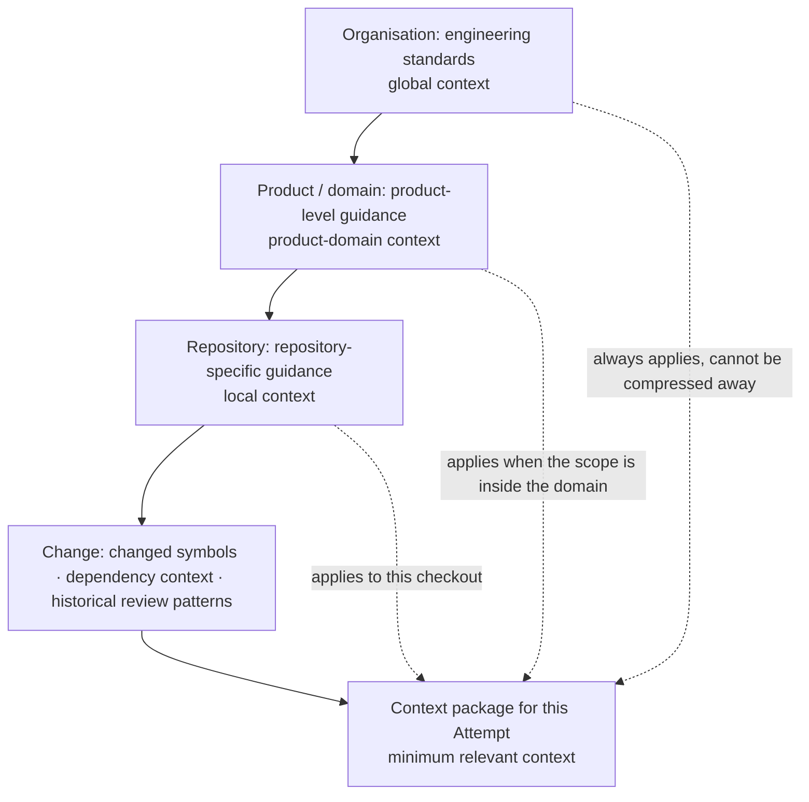
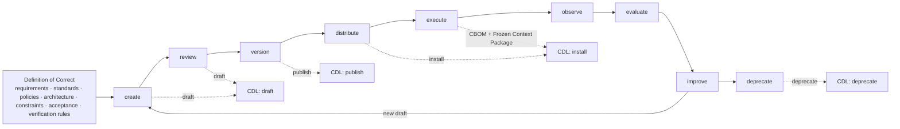
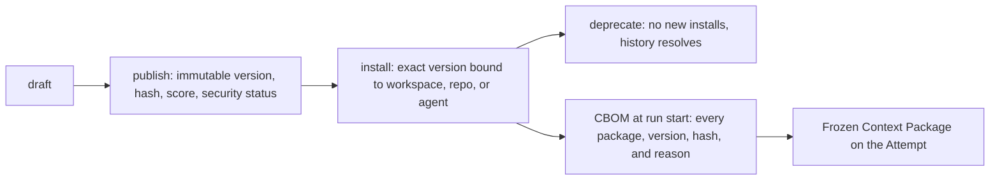
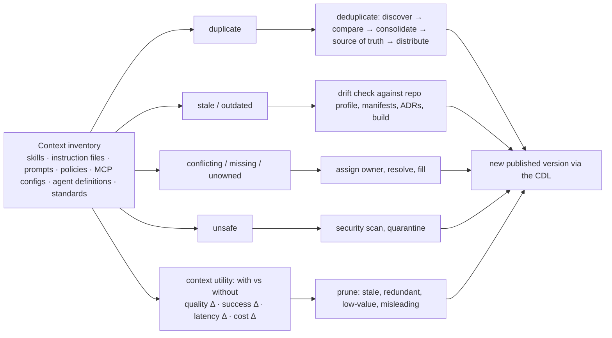
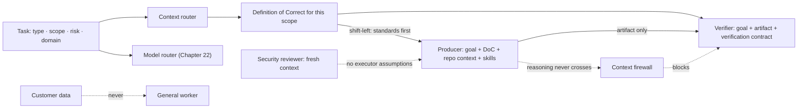
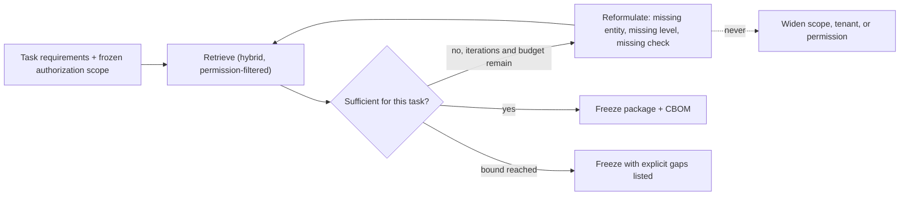
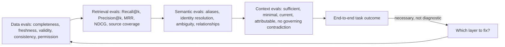

# 20. Context engineering

Context engineering compiles the smallest sufficient, permission-aware, attributable decision package for one step of work. It is not “put everything in the window”: it is a lifecycle of selection, trust classification, packaging, evaluation, correction, expiry, and revocation.

## The problem

A large context window can contain the right document and still emphasize stale, unauthorized, contradictory, or irrelevant material. Retrieval quality alone cannot prove decision quality. A factory needs hierarchical context, explicit source trust, reproducible packages, and a sufficiency loop that knows when to retrieve, stop, or escalate.

## How it works

### Hierarchical context: organisation, product, repository, change

The context graph answers *where things are*. A second structure answers *which of them apply to this change*, and it is a hierarchy with four levels. **Hierarchical context** arranges everything an agent might be shown by the scope at which it is true:

| Level | Scope | What lives there | Owner | Examples |
|---|---|---|---|---|
| Organisation | **Global context** | **Engineering standards**: security policy, data classification, licensing rules, the Project Constitution, house coding standards | Platform and security | "Nothing classified RESTRICTED leaves the region"; "every public endpoint has a contract test" |
| Product / domain | **Product-domain context** | **Product-level guidance**: the domain model, service boundaries, shared contracts, the product's architecture decisions, its incident history | Product architecture | "Billing and entitlements never share a database"; the semantic contract for this domain |
| Repository | **Local context** | **Repository-specific guidance**: instruction files, build and test topology, ownership, local conventions, the repository profile of [Chapter 26](./26-autonomous-engineering-workflows.md) | Repository owners | "Generated files under `gen/` are never edited by hand"; "run `make verify` before proposing" |
| Change | The change itself | What this diff touches and what touches it | The Attempt | Changed symbols, their dependencies, prior review comments on this area |

The bottom level is the one most retrieval systems skip, and it is where the biggest savings are. Three retrieval moves make it precise. **Changed-symbol retrieval** starts from the functions, types, and modules the diff actually modifies, resolved through the code index rather than guessed from file paths, and pulls their definitions and immediate usages. **Dependency context** goes one hop out: the callers, callees, contracts, and schemas the changed symbols depend on or are depended on by, so the agent can see what it might break without reading the repository. **Historical review patterns** add what reviewers have said about this area before: the comment that appears on every PR touching this module, the incident that started here, the finding that was dismissed last time and why. Together they give a reviewer or implementer the part of the repository that is relevant to *this* change, at a fraction of the tokens a whole-repository dump would cost, and with far less for the model to be distracted by.

<!-- infographic: context-hierarchy -->
> **Infographic — The four-level context hierarchy.**

The hierarchy fixes two rules the compiler needs. Precedence runs downward: a repository convention cannot override an organisation standard, and a change cannot override either, so the compiler allocates global material first and never compresses it below its governing clauses. Selection runs upward: retrieval begins at the change and climbs only as far as the change requires. A one-line fix inside one module needs its changed symbols, their dependencies, the repository's build command, and the global standards; it does not need the product's architecture decision record. *Retrieve the minimum relevant context; never stuff one window.* The same rule from the reference-librarian analogy applies here with a sharper edge: the librarian is not being frugal with books, they are keeping the reader from drowning in the ones that do not answer the question.

The hierarchy is also what lets one platform serve very different repositories. The organisation and product levels are shared and change rarely; the repository level is where each codebase's profile, learning, and local skills live; the change level is computed fresh every time. [Chapter 26](./26-autonomous-engineering-workflows.md) treats the repository level as repository intelligence; this chapter's job is to make sure each level is a governed source with its own owner, freshness, and permissions, retrieved through the same pipeline as everything else.

### Context engineering: compile for the decision, not the corpus

The context compiler starts from task requirements, policy, risk, actor, repository scope, model limits, and a token budget, then selects, deduplicates, orders, compresses, and attributes material according to explicit rules. The controls it needs are authority tiers separating approved contracts from reference material; recency and lifecycle filters; permission-aware retrieval before ranking; diversity controls that stop ten near-identical chunks from crowding out a governing counterexample; contradiction detection and source comparison; token allocation by context class; compaction that retains decisions and unresolved issues; cache keys bound to source and policy versions; and "why retrieved" metadata for inspection and evaluation.

Allocation has separate budgets for governing contracts, task facts, repository content, tool results, history, examples, and optional reference material. Governing material cannot be compressed below its required clauses. Summaries keep source links and uncertainty. Cache keys include tenant, requester authorization class, purpose, normalized query, source, index, and policy versions, compiler version, and model profile, and a context cache is never shared across a permission boundary.

Context is an Attempt input, not an authority record. Retrieved text cannot alter the approved Mission, policy, tool grants, or acceptance criteria.

### The context-centric factory

Everything above treats context as the input to one Attempt. Step back one level and it is the input to the factory itself, and the order of operations matters: **context engineering precedes automation**. *You cannot reliably automate what you have not adequately defined.* A loop that runs a skill against a repository every night is only as good as the description of acceptable work it runs against, and most organisations have never written that description down in a form a machine could use. They have a style guide in a wiki, a security policy in a PDF, an architecture in three people's heads, and acceptance criteria that get invented per ticket. Automating on top of that does not produce a factory; it produces a fast way to generate work nobody can judge.

The factory's first artifact is therefore not a workflow. It is a **Definition of Correct**: a machine-consumable description of acceptable work for a task, component, repository, or domain, assembled from requirements, standards, policies, architecture, constraints, acceptance criteria, and verification rules. It is what good looks like, written down well enough that an agent and a verifier can both reason about it. The pieces already exist in this book under other names. The acceptance criteria of [Chapter 6](../02-design/06-intent-and-specification-engineering.md) are the task-level part; the engineering standards at the organisation level of the hierarchy above are the global part; the repository profile of [Chapter 26](./26-autonomous-engineering-workflows.md) carries the local constraints; and the verification rules are what let the verifier of [Chapter 11](./11-the-agent-factory.md) check the result rather than admire it. What the term adds is the requirement that they be assembled, per scope, into one thing an agent is handed before it starts and a verifier is handed after it finishes. Specificity drives quality along a ladder: generic guidance, then domain-specific, then repository-specific, then component-specific, then an explicit Definition of Correct, then a focused verifier for it. Each rung costs more to write and returns more on every run, which is why the ladder is climbed for the work that recurs.

Once a Definition of Correct exists, context stops being prose and becomes **context as code**, and the phrase obliges you to ten verbs: version it, review it, test it, evaluate it, own it, distribute it, deprecate it, detect its drift, measure its effectiveness, and roll it back. [Chapter 11](./11-the-agent-factory.md) says rules and skills are context as code; this is the list of what that costs. The verbs arrange themselves into a **context lifecycle**: create → review → version → distribute → execute → observe → evaluate → improve → deprecate. The Context CDL in the next section is the implementation of that lifecycle, not a competitor to it. Draft is create and review; publish is version; install is distribute; the CBOM and the Frozen Context Package are how execute is observed; the context evaluations later in this chapter are evaluate; improve opens a new draft; and deprecate is deprecate. The nine-step lifecycle is the discipline. The four-state CDL is the state machine the control plane can enforce.

<!-- infographic: context-lifecycle -->
> **Infographic — The context lifecycle and its CDL implementation.**

### Governed context artifacts: the Context CDL and the CBOM

The material the compiler selects from is not a heap of files. Skills, rules, and documents that agents are meant to read are **context packages** in a registry: each has a scope and a name, a version, a content hash, a quality score from the authoring-side review of [Chapter 11](./11-the-agent-factory.md), and a security status from the scan of [Chapter 33](../04-prove/33-security.md). Because they are versioned artifacts, they have a lifecycle, and the lifecycle is the **Context CDL** (context definition lifecycle): **draft**, where an author iterates; **publish**, where a version becomes immutable and eligible; **install**, where a workspace, repository, or agent binds that exact version; and **deprecate**, where the version stops being selectable for new installs while historical packages keep resolving. The four states matter because context is the input most often edited in place. A rule file changed on a Tuesday afternoon that is already installed in forty repositories is forty behaviour changes with no version, no review, and no way to say which Attempts ran under which text.

<!-- infographic: context-cdl -->
> **Infographic — The Context CDL and the CBOM.**

The record that ties the lifecycle to a run is the **CBOM**, the Context Bill of Materials: a snapshot taken at run start of every context package the Attempt will be able to see, with its version, hash, install source, and the reason it was selected. It is to context what a software bill of materials is to dependencies, and it answers the same question after the fact: when a package is later found to be wrong, poisoned, or deprecated, which runs were exposed? The CBOM is a projection of the same facts the **Frozen Context Package** holds for the Attempt (selected sources, revisions, token budget, selection reasons), and both are advisory: they record what the model was shown, never what it was authorised to do.

**Factory Memory** is the retrieval store the compiler draws from over the factory's own history: prior outcomes, patterns, decisions, and explainable engineering context. It has one rule that is easy to state and easy to break: *retrieved text is untrusted*. Whatever comes back from memory cannot approve anything, cannot invoke a tool, and cannot satisfy an acceptance criterion. A memory entry that reads "this repository allows force-push to main" is data about what someone once wrote, and the policy engine does not consult it. The reason the rule needs restating here is that memory looks like the factory's own voice, and a document in the factory's own voice is the easiest one to mistake for an instruction.

Two properties of the retrieval machinery underneath keep it inspectable. The **knowledge graph** the factory projects from its records is a typed entity and relationship structure whose edges come in three kinds, and each edge says which: **authoritative** (asserted by the system of record: this WorkOrder belongs to this Mission), **deterministic** (computed by code from authoritative facts: this file was changed by this Attempt), or **inferred** (proposed by a model or a heuristic: this incident is probably related to that change). An inferred edge never outranks an authoritative one, and a query result shows the kind of each edge it traversed. The graph also carries **hard caps** on traversal depth, fan-out, and result size, so that a single query cannot walk the entire corpus and hand it to a model; the caps are what keep a graph from becoming a corpus-exposure mechanism with a friendlier interface. And **hybrid retrieval** in this setting is lexical, semantic, and code-aware candidates fused with a versioned strategy, with the **score components** visible per result: the lexical score, the semantic score, the code-aware score, the fusion, and the provenance of the artifact. A ranked list without its components cannot be debugged, and a ranking that cannot be debugged cannot be trusted with a governing document.

### Context posture: inventory, drift, deduplication, utility, pruning

A registry tells you what was published. It does not tell you what is actually installed, edited, forgotten, or copied across the estate, and after a year of agent use every organisation has context in places nobody can list. The **context inventory** is the continuously maintained list of every context artifact the factory depends on: skills, `AGENTS.md` and `CLAUDE.md` files, prompts, policies, instructions, MCP configurations, agent definitions, repository guidance, standards, and plugin configurations, with where each lives and which published version, if any, it matches. Against that list it runs seven detections: **duplicate** context (the same guidance in several places), **stale** context (not touched since the thing it describes changed), **conflicting** context (two artifacts that disagree), **missing** context (a scope with no guidance at all), **unowned** context (no accountable person), **outdated** context (a published version behind the recommended one), and **unsafe** context (instructions that would widen authority, exfiltrate data, or fail the security scan). It is a posture-management system for the factory, the way a vulnerability scanner is for dependencies, and the discover verb of the context CLI in "How to build it" is how it is fed. The skill inventory of [Chapter 11](./11-the-agent-factory.md) is the same scan restricted to skills.

Two of the seven detections need their own names because they fail differently. **Context drift** is divergence between documented instructions and the actual software, architecture, standards, or environment. The canonical case: a skill says "use Framework X for new services," the organisation moved to Framework Y two quarters ago, and every agent that loads the skill now produces confident, well-formatted, obsolete code. Nothing in the skill file changed, which is why version control alone does not catch it; drift is detected by comparing what the context asserts against what the repository profile, the dependency manifests, the architecture decision records, and the build actually say. It is a different failure from the copy drift of the skill inventory, where twelve copies of one file diverge from each other; here a single, well-governed file has diverged from the world.

**Context deduplication** handles the case where several artifacts each claim to define correct. Four competing security-review skills in four repositories are four versions of "correct," and an agent that loads two of them has been given a contradiction to resolve at inference cost. The routine is discover → compare → consolidate → establish a source of truth → distribute: find the copies, diff their guidance, merge the survivors into one package with one owner, publish it, and install it by version where the copies were. The semantic layer earlier in this chapter does for terms what deduplication does for instructions.

The last two detections are about value rather than correctness, and they are measured the same way. **Context utility** is the measured contribution of a context source: run the task with the source and without it, and record the quality delta, the success delta, the latency delta, and the cost delta. That is the with-and-without evaluation of [Chapter 29](../04-prove/29-evaluation-engineering.md) applied to one source, and it is the only defensible basis for deciding whether a source stays in the package. **Context pruning** acts on the result: remove stale, redundant, low-value, and misleading knowledge, because more knowledge means more noise, and more noise means worse decisions. A source with no measurable utility is not harmless; it costs tokens on every run and competes for the model's attention with the sources that matter.

<!-- infographic: context-posture -->
> **Infographic — Context posture management.**

### Institutional context, the company brain, and structured state

Not all context is worth the same, and the split that decides what survives pruning is between two kinds. **Compensatory context** exists to work around a temporary model weakness: the paragraph that tells the model how to format a diff because last year's model got it wrong, the reminder to run the tests because an older model forgot. It is short-lived by nature, and [Chapter 15](./15-coding-harnesses-and-agent-protocols.md) treats its accumulation as harness debt. **Institutional context** is "how we work here": the architecture, the policies, the standards, the terminology, the security requirements, the workflows, the product and design principles, the conventions. It is durable because no model will ever inherently know it, however capable models become. A context posture review should expect to delete compensatory context on every model upgrade and to protect institutional context through every one.

Institutional context has a natural home, and it is larger than any one repository. The **company brain** is the governed enterprise knowledge layer: code, git history, pull requests, tickets, chat, documents, architecture decision records, runbooks, incidents, meeting notes, product requirements, policies, and standards, registered, permission-filtered, and attributable under exactly the rules earlier in this chapter. The context graph is its software-engineering projection. The temptation it creates is to hand all of it to the agent, and the line to keep is that *more context is not better context*. A company brain is a source the compiler selects from, never a window it fills.

Two ideas govern how that knowledge is shaped for an agent. The first is that **institutional knowledge representation** for a human is not the representation for an agent. A four-minute architecture overview is right for a new engineer; the same knowledge for an agent is a structured repository graph with typed nodes, explicit interfaces, and ownership edges. Writing agent context by pasting the human document is the most common way to produce large, low-utility packages. The second is the **canonical knowledge structure**: an opinionated representation designed around the recurring questions of a domain rather than around the documents that happen to exist. For software the recurring questions are architecture, components, interfaces, dependencies, ownership, history, decisions, and conventions, which is why the repository profile and the context graph have the shapes they have; another domain has different questions and needs a different structure.

The last piece is what the industry calls memory, and the better name is **structured external state**: preferences, skills, policies, plans, repository profiles, decision records, outcomes, style guides, and the factory's own state, each held in a typed store with an owner rather than in a bag of remembered text. [Chapter 18](./18-agent-architecture.md) gives four kinds of memory (working, episodic, semantic, procedural) with temporal memory cutting across them. Two more belong in the taxonomy once the factory is running, and they reconcile with this chapter's Factory Memory as follows.

| Kind | What it holds | Where this guide governs it |
|---|---|---|
| Working | Current execution state, intermediate artifacts, tool results | The harness; cleared or compacted at run end ([Chapter 18](./18-agent-architecture.md)) |
| Episodic | Past executions and their outcomes | Factory Memory: retrieved as untrusted evidence, never as instruction |
| Semantic | Facts and organisational knowledge | The company brain and the context graph, through the retrieval pipeline |
| Procedural | Skills and workflows | The Agent Factory's registries ([Chapter 11](./11-the-agent-factory.md)) |
| Preference | User and team choices: review style, verbosity, preferred patterns | A typed, owned preference store; advisory, and never a policy source |
| Durable factory state | Plans, checkpoints, attempts, approvals, artifacts | Not memory at all: the authoritative records of [Chapter 5](../02-design/05-authoritative-records.md), which memory may cite and may not alter |

The last row is the reconciliation. When someone says the agent "remembers" that a plan was approved, the fact lives in the Approval record and memory holds at most a pointer to it. Treating durable factory state as memory is how a retrieved summary of an old plan ends up standing in for the plan.

### Context routing, shift-left, and the context firewall

The hierarchy's selection rule (start at the change, climb only as far as the scope requires) is one instance of a more general mechanism. **Context routing** answers the question *which context should this task receive?* A task is classified by type, scope, risk, and domain, and the classification selects the skills, policies, architecture, repository context, and history it is handed. It is a routing system in its own right, separate from the model routing of [Chapter 21](./21-models-and-capability-selection.md): two tasks can go to the same model with entirely different packages, and the same package can go to different models. Keeping the two routers separate is what lets context be evaluated on its own terms; a quality regression after a model swap and one after a context change should be distinguishable in the trace. Context-driven code review is the clearest example: the reviewer receives the diff plus the repository profile, the architecture, the standards, the historical decisions, the relevant skills, and the component rules, and the change's characteristics activate a specialised review lens (front-end changes bring accessibility and design-system rules; authentication changes bring security and identity rules), which [Chapter 39](../06-improve/39-production-feedback-review-and-the-agentic-merge-queue.md) develops.

Routing has a direction, and the direction is **context shift-left**: give the standard to the producing agent, not only to the reviewer. If the accessibility rule reaches the reviewer alone, every violation is generated, caught, sent back, and regenerated at full cost; if it reaches the implementer, most are never generated. The sequence becomes standards → generate correctly → verify, and review becomes defence in depth rather than the first line. The Definition of Correct is what makes shift-left possible, because it is the same artifact on both sides.

The same artifact on both sides does not mean the same context on both sides. A **context firewall** (or **context isolation**) is a deliberate information boundary between roles, and four boundaries recur. Creator and verifier: the verifier receives the goal, the artifact, and the verification contract, never the producer's reasoning, so that a plausible explanation cannot substitute for a correct result. Planner and executor: the executor receives the bounded unit, not the deliberations that produced it, so that it cannot re-open the plan. Executor and security reviewer: the reviewer does not inherit the executor's assumptions about what is safe. Customer data and the general worker: a worker that does not need customer data never sees it, which is the permission filter applied at the role level rather than the document level. **Fresh-context verification** is the firewall's strongest form: the verifier reconstructs correctness from a clean context, and its agreement with the producer means something because they did not share a window. [Chapter 23](./23-agent-and-loop-engineering.md) treats context isolation as one of the four reasons to add an agent; this is the boundary that makes the addition worth its cost.

<!-- infographic: context-firewall -->
> **Infographic — Context routing and the context firewall.**

### Agentic retrieval: the sufficiency loop

Single-shot retrieval asks once and packs what it gets. **Agentic retrieval** lets a bounded planner ask several times: retrieve, assess whether the context now in hand is sufficient for the task, and if not, reformulate and retrieve again, until it is sufficient or the bound is reached. That is the **sufficiency loop**, and its value is in the second step. A retrieval planner that can say "I have the changed symbols and their callers, but not the contract test that covers them" will fetch the test; a single-shot retriever will pack whatever ranked highest and let the model discover the gap at inference cost.

<!-- infographic: sufficiency-loop -->
> **Infographic — The sufficiency loop.**

The loop has three bounds and one prohibition. It is bounded in iterations, in tokens spent on retrieval, and in wall time, and when a bound is reached it freezes what it has with the gaps stated as unresolved facts rather than pretending sufficiency. The prohibition is the one that makes the loop safe to automate: *the sufficiency loop never expands authorization scope*. Every iteration runs under the same requester, tenant, purpose, classification ceiling, and source eligibility as the first; reformulating a query can change which artifacts are asked for, never which artifacts the requester is allowed to see. A planner that responds to insufficiency by reaching for a source outside its scope has stopped retrieving and started escalating privilege.

### Evaluate each layer separately, then together

<!-- infographic: retrieval-evaluation -->
> **Infographic — Layered evaluation.**

**Retrieval evaluation** has its own measures. **Precision@k** is the share of the top k results that are relevant; **Recall@k** is the share of all relevant items that appear in the top k; **MRR** (mean reciprocal rank) rewards putting the first relevant result near the top; **NDCG** (normalized discounted cumulative gain) rewards ranking the most relevant items highest. **Groundedness** and **faithfulness** measure whether the generated answer is supported by, and only by, the retrieved material. A **retrieval failure taxonomy** classifies misses: source never registered, not yet ingested, chunked apart, filtered by permission, outranked, contradicted, stale, or mis-resolved semantically.

Data evaluations measure completeness, freshness, validity, consistency, and permission correctness. Semantic evaluations test aliases, identity resolution, ambiguity, and relationship correctness. Context evaluations test whether the final package is sufficient, minimal, current, attributable, and free of governing contradictions. End-to-end task success remains necessary but is not diagnostic; a system that records only the final outcome cannot tell whether to fix the source, the ingestion, the semantics, the retrieval, the context policy, the model, or the tool. Slice everything by workflow, repository, language, persona, tenant, risk, and source class.

### Correction and revocation are first-class paths

A corrected, deleted, reclassified, or compromised source must invalidate its derived artifacts, index entries, caches, context packages, and dependent evidence under explicit policy. New work stops selecting the affected material immediately. Running work is paused, cancelled, or allowed to finish only through a recorded risk decision. Historical packages remain reproducible under restricted retention but are marked ineligible for new decisions.

That requires both **forward lineage** (what did this source produce?) and **reverse lineage** (which runs, decisions, and releases depended on it?). Without both, revocation is an announcement rather than a control. Deletion removes active copies and derived representations, emits receipts, and keeps only policy-approved tombstones and restricted audit evidence. Where content cannot be retained for privacy or legal reasons, reproducibility is preserved through protected digests and minimal lineage.

Poisoning defense follows the same shape. External content is untrusted: sanitize active content, separate data from instructions, validate provenance and signing where available, watch for unexpected authority changes and embedding or index drift, and monitor retrieval for abnormal dominance by one source. A suspected source or connector is suspended, its artifacts and caches quarantined, and the affected packages, attempts, evidence, and releases found through reverse lineage.

## How to build it

### The retrieval contract

The ordering is the contract. Authenticate first, filter second, rank third.

1. Resolve requester, workload, tenant, purpose, and data ceiling.
2. Parse entities, exact identifiers, constraints, time, and required facts.
3. Apply source eligibility, permission, tenant, lifecycle, and freshness filters before any content reaches ranking or generation.
4. Generate lexical, vector, graph, and metadata candidates under pinned index versions.
5. Fuse and rerank with a versioned strategy appropriate to the task.
6. Enforce diversity and group contradictions; never discard governing counterevidence because it scored lower.
7. Compile context by authority and token allocation, preserving citations and the reason each item was included or excluded.
8. Freeze the package and bind it to the Attempt.

### Operating objectives

Define SLOs for ingestion lag, retrieval availability and latency, permission false-allow (target zero), deletion propagation, revocation propagation, and package reproducibility. Track storage, embedding, indexing, retrieval, reranking, and context-token cost per accepted outcome. Offline evaluation covers source completeness, permission correctness, freshness, exact-match recall, candidate recall, ranking quality, citation accuracy, contradiction coverage, diversity, latency, and cost; runtime evaluation connects packages to task completion, policy denials, corrections, incidents, and accepted outcomes.

Version everything that can change an answer: schemas, connectors, parsers, semantic mappings, embedding models, indexes, rankers, context policies, and the package format. Migrate with shadow indexes and representative comparisons. Semantic or permission changes invalidate prior compatibility assumptions. Keep decoders for retained packages, and emit explicit deprecation and revocation events.

### Discover and sync instruction files

Most of the context that agents read in a repository is already there, in the files the harnesses converged on: `SKILL.md` folders, `AGENTS.md`, and `CLAUDE.md`. The lifecycle above does not require rewriting them; it requires knowing about them. The pattern is a small **context CLI** with two verbs. **Discover** walks a checkout (or every checkout in an organisation), finds each `SKILL.md`, `AGENTS.md`, and `CLAUDE.md`, computes its content hash, and reports what exists, where, and whether it matches a published package version, a drifted copy, or an unregistered local file. **Sync** takes that inventory and reconciles installations with the control plane: a registered package at the right version is recorded as installed; a drifted copy is reported as drift; an unregistered file is reported as a candidate for publication, never silently registered. The CLI is the same discipline as the skill inventory in [Chapter 11](./11-the-agent-factory.md), applied to context, and it is how the CBOM gets accurate inputs from repositories that were never told they were part of a registry. Two rules keep it safe: it never rewrites a file in the working tree, and it never installs from an unknown source.

### Choosing between live and indexed

Centralizing knowledge simplifies governance and discovery but can create a stale copy of systems that already have authoritative APIs. Live retrieval preserves currentness at the cost of latency and dependency risk. The usual answer is hybrid: index discovery metadata, and resolve consequential facts from the source at decision time. Knowledge graphs buy explicit traversal and lineage with modeling, ingestion, and consistency work; add one when queries need graph structure, not because it sounds thorough.

## Failure modes

| Failure | Detection | Response |
| --- | --- | --- |
| Everything is copied into the window | Cost rises while contribution stays low | Compile the minimum sufficient package per decision |
| Relevant means authoritative | Search returns stale or unofficial material | Filter by permission, authority, and validity before ranking |
| Context cannot be reproduced | A failure cannot reconstruct what the model saw | Persist the package digest and CBOM |
| Instruction enters through evidence | Retrieved content changes authority or policy | Keep trust classes separate and treat content as untrusted observation |
| Correction never invalidates caches | Revoked facts continue to appear | Wire correction, expiry, and revocation through every index and package |

## In Mission Control

Mission Control includes versioned context packages, manifests, lock files, activation receipts, and evaluation records. The complete enterprise source lifecycle—especially organization-wide semantic ownership, revocation propagation, and measured contribution across repositories—remains broader than the retained implementation evidence.

## Retain this

- Context is a compiled decision input, not everything that fits in a window.
- Layer organization, product, repository, and change context; the specific layer may override the general, and every layer is versioned.
- A Context Package records exact contents and policy; a CBOM records their identity, source, version, and provenance.
- Permissions and trust filter candidates before relevance; retrieved instructions never acquire authority.
- Correction, expiry, and revocation must invalidate indexes, packages, and future retrieval.

## Go deeper

- [19. Data, knowledge, and semantic engineering](./19-data-knowledge-and-semantic-engineering.md) for the foundation this chapter builds on.
- [Canonical glossary](../appendix/glossary.md) for the terms and boundaries used here.
- Return to the [book map](../README.md) for the complete reading sequence.
