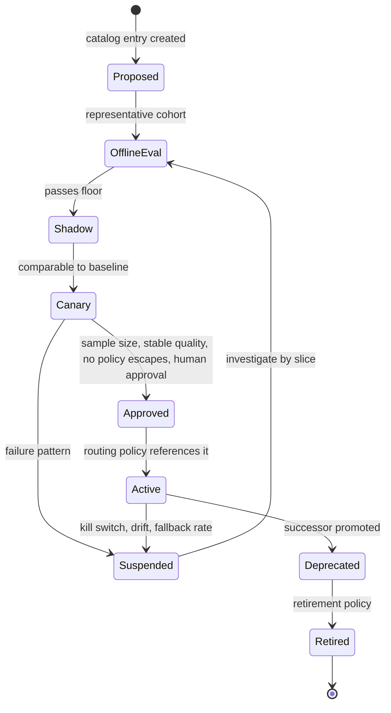

# 21. Models and capability selection

A model is a replaceable execution capability, not the architecture. This chapter defines the profile a factory can actually qualify: exact identity, capabilities, constraints, structured-output and tool behavior, data policy, evaluation evidence, lifecycle, and deprecation.

## The problem

Provider names and leaderboard scores do not describe operational fitness. Capability changes by version, task, harness, context, tools, and policy, while aliases can drift silently. The factory therefore needs exact, evidence-backed profiles before a routing policy can make a responsible selection.

## How it works

### Models are interchangeable execution resources

The design commitment is that the factory is **model-independent**: it works across multiple models and providers rather than being tied to one. The harness, not the model, creates production reliability, because the harness owns tools, state, permissions, recovery, stop conditions, sandboxing, and observability. The model supplies reasoning capability of a measured quality at a measured price. That makes it an execution resource, like a compute pool, and the factory should choose it the way a scheduler chooses a machine: by declared requirements, against a catalog, under policy, with a record.

**Model routing** is the act of selecting the most appropriate model for a step based on task type, complexity, cost, latency, risk, and confidentiality. **Model abstraction** is the interface that lets different models and providers sit behind one calling convention so routing is possible at all.

### Capability, not identity

Model independence begins with a change in what a workflow is allowed to ask for. It never says "use vendor X." It says: I need this level of reasoning, this much coding ability, this context size, tool use, this latency, eligibility for this data classification, this reliability, and this cost profile. Those are **model capabilities**; the vendor and version that happen to satisfy them today are **model identity**. Separate the two and the workflow stops caring which one is on the other end.

> *Models are capabilities, not architecture.*

Two components make the separation real. **Provider adapters** translate one calling convention (messages, tools, structured output, streaming, cancellation) into each provider's API, so the harness has one integration to maintain. A **capability registry** records what each profile can actually do, and it is populated by evidence rather than by the vendor's launch post.

| Registry entry | What it holds |
|---|---|
| Workload-specific evaluation results | Scores on this factory's task classes, not public benchmarks |
| Context limits | Input and output windows, and how quality behaves near them |
| Tool capabilities | Function calling, structured output, parallel calls, schema fidelity |
| Data eligibility | Which classifications, tenants, and regions the profile is approved for |
| Latency | Time to first token and throughput under real prompt sizes |
| Reliability | Error rates, rate-limit behavior, availability history |
| Economics | Price per token and, more usefully, cost per accepted outcome |

Routing should start transparent and rule-based: a human can read the policy and predict the route. It becomes adaptive only as production evidence accumulates, and only for lanes where the evidence is dense enough to trust. Models are not perfectly interchangeable; prompting, tool behavior, reasoning style, and failure modes all differ. So a switch is a re-evaluation and tuning exercise, never an architectural rewrite. If a switch requires a rewrite, the abstraction was never there. And if a switch requires no evaluation, the independence is unproven.

> *Without evaluation, model independence is architecture theater.*

### Specialisation, eligibility, and fallback

Model independence does not mean every model is the same. It means the differences are recorded where the router can read them. **Model specialisation** is the first difference: models are built and priced for different jobs, and a factory should expect to hold several kinds at once.

| Kind | What it is for | Where it usually routes |
|---|---|---|
| **Code-specialised** | Editing, completion, refactoring, and test writing with strong tool fidelity | EXECUTE, test generation, mechanical refactors |
| **Reasoning** | Long-horizon planning, ambiguous specifications, root-cause analysis | PLAN, incident diagnosis, high-risk review |
| **Frontier** | The strongest general capability available, at the highest price and often the highest latency | Novel or high-risk work pinned to the top tier |
| **Lower-cost** | Classification, extraction, summarisation, subagent tasks with well-defined inputs | Subagent default, triage, routine review passes |
| **Hosted** versus self-hosted | Provider-served models against models run inside the factory's own boundary | LOCAL lane for sensitive data; hosted for the rest |

The **model capability registry** is where those differences live, and the table above is its index. Every profile in it carries the evidence-backed fields listed earlier and three more that the router applies before anything else. **Model eligibility** is the set of task classes, data classifications, tenants, regions, and risk tiers a profile is approved for; it is a policy fact, not a capability score, and a profile that is ineligible for a step does not exist for that step. **Fallback models** are the ordered list of eligible profiles the route may fall to when the first choice is unavailable, rate-limited, or over budget, each pre-qualified for the same lane so that a fallback never relaxes capability or policy. And a **model adapter** is the per-provider translation that lets one profile be called through the factory's single calling convention; [Chapter 11](./11-the-agent-factory.md) sets the rule for it (standardise the core contract, optimise adapters at the edge), and the registry records which adapter version each profile was evaluated through, because the same model through two adapters is two configurations.

> *The model is a replaceable capability, not the architecture.*

### A model profile is the unit of selection

The router never selects "GPT-something" or "Claude-something." It selects a **model profile**, which pins everything that affects behavior: provider and model identifier; version or snapshot; region; input classes; task eligibility; system prompt; sampling settings; token limits; structured-output and tool settings; safety policy; fallback order; budgets; evaluation suite; and retirement policy. The 12-layer stack calls this **task-specific model profiles**: one profile for classification, another for generation, another for verification, each matched to what that task needs.

Two properties of a profile deserve their own attention. **Structured-output reliability** is how consistently a profile returns valid output against a schema, and it has to be measured per profile, because a model that is excellent at prose may be unreliable at strict JSON, and an agent whose tool calls fail to parse is an agent that cannot act. And a provider **alias** (a name such as "latest" that changes behavior without an exact version) is a profile with a hole in it; if you must use one, add drift monitoring and stronger admission controls.

A profile has a **configuration lifecycle** of its own.

<!-- infographic: model-profile-lifecycle -->
> **Infographic — Model profile lifecycle.**

Roll out every profile change through offline evaluation, shadow comparison, bounded canary, outcome observation, and governed promotion. Preserve the prior profile and the rollback conditions. Model capability does not grant autonomy: routing selects an eligible component inside the operating system, and policy, evidence, and human accountability still govern the result.

## How to build it

1. Register exact model identity or snapshot, provider, region, lifecycle, and deprecation policy.
2. Declare capabilities, limits, supported input classes, tool and structured-output behavior, context constraints, and data-handling policy.
3. Evaluate each profile with the harness and workload classes it will actually serve.
4. Record compatibility, known failure slices, qualification dates, and expiry.
5. Keep workflows vendor-neutral by requesting capabilities through the registry.

## Failure modes

| Failure | Detection | Response |
| --- | --- | --- |
| Vendor name stands in for capability | Workflow code names one provider | Request a qualified capability profile instead |
| Floating alias changes behavior | Outcomes drift without a configuration diff | Pin exact versions and require requalification |
| Model benchmarked without its harness | Production results diverge from benchmark | Evaluate the complete model-and-harness configuration |
| Independence asserted without evidence | A provider switch breaks prompts or tools | Run portability and workload evaluations before qualification |

## In Mission Control

Mission Control has model catalog records and evidence-bearing configuration surfaces. The profile remains qualified only for the workload, harness, and policy represented by that evidence; the catalog does not establish universal model capability.

## Retain this

- Models are interchangeable execution resources; reliability comes from the complete configuration around them.
- The unit of qualification is an exact model profile, not a provider brand or floating alias.
- A profile declares capability, constraints, tool behavior, data policy, compatibility, evidence, and lifecycle.
- Benchmark the model with its real harness, context, tools, and workload distribution.
- Workflows request capabilities through open contracts so provider changes remain configuration changes.

## Go deeper

- [21. Models and capability selection](./21-models-and-capability-selection.md) for the foundation this chapter builds on.
- [Canonical glossary](../appendix/glossary.md) for the terms and boundaries used here.
- Return to the [book map](../README.md) for the complete reading sequence.
