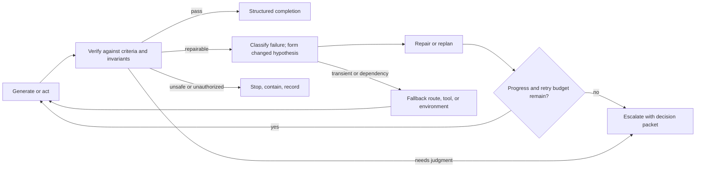
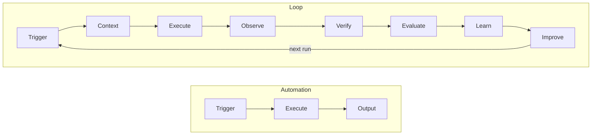

# 24. Loop engineering patterns and defaults

A production loop must converge, stop, or escalate. This chapter treats loop engineering as its own discipline: progress measures, attempt classification, retry budgets, no-progress and oscillation detection, compaction, completion rules, and defaults that determine both reliability and cost.

## The problem

A model can keep acting long after useful progress stops. Retries repeat the same hypothesis, validators repair what they should judge, and long sessions accumulate stale context and cost. A loop contract makes continuation an externally governed decision supported by evidence.

## How it works

### The attempt loop

The feedback path in that diagram is the loop engineered here: observe, diagnose, refine or replan, retry — bounded by termination criteria (maximum iterations, time, token, and cost budgets) the harness sets and the model cannot raise.

The canonical loop is **Generate → Verify → Diagnose → Repair or Replan → Retry → Escalate or Stop**. Verification produces structured findings linked to criteria. A retry requires a changed hypothesis, input, tool, configuration, or recovery action; repeating the same conditions is not a strategy, it is repeated cost.

<!-- infographic: loop-catalog -->
> **Infographic — The generate → verify → repair → retry → escalate loop catalog.** *(Jay's graphic goes here.)* Until then, the diagram below carries the same concept.

Six actions look alike from outside and must be kept distinct in the record. **Retry** repeats a logical operation after a transient or corrected failure. **Repair** changes the artifact or the local implementation hypothesis. **Replan** changes the authorized sequence while preserving approved intent and scope; a material change requires a new Plan revision. **Fallback** selects a different eligible route, tool, or environment under policy. **Escalation** asks a human or higher authority to resolve a bounded decision. **Stop** contains unsafe, unauthorized, or non-converging work. Each creates new history; none may overwrite the failed Attempt or hide why the strategy changed.

**Convergence** is measured, not felt. Track resolved criteria, failing tests, finding count and severity, changed uncertainty, artifact distance, policy state, and consumed budgets. Stop or escalate when the required outcome is independently verified; a hard gate fails; the work needs authority the Attempt does not hold; the retry, token, time, tool, compute, or monetary budget is exhausted; consecutive iterations produce no material progress; the loop oscillates between prior states; new work expands the approved scope; the environment or a dependency is not trustworthy; evidence becomes stale or contradictory; or a human decision is required. An iteration limit is the final containment boundary, not the only convergence mechanism, and convergence belongs to the runtime contract, not to the model's confidence.

That last clause deserves its own rule, because it is the one most often broken. The loop stops when external evidence says stop: a **goal condition** such as "the tests pass" or "the build exits zero," checked by something other than the model. A step count is a budget, not a completion signal; the model believing the work looks right is not a signal at all. The observe step reads what the environment actually returned, not what the model expected; the act step takes one tool call, one real-world side effect per turn; the verify step consults tests, exit codes, graders, or CI and nothing else. Without that external signal an agent will confidently declare success on an incomplete task, and every retry after that is spent defending a wrong belief. *The model never grades its own work.* An agent that burns tokens, reports "done," and fails the suite is a loop whose completion rule accepted an opinion; fix the rule, not the prompt.

Around the attempt loop sit three larger loops that practitioners at Tessl use to describe harness engineering (which some now call loop engineering). The **inner loop** runs while the agent works on a change before the pull request exists: fast, cheap checks (the suite, linters, skills) that correct the agent without a human and so drive autonomy. The **outer loop** runs once at the pull-request boundary: slower, more expensive checks that replace human review time, such as agent QA that exercises the product, deeper review, and mutation testing of the suite. The **meta loop** watches agent logs, pull requests, the tracker, and user feedback for mistakes that escaped or that a human corrected, and feeds a fix back into the inner or outer loop so the mistake happens once (Chapter 41). The attempt loop lives inside the inner loop; the inner/outer boundary is where verification independence must be established. [Chapter 16](./16-harness-engineering.md#inner-loop-outer-loop-meta-loop) gives the three loops their table and the objective each serves.

IndyDevDan's phrasing for the division of labor is the one to keep: **agents propose, code disposes**. Code runs the tests and only failures go back into the agent's context; there is no reason to pass passing tests into a context window. Deterministic gates at the end of every phase, typed outputs validated before the next phase, and orchestration in plain code are what let a workflow succeed on the thousandth run, not just the first.

### Loop engineering, as a discipline

The attempt loop above is one loop, engineered for one Attempt. Step back and there is a discipline underneath it, and it starts with a distinction that sounds trivial until a system breaks for lack of it. A **chain** is linear: A, then B, then C, each step run once, the output handed forward, and no step able to look at what the previous one produced and decide to go back. A **loop** acts, observes what actually happened, reasons about the observation, and repeats until a termination condition is met. Chains are cheap, predictable, and blind; loops are what let an agent notice that its patch broke the build and try something else. The pattern has a name and an origin: **ReAct**, reasoning and acting interleaved, in which the model alternates between a thought about what to do next and an action whose result it reads before thinking again. Every coding agent on the market is a descendant of that interleaving; the engineering question is what surrounds it.

A well-engineered loop has five parts, and a loop that is missing any one of them fails in a way the other four cannot compensate for.

1. **A goal with a testable termination.** "All unit tests pass and the linter reports nothing" is a goal; "make it better" is a mood. If the goal cannot be checked by something other than the model, the loop has no way to know it is done, and it will either stop too early or never.
2. **A tool set the goal can be reached with.** Code execution, the filesystem, a shell, search and documentation, test runners. If the agent cannot run its own code, the loop is not iterating on evidence; it is guessing, with extra steps.
3. **Context management across iterations.** Each pass adds output, errors, and reasoning, and by iteration eight the window is full of iteration two. Summarize prior iterations into compact working memory, keep a structured log of attempts and their outcomes, and prune before each pass, so the agent still remembers what it tried without re-reading all of it.
4. **Termination logic in both directions.** Success conditions, which are the goal's test; failure conditions, which are a maximum iteration count, repeated errors with no progress, and tool failures the loop cannot route around; and an escalation path for each, so that stopping produces a decision packet rather than a silence.
5. **Error handling and recovery.** Distinguish a recoverable error from a hard blocker, adjust the strategy by error type, and never repeat the identical failed action. *A loop that retries the identical failed action after the identical error isn't learning, it's spinning.*

What separates a good agent from a demo is not the model; it is how the loop handles the four moments that expose it: an error (does it read the whole trace, or the last line?), a long run (does it remember iteration eight at iteration twenty?), an oversized task (does it know when to decompose?), and a finish (does it verify the work runs, or only that it compiles?).

Four loop patterns cover most of what a factory needs, and each has a characteristic way of going wrong.

| Pattern | Use it when | Watch out for |
|---|---|---|
| **Retry loop** | The task is atomic and pass/fail: a test suite, a build, a schema check | Infinite retries without a strategy change; the loop must alter something between attempts or stop |
| **Plan–execute–verify** | Multi-step work where order matters and each step can be checked | Over-commitment to a bad plan; the loop must be able to revise the plan, not only the current step |
| **Explore–narrow** | Unknown errors, unfamiliar APIs, a repository the agent has not seen | Context explosion as exploration accumulates; prune early and keep only what narrowed the search |
| **Human-in-the-loop** | Ambiguity, high cost, or irreversible consequence where a person should decide | Interrupting so often that the human becomes the bottleneck the loop existed to remove |

The practices that make those patterns hold are short. Define termination before writing the loop logic, because a loop written body-first acquires its exit as an afterthought and the afterthought is usually a step count. Feed the loop **structured feedback**, not raw dumps: the code that caused the error, what the agent intended, and a flag that says whether this error is new or the same one as last time, so the loop can tell learning from spinning. Log everything and summarize often, so the record is complete and the context is not. Give each iteration a strict **tool-call budget**, and treat exhausting it without progress as a failure signal that demands a different strategy, never as a reason to grant more calls. And test loops on their failure cases, not their happy path: an ambiguous task, a tool that returns errors, and a task that cannot be solved at all, because the last one is the only way to prove the exit works. When the loop is multi-agent, the shape is the one the topology section drew: a planner decomposes, executors run in parallel, and a reviewer routes failures back to the executor that can fix them rather than to the planner that cannot.

Seen from the factory rather than from one Attempt, the loop has a longer spine. Automation runs Trigger → Execute → Output and is finished when the output exists; nothing about the run makes the next run better. A **loop**, in the factory's sense, is a repeatedly executed agent workflow with observation, evaluation, and feedback that improves future runs: Trigger → Context → Execute → Observe → Verify → Evaluate → Learn → Improve → next run. The extra stages are the point. Observe and Verify are the inner and outer loops of Chapter 16; Evaluate, Learn, and Improve are the meta loop of [Chapter 40](../06-improve/40-governed-learning.md). **Loop engineering** is the discipline of designing workflows that get more reliable, more efficient, and more capable through repeated execution and measured feedback, and its scope is wider than the attempt loop: trigger design, context assembly, execution, state, logging, verification, evaluation, outcome capture, failure classification, skill refinement, model optimization, regression testing, and controlled promotion. Most of those are chapters of this book; the discipline is what connects them into one thing that runs.

The five biggest loop failures, in practice, are the five parts missing: no exit condition; repeated failures without a strategy change; context overflow; a vague goal; and missing tool access. They are added to the failure table below, and every one of them is visible in a trace before it is visible in a bill.

### Loop defaults that decide cost

The loop's shape decides whether it converges. A handful of runtime defaults decide what it costs while it does. Uber's engineering team, running agents across thousands of engineers, published the accounting: total spend is users × sessions per user × turns per session × requests per turn × tokens per request × price per token. The first two terms are adoption and should keep growing. The last is the vendor's price, which you do not set, though you choose which model runs which workload. The middle three (turns, requests, tokens) are the work the agent does on its own behalf on top of what the engineer asked for, and that is where the loop's defaults live. With the model held constant over five months, those defaults took their cost per thousand model requests down about a third from its peak and cost per session down by half. Treat the figures as one organization's published measurements; treat the levers as general.

| Default | What it sets | Why it is the right first value |
|---|---|---|
| **Compaction threshold** | Compact the session at 400K tokens, even on a 1M-context model | Past that point each turn re-sends an enormous prefix; a cache burst or a repeated-input bill costs more than the context it preserves. Chapter 16 covers what compaction does to evidence |
| **Reasoning-effort default** | Medium, not maximum | Output and reasoning tokens bill at multiples of input; a large class of loop steps gets no better answer from more deliberation |
| **Subagent default model** | Subagents run on a weaker, cheaper model unless overridden | A subagent does a well-defined task with specified inputs and rarely needs frontier reasoning; the primary model decomposes and evaluates, subagents execute. Uber found this the single most impactful lever, and a growing one |
| **Prompt-cache TTL** | One-hour cache for interactive sessions; five-minute cache for subagents | See below |

The cache row needs its arithmetic. Every turn re-sends the whole history. A cache read costs about a tenth of the input rate, so a warm prefix is nearly free; but a cache **write** carries a premium (roughly 1.25× the input rate for a five-minute entry, 2× for a one-hour entry), so the TTL choice is a bet on the gap between turns. Engineers in an interactive session go idle for more than five minutes routinely, which expired the short entry, invalidated the prefix, and forced a full-price rebuild at the next keystroke; moving those sessions to the one-hour entry paid the higher write once and read cheaply for the rest of the hour. Subagents are short-lived single tasks that finish inside the window, so they keep the five-minute entry and never pay for the longer one. The same trace analysis surfaced the mirror image: a session resumed after a long break rebuilds its prefix at full price, and instructions plus tool definitions can reach 100K tokens before the user has typed anything.

These defaults belong in the harness wrapper, applied to every interactive harness and every managed agent, with a live cost counter in the status line and a session-analysis dashboard that reads every trace and flags the anti-patterns (frontier model on a task a mid-tier model could do, a 40KB tool payload persisting and re-billed every turn, cache expiry, prompt-initialization overhead) with the money each one cost and the remediation. Cost is then an engineering problem: eliminate the tokens that produce nothing, rather than waiting for a price cut or downgrading the tools. [Chapter 8](../02-design/08-economics-metrics-and-human-attention.md) carries the economics; [chapter 21](./21-models-and-capability-selection.md) turns the model choice into a route.

## How to build it

1. Define the goal condition and the evidence required to satisfy it outside the model.
2. Classify every outcome as advance, correct, retry with a changed hypothesis, stop, escalate, or fail.
3. Track measurable progress and detect repeated states, identical failures, oscillation, and uncertainty that is not decreasing.
4. Bound tokens, spend, time, tools, retries, parallelism, and model tier.
5. Preserve checkpoints and compact only with explicit retained facts and open questions.
6. Emit an escalation packet with the current hypothesis, attempted strategies, evidence, remaining budgets, and requested decision.

## Failure modes

| Failure | Detection | Response |
| --- | --- | --- |
| Retry without a changed hypothesis | Same inputs produce the same failure | Reject the retry and require a named strategy change |
| Oscillation | State alternates between prior candidates | Stop and escalate with both states and evidence |
| Self-declared completion | Model text advances workflow state | Evaluate the external goal condition and verification receipts |
| Validator repairs the candidate | Review path mutates what it judges | Separate producer and verifier identities and outputs |
| Context grows without bound | Cost rises while progress flattens | Checkpoint, compact, or stop under the loop contract |

## In Mission Control

Mission Control retains Attempt state, budgets, events, failure classifications, and operator actions that can support bounded loops. Evidence of one workflow or harness does not prove every loop configuration; each Workflow Contract still needs its own convergence, recovery, and stop-condition evaluation.

## Retain this

- A loop decides whether execution continues; a graph decides where it goes next.
- Completion is an externally evaluated goal condition, never the model grading its own work.
- Retry only with a changed hypothesis, context, tool, route, or recovery action; otherwise stop or escalate.
- Detect no progress and oscillation before budgets expire, and preserve the evidence that explains the stop.
- Loop defaults—reasoning effort, compaction, cache use, polling, parallelism, and subagent routes—are architecture and cost decisions.

## Go deeper

- [23. Agent and loop engineering](./23-agent-and-loop-engineering.md) for the foundation this chapter builds on.
- [Canonical glossary](../appendix/glossary.md) for the terms and boundaries used here.
- Return to the [book map](../README.md) for the complete reading sequence.
