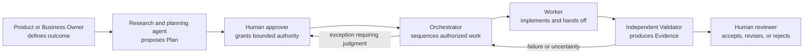

# The Human-Agent Operating Model

## Quick Read

- **Purpose:** Define how people and agents divide decisions, execution,
  oversight, and accountability.
- **Best for:** Engineering, product, platform, and organizational leaders.
- **Prerequisites:** [Operational Autonomy and Trust Calibration](../02-first-principles/01-operational-autonomy-and-trust-calibration.md).
- **Reading time:** 20 minutes.
- **You will learn:** Which responsibilities remain human, which can be
  delegated, and how exception-first operation avoids approval theater.

Keep three ideas: humans own intent and material risk; agents perform bounded
work and assemble evidence; and escalation should present a decision packet,
not a transcript.

## 1. The problem

Adding agents to an engineering organization does not define how the
organization should work. Teams still need explicit decision rights, authority
boundaries, handoffs, escalation rules, and accountability. Without them,
humans either inspect every action or surrender control to systems that cannot
own business risk.

The first failure produces approval theater. Operators become bottlenecks and
approve routine work without understanding it. The second produces unsafe
autonomy. Agents infer authority from prompts, validate their own output, and
convert execution success into business acceptance.

An AI Software Factory needs an operating model that makes the division of
responsibility unambiguous. The model must preserve human accountability while
allowing agents to perform most bounded execution, iteration, validation, and
evidence collection.

## 2. Why the problem exists

Traditional organizations embed authority in job titles, meetings, and tacit
knowledge. A senior engineer knows which change needs security review. A product
manager knows when scope has changed. A release manager understands which
deployment requires an executive decision. Much of this context is never
encoded in the delivery system.

Agents cannot safely inherit that ambiguity. They act through tools at machine
speed, operate across shifts, and may continue when the person who initiated
the work is unavailable. Their reasoning is probabilistic, their context is
bounded, and their outputs can sound more certain than the evidence permits.

The organization must therefore convert tacit operating rules into explicit
roles, policies, contracts, state transitions, and evidence requirements. This
is organizational design expressed in software.

## 3. Enduring Principle

### Human-led, agent-executed engineering

Humans define valuable outcomes, grant authority, accept material risk, resolve
ambiguity, and remain accountable. Agents research, plan, implement, test,
validate, document, recover, and assemble evidence within granted boundaries.

Delegating execution does not delegate accountability. Human leadership moves
upward from supervising activity to designing the system in which activity is
safe and valuable.

### Human decision rights

Humans retain decisions that define value or accept material consequences:

| Decision | Accountable human owner |
| --- | --- |
| Mission outcome and priority | Product or Business Owner |
| Plan approval | Authorized Mission Approver |
| WorkOrder acceptance | Engineering Lead |
| Architecture exception | Principal Engineer or Architecture Owner |
| Security exception | Security Owner |
| Compliance exception | Compliance Owner |
| Material risk exception | Designated Risk Owner |
| Merge | Authorized code owner or Engineering Lead |
| Consequential production deployment | Release Approver defined by policy |
| Autonomy or learning promotion | Factory Governance Owner or Board |

An agent may prepare the decision packet and make a recommendation. It cannot
be the accountable owner.

### Agent roles

Roles describe authority, not model personality.

**Researcher or Planner** investigates the repository and context, identifies
unknowns, proposes a versioned Plan, and states assumptions. It cannot approve
its own Plan.

**Orchestrator** sequences eligible WorkOrders, checks dependencies, dispatches
within policy, tracks progress, requests corrective work, and escalates. It
cannot widen scope, alter policy, or mark assertions passed.

**Worker** performs one authorized WorkOrder. It may implement, test, document,
and produce artifacts. It cannot self-certify acceptance or start unrelated
repository mutation.

**Validator** evaluates frozen criteria against exact artifacts through an
independent execution path. It may report pass, fail, stale, unknown, or
waiver-required. It cannot edit the implementation it certifies or approve its
own waiver.

**Recovery worker** forms a new hypothesis from retained failure evidence and
performs bounded corrective work. It does not erase the failed Attempt.

A simple workflow may combine several agent capabilities in one runtime. The
logical roles and authority boundaries must remain explicit.

### The operating cycle

The governed cycle is:

1. **Define.** A human states the outcome, business reason, constraints, risk,
   sources of truth, and acceptance criteria.
2. **Research.** An agent examines the repository and records citations,
   assumptions, and unknowns.
3. **Plan.** The factory proposes a versioned execution and validation contract.
4. **Decide.** A human approves, rejects, or requests revision of the exact Plan.
5. **Authorize.** The factory materializes bounded WorkOrders and performs
   policy and capability preflight.
6. **Execute.** Workers perform Tasks through immutable Attempts.
7. **Handoff.** Each role records completed, incomplete, and unknown assertions,
   artifacts, risks, and the next owner.
8. **Validate.** Independent validators evaluate frozen criteria.
9. **Recover.** Failures produce new hypotheses and bounded corrective work.
10. **Accept.** A human evaluates evidence, risk, deviations, and uncertainty.
11. **Release.** Governed delivery proceeds through separate approval and
    production-verification states.
12. **Learn.** The factory proposes reusable improvements. Humans promote them.

### Handoffs replace conversational memory

A handoff must be a durable contract, not a chat summary. It records:

- producing and consuming roles;
- Mission, WorkOrder, and Attempt identities;
- completed, incomplete, and unknown criteria;
- commands, exit codes, artifacts, and changed files;
- known risks, blockers, assumptions, and uncertainty;
- next action and accountable owner; and
- whether the outcome is complete, incomplete, or needs human input.

Unknown is a valid state. Inventing continuity is not. The next role should not
begin when the predecessor handoff is structurally incomplete.

### Escalate judgment, not routine activity

The factory should interrupt a human when it lacks authority, evidence, a safe
recovery path, or an unambiguous decision. Common escalation triggers include:

- conflicting or missing requirements;
- policy denial or expired approval;
- material scope or architecture change;
- validator disagreement;
- failed, stale, or missing evidence;
- security, privacy, legal, or compliance concern;
- exhausted budget or corrective-iteration limit;
- unexpected repository state or dependency;
- irreversible action; and
- uncertainty above the policy threshold.

An attention item must state the decision required, why autonomy stopped,
affected scope, risk and urgency, available evidence, safe options, expected
consequences, recommendation, uncertainty, and what resumes afterward.

### Prevent approval fatigue

Approval volume should decrease as evidence quality and bounded autonomy
improve. The factory should not ask humans to approve agent activity. It should
ask them to decide about intent, exceptions, risk, and acceptance.

Routine low-risk work can proceed within policy. Surprises receive attention.
High-risk work receives deeper review. The operator sees an evidence-backed
decision packet rather than reconstructing events from chat and logs.

### Autonomy changes the frequency, not the ownership, of decisions

At Level 1, humans initiate and review nearly every action. At Level 2, humans
define WorkOrders and review all material outputs. At Level 3, agents may plan
and execute while humans handle material risk and final accountability. At
Level 4, policy may permit deployment for bounded low-risk classes. At Level 5,
humans govern the factory system and its policies rather than routine work.

Human accountability remains at every level. Greater autonomy changes which
decisions require individual intervention; it does not make the model the risk
owner.

## 4. Tradeoffs and alternatives

Strong role separation increases handoffs and can slow small changes. The
answer is proportional control. Low-risk work may use lightweight automated
handoffs while retaining the same lineage and evidence semantics.

Separate validators can repeat expensive work. That cost buys independence.
Risk-based verifier selection, focused tests, artifact reuse with provenance,
and sampling can control expense without letting the worker certify itself.

Human approval can become the throughput constraint. Removing approval is not
the only remedy. Better intent, smaller WorkOrders, stronger evidence, clear
recommendations, and exception-only routing often create more leverage with
less risk.

Small organizations may combine human titles. One founder may be Product Owner,
Engineering Lead, Mission Approver, and Release Approver. Technical separation
between implementation and validation must remain. Separation of duties should
increase with organizational scale and consequence.

## 5. Current Mission Control Implementation

This assessment uses Mission Control commit
[`8014d5af427b43ff5c5a63cfdf82ec92742c208c`](https://github.com/jaydubya818/MissionControl/tree/8014d5af427b43ff5c5a63cfdf82ec92742c208c),
studied on 2026-08-08.

Mission Control's North Star explicitly assigns intent, judgment, governance,
and approval to humans. Agents own bounded execution, iteration, validation,
and evidence collection. The governed Mission contract defines four runtime
roles: Orchestrator, Worker, Validator, and Operator.

### Implemented mechanisms

Mission records retain state, owner, budget, stop condition, corrective limits,
current Plan, active WorkOrder, blockers, and required human action. Plan
submission freezes a proposed revision. Approval materializes linked assertions
and WorkOrders idempotently while leaving dispatch as a separate decision.

Mission dispatch checks approved Plan authority, released WorkOrder state,
predecessor handoff, budget, corrective limits, and serial mutation. Exactly one
repository-mutating WorkOrder may be active in a Mission. Read-only work may run
concurrently when the approved Plan permits it.

Worker and Validator handoffs record role, WorkOrder, WorkflowRun, assertion
outcomes, commands, artifacts, risks, next action, and next owner. The handoff
validator rejects overlapping assertion outcomes, false completeness, missing
commands, or incomplete work without a stated risk.

Mission acceptance fails when assertions are missing, failed, stale,
unvalidated, lack receipts, or use an unauthorized waiver. It also fails when
WorkOrders or handoffs remain incomplete. Failed validation blocks the Mission
and directs the operator toward bounded corrective work.

### Capability assessment

| Operating capability | Status at studied commit | Interpretation |
| --- | --- | --- |
| Human-defined Mission | Implemented | UI and Convex records capture governed intent and lifecycle. |
| Versioned Plan approval | Implemented | Submission freezes the proposal; approval releases exact WorkOrders and assertions. |
| Orchestrator, Worker, Validator, Operator roles | Implemented in the Mission contract | Role-specific permissions and state checks exist. |
| Structured handoffs | Implemented | Handoffs preserve assertion outcomes, commands, artifacts, risks, and next action. |
| Independent validation requirement | Implemented mechanism | Validator-run and receipt linkage are enforced for required assertions. |
| Corrective iteration | Implemented mechanism | Failed validation can block the Mission and bounded corrective work may be requested. |
| Exception-first operator experience | Product doctrine with partial UI proof | Required-human-action fields and decision surfaces exist; approval-fatigue reduction has not been measured. |
| Complete governance-role matrix | Partial | Runtime roles are clear, but all business, security, compliance, architecture, and release owners are not one enforced matrix. |
| Risk-proportional approval automation | Partial | Risk and approval controls exist; comprehensive cross-lifecycle policy proof remains incomplete. |
| Overnight autonomous operating shift | Product target, not proven here | Durable state exists, but this chapter did not demonstrate an unattended end-to-end shift. |

No fresh browser journey was performed for this chapter. The assessment is
grounded in product contracts, source, and existing tests at the pinned commit.
It does not promote the complete operating model into a proven V1 claim.

## 6. Future Vision

Mission Control should make decision rights visible at every state. Each
Mission and WorkOrder should show who owns the next decision, why it is needed,
the governing policy, deadline, evidence, options, and automatic resume behavior.

The operator should be able to begin an overnight shift by defining allowed
Missions, risk boundaries, budgets, concurrency, notification rules, and stop
conditions. The morning briefing should separate completed outcomes, review-ready
changes, recovered failures, exhausted budgets, and decisions requiring human
judgment.

Role compatibility should be checked before assignment. A worker must not also
be the independent validator for the same material artifact. High-risk work
should add security, architecture, compliance, or release owners through policy.

The operating model becomes proven only when repeated browser and runtime
evidence shows that work survives process restart, handoff, validation failure,
corrective execution, and delayed human review without bypassing authority.

## 7. Versioned references

- [Mission Control North Star](https://github.com/jaydubya818/MissionControl/blob/8014d5af427b43ff5c5a63cfdf82ec92742c208c/docs/product/mission-control-north-star.md)
- [Mission Control V1 Product Strategy](https://github.com/jaydubya818/MissionControl/blob/8014d5af427b43ff5c5a63cfdf82ec92742c208c/docs/product/mission-control-v1-product-strategy.md)
- [Governed Missions Contract](https://github.com/jaydubya818/MissionControl/blob/8014d5af427b43ff5c5a63cfdf82ec92742c208c/docs/software-factory/governed-missions-contract.md)
- [Mission lifecycle commands](https://github.com/jaydubya818/MissionControl/blob/8014d5af427b43ff5c5a63cfdf82ec92742c208c/convex/missions.ts)
- [Mission governance rules](https://github.com/jaydubya818/MissionControl/blob/8014d5af427b43ff5c5a63cfdf82ec92742c208c/convex/lib/missionGovernance.ts)
- [Mission execution reconciliation](https://github.com/jaydubya818/MissionControl/blob/8014d5af427b43ff5c5a63cfdf82ec92742c208c/convex/lib/missionExecution.ts)
- [Mission detail operator view](https://github.com/jaydubya818/MissionControl/blob/8014d5af427b43ff5c5a63cfdf82ec92742c208c/apps/mission-control-ui/src/eos/views/MissionDetailView.tsx)
- [Mission planning workspace](https://github.com/jaydubya818/MissionControl/blob/8014d5af427b43ff5c5a63cfdf82ec92742c208c/apps/mission-control-ui/src/eos/views/MissionPlanWorkspace.tsx)

## 8. Notes and lessons learned

My current conclusions are:

- Human-led does not mean human-performed.
- Agent-executed does not mean agent-authorized.
- Roles should describe decision rights, not model personas.
- A durable handoff is part of the product contract, not optional reporting.
- Unknown information must remain unknown until resolved.
- Approval quality matters more than approval count.
- The factory should escalate surprises and judgment, not routine activity.
- Failed validation is a normal feedback path, not proof that the operating
  model failed.
- Small companies may combine people, but they must preserve technical
  independence.
- Humans govern policy and risk even when they stop reviewing every action.

## 9. Interview and discussion questions

1. What does human-led, agent-executed engineering mean in practice?
2. Which decisions must never belong to an agent?
3. How does an Orchestrator differ from a Worker?
4. Why can a Worker handoff not serve as validation evidence?
5. What makes a handoff structurally complete?
6. When should a factory interrupt a human?
7. How do you prevent approval fatigue without removing accountability?
8. Which roles may one person combine in a startup?
9. What technical separation must remain in a small company?
10. How do decision rights change from autonomy Level 2 to Level 3?
11. What should happen after failed independent validation?
12. How would you organize an overnight agent shift?
13. Which operating-model capabilities does Mission Control currently prove?
14. How would you measure whether the model reduces human cognitive load?

## 10. Whiteboard exercise

Draw the Product Owner, Mission Approver, Orchestrator, Worker, Validator,
Engineering Lead, Risk Owner, and Release Approver. Connect them through the
Mission lifecycle from intent to production verification.

For each boundary, state:

- the artifact transferred;
- the authority granted;
- the evidence required;
- the decision owner;
- the escalation condition; and
- what resumes after the decision.

Then redraw the model for a five-person startup and a regulated enterprise.
Preserve the same accountability while changing how many people hold the roles.

## 11. Hands-on lab

### Objective

Trace one Mission through every human and agent role, including failed
validation, corrective work, and final acceptance.

### Starting version

- Repository: `jaydubya818/MissionControl`
- Commit: `8014d5af427b43ff5c5a63cfdf82ec92742c208c`
- Study date: 2026-08-08

### Tasks

1. Create or select a governed Mission with explicit owner and criteria.
2. Trace the Planner proposal and exact human-approved Plan revision.
3. Identify each released Worker and Validator WorkOrder.
4. Trace Orchestrator dispatch eligibility and serial mutation.
5. Inspect the Worker handoff, including unknown and incomplete assertions.
6. Cause or locate one Validator failure.
7. Trace the operator attention item and bounded corrective iteration.
8. Verify the new Worker Attempt does not erase the prior failure.
9. Trace fresh Validator Evidence into Mission acceptance eligibility.
10. Identify the human who makes the final acceptance decision.

### Required evidence

- role and decision-rights matrix;
- approved Plan and released WorkOrder identities;
- Worker and Validator Attempt identities;
- complete handoff records;
- failure, escalation, and corrective-work records;
- criterion-linked independent Evidence;
- operator decision package; and
- teach-backs for a developer, engineering executive, and CEO.

### Cleanup

Use seeded data and the controlled lab repository. Revoke temporary authority
and preserve retained evidence without exposing credentials or sensitive paths.

## Mastery standard

The chapter is mastered when I can assign every decision and action to the
correct role, design a complete handoff, prevent unsafe self-approval, explain
how autonomy changes human attention, and defend the operating model to a
developer, CTO, CEO, and board without notes.
