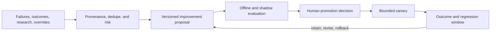

# Governed Continuous Learning and Recursive Improvement

## 1. The problem

A factory that never learns repeats failures and requires permanent manual
tuning. A factory that changes its prompts, policies, workflows, evaluations,
or authority automatically can become unpredictable. Continuous learning must
improve the operating system without allowing observations to authorize their
own promotion.

## 2. Why the problem exists

Production outcomes, failed runs, human overrides, validator disagreements,
cost, and new research all contain useful signals. They also contain noise,
malicious content, correlation without causation, and recommendations optimized
for the wrong metric. The system being evaluated may also generate the proposed
fix, creating self-confirming evidence.

## 3. Enduring Principle

### Automate observation and proposal; govern promotion

The factory may continuously collect, normalize, deduplicate, and analyze
signals. It may propose a prompt, skill, workflow, policy, evaluator, model
route, or architectural change. Promotion to active behavior requires explicit
human review based on independent evaluation.

### Keep the learning loop inside the delivery hierarchy

An accepted recommendation becomes a governed Mission or WorkOrder with scope,
criteria, budget, risk, and owner. It does not mutate production configuration
directly. The same execution, validation, evidence, and release rules apply to
factory self-improvement as to customer software.

### Separate three loops

**Inner loop:** implement and test one change.

**Outer loop:** validate, review, release, and observe the outcome.

**Meta loop:** detect patterns across outcomes and propose changes to the
factory system.

The meta loop has greater leverage and therefore requires stronger evidence and
promotion control.

### Treat research and memory as untrusted inputs

Every source needs identity, retrieval time, content hash, classification,
license or usage constraint, sensitivity, and provenance. Extracted claims need
supporting evidence, confidence, contradictions, and lifecycle. Source content
cannot change instructions, invoke tools, or grant authority.

### Evaluate against baselines and quality floors

An improvement experiment defines baseline, candidate, comparable cases,
primary metric, quality floor, risk stop, budget, observation window, and
rollback. Faster or cheaper is not improvement when validation, security,
reliability, or human attention worsens.

### Calibrate autonomy from outcomes

Sustained validated outcomes may make a factory eligible for greater autonomy.
Critical violations, fabricated evidence, security escapes, or repeated failure
should demote or quarantine it automatically. Promotion remains human-owned.

## 4. Tradeoffs and alternatives

Manual improvement is slower but easier to reason about. Fully automatic
self-modification is fast and difficult to audit. The governed proposal model
captures most learning value while preserving change control.

Offline evaluations are reproducible but may not represent production. Online
canaries provide realism but expose users and systems. Use staged evidence and
strict risk ceilings.

## 5. Current Mission Control Implementation

GitHub `main` contains Loop Engineering, graph workflows, context evaluations,
meta-loop suggestions, verifier records, workflow-failure signal ingestion, and
human conversion of accepted suggestions into governed WorkOrders and Tasks.
The graph workflow has browser evidence for explicit dispatch, DAG visibility,
failure containment, and terminal human approval boundaries.

Study commit
[`9d5f8e3`](https://github.com/jaydubya818/MissionControl/tree/9d5f8e36aff45a001a8848cc0516b3dc800e29b8)
adds Phase 0 controls for governed continuous learning. It proves atomic
ownership, pause/drain modes, budget admission, heartbeat, stale recovery,
reasoned retry, cancellation, quarantine, independent verification, and
operator-visible Task semantics in an isolated canary.

Continuous scheduling remained off. The preserved Research Lab queue was not
mutated. Phase 1 still needs a governed source registry and ingestion policy.
The broader continuous-learning plan remains proposed, and PR #64 is open.
Mission Control therefore has a governed improvement substrate, not a
self-operating learning factory.

## 6. Future Vision

The full system should ingest approved sources and production signals through
read-only adapters, extract evidence-backed claims, create versioned
recommendations, run independent evaluations, materialize accepted proposals as
governed work, canary changes, measure outcomes, and roll back regressions.

It should expose why a recommendation exists, which evidence supports it, what
could falsify it, and who promoted it. No model or source reputation should
bypass those controls.

## 7. Versioned references

- [Loop Engineering](https://github.com/jaydubya818/MissionControl/blob/b31e27564deb1c03c167e61b5ee094567c2ba7b1/docs/software-factory/LOOP_ENGINEERING.md)
- [Graph Engineering](https://github.com/jaydubya818/MissionControl/blob/b31e27564deb1c03c167e61b5ee094567c2ba7b1/docs/software-factory/GRAPH_ENGINEERING.md)
- [Meta-loop implementation](https://github.com/jaydubya818/MissionControl/blob/b31e27564deb1c03c167e61b5ee094567c2ba7b1/convex/factory/metaLoop.ts)
- [Continuous-learning plan](https://github.com/jaydubya818/MissionControl/blob/9d5f8e36aff45a001a8848cc0516b3dc800e29b8/docs/plans/2026-08-08-feat-governed-continuous-learning-plan.md)
- [Phase 0 operational evidence](https://github.com/jaydubya818/MissionControl/blob/9d5f8e36aff45a001a8848cc0516b3dc800e29b8/docs/validation/2026-08-09-research-lab-phase-0-operational-controls.md)
- [Todo 028](https://github.com/jaydubya818/MissionControl/blob/9d5f8e36aff45a001a8848cc0516b3dc800e29b8/todos/028-complete-p1-research-lab-phase-zero-operational-controls.md)

## 8. Notes and lessons learned

Recursive improvement should be ordinary governed engineering applied to the
factory itself. The recursive object changes; accountability does not.

## 9. Interview and discussion questions

1. What may the factory learn automatically?
2. Why must promotion remain human-owned?
3. How do inner, outer, and meta loops differ?
4. How do you prevent memory or research poisoning?
5. What evidence would justify an autonomy increase?
6. When should learning cause immediate rollback or quarantine?

## 10. Whiteboard exercise

Draw a failed production change becoming a deduplicated suggestion, evaluation,
governed WorkOrder, canary, and promoted workflow rule. Add malicious source
content, evaluator disagreement, and a quality regression.

## 11. Hands-on lab

**Prerequisite:** a read-only checkout of Mission Control study commit
`9d5f8e3`; do not enable continuous scheduling or mutate the preserved Research
Lab queue.

Trace one workflow failure into a meta-loop suggestion and then into a governed
WorkOrder and Task. Review the Phase 0 canary evidence. Design a Phase 1 source
record and promotion packet without executing it.

Pass only if observation, recommendation, authorization, implementation,
validation, promotion, and rollback remain distinct records. Retain code-path
references, the proposed packet, and a teach-back. Cleanup is limited to
discarding local notes or reverting a disposable checkout; no provider or
scheduler state should have been created.
