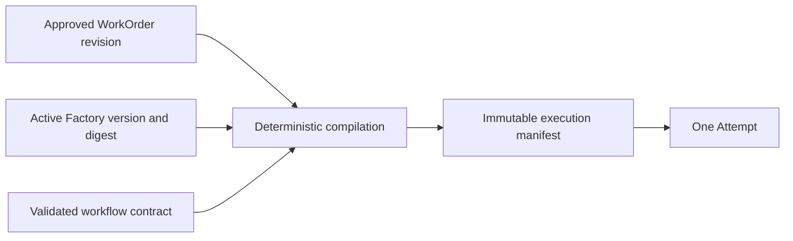

# Factory Configuration, Workflow Contracts, and Execution Manifests

## 1. The problem

An approved WorkOrder states what may be achieved. It does not fully describe
the machinery that will perform the work. If workflow, agents, prompts, tools,
models, repository paths, context, budgets, and recovery rules are resolved
after dispatch, two nominally identical Attempts can run under different
authority. The result is neither reproducible nor auditable.

## 2. Why the problem exists

Agent runtimes assemble many mutable dependencies. A workflow name may point to
new YAML. An agent alias may resolve to a different prompt or model. A context
package may be republished. Repository scope may change. Runtime defaults make
experimentation convenient, but they hide causality from governed execution.

Natural-language completion creates a second ambiguity. A substring such as
`STATUS: done` cannot prove which assertions completed, what remains unknown,
or which evidence exists. Unbounded step output copied into the next prompt also
increases cost, injection risk, and context drift.

## 3. Enduring Principle

### Separate configuration, workflow, and attempt snapshot

**Factory Configuration** is an approved, versioned operating envelope for one
repository. It binds workflow, executor, policy, environment, risk boundary,
budget, verifiers, recovery, agent versions, and code scopes.

**Workflow contract** defines the graph of roles and steps, dependencies,
inputs, structured outputs, failure policy, handoffs, and concurrency.

**Execution manifest** is the immutable Attempt-specific compilation of the
WorkOrder and Factory version. It records exactly what the worker received and
which authority applied.

### Hash behaviorally relevant inputs

A Factory digest should change whenever a change could alter execution:
workflow version, executor, policy, environment, model route, agent version,
prompt or tool hash, context lock, code scope, budget, validators, risk, or
recovery. Stable canonical serialization is required; object insertion order
must not create false changes.

### Compile before dispatch and fail closed

Readiness verifies that every referenced component exists, is approved, active,
compatible, and current. Compilation should reject missing agent bindings,
unsafe workflow authority, invalid scope, stale context, or an executor that
cannot satisfy the recovery contract. An incomplete manifest is not permission
to use runtime defaults.

### Use structured completion and bounded handoffs

Every step should emit schema-validated status, completed, incomplete, and
unknown assertions, evidence references, risks, next action, and owner. Large
outputs become artifacts; compact summaries enter shared context. Retry resumes
from durable checkpoints instead of replaying an entire transcript.

Agents may recommend a pull request or deployment. Deterministic control-plane
code owns publication and approval authority.

## 4. Tradeoffs and alternatives

Freezing all inputs reduces flexibility and increases version-management work.
That cost is justified for mutation. Read-only exploration may use a lighter
manifest if policy states which inputs may float.

Strict output schemas can constrain useful reasoning. The schema should govern
handoff claims and evidence, not force all reasoning into rigid fields. Artifact
references preserve rich detail outside the bounded shared context.

## 5. Current Mission Control Implementation

GitHub `main` at
[`b31e275`](https://github.com/jaydubya818/MissionControl/tree/b31e27564deb1c03c167e61b5ee094567c2ba7b1)
versions Factory Configuration and checks workflow, executor, policy, budget,
verifiers, host, recovery, repository, and GitHub readiness.

The newer study implementation is commit
[`9d5f8e3`](https://github.com/jaydubya818/MissionControl/tree/9d5f8e36aff45a001a8848cc0516b3dc800e29b8)
on open draft [PR #64](https://github.com/jaydubya818/MissionControl/pull/64).
It additionally freezes approved agent versions and repository code scopes into
the Factory digest, validates workflow contracts, and compiles a per-step
execution manifest at dispatch. The manifest includes agent version, compiled
prompt hash, tools, model, harness, context hash, path authority, and causation.
Public run inspection redacts full prompt content while exposing hashes and
bindings.

The same branch rejects heuristic completion and agent-owned PR, review, merge,
or deployment authority. Six active workflows use schema-validated completion
and bounded structured handoffs. Step context is capped at 32 KB and run context
at 128 KB, with larger material retained as artifacts.

These are implemented and tested on the study branch, but they are not part of
GitHub `main` while PR #64 remains unmerged.

## 6. Future Vision

Factory promotion should require policy diff, compatibility evaluation, canary
evidence, and rollback to the previous version. Every pull-request artifact
should retain the WorkOrder revision, Factory digest, workflow snapshot,
execution-manifest digest, and context-lock digest that caused it.

## 7. Versioned references

- [Factory configuration](https://github.com/jaydubya818/MissionControl/blob/9d5f8e36aff45a001a8848cc0516b3dc800e29b8/convex/factory/configuration.ts)
- [Execution manifest compiler](https://github.com/jaydubya818/MissionControl/blob/9d5f8e36aff45a001a8848cc0516b3dc800e29b8/convex/lib/executionManifest.ts)
- [Workflow contract gate](https://github.com/jaydubya818/MissionControl/blob/9d5f8e36aff45a001a8848cc0516b3dc800e29b8/convex/lib/factoryWorkflowContract.ts)
- [Structured handoff](https://github.com/jaydubya818/MissionControl/blob/9d5f8e36aff45a001a8848cc0516b3dc800e29b8/packages/workflow-engine/src/handoff.ts)
- [Todo 025](https://github.com/jaydubya818/MissionControl/blob/9d5f8e36aff45a001a8848cc0516b3dc800e29b8/todos/025-complete-p1-freeze-agent-execution-manifests.md)
- [Todo 026](https://github.com/jaydubya818/MissionControl/blob/9d5f8e36aff45a001a8848cc0516b3dc800e29b8/todos/026-complete-p1-structured-workflow-contracts-context.md)

## 8. Notes and lessons learned

The Factory Configuration answers “which operating system is approved for this
repository?” The execution manifest answers “what exactly governed this try?”
Both are necessary; neither replaces the WorkOrder’s authority.

## 9. Interview and discussion questions

1. Why is a WorkOrder insufficient as an execution manifest?
2. Which changes must alter the Factory digest?
3. How do structured handoffs reduce both risk and token cost?
4. What should be redacted from a public run inspector?
5. When may a runtime input legitimately float?

## 10. Whiteboard exercise

Compile one WorkOrder into an execution manifest. Mark every version, hash,
scope, budget, principal, and recovery rule. Then change an agent prompt and
show which records become stale.

## 11. Hands-on lab

**Prerequisite:** a disposable checkout of Mission Control study commit
`9d5f8e3` with its documented test dependencies installed. Do not use a live
Factory version.

Trace Factory version creation, readiness, dispatch, and execution-manifest
compilation. Change one binding in a test fixture and prove the digest changes.
Submit heuristic completion and prove the workflow gate rejects it.

Retain code paths, hashes, focused test output, and a teach-back. Restore the
fixture or discard the disposable checkout after the exercise. Do not use the
open PR as proof of GitHub-main capability.
