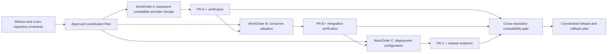

# Multi-Repository Development and Coordinated Delivery

## 1. The problem

A business outcome may require coordinated changes to an API, client, shared
schema, infrastructure, deployment configuration, and documentation stored in
different repositories. An agent working from one checkout can miss a dependent
contract or modify repositories in an unsafe order. Cloning every repository
into every environment increases startup time, context noise, credentials, and
blast radius.

The factory needs enough repository awareness to discover relevant work without
turning a cross-repository change into one unreviewable mutation.

## 2. Why the problem exists

Repository boundaries encode ownership, release cadence, security, language,
build, and organizational history. They do not necessarily match business
capabilities. Cross-repository dependencies may be declared in package files,
API schemas, deployment manifests, documentation, service catalogs, or only in
human knowledge.

Git commits are atomic inside one repository, not across several repositories.
There is no universal cross-repository transaction for branches, pull requests,
CI, merge, deployment, or rollback. The factory must model coordination and
compatibility explicitly rather than pretending several commits form one
atomic change.

## 3. Enduring Principle

### Represent the repository set before selecting checkouts

A **Repository Workspace Manifest** should identify:

- repositories in organizational scope and their canonical identities;
- default and protected branches;
- owners, approvers, sensitivity, and publication policy;
- source, build, runtime, schema, API, deployment, and documentation
  relationships;
- version and compatibility contracts;
- local checkout names and allowed paths;
- required tools, environments, and credentials;
- discovery metadata and exclusion rules; and
- manifest version, owner, provenance, and freshness.

The manifest is a map, not blanket mutation authority. A WorkOrder grants exact
read and write scope over a selected subset after planning and review.

### Discover broadly; authorize narrowly

Repository discovery may use service catalogs, dependency files, code search,
ownership metadata, incident links, architecture documents, and prior changes.
The planner should explain why each repository is included or excluded and
identify uncertain dependencies.

Use a two-stage process:

1. read-only investigation across an eligible repository graph; then
2. explicit human- or policy-approved write scope for the exact repositories,
   branches, paths, and change types required by the Plan.

This preserves the value of agents operating outside one engineer's local
expertise without granting every discovery target mutation authority.

### Model a coordinated change as a dependency graph

Each pull request has its own candidate, evidence, approvals, and repository
policy. The parent Plan retains global invariants, integration criteria, merge
order, release sequence, compatibility window, and rollback strategy.

### Prefer compatibility over simultaneous merge

Design changes so intermediate states remain valid:

- add before remove;
- support old and new schema or API versions during migration;
- deploy producers before consumers or vice versa according to the contract;
- use feature flags or dual reads/writes where justified;
- separate data migration from destructive cleanup;
- publish versioned artifacts before adoption; and
- remove compatibility only after measured migration completion.

If the change truly requires simultaneous activation, name that risk and use a
coordinated release mechanism. Do not claim that several queued pull requests
are atomic.

### Choose a local workspace strategy for the actual constraint

| Strategy | Useful when | Primary cost or risk |
| --- | --- | --- |
| Monorepo | Shared tooling, atomic source changes, and unified ownership are acceptable | Repository scale, broad CI, and organizational coupling |
| Adjacent independent checkouts | Agents need a common filesystem view without changing repository history | External manifest must preserve versions and layout |
| Coordination repository | One small repository can own the workspace manifest, plans, and shared instructions | Can become stale or a second source of truth |
| Git submodule | The parent must pin an exact external repository commit while histories remain separate | Two-level updates, detached states, recursive operations, and gitlink coordination |
| Git subtree | Consumers need vendored content in the parent history with occasional upstream synchronization | Duplicate history/content and explicit split/pull/push discipline |
| Symlink workspace | Local tools need one traversal root over existing checkouts | Weak version semantics and portability or sandbox complications |
| Sparse or partial clone | One large repository contains more history or paths than the task needs | Discovery can miss excluded material if scope is wrong |

Do not adopt submodules or subtrees merely to make an agent see several
repositories. Adjacent checkouts plus a versioned manifest are often simpler.
Use repository-composition features only when their versioning and distribution
semantics solve a real product need.

### Preserve identity at every repository boundary

An Attempt should retain, for every repository:

- canonical repository identity and host;
- baseline commit and branch;
- read/write scope and credential identity;
- checkout path and worktree identity;
- produced commit, branch, and pull request;
- dependency and invalidation relationships;
- verifier and evidence subject; and
- merge, release, and rollback state.

A change in one repository may stale evidence in another. The requirement-to-
evidence graph should express those invalidations instead of relying on a human
to remember them.

### Verify the assembled system

Per-repository CI is necessary and insufficient. Add contract tests, schema
compatibility, package-resolution tests, integration environments, deployment
ordering checks, and end-to-end assertions against the exact candidate set.

The integration candidate is a manifest of repository commits and artifacts,
not a synthetic “mega commit.” Verification receipts should bind to that
manifest digest.

## 4. Tradeoffs and alternatives

Cloning all repositories improves discovery and increases environment startup,
storage, context volume, and credential exposure. Human-selected repositories
reduce cost and can omit the dependency the human did not know existed. A
read-only discovery index with on-demand qualified checkout is a practical
middle path.

A monorepo can simplify source atomicity and cannot make deployment atomic.
Polyrepos preserve ownership and independent release at the cost of coordination.
Repository consolidation is an organizational architecture decision, not an
agent-context workaround.

## 5. Current Mission Control Implementation

At study commit
[`d902fae`](https://github.com/jaydubya818/MissionControl/tree/d902fae7032c0696b531c44ae88829c652516fc6),
Mission Control itself is a TypeScript and pnpm monorepo. Its domain model
supports multiple registered repositories under a Workspace, repository-scoped
policy, Factory Configuration, WorkOrders, worktrees, GitHub identity, and
source/head-SHA-bound evidence.

The studied evidence does not establish a production-qualified
multi-repository WorkOrder, repository dependency graph, workspace manifest,
cross-repository candidate digest, coordinated PR state machine, compatibility
gate, or release-and-rollback proof. Existing one-repository execution and
multi-repository registration are substrate, not proof of coordinated delivery.

## 6. Future Vision

Mission Control should maintain a versioned repository graph and allow a Plan
to create a coordinated change set containing repository-scoped WorkOrders and
explicit dependencies. Read-only discovery should precede write admission.

The operator should see the exact repository set, inclusion rationale, version
skew, PR dependency graph, global invariants, integration candidate, merge and
release order, stale evidence, rollback state, and required human decisions.
Promotion requires a real two-repository golden path, failed compatibility
test, reordered merge, partial rollback, and recovery without losing lineage.

## 7. Versioned references

- [The Authoritative Delivery Hierarchy](./01-authoritative-delivery-hierarchy.md)
- [Specification Engineering, Executable Requirements, and Plan Assurance](./03-specification-engineering-executable-requirements-and-plan-assurance.md)
- [Git submodules documentation](https://git-scm.com/docs/gitsubmodules), accessed 2026-08-30
- [Git subtree documentation](https://github.com/git/git/blob/master/contrib/subtree/git-subtree.txt), accessed 2026-08-30
- [Git worktree documentation](https://git-scm.com/docs/git-worktree), accessed 2026-08-30
- [GitHub: About stacked pull requests](https://docs.github.com/en/pull-requests/get-started/about-stacked-prs), accessed 2026-08-30
- [Mission Control capability, workflow, and admission map](../09-mission-control-case-studies/03-capability-workflow-and-admission-map.md), assessed at `d902fae`

## 8. Notes and lessons learned

- Cross-repository atomicity is usually a compatibility-design problem, not a
  Git feature waiting to be found.
- A coordination repository can organize work without becoming a superproject
  or owning the component repositories.
- Broad read discovery and narrow write authority are compatible and should be
  designed separately.
- The integration candidate is a versioned set of artifacts and commits.

## 9. Interview and discussion questions

1. Why is a multi-repository change not one atomic transaction?
2. How would you let an agent discover relevant repositories safely?
3. When would you choose submodules, subtrees, or adjacent checkouts?
4. What evidence binds a cross-repository integration candidate?
5. How do backward compatibility and merge ordering reduce risk?
6. Which changes in one repository should invalidate evidence in another?

## 10. Whiteboard exercise

Design a coordinated change across an API repository, web client, shared schema,
and deployment repository. Show discovery, authorization, checkouts, four PRs,
compatibility windows, integration verification, merge order, release, a failed
third PR, and rollback. Identify every non-atomic boundary.

## 11. Hands-on lab

Create two disposable repositories representing a provider and consumer. Define
a workspace manifest and a backward-compatible interface change. Produce
repository-scoped WorkOrders, isolated commits, dependent pull-request
artifacts, and a combined integration-candidate manifest. Intentionally run the
consumer against the old provider and the old consumer against the new provider.

Required evidence: repository graph, baseline commits, write scopes, dependency
DAG, compatibility matrix, per-repository verification, integration manifest
digest, merge order, stale-evidence example, and rollback procedure. Cleanup
must delete disposable repositories, branches, worktrees, and credentials.
