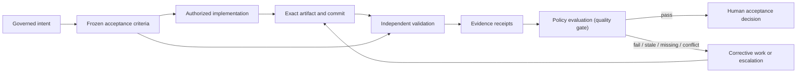
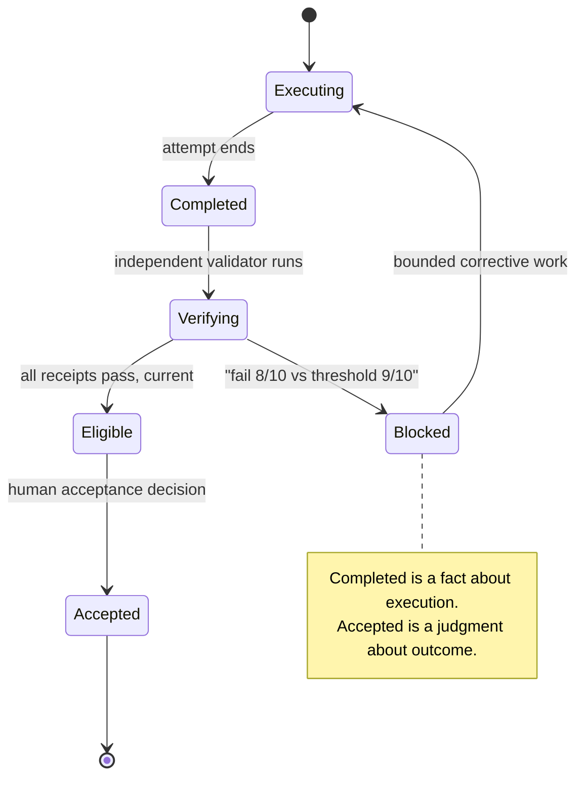
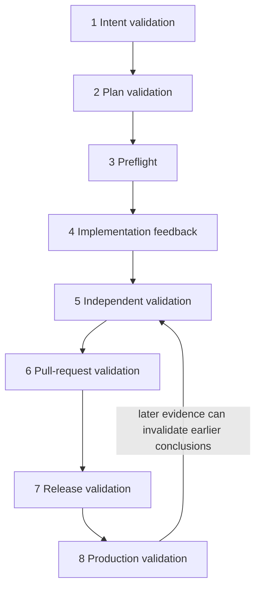
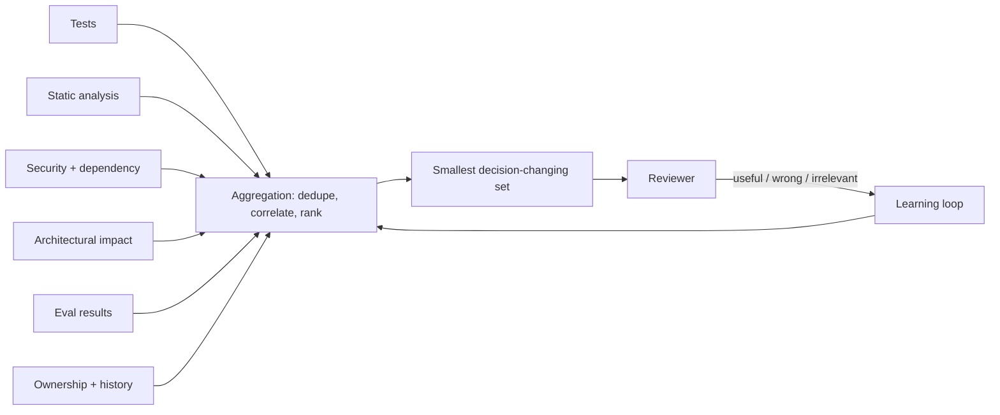

# 21. Quality and evidence architecture

Part III built a factory that can plan, execute, and produce candidate changes at a rate no human team could match. Part IV asks the only question that matters after that: how do you know any of it is right? This chapter lays the foundation for everything else in Part IV. It explains how the factory proves that an exact candidate satisfies exact requirements under known conditions, why the producer's "done" can never be the proof, and how the evidence it collects becomes the control system that makes greater autonomy safe. After reading it you should be able to design an evidence record, explain every evidence state and invalidation rule, defend the independence of validation, and resolve a conflict between validators without guessing.

## The problem

An agent finishes a task and reports success. The report is articulate, structured, and confident. It lists the files changed, the tests run, and the acceptance criteria met. It may also be wrong — the work may be incomplete, may have drifted outside its authorized scope, may have passed tests that no longer test the changed behavior, or may have been validated against a commit that the branch has since moved past. More capable models make fewer of these mistakes. They do not remove the need to prove that a specific change satisfies a specific requirement in a specific environment.

Traditional pipelines do not solve this either. They report a green build without preserving what the green meant. Which acceptance criterion did that test verify? Which commit ran? Which environment and dependency versions? Was the check independent of the process that wrote the code? Did the branch change afterward? Was a failure waived, and by whom? A green check that cannot answer those questions is a summary of activity, not evidence of a claim.

The pressure is worse in a factory than in a team. Agentic execution multiplies the rate of change and the number of artifacts. If the evidence is unstructured, reviewers spend their time reconstructing what happened from logs and diffs, and the autonomy that was supposed to buy leverage produces the opposite. The people this hurts first are the ones asked to accept the work — the engineer who owns the decision, the security reviewer who has to sign, the operator who has to explain an incident. An AI Software Factory cannot base autonomy on confident language or a generic success status. It needs a quality and evidence architecture that makes proof easier to consume than raw activity.

## How it works

### Quality is the control system, not the final gate

Start with the causal chain Jay's mission statement puts at the center of the whole enterprise: more reliable validation produces greater trust, greater trust permits more autonomy, and more autonomy delivers faster. Without high-confidence automated validation, organizations keep humans in every loop, because that is the only safety mechanism they have. With strong validation, they can remove the checkpoints that exist only out of fear.

That reframes quality engineering. It is not a gate bolted onto the end of agent work. It is the mechanism that decides how much execution authority the system can safely extend. Autonomy is safe exactly to the extent that the system can detect, contain, and explain failure. The analogy Jay reaches for is the factory floor: nobody lets a production line run unattended because the operators feel good about it. They let it run because the line has sensors, tolerances, and stops that catch a bad part before it leaves the station. The sensors are what make unattended operation possible.

<!-- infographic: evidence-architecture -->
> **Infographic — The evidence architecture.** *(Jay's graphic goes here.)* Until then, the diagram below carries the same concept.

Read the diagram as a chain of custody. Intent is governed and produces frozen criteria. Authorized work produces an exact artifact. Independent validation applies the criteria to that artifact and emits receipts. Policy evaluates whether the receipts are sufficient. A human accepts. Anything that breaks the chain — a criterion written after the fact, an artifact whose identity is unknown, a receipt from the producer itself — breaks the proof. The factory should trust a claim only when it can connect that claim to frozen criteria, an exact artifact, an independent method, a known verifier, and a current result.

### Completion is not acceptance

The most important single distinction in this chapter is the one Jay wants the Factory Run Explorer to teach through a deliberate failure rather than a happy path. Picture the run: execution reports **complete**; independent verification reports the **quality contract failed**; the behavioral evaluation scored 8 out of 10 against a required threshold of 9; delivery is **blocked**. The agent did its job. The harness did its job. The candidate still does not ship.

The architectural lesson is that the producing agent or harness reporting "done" must never be represented as sufficient evidence for acceptance. **Completion** is a fact about execution: the attempt ran to its end state. **Acceptance** is a judgment about the outcome: the governed result is acceptable, and someone accountable says so. The two are different records, produced by different parties, and the second cannot be inferred from the first. The scenario also shows what a good failure looks like from the operator's side. They can inspect what completed, what failed, which evidence failed, who owns the decision, why delivery was blocked, and what remediation can happen next. A blocked delivery that is legible is a working factory. A blocked delivery that needs a database query to explain is not.

<!-- infographic: completion-vs-acceptance -->
> **Infographic — Completion versus acceptance.** *(Jay's graphic goes here.)* Until then, the diagram below carries the same concept.

### Three levels of correctness

Before deciding how to prove a change is right, be precise about what "right" means. A candidate can be correct in three different senses, and a factory that checks only the first will ship work that is well-built, off-target, and out of bounds.

**Execution correctness** asks whether the artifact holds together as engineering: it compiles, the unit and integration tests pass, static analysis and security scanning are clean, interface contracts are honored, and performance stays inside its envelope. **Outcome correctness** asks whether the work did what the builder asked for: the objective and the frozen acceptance criteria are met, and nothing the builder cared about regressed along the way. **Policy correctness** asks whether the work was allowed: the agent stayed inside its authorized repository, data, tool, and security boundaries, used only the tools it was granted, and respected every approval that policy required.

| Level | Question | What the checklist covers |
| --- | --- | --- |
| Execution | Does it work? | Compile and type checks; unit and integration tests; static analysis; security scanning; contract tests; performance budgets |
| Outcome | Did it accomplish the intent? | Objective met; each acceptance criterion satisfied; no unwanted regressions in behavior the builder depends on |
| Policy | Was it authorized? | Correct tools used; repository, data, tool, and security boundaries respected; required approvals present; no scope expansion |

The three are independent. A change can pass every test and solve the wrong problem. It can solve the right problem while reaching into a repository it was never authorized to touch. Prefer deterministic verification wherever a question has a deterministic answer; use calibrated model graders for the semantic judgments that remain, and never let a model grader be the sole authority on any of the three. The success measure that follows from this framing is not code generated but accepted outcomes, human rework, escaped defects, policy violations, reliability, latency, and cost per trusted outcome.

*Generation is cheap. Evidence is what creates trust.*

### Five records that must never collapse into one

Most quality failures in agentic systems come from letting one record stand in for another. Keep these five apart.

An **acceptance criterion** states what must be true. A useful one carries an identifier, the outcome it protects, the verification method, the pass condition, the evidence required, whether the check must be independent, and the waiver policy that applies. Criteria are frozen before the work begins; a criterion written after the result is a description, not a test.

An **artifact** is something produced or examined: a source diff, a commit, a binary, a test output, a screenshot, a trace, a coverage report, a security finding, a deployment record. An artifact is not automatically evidence of anything. A screenshot proves that pixels rendered; it says nothing about which criterion those pixels satisfy.

A **verification receipt** records that a known verifier applied a defined method to an exact artifact in a defined environment and observed a result. This is the unit of evidence. The receipt binds the artifact to the criterion through a method and an observer.

A **quality gate** evaluates whether the current set of receipts satisfies policy. It does not create evidence; it reads it. A gate can say "eligible" or "blocked"; it cannot say "accepted."

An **acceptance decision** is the accountable human judgment that the governed outcome is acceptable. A passing gate makes work eligible for that decision. It does not eliminate the decision owner.

The medical analogy holds all five at once. The physician's order is the criterion. The blood sample is the artifact. The laboratory report — sample ID, assay, technician, instrument, date, result — is the receipt. The protocol that says which results permit discharge is the gate. The physician who signs the discharge is the acceptance decision. Nobody would accept a patient's own statement that their bloodwork is fine, and nobody would let the lab discharge the patient.

### The evidence record

A receipt is trustworthy in proportion to what it captures. The **evidence envelope** — the stable shape every receipt should share regardless of which tool produced it — contains:

- Mission, Plan, WorkOrder, criterion, Task, and Attempt identity;
- the WorkOrder and Plan revision the criterion belongs to;
- repository, base commit, head SHA, branch, and artifact hash;
- verifier identity, role, method, command, and tool version;
- the execution environment and a digest of relevant configuration;
- the observed result and a machine-readable status;
- creation time, validity window, and retention classification;
- the source artifacts and their stable locations;
- confidence or uncertainty when the method is probabilistic;
- linkage to any waiver or exception; and
- invalidation and supersession history.

The envelope exists to keep claims and evidence apart. "Tests passed" in an agent's completion report is a **claim**: a statement made by the party whose work is under examination. The test system's own recorded result, bound to the exact candidate digest, is **evidence**: an observation made by the party doing the examining. The difference is not the wording but the source. *Evidence should come from the system performing the check, not from the system being checked.* An agent that summarizes the test output it saw has told you what it believes; the test runner's receipt tells you what happened.

Receipts are immutable. A later result supersedes an earlier one; it never rewrites what happened. This is the property that makes the history auditable: you can always see that a criterion failed at 14:02 against commit `8f91a2c`, was corrected, and passed at 15:40 against `c3d7e01`, and nobody can quietly tidy up the first result.

Highly structured receipts improve automation and auditability but can lose narrative — the sentence a human verifier wanted to add about why a result was borderline. The resolution is not to loosen the structure but to link the raw artifacts and allow a concise human interpretation alongside the envelope. Manual validation, where it remains necessary for product and business judgments, should produce the same attributable receipt rather than living as an undocumented conversation.

### Evidence states mean exactly one thing each

Six states cover every receipt, and the factory must keep them distinct.

**Pass** means the verifier observed the defined pass condition for the exact artifact and context. **Fail** means the pass condition was not met. **Pending** or **unknown** means the factory lacks a conclusive result — and unknown must never be converted to pass for convenience, however inconvenient the wait. **Stale** means the result was once usable but no longer applies, because its artifact, environment, workflow, policy, or validity window changed. **Waived** means an accountable human accepted a scoped exception, with a reason, an expiry, and a compensating control; waived is not passed, and it must always read as waived. **Not applicable** means policy determined the criterion does not apply to the current scope; it must remain distinguishable from missing evidence, or an absent check will look like a deliberate exclusion.

### Evidence is fresh only while its assumptions hold

Freshness is not just age. A receipt becomes stale the moment any assumption it rested on changes. Think of an aircraft's airworthiness certificate: it is not the calendar that invalidates it, it is the replaced part, the modified wiring, the new maintenance procedure. Evidence goes stale when:

- the source or head SHA changes;
- affected files or dependencies change;
- the WorkOrder or Plan revision changes;
- the validation method or workflow changes;
- the environment or configuration changes;
- an approval or receipt validity window expires;
- a reopen decision invalidates the criterion; or
- a newer, contradictory result appears.

Discarding all evidence at every change is safe but wasteful. **Selective invalidation** is preferable: the system determines which criteria are unaffected by the change and preserves their receipts. The rule is that the factory must be able to prove which criteria are unaffected; when it cannot, it invalidates conservatively. Reuse of evidence follows the same logic. Reuse is safe only when artifact, environment, method, inputs, and policy remain equivalent and the receipt has not expired. Repository recency is not evidence lineage — a newer commit on the branch says nothing about what was verified.

### Validation must be independent

The implementation worker cannot be the sole authority that declares its own success. This is the same principle that stops a company's accountants from auditing their own books, and for the same reason: not because they are dishonest, but because they share the assumptions that produced the error. Once work is produced, the factory does not trust the producing agent: it evaluates execution, outcome, and policy correctness through a path the producer does not control. *The producing agent should never be the only entity evaluating its own output.* **Independent validation** requires:

- a separate execution identity and execution path;
- frozen acceptance criteria defined before the result;
- a clean or controlled validation environment;
- exact artifact identity;
- independently executed commands or checks;
- immutable receipts; and
- no permission to modify the artifact under evaluation.

A common shortcut is to run a second model. Using a different model can reduce correlated reasoning error, but model diversity alone does not establish independence. Two agents that share the same state, the same commands, and the same assumptions will reproduce the same mistake with different phrasing. Independence is established through systems and execution paths, not through titles or vendor names.

### Validators are not voters

Security, performance, correctness, and accessibility validators answer different questions. Two passes do not outvote a security failure, any more than two dermatologists clearing a patient overrules the cardiologist who did not. When valid receipts conflict, the conflict itself becomes evidence, and governance increases rather than relaxes.

The right response is a **Risk Review**: a record that identifies the conflicting claims, the methods that produced them, the artifacts they examined, their severity and freshness, and the safe options available. A random retry is not a resolution. Rerunning is meaningful only when a new hypothesis explains why another run would tell you something the first did not — a fixed flaky fixture, a corrected environment, a changed input.

### Validate continuously, from plan through production

Jay's mission puts it in one line: the ultimate model is not "test before release"; it is "continuously validate from plan through production." Validation is a layer that runs the whole length of the lifecycle, not a station near the end.

Each stage checks something the previous one could not. Intent validation checks that the outcome and criteria are testable at all. Plan validation checks scope, dependencies, risk, and rollback. Preflight checks authority and execution readiness. Implementation feedback runs fast local checks while the work is in progress. Independent validation evaluates the completed artifact. Pull-request validation binds CI and review to the current head SHA. Release validation checks deployment readiness and rollback. Production validation confirms health and, beyond health, the customer outcome the Mission was created to produce. Later evidence may invalidate an earlier conclusion, and the factory must support that correction without erasing history.

The validation layer draws on every method the mission enumerates: unit, integration, contract, and end-to-end tests; security scans; performance tests; accessibility checks; policy checks; code-quality analysis; environment validation; and production telemetry comparisons. No agent should merely claim success; it should prove it. The **quality stack** that makes this practical adds the operating machinery around those methods: test selection based on change impact, deterministic checks, model-based evaluation, cross-agent review, production telemetry, canary releases, feature toggles, automated rollback, evidence capture, failure classification, and historical defect learning. The next five chapters take those pieces one at a time — testing strategy in [Chapter 22](./22-testing-strategy-for-agentic-change.md), model-based evaluation in [Chapter 23](./23-evaluation-engineering.md), quality contracts in [Chapter 24](./24-quality-contracts-proof-packages-and-certificates.md), progressive delivery and rollback in [Chapter 25](./25-cicd-progressive-delivery-and-production-verification.md), and security in [Chapter 26](./26-security.md). This chapter is the frame they hang on.

### Review packages turn evidence into judgment

The operator should never have to reconstruct the work from logs. A **review package** is the artifact that converts a pile of receipts into a decision a human can make in minutes. It shows the original outcome and its business reason; the approved Plan and WorkOrder scope; the files and systems changed; material decisions and deviations; the criterion-by-criterion result with direct links to evidence; verifier independence and artifact identity; every failed, stale, waived, conflicting, or missing piece of evidence; risk, uncertainty, where the reviewer should focus, and the rollback strategy; the pull-request URL, branch, head SHA, CI status, and merge state; and a recommendation with the available actions — approve, reject, revise, escalate.

The package summarizes; it does not replace. The underlying evidence remains available for audit and deep inspection, and a package that hides uncertainty to look clean has failed at its only job.

### The evidence bundle and signal aggregation

A factory produces far more quality signals than a team ever did, because every candidate arrives with tests, static analysis, security findings, dependency risk, architectural-impact analysis, evaluation results, ownership context, and the history of what has failed in this part of the codebase before. That collection is the **evidence bundle** for a change, and it is what risk classification and review consume ([Chapter 7](../02-design/07-governance-policy-and-risk-proportional-approval.md) covers the tiers). The bundle is only useful if a human can read it. More signals do not make better decisions; a pull request that arrives with 150 warnings gets all 150 ignored, and the one that mattered goes with them. The answer cannot be more analysis, because the volume is the problem.

Signal quality is a product problem, not a scanning problem. Aggregation does the work of an experienced reviewer's first pass before a person ever looks:

| Step | What it does |
| --- | --- |
| Deduplicate | Collapse the same finding reported by three tools into one |
| Correlate | Group findings that share a root cause or a file |
| Severity | Rank by consequence, not by which tool shouted loudest |
| Confidence | Distinguish a confirmed defect from a heuristic guess |
| Ownership context | Attach who owns this code and what they need to know |
| Risk classification | Connect the finding to the change's risk tier and blast radius |
| Explain | Say why it matters here, not just what rule fired |

The goal is to surface the smallest set of signals that could change the decision. Everything else stays available but does not compete for attention. Then close the loop: capture what developers do with each signal — useful, wrong, correct but irrelevant — and feed it into the learning loop so the aggregation improves. A signal that is dismissed nine times in ten is either miscalibrated or misrouted, and the factory should be the one to notice.

<!-- infographic: signal-aggregation -->
> **Infographic — From signal flood to decision set.** *(Jay's graphic goes here.)* Until then, the diagram below carries the same concept.

*Maximum decision quality per unit of human attention, not maximum signal volume.*

### The coupled success system

Evidence architecture is what makes the factory's business metrics honest. Jay's mission defines success as improvement across a coupled set of measures, and each of them depends on evidence to mean anything.

**Lead time to validated customer value** starts when business intent becomes a governed Mission — not when coding starts, not when a Task is dispatched. It stops only when the change is deployed, independently validated in production or an approved production-equivalent environment, and the expected customer outcome is confirmed. A merged pull request is an intermediate state; it does not stop the clock. Conceptually the two timestamps are `missionGovernedAt` and `validatedCustomerValueAt`, and the stop condition needs evidence behind it.

**Change failure rate** counts, across all deployments in a period, those that within an observation window (seven days by default, longer where effects are delayed) require rollback, hotfix, or emergency intervention, or cause a customer-impacting regression, reliability incident, security incident, or SLA/SLO violation. One deployment counts once however many events it causes; the events remain available for causal analysis.

**Engineering leverage** is more validated customer value per engineer without more cognitive load or coordination overhead, shown through reduced lead time, stable or better failure rate, greater throughput of validated work, fewer human implementation hours per item, more engineering time on architecture and product, less waiting, and higher developer satisfaction. Commits, generated lines, agent runs, and completed tasks are activity measures; they do not prove leverage.

The three constrain one another. Faster lead time with more failures is reckless acceleration. A lower failure rate achieved by shipping less is not improvement. More output that consumes more review attention is automation theater. Production health and customer value are later evidence layers — they are not implied by merge, and the factory has to go and collect them. [Chapter 8](../02-design/08-economics-metrics-and-human-attention.md) covers the economics of these measures; here the point is that none of them can be computed without the receipts this chapter describes.

## How to build it

Build the evidence architecture in this order; each step depends on the one before it.

1. **Make criteria first-class records.** Every Mission assertion and WorkOrder criterion carries id, outcome, method, pass condition, required evidence, independence requirement, and waiver policy. Freeze them at Plan approval.
2. **Adopt one evidence envelope.** Every verifier — unit tests, browser runs, security tools, performance checks, accessibility, architecture checks, CI, deployment, production telemetry — emits the same core provenance fields listed above, regardless of tool. Store receipts as immutable, append-only records with supersession links.
3. **Compile a required-evidence plan before execution.** Policy selects which validators a WorkOrder needs from its risk, affected behavior, data sensitivity, reversibility, and production impact. The operator should be able to see why each validator is required, what it costs, which risk it controls, and what a failure blocks. Requiring every check for every change is waste; risk-proportional selection is the design.
4. **Implement the six states and the invalidation rules.** Model pass, fail, pending/unknown, stale, waived, and not applicable as distinct values. Wire every invalidation trigger — head SHA, dependency, revision, method, environment, expiry, reopen, contradiction — to selective invalidation with a conservative fallback.
5. **Separate the validator's execution path.** Give validation its own identity, environment, and command execution, with read-only access to the artifact. Record the Validator Attempt as a distinct record from the Worker Attempt.
6. **Govern waivers.** A waiver needs scope, reason, owner, expiry, compensating control, and a linked approval decision. Review open waivers on a schedule; an expired waiver reverts the criterion to fail or unknown.
7. **Create the Risk Review path.** Conflicting valid receipts open a Risk Review that lists the claims, methods, artifacts, severity, freshness, and safe options, and that requires a decision before any rerun.
8. **Generate the review package.** Compose it from records, never from prose an agent wrote about itself. Link every line to the receipt behind it.
9. **Extend validation into production.** Bind production health and customer-outcome signals to the original Mission so that lead time can actually stop and change failure can actually be attributed.
10. **Measure evidence quality, not just pass rate.** Track completeness, independence, freshness, provenance, and reproducibility of receipts as first-class measures.

The waiver contract, since it is the part most often done badly:

| Field | Meaning |
| --- | --- |
| Scope | Exactly which criterion, artifact, and revision the exception covers |
| Reason | Why the criterion cannot be met now |
| Owner | The accountable human who accepted the risk |
| Expiry | When the waiver stops applying |
| Compensating control | What reduces the risk in the meantime |
| Approval linkage | The decision record that authorizes it |
| Review | When and by whom the waiver is revisited |

## Failure modes

**Unknown quietly becomes pass.** A validator times out, a tool is unavailable, or a receipt never arrives, and the gate treats absence as success. Detect it by counting criteria without a current receipt at gate time. The fix is a gate that fails closed while making remediation obvious.

**Stale evidence is reused.** The branch moves, the environment changes, or a dependency is bumped, and an old green receipt still counts. Detect it by checking receipt artifact identity against the current head SHA and configuration digest. The fix is selective invalidation tied to every trigger above.

**The waiver becomes a bypass.** Waivers with no expiry, no owner, or no compensating control accumulate until the gate is decorative. Detect it by listing waivers older than their intended lifetime. The fix is the waiver contract and a scheduled review.

**The producer certifies itself.** The worker runs the tests, reads the results, and marks the criterion passed — sometimes through a second model that shares its context. Detect it by checking whether Worker and Validator Attempts share identity, environment, or command history. The fix is a separate execution path with no write access to the artifact.

**Retry until green.** A failing check is rerun until it passes and the failures are discarded. This destroys evidence about nondeterminism and correlated error. Detect it by retaining every result and counting retries per criterion. The fix is to require a hypothesis before a rerun and to keep failed receipts in the history.

**Validators are averaged.** An aggregate score or a majority of passes hides a hard failure. Detect it by checking whether any critical validator failed regardless of the total. The fix is to treat conflict as evidence and open a Risk Review.

**Signal flood.** Every tool reports everything, the pull request carries 150 warnings, and reviewers learn to scroll past all of them. Detect it by measuring what fraction of surfaced findings a reviewer acts on. The fix is aggregation that surfaces the smallest decision-changing set, and developer feedback that recalibrates it.

**Claims filed as evidence.** The agent's report that "tests passed" is stored where a receipt should be. Detect it by checking whether each receipt's producer is the checking system or the checked one. The fix is to accept evidence only from the verifier's own recorded result, bound to the exact candidate.

**Activity is presented as proof.** The review surface shows commits, runs, and lines changed instead of criteria and receipts. Reviewers reconstruct the work by hand, and leverage goes negative. Detect it by measuring reviewer time per accepted change. The fix is the review package.

**Merge is treated as done.** Lead time is measured to merge, change failure is never attributed back to a Mission, and customer value is assumed. Detect it by asking whether any record stops the clock. The fix is production validation bound to the Mission outcome.

## In Mission Control

This assessment is pinned to commit [`8014d5af`](https://github.com/jaydubya818/MissionControl/tree/8014d5af427b43ff5c5a63cfdf82ec92742c208c), studied 2026-08-08.

Mission Plans define validation assertions with id, outcome, method, pass condition, required evidence, independence requirement, and waiver policy; approved Plans materialize them onto WorkOrders. Verification receipts bind a WorkOrder criterion to a WorkflowRun and retain method, command, result, evidence location, artifact references, verifier, status, waiver decision, revision, validity window, and invalidation lineage. Run artifacts can link to receipts and criteria and may carry a content hash, producer, retention policy, and sensitivity. Acceptance is derived from the latest usable approval and receipt per requirement; missing, failed, stale, expired, or revoked records block it, and a waived criterion without an ApprovalDecision also blocks. Run completion does not auto-accept a WorkOrder — acceptance needs no active run, a completed latest run, satisfied approvals, current receipts, and no failed criteria; Mission acceptance further needs accepted WorkOrders, complete handoffs, and independent validator linkage where required. WorkOrder revisions snapshot and identify affected criteria, approvals, and receipts; reopen preserves lineage while invalidating impacted evidence; validity windows let approvals and receipts expire. GitHub ingestion records PR URL, repository, branch, head SHA, CI status, provider run, source event, and merge facts, and head-SHA changes can require fresh evaluation.

| Capability | Status at `8014d5af` |
| --- | --- |
| Criterion-level validation contract | Implemented |
| First-class verification receipts | Implemented |
| Independent validator linkage | Implemented mechanism |
| Evidence freshness and invalidation | Implemented |
| Governed waivers (linked ApprovalDecision) | Implemented mechanism |
| Explicit WorkOrder and Mission acceptance | Implemented |
| Run evidence drill-down | Implemented |
| GitHub head-SHA lineage | Implemented in PR evidence paths |
| Validator-conflict Risk Review as one canonical workflow | Not verified |
| Complete end-to-end review package | Partial |
| Production outcome validation | Partial or future by workflow |

Existing project documentation reports focused tests and local lifecycle evidence for missing, failed, waived, stale, expired, reopened, and superseded records; this guide treats those as versioned project evidence, not newly observed proof. Future work: one canonical evidence envelope across all verifier types, a compiled required-evidence plan per WorkOrder, a first-class Risk Review, evidence-quality measures, and production validation bound to the Mission outcome. The architecture is proven when the browser golden path shows failed validation, corrective work, a fresh independent pass, exact pull-request lineage, a complete review package, and human acceptance without direct database repair.

## Retain this

- Confidence is not evidence. A completion report, however articulate, is a claim. Generation is cheap; evidence is what creates trust.
- Correctness has three levels — execution (does it work?), outcome (did it accomplish the intent?), policy (was it authorized?) — and they are checked independently.
- Evidence comes from the system performing the check, not the system being checked. The producing agent is never the only entity evaluating its own output.
- More signals are not better decisions. Deduplicate, correlate, rank, and surface the smallest set that could change the decision; learn from what reviewers do with it.
- Completion is a fact about execution; acceptance is a judgment about outcome. The producer's "done" is never sufficient for acceptance.
- Keep five records apart: criterion (the claim), artifact (the thing), receipt (the observation), gate (the policy evaluation), and acceptance decision (the accountable judgment).
- A receipt is trustworthy when it names the exact artifact, the method, the verifier, the environment, and the validity window — and is never rewritten.
- Pass, fail, unknown, stale, waived, and not applicable are six different things. Unknown never becomes pass; waived never becomes passed.
- Evidence goes stale when any assumption changes, not just when time passes. Invalidate selectively; when unsure, invalidate conservatively.
- Independence comes from separate execution paths and identities, not from a second model or a different job title.
- Validators are not voters. Conflict is evidence, and it raises governance.
- Validate continuously from intent to production. Lead time stops at validated customer value, not at merge.

## Go deeper

- Next in this part: [22. Testing strategy for agentic change](./22-testing-strategy-for-agentic-change.md), [23. Evaluation engineering](./23-evaluation-engineering.md), [24. Quality contracts, proof packages, and certificates](./24-quality-contracts-proof-packages-and-certificates.md), [25. CI/CD, progressive delivery, and production verification](./25-cicd-progressive-delivery-and-production-verification.md).
- The records these receipts attach to: [5. Authoritative records](../02-design/05-authoritative-records.md). The metrics: [8. Economics, metrics, and human attention](../02-design/08-economics-metrics-and-human-attention.md). The principles: [3. First principles](../01-understand/03-first-principles-trust-evidence-and-authority.md).
- Terms: [Glossary](../appendix/glossary.md).
- Sources: Jay West, *AI Software Factory mission* ("Validation layer", "Your quality stack", "Success metrics"); Jay West, *Use the factory run to teach failure* (the completion-versus-acceptance scenario).
- Mission Control at `8014d5af`: [North Star](https://github.com/jaydubya818/MissionControl/blob/8014d5af427b43ff5c5a63cfdf82ec92742c208c/docs/product/mission-control-north-star.md), [V1 product strategy](https://github.com/jaydubya818/MissionControl/blob/8014d5af427b43ff5c5a63cfdf82ec92742c208c/docs/product/mission-control-v1-product-strategy.md), [Governed Missions contract](https://github.com/jaydubya818/MissionControl/blob/8014d5af427b43ff5c5a63cfdf82ec92742c208c/docs/software-factory/governed-missions-contract.md), [Domain contracts](https://github.com/jaydubya818/MissionControl/blob/8014d5af427b43ff5c5a63cfdf82ec92742c208c/docs/software-factory/domain-contracts.md), [Verification receipt evidence](https://github.com/jaydubya818/MissionControl/blob/8014d5af427b43ff5c5a63cfdf82ec92742c208c/docs/software-factory/verification-receipt.md), [Convex schema](https://github.com/jaydubya818/MissionControl/blob/8014d5af427b43ff5c5a63cfdf82ec92742c208c/convex/schema.ts), [WorkOrder governance](https://github.com/jaydubya818/MissionControl/blob/8014d5af427b43ff5c5a63cfdf82ec92742c208c/convex/lib/workOrderGovernance.ts), [WorkOrder commands](https://github.com/jaydubya818/MissionControl/blob/8014d5af427b43ff5c5a63cfdf82ec92742c208c/convex/workOrders.ts), [Mission governance](https://github.com/jaydubya818/MissionControl/blob/8014d5af427b43ff5c5a63cfdf82ec92742c208c/convex/lib/missionGovernance.ts), [GitHub CI ingestion](https://github.com/jaydubya818/MissionControl/blob/8014d5af427b43ff5c5a63cfdf82ec92742c208c/convex/factory/githubCi.ts), [Execution Run Inspector](https://github.com/jaydubya818/MissionControl/blob/8014d5af427b43ff5c5a63cfdf82ec92742c208c/apps/mission-control-ui/src/controlPlane/ExecutionRunInspector.tsx).
