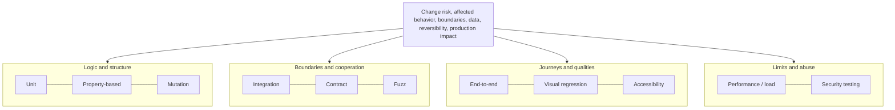
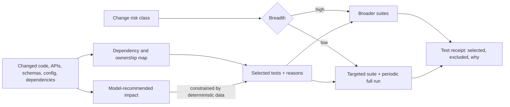

# 22. Testing strategy for agentic change

Chapter 21 established that a green check is only evidence when its subject, method, and verifier are known. This chapter is about the checks themselves: which kinds of tests make which claims, how to pick the right subset for a given change without running everything every time, how to keep fixtures and flaky tests from quietly corrupting the evidence, and what to do about the fact that agents can write tests as fast as they write code — including tests that merely confirm whatever the code already does. After reading it you should be able to design a test portfolio for a real change, explain why each method was included or left out, and defend an agent-authored test against an independent validator.

## The problem

An agent can generate a hundred tests in the time a person writes one. That sounds like a win until you read them. Many will assert the implementation's current behavior rather than the required behavior: the agent wrote the code, then wrote tests that pass against it, and the loop closed without anyone asking whether the behavior was right. Others will pin implementation details that the next refactor breaks for no reason. The count goes up; the fault sensitivity does not.

The existing suite has its own problems. It may not exercise the changed behavior at all. It may rely on snapshots nobody has looked at in a year. It may pass nondeterministically — green on the second try, red on the fifth — so that "rerun until green" has become the team's unofficial policy. And it may take so long that running it on every Attempt is impossible, which pushes teams toward running less of it with no principled way to decide which part.

Put those together and a green check can express low coverage, correlated error between the code and the tests, or environmental luck. The people who feel this are the reviewers asked to accept an agent's change on the strength of "all tests pass," and the on-call engineer who learns at 2 a.m. that "all tests" did not include the one that mattered.

## How it works

### Why one kind of test is never enough

Software quality is multidimensional, and each test method makes one kind of claim while being blind to others. Unit tests isolate logic but miss integration. End-to-end tests cover journeys but localize failure badly and run slowly. Static analysis finds whole classes of defects without executing anything, and therefore says nothing about behavior. Performance, accessibility, security, and compatibility each need their own instruments. Repositories also accumulate history: flaky tests, shared state, brittle fixtures, and exclusions nobody documented.

A useful analogy is a medical workup. No single test diagnoses a patient. A blood panel, an X-ray, and a physical examination each see something the others cannot, and a competent physician orders the combination that the presenting symptoms justify, not every test in the hospital. The test portfolio works the same way: a set of complementary methods, chosen by what could plausibly be wrong with this change.

### The risk-based portfolio

<!-- infographic: test-portfolio -->
> **Infographic — The test portfolio.** *(Jay's graphic goes here.)* Until then, the diagram below carries the same concept.

Each method in the portfolio makes a primary claim and carries a characteristic blind spot. Knowing both is what lets you combine them deliberately.

| Method | Primary claim | Common blind spot |
| --- | --- | --- |
| Unit | Local logic behaves under controlled inputs | Integration and configuration |
| Integration | Components and dependencies cooperate | The full user journey |
| End-to-end | The critical workflow functions | Fault localization and speed |
| Contract | Producer and consumer expectations remain compatible | Internal behavior |
| Property-based | Invariants hold across generated inputs | Incorrect properties |
| Mutation | The tests detect introduced faults | Equivalent or costly mutations |
| Fuzz | Parsers and boundaries withstand unexpected input | Business correctness |
| Performance / load | Latency, throughput, and resource limits hold | Functional intent |
| Accessibility | Interaction remains usable across access needs | Product value |
| Visual regression | Rendered appearance does not drift unexpectedly | Semantic correctness |
| Security testing | Known abuse classes and policies hold | Unknown threats |

A few of these deserve a sentence of explanation for readers who have not used them. **Contract tests** check that the interface between a producer (an API, an event schema) and its consumers still matches what each side expects, without exercising either side's internals; they are the cheapest way to catch a breaking change across a service boundary. **Property-based tests** state an invariant — sorting is idempotent, encoding then decoding returns the input — and let a generator hammer it with thousands of inputs; their weakness is that a wrong invariant passes just as cheerfully as a right one. **Mutation testing** deliberately introduces small faults into the code and checks whether the suite notices; a mutant that survives marks a test gap, though some mutants are equivalent to the original and cost effort to dismiss. **Fuzzing** feeds malformed or random input at parsers and boundaries to find crashes and hangs, and says nothing about whether valid input produces the right answer. **Accessibility testing** is the automated and human evaluation of whether people with varied access needs can perceive, navigate, understand, and operate an interface; automated checks cover only part of the requirement, so a green scanner result is not the same as an accessible product.

The **Quality Contract** — the per-change statement of required evidence introduced in [Chapter 24](./24-quality-contracts-proof-packages-and-certificates.md) — chooses methods from change risk, affected behavior, architecture boundaries, data involved, reversibility, and production impact. No single pyramid shape or coverage percentage is universally sufficient. A one-line copy change and a payment-schema migration deserve different portfolios, and the contract is where that difference is written down.

### Where tests stop and evals begin

Every method in the portfolio above answers a deterministic question. Given this input, does the function return this value? Does the API still honor its contract? Is the database in the expected state afterward? The answer is yes or no, the same yes or no on every run, and a change in the answer is a change in the code. That is what makes a test a test.

Agentic change introduces a second family of questions that no deterministic test can answer, because the thing being asked about is probabilistic. An **eval** (short for evaluation) is a check on how an agent behaves across a population of representative cases rather than on what one function returns. The questions an eval asks look like this:

- Did the agent understand the task it was given?
- Did it choose the right capabilities — the right tools, skills, and model — for that task?
- Was its trajectory acceptable: did it investigate before editing, stay inside scope, stop when it should have?
- Is its output grounded in the context it was given, rather than invented?
- Did a change to the model, prompt, skill, or routing configuration cause a regression on work that used to succeed?
- Are the trust-and-safety properties intact — no injection followed, no boundary crossed?

Think of the difference between inspecting a car and licensing a driver. The inspection is deterministic: the brakes stop the car within the required distance or they do not. The driving test samples behavior across situations and judges whether it is acceptable often enough to be trusted on the road. Nobody would license a driver on the strength of a brake inspection, and nobody would skip the brake inspection because the driver seemed competent.

The two are additive, not competing. Evals do not replace the portfolio; they sit alongside it, and they run at three points: offline in CI before a configuration is promoted, inline against the deployed agent, and operationally to watch for drift, reliability, safety, quality, and cost over time. [Chapter 23](./23-evaluation-engineering.md) builds the eval discipline in full. This chapter's job is to fix the boundary.

*Traditional tests validate deterministic behavior. Evals validate probabilistic behavior.*

### Change-impact test selection

Running the full suite on every Attempt maximizes breadth and can make feedback unusably slow. Running a hand-picked subset is fast and depends entirely on whether the pick was right. **Test-impact analysis** (equivalently, **change-impact test selection**, the first item in Jay's quality stack) is the discipline that makes the subset defensible.

<!-- infographic: change-impact-selection -->
> **Infographic — Change-impact selection.** *(Jay's graphic goes here.)* Until then, the diagram below carries the same concept.

The mechanism maps what changed — code, APIs, schemas, configuration, dependencies, and behavior — onto the tests that exercise those things, using a dependency and ownership map that is itself maintained as data. Selection records not only which tests ran but why each was included or omitted; a test that was skipped for a reason is evidence, a test that was skipped silently is a hole. High-risk changes run broader suites. Low-risk changes may use targeted suites plus periodic full validation so that drift in the mapping is caught on a schedule rather than in production.

A model may recommend impact — it is good at reading a diff and guessing what it touches — but deterministic dependency and ownership data should constrain what it is allowed to exclude. The model proposes; the map decides. Impact-based selection is only as trustworthy as that map, which is why the future factory should update mappings from accepted outcomes, and why a production escape should be read first as a selection gap.

### Governing agent-generated tests

Agents write tests, and the factory should let them; the question is how to keep those tests honest. Three rules do most of the work.

First, require the test to fail against the relevant pre-change behavior, or against a deliberately introduced fault, whenever that is feasible. A test that has never been seen red proves nothing about its own sensitivity. This is the testing-specific form of Chapter 21's rule that unknown is not pass.

Second, review assertions for observable outcomes rather than implementation details. "The endpoint returns 403 for a user without the role" is an outcome. "The function calls `checkRole` exactly once" is a detail that will break on the next harmless refactor and that would still pass if `checkRole` were wrong.

Third, separate the agent that proposes behavior from the validator that evaluates coverage and fault sensitivity. The agent that wrote the code and the tests has a single mental model of the problem; if that model is wrong, both the code and the tests are wrong in the same direction, and they agree with each other. An independent validator — a separate Attempt with its own identity and no permission to edit the artifact, exactly as Chapter 21 defines it — measures whether the tests detect the plausible faults this change could have introduced.

### Test infrastructure is production infrastructure

Tests produce evidence, and evidence that comes from unreliable machinery is worthless. Treat the test estate with the same seriousness as a production service: version fixtures and test data; isolate tenants so parallel runs cannot see each other; remove secrets from fixtures; define cleanup so a failed run does not poison the next; retain environment identity so a result can be tied to the versions that produced it; and track flaky behavior as a measured property rather than folklore.

Most of that list is **test-data management**: the discipline of deciding where every fixture, seed record, and synthetic dataset comes from, which version of it a given run used, who may see it, and how it is reset afterwards. Agents make this urgent rather than tidy, because an agent that needs a customer-shaped record will happily copy one from a production dump if nothing stops it; the factory therefore supplies governed, privacy-safe generated data and treats a fixture that carries real personal data as a defect in the estate, not a shortcut.

A **flaky test** — one that passes and fails without any change to the code under test — needs an operating model, not a shrug. Quarantining it is acceptable as visible debt: the quarantine has an owner and an expiry, the test's result is recorded as excluded rather than passed, and the required gate it belonged to is explicitly re-covered or explicitly waived under the waiver contract. What is not acceptable is the silent pass: a test that is retried into green or marked skipped without a record.

### Results are bound to exact subjects

A test run is evidence only when it is bound to what it tested. A **test receipt** — the testing-specific form of Chapter 21's evidence envelope — identifies the source commit, the artifact, the environment, the command, the selected tests, the exclusions, the retries, the duration, the raw result, and the verifier. Rerunning until green without preserving the failures destroys evidence: it hides the nondeterminism that a future incident will need explained, and it converts a partial result into a clean one by deleting history. Every run, including the red ones, stays in the record.

### Classifying failures

A future factory should distinguish four kinds of test failure, because each has a different owner and a different fix. A **product defect** means the code is wrong and the test caught it. A **test defect** means the test is wrong — a bad assertion, a stale snapshot, a misread requirement. An **infrastructure failure** means the run could not be trusted — a runner died, a dependency was unreachable. **Nondeterminism** means the same inputs gave different answers. Jay's quality stack lists this as **failure classification**, and it pairs with **historical defect learning**: production escapes should create regression cases, and each escape should be examined for the selection gap or portfolio gap that let it through. [Chapter 32](../06-improve/32-production-feedback-review-and-the-agentic-merge-queue.md) covers how those cases flow back from production.

## How to build it

1. **Write the portfolio into the Quality Contract.** For each change class, list the required methods, the depth, and the reason. Start from the table above and prune by risk, not by habit.
2. **Build the dependency and ownership map as data.** Map files, modules, APIs, schemas, configuration, and dependencies to the tests that exercise them and the teams that own them. Store it in the repository; version it; regenerate it from accepted outcomes.
3. **Implement impact selection with recorded reasons.** For every Attempt, emit the selected set, the excluded set, and the reason per exclusion. Let a model propose; let the map constrain.
4. **Schedule periodic full validation** for repositories running targeted selection, so mapping drift surfaces on a cadence.
5. **Add red-first checks for agent-written tests.** Where feasible, run each new test against the pre-change commit or a seeded fault and require a failure before accepting it.
6. **Route coverage and fault-sensitivity evaluation to an independent validator.** Give it read-only access to the artifact and its own execution identity.
7. **Stand up the flaky-test register.** Each entry: test id, first observed, owner, expiry, quarantine status, and the gate it affects.
8. **Version fixtures and test data.** Tenant isolation, no secrets, defined cleanup, retained environment identity.
9. **Emit the test receipt.** Bind every run to commit, artifact, environment, command, selection, exclusions, retries, duration, raw result, and verifier.
10. **Target mutation and fuzz by risk and budget.** Apply them to parsers, boundaries, authorization logic, and money-handling code first; do not run them everywhere.
11. **Stabilize browser and visual tests** with controlled data and rendering before making them required gates; otherwise they become the main source of flakiness.
12. **Classify every failure** as product defect, test defect, infrastructure failure, or nondeterminism, and route each to its owner.

A design exercise makes the trade-offs concrete. Take a payment API schema change with a browser client, a batch consumer, a performance SLO, and an accessibility requirement. The portfolio needs contract tests for the client and the consumer, integration tests for the persistence path, unit and property tests for the amount and currency logic, a performance run against the SLO, an accessibility check on the changed form, and a browser journey for the checkout. Then add one flaky test in the browser suite and one missing edge in the dependency map (the batch consumer is not linked to the schema). The first must land in the register with an owner rather than being retried; the second must be caught by periodic full validation or a contract test, and should trigger a map update.

## Failure modes

**Tests that confirm the implementation.** The agent writes code and tests together and both agree. Detect it by running new tests against the pre-change commit; a test that passes there was never sensitive. Fix by red-first checks and independent validation.

**Assertions on implementation details.** Tests pin call counts, private state, or exact log strings. Detect it by refactor breakage with no behavior change. Fix by reviewing assertions for observable outcomes.

**Selection without a trustworthy map.** Targeted runs skip the test that mattered because the map did not know the dependency. Detect it by escapes whose covering test existed but was not selected. Fix by periodic full runs and map updates from outcomes.

**Retry until green.** Flaky results are retried and the failures discarded. Detect it by receipts with retries greater than zero and missing failed results. Fix by retaining every result and routing flakiness to the register.

**The silent quarantine.** A skipped test reads as a pass at the gate. Detect it by comparing the gate's required set with the executed set. Fix by recording exclusions explicitly and re-covering or waiving the gate.

**Count as coverage.** The dashboard reports test count or line coverage and the team reads it as fault sensitivity. Detect it by mutation score on high-risk code. Fix by measuring whether independent methods detect the plausible faults of this exact change.

**Unstable test infrastructure.** Shared state, leaked secrets, or stale fixtures make results unreproducible. Detect it by results that differ by runner or by order. Fix by treating the estate as production: versioned, isolated, cleaned.

**Tests asked probabilistic questions.** A team writes a unit test asserting the agent's exact output for a prompt, watches it flap, and either deletes it or pins the model version forever. Detect it by tests whose subject is model behavior rather than code behavior. Fix by moving the question into an eval with repeated trials and a threshold.

**Untargeted heavy methods.** Mutation and fuzz run everywhere, cost too much, and get switched off. Detect it by pipeline duration and by nobody reading the results. Fix by targeting by risk and budget.

## In Mission Control

The v1 chapter this one absorbs was assessed against the guide's own contracts rather than a specific commit (last verified 2026-08-30). At the study commit pinned in [Chapter 21](./21-quality-and-evidence-architecture.md) (`8014d5af`), Mission Control provides the machinery this chapter's tests plug into: quality contracts, criterion-linked evidence, deterministic validation, independent verification, browser testing, security scanning, and replay. The golden-path lab requires unit, integration, and browser evidence.

Mission Control does not yet provide a complete test taxonomy, an impact-analysis contract, a flaky-test operating model, a mutation or property-based strategy, performance and accessibility gates, or a test-data lifecycle. Those are the responsibilities this chapter establishes, and they remain future work. The intended direction is a factory that proposes a test plan from repository intelligence and change impact, explains every selected method, executes it in qualified environments, updates mappings from accepted outcomes, classifies failures into product defect, test defect, infrastructure failure, and nondeterminism, and turns production escapes into regression cases that expose selection gaps.

## Retain this

- Passing existing tests is weak evidence. The question is whether independent methods can detect the plausible faults introduced by this exact change.
- Every test method makes one claim and has one blind spot; the portfolio is chosen by risk, not by a universal pyramid.
- Traditional tests validate deterministic behavior; evals validate probabilistic behavior. They are additive, and evaluation starts before promotion and continues after deployment.
- Change-impact selection is defensible only when the map is data, the reasons for exclusion are recorded, and full runs happen on a schedule. The model proposes; the map constrains.
- Agent-written tests must fail red first, assert observable outcomes, and be judged by a validator that did not write the code.
- Test infrastructure is production infrastructure: versioned fixtures, isolated tenants, no secrets, defined cleanup, retained environment identity.
- A flaky test in quarantine is visible debt with an owner and an expiry. A retried-to-green test is destroyed evidence.
- A test receipt binds the run to commit, artifact, environment, command, selection, exclusions, retries, and verifier.
- Test quantity is an activity metric. Fault sensitivity is the quality metric.

## Go deeper

- Before this: [21. Quality and evidence architecture](./21-quality-and-evidence-architecture.md). After this: [23. Evaluation engineering](./23-evaluation-engineering.md) for model-based and behavioral evaluation, and [24. Quality contracts, proof packages, and certificates](./24-quality-contracts-proof-packages-and-certificates.md) for the contract that selects these methods.
- Where escapes come back: [32. Production feedback, automated review, and the agentic merge queue](../06-improve/32-production-feedback-review-and-the-agentic-merge-queue.md). Where the tests run: [14. Development environments, sandboxes, and compute](../03-build/14-development-environments-sandboxes-and-compute.md).
- Terms: [Glossary](../appendix/glossary.md).
- Sources: Jay West, *AI Software Factory mission* ("Your quality stack": test selection based on change impact, failure classification, historical defect learning).
- External: [DORA — test automation capability](https://dora.dev/capabilities/test-automation/), accessed 2026-08-30.
