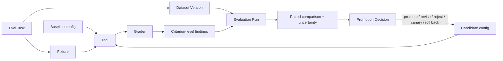
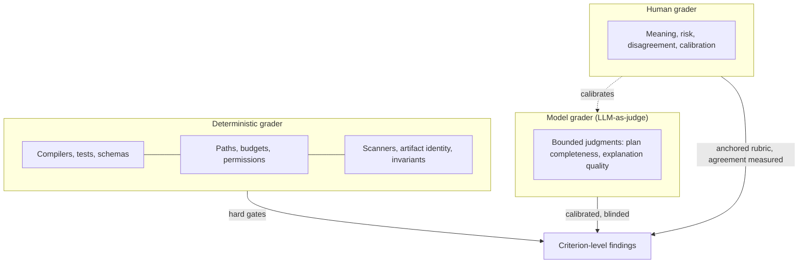
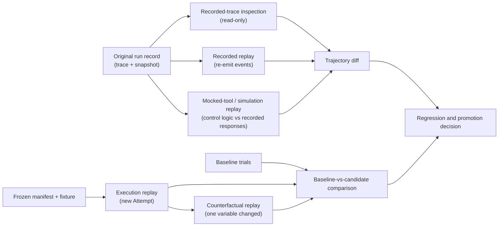
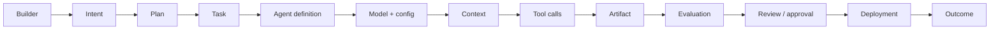
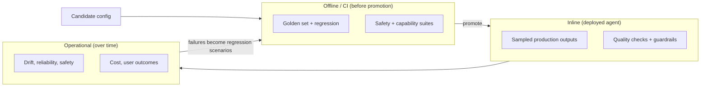

# 23. Evaluation engineering

Chapters 21 and 22 were about proving that one candidate change is correct. This chapter is about a different question: whether the *thing that produces candidates* — a particular agent configuration — is reliable across the kinds of work it will be given, whether a new version of it is better than the old one, and whether a failure seen in production can be reproduced and understood. That is evaluation, and it is a discipline with its own records, its own statistics, and its own ways of fooling you. After reading this chapter you should be able to define the evaluation subject precisely, build and govern a dataset, choose and calibrate graders, capture and replay runs, compare a baseline against a candidate with honest uncertainty, and write a promotion decision that a hard-gate failure can still block.

## The problem

Agent behavior changes whenever the model, prompt, tools, harness, context, environment, repository, or evaluator changes. A handful of successful demos cannot tell you whether a configuration is reliable, whether the new version is an improvement, or whether the failure someone saw on Tuesday will happen again. Teams that lack an evaluation program make promotion decisions on anecdote — the last three runs looked good — and discover the regression from customers.

Teams that have an evaluation program face a subtler danger. Evaluations can produce precise-looking scores from unrepresentative tasks, contaminated examples, unstable graders, or too few trials. A team then optimizes prompts and models to the benchmark, the number goes up, and real completion rate, review burden, cost, and production safety quietly get worse. Worse still, the grader is itself a second probabilistic system. A model grader can be swayed by style, verbosity, model family, or the candidate's own explanation of why it was right. Human graders disagree with each other. A deterministic test can be precise while measuring the wrong requirement.

And the artifact is only half the story. A software agent produces an artifact and a trajectory. The artifact may be correct even though the agent used an unauthorized tool, blew its budget, or relied on stale context. A safe trajectory may end with no useful artifact because a provider or environment failed. Rerunning "the same prompt" does not reproduce the same system, so diagnosis needs something more careful than trying again. The people who feel all this are the AI engineers deciding whether to ship a new configuration, and the operators who inherit it if the decision was wrong.

## How it works

### Evaluation is not verification

The two words get used interchangeably and they should not be. **Verification** asks whether *this* candidate satisfies *this* criterion — the receipt-per-criterion work of Chapter 21. **Evaluation** asks whether a *configuration* behaves as expected across a *population* of representative cases, and how well the system performs as a whole. In the 12-layer production agent stack ([Chapter 19](../03-build/19-the-12-layer-production-ai-agent-stack.md)), **Evaluation Engineering** is defined as testing expected behavior across representative cases and measuring system-level performance, and it sits next to **Harness Engineering**, defined as capturing complete runs so failures can be reproduced, inspected, replayed, and compared. This chapter covers both, because you cannot evaluate what you cannot capture.

The clinical analogy is the cleanest. A lab test on one patient is verification: this sample, this assay, this result. A clinical trial is evaluation: does this treatment work across a representative population, compared with the current standard, with enough participants to be confident, and with its side effects measured? Nobody would approve a drug on one patient's bloodwork, and nobody should promote an agent configuration on one good run.

### The subject is the whole configuration

The first mistake in evaluation is to think the subject is a model. It is not. The evaluation subject is a versioned combination:

`agent definition + model route + prompt + tools + skills + context policy + harness + environment + workflow + verifier`

Changing any behaviorally relevant component creates a new candidate. The evaluation record preserves the exact subject digest and keeps it distinct from the repository artifact the candidate produces. This matters for reproducibility later: if you cannot say exactly which configuration ran, you cannot say what your score is a score *of*.

### The records of an evaluation program

<!-- infographic: eval-pipeline -->
> **Infographic — The evaluation pipeline.** *(Jay's graphic goes here.)* Until then, the diagram below carries the same concept.

Each box is a record with a defined responsibility, and the definitions double as the vocabulary for the rest of the chapter.

An **eval task** (or **eval case**) is one representative objective with its initial state, constraints, criteria, and expected evidence. An **eval fixture** is the reproducible repository, data, dependency, and environment state the task needs — the frozen starting point. An **evaluation dataset** is a governed collection of tasks, and a **dataset version** is an immutable snapshot of its membership, provenance, slices, inclusion rules, exclusions, and contamination controls. A **trial** is one execution of one candidate on one task, with its own unique Attempt and run record; several trials of the same task on the same candidate are how you measure variability. A **grader** is a versioned method — deterministic, model-based, or human — that emits criterion-level findings. An **evaluation run** is a comparable set of trials with its candidate, baseline, metrics, uncertainty, failures, cost, and artifacts. A **promotion decision** is the governed conclusion to promote, revise, reject, canary, or roll back a candidate.

Inside a task, an **evaluation assertion** identifies the claim, the method, the pass condition, the required evidence, the independence requirement, and the failure severity — the same shape as an acceptance criterion in Chapter 21, applied to a population. The rule that follows from severity is that aggregate scores must not erase failed hard gates; a 94% success rate is meaningless if the 6% includes an unauthorized write.

### Datasets are governed products

A dataset is not a folder of old prompts. It is a product with owners, versions, privacy, and maintenance. Its governance record holds the source of each task, consent or allowed use, owner, schema, task distribution, risk, difficulty, expected result, hidden checks, version, splits, retention, and known limitations.

Build the dataset from a task taxonomy so that it represents the workflow's real distribution and its important failure boundaries. A **dataset slice** (or **cohort**) is a subset defined by a property — task type, repository, language, risk, change size, environment, tool dependency, context size, ambiguity, failure mode, required human intervention — and slices are what let you see that a gain on easy documentation tasks is hiding a regression on high-risk migrations. Include normal cases that reflect production frequency; boundary and adversarial cases that reflect consequence; historical incidents and human corrections; negative cases in which the right answer is to stop or escalate; recovery cases involving timeouts, unavailable tools, stale state, or partial effects; and held-out cases that were never used to tune the candidate.

Two named subsets matter most. A **golden set** is a curated collection of tasks with trusted expected results, used as a stable reference for regression checks; it is well understood, and because it is stable it is easy to over-fit to. A **holdout set** is a hidden collection that is never used during development or tuning, so that a score on it estimates performance on work the candidate has not seen. The full set of splits a mature program keeps apart is development, regression, certification, adversarial, and holdout, each with a distinct purpose and a rule about who may see it.

### The golden evaluation set comes first

If a factory builds one evaluation asset before any other, it should be the golden set, because everything else — changing a model, a prompt, a skill, a routing rule, the runtime — is measured against it. Build it from representative work, not synthetic toys. A set of tidy examples an engineer wrote in an afternoon measures the engineer's imagination; a set drawn from what product teams actually ask the factory to do measures the factory.

Collect it with the product organizations that will use the factory, across the task classes they care about:

| Task class | Example |
| --- | --- |
| Code generation | Implement a bounded feature against acceptance criteria |
| Debugging | Locate and fix a reported defect from its symptoms |
| Refactoring | Restructure without changing observable behavior |
| Repository understanding | Answer a question about how a subsystem works, with citations |
| Testing | Write tests that fail red first and assert outcomes |
| Documentation | Produce or update docs from code and decisions |
| Dependency changes | Upgrade a library across its call sites |
| Tool usage | Complete a task that needs the right tool at the right step |
| Security-sensitive changes | Modify authorization or data handling under constraints |

Then deliberately include the cases that make the set worth something: known failures, difficult cases, adversarial scenarios, high-risk changes, and defects that previously escaped to production. A golden set made only of successes is a set the current configuration already passes, which tells you nothing about the next one. Own it, version it, and grow it from observed gaps.

*Without a stable baseline, improvement becomes anecdotal.*

**Dataset contamination** is the leak that breaks all of this: a task or its expected answer appears in the model's training data, in a prompt, in an example, in a skill, in memory, or in a previous optimization loop, so that the candidate is being tested on something it has effectively already seen. Reusing traces for development, tuning, and final evaluation is the most common way it happens inside a factory. Track it explicitly and deduplicate semantically, not only by text hash — two tasks that differ in wording and share an answer are one task. **Eval drift** is the slower decay: production tasks change over time, the dataset does not, and the score stays high while its relevance falls. Dataset growth should follow observed gaps rather than accumulate unreviewed production exhaust.

The HumanLayer team's issue-triage work is a useful picture of a dataset being born. They had accumulated enough past issues to form a database, and that database became their eval set for an agent that classifies issue difficulty. Their one rule for the pipeline was that every pull request has to push reproductions — measurements against past issues — so every version of the pipeline reports its accuracy and the team can decide whether the change is an improvement; a deduplication change, for instance, scored lower than expected and was sent back. They also had a pragmatic answer to a hard grading problem: when a fix classified as "small" turned out to be five hundred lines of code, the record is force-reclassified by lines of code, so the label is grounded in an observable rather than a guess. That is the whole discipline in miniature — a governed dataset from real history, a metric per version, a deterministic correction for a fuzzy label, and a threshold (they hoped for at least 60% correct) declared before the result.

### Three kinds of grader, and none of them vote

<!-- infographic: grader-types -->
> **Infographic — Grader types.** *(Jay's graphic goes here.)* Until then, the diagram below carries the same concept.

A **deterministic grader** applies a fixed rule with a fixed answer: does it compile, do the tests pass, does the output match the schema, did the agent stay inside the allowed paths and budget, did it exceed its permissions, did the security scanner find anything, is the artifact the one claimed, do the state invariants hold. Deterministic graders define clear claims and should own every hard gate.

A **model grader** — commonly **LLM-as-judge** — uses a model to make a bounded judgment where deterministic methods cannot reach: is the plan complete, is the explanation adequate, does the change match the intent. Model graders scale, and they share failure modes with the systems they evaluate. A grader produced by the same configuration as the candidate is not automatically independent, for exactly the reason Chapter 21 gave: shared assumptions produce shared errors.

A **human grader** handles meaning, risk, unresolved disagreement, and — most importantly — the calibration of the other two. Human rubrics need examples, anchors, reviewer training, blind assignment, and a process for disagreement.

The graders have to be evaluated themselves. **Grader calibration** is the measurement of a grader against a trusted reference — for a model grader, a human-reviewed set with expert labels. Think of calibrating an instrument: you do not trust a scale because it prints numbers, you trust it because it reads 1.000 kg when you put a reference kilogram on it. Calibration produces a **false-positive / false-negative analysis** (how often the grader passes what should fail, and fails what should pass), disagreement by slice, sensitivity to presentation, and stability across repeated grading of the same item. **Inter-rater agreement** measures how consistently different graders — human or model — reach the same verdict on the same item; low agreement means the rubric, not the candidate, is the problem. Model graders additionally need versioned prompts, position- and verbosity-bias tests (does the judge prefer the first answer, or the longer one?), adversarial cases, and periodic re-evaluation as models change. Blind the grader to irrelevant candidate identity and to the candidate's self-justification; a candidate that argues for its own correctness should not get credit for the argument.

Combine graders without converting them into voters. Deterministic hard gates block regardless of what the judge thinks. Model and human findings inform; they do not average away a failure.

### Who evaluates the evaluator

Every grader is itself a system that can be wrong, so each kind needs its own proof of fitness before its verdicts count.

A **deterministic evaluator** is validated with known-positive and known-negative scenarios: cases that must pass and cases that must fail, run against the evaluator itself. A security scanner that has never been shown a vulnerable file has never been shown to work. A **model grader** is validated against a human-labeled calibration set, and then re-validated on a schedule by comparing its verdicts with human verdicts on fresh items. The measures are agreement rate, false positives (the grader passes what a human would fail), false negatives (the grader fails what a human would pass), and how each of those moves by task class.

Never report one composite score. A global number can rise while security-sensitive tasks regress, because the easy classes outnumber the hard ones. Segment grader performance by task class, risk tier, model, skill, agent definition, and release, and treat a regression in any high-consequence segment as a finding in its own right.

The last rule closes the loop with production: every meaningful production failure becomes a permanent regression scenario in the dataset, with its expected behavior approved through the intake gate described below. The set of things the factory has already gotten wrong is the most valuable evaluation content it will ever own.

*Never optimize against a judge you haven't validated.*

### What to measure, and how many times

One run is an anecdote. Where stochasticity matters — and for agents it almost always does — run repeated trials and report the distribution. The measures worth keeping together, because each one alone can be gamed:

- criterion-level and task-level success rate;
- retry-free success;
- failure and escalation correctness (did it stop when it should have?);
- policy compliance and unauthorized-attempt rate;
- human correction, override, and acceptance rates;
- latency, tokens, compute, and total cost per accepted outcome;
- severity-weighted regression rate;
- **pass@k** — the probability that at least one of k attempts succeeds, appropriate when the workflow permits several tries and a human picks; and
- **consistency-oriented measures** — the probability that *all* required attempts succeed, appropriate when a single failure is costly and there is no picker.

Set a **regression threshold** — the amount by which a candidate may fall below the baseline on a measure before it is rejected — and a **quality floor** — an absolute minimum below which a candidate is rejected regardless of the baseline. Both are declared before the run. Then protect the **hard gates**: no aggregate improvement compensates for an unauthorized action, a critical security failure, evidence fabrication, data loss, or another noncompensable condition.

**Statistical confidence and uncertainty** are the difference between a number and a finding. Report the sample size, the success distribution, a confidence interval or another uncertainty statement, severity, retry rate, latency, cost, and human intervention. Prefer **paired comparisons**, in which baseline and candidate run against the same task versions under comparable conditions; they reveal differences far more efficiently than comparing unrelated aggregates. Segment before aggregating — by workflow, repository class, risk, capability graph, and environment — because the most dangerous aggregate is the one that hides the slice where consequence is highest.

### Capturing runs so failures can be reproduced

Everything above assumes you can see what the agent did. That is harness engineering's job. **Trace capture** is the retention of a run's complete event history — prompts, context assembled, model calls, tool calls and their results, permissions consulted, files touched, tests run, retries, costs, and human interventions — with enough identity to know exactly which configuration produced it. An **environment snapshot** freezes the state the run started from: repository commit, dependency versions, data, configuration digest, and available tools. Together they are the flight data recorder: not a way to un-crash the aircraft, but the only way to find out what happened.

Four activities use those recordings, and they must not be confused with one another.

<!-- infographic: trace-replay-comparison -->
> **Infographic — Trace, replay, and comparison.** *(Jay's graphic goes here.)* Until then, the diagram below carries the same concept.

**Recorded-trace inspection** reads the retained history without causing any new effect. It is the first tool for every failure and the only one that is perfectly safe. **Recorded replay** re-emits the stored events into an inspector or a test consumer, so a UI or a downstream component can be exercised against exactly what happened. **Mocked-tool replay** — also called simulation replay — reruns the control logic (the loop, the routing, the policy checks) against recorded or mocked model and tool responses; it tests the harness deterministically without paying for new model calls or touching real systems. **Execution replay** creates a new Attempt from a reconstructed manifest, fixture, environment, and external dependencies. It is a new observation, not a rewinding of the original. It may diverge because models, services, time, randomness, or network state differ, and the system should record those differences rather than claim exact reproducibility. **Counterfactual replay** is execution replay with one variable deliberately changed — a different model route, a corrected tool, an added skill — to ask whether that variable would have changed the outcome.

A **trajectory diff** compares two runs' paths, not just their results: changes in context, prompts, tools, route, permissions, environment, tool-call sequence, retries, files touched, tests, latency, cost, policy decisions, human intervention, artifact, and evidence. Trajectory diffs are diagnostic and they are not verdicts. A shorter sequence may mean efficiency or may mean skipped investigation; the diff tells you *what* changed and the criteria tell you whether it mattered.

**Baseline-versus-candidate run comparison** is the paired comparison from the previous section applied with trajectories attached: same tasks, same fixtures, two configurations, outcomes and paths side by side with uncertainty. **Eval lineage and reproducibility** is the property that makes any of this reviewable later — every evaluation run records its dataset version, fixture hashes, grader versions, candidate and baseline digests, and trial records, so that a decision made today can be reconstructed next quarter.

### Observability is not evaluation

Two disciplines share the same telemetry and answer different questions. **Observability** tells you what happened: which model ran with which configuration, what context was retrieved, which tools were called, how state moved, how long it took, what it cost in time and tokens, how many retries occurred, which policies fired, and what the outcome was. **Evaluation** tells you whether what happened was good enough. Confusing them produces two failure modes: dashboards full of numbers nobody can act on, and verdicts nobody can explain.

What binds them is lineage. A finding is only debuggable if you can walk the chain from the builder who asked to the outcome that resulted:

Every link is a versioned record, and every evaluation finding points at the exact link it concerns. [Chapter 28](../05-operate/28-observability-telemetry-and-forensics.md) builds the telemetry side; this chapter needs it to exist.

*Without observability, evaluation isn't debuggable. Without evaluation, observability is just telemetry.*

### Drift has more than one source

An agent that passed every pre-release test can degrade without anyone touching it. **Drift** is usually discussed as model drift — the provider updates a model and behavior shifts — but in a factory it has at least five sources, and they move independently:

| What moved | How it shows up |
| --- | --- |
| Model | Same prompt, different reasoning, tool-calling, or failure modes |
| Retrieved knowledge source | The docs changed, went stale, or were reorganized; grounded answers are now grounded in the wrong thing |
| Tool contract | An API or MCP server changed its schema or semantics; calls succeed with different effects |
| Skill | A skill version was promoted and behaves differently on an edge case |
| Environment | Dependencies, runners, or data changed underneath the run |

Continuous evaluation detects that *something* moved. Attributing *what* moved requires the lineage above: versioned agent definitions, model configuration, skill versions, context provenance, and tool traces. If any of those is unversioned, a drift alert becomes an argument instead of a diagnosis.

*Continuous evaluation is only useful if you can attribute what changed.*

### Three evaluation windows: continuous intelligence

Evaluation is not one gate. It runs in three windows, each checking what the previous one could not, and together they form what this guide calls **continuous intelligence** — the practice of measuring trust continuously rather than certifying it once.

<!-- infographic: evaluation-windows -->
> **Infographic — The three evaluation windows.** *(Jay's graphic goes here.)* Until then, the diagram below carries the same concept.

The **offline window** runs in CI before a configuration is promoted: golden-set and regression comparison against the baseline, plus safety and capability suites. It is reproducible, safe, and blind to anything it did not anticipate. The **inline window** evaluates the deployed agent on real work: sample production outputs, run quality checks against them, and enforce guardrails that stop a bad output before it has an effect. The **operational window** watches the population over time: drift, safety, reliability, cost, and whether users are getting the outcomes they came for. Each window feeds the one before it — an operational failure becomes an inline check, and an inline failure becomes an offline regression case.

*Trust isn't certified once; it's continuously measured.*

### From offline to production: the promotion ladder

Offline evaluation is reproducible and safe and incomplete. **Shadow evaluation** runs the candidate on production-shaped inputs without granting it any authoritative effect — it writes to a scratch branch, its results are compared, nothing ships. A **canary** exposes a bounded cohort of real work to the candidate with rollback ready. **Online evaluation** measures real outcomes, failures, interventions, cost, and drift in production. The four are the rungs of a **promotion ladder**: offline development, holdout evaluation, adversarial testing, shadow execution, limited canary, controlled comparison, and broader eligibility.

This is where evaluation becomes **controlled experimentation**. The evaluation run is treated as an experiment with a registered hypothesis and everything fixed before it starts: the success definition, a noninferiority or improvement threshold, guardrails, sample size, duration, stop conditions, who approves, and how rollback happens. Declaring these afterwards is how a team convinces itself that whatever happened was what it wanted. Promotion then requires a defined sample, met quality floors, no critical policy regression, bounded uncertainty, rollback readiness, and human authority — evaluation science, in one line, establishes whether the comparison supports the decision being made.

Production incidents feed the dataset, but only through a gate: normalization, deduplication, privacy review, and approval of what the expected behavior should have been. An incident copied straight into the eval set brings its sensitive data and its wrong expectations with it.

What happens *after* promotion — regression control across versions, optimizing prompts, skills, and tools from evaluated evidence, and the governance that stops a learned improvement from authorizing itself — is the subject of [Chapter 33](../06-improve/33-governed-learning-and-compounding-engineering.md). This chapter builds the measuring instrument; that one uses it to improve the factory.

## How to build it

1. **Define the subject digest.** Hash the full configuration — agent definition, model route, prompt, tools, skills, context policy, harness, environment, workflow, verifier — and stamp it on every trial.
2. **Write the task taxonomy first.** List task types, risk classes, repositories, and failure boundaries the workflow must handle. Derive slices from it.
3. **Seed the dataset from history.** Past issues, incidents, human corrections, and escalations, each normalized, deduplicated semantically, privacy-reviewed, and given an approved expected result. Add negative and recovery cases deliberately.
4. **Split and lock.** Development, regression, certification, adversarial, holdout. Version each. Restrict who and what can read the holdout.
5. **Build fixtures as reproducible state.** Repository at a commit, dependency lockfile, data snapshot, configuration digest, tool availability. Hash them.
6. **Assign graders per assertion.** Deterministic for every hard gate; model graders only for bounded judgments; humans for meaning and calibration. Version every grader.
7. **Calibrate model graders** against an expert-labeled set: false-positive and false-negative rates, agreement by slice, position and verbosity bias, stability across repeats. Re-calibrate on a schedule and on every judge-model change.
8. **Instrument the harness for complete capture.** Trace every event with configuration identity; snapshot the environment at start; retain artifacts, cost, and interventions.
9. **Implement replay in order.** Read-only inspection first, then mocked-tool replay of control logic, then execution replay only once environment, dependency, model-route, tool, and context identities can be reconstructed faithfully.
10. **Run paired trials.** Same tasks, same fixtures, baseline and candidate, at least two trials per task where stochasticity matters. Compute uncertainty. Segment before aggregating.
11. **Predeclare the experiment plan** before any promotion-bearing run.
12. **Produce a promotion packet** that separates evidence from judgment: metrics with intervals, slice regressions, grader disagreement, hard-gate results, missing artifacts, cost, and the exact decision requested.
13. **Tier the cost.** Fast deterministic gates on every change; representative agent cohorts on candidate changes; expensive adversarial and long-running suites at risk-proportional intervals.

The predeclared experiment plan:

| Field | Meaning |
| --- | --- |
| Hypothesis | What the candidate is expected to improve, and on which slices |
| Frozen inputs | Dataset version, fixture hashes, grader versions, baseline and candidate digests |
| Success definition | The measures that decide, and whether the test is improvement or noninferiority |
| Thresholds | Regression threshold per measure, quality floors, hard gates |
| Sample and duration | Trials per task, tasks per slice, canary cohort size, observation window |
| Guardrails and stop conditions | What halts the experiment immediately |
| Approval and rollback | Who decides, and how the candidate is withdrawn |

## Failure modes

**Optimizing to the benchmark.** The score rises while production quality falls. Detect it by divergence between offline scores and shadow or canary outcomes. Fix with a locked holdout and eval-drift review.

**Contaminated tasks.** The candidate has seen the answers through prompts, skills, memory, or prior tuning. Detect it by suspiciously high scores on specific items and by lineage checks across prompts and training inputs. Fix with semantic deduplication and contamination tracking on every dataset version.

**An uncalibrated judge.** The model grader prefers verbose answers, the first option, or the candidate's own reasoning. Detect it with bias tests and human agreement measurements. Fix with calibration, blinding, and versioned judge prompts.

**One trial per task.** A stochastic system is scored once and the result is treated as its behavior. Detect it by trial count. Fix with repeated trials and reported distributions.

**Aggregates that hide the slice.** A net improvement masks a regression on the highest-consequence cohort. Detect it by segmenting every result. Fix by making slice regressions a blocking finding.

**Averaging away a hard gate.** A policy violation is outweighed by a good mean. Detect it by checking hard-gate results independently of scores. Fix by making deterministic gates non-compensable.

**Replay mistaken for reproduction.** A new execution diverges and is reported as "the same run." Detect it by comparing manifests and recording divergences. Fix by naming the replay type explicitly and treating execution replay as a new Attempt.

**Untraceable composition.** The exact configuration behind a run cannot be reconstructed, so the score belongs to nothing. Detect it by missing subject digests. Fix by stamping the digest on every trial and evaluation run.

**Production exhaust as dataset.** Incidents are copied straight into the eval set with their sensitive data and unreviewed expectations. Detect it by dataset entries without provenance and approval. Fix with the intake gate.

**Postdeclared success.** The threshold is chosen after the numbers are in. Detect it by the absence of a registered plan. Fix by predeclaring.

**One composite score.** The global number improves while security-sensitive tasks regress. Detect it by segmenting grader and candidate results by task class and risk. Fix by reporting segments and blocking on high-consequence regressions.

**Certified once.** The configuration passed before release and nobody looked again; the model, a knowledge source, or a tool contract moved and the agent quietly degraded. Detect it by the absence of inline and operational evaluation. Fix with the three windows and versioned lineage so the drift can be attributed.

**Telemetry mistaken for evaluation.** The dashboard shows tokens, latency, and tool calls, and the team reads it as quality. Detect it by asking which finding a given metric supports. Fix by binding evaluation findings to lineage rather than reading trends as verdicts.

## In Mission Control

At study commit [`d902fae`](https://github.com/jaydubya818/MissionControl/tree/d902fae7032c0696b531c44ae88829c652516fc6), Mission Control has context evaluations, deterministic learning signals, dataset and experiment records, baseline/candidate comparison, independent Verification Subjects and Plans, verifier Attempts, criterion-linked evidence, exact-currentness checks, and Quality Gate Decisions. Run events, traces, artifacts, model/token/cost fields, and inspector views provide the raw material for trajectory analysis.

The studied evidence does not establish a single end-to-end evaluation harness that reconstructs exact fixtures and environments, calibrates model graders, performs trace or simulation replay, computes paired statistical comparisons, and gates promotion across a representative production dataset. Contamination controls, grader calibration and agreement measurement, repeated-trial analysis, statistical decision rules, shadow experiments, and a full adversarial-evaluation program are not yet specified. Production catalogs also lacked qualified execution routes at the study commit, so repository mechanisms should not be read as proof of an operating evaluation service.

The intended direction is for Mission Control to compile versioned Eval Tasks and fixtures into isolated Evaluation Runs, execute baseline and candidate cohorts, retain complete run records, and produce criterion, trajectory, cost, and intervention comparisons, with the UI exposing slice regressions, uncertainty, grader disagreement, missing artifacts, and the exact promotion decision required. Replay support should begin with read-only trace inspection and deterministic control-logic simulation; full execution replay comes only after environment, dependency, model-route, tool, and context identities can be reconstructed faithfully. Promotion requires a canary and a production observation window in addition to offline results.

## Retain this

- Verification proves one candidate against one criterion. Evaluation measures a configuration across a population. Do not confuse them, and do not promote on either alone.
- The evaluation subject is the whole configuration — agent definition, model route, prompt, tools, skills, context policy, harness, environment, workflow, verifier — with a digest stamped on every trial.
- A dataset is a governed product: versioned, sliced, split into development / regression / certification / adversarial / holdout, deduplicated semantically, and tracked for contamination and drift.
- Deterministic graders own hard gates; model graders make bounded judgments and must be calibrated and blinded; humans decide meaning and calibrate the others. Graders do not vote.
- One run is an anecdote. Run repeated paired trials, report uncertainty, segment before aggregating, and let no aggregate erase a hard gate.
- Inspection, recorded replay, mocked-tool replay, and execution replay are four different things. Execution replay is a new observation, and its divergences are data.
- Promotion climbs a ladder — offline, holdout, adversarial, shadow, canary, controlled comparison — with the experiment plan declared before the first run.
- Reproducible inputs improve comparison; they do not make model output deterministic.
- Build the golden set first, from representative work collected with product teams, and include known failures, adversarial cases, and escaped defects. Without a stable baseline, improvement becomes anecdotal.
- Validate the evaluator: known positives and negatives for deterministic checks, a human-labeled calibration set for model graders, agreement and false-positive/false-negative rates by segment. Never optimize against a judge you haven't validated.
- Observability says what happened; evaluation says whether it was good enough. The lineage chain from builder to outcome is what connects them.
- Drift comes from the model, the knowledge source, the tool contract, the skill, and the environment. Continuous evaluation is only useful if you can attribute what changed.
- Evaluate in three windows — offline in CI, inline on the deployed agent, operationally over time. Trust is continuously measured, never certified once.

## Go deeper

- Before this: [21. Quality and evidence architecture](./21-quality-and-evidence-architecture.md), [22. Testing strategy for agentic change](./22-testing-strategy-for-agentic-change.md). After this: [24. Quality contracts, proof packages, and certificates](./24-quality-contracts-proof-packages-and-certificates.md); [25. CI/CD, progressive delivery, and production verification](./25-cicd-progressive-delivery-and-production-verification.md) for canaries and rollback in delivery.
- What evaluation feeds: [33. Governed learning and compounding engineering](../06-improve/33-governed-learning-and-compounding-engineering.md) (regression control, capability optimization, promotion governance). What it evaluates: [17. Models: routing, profiles, and capability selection](../03-build/17-models-routing-and-capability-selection.md), [18. Agent and loop engineering](../03-build/18-agent-and-loop-engineering.md), [19. The 12-layer production AI agent stack](../03-build/19-the-12-layer-production-ai-agent-stack.md). Where traces come from: [28. Observability, telemetry, and forensics](../05-operate/28-observability-telemetry-and-forensics.md).
- Labs: [Capability certification and revocation](../appendix/labs/03-capability-certification-and-revocation-lab.md) and [Continual improvement promotion](../appendix/labs/08-continual-improvement-promotion-lab.md) — build a small versioned dataset with hidden holdout, run repeated paired trials for two configurations, calibrate one judge against human labels, and write a promotion decision that preserves hard gates. Case study: [Mission Control capability, workflow, and admission map](../appendix/mission-control/03-capability-workflow-and-admission-map.md).
- Terms: [Glossary](../appendix/glossary.md).
- Sources: Jay West, *The 12-layer production AI agent stack* (Evaluation Engineering and Harness Engineering layers; the evaluation-operations term list); HumanLayer × BAML livestream, *Software factory design patterns* (Dexter on building evals for automated issue triage from past issues, pushing repros on every PR, per-version accuracy, force-reclassifying by lines of code).
- External: [Anthropic — Demystifying evals for AI agents](https://www.anthropic.com/engineering/demystifying-evals-for-ai-agents); [SWE-bench paper](https://arxiv.org/abs/2310.06770) and [repository](https://github.com/SWE-bench/SWE-bench); [NIST AI Risk Management Framework](https://airc.nist.gov/airmf-resources/airmf/) and [NIST AI Resource Center](https://airc.nist.gov/); [OpenAI Agents SDK tracing](https://openai.github.io/openai-agents-python/tracing/). All accessed 2026-08-30.
