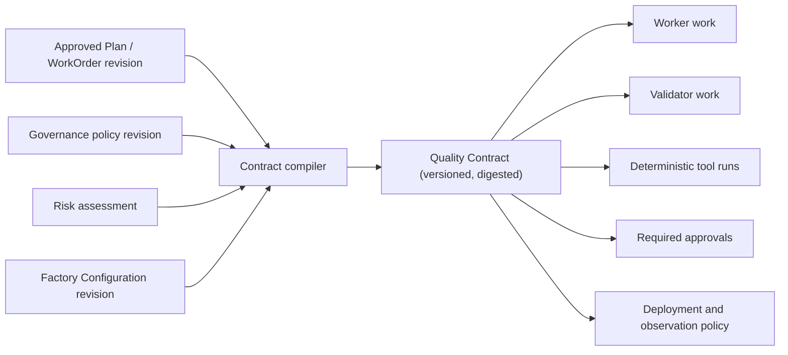
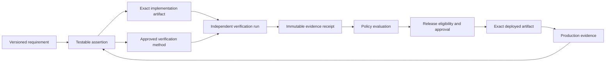
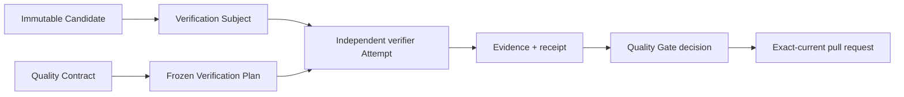
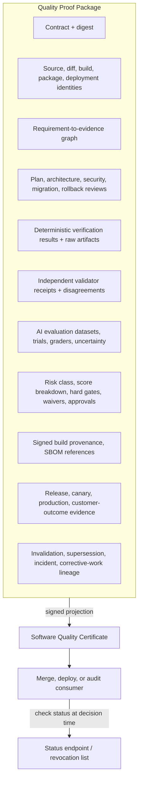
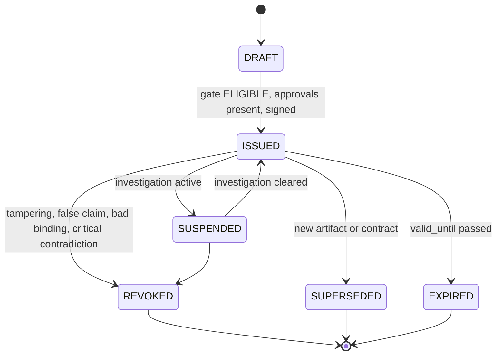

# 24. Quality contracts, proof packages, and certificates

The previous three chapters explained what evidence is, how to test agentic change, and how to evaluate probabilistic behavior. This chapter turns those ideas into a system with records, schemas, states, and decisions: the **Quality Contract** that says what "done" means before any code is written, the **Quality Proof Package** that collects everything supporting a release candidate, and the **Software Quality Certificate** that states, in a signed and revocable way, that an exact artifact satisfied an exact contract at an exact moment. After reading it you should be able to write a contract for a real change, explain why a 98/100 score can still be blocked, and say precisely what a certificate does and does not promise.

## The problem

Traditional quality control starts after implementation. Requirements live in prose, architecture decisions live somewhere else, tests express only part of the expected behavior, and production telemetry is disconnected from the business intent that started the work. A green pipeline therefore proves that a selected set of commands passed. It does not prove that the right system was built, that material risks were addressed, or that customer value appeared in production.

Agentic development makes this weakness dangerous rather than merely annoying. The same model can misread a requirement, write an incomplete implementation, generate tests that preserve its own misunderstanding, and then confidently declare success. More agent output increases the volume of claims; it does not increase their truth.

Underneath this are structural problems that recur in almost every organization:

- requirements are not testable or versioned;
- plans are evaluated only after code exists;
- builders control both the artifact and the success claim;
- test counts and coverage substitute for behavioral assurance;
- probabilistic evaluations are treated like deterministic proofs;
- evidence is not bound to an exact revision or artifact digest;
- quality scores average away blocking failures;
- release records stop at merge or deployment; and
- escaped defects do not update regression suites or autonomy policy.

These are operating-system failures, not model failures. Replacing the model does not repair them.

There is a second, quieter problem. "Produce a quality proof package" is architecture doctrine, not yet an implementable contract. Quality facts have different producers, scopes, freshness periods, and failure semantics. A passing test may concern the wrong commit. A valid certificate may later lose a dependency attestation. A Plan revision may alter criteria after execution finished. A production incident may contradict earlier evidence without proving that the original issuance was fraudulent. Without stable subjects, schemas, lifecycle states, sufficiency rules, deterministic decisions, signatures, invalidation, revocation, and APIs, every verifier invents its own meanings and the certificate becomes decorative PDF output.

So the factory needs a stronger release promise than "CI is green":

> No change may enter a governed release state unless a versioned Quality Contract is satisfied by current, artifact-bound, independently produced evidence and every required approval is present.

That is an engineerable guarantee about process, evidence, and authority. It is not a guarantee that the software contains no defect, and this chapter never pretends otherwise.

## How it works

### One continuous assurance loop

Think of a building inspection rather than a final exam. The inspector does not show up once at the end; foundations are checked before framing, framing before wiring, wiring before drywall. Each stage must pass before the next one can hide it. The factory runs the same way:

`Intent -> Plan -> Build -> Verify -> Validate -> Release -> Observe -> Learn`

Each arrow is a governed transition. The current stage must produce sufficient evidence for the next; work does not advance because an agent or tool reports completion.

| Stage | Question | Minimum evidence before advancement |
| --- | --- | --- |
| Intent | What outcome and risk are being accepted? | Testable functional and non-functional requirements, constraints, failure modes, risk class, owner, and definition of done |
| Plan | Is the proposed approach sufficient and safe? | Requirement coverage, architecture alignment, dependency and security review, test strategy, migration, rollback, and unresolved assumptions |
| Build | Was only authorized work performed? | Attempt identity, frozen execution manifest, exact diff, tool events, path scope, dependency changes, and builder provenance |
| Verify | Does the artifact meet deterministic engineering controls? | Compile, type, lint, static analysis, tests, scans, coverage, build, and artifact provenance |
| Validate | Does behavior satisfy the intended outcome? | Independent criterion-level checks, adversarial tests, human or model evaluation where appropriate, and conflict resolution |
| Release | Is the exact artifact eligible for the governed environment? | Quality Contract decision, risk decision, approvals, signed artifact identity, deployment and rollback plan |
| Observe | Does the release behave correctly under real conditions? | Canary/control comparison, SLOs, errors, security signals, cost, adoption, and customer-outcome measures |
| Learn | What must change because of observed outcomes? | Incident linkage, causal analysis, missing control or test, proposed update, independent evaluation, and human promotion |

NIST's Secure Software Development Framework supports this lifecycle view: it requires security requirements, design review, code analysis, executable-code testing, provenance, vulnerability response, and continuous improvement rather than one terminal security scan.

### The Quality Contract

A **Quality Contract** is the machine-readable assurance specification for one version of a WorkOrder or release candidate. The key word is *before*: the agent does not decide what "done" means during execution. Human-owned intent, organizational policy, risk classification, and the approved Factory Configuration compile the contract before any mutation begins. If a test plan is a promise to check things, a contract is the checklist the inspector will actually hold when the work is presented.

<!-- infographic: quality-contract -->
> **Infographic — Compiling a Quality Contract.** *(Jay's graphic goes here.)* Until then, the diagram below carries the same concept.



At minimum, the contract contains:

- subject identity: Mission, Plan revision, WorkOrder revision, repository, and intended environment;
- functional and non-functional requirements with stable identifiers;
- architecture, data, security, compliance, and dependency constraints;
- expected failure and recovery behavior;
- test and evaluation scenarios;
- required verifier capabilities and independence rules;
- evidence type, method, pass condition, freshness, and retention for every criterion;
- hard gates, scored dimensions, risk thresholds, and waiver rules;
- approval owners and separation-of-duty requirements;
- deployment, canary, rollback, and production-observation policy; and
- contract version, canonical digest, creator, approver, and validity window.

An abbreviated contract for a password-reset change shows what this looks like in practice:

```yaml
quality_contract:
  id: QC-WO-8241-R3
  subject:
    work_order: WO-8241
    revision: 3
    repository: example/accounts
    base_sha: 7b93c0d
    environment: production
  risk:
    class: HIGH
    reasons: [identity, credential-recovery, customer-data]
  requirements:
    - id: REQ-101
      claim: Reset tokens expire after 15 minutes and are single-use.
      required_evidence: [unit-test, integration-test, independent-security-test]
    - id: REQ-102
      claim: The API does not reveal whether an account exists.
      required_evidence: [negative-api-test, rate-limit-test, security-review]
    - id: NFR-201
      claim: Reset request latency is below 300 ms at p95.
      required_evidence: [performance-run]
  hard_gates:
    critical_security_findings: 0
    required_criteria_satisfied: 100%
    required_test_failures: 0
    rollback_strategy: required
    independent_security_receipt: required
  approvals: [engineering-lead, security]
  production:
    rollout: canary
    signals: [error-rate, latency-p95, email-failure-rate, abuse-rate]
    rollback_on: [slo-breach, security-event]
    observation_window: 7d
```

A contract is **executable** when policy can determine, without interpreting a completion narrative, whether every required proof exists and remains usable. That is the difference between a contract and a well-written ticket.

### The contract is the Plan, projected

It helps to see where the contract comes from. The human approved one exact revision of the Plan ([Chapter 5](../02-design/05-authoritative-records.md)). The Quality Contract is the **machine-readable projection** of that approved Plan: the same requirements, assertions, and invariants, restated in a form a gate can evaluate rather than a form a person reads. Its fields fall into six groups:

| Field group | What it carries from the Plan |
| --- | --- |
| Requirements | The stable-ID requirements the Plan decomposed, with criticality |
| Assertions | The testable claims each requirement became, with method and pass rule |
| Invariants | What must remain true throughout — boundaries, data classes, constraints agents may not reinterpret |
| Assurance expectations | Required verifier capabilities, independence rules, and depth by risk |
| Evidence requirements | Evidence type, method, freshness, and retention per assertion |
| Approval policy | Who must decide, under what risk condition, with what separation of duty |

The compile step freezes how success will be determined before any execution begins. That ordering is the whole point. If the definition of done were written after the candidate exists, it would be shaped by the candidate; frozen beforehand, it shapes the candidate instead. The producing agent inherits a contract it cannot edit, and the verifier inherits the same contract, so both sides are measuring the same thing.

*Quality isn't inferred after generation. It's part of the execution contract.*

### Four records, not one report

The implementable version of this idea rests on four core records, each with its own lifecycle:

- **Quality Contract** — versioned rules compiled from approved intent, policy, risk, and Factory Configuration.
- **Evidence Envelope** — a normalized, immutable reference to one claim about one exact subject, preserving the native evidence.
- **Gate Decision** — a deterministic evaluation of one contract version against a bounded evidence set at a point in time.
- **Quality Certificate** — a signed, portable statement that a particular subject was eligible under a particular contract and policy decision. It is not a defect-free warranty.

The contract says what must be true; envelopes say what was observed; the decision says whether the observations satisfy the contract; the certificate carries that decision to someone who was not in the room.

### Specification, evidence, decision: the assurance graph

The central data structure is a **requirement-to-evidence graph**, not a folder of reports. A versioned requirement becomes a testable assertion; the assertion points to an exact implementation artifact and an approved verification method; those meet in an independent verification run that produces an immutable receipt; policy evaluates receipts into a decision; the decision authorizes deployment of an exact artifact; and production telemetry flows back to the assertion it tests.



This is a **structured assurance case**: a claim supported by an argument and attributable evidence, with counterevidence kept visible rather than filed away. The OMG Structured Assurance Case Metamodel (SACM) provides a mature vocabulary for these relationships. The factory does not need to implement the whole standard, but it should preserve the distinction among claim, context, argument, evidence, and challenge.

For a tenant-isolation requirement, the graph connects the authorization code, its unit tests, cross-tenant integration tests, a security review, the exact test run, the deployment identity, and production access-control telemetry. It must also show what is *missing*, *stale*, *waived*, *contradicted*, or *not applicable*. A graph that can only display green is a dashboard, not an assurance case.

### Generated code and generated evidence are untrusted

Builder output enters quarantine. Deterministic tools establish the facts they can observe, in a ladder that goes from cheap and fast to expensive and slow:

`Compile -> Lint -> Static analysis -> Unit -> Contract -> Integration -> E2E -> Security -> Dependency -> Performance -> Build -> Provenance`

Not every change requires every rung. Policy selects controls by affected surface, consequence, uncertainty, and environment. A documentation change and an authorization change should not consume the same assurance budget.

Tool output is still not self-authenticating. Each result needs the artifact digest, command or method, tool version, environment, inputs, producer identity, timestamps, status, and a raw-artifact reference. SLSA provenance establishes where, when, and how a build artifact was produced; the in-toto Statement model binds a typed claim to immutable subjects by digest. Together they provide a sound envelope for factory evidence, even though neither proves that the artifact is functionally correct or secure. Chapter 26 covers the supply-chain side in depth.

### Verification and validation are different questions

**Verification** asks whether the artifact satisfies specified technical controls. It favors deterministic tools and reproducible execution. **Validation** asks whether the delivered behavior solves the intended problem under realistic conditions; it may require domain judgment, adversarial scenarios, user research, probabilistic evaluation, or production comparison. A perfectly verified artifact can fail validation, which is the exact failure mode of an agent that builds the wrong thing well.

The mechanics of independent verification follow a fixed sequence. When execution ends, what exists is an **immutable Candidate** — exactly what the run produced, no more. It is not correct, not verified, not accepted; it is an output. The factory wraps it as a **Verification Subject**: the candidate's exact identity (repository, head SHA, artifact digests) named as the thing to be examined. From the contract it derives a **frozen Verification Plan** — which checks will run, with which methods, in which environment, against which assertions — and freezes it before any verifier starts, so the plan cannot drift toward whatever happens to pass. A separate verifier Attempt executes that plan and emits evidence and a receipt; the Quality Gate then evaluates the receipts against the contract and issues its decision.



Two properties matter here. Evidence maps back to the original acceptance criteria, not to whatever the verifier happened to observe, so coverage gaps are visible. And the binding runs through the Subject: if the agent changes the candidate, the Subject changes with it, and it cannot inherit the old evidence. *Verification belongs to the artifact, not to the agent's confidence.*

The producer cannot be the sole judge of either question. What makes a verifier independent is separate execution identity, environment, permissions, criteria, and receipts, not merely a differently named agent. Useful verifier capabilities include requirements coverage, testing, security, architecture, performance, accessibility, data migration, supply chain, and risk. They do not require eight permanently running agents. A factory may invoke deterministic tools, specialist agents, or qualified humans according to the contract. Adding agents without independent methods creates cost and correlated confidence, not assurance.

### Test outcomes, failure, and recovery, not coverage alone

Coverage reveals which code executed; it does not prove that the assertions were correct. The test portfolio should include whatever the risk requires:

- unit, component, API contract, integration, end-to-end, and regression tests;
- negative, boundary, property-based, fuzz, and mutation tests;
- concurrency, retry, idempotency, timeout, cancellation, and recovery tests;
- performance, load, reliability, accessibility, and security tests; and
- migration, rollback, compatibility, and disaster-recovery exercises.

AI-enabled product behavior additionally needs versioned datasets and repeated trials for task success, hallucination, prompt injection, retrieval quality, tool selection, policy compliance, variance, latency, and cost. Agent evaluations should combine code-based, model-based, and human graders. Model graders must be calibrated against qualified humans; they are not independent truth authorities merely because they run in a separate process. Anthropic's agent-evaluation guidance distinguishes tasks, trials, graders, assertions, and transcripts and recommends layered evaluation; NIST's AI RMF likewise calls for documented, repeatable test, evaluation, verification, and validation methods, production monitoring, and assessors who were not the front-line developers. [Chapter 23](./23-evaluation-engineering.md) develops all of this.

### Agent Trust, Artifact Trust, and Change Risk

Three control inputs are often collapsed into one vague "confidence." Keep them apart:

- **Agent Trust** is historical evidence about a governed executor configuration: success, escaped defects, policy violations, retries, reviewer disagreement, rollback, evidence quality, and recovery.
- **Artifact Trust** is confidence in one exact change and release candidate: criterion coverage, evidence strength, independence, freshness, provenance, reproducibility, and production behavior.
- **Change Risk** is the consequence and likelihood of failure based on affected systems, data, reversibility, blast radius, uncertainty, and regulation.

Together they determine the maximum eligible autonomy. A trusted agent making a financial-calculation change still needs material human approval. A new agent may produce a low-risk artifact with strong evidence, but its limited history still constrains promotion. The autonomy ladder in [Chapter 3](../01-understand/03-first-principles-trust-evidence-and-authority.md) and the risk-proportional approval model in [Chapter 7](../02-design/07-governance-policy-and-risk-proportional-approval.md) both consume these three inputs.

### Scores prioritize; hard gates protect

**Quality confidence** is a multidimensional assessment of the strength, coverage, independence, freshness, provenance, and reproducibility of the evidence for one artifact. A numeric projection of it may aid trending but cannot replace hard gates. With that caveat, a quality-confidence score can summarize dimensions for trend analysis and operator attention:

`Q = f(requirements, tests, security, architecture, performance, observability, independent evaluation, provenance)`

The formula, inputs, weights, uncertainty, and missing-data treatment must be versioned. Display a band with the dimension breakdown rather than false precision, and never permit compensation across non-compensable controls.

Release eligibility is better expressed as a policy predicate than a number:

```text
eligible =
  all_required_criteria_satisfied
  AND all_hard_gates_pass
  AND no_blocking_counterevidence
  AND evidence_is_current_and_artifact_bound
  AND required_approvals_present
  AND confidence_meets_risk_threshold
```

A 98/100 score cannot override one critical security finding, a missing authorization test, an unknown migration result, or an absent approval. GitHub's own artifact-attestation guidance makes the same conceptual distinction: provenance supports integrity and origin decisions but is not a guarantee that an artifact is secure.

### The Proof Package and the certificate

The **Quality Proof Package** is the complete reviewable assurance case for one release candidate. The certificate is a projection of it, the way a passport is a projection of a citizenship file.

<!-- infographic: proof-package -->
> **Infographic — Anatomy of a Quality Proof Package.** *(Jay's graphic goes here.)* Until then, the diagram below carries the same concept.



The package contains:

- the Quality Contract and its digest;
- exact repository, source, diff, build, package, and deployment identities;
- the requirement-to-evidence coverage graph;
- plan, architecture, security, migration, and rollback reviews;
- deterministic verification results and raw artifacts;
- independent validator receipts and disagreements;
- AI evaluation dataset versions, trials, graders, and uncertainty;
- risk classification, score breakdown, hard-gate results, waivers, and approvals;
- signed build provenance and dependency/SBOM references;
- release, canary, production, and customer-outcome evidence; and
- invalidation, supersession, incident, and corrective-work lineage.

The **Software Quality Certificate** is a concise, signed projection of that package. It identifies the subject by digest, contract version, claims met, blocking findings, assurance band, policy decision, approvers, issuer, issuance time, expiry, and proof-package digest.

The certificate means only this:

> At issuance time, this exact subject satisfied this version of the governed Quality Contract using the referenced evidence and approvals.

It does not mean defect-free, permanently safe, or valid for a different artifact or environment. New code, dependency changes, expired evidence, counterevidence, incident linkage, or policy revision can revoke or supersede it. A certificate without verified provenance and accessible evidence is decorative paperwork. Cryptographic signing proves issuer and integrity, not truth: a perfectly signed fabricated test result remains false, which is why independence, protected execution, method quality, and raw evidence remain necessary.

### The proof continues in production

Pre-release evidence cannot reproduce every workload, dependency, customer, or failure interaction. Release progresses through an explicit canary, observation, and expansion policy: compare canary with a control using representative, attributable signals, and enforce absolute SLO limits as well. Correlate traces, metrics, logs, deployment identity, feature configuration, and business outcomes so a production fact can be traced back to the release and the original requirement. OpenTelemetry supplies the signal categories and correlation mechanisms; it does not define the product's SLO or customer-success measure.

When production contradicts pre-release evidence, the factory contains or rolls back the change, marks the relevant evidence stale, reopens or creates governed work, lowers applicable autonomy, captures the missing scenario, and proposes a regression test or evaluation update. Promotion of prompts, policies, datasets, or factory behavior stays human-governed. [Chapter 25](./25-cicd-progressive-delivery-and-production-verification.md) carries the release side; [Chapter 33](../06-improve/33-governed-learning-and-compounding-engineering.md) the learning side.

## How to build it

### The Quality Contract schema

```yaml
quality_contract:
  schema_version: "1.0"
  contract_id: "qc_01..."
  revision: 3
  status: APPROVED
  subject_scope:
    mission_id: "mission_..."
    plan_revision_id: "plan_..."
    work_order_revision_id: "wo_rev_..."
    repository_id: "repo_..."
    base_sha: "40-hex"
    target_environment: "review"
  source:
    factory_configuration_revision: "fc_rev_..."
    governance_policy_revision: "gp_rev_..."
    risk_assessment_id: "risk_..."
  requirements:
    - requirement_id: "REQ-101"
      assertion_ids: ["ASSERT-101-A"]
      criticality: BLOCKING
  assertions:
    - assertion_id: "ASSERT-101-A"
      claim: "Business justification rejects blank values."
      method: BROWSER_TEST
      evidence_types: ["test-result"]
      independence: SEPARATE_EXECUTION_CONTEXT
      pass_rule: "status == PASS"
      freshness_seconds: 86400
  hard_gates:
    - rule_id: "no-critical-security"
      expression: "count(finding.severity == CRITICAL && finding.open) == 0"
  approvals:
    - decision: WORK_ORDER_ACCEPTANCE
      role: ENGINEERING_LEAD
      required_when: "risk >= HIGH"
  lifecycle:
    effective_at: "RFC3339"
    expires_at: null
  canonical_digest: "sha256:..."
```

The expression language for `pass_rule`, `expression`, and `required_when` must be constrained, deterministic, side-effect free, versioned, and validated before the contract is approved. Unknown or unavailable data must never coerce to pass.

### The Evidence Envelope schema

```yaml
evidence_envelope:
  schema_version: "1.0"
  evidence_id: "ev_01..."
  evidence_type: "test-result"
  subject:
    kind: "git-commit"
    uri: "git+https://github.com/acme/service"
    digest: {sha1: "..."}
  claim:
    assertion_ids: ["ASSERT-101-A"]
    status: PASS
    measurements: {tests_passed: 1, tests_failed: 0}
  producer:
    identity: "validator://browser-v3"
    execution_id: "attempt_..."
    method_version: "playwright-1.52/policy-4"
  lineage:
    contract_digest: "sha256:..."
    work_order_revision_id: "wo_rev_..."
    execution_manifest_digest: "sha256:..."
  time:
    observed_at: "RFC3339"
    valid_until: "RFC3339"
  native_artifact:
    media_type: "application/json"
    digest: "sha256:..."
    storage_ref: "artifact://..."
  classification: INTERNAL
  signature_ref: "attestation://..."
```

Evidence is append-only. Corrections create superseding evidence; they never mutate the original. A failed result remains visible after a later pass; the history of failure is information a reviewer needs.

### The decision model

Evaluate every assertion into exactly one of seven states: `SATISFIED`, `UNSATISFIED`, `UNKNOWN`, `STALE`, `CONFLICTED`, `WAIVED`, or `NOT_APPLICABLE`. Aggregate assertion states into a gate state:

- `ELIGIBLE`: every blocking assertion and hard gate is satisfied and approvals are present.
- `INELIGIBLE`: a blocking assertion or gate fails.
- `UNKNOWN`: required proof has not arrived or cannot be evaluated.
- `STALE`: required proof expired or no longer matches the subject.
- `WAIVER_REQUIRED`: policy permits an exception but it has not been granted.
- `AWAITING_HUMAN`: machine requirements pass but a human decision remains.

Fail closed at every governed advancement boundary. Observe-only modes may report what enforcement *would* have done, but they must be visibly labeled and cannot issue an enforced certificate. `UNKNOWN` and `STALE` are first-class states; coercing either to pass destroys governance.

### Lifecycle state machines

Each of the four records has its own state machine. Only authorized transitions are allowed, and every transition records actor, reason, prior state, policy version, time, and idempotency key.

```text
Contract:    DRAFT -> IN_REVIEW -> APPROVED -> ACTIVE -> SUPERSEDED | WITHDRAWN | EXPIRED
Evidence:    RECEIVED -> VERIFIED -> USABLE -> STALE | SUPERSEDED | REVOKED | REJECTED
Decision:    PENDING -> EVALUATED -> REEVALUATION_REQUIRED -> SUPERSEDED
Certificate: DRAFT -> ISSUED -> SUSPENDED -> REVOKED | EXPIRED | SUPERSEDED
```

<!-- infographic: certificate-lifecycle -->
> **Infographic — Certificate lifecycle.** *(Jay's graphic goes here.)* Until then, the diagram below carries the same concept.



### The invalidation graph

Invalidation is dependency-aware. Trigger re-evaluation when any of the following changes:

- Plan, WorkOrder, criterion, assertion, policy, risk, or Factory Configuration revision;
- base/head SHA, build digest, dependency graph, deployment artifact, or target environment;
- validator method, tool version, trust status, or independence relationship;
- evidence expiry, revocation, supersession, contradiction, or discovered tampering; or
- a production incident linked to a certified assertion.

Re-evaluation may leave unaffected evidence usable. The system explains the invalidation path rather than deleting the proof package. Evidence expiry and subject change are different events: the first is time passing, the second is the certified thing no longer existing in that form.

### Currentness: verified on A does not mean verified on B

The most common subject change is the simplest. The verifier ran against commit A and everything passed. The agent, or a person, then pushed commit B to the same branch — a small fix, a rebase, a formatting pass. The branch now points at B, and the green evidence still describes A. Nothing in the evidence is false; it is simply about something else.

**Currentness** is the property that a decision is being made about the exact thing the evidence describes. The factory enforces it by binding five identities together and checking them at the decision boundary:

| Bound identity | What it pins |
| --- | --- |
| Candidate | The immutable output of the execution Attempt |
| Verification Subject | The exact digest the verifier was told to examine |
| Evidence | Each receipt's subject digest |
| Checks | The frozen Verification Plan that produced the receipts |
| Pull-request head | The commit the merge would actually take |

If any one of the five disagrees with the others, the gate reports `STALE`, not `ELIGIBLE`, and the pull request is no longer exact-current. The rule is not a technicality about hashes. *Passing verification on commit A doesn't authorize merge of commit B.* And because any of those identities can move after issuance, *verified once does not mean verified forever.*

### Acceptance is not verification

The gate decision and the acceptance decision answer different questions and are owned by different parties. **Verification** asks: did the artifact satisfy the machine-checkable contract? It is deterministic and, given the same subject and contract, always yields the same answer. **Acceptance** asks: are we authorizing this to progress? It is a decision by someone with the authority to make it, informed by verification but not reducible to it. A verified artifact can be held because the business timing is wrong; an accepted artifact can never be one that failed verification. The two must stay separate so that neither can impersonate the other: a passing gate cannot quietly become acceptance, and an accepting human cannot quietly wave through a failing gate.

*Correctness and authority are separate concerns.*

### Signing and canonicalization

Compute digests over an explicitly versioned canonical representation. RFC 8785 JSON Canonicalization Scheme (JCS) is suitable for constrained JSON; alternatively, wrap the exact payload bytes in a DSSE envelope and avoid application-level canonicalization ambiguity altogether. Use in-toto Statement subjects for portable attestations, and Sigstore or enterprise PKI for signing. Verification policy must check certificate or workload identity, issuer, time, transparency or timestamp proof, subject digest, and predicate type.

Do not invent cryptography. Key rotation, trust roots, offline verification, compromise response, and signer authorization are part of the design, not follow-up work.

### The certificate schema

```yaml
quality_certificate:
  schema_version: "1.0"
  certificate_id: "qcert_01..."
  subject: {kind: "git-commit", digest: {sha1: "..."}}
  scope: {environment: "review", decision: "WORK_ORDER_ACCEPTANCE"}
  contract: {id: "qc_...", revision: 3, digest: "sha256:..."}
  gate_decision: {id: "gate_...", result: ELIGIBLE, digest: "sha256:..."}
  evidence_set_digest: "sha256:..."
  risk: {class: MODERATE, assessment_id: "risk_..."}
  approvals: [{role: ENGINEERING_LEAD, decision_id: "approval_..."}]
  issued_at: "RFC3339"
  valid_until: "RFC3339"
  issuer: "quality-authority://mission-control/prod"
  status_endpoint: "https://.../quality-certificates/qcert_01.../status"
```

The human-readable certificate is a projection. The signed machine-readable statement is canonical. A report can change presentation; the signed payload cannot.

### Revocation and suspension

**Certificate revocation** is an authorized declaration that a previously issued certificate must no longer be relied upon. It does not delete the certificate's history; the record of what was issued, by whom, and on what evidence stays intact so the revocation itself can be audited. It sits alongside three neighbouring transitions.

- **Suspend** when an investigation is active and continued reliance may be unsafe.
- **Revoke** for a compromised signer, tampering, a material false claim, an invalid subject binding, or critical contradictory evidence.
- **Supersede** when a new valid artifact or contract replaces the old one.
- **Expire** when the validity window ends.

Publish a signed status record or a verifiable revocation list. Consumers must check status at the decision boundary; possession of an old certificate is insufficient. Revocation does not erase history, and it should identify affected releases and required remediation.

### The API surface

```text
POST /quality-contracts/compile
POST /quality-contracts/{id}/submit
POST /quality-contracts/{id}/approve
POST /evidence-envelopes
POST /evidence-envelopes/{id}/verify
POST /quality-gates/evaluate
GET  /quality-gates/{id}/explanation
POST /quality-certificates/issue
GET  /quality-certificates/{id}
GET  /quality-certificates/{id}/status
POST /quality-certificates/{id}/suspend
POST /quality-certificates/{id}/revoke
POST /reconciliation/subject-changed
```

Writes require scoped identity, authorization, idempotency, audit, and optimistic concurrency. Verifier ingestion cannot directly mark a WorkOrder accepted; it submits evidence for policy evaluation. That rule keeps "the validator said yes" from becoming acceptance authority.

### Implementation order

1. Freeze canonical IDs, subject identity, and lineage.
2. Compile Plan and WorkOrder requirements in observe-only mode.
3. Normalize existing receipts and CI results into evidence envelopes.
4. Evaluate and explain one WorkOrder-acceptance gate.
5. Enforce that gate and reconcile subject changes.
6. Sign proof packages and add certificate status and revocation.
7. Extend certificates to build and production subjects only after deployment proof exists.

Start with stable criterion and receipt identifiers; add richer claim and counterevidence relationships only where they improve decisions. A graph is more expressive than a checklist but harder to implement and query.

## Failure modes

**Completion is mistaken for acceptance.** The most instructive factory run is not the happy path. It is the one where execution completes, behavioral evaluation scores 8/10 against a required 9/10, the contract fails, and delivery is blocked. The producing agent or harness reporting "done" must never be represented as sufficient evidence. Detect it by asking whether any path lets a builder's completion status advance state without a gate decision; fix it by routing every advancement through the predicate. Jay's Factory Run Explorer design note makes this scenario a required teaching case: what completed, what failed, which evidence failed, who owns the decision, why delivery was blocked, and what recovery comes next.

**Universal gating.** Comprehensive assurance costs compute, latency, storage, and review time. The fix is risk-proportional contract compilation, not less assurance: low-risk changes get a smaller contract; high-risk and irreversible changes get stronger methods, longer observation, and more specialized approval.

**Score worship and approval theater.** Scores invite Goodhart's law: teams optimize the number, not the property. Keep dimensions visible, preserve uncertainty, and make hard failures impossible to average away. The certificate likewise encourages binary thinking; preserve findings, uncertainty, waived claims, and scope alongside the verdict.

**Signature as proof.** A signed fabricated result is still fabricated. Signing proves issuer and integrity; independence, protected execution, method quality, and raw evidence prove the rest.

**Unknown coerced to pass.** A missing receipt that defaults to green is an open gate. Every state machine above fails closed.

**Stale evidence merged.** The branch moved from A to B after verification and the pull request still shows green. Detect it by comparing the PR head with the Verification Subject digest at merge time. Fix by binding candidate, subject, evidence, checks, and PR head and failing to `STALE` on any mismatch.

**Contract written after the candidate.** The definition of done is drafted once the output exists, and it fits the output. Detect it by comparing contract compile time with Attempt start time. Fix by compiling the contract from the approved Plan before dispatch and forbidding edits during execution.

**Verifier with acceptance authority.** If a verifier can write "accepted" directly, it has become the producer's rubber stamp. Verifiers submit evidence; policy decides.

**Parallel meanings of "quality evidence."** When a legacy evidence-pack concept and a canonical receipt model coexist, operators cannot tell which governs. Migrate the legacy concept into the assurance graph or label it legacy.

**Short validity versus re-evaluation load.** Short validity improves safety and multiplies re-evaluation. Tune freshness per assertion type, not globally.

**Centralized issuer as a high-value target.** One quality authority simplifies control and becomes the trust root an attacker most wants. Independent verification and key protection are mandatory.

**Automated rollback as universal undo.** Rollback may be unsafe for irreversible data or external side effects. Some changes need roll-forward, containment, or a human-directed recovery plan; the contract's production policy must say which.

## In Mission Control

Assessment pinned to `main` commit [`b31e275`](https://github.com/jaydubya818/MissionControl/tree/b31e27564deb1c03c167e61b5ee094567c2ba7b1), study branch [`9d5f8e3`](https://github.com/jaydubya818/MissionControl/tree/9d5f8e36aff45a001a8848cc0516b3dc800e29b8), and local HEAD `a490648`, reviewed 2026-08-11.

**Implemented.** Mission Plans define validation assertions, pass conditions, evidence requirements, independence, and waiver policy. Released Plans materialize revision-bound WorkOrders and criteria. Verification receipts bind criteria, runs, methods, results, artifacts, verifiers, validity, waiver decisions, and invalidation history. WorkOrder governance blocks acceptance on missing, failed, stale, expired, or unapproved evidence. WorkOrder revision and reopen preserve history while selectively invalidating affected evidence. GitHub PR checks retain source and head-SHA lineage. QC records model rulesets, runs, findings, evidence packs, risk grades, scores, artifacts, and dashboards. The QC design's score/gate separation is directionally correct: the score is informational, and failed delivery gates determine eligibility. At the later study commit `d902fae` cited in [Chapter 23](./23-evaluation-engineering.md), the repository also carries Verification Subject and Verification Plan records, verifier Attempts, exact-currentness checks, and Quality Gate Decisions as mechanisms; that assessment did not verify them as an operating end-to-end path.

**Partial.** The older `qcRuns.execute` path explicitly uses mock assurance and agent-output adapters, skips its policy-evaluation TODO, and generates synthetic evidence packs. Its release-gate integration runs in `SHADOW` mode. Shadow release-gate evaluations can consume QC, context-evaluation, and GitHub CI signals linked to a deployment, but they enforce nothing. Study-branch PR #64 adds frozen execution manifests, structured completion, bounded handoffs, path scope, durable leases, and a real GitHub App publication proof; it strengthens build provenance and authority but remains open, and the browser-only golden path is incomplete. A staged, uncommitted continuous-quality plan (SHA-256 `31e3f6fc44824b643ef5bfa3389ba3da1e0e6b1f6827f66fdb63efcbb4c9313b`) proposes evidence envelopes, quality findings, gate decisions, reconciliation, and the principle that the approved Plan is the top-level contract. Those tables and APIs are proposals, not demonstrated capability.

**Future.** Mission Control does not issue the Software Quality Certificate defined here. It has several required primitives and one legacy evidence-pack concept, but not the canonical contract compiler, assurance graph, signed certificate, revocation workflow, or complete production feedback loop. The intended path: compile an approved WorkOrder and active Factory version into one immutable Quality Contract before dispatch; let that contract generate Worker, Validator, deterministic-tool, approval, deployment, and observation work; connect everything in one canonical assurance graph; and either migrate existing QC concepts into it or mark them legacy. Until signing, verification, status, and revocation exist, the user-facing V1 artifact should be called a Quality Proof Package, and "Quality Certificate" reserved for the portable technical contract above. The first certificate should cover the controlled Governed Issue to Validated Pull Request demonstration and certify PR eligibility, not production quality.

## Retain this

- The factory produces software plus an assurance case. That is stronger than "CI is green" and more honest than promising defect-free software.
- The Quality Contract is compiled from intent, policy, risk, and Factory Configuration *before* execution; the agent never defines "done" mid-run. It is the machine-readable projection of the approved Plan: quality is part of the execution contract, not inferred afterward.
- A Candidate is an output, not a success declaration. It becomes a Verification Subject, is checked by a frozen Verification Plan in a separate Attempt, and cannot inherit old evidence once it changes.
- Currentness binds candidate, subject, evidence, checks, and PR head. Verification on commit A does not authorize merge of commit B; verified once does not mean verified forever.
- Verification asks whether the contract was satisfied; acceptance asks whether progression is authorized. Correctness and authority are separate concerns.
- Four records: Contract (what must be true), Evidence Envelope (what was observed), Gate Decision (whether it suffices), Certificate (a signed, bounded, revocable projection).
- Scores prioritize; hard gates protect. A 98/100 cannot override one critical finding, missing test, unknown migration result, or absent approval.
- `UNKNOWN` and `STALE` are first-class states. Fail closed. Never coerce to pass.
- A certificate means only: this exact subject satisfied this contract version with this evidence and these approvals at this time. Consumers check status at the decision boundary.
- Verifiers submit evidence; policy decides; humans accept material risk. Nothing certifies its own work.
- The doctrine in nine lines: no assertion without evidence; no evidence without provenance; no acceptance without independent validation; no autonomy without calibrated trust; no release without a satisfied contract; no score may override a hard gate; no certificate means more than its exact subject, policy, evidence, and time; no production contradiction may be hidden by an earlier pass; no learning proposal may promote itself.

## Go deeper

**Related chapters.** [21. Quality and evidence architecture](./21-quality-and-evidence-architecture.md) defines the evidence semantics this chapter builds on. [22. Testing strategy for agentic change](./22-testing-strategy-for-agentic-change.md) and [23. Evaluation engineering](./23-evaluation-engineering.md) supply the methods the contract references. [25. CI/CD, progressive delivery, and production verification](./25-cicd-progressive-delivery-and-production-verification.md) continues the proof past release. [26. Security](./26-security.md) covers provenance, attestation, and signing infrastructure. [7. Governance, policy, and risk-proportional approval](../02-design/07-governance-policy-and-risk-proportional-approval.md) explains who may waive and approve. [5. Authoritative records](../02-design/05-authoritative-records.md) defines the Mission, Plan, and WorkOrder records the contract is compiled from. Terms are in the [glossary](../appendix/glossary.md).

**Primary sources.** NIST Secure Software Development Framework (SP 800-218 v1.1); NIST AI Risk Management Framework Core (TEVV, independent assessment, production monitoring); SLSA specification v1.2 and provenance definition; in-toto Attestation Statement v1; DSSE; Sigstore; RFC 8785 JSON Canonicalization Scheme; GitHub Artifact Attestations documentation (provenance benefits and limits); OMG Structured Assurance Case Metamodel 2.3; Anthropic, "Demystifying Evals for AI Agents" (2026); OpenAI, "Measuring Performance on Real-World Tasks" (GDPval); OWASP LLM01 Prompt Injection and LLM06 Excessive Agency; Google SRE Workbook, "Canarying Releases"; OpenTelemetry Signals; DORA software delivery performance metrics. Jay's Factory Run Explorer design note, "Use the factory run to teach failure" (completion is not acceptance).

**Mission Control sources at `b31e275`.** `convex/schema.ts` (evidence schema), `convex/lib/workOrderGovernance.ts`, `convex/lib/missionGovernance.ts`, `convex/missions.ts`, `convex/qcRuns.ts`, `convex/governance/releaseGateAutomation.ts`, `convex/factory/prChecks.ts`, `convex/factory/githubCi.ts`, `QC_IMPLEMENTATION_GUIDE.md`, and PR #64 (execution hardening).
