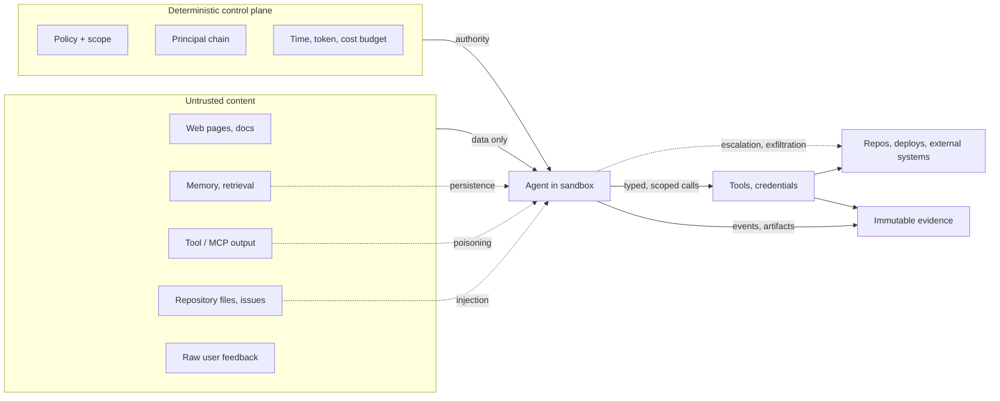
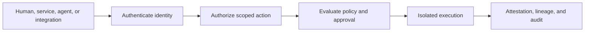
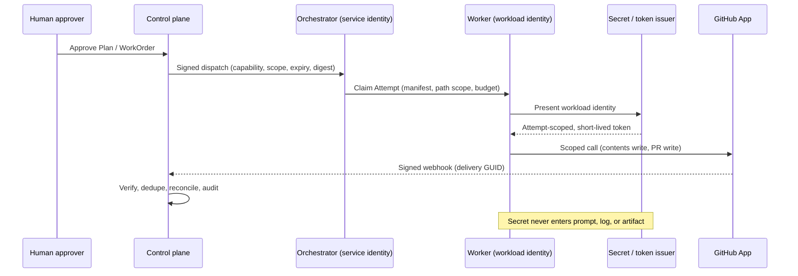
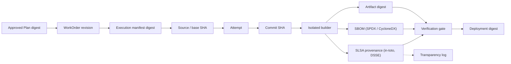

# 26. Security: identity, secrets, threats, and supply chain

An AI Software Factory connects human intent to code, credentials, repositories, tools, models, and delivery systems, and it puts a probabilistic interpreter in the middle that reads whatever it is shown and acts on what it reads. This chapter is about keeping that arrangement safe: who may act, with what authority, on which data, inside what isolation, leaving what evidence. It covers identity and delegation, secrets and privacy, the agent-specific threat model, and the software supply chain that proves what was built. After reading it you should be able to name the principals in your factory, explain why prompt injection is an authority problem rather than a text problem, and say what a signed attestation proves and what it does not.

## The problem

A confused identity boundary can let a browser pretend to be an agent, a service inherit human authority, or a repository credential become general permission to change software. The security goal is not to make agents trusted. It is to ensure that every action has an authenticated principal, explicitly scoped authority, isolated execution, bounded data access, and immutable evidence.

That is harder than it sounds because the factory has many principals with different lifecycles and risk: humans, orchestration services, executor workers, agent instances, GitHub Apps, webhooks, schedulers, and external tools. A human session is interactive; a service runs overnight; an installation token belongs to one provider boundary; an agent version describes behavior but is not itself a credential. Agent work too often inherits broad developer credentials or shared service tokens, and an audit trail that identifies only "the agent" cannot establish accountability.

Then there is content. An agent reads code, issues, documentation, tool output, logs, websites, and messages, any of which may contain adversarial instructions, and it may then use credentials and tools across several steps. Natural-language channels mix intent, data, and control. Tool descriptions and schemas influence model behavior. Retrieved context and memory cross trust zones. Agents delegate to other agents, execute generated code, and can combine individually permitted actions into an unsafe sequence. Traditional input validation does not fully address an interpreter that treats data as possible instruction and adapts its plan after every observation; deny-list defenses are brittle against probabilistic reasoning.

Then there is the supply chain. Passing tests does not establish what was built, from which source, by which identity, with which dependencies, or whether the artifact later changed. An autonomous factory expands that chain: models, prompts, tools, MCP servers, runners, base images, package registries, CI systems, and publication credentials all become substitution or tampering points. Names and mutable tags are weak identities; logs are easy to lose or rewrite; a signature proves a key signed bytes, not that the signer was authorized or the build isolated; an SBOM inventories components without proving those components produced the shipped binary.

And there is data. Logs, prompts, context packages, model providers, artifacts, and evaluations copy sensitive information into systems with different retention and residency. Generated code may incorporate untracked licensed material. Legal obligations depend on purpose, jurisdiction, customer agreement, and information class.

Jay's security thesis compresses the whole response into one sentence:

> An agent should receive the minimum context, tools, permissions, time, and budget required for the task, and every consequential action should produce evidence.

## How it works

### The threat model

Start with what must be protected: source, secrets, customer data, credentials, artifacts, evidence, policy, registry entries, memory, and human attention. Then mark the trust boundaries the agent crosses: user input, repository content, retrieved knowledge, MCP servers, agent peers, models, sandboxes, the control plane, and external systems.

Security design starts with the threat model, not with a control catalog, because a control that does not map to a threat is either decoration or friction. The threats a factory must prepare for, merging Jay's list with the agentic abuse cases:

- **Prompt injection** and **goal hijacking**: instruction hijacking through direct or indirect injected text, up to and including replacing the task's objective with the attacker's while the agent still believes it is doing the assigned work.
- **Malicious repository content** and **poisoned context**: files, issues, documentation, or retrieved knowledge crafted to steer the agent.
- **Data and secret exfiltration**: credentials or sensitive data leaving through prompts, logs, outputs, artifacts, encoded channels, or side channels.
- **Tool abuse** and **MCP tool poisoning**: a legitimate tool driven to an illegitimate end; malicious tool descriptions, schema manipulation, or poisoned tool output.
- **Privilege escalation** and **privilege abuse**: identity, credential, or tenant-boundary abuse, and the misuse of a grant the agent legitimately holds for an action the grant was never meant to cover; **excessive agency**, where the agent has been given more authority, tools, or autonomy than the task requires, so a mistake or a hijack has more to reach; and unsafe action composition.
- **Unauthorized file changes** and **cross-repository access**: edits outside the WorkOrder's path scope, including to tests, CI, or policy; reads or writes to repositories the task was never scoped to.
- **Unsafe code execution** and **sandbox escape**: generated or retrieved code run without containment; unexpected execution reaching the host or network.
- **Human-approval bypass**: approval deception, evaluator manipulation, or evidence tampering that makes a gate look satisfied.
- **Supply-chain compromise**: of agents, skills, prompts, models, packages, tools, builders, or registries.
- **Cross-organization data leakage**: context, memory, or retrieval crossing tenant or product-line boundaries.
- **Runaway loops and token spending**: denial of service, denial of wallet, and retry amplification.
- **Inter-agent impersonation** and misplaced **inter-agent trust**: delegation confusion and authority laundering between peers, and the assumption that a message from another agent carries that agent's authority when it carries only its content.
- **Memory poisoning** and retrieval poisoning: an attack that persists in durable memory beyond the run that introduced it.

<!-- infographic: threat-model -->
> **Infographic — Trust boundaries and threats.** *(Jay's graphic goes here.)* Until then, the diagram below carries the same concept.



Prompt injection is not merely a text-filtering problem. It is an authority-confusion problem whose impact depends on the tools, identity, memory, and control system surrounding the model. The variant that matters most in a factory is **indirect prompt injection**: adversarial instructions embedded in content the agent retrieves or observes (a README, an issue comment, a web page, a tool result) rather than supplied as the direct user request. Untrusted content cannot grant authority or alter policy, however imperative its phrasing, and the runtime is what enforces that.

### Controls that live outside the model

The threat model shares one assumption across every entry: the model will sometimes be wrong, and what it reads will sometimes be hostile. The design response is to place every control that matters where the model cannot reach it. Enforced outside the model, per run:

| Control | What it guarantees |
| --- | --- |
| Workload identity per run | Every action is attributable to one Attempt, not to "the agent" |
| Least-privilege tools | The tool profile grants only the capabilities this task needs |
| Scoped repository and resource access | The run can touch these repositories, paths, and resources and no others |
| Isolated execution environment | Mistakes and escapes are contained |
| Short-lived credentials | A leaked token is worthless minutes later |
| Controlled network egress | Exfiltration has nowhere to go |
| Typed, validated tool calls | Arguments are checked before any effect |
| Retrieved content treated as untrusted | Data cannot become instruction |
| Policy gates | Consequential actions are authorized deterministically |
| Evidence and audit | Every consequential action leaves a record |
| Risk-based human authority | Blast radius, not confidence, decides when a person must approve |

None of these depends on the model behaving well. That is the point. A model reasons probabilistically, and a reasoning process that is right most of the time is still the wrong place to put an authorization decision. *Probabilistic reasoning should never imply probabilistic authorization.* The model may want to run a command, open a file, or call an API; whether that happens is decided by identity, scope, and policy in a system that does not reason at all. *The model proposes. Policy authorizes.*

Security, in other words, cannot be a review that happens after the work is done. By then the run has already had whatever access it had. *Security can't be an approval meeting at the end; it's part of the execution contract.*

### Authenticate the principal, authorize the action, attest the execution

Three questions, answered by three different mechanisms. **Authentication** proves who or what is calling. **Authorization** proves the principal may perform a bounded action. **Attestation** proves which software, configuration, context, and environment actually performed it.



Keep the principal types separate. A **human identity** owns accountable decisions. A **service identity** performs named machine capabilities. An **agent identity** links behavior, version, and provenance. An **executor identity** owns one runtime process or claim. A **provider identity**, such as a GitHub App installation, crosses one external trust boundary. Do not create fake human users for automation, and do not reuse one omnipotent "system" role. Delegation should preserve the human or policy authority that initiated it without giving the delegate every right of the delegator.

Think of a hospital: the attending physician signs the order, the nurse administers it under that order, the pharmacy dispenses against it, and each badge opens only the doors that role needs. Nobody borrows the physician's badge to save time, and the chart records who did what under whose authority.

### Least privilege in several dimensions

Scope authority by company, workspace, repository, environment, resource, action, path, tool, time, budget, and Attempt. Credentials should be short-lived and minted only after policy and readiness checks pass. A provider grant stronger than required is a readiness failure, not a convenience: excessive GitHub permission should block the repository from being used at all.

The mechanism is **workload identity**: the running worker receives a cryptographically verifiable identity of its own (SPIFFE is the reference model) and exchanges it for attempt-scoped credentials to exact resources and operations. Separate read, modify, publish, merge, deploy, approve, and administer permissions. Tokens expire, cannot be reused across tenants, and are revoked on cancellation or quarantine. Identity is not authority; the credential is the authority, and it is narrow and brief.

Every action is then bound to an **identity chain**: the accountable human or system owner, the authorized WorkOrder, the orchestration service, the worker's workload identity, the agent and capability versions, the tool credential, and any external actor. The useful audit question is not "which agent did this?" It is "which accountable chain delegated which exact authority to which workload, using which credential, for which subject and purpose?"

<!-- infographic: identity-and-secrets-flow -->
> **Infographic — Identity chain and secret delivery.** *(Jay's graphic goes here.)* Until then, the diagram below carries the same concept.



### Content is not authority

Repository files, issues, web pages, MCP resources, tool results, logs, and memory are data. They cannot grant permission, alter the WorkOrder, disable policy, or approve a side effect. The deterministic control plane calculates authorized actions from identity, scope, policy, and current state; the model proposes, the control plane decides.

The runtime should label external content as data, constrain its size and format, strip active content where possible, scan it for secrets, and prevent it from changing system instructions or tool policy. Tool responses are validated before they enter context or authoritative state.

### Prompt injection is contained, not solved

No prompt wording solves injection. The working assumption is that anything the agent retrieves — tickets, documentation, source code, comments, web pages — may be hostile, and the design goal is to make a successful injection cheap rather than to make injection impossible. That follows from one rule: **content cannot grant authority.** A malicious document can influence what the model *wants* to do. It cannot expand the tool permissions, the repository scope, the credentials, the identity, or the network access of the run, because none of those live inside the model where the document can reach them.

Four practices make the rule hold in practice. Separate instructions from retrieved data, so the model can tell which channel it is reading from and the runtime can enforce precedence. Annotate provenance on every piece of content so its trust level travels with it. Constrain the tools a run may call to what its task needs. Validate high-risk actions deterministically before they execute, regardless of how confident the model sounds about them.

The measure of success is what an injection costs the organization. In a factory built this way, an injected instruction that the model follows produces a failed or wasted run — the agent tried to do something out of scope, the runtime refused, the Attempt is marked and the evidence retained. It does not produce a security incident, because the agent never held the authority to cause one. *The agent's permissions should never expand because of something it reads.*

The trust level of an input should decide the isolation level of what runs on it. The HumanLayer and BAML teams describe the reasoning plainly in their software-factory discussion: raw feedback from a user is completely untrustworthy, so it is never executed; their own prompts turn that feedback into a reproduction case, and the reproduction is something they trust, so it can run directly on their machines without a hardened container. Whether you accept that specific choice or not, the method is right. Ask where the bytes came from, what transformed them, and who vouches for the transformation, and set the sandbox accordingly. [Chapter 14](../03-build/14-development-environments-sandboxes-and-compute.md) covers the isolation options; [Chapter 32](../06-improve/32-production-feedback-review-and-the-agentic-merge-queue.md) covers the feedback-to-repro pipeline.

### Constrain tools at execution time

Tools are privilege boundaries. Use typed schemas, allowlists, resource scoping, short-lived credentials, network policy, filesystem isolation, output validation, side-effect classification, confirmation for material actions, and independent event capture. A tool that can do anything is a credential that can do anything, whatever the prompt says.

Around the model's decisions, add defense in depth: content provenance, trust labeling, context segmentation, instruction precedence, least privilege, sandboxing, policy checks, budgets, anomaly detection, independent verification, and human authority. A model-based guardrail may add signal; it is never the sole enforcement boundary.

MCP servers, and SaaS-vendor MCP servers in particular, should never be reached directly from a run: route all of them, internal and external, through one **MCP gateway** that performs authentication and applies policy centrally, so that a vendor's server is a governed capability with a credential the platform issued rather than a connection the agent negotiated; [Chapter 15](../03-build/15-agent-architecture.md) covers the gateway and the shell-and-code-mode access pattern that sits on top of it.

Memory changes incident scope. An injected instruction that lands in durable memory or a retrieval index persists beyond the run that introduced it and can affect every future run that reads it. Memory writes need the same provenance labeling as any other content, and quarantine must be able to reach them. [Chapter 16](../03-build/16-data-knowledge-semantic-and-context-engineering.md) covers the knowledge side.

### The execution environment is a security boundary

Where a run executes matters as much as what it may call. Each run gets a bounded, reproducible environment whose properties are frozen in the execution manifest before the worker starts:

| Field | What it fixes |
| --- | --- |
| Repository revision | The exact commit the run operates on |
| Approved tools | The tool set admitted for this run |
| Scoped credentials | Attempt-scoped tokens naming exact resources |
| Filesystem boundaries | Which paths may be read and which written |
| Network policy | Which egress, if any, is allowed |
| Dependencies | Pinned versions the run may install or use |
| Resource limits | CPU, memory, disk, and concurrency caps |
| Timeouts | When the run is stopped regardless of progress |
| Auditing | What is recorded and where it goes |

The environment does four jobs at once. Isolation is the security job. Reproducibility is what lets a verifier or an investigator rerun what happened. Containment limits what a mistake can reach. Consistency with downstream delivery means the run's environment matches the one the change will be built and deployed in, so "works in the sandbox" is evidence rather than folklore. The discipline is to treat autonomous execution like running untrusted code, because that is what it is: no ambient laptop access, no inherited developer credentials, no reaching whatever the host can reach.

The environment also has to be fast. If provisioning takes long enough that the safe path feels bureaucratic, people route around it, and the unsafe path becomes the real one. *Fast prototyping and strong guardrails aren't opposites if the guardrails are built into the environment.* More autonomy should mean narrower execution boundaries, not broader ambient access. [Chapter 14](../03-build/14-development-environments-sandboxes-and-compute.md) covers the mechanics.

### Data classification is frozen into the contract

Not all data a run touches carries the same consequence, and the run should know which kind it is holding before it starts. Classify at four levels — **PUBLIC**, **INTERNAL**, **CONFIDENTIAL**, **RESTRICTED** — and freeze the classification of the run's inputs and permitted outputs into the execution contract alongside its repository scope, capability set, policy, and budget. The classification then governs which models are eligible (a provider approved for INTERNAL data may not see CONFIDENTIAL), which retrieval sources may be assembled into context, where logs and artifacts may be stored, and what egress is allowed. A run bound to RESTRICTED data does not get to discover, halfway through, that a convenient tool would send that data somewhere else; the binding was decided before the model reasoned about anything. Model eligibility by data class is one input to routing in [Chapter 17](../03-build/17-models-routing-and-capability-selection.md). Classification bounds a run at the level of a data class; inside that bound, retrieval still enforces **per-document access control**, filtering each artifact by the requester's permission before ranking rather than after generation, as [Chapter 16](../03-build/16-data-knowledge-semantic-and-context-engineering.md) specifies.

### Secrets stay out of context and evidence

Secrets enter only the process that needs them, for the shortest useful time, through controlled channels directly to the tool or process. They must not appear in prompts unless unavoidable, nor in structured events, artifacts, screenshots, error messages, diffs, model output, memory, or audit payloads. Audit records the secret's identity or version, never its value. Scan and redact as a second line, but rely first on an architecture that keeps the secret from ever being where the model can see it.

### Revocation, compromise, and denials

Disabling a human, service, agent version, MCP server, repository installation, or policy must stop new authority promptly. Active executions need explicit revocation semantics: cancel, quarantine, rotate credentials, reconcile effects, and retain the incident trail.

Audit denials as well as successes. A denial can reveal an attack, drift, misconfiguration, or a healthy control doing its job. Each audit record carries principal, capability, scope, decision, policy version, time, reason, and correlation identity, without retaining sensitive payloads.

### The supply chain: bind every claim to immutable subjects

Evidence must identify source and artifacts by cryptographic digest. Names locate an object; digests establish which bytes a claim concerns. The minimum lineage runs the length of the factory:

`approved Plan digest -> WorkOrder revision -> execution manifest digest -> source/base SHA -> Attempt -> commit SHA -> build artifact digest -> deployment digest`

Four words that are often used interchangeably mean different things. **Provenance** describes how an artifact was produced: builder, inputs, invocation, environment, outputs. **Attestation** is a typed claim by an identified producer about one or more digest-bound subjects. **Signature** provides integrity and signer authentication for the attestation envelope. **Transparency** makes equivocation or deletion detectable by recording verifiable entries in a log. None is a quality verdict. A perfectly signed vulnerable build remains vulnerable. Provenance answers "how did these bytes come to exist?"; quality evidence answers "why are these bytes acceptable?"; both are required.

<!-- infographic: supply-chain-attestation -->
> **Infographic — Lineage from Plan to deployed digest.** *(Jay's graphic goes here.)* Until then, the diagram below carries the same concept.



Adopt interoperable envelopes rather than inventing formats. SLSA 1.2 defines build provenance and graduated build and source assurance; its build track progresses from available provenance, to signed hosted builds, to hardened isolated builds. The in-toto Statement v1 supplies a common `subject` plus `predicateType` envelope. DSSE signs typed payloads without requiring JSON canonicalization. Store a normalized evidence envelope while preserving the original attestation bytes and media type, so policy is not coupled to one vendor or schema version:

```yaml
evidence_envelope:
  subject:
    name: ghcr.io/example/service
    digest: {sha256: "..."}
  predicate_type: https://slsa.dev/provenance/v1
  producer:
    identity: github-actions://example/service/.github/workflows/build.yml@refs/heads/main
  source_digest: "..."
  work_order_revision: WO-42-R2
  issued_at: "..."
  storage_ref: "..."
  verification:
    signature_status: VERIFIED
    identity_policy: SATISFIED
    transparency_status: VERIFIED
```

Generate an **SBOM** for each releasable artifact, not once per repository. Include direct and transitive components, versions, package URLs, hashes, dependency relationships, licenses, and creation metadata. SPDX 3.0 and CycloneDX 1.7 are the current interoperable choices; select one canonical organizational format but ingest both. An SBOM becomes operational only when policy correlates it with vulnerability intelligence, approved licenses, package-source policy, end-of-life data, and exceptions. A changed dependency graph changes risk and may invalidate prior security evidence.

Harden the builder and the publication boundary: ephemeral isolated builders with minimal permissions, pinned actions and dependencies, short-lived workload identities, protected source, hermetic or controlled inputs, secret redaction, and separate build and release authority. Sign by digest, verify before promotion, and record the expected signer identity and workflow rather than accepting "any valid signature." SLSA's central lesson is that provenance strength depends on the build platform's resistance to producer-controlled falsification. Asking the same mutable worker to generate and vouch for its own history is weak assurance.

For agent-produced work, provenance should also record the executor configuration, model and provider identifier, tool and MCP server versions, policy bundle, context sources, and prompt or instruction digest where retention policy permits. Prompts, tools, and models are dependencies. Do not store secrets or unrestricted prompt content in public attestations; the goal is reproducibility and accountability, not disclosure of sensitive reasoning.

### Skills are supply chain

The sentence "prompts, tools, and models are dependencies" has a corollary that organizations discover late: a skill is a dependency with the same threat profile as a package, plus one property packages do not have. A package runs code; a skill is instructions the agent will follow. That makes a skill the ideal carrier for the indirect prompt injection described above. A public skill can contain a **prompt-injection payload** (instructions that redirect the agent's task) or **exfiltration instructions** (send the contents of this file to that endpoint, include the token in the commit message), and because the agent loads the skill on the grounds that it is relevant, the payload arrives already trusted. First-party skills are not exempt: an internal author can leak a credential into a skill by mistake, or an insider can plant a payload in a skill the whole organization installs. The skill registry of [Chapter 10](../03-build/10-the-agent-factory.md) is therefore a supply-chain boundary, and the controls are the ones this chapter applies to any other dependency, with one addition.

The addition is a **security review of the skill's content**, run before install for third-party skills and at import for first-party ones, producing a severity: LOW, MEDIUM, HIGH, or CRITICAL. The scan looks for instruction patterns that attempt to change the agent's objective, reach credentials or secrets, encode data into outputs, or call destinations outside the task. It is a vulnerability scan for instructions, and like every scan in this chapter it produces a finding, not a verdict; the same review runs on demand in CI with a fail-on level so a skill cannot be merged into a repository above the threshold.

The severity feeds an **install policy**, which is the default-deny stance of this chapter applied to skills. Policy is set at three levels, **project**, **workspace**, and **organization**, and where they disagree the tightest wins, so a team can be stricter than its organization but never looser. Three rule types cover what matters:

| Rule type | What it sets |
| --- | --- |
| Security threshold | A **warn** level (install proceeds only with explicit acceptance) and a **block** level (install is refused, no override) |
| Source restriction | Which registries and which Git sources are allowed, as an allowlist such as the organization's own Git host namespace |
| Minimum release age | How many days a Git-sourced version must have existed before it may be installed, so a freshly pushed payload has time to be noticed |

The install flow follows from the thresholds. Below the warn level, install is silent. At the warn level, install stops for a confirmation the installer must give deliberately. At the block level, install is refused and no flag overrides it. Every install attempt, permitted or refused, is logged against the policy that decided it, which is the same audit-the-denials rule from earlier in this chapter, and the headline label on a skill (passed, advisory, risky, critical) is the operator-facing summary of the scan. Tessl's public documentation describes one implementation of this policy stack; the shape is the one any package ecosystem eventually converges on.

Two ties to the rest of the chapter. First, the install audit plus the skill inventory of Chapter 10 is the attestation story for skills: what is installed, from where, at what version, under which policy decision. Without it a skill is a mutable tag, and this chapter has already said what mutable tags are worth. Second, the scan reduces the chance that a payload is loaded; it does not remove the need for the controls that make a loaded payload harmless. A skill that tells the agent to exfiltrate a token still fails against attempt-scoped credentials, egress policy, and secrets that never enter context. The scan is the outer wall; the execution contract is the one that holds.

### Privacy, information lifecycle, and compliance

Classify source, prompts, context, telemetry, artifacts, evidence, memory, and backups. For each class define allowed purpose, provider, region, encryption, access, retention, deletion, legal hold, and incident handling. Deletion workflows must reach derived indexes and backups while preserving required audit evidence lawfully. Personal data needs one more control on the way in: **PII redaction** at the boundary where content enters prompts, context packages, traces, and evaluation sets, so that a customer's identifiers are replaced or tokenised before a model, a log, or a golden set ever holds them, with the same second-line scanning on outputs that secrets receive.

Track intellectual-property and license provenance for dependencies, training or reference material where applicable, generated artifacts, copied snippets, and capability packages. Policy decides acceptable licenses and attribution; similarity or provenance concerns create review, not automatic acceptance.

Policy-as-code enforces repeatable rules, but control ownership, rationale, exceptions, sampling, and audit artifacts remain explicit. Compliance frameworks are mappings over operating controls; they do not replace the threat model.

### The agentic security architecture, in seven layers

The controls above are the guide's own; here is the same ground drawn the way a security organisation draws it, so a CISO and a platform lead can point at the same picture. Seven layers, read top to bottom from "who is this" to "what did we see", with five flows running through them and eight principles underneath. Every row names the chapter or section that owns it in this book; where the factory adds something the security map does not have, the last column says so.

<!-- infographic: agentic-security-architecture -->
> **Infographic — Agentic AI security architecture: secure identities, trusted agents, intelligent actions.** *(Jay's graphic goes here.)* Until then, the table below carries the same concept.

| Layer | What it contains | In this guide |
| --- | --- | --- |
| **1 · Agent and workload identity** | Workload identity for every agent (SPIFFE, OIDC, mTLS; short-lived credentials); agent registration and onboarding (verify, profile, classify risk); identity governance and lifecycle (ownership, attestation, expiry, decommission); credential issuance (certificate authority, token service, JWKS); secrets management (vault, rotation, HSM, envelope encryption) | "Authenticate the principal" above; Agent Definition and Factory Version give every agent a versioned identity ([Chapter 10](../03-build/10-the-agent-factory.md)); decommission is capability deprecation |
| **2 · Security policy and access control** | Policy engine (OPA, Cedar, XACML) with centralised evaluation; authorisation models (RBAC, ABAC, ReBAC) that are purpose-based and context-aware; just-in-time access and delegation (time-bound, scope-bound, approval workflows); risk-based adaptive access; separation of duties and constraints; a policy store of versioned policies-as-code with audit | "Authorize the action" above; policy as code and risk tiers ([Chapter 7](../02-design/07-governance-policy-and-risk-proportional-approval.md)); the factory's addition is that authority is resolved *before* execution and frozen into the manifest, so JIT access is granted to an Attempt, not to an agent in general |
| **3 · Agent security control plane (runtime protection)** | Orchestrator protection (secure orchestration, sandboxing, isolation); prompt security (injection detection, filtering, content safety); tool and MCP security (allowlisting, gateway, input validation); data access protection (classification, DLP, row- and field-level access control); model security (allowlisting, output validation, risk guardrails); memory security (secure memory, PII masking, secure context handling); execution guardrails (action constraints, rate limits, budgets, human-in-the-loop) | "Constrain tools at execution time", "Prompt injection is contained, not solved", "The execution environment is a security boundary", "Data classification is frozen into the contract"; the tool gateway ([Chapter 15](../03-build/15-agent-architecture.md)); memory admission ([Chapter 16](../03-build/16-data-knowledge-semantic-and-context-engineering.md)) |
| **4 · Threat prevention and detection** | Threat intelligence (feeds, indicators, AI-specific TTPs); behaviour analytics — UEBA for agents (anomaly detection, baseline modelling); intent-anomaly detection (unknown objectives, goal drift); privilege-escalation detection (unusual access, lateral movement by agents); data-exfiltration detection (sensitive data access and transfer monitoring); LLM and AI attack detection (jailbreaks, model abuse, prompt leakage, toxicity); deception and honey resources (honeypots, honey tools, canary data) | "The threat model" and "The threat table"; the four kinds of health, with control health as the detection surface ([Chapter 28](../05-operate/28-observability-telemetry-and-forensics.md)); the factory's addition is that goal drift is detectable because the approved Plan revision is a record the run can be compared against |
| **5 · Response and containment** | Automated response (playbooks, SOAR integrations); agent kill switch (disable, quarantine an agent or session); access revocation (revoke tokens, rotate secrets, invalidate sessions); containment (isolate runtime, block tools, restrict network); rollback and recovery (undo actions, data rewind, restore state); forensics and evidence (collect artefacts, logs, memory, prompts, actions); post-incident analysis (root cause, impact, lessons learned) | "Revocation, compromise, and denials" and "Compromise playbook"; emergency control and the incident lifecycle ([Chapter 29](../05-operate/29-resilience-incidents-and-the-control-tower.md)); rollback is a first-class state of delivery ([Chapter 25](./25-cicd-progressive-delivery-and-production-verification.md)); forensic bundles ([Chapter 28](../05-operate/28-observability-telemetry-and-forensics.md)) |
| **6 · Infrastructure and data security foundation** | Network security (microsegmentation, firewalls, ZTNA); cloud security (CSPM, CWPP, workload protection); endpoint security (EDR, device posture, hardening); data security (encryption, tokenisation, key management); application security (SAST, DAST, SCA, API security); vulnerability management (scan, prioritise, remediate); backup and resilience (immutable backup, DR, business continuity) | Environment and compute contracts ([Chapter 14](../03-build/14-development-environments-sandboxes-and-compute.md)); the supply chain section above; disaster recovery and SLOs ([Chapter 29](../05-operate/29-resilience-incidents-and-the-control-tower.md)); the factory inherits this layer from the enterprise rather than rebuilding it |
| **7 · Visibility, telemetry, and analytics** | Real-time security dashboards (posture score, agents at risk, high-risk events, active sessions, events by severity); the agent activity timeline (login, task start, tool call, data access, approval, task end); identity and access insights (human, agent, service, external); a risk heatmap by asset and agent; top security alerts with severity and source; an agent trust score and its trend; telemetry sources (agent logs, API gateway, MCP server logs, cloud logs, identity events, network, endpoint, application, vulnerability feeds, threat-intel feeds, DLP, user behaviour, model telemetry); measures that matter — mean time to detect, mean time to respond, false-positive reduction, policy-violation trend, agent health | The correlation spine and the four kinds of health ([Chapter 28](../05-operate/28-observability-telemetry-and-forensics.md)); the exception-first Command Center ([Chapter 8](../02-design/08-economics-metrics-and-human-attention.md), [Chapter 34](../06-improve/34-mission-control-as-a-living-case-study.md)); the factory's addition is that an agent trust score is *diagnostic* — it can trigger demotion, never promotion, because promotion requires evidence ([Chapter 33](../06-improve/33-governed-learning-and-compounding-engineering.md)) |

**Five flows cross the layers**, and each has a different owner and a different failure: the *identity flow* (who is acting, established in layer 1 and carried everywhere); the *authorisation flow* (may this principal do this action now, decided in layer 2 and enforced in layer 3); the *data and access flow* (what may be read, written, or moved, classified in layer 3 and protected in layer 6); the *telemetry flow* (what happened, emitted by every layer into layer 7); and the *response flow* (what to do about it, from layer 7's alert back through layer 5's containment). An architecture review that cannot trace all five for one agent action is not finished.

**Eight principles underneath, and the six that make it zero trust.** Zero trust — always verify; least privilege and just-in-time; secure by design and by default; continuous validation; detect, respond, and recover; privacy and data protection; accountability and non-repudiation; human oversight where it matters. The zero-trust foundation restated for agents: verify explicitly, never trust implicitly; least privilege, minimal access; assume breach, verify continuously; encrypt everything end to end; monitor continuously, everywhere; automate security to reduce human error. Every one of these is already a rule elsewhere in this chapter; the value of the list is that it is the one a security organisation will recognise.

**What the security map leaves out.** Three things this guide insists on that a layer diagram cannot show. First, *the evidence boundary*: none of the seven layers proves that a change is safe to ship; they prove that it was made by an authorised identity inside policy. Verification is a separate plane ([Chapter 21](./21-quality-and-evidence-architecture.md)). Second, *the authority record*: layer 2 decides an action; the factory also records who approved the Plan the action serves, so that a compromised agent acting inside its permissions is still detectable as off-plan. Third, *the kill switch is not the recovery*: disabling an agent stops the bleeding; recovery means a new Attempt from a known-good checkpoint under a new lease, with the failed Attempt's history kept immutable ([Chapter 12](../03-build/12-durable-execution.md)).

### Test adversarially and retain forensics

Evaluation suites should include malicious repositories, poisoned documentation, deceptive tool output, encoded exfiltration, chained low-risk actions, cross-tenant requests, compromised peers, and evaluator attacks. Preserve prompts (subject to privacy policy), tool events, identities, decisions, artifacts, and containment actions. Runtime policy should detect suspicious action sequences, quarantine affected memory or capabilities, revoke credentials, stop new admission, and create a forensic evidence bundle. Restoring a quarantined capability requires proof that the poisoned source and its persistence path were removed, not just that the symptom stopped.

## How to build it

### Identity and delegation

1. Enumerate principals: human, service, agent, executor, provider. Give each its own credential class and lifecycle.
2. Bind humans to exact subject identifiers from the identity provider, never email addresses.
3. Sign service commands with a distinct secret; include service identity, named capability, workspace, repository, command ID, short expiry, and payload digest. Retain accepted, denied, failed, and replayed command receipts.
4. Use provider Apps with exact least-privilege grants; treat missing, excessive, stale, or revoked authority as a readiness failure.
5. Verify webhook signatures against the raw body and deduplicate by delivery GUID.
6. Record the full identity chain on every Attempt, plus credential class, policy snapshot, sandbox attestation, tool and MCP grants, network policy, and secret-version references.

### Credential flow

1. Issue a workload identity to each worker.
2. Exchange it, after policy and readiness checks, for attempt-scoped tokens naming exact resources and operations.
3. Separate read, modify, publish, merge, deploy, approve, and administer.
4. Expire quickly; forbid cross-tenant reuse; revoke on cancellation or quarantine.

### Content and tool handling

- Label every external input with its source and trust level; keep it out of the instruction channel.
- Constrain size and format; strip active content; scan for secrets.
- Give each WorkOrder a tool profile: typed schemas, allowlists, resource scope, side-effect class, confirmation rules.
- Validate tool output before it enters context or state.
- Apply provenance labels to memory writes; make quarantine reach memory and retrieval.
- Set time, token, and cost budgets per Attempt with kill switches.

### The threat table

For each threat below, record the preventive, detective, containment, and recovery control, and whether each is implemented, partial, or missing:

| Threat | Primary preventive control | Primary detective control |
| --- | --- | --- |
| Prompt injection | Content labeling, instruction precedence, scoped tools | Anomalous action sequences, denied calls |
| Malicious repository content | Path scope, sandbox, no execution of untrusted content | Diff outside scope, unexpected commands |
| Secret exfiltration | Secrets bypass context; egress policy | Secret scanning of outputs, events, artifacts |
| MCP tool poisoning | Pinned, certified servers; schema validation | Tool description drift, output validation failures |
| Privilege escalation | Attempt-scoped tokens, separated permissions | Denied authorization audit |
| Unauthorized file changes | Path scope, protected assurance files | Diff review against manifest |
| Sandbox escape | Isolation proportional to input trust | Host and network anomaly signals |
| Human-approval bypass | Verifier cannot accept; fail-closed gates | Evidence lineage mismatch |
| Supply-chain compromise | Digest binding, verified provenance, SBOM policy | Failed verification at consumption |
| Cross-org data leakage | Tenant-bound credentials and retrieval | Cross-tenant request audit |
| Runaway loops / spending | Budgets, stop conditions, kill switches | Cost and retry anomaly alerts |
| Inter-agent impersonation | Per-agent identity, no authority laundering | Delegation chain validation |
| Memory poisoning | Provenance on writes | Retrieval source audit |

### Supply-chain verification at the consumption boundary

Before release, verify, in order:

1. the subject digest equals the candidate artifact;
2. attestation and predicate types are allowed and version-supported;
3. signature chain, timestamp, and transparency proof are valid;
4. signer or workload identity matches policy;
5. builder and source repository are authorized;
6. source, Plan, WorkOrder, and execution-manifest lineage match;
7. required SBOM and scan results concern the same digest; and
8. attestations are current, not revoked, and free of conflicting claims.

Order of adoption: source, commit, and build digest lineage plus one signed build attestation first; SBOM and dependency governance second; provenance as a release-blocking gate only after both are proven.

### Information governance

Build a data-flow and retention inventory covering source, prompts, context, telemetry, artifacts, evidence, memory, and backups. Attach purpose, provider, region, encryption, access, retention, deletion, legal hold, and incident handling to each class. Implement deletion that reaches derived indexes and backups. Map compliance frameworks onto these controls, with owners and exceptions named.

### Compromise playbook

Use the incident frame from [Chapter 29](../05-operate/29-resilience-incidents-and-the-control-tower.md): clarify affected builders and impact; contain by stopping unsafe execution; observe by preserving traces, events, tool calls, and evidence; isolate which layer failed (intent, context, model, tool, state, policy, evaluation); restore a known-safe version; correct the defect; prevent with regression evaluation and controls; measure whether the fix holds. Promotion of any security control requires negative tests and runtime evidence, not configuration documents alone.

## Failure modes

**Confused deputy.** A service with broad rights performs an action on behalf of a caller who lacked them. Prevent it by carrying the originating authority through delegation and scoping the delegate's credential to the caller's scope.

**Token replay and webhook forgery.** A captured command or callback is resubmitted. Short expiry, payload digests, command IDs, raw-body signature checks, and delivery deduplication close it; the replay receipt is the detection.

**Stale worker completion.** A worker whose lease expired reports success for work already reassigned. The control plane must reject completion from a non-current lease holder.

**Authority laundering.** Agent A cannot do X, asks agent B, and B can. Every delegation carries the originating scope; peers do not inherit each other's rights.

**Denial of wallet.** A loop retries or fans out until the budget is gone. Budgets, stop conditions, and cost anomaly alerts are the controls; a factory without them has an unbounded liability.

**Sandbox as justification for broad credentials.** "It is isolated" is not a reason to hand it a deploy token. No sandbox justifies broad credentials.

**Over-isolation.** Strict isolation limits useful context and tool capability until agents cannot do the work. Risk-specific tool profiles and just-in-time elevation balance capability and blast radius.

**Shared credentials.** Setup is simple; attribution and revocation are impossible. Fine-grained credentials cost integration effort and are worth it.

**Signature without identity policy.** "Any valid signature" accepts an attacker's valid signature. Record and check the expected signer and workflow.

**Keyless identity dependence.** Keyless signing removes key management and adds dependence on identity providers and trust roots; plan for their outage and compromise.

**Transparency versus confidentiality; SBOM exposure.** Public logs and component lists can reveal what you would rather not. Apply stronger controls to consequential artifacts while keeping digest binding universal.

**Long retention.** Full traces improve forensics and increase privacy exposure. Redact, encrypt, restrict, and retain by policy; minimize by default.

**Self-hosting as safety.** Self-hosting improves control and shifts security and reliability obligations to the operator.

**Policy-as-code without owners.** Rules run, but no one can explain the exception or produce the audit artifact. Control ownership stays explicit.

**Authorization inside the model.** The prompt tells the agent which actions are allowed and the runtime trusts it to comply. Detect it by asking what stops a disallowed tool call if the model decides to make one. Fix by moving identity, scope, and policy enforcement outside the model.

**Security as the last meeting.** The security review happens after the run, when the access has already been exercised. Detect it by runs whose scope, credentials, and data class were not fixed before dispatch. Fix by freezing them into the execution contract.

**Ambient access.** The worker runs on a developer machine or with inherited credentials because provisioning an isolated environment was slow. Detect it by comparing the run's actual reach with its manifest. Fix by making the isolated environment fast enough to be the default.

**Configuration documents mistaken for evidence.** A security design that exists on paper is not an enforced control. Promotion requires negative tests and runtime proof.

**The trusted skill.** A skill installed from a public source carries an injection or exfiltration payload, and the agent follows it because it loaded the skill as relevant. Detect it with a content security scan at install and import, and in the install audit. Fix with an install policy: severity thresholds that warn and block, a source allowlist, a minimum release age, and the execution controls that make a followed payload a wasted run rather than a breach.

**Install policy that loosens downward.** A project sets a weaker threshold than its organization and the weaker one wins. Detect it by comparing effective policy at each level. Fix by making the tightest level win.

## In Mission Control

Assessment pinned to `main` commit [`b31e275`](https://github.com/jaydubya818/MissionControl/tree/b31e27564deb1c03c167e61b5ee094567c2ba7b1) and local HEAD `a490648`, reviewed 2026-08-09 through 2026-08-30.

**Implemented.** Mission Control deliberately separates human, service, and GitHub identities; identity separation is its strongest security design choice. Human authentication uses Clerk tokens, while Convex tenant, operator, and role records remain the source of company authorization; exact Clerk subject IDs, not email addresses, bind humans to operators. Company and workspace operations use server-side permission checks and protect the last active owner. The orchestration server authenticates inbound HTTP with a bearer token and signs outbound Convex commands with a separate HMAC secret; signed envelopes bind service identity, named capability, workspace, repository, command ID, short expiry, and payload digest, and Convex retains accepted, denied, failed, and replayed command receipts. GitHub uses an App installation rather than personal access tokens; readiness requires exact least privilege (metadata read, contents write, pull requests write, checks read, and a defined webhook set), and missing, excessive, stale, or revoked authority blocks readiness. Webhook signatures are checked against the raw body, delivery GUIDs deduplicate effects, and installation tokens are ephemeral and not retained. Repository, base, and head SHA lineage, run artifacts, verification receipts, GitHub CI ingestion, and release and deployment records exist.

**Partial.** The production Clerk issuer is a non-routable placeholder at the studied commit, so Clerk rollout has documented controls but is not configured production evidence. Named service capabilities cover WorkOrder dispatch and receipt ingestion; broad task, artifact, handoff, and other service operations remain incomplete. The security matrix is candid that company administration and some factory paths are enforced while Mission, Task, approval, remaining evidence, orchestration, and release authorization still need the complete golden-path security slice. The missing GitHub App configuration was a real blocker in the retained lab. Attempt, execution-manifest, isolated-worktree, path-scope, and GitHub App publication work (`convex/factory/attempts.ts`, `apps/orchestration-server/src/githubAppRuntime.ts`) is staged but absent from local HEAD and is treated as an implementation candidate, not current capability.

**Future.** Mission Control does not yet demonstrate a canonical SLSA provenance pipeline, SBOM generation and policy, Sigstore or in-toto verification, signed Quality Proof Packages, or a transparency-backed evidence ledger. It does not yet present a complete agentic threat catalog, adversarial test corpus, memory-poisoning lifecycle, inter-agent trust model, denial-of-wallet controls, or exercised containment and forensic playbooks. It does not yet provide workload-identity federation, a just-in-time credential flow, a delegated authorization chain, a data inventory, a deletion workflow, residency policy, intellectual-property and license controls, or formal compliance mapping. The intended direction: a unified principal and delegation model across human, service, agent, executor, and integration identities; every Attempt retaining its principal chain, credential class, policy snapshot, sandbox attestation, tool and MCP grants, network policy, and secret-version references; a supply-chain verifier that ingests native attestations, normalizes subject and producer identity, evaluates policy, and attaches the decision to the exact WorkOrder and release candidate; and a production threat model exercised against prompt injection, repository poisoning, MCP supply chain, confused deputy, cross-tenant access, token replay, webhook forgery, stale worker completion, secret exfiltration, evidence tampering, and denial of wallet.

## Retain this

- Minimum context, tools, permissions, time, and budget for the task; evidence for every consequential action — the security thesis in one line.
- Identity is not authority. Authority is a short-lived, attempt-scoped credential minted after policy; content — repository text, tool output, web pages, memory — is data, never authority, and cannot grant permission or alter policy.
- Every control that matters lives outside the model: probabilistic reasoning should never imply probabilistic authorization, and the model proposes while policy authorizes. Security can't be an approval meeting at the end; it's part of the execution contract.
- The execution environment is a frozen security boundary — revision, tools, credentials, filesystem, network, dependencies, limits, timeouts, data classification — fixed before the worker starts. Autonomy means narrower boundaries, not broader ambient access.
- The trust level of an input decides the isolation level of what runs on it. Tools are privilege boundaries, and memory can persist an attack beyond the run that introduced it.
- Tags locate; digests identify. Provenance, attestation, signature, and transparency are different claims, and none is a quality verdict — verify at the consumption boundary against an expected signer and lineage.
- Seven security layers — identity, policy and access, runtime control plane, detection, response and containment, infrastructure foundation, visibility — crossed by five flows prove who acted inside what policy. Only independent verification proves the change is safe; a trust score can demote but never promote.

## Go deeper

**Related chapters.** [7. Governance, policy, and risk-proportional approval](../02-design/07-governance-policy-and-risk-proportional-approval.md) defines the policy the control plane evaluates. [11. Control plane, orchestrator, and execution plane](../03-build/11-control-plane-orchestrator-and-execution-plane.md) and [12. Durable execution](../03-build/12-durable-execution.md) explain leases, manifests, and claims. [14. Development environments, sandboxes, and compute](../03-build/14-development-environments-sandboxes-and-compute.md) covers isolation options. [15. Agent architecture](../03-build/15-agent-architecture.md) and [16. Data, knowledge, semantic, and context engineering](../03-build/16-data-knowledge-semantic-and-context-engineering.md) cover MCP, tools, context, and memory. [24. Quality contracts, proof packages, and certificates](./24-quality-contracts-proof-packages-and-certificates.md) uses the evidence envelope and signing model. [25. CI/CD, progressive delivery, and production verification](./25-cicd-progressive-delivery-and-production-verification.md) covers builder hardening in the delivery path. [29. Resilience, incidents, and the control tower](../05-operate/29-resilience-incidents-and-the-control-tower.md) owns the incident frame. Terms are in the [glossary](../appendix/glossary.md).

**Primary sources.** Jay's reliability-and-security preparation notes (threat list, security thesis, incident framework); HumanLayer and BAML, "Software factory design patterns" livestream (trusted versus untrusted execution of feedback and repros); OWASP Agentic Security Initiative; OWASP LLM01 Prompt Injection and LLM06 Excessive Agency; NIST AI Risk Management Framework; NIST SP 800-218 SSDF 1.1, especially provenance practice PS.3.2; NIST Privacy Framework; SLSA specification 1.2 and provenance v1; in-toto Attestation Framework, Statement v1, and DSSE; Sigstore Cosign verification guidance; SPDX 3.0; CycloneDX 1.7; SPIFFE overview and Workload API.

**Public sources.** Uber Engineering, *Running a Software Factory Efficiently at Uber Scale* (2026), for routing every internal and SaaS MCP server through one gateway with central authentication and policy; *Six layers of a working agentic system* (public post, 2026), for private model instances per tenant and identity, secrets, and audit as runtime obligations rather than afterthoughts; Tessl documentation (docs.tessl.io), 2026, for skill security severity scoring, install policy levels and rule types, the warn/block install flow, and install auditing.

**Mission Control sources at `b31e275`.** `docs/security/clerk-company-authorization.md`, `docs/security/human-service-authorization-matrix.md`, `docs/security/service-command-authentication.md`, `docs/security/github-app-connection.md`, `convex/lib/companyAccess.ts`, `apps/orchestration-server/src/auth.ts`, `convex/lib/githubAppAuth.ts`, `convex/factory/githubCi.ts`, `convex/schema.ts`; staged candidates `convex/factory/attempts.ts` and `apps/orchestration-server/src/githubAppRuntime.ts`.
