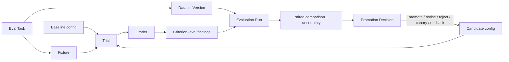
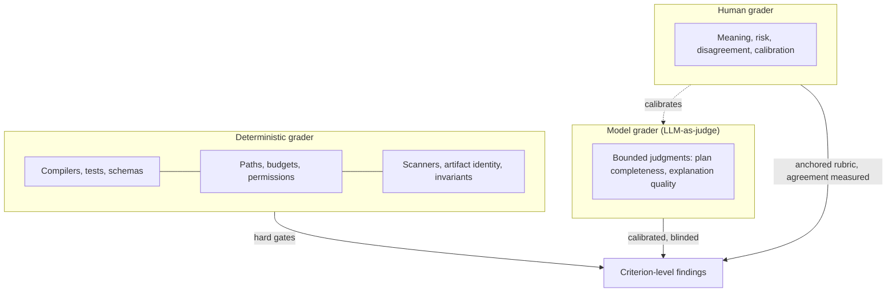

# 29. Evaluation engineering

Evaluation measures whether a complete agent configuration works across a representative population. This chapter defines the subject digest, governed datasets, grader roles, calibration, repeated trials, uncertainty, and the boundary between verification of one candidate and evaluation of the system that produced it.

## The problem

Agent behavior changes whenever the model, prompt, tools, harness, context, environment, repository, or evaluator changes. A handful of successful demos cannot tell you whether a configuration is reliable, whether the new version is an improvement, or whether the failure someone saw on Tuesday will happen again. Teams that lack an evaluation program make promotion decisions on anecdote — the last three runs looked good — and discover the regression from customers.

Teams that have an evaluation program face a subtler danger. Evaluations can produce precise-looking scores from unrepresentative tasks, contaminated examples, unstable graders, or too few trials. A team then optimizes prompts and models to the benchmark, the number goes up, and real completion rate, review burden, cost, and production safety quietly get worse. Worse still, the grader is itself a second probabilistic system. A model grader can be swayed by style, verbosity, model family, or the candidate's own explanation of why it was right. Human graders disagree with each other. A deterministic test can be precise while measuring the wrong requirement.

And the artifact is only half the story. A software agent produces an artifact and a trajectory. The artifact may be correct even though the agent used an unauthorized tool, blew its budget, or relied on stale context. A safe trajectory may end with no useful artifact because a provider or environment failed. Rerunning "the same prompt" does not reproduce the same system, so diagnosis needs something more careful than trying again. The people who feel all this are the AI engineers deciding whether to ship a new configuration, and the operators who inherit it if the decision was wrong.

## How it works

### Evaluation is not verification

The two words get used interchangeably and they should not be. **Verification** asks whether *this* candidate satisfies *this* criterion — the receipt-per-criterion work of Chapter 27. **Evaluation** asks whether a *configuration* behaves as expected across a *population* of representative cases, and how well the system performs as a whole. In the 12-layer production agent stack ([Chapter 25](../03-build/25-the-12-layer-production-ai-agent-stack.md)), **Evaluation Engineering** is defined as testing expected behavior across representative cases and measuring system-level performance, and it sits next to **Harness Engineering**, defined as capturing complete runs so failures can be reproduced, inspected, replayed, and compared. This chapter covers both, because you cannot evaluate what you cannot capture.

The clinical analogy is the cleanest. A lab test on one patient is verification: this sample, this assay, this result. A clinical trial is evaluation: does this treatment work across a representative population, compared with the current standard, with enough participants to be confident, and with its side effects measured? Nobody would approve a drug on one patient's bloodwork, and nobody should promote an agent configuration on one good run.

One rule is shared by both disciplines and is worth stating before any mechanism, because every mechanism in this chapter exists to honor it: **producer ≠ verifier**. The configuration that produced a candidate is never the only thing that grades it, whether the grading is verification of one artifact or evaluation of a population. [Chapter 27](./27-quality-and-evidence-architecture.md) makes the case for the single-candidate form; here it means that the evaluation harness, the graders, and the dataset are owned and versioned independently of the configuration under test, and that a candidate does not get to choose, tune, or see the instrument that scores it.

### The test–eval continuum

Verification and evaluation are not two boxes but the ends of one line, and knowing where a given claim sits on that line decides which instrument to use. The **test–eval continuum** runs from the most deterministic mechanism to the least:

| Rung | Mechanism | What it settles | Cost and reliability |
| --- | --- | --- | --- |
| 1 | Unit test | One function behaves as specified | Milliseconds; exact |
| 2 | Integration test | Components agree at their seams | Seconds; exact |
| 3 | Behavioural test | The system does what a user would observe | Minutes; exact where the environment is controlled |
| 4 | Deterministic verifier | A rule holds over the artifact: architecture, policy, accessibility, schema | Fast; exact for the rule it encodes |
| 5 | Rubric eval | A graded judgment against written criteria, scored by code or a person | Slower; consistent when the rubric is anchored |
| 6 | LLM judge | A bounded semantic judgment a rule cannot express | Costs tokens; needs calibration |
| 7 | Production outcome | What the change did once live | Slow; final |

The rule for placing a claim is: *use the most deterministic mechanism available for the claim.* Never ask an LLM judge whether the code compiles; the compiler already knows, for free, without bias. Never write a rubric for whether the tests pass; run them. Move down the ladder only when the claim cannot be expressed one rung up, and record which rung each claim of a verification contract ([Chapter 27](./27-quality-and-evidence-architecture.md)) sits on, because a contract whose claims all live on rungs 5 and 6 is a contract with weak verification completeness however many checks it lists. The continuum also tells you where verification ends and evaluation begins — around rung 4 and 5 — and why the graders below are ordered as they are.

Between rungs 3 and 5 sits a small instrument that most programs lack and that repays itself within a week: the **micro-eval**. A micro-eval is a ten-case evaluation for exactly one behaviour — does the harness reuse the prompt cache, does compaction preserve the plan, does the agent pick the right tool for a file rename, does retrieval bring back the relevant profile, does the edit mechanism produce a clean diff, does the retry strategy change its approach after a repeated error. It is larger than a test because the behaviour is probabilistic and needs a pass rate, and smaller than an eval because it measures one thing and runs in minutes. Micro-evals are how a harness change gets checked before the expensive suites run, and they are the natural home for the behaviours of [Chapter 23](../03-build/23-agent-and-loop-engineering.md) that no golden-set score would ever isolate.

### Three kinds of evaluation, two scopes

Before the records, the vocabulary of *when* and *where*. Evaluation happens in three modes, and a program needs all three because each one is blind to what the others see.

**Offline evaluation** runs a candidate against a frozen dataset in a controlled environment, before anything real is exposed to it. It is reproducible, cheap to repeat, and can only test what someone thought to put in the dataset. **Online evaluation** measures the candidate on live work: sampled production outputs, real builders, real repositories, real consequences. It is representative and irreversible, and it needs guardrails because a bad output has already happened by the time it is measured. **Regression evaluation** is the narrowest and the most frequent: a fixed set of cases the current configuration is known to pass, run on every change, whose only question is whether something that used to work has stopped working. Regression sets grow from escaped failures and never shrink without a decision; they are the memory of everything the factory has already gotten wrong. The three evaluation windows later in this chapter are these three modes placed on a timeline.

Scope is the second axis. A **global eval** measures behavior the whole factory must exhibit regardless of where it runs: no unauthorized writes, no secret exposure, correct escalation, budget discipline, honest completion reports. A **repository-specific eval** measures behavior that only makes sense inside one codebase: its conventions, its build and test commands, its architectural boundaries, the defects that have escaped from it before. The distinction matters because the two scopes have different owners and different failure signatures. A global eval that regresses is a platform incident; a repository-specific eval that regresses is a finding for that repository's profile ([Chapter 26](../03-build/26-autonomous-engineering-workflows.md)). A factory that keeps only global evals will pass everywhere and be wrong in the one repository that matters; a factory that keeps only repository-specific evals cannot tell whether a platform change broke everyone at once.

| | Global | Repository-specific |
| --- | --- | --- |
| Offline | Safety, policy, and capability suites on the shared golden set | The repository's golden cases: its conventions, hot paths, prior escapes |
| Online | Fleet-wide unauthorized-action rate, escalation correctness, cost per accepted outcome | Builder acceptance and correction rate for this repository's changes |
| Regression | Every escaped platform failure, run on every factory change | Every escaped defect from this repository, run on every PR ([Chapter 39](../06-improve/39-production-feedback-review-and-the-agentic-merge-queue.md)) |

### The subject is the whole configuration

The first mistake in evaluation is to think the subject is a model. It is not. The evaluation subject is a versioned combination:

`agent definition + model route + prompt + tools + skills + context policy + harness + environment + workflow + verifier`

Changing any behaviorally relevant component creates a new candidate. The evaluation record preserves the exact subject digest and keeps it distinct from the repository artifact the candidate produces. This matters for reproducibility later: if you cannot say exactly which configuration ran, you cannot say what your score is a score *of*.

### The records of an evaluation program

<!-- infographic: eval-pipeline -->
> **Infographic — The evaluation pipeline.** *(Jay's graphic goes here.)* Until then, the diagram below carries the same concept.

Each box is a record with a defined responsibility, and the definitions double as the vocabulary for the rest of the chapter.

An **eval task** (or **eval case**) is one representative objective with its initial state, constraints, criteria, and expected evidence. An **eval fixture** is the reproducible repository, data, dependency, and environment state the task needs — the frozen starting point. An **evaluation dataset** is a governed collection of tasks, and a **dataset version** is an immutable snapshot of its membership, provenance, slices, inclusion rules, exclusions, and contamination controls. A **trial** is one execution of one candidate on one task, with its own unique Attempt and run record; several trials of the same task on the same candidate are how you measure variability. A **grader** is a versioned method — deterministic, model-based, or human — that emits criterion-level findings. An **evaluation run** is a comparable set of trials with its candidate, baseline, metrics, uncertainty, failures, cost, and artifacts. A **promotion decision** is the governed conclusion to promote, revise, reject, canary, or roll back a candidate.

Inside a task, an **evaluation assertion** identifies the claim, the method, the pass condition, the required evidence, the independence requirement, and the failure severity — the same shape as an acceptance criterion in Chapter 27, applied to a population. The rule that follows from severity is that aggregate scores must not erase failed hard gates; a 94% success rate is meaningless if the 6% includes an unauthorized write.

### Datasets are governed products

A dataset is not a folder of old prompts. It is a product with owners, versions, privacy, and maintenance, and **dataset governance** is the practice of running it that way: a named owner, an intake gate, immutable versions, access rules per split, and a retirement path. Its governance record holds the source of each task, consent or allowed use, owner, schema, task distribution, risk, difficulty, expected result, hidden checks, version, splits, retention, and known limitations.

Build the dataset from a task taxonomy so that it represents the workflow's real distribution and its important failure boundaries. A **dataset slice** (or **cohort**) is a subset defined by a property — task type, repository, language, risk, change size, environment, tool dependency, context size, ambiguity, failure mode, required human intervention — and slices are what let you see that a gain on easy documentation tasks is hiding a regression on high-risk migrations. Include normal cases that reflect production frequency; boundary and adversarial cases that reflect consequence; historical incidents and human corrections; negative cases in which the right answer is to stop or escalate; recovery cases involving timeouts, unavailable tools, stale state, or partial effects; and held-out cases that were never used to tune the candidate.

Two named subsets matter most. A **golden set** is a curated collection of tasks with trusted expected results, used as a stable reference for regression checks; it is well understood, and because it is stable it is easy to over-fit to. A **holdout set** is a hidden collection that is never used during development or tuning, so that a score on it estimates performance on work the candidate has not seen. The full set of splits a mature program keeps apart is development, regression, certification, adversarial, and holdout, each with a distinct purpose and a rule about who may see it.

### The golden evaluation set comes first

If a factory builds one evaluation asset before any other, it should be the golden set, because everything else — changing a model, a prompt, a skill, a routing rule, the runtime — is measured against it. Build it from representative work, not synthetic toys. A set of tidy examples an engineer wrote in an afternoon measures the engineer's imagination; a set drawn from what product teams actually ask the factory to do measures the factory.

Collect it with the product organizations that will use the factory, across the task classes they care about:

| Task class | Example |
| --- | --- |
| Code generation | Implement a bounded feature against acceptance criteria |
| Debugging | Locate and fix a reported defect from its symptoms |
| Refactoring | Restructure without changing observable behavior |
| Repository understanding | Answer a question about how a subsystem works, with citations |
| Testing | Write tests that fail red first and assert outcomes |
| Documentation | Produce or update docs from code and decisions |
| Dependency changes | Upgrade a library across its call sites |
| Tool usage | Complete a task that needs the right tool at the right step |
| Security-sensitive changes | Modify authorization or data handling under constraints |

Then deliberately include the cases that make the set worth something: known failures, difficult cases, adversarial scenarios, high-risk changes, and defects that previously escaped to production. A golden set made only of successes is a set the current configuration already passes, which tells you nothing about the next one. Own it, version it, and grow it from observed gaps.

*Without a stable baseline, improvement becomes anecdotal.*

**Dataset contamination**, or **benchmark contamination** when the leak is into a public or shared benchmark, is the leak that breaks all of this: a task or its expected answer appears in the model's training data, in a prompt, in an example, in a skill, in memory, or in a previous optimization loop, so that the candidate is being tested on something it has effectively already seen. Reusing traces for development, tuning, and final evaluation is the most common way it happens inside a factory. Track it explicitly and deduplicate semantically, not only by text hash — two tasks that differ in wording and share an answer are one task. **Eval drift** is the slower decay: production tasks change over time, the dataset does not, and the score stays high while its relevance falls; the section on eval half-life below gives it a lifecycle. Dataset growth should follow observed gaps rather than accumulate unreviewed production exhaust.

The HumanLayer team's issue-triage work is a useful picture of a dataset being born. They had accumulated enough past issues to form a database, and that database became their eval set for an agent that classifies issue difficulty. Their one rule for the pipeline was that every pull request has to push reproductions — measurements against past issues — so every version of the pipeline reports its accuracy and the team can decide whether the change is an improvement; a deduplication change, for instance, scored lower than expected and was sent back. They also had a pragmatic answer to a hard grading problem: when a fix classified as "small" turned out to be five hundred lines of code, the record is force-reclassified by lines of code, so the label is grounded in an observable rather than a guess. That is the whole discipline in miniature — a governed dataset from real history, a metric per version, a deterministic correction for a fuzzy label, and a threshold (they hoped for at least 60% correct) declared before the result.

### Three kinds of grader, and none of them vote

<!-- infographic: grader-types -->
> **Infographic — Grader types.** *(Jay's graphic goes here.)* Until then, the diagram below carries the same concept.

A **deterministic grader** applies a fixed rule with a fixed answer: does it compile, do the tests pass, does the output match the schema, did the agent stay inside the allowed paths and budget, did it exceed its permissions, did the security scanner find anything, is the artifact the one claimed, do the state invariants hold. Deterministic graders define clear claims and should own every hard gate.

A **model grader** — commonly **LLM-as-judge**, or **LLM-as-a-judge** in the research literature — uses a model to make a bounded judgment where deterministic methods cannot reach: is the plan complete, is the explanation adequate, does the change match the intent. Model graders scale, and they share failure modes with the systems they evaluate. A grader produced by the same configuration as the candidate is not automatically independent, for exactly the reason Chapter 27 gave: shared assumptions produce shared errors.

A **human grader** handles meaning, risk, unresolved disagreement, and — most importantly — the calibration of the other two. Human rubrics need examples, anchors, reviewer training, blind assignment, and a process for disagreement.

The graders have to be evaluated themselves. **Grader calibration** is the measurement of a grader against a trusted reference — for a model grader, a human-reviewed set with expert labels. Think of calibrating an instrument: you do not trust a scale because it prints numbers, you trust it because it reads 1.000 kg when you put a reference kilogram on it. Calibration produces a **false-positive / false-negative analysis** (how often the grader passes what should fail, and fails what should pass), disagreement by slice, sensitivity to presentation, and stability across repeated grading of the same item. **Inter-rater agreement** measures how consistently different graders — human or model — reach the same verdict on the same item; low agreement means the rubric, not the candidate, is the problem. Model graders additionally need versioned prompts, position- and verbosity-bias tests (does the judge prefer the first answer, or the longer one?), adversarial cases, and periodic re-evaluation as models change. Blind the grader to irrelevant candidate identity and to the candidate's self-justification; a candidate that argues for its own correctness should not get credit for the argument.

Combine graders without converting them into voters. Deterministic hard gates block regardless of what the judge thinks. Model and human findings inform; they do not average away a failure.

### Who evaluates the evaluator

Every grader is itself a system that can be wrong, so each kind needs its own proof of fitness before its verdicts count.

A **deterministic evaluator** is validated with known-positive and known-negative scenarios: cases that must pass and cases that must fail, run against the evaluator itself. A security scanner that has never been shown a vulnerable file has never been shown to work. A **model grader** is validated against a human-labeled calibration set, and then re-validated on a schedule by comparing its verdicts with human verdicts on fresh items. The measures are agreement rate, false positives (the grader passes what a human would fail), false negatives (the grader fails what a human would pass), and how each of those moves by task class.

Never report one composite score. A global number can rise while security-sensitive tasks regress, because the easy classes outnumber the hard ones. Segment grader performance by task class, risk tier, model, skill, agent definition, and release, and treat a regression in any high-consequence segment as a finding in its own right.

The last rule closes the loop with production: every meaningful production failure becomes a permanent regression scenario in the dataset, with its expected behavior approved through the intake gate described below. The set of things the factory has already gotten wrong is the most valuable evaluation content it will ever own.

*Never optimize against a judge you haven't validated.*

### What to measure, and how many times

One run is an anecdote. Where stochasticity matters — and for agents it almost always does — run **repeated trials** (several independent executions of the same candidate on the same task, so that variance becomes a measured quantity rather than a surprise) and report the distribution. The measures worth keeping together, because each one alone can be gamed:

- criterion-level and task-level success rate;
- retry-free success;
- failure and escalation correctness (did it stop when it should have?);
- policy compliance and unauthorized-attempt rate;
- human correction, override, and acceptance rates;
- latency, tokens, compute, and total cost per accepted outcome;
- severity-weighted regression rate;
- **pass@k** — the probability that at least one of k attempts succeeds, appropriate when the workflow permits several tries and a human picks; and
- **consistency-oriented measures** — the probability that *all* required attempts succeed, appropriate when a single failure is costly and there is no picker.

Set a **regression threshold** — the amount by which a candidate may fall below the baseline on a measure before it is rejected — and a **quality floor** — an absolute minimum below which a candidate is rejected regardless of the baseline. Both are declared before the run. Then protect the **hard gates**: no aggregate improvement compensates for an unauthorized action, a critical security failure, evidence fabrication, data loss, or another noncompensable condition.

**Statistical confidence and uncertainty** are the difference between a number and a finding. Report the sample size, the success distribution, a confidence interval or another uncertainty statement, severity, retry rate, latency, cost, and human intervention. Prefer **paired comparisons**, in which baseline and candidate run against the same task versions under comparable conditions; they reveal differences far more efficiently than comparing unrelated aggregates. Segment before aggregating — by workflow, repository class, risk, capability graph, and environment — because the most dangerous aggregate is the one that hides the slice where consequence is highest.

### Trajectory, outcome, and the final grader

The measures above split along a line that deserves its own name. **Outcome evaluation** asks whether the result was right: did the artifact satisfy the criteria, did the tests pass, was the change accepted. **Trajectory evaluation** asks whether the path was acceptable: did the run stay inside its authority, use the tools it was granted, spend within budget, escalate when it should have, and report its own uncertainty rather than hide it. The two are independent in both directions. A correct artifact reached by an unauthorized tool call is a trajectory failure that outcome evaluation cannot see; an impeccable trajectory that ends in a wrong answer is an outcome failure that trajectory evaluation cannot see. Hard gates live mostly on the trajectory side, because a trajectory violation is a control failure regardless of how the artifact turned out; quality thresholds live mostly on the outcome side. Report them separately, and never let a good outcome average away a bad path.

Outcome measures themselves come in an order of increasing honesty, and the order is the point. Each step down the list is harder to collect and harder to fool.

| Measure | What it says | What it cannot say |
| --- | --- | --- |
| **Task success** | The candidate satisfied the eval task's criteria as graded | Whether the criteria matched what the builder wanted |
| **Builder acceptance** | The person who asked for the change accepted it without rework | Whether they accepted under deadline, or missed a defect |
| **Actionable-comment acceptance** | For review agents: the fraction of findings a human acted on rather than dismissed | Whether the finding was correct, only that it was worth attention |
| **False-positive rate** | How often the system flagged, blocked, or "fixed" something that was fine | How much real signal it missed (that is the false-negative rate, and both are needed) |
| **Human correction** | How much a person changed the output before it shipped, measured by size and kind of edit | Why: a reformat and a rewrite are the same number unless edit type is recorded |
| **Escaped defects** | Defects that passed every gate and were found in production | Anything until production has run long enough to find them |
| **Production outcome** | What the change did for the customer and the service once live | Nothing: this is the final grader |

*Production outcome is the final grader.* Every measure above it is a proxy chosen because production is slow to speak and expensive to consult. A configuration can score well on task success and builder acceptance and still be a net loss, because the defects it introduces escape quietly and the corrections it forces are absorbed by reviewers who never file them. That is why the loop from production back into the regression set, described under "Who evaluates the evaluator", is not an optional refinement: it is how the proxies are periodically re-anchored to the only measure that cannot be gamed. When two proxies disagree, ask which one production has recently confirmed. When a proxy and production disagree, production wins and the proxy is recalibrated, not the other way round.

## How to build it

1. **Define the subject digest.** Hash the full configuration — agent definition, model route, prompt, tools, skills, context policy, harness, environment, workflow, verifier — and stamp it on every trial.
2. **Write the task taxonomy first.** List task types, risk classes, repositories, and failure boundaries the workflow must handle. Derive slices from it.
3. **Seed the dataset from history.** Past issues, incidents, human corrections, and escalations, each normalized, deduplicated semantically, privacy-reviewed, and given an approved expected result. Add negative and recovery cases deliberately.
4. **Split and lock.** Development, regression, certification, adversarial, holdout. Version each. Restrict who and what can read the holdout.
5. **Build fixtures as reproducible state.** Repository at a commit, dependency lockfile, data snapshot, configuration digest, tool availability. Hash them.
6. **Assign graders per assertion.** Deterministic for every hard gate; model graders only for bounded judgments; humans for meaning and calibration. Version every grader.
7. **Calibrate model graders** against an expert-labeled set: false-positive and false-negative rates, agreement by slice, position and verbosity bias, stability across repeats. Re-calibrate on a schedule and on every judge-model change.
8. **Instrument the harness for complete capture.** Trace every event with configuration identity; snapshot the environment at start; retain artifacts, cost, and interventions.
9. **Implement replay in order.** Read-only inspection first, then mocked-tool replay of control logic, then execution replay only once environment, dependency, model-route, tool, and context identities can be reconstructed faithfully.
10. **Run paired trials.** Same tasks, same fixtures, baseline and candidate, at least two trials per task where stochasticity matters. Compute uncertainty. Segment before aggregating.
11. **Predeclare the experiment plan** before any promotion-bearing run.
12. **Produce a promotion packet** that separates evidence from judgment: metrics with intervals, slice regressions, grader disagreement, hard-gate results, missing artifacts, cost, and the exact decision requested.
13. **Tier the cost.** Fast deterministic gates on every change; representative agent cohorts on candidate changes; expensive adversarial and long-running suites at risk-proportional intervals.

The predeclared experiment plan:

| Field | Meaning |
| --- | --- |
| Hypothesis | What the candidate is expected to improve, and on which slices |
| Frozen inputs | Dataset version, fixture hashes, grader versions, baseline and candidate digests |
| Success definition | The measures that decide, and whether the test is improvement or noninferiority |
| Thresholds | Regression threshold per measure, quality floors, hard gates |
| Sample and duration | Trials per task, tasks per slice, canary cohort size, observation window |
| Guardrails and stop conditions | What halts the experiment immediately |
| Approval and rollback | Who decides, and how the candidate is withdrawn |

## Failure modes

**Optimizing to the benchmark.** The score rises while production quality falls — benchmark overfitting. Detect it by divergence between offline scores and shadow or canary outcomes, and by an eval whose production-correlation field has never been filled in. Fix with a locked holdout, an expiry date on every eval, and the rule that production outcome, not the leaderboard, is the target.

**The eval outlived its half-life.** A benchmark saturated a year ago, every candidate scores the same, and promotion decisions are made on noise. Detect it by a flat score across configurations that differ materially. Fix through the registry: re-validate against production, refresh from current work, or retire.

**An LLM judge for a deterministic claim.** A rubric grader decides whether the build passed or the schema matched, at token cost and with bias, when a compiler or a test would have answered exactly. Detect it by mapping each claim to its rung on the test–eval continuum. Fix by moving every claim to the most deterministic mechanism that can express it.

**Capability by imitation.** A subagent, retrieval source, or expensive model is added because other factories have one and is never measured without. Detect it by asking for the with/without delta of each component; absence is the finding. Fix with a marginal-capability-value ratio per capability and the simplicity principle: no agentic complexity without an eval that shows improvement.

**The model is blamed by default.** A regression is attributed to the model because it is the most visible term, and a quarter goes into switching providers while the harness or workflow that caused it stays. Detect it by the absence of a model × harness matrix in the diagnosis. Fix with harness effectiveness evaluation before any model change.

**Contaminated tasks.** The candidate has seen the answers through prompts, skills, memory, or prior tuning. Detect it by suspiciously high scores on specific items and by lineage checks across prompts and training inputs. Fix with semantic deduplication and contamination tracking on every dataset version.

**An uncalibrated judge.** The model grader prefers verbose answers, the first option, or the candidate's own reasoning. Detect it with bias tests and human agreement measurements. Fix with calibration, blinding, and versioned judge prompts.

**One trial per task.** A stochastic system is scored once and the result is treated as its behavior. Detect it by trial count. Fix with repeated trials and reported distributions.

**Aggregates that hide the slice.** A net improvement masks a regression on the highest-consequence cohort. Detect it by segmenting every result. Fix by making slice regressions a blocking finding.

**Averaging away a hard gate.** A policy violation is outweighed by a good mean. Detect it by checking hard-gate results independently of scores. Fix by making deterministic gates non-compensable.

**Replay mistaken for reproduction.** A new execution diverges and is reported as "the same run." Detect it by comparing manifests and recording divergences. Fix by naming the replay type explicitly and treating execution replay as a new Attempt.

**Untraceable composition.** The exact configuration behind a run cannot be reconstructed, so the score belongs to nothing. Detect it by missing subject digests. Fix by stamping the digest on every trial and evaluation run.

**Production exhaust as dataset.** Incidents are copied straight into the eval set with their sensitive data and unreviewed expectations. Detect it by dataset entries without provenance and approval. Fix with the intake gate.

**Postdeclared success.** The threshold is chosen after the numbers are in. Detect it by the absence of a registered plan. Fix by predeclaring.

**One composite score.** The global number improves while security-sensitive tasks regress. Detect it by segmenting grader and candidate results by task class and risk. Fix by reporting segments and blocking on high-consequence regressions.

**Certified once.** The configuration passed before release and nobody looked again; the model, a knowledge source, or a tool contract moved and the agent quietly degraded. Detect it by the absence of inline and operational evaluation. Fix with the three windows and versioned lineage so the drift can be attributed.

**Telemetry mistaken for evaluation.** The dashboard shows tokens, latency, and tool calls, and the team reads it as quality. Detect it by asking which finding a given metric supports. Fix by binding evaluation findings to lineage rather than reading trends as verdicts.

**Outcome without trajectory.** A candidate is promoted on task success while its runs reached for tools it was never granted or blew through budgets to get there. Detect it by checking whether trajectory findings are reported at all, and separately from outcome scores. Fix by grading path and result independently and putting authority violations on the hard-gate side.

**Proxy never re-anchored.** Builder acceptance and task success stay high for a year while escaped defects climb, because nobody joined production outcomes back to the configuration that produced them. Detect it by asking when a proxy measure was last compared with production for the same slice. Fix by treating production outcome as the final grader and recalibrating proxies against it on a schedule.

**Global only, or local only.** The factory keeps one shared eval set and is wrong in the repository that matters, or keeps only per-repository sets and cannot tell a platform regression from a local one. Detect it by asking which evals fail when a platform change lands and which fail when one repository's convention changes. Fix by running both scopes and giving each an owner.

**Candidate chooses its judge.** The team tuning a configuration also edits the grader prompt, the dataset, or the thresholds mid-experiment. Detect it by shared ownership or unversioned graders. Fix by keeping producer and verifier separate: the instrument is versioned and owned independently of the thing it measures.

## In Mission Control

At study commit [`d902fae`](https://github.com/jaydubya818/MissionControl/tree/d902fae7032c0696b531c44ae88829c652516fc6), Mission Control has context evaluations, deterministic learning signals, dataset and experiment records, baseline/candidate comparison, independent Verification Subjects and Plans, verifier Attempts, criterion-linked evidence, exact-currentness checks, and Quality Gate Decisions. Run events, traces, artifacts, model/token/cost fields, and inspector views provide the raw material for trajectory analysis.

The studied evidence does not establish a single end-to-end evaluation harness that reconstructs exact fixtures and environments, calibrates model graders, performs trace or simulation replay, computes paired statistical comparisons, and gates promotion across a representative production dataset. Contamination controls, grader calibration and agreement measurement, repeated-trial analysis, statistical decision rules, shadow experiments, and a full adversarial-evaluation program are not yet specified. Production catalogs also lacked qualified execution routes at the study commit, so repository mechanisms should not be read as proof of an operating evaluation service.

The intended direction is for Mission Control to compile versioned Eval Tasks and fixtures into isolated Evaluation Runs, execute baseline and candidate cohorts, retain complete run records, and produce criterion, trajectory, cost, and intervention comparisons, with the UI exposing slice regressions, uncertainty, grader disagreement, missing artifacts, and the exact promotion decision required. Replay support should begin with read-only trace inspection and deterministic control-logic simulation; full execution replay comes only after environment, dependency, model-route, tool, and context identities can be reconstructed faithfully. Promotion requires a canary and a production observation window in addition to offline results.

## Retain this

- Verification proves one candidate against a criterion; evaluation measures a configuration across a population.
- The subject is the complete configuration, identified by a digest on every trial.
- Datasets are governed products with representative slices, provenance, deduplication, contamination controls, and protected holdouts.
- Deterministic checks own hard gates; model graders require calibration and blinding; humans own meaning and instrument calibration.
- One run is an anecdote: repeat paired trials, report uncertainty, segment before aggregating, and never average away a hard gate.

## Go deeper

- Before this: [27. Quality and evidence architecture](./27-quality-and-evidence-architecture.md), [28. Testing strategy for agentic change](./28-testing-strategy-for-agentic-change.md). After this: [31. Quality contracts, proof packages, and certificates](./31-quality-contracts-proof-packages-and-certificates.md); [32. CI/CD, progressive delivery, and production verification](./32-cicd-progressive-delivery-and-production-verification.md) for canaries and rollback in delivery.
- What evaluation feeds: [40. Governed learning and compounding engineering](../06-improve/40-governed-learning.md) (regression control, capability optimization, promotion governance). What it evaluates: [21. Models: routing, profiles, and capability selection](../03-build/21-models-and-capability-selection.md), [23. Agent and loop engineering](../03-build/23-agent-and-loop-engineering.md), [25. The 12-layer production AI agent stack](../03-build/25-the-12-layer-production-ai-agent-stack.md). Where traces come from: [35. Observability, telemetry, and forensics](../05-operate/35-observability-telemetry-and-forensics.md).
- Terms: [Glossary](../appendix/glossary.md).
- Sources: Jay West, *The 12-layer production AI agent stack* (Evaluation Engineering and Harness Engineering layers; the evaluation-operations term list); Jay West, factory architecture notes (offline, online, and regression evaluation; global versus repository-specific evals; trajectory versus outcome evaluation; the outcome-measure ladder ending in production outcome; producer ≠ verifier); HumanLayer × BAML livestream, *Software factory design patterns* (Dexter on building evals for automated issue triage from past issues, pushing repros on every PR, per-version accuracy, force-reclassifying by lines of code); Tessl documentation (docs.tessl.io), 2026 (scenario generation with feasibility checks, with-and-without skill evals judged on binary criteria, the baseline / with-skill / delta report, and the skill optimizer loop); Warp, *Closing the loop with self-improving cloud software factories* (2026) — scorers as graded functions over runs and their sampling, cadence, and batch configuration, and benchmarks as configuration matrices over reference tasks; public practitioner talks, 2026 — the test–eval continuum, micro-evals, with/without evaluation of every capability, marginal capability value, the factory simplicity principle, eval-driven factory engineering, benchmark half-life, eval drift and benchmark overfitting, and the eval registry.
- Where the model × harness matrix is defined: [15. Coding harnesses and agent protocols](../03-build/15-coding-harnesses-and-agent-protocols.md). The asset lifecycle the eval registry belongs to: [11. The agent factory](../03-build/11-the-agent-factory.md).
- External: [Anthropic — Demystifying evals for AI agents](https://www.anthropic.com/engineering/demystifying-evals-for-ai-agents); [SWE-bench paper](https://arxiv.org/abs/2310.06770) and [repository](https://github.com/SWE-bench/SWE-bench); [NIST AI Risk Management Framework](https://airc.nist.gov/airmf-resources/airmf/) and [NIST AI Resource Center](https://airc.nist.gov/); [OpenAI Agents SDK tracing](https://openai.github.io/openai-agents-python/tracing/). All accessed 2026-08-30.
