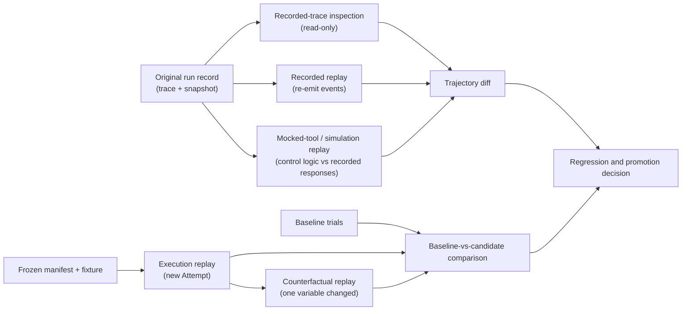
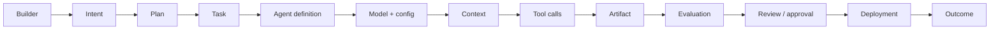
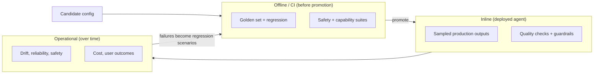
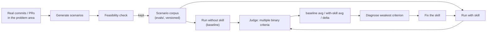

# 30. Evals as factory assets

Evals become factory assets when runs are reproducible enough to compare, traces can be inspected or replayed honestly, drift is attributable, and promotion moves through offline, shadow, canary, and production windows. This chapter turns evaluation from a one-off score into an operated lifecycle.

## The problem

A benchmark can become stale, contaminated, saturated, or disconnected from production while still producing precise-looking numbers. Telemetry can describe a run without judging it, and replay can differ materially from the original environment. The factory needs versioned eval assets with owners, expiry, provenance, and production correlation.

## How it works

### Capturing runs so failures can be reproduced

Everything above assumes you can see what the agent did. That is harness engineering's job. **Trace capture** is the retention of a run's complete event history — prompts, context assembled, model calls, tool calls and their results, permissions consulted, files touched, tests run, retries, costs, and human interventions — with enough identity to know exactly which configuration produced it. An **environment snapshot** freezes the state the run started from: repository commit, dependency versions, data, configuration digest, and available tools. Together they are the flight data recorder: not a way to un-crash the aircraft, but the only way to find out what happened.

Four activities use those recordings, and they must not be confused with one another.

<!-- infographic: trace-replay-comparison -->
> **Infographic — Trace, replay, and comparison.** *(Jay's graphic goes here.)* Until then, the diagram below carries the same concept.

**Recorded-trace inspection** reads the retained history without causing any new effect. It is the first tool for every failure and the only one that is perfectly safe. **Recorded replay** re-emits the stored events into an inspector or a test consumer, so a UI or a downstream component can be exercised against exactly what happened. **Mocked-tool replay** — also called simulation replay — reruns the control logic (the loop, the routing, the policy checks) against recorded or mocked model and tool responses; it tests the harness deterministically without paying for new model calls or touching real systems. **Execution replay** creates a new Attempt from a reconstructed manifest, fixture, environment, and external dependencies. It is a new observation, not a rewinding of the original. It may diverge because models, services, time, randomness, or network state differ, and the system should record those differences rather than claim exact reproducibility. **Counterfactual replay** is execution replay with one variable deliberately changed — a different model route, a corrected tool, an added skill — to ask whether that variable would have changed the outcome.

A **trajectory diff** compares two runs' paths, not just their results: changes in context, prompts, tools, route, permissions, environment, tool-call sequence, retries, files touched, tests, latency, cost, policy decisions, human intervention, artifact, and evidence. Trajectory diffs are diagnostic and they are not verdicts. A shorter sequence may mean efficiency or may mean skipped investigation; the diff tells you *what* changed and the criteria tell you whether it mattered.

**Baseline versus candidate** is the basic shape of every evaluation decision: the configuration currently trusted against the one proposing to replace it, on the same work. **Baseline-versus-candidate run comparison** is that paired comparison from the previous section applied with trajectories attached: same tasks, same fixtures, two configurations, outcomes and paths side by side with uncertainty. **Eval lineage and reproducibility** is the property that makes any of this reviewable later — every evaluation run records its dataset version, fixture hashes, grader versions, candidate and baseline digests, and trial records, so that a decision made today can be reconstructed next quarter.

### Observability is not evaluation

Two disciplines share the same telemetry and answer different questions. **Observability** tells you what happened: which model ran with which configuration, what context was retrieved, which tools were called, how state moved, how long it took, what it cost in time and tokens, how many retries occurred, which policies fired, and what the outcome was. **Evaluation** tells you whether what happened was good enough. Confusing them produces two failure modes: dashboards full of numbers nobody can act on, and verdicts nobody can explain.

What binds them is lineage. A finding is only debuggable if you can walk the chain from the builder who asked to the outcome that resulted:

Every link is a versioned record, and every evaluation finding points at the exact link it concerns. [Chapter 35](../05-operate/35-observability-telemetry-and-forensics.md) builds the telemetry side; this chapter needs it to exist.

*Without observability, evaluation isn't debuggable. Without evaluation, observability is just telemetry.*

### Drift has more than one source

An agent that passed every pre-release test can degrade without anyone touching it. **Drift** is usually discussed as model drift — the provider updates a model and behavior shifts — but in a factory it has at least five sources, and they move independently:

| What moved | How it shows up |
| --- | --- |
| Model | Same prompt, different reasoning, tool-calling, or failure modes |
| Retrieved knowledge source | The docs changed, went stale, or were reorganized; grounded answers are now grounded in the wrong thing |
| Tool contract | An API or MCP server changed its schema or semantics; calls succeed with different effects |
| Skill | A skill version was promoted and behaves differently on an edge case |
| Environment | Dependencies, runners, or data changed underneath the run |

Continuous evaluation detects that *something* moved. Attributing *what* moved requires the lineage above: versioned agent definitions, model configuration, skill versions, context provenance, and tool traces. If any of those is unversioned, a drift alert becomes an argument instead of a diagnosis.

*Continuous evaluation is only useful if you can attribute what changed.*

### Evals have a half-life

The candidate drifts; so does the instrument. Every benchmark has a **benchmark half-life**: the period during which it stays useful for a decision before one of four things ends it. The candidates saturate it and every configuration scores the same. Its tasks leak into training data or prompts and the score measures memory. The workload it was drawn from changes and it measures yesterday's work. Or the team optimises against it long enough that the score improves while nothing else does. A few months is a realistic lifetime for a benchmark under active optimisation, and a program that treats its evals as permanent will be steering by a number that stopped meaning anything two quarters ago.

The slow form of that decay is **eval drift**, introduced above with the dataset: the divergence between what an eval measures and what the organisation now counts as success. The dataset was drawn when the factory mostly did documentation and small fixes; it now does migrations and customer-facing features; the score is still ninety per cent. The remedy is a loop, not a rewrite: eval → monitor → compare with production → refresh → retire. Compare each eval's verdicts against production outcomes on the same slice on a schedule; when the correlation falls, refresh the dataset from current work through the intake gate; when it cannot be refreshed, retire it. The fast form is **benchmark overfitting**: optimising for a benchmark score that does not improve — and may degrade — production. It is the same failure that "optimizing to the benchmark" describes under Failure modes, and its cure is the rule the rest of this chapter keeps returning to: *target production outcomes, not leaderboards.* A public leaderboard says which model is best at the leaderboard's tasks; the only leaderboard that matters is the one built from your own workload, and even that one expires.

Lifecycle management needs a record. The **eval registry** is the catalogue of every evaluation the factory relies on, and its fields are what make retirement possible instead of accidental:

| Field | Why it is there |
| --- | --- |
| Name and purpose | What decision this eval informs |
| Workload class | Which slice of the real workload distribution it represents |
| Dataset version | The frozen membership it runs against |
| Rubric or grader version | The instrument, so a score change can be attributed |
| Owner | Who refreshes or retires it |
| Baseline and current score | The reference and the trend |
| Model and harness compatibility | Which configurations it is valid for |
| Last validated | When its verdicts were last compared with a trusted reference |
| Production correlation | How well its score has predicted production outcome on its slice |
| Expiry or review date | When it must be re-validated or retired |

An eval is a factory asset like a skill or a verifier, and the registry is its entry in the factory asset lifecycle of [Chapter 11](../03-build/11-the-agent-factory.md): owner → version → evaluate → deploy → observe → improve → deprecate. The "evaluate" step for an eval is validating it against production; "deprecate" is what the expiry date forces someone to decide.

### Three evaluation windows: continuous intelligence

Evaluation is not one gate. It runs in three windows, each checking what the previous one could not, and together they form what this guide calls **continuous intelligence** — the practice of measuring trust continuously rather than certifying it once.

<!-- infographic: evaluation-windows -->
> **Infographic — The three evaluation windows.** *(Jay's graphic goes here.)* Until then, the diagram below carries the same concept.

The **offline window** runs in CI before a configuration is promoted: golden-set and regression comparison against the baseline, plus safety and capability suites. It is reproducible, safe, and blind to anything it did not anticipate. The **inline window** evaluates the deployed agent on real work: sample production outputs, run quality checks against them, and enforce guardrails that stop a bad output before it has an effect. The **operational window** watches the population over time: drift, safety, reliability, cost, and whether users are getting the outcomes they came for. Each window feeds the one before it — an operational failure becomes an inline check, and an inline failure becomes an offline regression case.

*Trust isn't certified once; it's continuously measured.*

### From offline to production: the promotion ladder

Offline evaluation is reproducible and safe and incomplete. Two suites belong at the top of the offline rung before anything is exposed to real work. **Adversarial evaluation** runs the candidate against inputs designed to make it misbehave: injected instructions in repository files, conflicting tool results, tasks whose correct answer is to refuse or escalate. **Safety evaluation** measures whether the candidate stays inside its authorization envelope under those and ordinary conditions (no unauthorized effects, no secret exposure, no evidence fabrication), and its findings are hard gates rather than scores. **Shadow evaluation**, also called **shadow testing**, runs the candidate on production-shaped inputs without granting it any authoritative effect — it writes to a scratch branch, its results are compared, nothing ships. A **canary** exposes a bounded cohort of real work to the candidate with rollback ready. **Online evaluation** measures real outcomes, failures, interventions, cost, and drift in production. The four are the rungs of a **promotion ladder**: offline development, holdout evaluation, adversarial testing, shadow execution, limited canary, controlled comparison, and broader eligibility.

This is where evaluation becomes **controlled experimentation**. The evaluation run is treated as an experiment with a registered hypothesis and everything fixed before it starts: the success definition, a noninferiority or improvement threshold, guardrails, sample size, duration, stop conditions, who approves, and how rollback happens. Declaring these afterwards is how a team convinces itself that whatever happened was what it wanted. Promotion then requires a defined sample, met quality floors, no critical policy regression, bounded uncertainty, rollback readiness, and human authority — evaluation science, in one line, establishes whether the comparison supports the decision being made.

Production incidents feed the dataset, but only through a gate: normalization, deduplication, privacy review, and approval of what the expected behavior should have been. An incident copied straight into the eval set brings its sensitive data and its wrong expectations with it.

### Scorers over runs, benchmarks as matrices

The inline and operational windows need an instrument that works on real runs rather than on a fixture, and the cleanest public description of one is Warp's account of a closed-loop cloud factory. A **scorer** is a function from an input — an agent run or trace, including the human interactions attached to it, such as pull-request comments and tracker updates — to a grade against a rubric. Scorers are graded by code, by a human, or by an LLM judge, and they are the three grader kinds above turned into a standing service rather than a one-off. Default dimensions are correctness, cost efficiency, and verbosity; a factory adds its own. Because scorers cost money, they are configured like any other budgeted process: a sampling rate, a cadence (every few hours, not every run), and a batch size. The output is a stream of scored runs, which is the raw material for the regression set, the eval registry's production-correlation field, and the self-improvement loops of [Chapter 40](../06-improve/40-governed-learning.md).

The same scorers make benchmarking cheap, and the benchmark is not an A/B test. Pick five to ten representative reference tasks — from scratch or from past runs — and vary the configuration: the model mix, a skill, a routing rule, any factory primitive. Run the variants in parallel, grade every one with the same scorers, and read the result as a **configuration matrix**: rows are tasks, columns are configurations, cells are scores. A benchmark defined this way is reproducible because the factory is defined as code ([Chapter 12](../03-build/12-skills-as-packages.md)); the baseline is "with this configuration we merged this share of agent pull requests at this cost per pull request," and a candidate is a diff against that configuration. The matrix is also what an improvement agent reads when it proposes a change to routing or to a skill: a proposal grounded in the same scorers that grade production, reviewed by humans as a pull request against the factory definition.

### Context evals: with and without

Everything above evaluates a whole configuration. One component deserves its own, cheaper instrument, because it changes most often and is easiest to fool yourself about: the skill, rule, or other piece of context an agent loads. The question a skill author needs answered is not "did the agent succeed" but "did the skill make any difference." A **context eval** answers it by running the same task twice, once without the skill and once with it, and comparing. Tessl's public skill-eval tooling is one implementation of the pattern; the shape is what matters.

The steps, in the vocabulary of this chapter. A **scenario** is an eval task written for one skill: a realistic prompt the skill should influence, with criteria that say what good behavior looks like. Scenarios are generated from real commits and pull requests in the problem area the skill addresses, which keeps them representative rather than imagined, and each generated scenario passes a **feasibility check** before it is kept, so that the corpus contains only tasks an agent can complete in the harness at hand. The kept scenarios live beside the skill in a versioned directory and are its regression set; every later change to the skill is measured against them, and the corpus grows when a failure shows a gap.

The run is a **paired comparison**, exactly as defined earlier, with the pair being the presence or absence of the skill rather than two whole configurations. The agent solves each scenario without the skill and then with it, several trials each where variance matters. A model grader scores both against **multiple binary criteria**, one per observable behavior the skill is supposed to produce, so that the report is a set of pass rates rather than a single impression; the criteria are the grader's rubric and are subject to the calibration rules above. The output is three numbers: the **baseline** average, the **with-skill** average, and the **delta**. A large positive delta means the skill reliably moves the agent toward the intended behavior. A delta near zero means the agent already behaves that way and the skill is dead weight in the context window. A negative delta is a finding: the skill is making things worse, which happens more often than authors expect when instructions are long, ambiguous, or contradict a rule.

The loop that uses this is the **skill optimizer**: review the skill against a quality rubric ([Chapter 12](../03-build/12-skills-as-packages.md)), fix what the rubric flags, generate scenarios, run the with-and-without eval, diagnose the criterion with the weakest delta, revise, and re-run until the delta stops improving. It is the same review-and-fix loop applied to context instead of code, and it obeys the same discipline: predeclare the threshold, keep the scenario corpus frozen during a comparison, and never optimize against a judge that has not been calibrated. A skill that clears the loop has earned the evidence line that certification in Chapter 12 requires; a skill that cannot be given scenarios probably does not have a clear enough trigger to be a skill at all.

### Every capability earns its place

The with-and-without pattern is not special to skills. It is the general instrument for every capability a factory adds — a retrieval source, a repository memory, a verifier, a more expensive model, a subagent, a review lens — and running it on all of them is what stops a factory from accumulating components by imitation. The question each time is the same: does the run with this capability differ, on the measures that matter, from the run without it? A **with/without evaluation** of every capability turns "we added a security subagent because everyone has one" into "the security subagent changed the escaped-vulnerability rate on this slice by this much at this cost," and a surprising number of capabilities, measured that way, turn out to be dead weight.

The number to compute is the **marginal capability value**: the gain a capability produces divided by what it costs.

> marginal capability value = (Δ quality + Δ success + Δ human effort saved) / (Δ cost + Δ latency + Δ complexity)

The numerator is measured with the graders and slices above. The denominator is the part teams forget: a capability that improves quality by two per cent and doubles latency, or adds a fourth agent to coordinate, has a low ratio however good its demo. Rank capabilities by the ratio and the pruning list writes itself. This is the same computation that harness pruning in [Chapter 15](../03-build/15-coding-harnesses-and-agent-protocols.md) runs on harness components and that context utility in [Chapter 19](../03-build/19-data-knowledge-and-semantic-engineering.md) runs on context sources; the ratio is the common currency, which is why one program can own all three.

From the ratio follows the **factory simplicity principle**: add no agentic complexity unless evals show improvement. More agents, more context, more models, more verification are not better by default; each is a hypothesis with a cost, and the eval is the experiment that accepts or rejects it. The principle has a corollary about diagnosis. When a configuration underperforms, the temptation is to change the model, because the model is the most visible term; the honest move is **harness effectiveness evaluation** — the model × harness matrix of [Chapter 15](../03-build/15-coding-harnesses-and-agent-protocols.md), in which two models run under two harnesses on the same reference tasks and the pattern of results says whether the model, the harness, or the workflow is the term at fault. The matrix is a configuration matrix in the sense above, with the scorers doing the grading, and it is the cheapest way to avoid spending a quarter tuning the wrong component. **Eval-driven factory engineering** is the discipline that results: hypothesis → change → eval → compare → promote or reject — test-driven development applied to the factory itself.

What happens *after* promotion — regression control across versions, optimizing prompts, skills, and tools from evaluated evidence, and the governance that stops a learned improvement from authorizing itself — is the subject of [Chapter 40](../06-improve/40-governed-learning.md). This chapter builds the measuring instrument; that one uses it to improve the factory.

## How to build it

1. Capture the exact configuration digest, fixture hashes, environment, context, tools, events, artifacts, interventions, and cost for every Evaluation Run.
2. Separate inspection, recorded replay, mocked-tool replay, and new execution replay; record every divergence.
3. Register each eval with purpose, workload class, dataset, graders, owner, baseline, compatibility, last validation, production correlation, and expiry.
4. Run offline, inline, and operational windows, with global and repository-specific scopes.
5. Compare baseline and candidate through holdout, adversarial, shadow, canary, and an observation window using predeclared thresholds.
6. Refresh or retire evals when production correlation drops or the benchmark saturates.

## Failure modes

| Failure | Detection | Response |
| --- | --- | --- |
| Replay called reproduction | Manifest or environment differs from the original | Name the replay type and record divergences |
| Telemetry treated as a verdict | Tokens and latency are reported as quality | Bind observations to explicit evaluation findings |
| Eval exceeds its half-life | Materially different candidates score the same | Refresh from current production work or retire it |
| Benchmark overfitting | Offline score rises while production outcomes fall | Protect a holdout and make production the final grader |
| Candidate controls the instrument | Dataset, judge, or threshold changes mid-run | Version and independently own the evaluator |

## In Mission Control

Mission Control has context evaluations, dataset and experiment records, baseline/candidate comparison, verifier Attempts, criterion-linked evidence, run traces, and quality-gate decisions. Full fixture reconstruction, calibrated graders, paired statistical analysis, and a representative production evaluation service remain incomplete at the studied commit.

## Retain this

- Capture configuration, environment, context, tools, trajectory, artifacts, cost, and interventions so comparisons are attributable.
- Inspection, recorded replay, mocked-tool replay, and execution replay are different operations; a new execution is a new observation.
- Operate evals in offline, inline, and production windows, at global and repository-specific scopes.
- Promotion climbs holdout, adversarial, shadow, canary, and observation gates under a predeclared plan.
- Evals have owners and half-lives; refresh or retire them when production correlation falls.

## Go deeper

- [29. Evaluation engineering](./29-evaluation-engineering.md) for the foundation this chapter builds on.
- [Canonical glossary](../appendix/glossary.md) for the terms and boundaries used here.
- Return to the [book map](../README.md) for the complete reading sequence.
