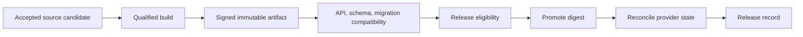
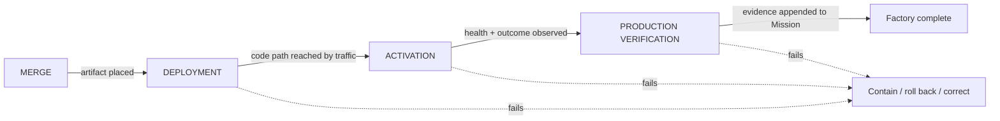
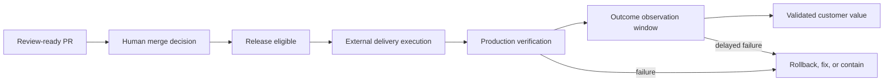
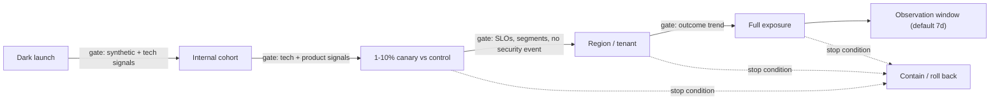
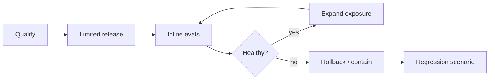
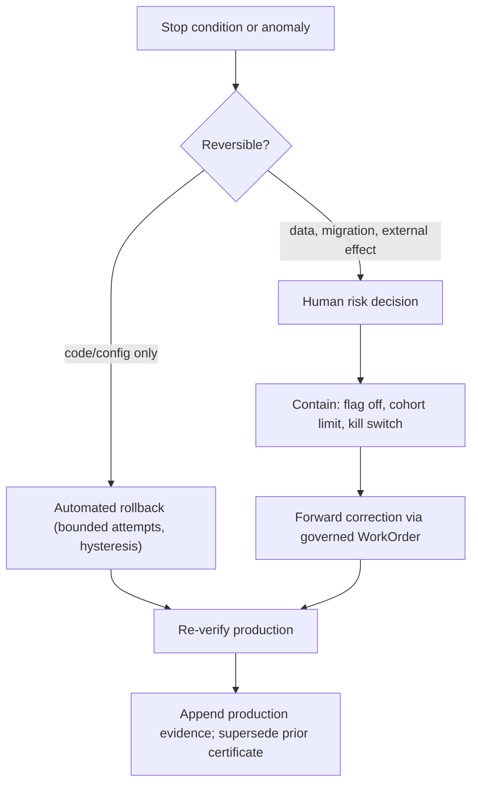

# 32. CI/CD, progressive delivery, and production verification

A certificate says an exact commit was eligible. Nothing has shipped yet. This chapter follows the change from accepted source through a reproducible build, an immutable artifact, schema and API compatibility checks, staged exposure to real users, production verification, and, when necessary, rollback or forward correction. It also treats the factory itself as a production system with its own reliability obligations. After reading it you should be able to explain why the same digest must move through every environment, why a database migration is a distributed-systems change, which signals should stop a canary, and why "deployed" is a state transition rather than success.

## The problem

A validated source commit is not a deployable artifact. Builds may fetch mutable dependencies, run on unqualified runners, embed secrets, or produce different outputs on different days. Database and API changes can break consumers even when the changed repository's own pipeline passes. And an agent that can edit pipelines or migrations can alter the very mechanism that judges its work.

Further along, factories tend to stop at a pull request or a green deployment. Neither proves that the intended users received the change, that it is technically healthy, or that the business outcome improved. A review-ready PR is not customer value. Merge, deployment, runtime health, rollback, and outcome confirmation are separate claims with separate owners. Worse, automated rollout can scale a defect quickly, and an untested rollback can compound it.

The reasons are structural. CI/CD spans source control, runners, package stores, registries, signing, environments, deployment systems, databases, and consumers, each with its own state and permissions. Compatibility often depends on release order and on data already in production. Rebuilding per environment breaks artifact identity; treating migration rollback as ordinary code rollback ignores irreversible data effects. GitHub may merge while the deployment platform is unavailable. A deployment can be technically healthy and still fail the product outcome the Mission was created for. Delayed incidents can invalidate acceptance that looked sound a week earlier. Production behavior depends on real traffic, data, configuration, dependencies, and user choices that preproduction cannot fully reproduce, and technical health and product success use different signals on different clocks.

The factory has one more exposure: it is itself a production system. If its queues, policies, workers, evidence stores, or provider integrations fail, autonomous work can stall, duplicate, or escape control.

## How it works

### Governance stays in the factory; execution is delegated

The factory does not need to *perform* deployment to *govern* it. It may delegate execution to GitHub Actions, Argo CD, Jenkins, Azure DevOps, or whatever the organization already runs. What it keeps is the decision, the policy, the required evidence, the approval, the lineage, and the reconciliation that connect the release back to the governed Mission. CI systems execute build and test jobs. Deployment systems apply an approved artifact. The factory authorizes a build or release candidate, defines the evidence it expects back, and reconciles what actually happened.

The rule that makes this safe: no external provider callback advances authoritative state without identity, subject digest, policy evaluation, and reconciliation. A webhook saying "deployment succeeded" is a claim from an external system, and it is treated like every other claim in this book.

### Not a parallel universe

The temptation, when building a factory, is to give it its own delivery path: its own runners, its own artifact store, its own deploy mechanism, tuned for agent-produced change. Resist it. The organization already has a software supply chain — source control, CI, artifact registries, security scanning, deployment systems — and every generated change should flow through that chain, not around it. A second delivery universe doubles the surface to secure, splits the evidence in two places, and guarantees that the agent path and the human path diverge until one of them is quietly less governed than the other.

What the factory adds is intelligence on top of the existing chain. CI results become verification evidence bound to the exact candidate instead of a status icon. Findings from scanners and analyzers are aggregated and summarized ([Chapter 27](./27-quality-and-evidence-architecture.md)) rather than dumped. Each change is risk-classified and routed to the review path its risk warrants. Production results flow back into learning rather than stopping at a deploy log. The pipeline the organization already trusts keeps executing; the factory makes it aware of who asked for the change, what evidence supports it, and what happened after it shipped.

*The factory shouldn't replace CI/CD. It should make CI/CD agent-aware and outcome-aware.*

Seen this way, the trajectory of CI/CD is clear. Continuous integration made builds continuous; continuous delivery made deployment continuous; the next step makes proof continuous. **Continuous evidence** is a pipeline whose output at every stage is not just an artifact or a green check but a bound, attributable record of what was verified, on what, by whom, and whether it is still current.

### The subject gets more precise as it moves

An air-traffic controller never says "the flight" without a call sign, and never confuses the aircraft on the ground with the one on approach. Delivery needs the same discipline. The delivery subject should become more precise at each step: source commit, then build recipe, then artifact digest, then deployment, then active configuration, then observed outcome. Reusing the word "version" for all of them hides exactly the boundaries where failures occur.

### Build once, promote by digest

The **artifact record** is the anchor. It binds the source commit, dependency lock, builder identity, environment digest, build commands, SBOM, provenance, signatures, test receipts, and output digest. The same digest then moves through every environment. Configuration changes remain separately versioned and attributable, so a difference between staging and production is a documented configuration difference, never a silent rebuild.

<!-- infographic: delivery-pipeline -->
> **Infographic — From accepted source to promoted digest.** *(Jay's graphic goes here.)* Until then, the diagram below carries the same concept.



A **hermetic build** is one whose inputs are fully declared and fetched from pinned, content-addressed sources, so the same inputs produce the same bytes anywhere. Pinned dependencies, isolated ephemeral builders, and controlled inputs make the artifact reproducible; [Chapter 33](./33-security.md) covers the provenance and attestation that make it verifiable. Hermeticity is expensive for legacy stacks, so apply it in proportion to consequence: the artifact that handles payments earns a hermetic build before the internal admin tool does. What is not negotiable, even for the admin tool, is digest identity. Tags locate an artifact; digests identify it.

### Migrations are compatibility windows

A database change is not a code change with a table attached. It is a distributed-systems change, because old and new readers and writers coexist while it runs. The safe pattern is **expand, migrate, validate, cut over, contract**: add the new shape alongside the old, move or backfill data, prove both shapes agree, switch consumers, and only then remove the old shape.

A migration plan identifies writers, readers, backfill, dual operation, constraints, load, monitoring, stop conditions, restore, and owner. Destructive contraction waits until every consumer has moved and evidence proves the old shape is unused. That last sentence is a gate, not a courtesy: contraction stays blocked until compatibility evidence is fresh.

### API and event compatibility

Version every schema. For each one, identify producers, consumers, optionality, defaults, ordering, idempotency, and retention. Run contract and integration tests against representative consumer versions, not only the newest. Remember that a syntactically backward-compatible schema can still change semantics: a field that keeps its type but changes its meaning breaks consumers that a schema diff will call compatible.

### Protect the assurance system

Changes to tests, CI definitions, policy, provenance, signing, or deployment configuration require independent review and higher assurance than ordinary code. The implementer cannot weaken the gate and then use the weakened gate as proof. In an agentic factory this is the difference between a builder that is checked and a builder that grades itself.

### Release states are explicit

"Done" is not an authoritative state. Each release transition binds artifact, configuration, environment, cohort, actor, policy, evidence, and timestamp:

```text
eligible -> approved -> deploying -> deployed -> technically verified
         -> activated -> outcome observing -> outcome confirmed
                               |                    |
                               v                    v
                         contained / rolled back / corrective work
```

Merge, deployed, technically verified, and outcome confirmed must have distinct owners, timestamps, artifacts, and evidence. In the operating model this guide describes, the merge decision stays human-owned.

The **state-machine principle** underneath this is worth stating once, plainly: *execution completed ≠ verification passed ≠ acceptance ≠ merge ≠ production verified.* Each of those is a distinct state, each transition needs its own evidence and its own authority, and no earlier state implies a later one. An agent's completion is an event. A verifier's pass is evidence about a subject. Acceptance is a human decision. Merge is an action in source control. Production verification is an observation about running software. Collapsing any two of them is how a factory ends up believing something it never checked.

The post-merge chain deserves the same discipline, because it is where "done" is most often declared early. After merge, the change still has to be **deployed** — the artifact actually placed into an environment; then **activated** — the code path actually reached by traffic, which for a flagged feature or a dark launch may happen days later; and only then **production verified** — observed to behave correctly under real conditions and, beyond that, to produce the outcome the Mission was created for. A merged change that was never deployed, or deployed but never activated, or activated but never verified, has not finished anything.

<!-- infographic: post-merge-chain -->
> **Infographic — The post-merge chain.** *(Jay's graphic goes here.)* Until then, the diagram below carries the same concept.



*Code complete is not factory complete.*



### Progressive exposure

Rather than exposing every user at once, choose an exposure strategy by how well it contains failure and how representative it is: dark launch, internal cohort, percentage canary, region, tenant, feature flag, or blue-green. Predefine the promotion gates, the maximum exposure at each step, the observation duration, the stop conditions, and the decision owner. Feature flags, kill switches, health gates, and automated rollback give risk-proportional control. Irreversible migrations, security boundaries, customer data, and material business impact still require human risk acceptance even when automation executes the steps.

<!-- infographic: progressive-rollout -->
> **Infographic — Progressive rollout with gates.** *(Jay's graphic goes here.)* Until then, the diagram below carries the same concept.



Stripped to its loop, progressive delivery is four steps and one question. Qualify the change (the contract is satisfied, the artifact is signed, the release plan exists). Release it to a limited cohort. Run inline evaluations against that cohort — the same sampled-output checks and guardrails from [Chapter 29](./29-evaluation-engineering.md), now applied to real traffic. Ask whether it is healthy. If yes, expand exposure and ask again; if no, roll back or contain, and the failure becomes a regression scenario.



The reason this is fast rather than slow is worth being explicit about, because the instinct is that controls cost speed. They do, when the control is a meeting. A control that is an observable signal and a reversible step costs almost nothing per iteration, and it is what makes a team willing to ship the next change an hour later instead of a week later. *Speed comes from making changes observable and reversible, not from eliminating controls.*

### Production verification

Jay's mission defines production validation as a workflow of its own: **deployment, then telemetry analysis, then synthetic validation, then anomaly detection, then rollback or escalation.** Each step has a distinct job.

*Telemetry analysis* covers technical health: availability, latency, errors, saturation, security signals, data integrity, dependency health, and cost. Compare the canary with a control using representative and attributable signals, and enforce absolute SLO limits alongside the comparison, because a canary that matches an already-degraded control is not healthy.

*Synthetic validation* exercises the journeys the change was meant to enable, end to end, on the deployed artifact. It answers "does the feature work?" independently of whether users have tried it yet.

*Anomaly detection* looks for what the predefined signals did not anticipate, and it must segment results. A healthy aggregate dashboard can hide a failing high-value cohort; harm concentrated in one tenant or region disappears in the average.

*Product verification* sits alongside all three. It checks the Mission's expected behavior and its guardrail measures over an outcome observation window. A default seven-day change-failure window should be configurable per workload, and the record should distinguish a preliminary outcome from a final one. Technical health is not customer value; the two use different signals and different clocks.

*Rollback or escalation* is the decision at the end, and it belongs to a named owner. Mission accountability requires that every Mission carry a clear rollback owner and a post-production validation owner, so that responsibility never disappears into "the AI did it."

### Rollback and containment are engineered

Rollback is a capability with its own evidence, not a universal undo button. A rollback plan identifies which components are reversible, and what happens to configuration, data, migration state, caches, consumers, and external effects. When reversal is unsafe, because data has already been transformed or a third party has already been notified, use containment and forward correction instead. Regular drills prove access, tooling, data restore, communication, and decision latency before an incident tests them for real.

<!-- infographic: rollback-decision -->
> **Infographic — Rollback or forward correction.** *(Jay's graphic goes here.)* Until then, the diagram below carries the same concept.



Automatic rollback needs hysteresis, bounded attempts, and human escalation for ambiguous or irreversible conditions; otherwise it can oscillate, hide a repeated defect, or damage data consistency.

### Production facts feed back into acceptance

Production evidence may supersede an earlier certificate, create a trust event for the executor configuration, open corrective work, revoke a capability, or change the observation window for similar changes. The original decision is preserved and the new fact appended. Failures create governed corrective WorkOrders rather than silent edits to the original Mission. This is the closing arc of the loop in [Chapter 31](./31-quality-contracts-proof-packages-and-certificates.md): a certificate is bounded in time precisely because production is allowed to contradict it.

The mission's quality stack lists what should be in play across this whole path: test selection based on change impact, deterministic checks, model-based evaluation, cross-agent review, production telemetry, canary releases, feature toggles, automated rollback, evidence capture, failure classification, and historical defect learning. The ultimate model is not "test before release." It is "continuously validate from plan through production."

### A worked example: a schema-dependent feature at ten percent

Consider a feature that stores a new "preferred contact channel" on customer accounts and uses it when sending notifications. The change touches a service, a database column, and three consumers that read account records.

The migration plan expands first: the new column is added as nullable with a default, the service writes both the old and new representation, and a backfill populates existing rows. Contract tests run against the versions of the three consumers actually deployed, not their `main` branches. One consumer turns out to be two releases behind and still expects the old shape; the compatibility check marks contraction as blocked and records that consumer as the reason. The build produces one artifact digest, signed, with SBOM and provenance attached. The release plan says: internal cohort for one day, then ten percent canary against a control, seven-day outcome window, decision owner named, rollback owner named, contraction deferred to a separate change.

The canary goes out. Telemetry analysis shows error rate, latency, and saturation matched to the control. Synthetic validation confirms that a test account set to "SMS" receives an SMS. The aggregate dashboard is green. On day three, anomaly detection segmented by tenant shows that one enterprise tenant's notification delivery has fallen sharply. Investigation finds a delayed data-integrity defect: the backfill wrote the wrong default for accounts created before a legacy import, and only that tenant has such accounts.

Now the rollback decision. The service code and the flag are reversible; the backfilled data is not, because notifications have already been sent using the wrong channel. The decision owner turns the flag off for the affected tenant (containment), keeps the canary running elsewhere, and opens a governed corrective WorkOrder to fix the backfill and reconcile the affected accounts (forward correction). The production verification receipt records a preliminary outcome of "failed for cohort X," the certificate that released the change is superseded, a trust event is logged against the executor configuration that wrote the backfill, and a regression scenario for pre-import accounts is proposed for the test suite. The original Mission is untouched; the history shows exactly what was believed, when, and why it changed.

Nothing in that story required the factory to run the deployment itself. It required the factory to know the digest, the cohort, the signals, the owners, and the reversibility of each component before the change went out.

### Operate the factory with SRE discipline

The factory has its own service levels. Define SLOs for dispatch availability, claim latency, lease health, event ingestion, evidence freshness, approval latency, provider reconciliation, orphan cleanup, and recovery. Use error budgets the way a mature platform team does, but with an agentic twist: a healthy budget is a reason to increase autonomy, and a burned one is a reason to pause feature expansion.

The mechanism deserves spelling out. An **error budget** is the amount of unreliability an SLO tolerates over a window; if dispatch availability is targeted at 99.5 percent per month, the budget is the remaining half percent. In a conventional service, exhausting the budget freezes feature launches until reliability recovers. In the factory, the equivalent lever is autonomy: while evidence freshness, lease health, and provider reconciliation are within budget, policy may allow more work to proceed without a human at each step; when they are not, the factory narrows what agents may do unattended until the platform is healthy again. Reliability of the factory and trust in its output are the same budget viewed from two sides.

Operator attention is a budget too. An alert should identify the decision required, the risk, the affected scope, the evidence, the safe actions, and what resumes afterward. An alert that only says "something is red" spends attention without buying a decision. [Chapter 8](../02-design/08-economics-metrics-and-human-attention.md) treats attention as a first-class economic input; here it is enough to say that a release pipeline that pages people for information rather than decisions will be muted, and a muted pipeline is an ungoverned one.

## How to build it

### The artifact record

Bind, for every releasable artifact:

- source commit and dependency lock;
- builder identity and environment digest;
- build commands;
- SBOM and provenance;
- signatures;
- test receipts; and
- output digest.

Configuration is versioned separately and attributed to whoever changed it.

### The migration plan

For every schema change, record: writers, readers, backfill approach, dual-operation period, constraints, expected load, monitoring, stop conditions, restore procedure, and owner. Phase it as expand, migrate, validate, cut over, contract, and block contraction until compatibility evidence is fresh and every consumer has moved.

### The compatibility check

For every API or event schema: version, producers, consumers, optionality, defaults, ordering, idempotency, retention. Test against representative consumer versions. Treat a semantic change as incompatible even when the syntax is not.

### The release plan

Generated per change and proportional to risk:

- exposure strategy (dark launch, internal cohort, percentage canary, region, tenant, feature flag, blue-green);
- promotion gates and maximum exposure per step;
- observation duration and stop conditions;
- decision owner, rollback owner, and post-production validation owner;
- rollback or containment plan with the reversibility of each component; and
- required human approvals for irreversible or material steps.

### The production verification receipt

Attach to the release record, per environment and cohort:

- artifact digest, configuration version, cohort, and window;
- technical signals: availability, latency, errors, saturation, security, data integrity, dependencies, synthetic journeys;
- product signals: the Mission's expected behavior and guardrail measures, segmented;
- canary-versus-control comparison and absolute SLO results;
- preliminary or final outcome status; and
- producer identity and timestamps.

### Reconciliation rules

- Verify provider identity and signature on every callback.
- Match the callback's subject digest to the intended release; a stale head SHA or unknown digest is a discrepancy, not a success.
- Deduplicate replayed webhooks by delivery identity.
- Record the intended state, the reported state, and the reconciled state separately.

### Factory SLOs and alerts

Track dispatch availability, claim latency, lease health, event ingestion, evidence freshness, approval latency, provider reconciliation, orphan cleanup, and recovery. Tie error budgets to autonomy decisions. Every alert carries: required decision, risk, affected scope, evidence, safe actions, and what resumes afterward.

### Drills

Exercise rollback, data restore, kill switches, and communication on a schedule, and retain the timeline and decision latency as evidence.

## Failure modes

**Rebuilding per environment.** Convenient for platform conventions, fatal for subject identity. The artifact tested is no longer the artifact deployed. Promote by digest.

**Mutable dependencies and unqualified runners.** Two builds of the same commit differ. Hermetic builds and pinned inputs fix it, at real cost for legacy stacks; apply them first to the artifacts whose failure would matter most.

**The agent edits its own gate.** A builder with write access to CI definitions, tests, or policy can weaken the check that judges it. Require independent review and higher assurance for any change to the assurance system.

**Consumer-driven contracts that encode accidents.** Contracts reveal what consumers actually expect, which sometimes includes behavior nobody intended to promise. Treat such findings as review items, not automatic constraints.

**Migration rollback as code rollback.** Reversing a migration after data has been written in the new shape can be less safe than forward correction. Choose based on data semantics and restore evidence, and decide before the change ships.

**Unrepresentative canaries.** A small canary contains harm but may never see the rare workload that fails. Choose cohorts for representativeness as well as containment, and let synthetic validation cover what traffic does not.

**Long observation windows.** Confidence improves; delivery accounting slows and preliminary outcomes are mistaken for final ones. Set the window per workload and label the outcome status.

**Auto-rollback oscillation.** Without hysteresis and bounded attempts, a flapping signal produces repeated rollbacks and re-deploys, hiding the defect and stressing data consistency.

**Flag and partial-state debt.** Feature flags, canaries, and cohorts create control and also leave half-states behind. Retire flags as part of the release plan.

**Aggregate health hiding cohort failure.** The dashboard is green while one tenant is broken. Segment every product signal.

**Delayed incident after acceptance.** The certificate was correct when issued. Supersede it, open corrective work, and record the trust event; never edit history.

**Webhook replay and stale SHA.** A replayed "success" or a callback for an older head must reconcile against intended state, not overwrite it.

**Centralizing all deployment in the factory.** It tightens control and creates coupling and a single point of failure. Delegate execution and keep correlation and reconciliation strong.

**The parallel delivery universe.** Agent-produced changes get their own runners, registry, and deploy path, and within months it is the less-governed one. Detect it by asking whether a generated change and a hand-written change flow through the same CI, scanning, and deployment systems. Fix by routing through the existing supply chain and adding evidence, aggregation, and risk routing on top.

**Merged means done.** The change merged, nobody checked whether it deployed, whether the flag was ever turned on, or whether production behaved. Detect it by Missions whose last recorded state is merge. Fix by treating deployment, activation, and production verification as distinct states with their own evidence.

## In Mission Control

Assessment pinned to `main` commit [`b31e275`](https://github.com/jaydubya818/MissionControl/tree/b31e27564deb1c03c167e61b5ee094567c2ba7b1) and study branch `9d5f8e3`, reviewed 2026-08-11 and 2026-08-30.

**Implemented.** Deployment records, release gates, approval and evidence linkage, GitHub PR and check ingestion, alerts, health queries, run events, and an evidence-retention policy exist. V1 decisions keep merge human-owned and select governed GitHub Issues, linked to an exact repository and commit, as the source for production defects, incidents, and rollbacks. The architecture distinguishes execution, validation, publication, merge, deployment, and acceptance, and it defines observation windows, rollback concepts, and validated customer value as records. Deployment execution may be delegated while governance remains in the factory.

**Partial.** These mechanisms do not prove a complete Mission-to-production golden path. Deployment execution and customer-outcome confirmation are partial. Some Factory Health metrics are inferred from Task, run, approval, and verifier proxies rather than from accepted WorkOrders and production outcomes. The proven golden path ends at a review-ready PR. Study branch `9d5f8e3` improves the real PR publication boundary; PR #64 is open and the browser-only proof incomplete. PR #61 proves one real GitHub App PR with passing CI, not deployment or customer value.

**Future.** Artifact-registry operation, build-once promotion, migration phases, consumer compatibility, pipeline-change protection, and complete deployment-provider reconciliation are not yet implemented or taught in depth. The intended path: reconcile provider events into an explicit Release record; attach production verification receipts; monitor the configured failure window; confirm the Mission's expected customer outcome; open governed corrective work on failure without editing the original Mission; show operators the affected consumers, migration phase, evidence freshness, rollout order, rollback or restore plan, and blocked conditions for each release candidate; and add a Factory SRE view of SLOs, error budgets, queue age, stale leases, evidence freshness, provider degradation, orphan resources, attention load, and reliability-driven autonomy reductions. "The factory manages the entire lifecycle" remains an architectural definition, not a claim that Mission Control automates every stage today.

## Retain this

- Build once, promote by digest. The subject gets more precise as it moves: source commit, build recipe, artifact digest, deployment, active configuration, observed outcome.
- Database changes are distributed-systems changes: expand, migrate, validate, cut over, contract, and never contract without fresh compatibility evidence.
- CI execution is not delivery authority. The factory decides, delegates execution, and reconciles; no callback advances state without identity, digest, policy, and reconciliation.
- Deployment is a state transition, not success. Merge, deployed, technically verified, and outcome confirmed have separate owners, evidence, and clocks.
- Rollback is pre-engineered and drilled; when reversal is unsafe, contain and correct forward with human risk acceptance.
- Production evidence can supersede a certificate. Preserve the original decision, append the fact, and open corrective work.
- The factory is a production system with SLOs, error budgets, and an attention budget; reliability decides autonomy.

## Go deeper

**Related chapters.** [31. Quality contracts, proof packages, and certificates](./31-quality-contracts-proof-packages-and-certificates.md) defines the eligibility this chapter consumes. [33. Security](./33-security.md) covers builder hardening, provenance, and attestation. [35. Observability, telemetry, and forensics](../05-operate/35-observability-telemetry-and-forensics.md) supplies the signals. [36. Resilience, incidents, and the control tower](../05-operate/36-resilience-incidents-and-the-control-tower.md) takes over when a stop condition becomes an incident. [39. Production feedback, review, and the agentic merge queue](../06-improve/39-production-feedback-review-and-the-agentic-merge-queue.md) covers the merge side. [14. Durable execution](../03-build/14-durable-execution.md) explains the leases and events the factory SLOs measure. [10. Multi-repository design](../02-design/10-multi-repository-design.md) covers cross-repository release ordering. [3. First principles](../01-understand/03-first-principles-trust-evidence-and-authority.md) for the autonomy ladder that error budgets move. Terms are in the [glossary](../appendix/glossary.md).

**Primary sources.** Jay's AI Software Factory mission (Workflow 6 "Production validation", the human accountability model, and the quality stack); SLSA specification; DORA guides on database change management, deployment automation, and delivery metrics; NIST SSDF; Google SRE Workbook, "Canarying Releases"; OpenTelemetry signals.

**Mission Control sources at `b31e275`.** `convex/governance/deployments.ts`, `convex/governance/releaseGateAutomation.ts`, `convex/factory/health.ts`, `docs/security/evidence-retention-policy.md`, `docs/decisions/ai-software-factory-v1-decisions.md`.
