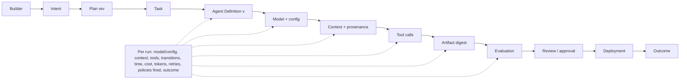
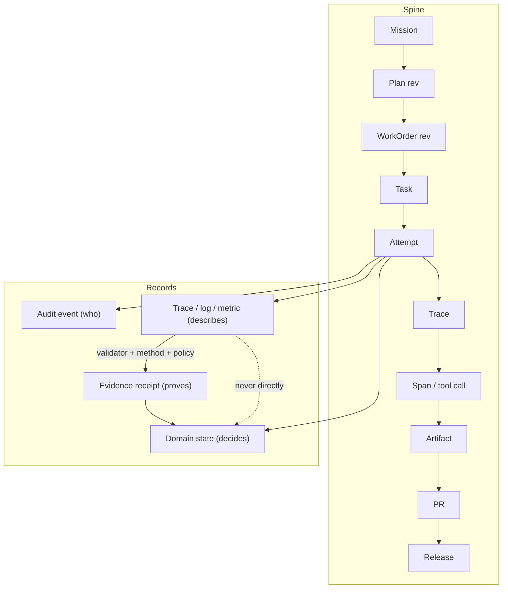
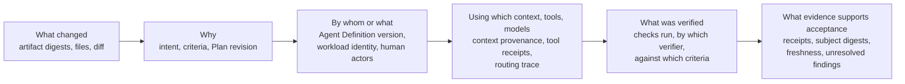
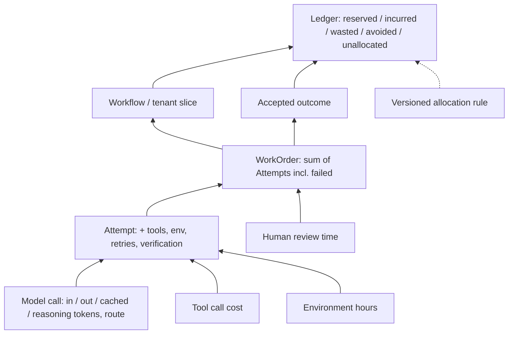

# 28. Observability, telemetry, and forensics

An agentic factory can be very busy while making no progress, very cheap while producing unsafe work, and successful by its own account while violating the authority it was given. Operators need to understand outcome, control state, execution health, cost, and evidence freshness across a dozen asynchronous systems, and they need to do it without reading transcripts. This chapter gives you the model for that: what to correlate, what to record, what a span means in an agent runtime, how to attribute usage and cost to an accepted outcome, and how to freeze enough of a run that an incident can be reconstructed months later. It also draws the line the whole book depends on: telemetry describes behaviour; it never becomes authority by accident.

## The problem

One governed outcome crosses a browser, a database, an orchestrator, a model provider, several tool servers, a worker, a repository, a CI system, and a deployment pipeline. Retries fragment traces. Background work outlives the request that started it. High-cardinality identifiers (every Attempt, every prompt, every user) make metrics expensive if you are careless. Prompts and tool arguments may contain secrets. And the most dangerous problem is quiet: telemetry reports observations, and if nobody draws the boundary, a trace that says `status=success` starts being treated as proof that the work succeeded.

Logs and traces can show plenty of activity without answering the question that matters: which Mission, WorkOrder, Attempt, capability version, artifact, release, and customer outcome was affected? Provider-specific fields make one model's behaviour hard to compare with another's. Trace context is lost through queues, external providers, and human pauses. AI systems add usage types (prompt, completion, cached, and reasoning tokens), event types (model, tool, handoff, guardrail, and context events), and large sensitive payloads that classic web telemetry never had to handle. Operational telemetry and acceptance evidence also have different retention and integrity requirements, and treating them as one stream compromises both.

## How it works

### Observe from intent to outcome

Everything hangs on a **correlation spine**, a stable chain of identifiers that every signal carries:

`Mission → Plan revision → WorkOrder revision → Task → Attempt → trace → span or tool call → artifact or evidence → PR → release`

Every signal also carries its scope (tenant, workspace, repository), the relevant domain IDs, the execution-manifest digest, source and head SHA when known, the actor or workload identity, and a timestamp. With the spine in place, an operator can start from a customer outcome and walk backwards through release, artifact, evidence, Attempt, capability graph, WorkOrder, Plan, and intent. Without it, observability is expensive agent wallpaper: lots of motion, no way to ask what any of it was for.

Correlation must not grant access. The fact that a signal carries a Mission ID does not mean every viewer of that Mission may see the signal; authorisation still filters what each person retrieves.

### The execution lineage: what is recorded per run

The spine names the records; **execution lineage** is the causal chain that runs through them, from the person who wanted something to the outcome they got. Written out, it is longer than the spine because it includes the components that shaped each step:

`builder → intent → Plan → Task → Agent Definition → model + configuration → context → tool calls → artifact → evaluation → review and approval → deployment → outcome`

Each link is a question an operator will eventually need answered. Who asked for this, and what did they mean? Which Plan revision and which Task? Which Agent Definition version ran, on which model with which configuration? What context did it receive, and where did that context come from? Which tools did it call, with what arguments and results? What did it produce? What evaluated the artifact, and what did the evaluator say? Who approved it, and against what evidence? Where was it deployed? What happened next?

To answer those questions later, every run records a fixed set of facts as it happens: the model and its configuration, the retrieved context and its provenance, the tools called, the state transitions, elapsed time, cost, tokens, retries, the policies that fired (and what they decided), and the outcome. None of that is optional detail. It is the minimum that lets a failure be traced to the component that caused it.

<!-- infographic: execution-lineage -->
> **Infographic — The execution lineage chain.** *(Jay's graphic goes here.)* Until then, the diagram below
> carries the same concept.

The lineage is also the boundary between two disciplines that are often confused. *Observability tells you what happened; evaluation tells you whether it was good enough.* An observability system that says a run took four minutes, called nine tools, and cost eleven cents is describing behaviour. An evaluation that says the artifact met seven of eight acceptance criteria is judging it. Both are needed, and each is weak alone: *without observability, evaluation is not debuggable; without evaluation, observability is just telemetry.* An evaluation failure with no lineage behind it is a verdict with no case file; a perfect trace with no evaluation is a very detailed account of something that may or may not have been worth doing. [Chapter 23](../04-prove/23-evaluation-engineering.md) owns the judging side; this chapter owns the record that makes the judgment debuggable.

### Attributing drift through lineage

Lineage earns its cost the first time behaviour changes and nobody changed the code. **Drift** in an agent system has more dimensions than model drift: the model can change under a stable name, a retrieved knowledge source can be edited, a tool contract can shift its response shape, a skill version can move, the execution environment can pick up a new dependency. Each of those is a link in the lineage chain, and when every run records the versioned Agent Definition, the model configuration, the skill versions, the context provenance, and the tool traces, the question "which component moved?" becomes a diff between two runs rather than an investigation. *Continuous evaluation is only useful if you can attribute what changed.* [Chapter 29](./29-resilience-incidents-and-the-control-tower.md) catalogues the kinds of drift the control tower watches for; the lineage described here is what lets it name a culprit.

### Four kinds of record, one of which decides

The boundary that keeps the factory honest is a four-row table.

| Record | Primary purpose | May be sampled? | Controls advancement? |
| --- | --- | --- | --- |
| Domain state | The current authoritative workflow decision | No | Yes |
| Audit event | Who decided or changed authority | No | Supports accountability |
| Evidence receipt | Proof for a claim about an exact subject | No | Yes, through policy |
| Trace, log, metric | Diagnose behaviour and measure health | Often | No, unless promoted through an evidence-producing control |

Authoritative state tells you what the factory decided. Audit tells you who. Evidence tells you what was proven about an exact subject. Telemetry tells you how the system behaved. A trace showing success cannot accept a WorkOrder. What *can* happen is promotion: a **validator** takes an attributable observation and converts it into an evidence receipt under an explicit method and policy, tied to a subject digest, a criterion, and a producer, as [Chapter 24](../04-prove/24-quality-contracts-proof-packages-and-certificates.md) describes. The presence of a raw trace never satisfies acceptance on its own.

The analogy is a flight recorder. It records everything the aircraft did. It does not decide whether the flight was safe; an investigator does, using the recording as one input among several. Nobody would let the recorder sign off the aircraft for its next flight.

<!-- infographic: telemetry-model -->
> **Infographic — The telemetry model: spine, record kinds, and the evidence boundary.** *(Jay's graphic goes here.)* Until then, the diagram below carries the same concept.

### The completion record

The four record kinds describe what the factory keeps. The **completion record** describes what a run hands back, and the rule for it is short: *a mature factory never returns just "done"*. A bare success status is the least informative thing an Attempt can say, because it collapses every question an operator, reviewer, or auditor will later ask into one bit. What the run returns instead is a chain of answers, in a fixed order, each one drawn from the records above rather than from the model's own account of itself.

<!-- infographic: completion-record -->
> **Infographic — The completion record: never just "done".** *(Jay's graphic goes here.)* Until then, the diagram below carries the same concept.

Each link has a source of truth. *What changed* comes from artifact digests and the changed-file comparison against the frozen scope, never from the model's summary of its own diff. *Why* is the Plan revision and the acceptance criteria the Task was bound to. *By whom or what* is the Agent Definition version and the workload identity, plus every human who approved, corrected, or overrode along the way. *Using which context, tools, and models* is the context package with its provenance, the tool receipts, and the **routing trace**: the record of which model route was selected for each call, why (the policy, the capability match, the budget), which fallbacks were considered, and which one actually ran, so that a quality or cost question can be traced to a routing decision rather than to "the model" ([Chapter 17](../03-build/17-models-routing-and-capability-selection.md)). *What was verified* names the checks, the verifier identity, and the criteria each check addressed. *What evidence supports acceptance* is the set of receipts bound to the exact subject digest, their freshness, and, as important as any of it, what remains unverified or unresolved.

Underneath the chain sits the **execution trajectory**: the ordered sequence of decisions, tool calls, state transitions, retries, and escalations the run took to get from manifest to result. The completion record summarises; the trajectory is what the summary is accountable to, and it is what trajectory evaluation in [Chapter 23](../04-prove/23-evaluation-engineering.md) grades. A record whose chain cannot be walked back into the trajectory is a narrative, not a record.

Findings inside the record are structured, not prose. Whether they come from a verifier, a review agent, a scanner, or an incident, **structured evidence** carries the same fields, so that the next consumer (a human, an aggregator, a learning pipeline) can count, deduplicate, rank, and act on them:

| Field | What it holds | Why it is required |
| --- | --- | --- |
| **Severity** | Consequence × likelihood, on the shared scale | So findings can be ordered and thresholds applied without rereading them |
| **Confidence** | The producer's calibrated estimate that the finding is real | So low-confidence findings can be routed to a person rather than blocking or being dropped |
| **Affected code** | Repository, path, symbol, and line range, bound to the subject digest | So the finding survives a rebase and can be deduplicated against its neighbours |
| **Recommended action** | What would resolve it, and whether an agent may apply it | So the fix-review loop and the human know what is being asked |
| Evidence and producer | The test, trace, rule, or incident behind it; the producer's identity and version | So the finding can be independently checked and its producer's precision measured |

The last field is where **incident ownership** enters. When a finding is promoted to an incident, or when a production outcome is traced back to a run, the record names an owner: a person, not a queue, with the completion record and the forensic bundle in hand. Ownership is part of the record because an incident without an owner is telemetry, and the control tower of [Chapter 29](./29-resilience-incidents-and-the-control-tower.md) routes on owners, not on alerts.

The picture is a surgeon's operative note. Nobody accepts "operation went fine". The note says what was done, why, by whom, with which instruments and under which anaesthetic, what was checked before closing, and what the follow-up depends on, and it is written from the chart, not from memory.

### What to instrument on each plane

Control-plane spans cover the decisions: Mission and Plan decisions, policy evaluation, WorkOrder release, dispatch, acceptance, and exception handling. Execution-plane spans cover the work: lease claim, renew, and reconcile; sandbox creation; model invocation; tool call; command; test; commit; publication; receipt ingestion; and cleanup. The two planes are described in [Chapter 11](../03-build/11-control-plane-orchestrator-and-execution-plane.md); their telemetry should make the boundary between them visible.

Two rules stop traces from lying. First, use **span links** rather than false parent–child relationships when asynchronous retries, external CI runs, fan-out, human pauses, or replays have independent lifecycles. A four-hour approval wait is not a four-hour span inside the Attempt; it is a linked event. Second, preserve the attempt number and the idempotency key on every event, so a duplicate can be explained rather than puzzled over.

### Shared semantics make runs comparable

The second v1 chapter's insight is that observability becomes architecture at the moment semantic choices decide whether runs, providers, workflows, and outcomes can be compared. Instrumentation without a shared subject model produces expensive anecdotes.

So the factory defines stable names and attributes for Mission, Plan, WorkOrder, Task, Attempt, Factory Version, capability versions, model route, tool call, sandbox, worker, repository, commit, candidate, evaluator, evidence, pull request, artifact, deployment, and outcome, and records status and failure class the same way across every provider. Every event or span carries a **stable semantic envelope**:

- timestamp, event or span name, and schema version;
- correlation and causation identifiers;
- tenant, environment, and actor or workload identity;
- system, workflow, task, and attempt identifiers;
- component and capability versions;
- state or operation, status, failure class, and duration;
- a usage or cost reference; and
- redaction state.

Subject digests are added for artifacts, contexts, evaluator results, evidence, and releases. Provider-specific fields live in namespaced extensions so that a new model feature does not break the common core.

**OpenTelemetry** supplies the transport: traces, metrics, logs, baggage, and context propagation, with W3C Trace Context for cross-service propagation. Use it, but carefully. Its CI/CD semantic conventions were release-candidate at the time of writing, its generative-AI conventions had moved to a separate repository, and many older attributes were deprecated or still in development status. Pin an exact convention version, translate through the internal stable vocabulary, place unstable mappings behind an adapter, and test exporters before adopting a changed attribute meaning. Mission Control identifiers remain the durable domain vocabulary; OpenTelemetry attribute names are an export format.

**Propagation rules.** Carry trace and causation identity through API calls, queues, workers, tools, CI, artifact publication, deployment, and production observation. Where a boundary cannot preserve trace headers (a webhook into a third-party CI, say), carry a signed or validated correlation field inside the business contract itself. Clock uncertainty and missing segments are recorded explicitly rather than smoothed over. Domain events record accepted facts; audit events record security-relevant actions; spans record timed operations; links record the relationships that are not timed operations.

### Four kinds of health

An operator dashboard for twenty parallel Missions needs four families of signal, and the temptation is to show only the last one.

**Outcome health** is lead time to validated value, throughput, change-failure rate, rework, acceptance rate, and customer signal.

**Control health** is blocked gates, policy denials, exception age, approval latency, stale, missing, or conflicting evidence, unauthorised attempts, and autonomy demotions.

**Runtime health** is queue age, lease expiry, heartbeat lag, retry rate, timeouts, cancellation latency, sandbox failures, publication failures, and reconciliation backlog.

**AI economics and quality** is model and provider, input, output, and cache tokens, latency, cost, tool-call success, task and evaluation success, human override rate, and routing-decision outcome.

Token volume and agent activity are diagnostic inputs, never productivity measures. The most valuable alert is the one that names the human decision now required.

### Capture decisions without capturing reasoning

For each decision the factory makes (a route, a plan step, a tool choice) record the decision-input class, the selected policy or routing rule, the model and its configuration, the structured output, the confidence where it is calibrated, the tool choices, and the result. Do not require or persist private chain-of-thought. Retain user content, prompts, tool arguments, and outputs only under classification, redaction, access, and retention rules. The default posture is **metadata-first and content-off**: full content capture is a deliberate, scoped decision, not the baseline.

### Capture complete runs for replay

The 12-layer stack's **Harness Engineering** layer (see [Chapter 19](../03-build/19-the-12-layer-production-ai-agent-stack.md)) sets the capture requirement from the other direction: record complete runs so that failures can be reproduced, inspected, replayed, and compared. The vocabulary that follows is what the observability system has to support if [evaluation engineering](../04-prove/23-evaluation-engineering.md) is going to work:

- **trace capture** and **recorded-trace inspection**, the ordered record of every model call, tool call, and state change in an Attempt;
- **execution replay** and **mocked-tool replay**, re-running a recorded trace with tools stubbed so that no external effect repeats;
- **environment snapshot**, the frozen inputs that make replay deterministic;
- **trajectory diff**, comparing the path two runs took, not only their final outputs;
- **baseline-versus-candidate run comparison**, the mechanism by which any change to a prompt, model, or skill is judged; and
- **counterfactual replay**, re-running with one input changed to isolate a cause.

None of this is possible if the trace is sampled away or the tool arguments were dropped. That is why sampling policy (below) preserves the runs that matter and why content-off is a default, not a prohibition.

### Freshness, silence, and alerts that demand action

Evidence has valid-from and valid-until semantics and a subject digest. The system alerts when required evidence approaches expiry, when the subject changes underneath it, when a verifier becomes unhealthy, or when an expected heartbeat or result does not arrive. Absence is a signal only when the system has defined what should have happened and by when, which is why evidence freshness is an operational SLO rather than a documentation concern. Unavailable telemetry is recorded as *unknown*, never as zero.

An alert is designed around action. It says what outcome is affected, why it matters, which record is authoritative, the current risk, the recommended action, the owner, and the deadline. Each alert rule names an owner, severity, baseline, threshold, window, deduplication key, runbook, suppression rule, and the closure evidence that ends it. Alerts are deduplicated by governed incident, downstream symptoms are suppressed, and escalation follows consequence and duration. The factory's UI prioritises exceptions and decisions over a wall of agent activity; [Chapter 29](./29-resilience-incidents-and-the-control-tower.md) builds the control tower on that principle.

### Privacy, cardinality, and sampling

Classify attributes before collection. Avoid secrets and unnecessary prompt or source content. Hash or tokenise identifiers where appropriate. Metrics use **bounded labels** only: workflow class, model profile, status, failure class, risk, and region. High-cardinality detail (attempt, repository, user, prompt identifiers) lives in traces and events, not in metric labels, or the metrics bill will exceed the model bill.

Full-fidelity traces improve debugging and increase cost, privacy risk, and cardinality. The resolution is **tail sampling**: sample successful low-risk detail, but always retain failures, policy denials, security events, high-risk actions, latency and cost outliers, incident-linked runs, and a representative set of successful runs. Domain state, audit events, evidence, and error traces are never sampled. Apply privacy and retention policy before export, not after.

Metrics aggregate well and lose causality; traces explain one run and not a fleet trend; logs remain useful for unstructured diagnostics and should not be the primary integration contract.

### Attributing usage and cost

Each model call records input, output, cached, and, where the provider exposes it, reasoning usage, together with the model route, retries, tool and environment cost, verification cost, storage, and human attention. Costs roll up from Attempt to WorkOrder to workflow to tenant to accepted outcome without double counting: a retry is counted once, at the Attempt that incurred it, and flows up; a shared environment is allocated by the versioned rule from [Chapter 27](./27-the-factory-as-a-platform.md), and the rule is recorded with the number.

<!-- infographic: cost-attribution -->
> **Infographic — Cost attribution rollup.** *(Jay's graphic goes here.)* Until then, the diagram below carries the same concept.

The views practitioners actually keep open are simpler than the model behind them. In the HumanLayer and BAML conversation, the host pulled up two: token usage over time, and cost by model. What the cost-by-model view revealed was a routing pattern, heavy use of a cheaper execution model for engineering work with a more expensive model reserved deliberately for UI and writing, and that pattern is the thing a cost view exists to make visible. The same conversation listed what the control plane needs to show alongside spend: session traces, the plans and architecture documents a run produced, and budgeting per team. Cost by model is only useful once it can be sliced by workflow and by accepted outcome; otherwise it is a bill, not a decision aid.

### Cost per trusted outcome

The slicing matters because the cheapest model is not the cheapest system. A cheaper model that needs three attempts and then forty minutes of a senior engineer's rework costs more than one successful run on a stronger model, and a ledger that only shows tokens will recommend the wrong one every time. So the ledger attributes cost along four axes at once, **team, workflow, model, and outcome**, and the number that gets reported upward is *cost per trusted outcome, not cost per token*. Human rework is a cost line, measured, not a footnote.

Budget data is also feedback for the architecture, not only a control on spend. If one skill costs five times what another costs for the same accepted outcome, that difference should reach the routing table and the improvement queue of [Chapter 33](../06-improve/33-governed-learning-and-compounding-engineering.md), because the structural levers that bring cost down (smaller models for simpler work, strong models only where reasoning creates value, deterministic automation, targeted retrieval, caching, bounded loops, explicit budgets and stopping conditions, fewer coordinating agents) are all design decisions. *Economics should influence architecture continuously, not arrive as a surprise on the monthly bill.*

### Forensic bundles

For a material incident, diagnosis is not enough; the factory must be able to prove, later and to a sceptic, what happened. A **forensic bundle** freezes, for one case: the execution manifest and exact versions; identities, grants, and policy decisions; the ordered domain and audit events; the selected trace and log segments; context and source lineage; tool calls and side-effect receipts; artifacts and their digests; evaluator and proof records; human decisions; cost; the incident control actions taken; and the known gaps. Prompts appear either in full or as redacted hashes depending on classification. Network records and provider responses are included where retained.

A bundle is immutable, access-controlled, redacted by policy, and bound to a case, with integrity protection, chain of custody, retention, and any legal obligations attached. It preserves observable facts, not hidden reasoning. What belongs in a bundle but not in a routine log is precisely the material you would not want retained by default (full tool arguments, provider responses, identities) and would not want missing when it matters.

## How to build it

1. **Define the telemetry contract first.** Version it. Write down the correlation spine, the semantic envelope, the bounded metric labels, and the classification of every attribute.
2. **Instrument one golden path end to end** before instrumenting everything. Cover control-plane decision spans and execution-plane work spans, with links across every asynchronous boundary.
3. **Propagate identity through every boundary.** Where headers cannot survive, put a signed correlation field in the business contract.
4. **Export through OpenTelemetry behind an adapter.** Pin the semantic-convention version. Keep Mission Control identifiers as the durable vocabulary.
5. **Set the capture posture to metadata-first, content-off**, then enable scoped content capture for the runs that evaluation and forensics require, under classification and retention rules.
6. **Write the sampling policy**: never sample domain, audit, evidence, or error records; tail-sample everything else with the always-keep list above.
7. **Build three operator views** and no more to begin with: outcome and risk; active exceptions and required decisions; one Attempt's trace with its timeline of queue delay, lease events, model and tool latency, test duration, cost, and final evidence.
8. **Add the SLOs** for dispatch latency, stale leases, evidence freshness, and reconciliation backlog. Alert on absence only where the expectation is defined.
9. **Stand up the cost ledger** with per-call usage fields, the rollup path, and the versioned allocation rule. Add the two practitioner views: usage over time and cost by model, sliceable by workflow and outcome.
10. **Define the forensic bundle schema** and exercise it: inject one failure, export a redacted bundle, and confirm someone who was not there can reconstruct the run from it.
11. **Promote telemetry to evidence only through validators.** No dashboard, no query, and no trace ever advances a WorkOrder directly.

## Failure modes

**Telemetry mistaken for evidence.** A green trace is treated as a passed gate. Detect by auditing what inputs each gate actually consumed. Fix by routing every promotion through a validator with method, policy, and subject digest.

**Broken spine.** Events arrive without a Mission or WorkOrder ID and cannot be correlated. Detect with a coverage check on required identifiers. Fix at the producer; do not infer correlation after the fact.

**False parentage.** A retry or CI run is drawn as a child of the original span, so durations and causality are wrong. Detect by spans that outlive their supposed parent. Use links.

**Cardinality explosion.** Attempt or user IDs land in metric labels and the observability bill spikes. Detect by label-cardinality monitoring. Move detail to traces.

**Secrets in telemetry.** A tool response containing a credential is exported. Detect with secret-pattern scanning at ingestion. Fix with classification before collection and redaction before export.

**Sampled-away failure.** The one run an incident needs was dropped. Detect by comparing incident-linked Attempts against retained traces. Fix the tail-sampling always-keep list.

**Missing telemetry read as normal.** A collector outage produces flat, healthy-looking graphs. Detect with a coverage alarm and treat unknown as unknown.

**Cost double-counted or averaged.** Retries appear twice in the rollup, or wasted cost disappears into a platform average. Detect by reconciling the ledger against provider invoices. Preserve the five amounts.

**Unattributable drift.** Quality drops across a workflow and nobody can say whether the model, a knowledge source, a tool contract, a skill version, or the environment moved. Detect by asking, for any two runs, which lineage links differ; if the answer is "we don't record that", the lineage is incomplete. Fix by versioning every link and recording it per run.

**Telemetry without judgment, or judgment without telemetry.** Dashboards are full and nobody can say whether the work was good; or evaluation fails and nobody can say why. Pair every evaluation result with the lineage of the run it judged.

**Missing forensic data.** An incident arrives and the bundle has holes. Preserve the remaining sources, record the gap, fix the instrumentation, and repeat the exercise.

**"Done" as the record.** The Attempt returns a status and a model-written summary, and the reviewer has to reconstruct what changed and what was checked from the diff. Detect by asking, for a recent run, which of the six links (changed, why, by whom, with what, verified how, evidenced by what) can be answered from records rather than from the transcript. Fix by making the completion record a contract the harness must fill from digests, receipts, and the routing trace.

**Findings as prose.** Review and verifier output arrives as paragraphs, so nothing can be deduplicated, ranked, or measured for precision. Detect by trying to count last week's findings by severity. Fix with the structured-evidence fields: severity, confidence, affected code, recommended action, evidence, and producer.

**Incident with no owner.** A production outcome is traced to a run and lands in a channel rather than with a person. Detect by incidents whose owner field is a team name or empty. Fix by naming an owner at promotion time and routing on owners.

**Routing invisible.** Quality drops on a task class and nobody can say which model actually served it, because fallbacks are not recorded. Detect by asking for the routing trace of one expensive or failed run. Fix by recording selected route, reason, candidates considered, and fallback taken on every model call.

**Convention drift.** An OpenTelemetry attribute changes meaning and dashboards silently break. Pin versions, test exporters, keep the adapter.

## In Mission Control

At the pinned study commit [`d902fae`](https://github.com/jaydubya818/MissionControl/tree/d902fae7032c0696b531c44ae88829c652516fc6), Mission Control records run events (`runEvents`), run artifacts (`runArtifacts`), traces, and observations; exposes health and metrics surfaces; has a monitoring dashboard with secret-pattern redaction; carries model, token, and cost fields through the model router's usage types; and provides QC views, an execution and trace inspector UI, and evaluation records. Diagnostic observations are explicitly not acceptance evidence in the schema, and unavailable telemetry is treated as unknown rather than zero. The earlier v1 study at local head `a490648` noted stronger Attempt lease events and execution-manifest lineage as staged-only work; the durable lease and heartbeat implementation was subsequently tested on PR #64 and, at the time of the study, was not on `main`.

Not yet implemented or demonstrated: an end-to-end OpenTelemetry architecture with cross-service trace context, standardised model and tool spans, durable alert ownership, evidence-freshness SLOs, a complete semantic schema, a cardinality and sampling policy, lifecycle-wide trace linkage across CI and deployment, cached and reasoning token attribution, cost attribution to validated customer outcomes, and a forensic-bundle contract. Treat those as the roadmap this chapter describes, not as capabilities.

## Retain this

- Every signal carries the correlation spine: Mission → Plan → WorkOrder → Task → Attempt → trace → span → artifact → PR → release, plus scope, manifest digest, SHA, identity, and time. Correlation never grants access.
- Execution lineage runs builder → intent → Plan → Task → Agent Definition → model + config → context → tool calls → artifact → evaluation → review → deployment → outcome. Each run records model and configuration, retrieved context, tools called, state transitions, time, cost, tokens, retries, policies fired, and outcome.
- Observability tells you what happened; evaluation tells you whether it was good enough. Without observability, evaluation is not debuggable; without evaluation, observability is just telemetry.
- Drift has many sources (model, knowledge source, tool contract, skill, environment); lineage is what lets you attribute which one moved.
- Four record kinds: domain state decides, audit says who, evidence proves, telemetry describes. Telemetry becomes evidence only through a validator with a method, policy, and subject digest.
- Use links, not parent–child, for retries, CI, fan-out, pauses, and replays. Keep attempt number and idempotency key on everything.
- Shared semantics (a stable envelope with provider fields namespaced) are what make runs, providers, and workflows comparable. Export via OpenTelemetry behind an adapter with pinned conventions.
- Four kinds of health: outcome, control, runtime, AI economics and quality. Token volume is diagnostic, not productivity.
- Default posture is metadata-first and content-off; capture full runs deliberately, for replay and comparison, under classification and retention rules. Never sample away domain, audit, evidence, or error records.
- Cost rolls up from model call to Attempt to WorkOrder to accepted outcome once, with a recorded allocation rule; the practitioner views are usage over time and cost by model, sliceable by workflow. Attribute by team, workflow, model, and outcome, and report cost per trusted outcome, not cost per token; the cheapest model is not the cheapest system once rework is counted.
- A forensic bundle freezes manifests, identities, decisions, events, traces, lineage, receipts, artifacts, proofs, human decisions, cost, controls, and known gaps, immutably and under access control.
- A mature factory never returns just "done". The completion record answers, from records rather than from the model: what changed → why → by whom or what → using which context, tools, and models (including the routing trace) → what was verified → what evidence supports acceptance, and it is accountable to the execution trajectory beneath it.
- Findings are structured evidence with severity, confidence, affected code, recommended action, evidence, and producer; an incident is not an incident until it has a named owner.

## Go deeper

- [Chapter 11, Control plane, orchestrator, and execution plane](../03-build/11-control-plane-orchestrator-and-execution-plane.md) for the two planes being instrumented.
- [Chapter 12, Durable execution](../03-build/12-durable-execution.md) for leases, heartbeats, and idempotency keys that telemetry must carry.
- [Chapter 19, The 12-layer production AI agent stack](../03-build/19-the-12-layer-production-ai-agent-stack.md) for the Harness Engineering capture layer.
- [Chapter 21](../04-prove/21-quality-and-evidence-architecture.md) and [Chapter 24](../04-prove/24-quality-contracts-proof-packages-and-certificates.md) for how observations become evidence receipts.
- [Chapter 23, Evaluation engineering](../04-prove/23-evaluation-engineering.md) for replay, trajectory diff, and baseline-versus-candidate comparison.
- [Chapter 27, The factory as a platform](./27-the-factory-as-a-platform.md) for the cost ledger's allocation rule and reporting modes.
- [Chapter 29, Resilience, incidents, and the control tower](./29-resilience-incidents-and-the-control-tower.md) for what the control tower does with these signals.
- Primary references: OpenTelemetry Semantic Conventions (version 1.43.0 at time of study; CI/CD conventions release-candidate) and the OpenTelemetry Generative AI attribute registry (accessed 2026-08-30); W3C Trace Context; Google SRE guidance on monitoring and canaries.
- Mission Control product sources studied: `convex/factory/attempts.ts`, `convex/schema.ts`, `apps/mission-control-ui/src/MonitoringDashboard.tsx`, `apps/mission-control-ui/src/eos/views/ExecutionInspectorView.tsx`, `packages/model-router/src/types.ts`.
- Sources: HumanLayer × BAML livestream, "Software factory design patterns" (Dexter and Vaibhav), on token-usage and cost-by-model dashboards and the control plane's need for session traces and budgeting; "The 12-layer production AI agent stack" notes, Harness Engineering layer and trace-replay vocabulary; Jay West, factory architecture notes, on execution lineage, the observability-versus-evaluation boundary, drift attribution, token economics, the completion record ("never just done"), routing traces, structured evidence fields, and incident ownership.
- [Chapter 17, Models: routing, profiles, and capability selection](../03-build/17-models-routing-and-capability-selection.md) for the routing decisions the routing trace records; [Chapter 32, Production feedback, automated review, and the agentic merge queue](../06-improve/32-production-feedback-review-and-the-agentic-merge-queue.md) for structured findings as they are aggregated at review.
