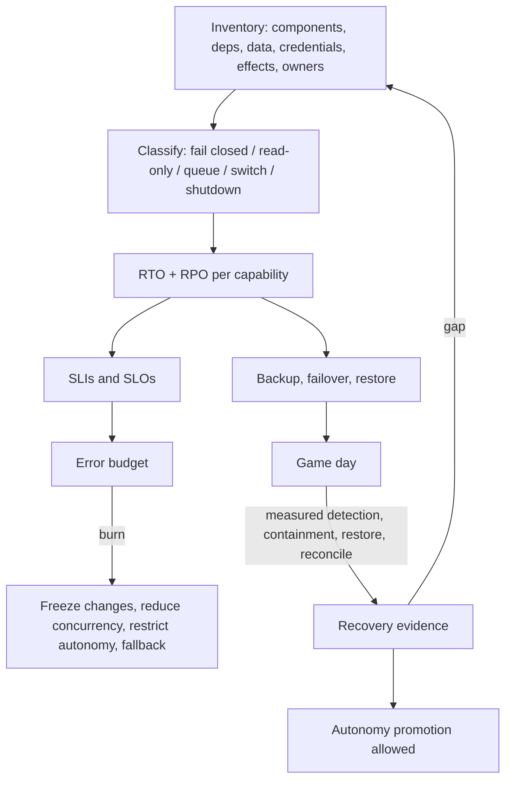
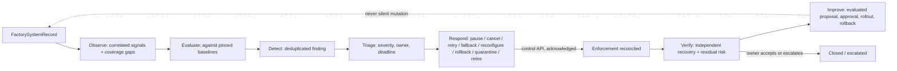
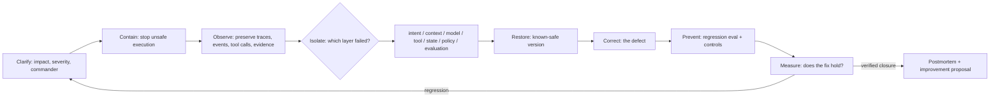

# 29. Resilience, incidents, and the control tower

The factory is itself a production system, and an unusual one: it has authority to change other production systems. When it breaks, the risk is not only that delivery stalls but that it keeps acting without knowing what it is doing. This chapter is about running it with that in mind. It covers failure domains and recovery objectives, how to fail over without creating two authorities, what the factory's SLOs and error budgets should govern, how reliability and cost ownership fit together, and the **control tower**: the single operating view where signals become findings, findings become authorised responses, and responses are verified before anyone calls the incident closed. It ends with an incident framework you can run on any of the eleven scenarios that show up in practice.

## The problem

Control-plane loss, corrupted state, an unavailable model provider, stale leases, a regional failure, a compromised credential, or a failed evidence store can each stall delivery or, worse, create unsafe ambiguity: work that may or may not have published, effects that may or may not have happened. A highly available worker fleet protects neither the authoritative records nor against duplicate external effects. The system spans control, execution, quality, identity, source, model, environment, artifact, deployment, and observability providers. Some failures are transient; others corrupt trust. Losing telemetry for ten minutes is usually tolerable. Losing authorisation or audit state may require an immediate halt.

The second problem is sight. Individual dashboards show calls, latency, cost, test results, policy events, or incidents, each in its own tool. An operator needs to know which governed system, release, autonomy grant, owner, and outcome are affected; what response is active; when it is due; and whether recovery has been independently verified. Without that spine, signals become noise and changes get made outside governance in the rush to fix things.

## How it works

### Failure domains, criticality, and recovery objectives

Start with an inventory: components, dependencies, authoritative data, derived data, credentials, external effects, and a recovery owner for each. Then classify each capability by what it does when its dependency is gone: **fail closed**, **degrade to read-only**, **queue safely**, **switch provider**, or **require emergency shutdown**. This classification is declared policy. Degradation that is improvised during an outage is how a factory ends up publishing with stale authority.

**Recovery time objective (RTO)**, how long until the capability is back, and **recovery point objective (RPO)**, how much acknowledged state may be lost, are set per capability, not per platform. A single platform-wide number hides the records that cannot tolerate any loss. Intent, policy, grants, and decisions need an RPO of zero or near zero, which may require synchronous durability. Telemetry can tolerate bounded loss with the gap marked. RTO and RPO are further scoped by region, risk, and failure mode.

| Subject | Authoritative or derived | Example RPO | Recovery behaviour | Verification |
| --- | --- | --- | --- | --- |
| Intent, policy, grants, decisions | Authoritative | Zero or near-zero by risk | Fail closed; restore ordered durable state | Integrity, sequence, signer, and policy checks |
| Workflow and attempt state | Authoritative | Bounded by checkpoint | Reconcile leases, commands, and external effects | State-machine invariant and orphan scan |
| Capability and system inventory | Authoritative | Small bounded loss | Restrict selection until current | Registry digest and dependency resolution |
| Artifacts and evidence | Immutable authoritative records | Zero after publication | Restore by digest with provenance | Hash, signature, retention, and subject binding |
| Search indexes and projections | Derived | Rebuildable | Rebuild from authoritative events and sources | Count, digest, and query comparison |
| Telemetry | Operational, partly lossy | Bounded | Restore collection; mark the observation gap | Coverage and clock/correlation checks |

### Preserving authority across failover

Failover is where most distributed systems are merely inconvenient and a factory is dangerous. A failover must not create two active authorities, reset budgets, reuse single-use permits, revive revoked capabilities, or duplicate a publication. The tools are the ones [Chapter 12](../03-build/12-durable-execution.md) introduced: **fencing tokens** and **generations** so a stale scheduler's writes are rejected, **leases** with expiry, **idempotency** on every external effect, **reconciliation** after any ambiguity, and an explicit **recovery mode** the system enters deliberately rather than drifts into.

The picture to hold is a ship's bridge changing watch: command is handed over explicitly, once, and logged, so there is never a moment with two people believing they have the helm, or none.

Six recovery operations are frequently confused, and each has a different safety precondition.

| Mechanism | Use | Safety precondition |
| --- | --- | --- |
| Retry | Repeat a failed operation | Idempotent contract or proven absence of effect; bounded backoff |
| Replay | Reprocess retained inputs | External effects disabled, simulated, or idempotently isolated |
| Resume | Continue a paused workflow | Revalidate manifest, policy, grants, capability, context, lease, and budget |
| Reconciliation | Establish truth after ambiguity | Query authoritative local and external records using correlation and idempotency keys |
| Failover | Use a prequalified alternate | Equivalent authority, data, version, capacity, and evidence path |
| Restore | Recover records or services from backup | Integrity, sequence, identity, and dependency verification |

Retrying without idempotency duplicates external effects. Retrying *with* an idempotency key is safe only if the provider preserves the key for the full uncertainty window and returns the original result. Reconciliation compares desired durable state against workers, queues, providers, artifacts, and downstream systems and classifies every effect as **absent**, **completed**, **failed**, or **unknown**. Unknown is a first-class state that demands investigation; it is never rounded to one of the others.

### Graceful degradation and emergency authority

Declared degraded modes include read-only operator access, stopping new admission while still allowing safe cancellation, retaining events locally when the collector is down, switching to prequalified model routes, and delaying publication. For each of provider outage, region loss, capacity exhaustion, dependency degradation, credential-issuer failure, and evidence-store unavailability, the policy says which work fails closed, queues, degrades, falls back, or shuts down. A fallback may change quality, latency, cost, data region, or tool behaviour and therefore needs explicit eligibility; it is never "whatever is still up." And during degraded assurance, **consequential release stops even if execution can continue**. The factory may keep working; it may not keep shipping.

**Break-glass** access for emergencies is narrowly scoped, time-limited, strongly authenticated, independently logged, and reviewed afterwards. Emergency action cannot silently erase history and cannot become the routine operating path. Failover uses preapproved identities and versions; the primary region being unavailable is not permission to bypass authority or evidence. Where safety permits, preserve forensic state before destructive repair.

### Recovery is unproven until exercised

Run **game days** against the real scenario list: provider outage, queue corruption or duplication, lost worker, expired or compromised credential, evidence-store failure, control-store corruption, identity-issuer outage, regional loss, model or tool provider degradation, artifact unavailability, and an unavailable human approver. Measure detection, decision, containment, restore, reconciliation, communication, and return to service. Backups are automated and their restoration verified on a schedule, not assumed. Autonomy promotion should require recent recovery evidence for the supporting platform; a factory that has never rehearsed losing its control store should not run at autonomy level four.

Topology is a tradeoff. Multi-region active-active improves availability and makes consistency and fencing harder; warm standby is simpler and slower. Chaos experiments reveal coupling and can harm shared environments, so begin with simulation and controlled fault injection. Keeping every provider fallback warm may cost more than accepting bounded unavailability. Start with the simplest topology that meets the scoped objectives.

<!-- infographic: slo-and-dr -->
> **Infographic — Recovery objectives, degraded modes, and the SLO loop.** *(Jay's graphic goes here.)* Until then, the diagram below carries the same concept.



### Factory SLOs and the error budget

The **service level indicators** for a factory are about the factory's own promises, not the software it ships.

| SLI | Scope | Example objective and response |
| --- | --- | --- |
| Admission availability and latency | Workflow, risk, region | Fast enough to avoid duplicate submissions; fail closed for authority |
| Dispatch latency | Priority class | Deadline-aware; alert on sustained queue age |
| State-transition durability | Control records | No acknowledged loss; reconcile any ambiguity |
| Tool and model success | Profile and dependency | Exclude policy and business rejections from provider reliability |
| Control enforcement time | Risk tier | Reserved capacity and escalation on breach |
| Verification completion | Quality contract | Separate a slow evaluator from a failed candidate |
| Accepted-outcome rate | Workflow slice | Tie reliability to actual accepted completion |
| Recovery time and point | Failure domain | Exercise against declared RTO and RPO |
| Cost budget adherence | System, workflow | Stop or escalate before the hard ceiling |

Two more belong on the list from the resilience chapter: successful reconciliation rate and proof-package availability. When the **error budget** burns, the responses are structural: freeze configuration changes, reduce concurrency, restrict autonomy or high-risk workflows, switch to a qualified fallback, and prioritise reliability work. One rule sits above the arithmetic: safety and security incidents are not offset by good average availability. They get direct incident policy, never a share of the budget.

### Who owns what: the operating contract

Reliability in a factory is a joint responsibility with hard edges. Platform operations owns the scheduler, queues, worker and environment capacity, service health, continuity, and the operational controls. Reliability owners set SLIs, SLOs, error budgets, alerts, and incident and recovery practice. Finance and product owners define budgets and value allocation. Workflow owners define deadlines and quality. Security can restrict or contain regardless of unused capacity. And no role may trade away a hard safety boundary to meet throughput. The operating unit is a governed workflow at an exact factory-system version, not an undifferentiated pool of model calls.

| Domain | Required contract | Control evidence |
| --- | --- | --- |
| Admission | Eligibility, risk, deadline, quota, full cost ceiling, dependencies | Decision, reason, reservation, policy version |
| Scheduling | Priority, aging, fairness, locality, concurrency, preemption | Queue decisions and starvation/fairness measures |
| Capacity | Model, tool, worker, environment, storage, CI, reviewer forecasts | Reservations, utilisation, saturation, forecast error |
| Budget | Per attempt, workflow, system, tenant limits and exception | Reserved, actual, avoided, unallocated cost ledger |
| Reliability | SLI, SLO, error budget, alert, owner, runbook | SLO windows, burn alerts, decisions, recovery tests |
| Continuity | Failure domains, RTO/RPO, backup, failover, reconciliation | Restore and failover exercise with retained gaps |
| Lifecycle | Version rollout, maintenance, deprecation, retirement | Change, compatibility, drain, and deletion records |
| Incident | Severity, command, communication, preservation, closure | Timeline, controls, notifications, verified recovery, postmortem |

The admission, scheduling, and capacity rows are specified in [Chapter 27](./27-the-factory-as-a-platform.md); the point of listing them here is that reliability owns their *evidence*. Capacity that is protected for cancellation, containment, reconciliation, verification, and incident response is a reliability control, not a scheduling nicety.

**FinOps** is the same discipline applied to money. Accepted-outcome cost is model + retrieval + tools + workers + environments + storage + network + CI + evaluation + delivery + failed and retried work + human attention, attributed by workflow, system, repository, tenant, capability, model profile, attempt, release, and outcome. Reservation is separated from actuals, accepted from failed work, marginal from shared allocation, and the allocation rule is recorded. Cost is optimised only alongside quality, latency, reliability, risk, and customer value; cost per token is not a factory outcome. [Chapter 28](./28-observability-telemetry-and-forensics.md) explains how the ledger is fed.

**Lifecycle** is resilience in slow motion. Models, tools, policies, schemas, workers, and environments roll through qualified versions, compatibility windows, canaries, drain, rollback, and retirement. Maintenance mode preserves status, cancellation, and emergency control. Deprecated dependencies publish deadlines and affected subjects. Retirement revokes authority, drains queues, reconciles external effects, retains required evidence, and deletes data under policy. Managed services reduce operational load but never transfer accountability for authorisation, data, evidence, cost, or continuity.

### The control tower

The **control tower** is one operating view that connects inventory, authority, health, quality, safety, cost, drift, incidents, response, and verified closure. Its operating loop is:

**Observe → Evaluate → Detect → Triage → Respond → Verify → Improve**

Its core rule: an anomaly may trigger investigation or containment; it must never silently rewrite prompts, policies, models, evaluators, or capabilities. And its evidence boundary: the tower is a projection. Authoritative records and retained evidence stay in their owning systems, and every action the tower offers invokes the same authorised control API used everywhere else. UI and API behaviour are equivalent.

Air-traffic control is the right analogy and the reason for the name. The tower sees every aircraft, but it flies none of them. It issues instructions through a defined channel, each instruction is acknowledged, and a controller who tried to fly a plane from the tower would be removed from the tower.

Every view starts from a **`FactorySystemRecord`**, the governed subject, and links its current lifecycle, risk, autonomy ceiling, owners, releases, workflows, capabilities, models, tools, data, policy decisions, denials, exceptions, evidence freshness, dependencies, incidents, cost, performance, and outcomes. The current response, if any, records owner, severity, state, deadline, action, acknowledgement, verification, and escalation.

<!-- infographic: control-tower -->
> **Infographic — The control tower loop and its subject model.** *(Jay's graphic goes here.)* Until then, the diagram below carries the same concept.



| Stage | Question | Owned output | Exit condition |
| --- | --- | --- | --- |
| Observe | What happened and what is the current state? | Correlated signals and coverage gaps | Required telemetry and evidence collected, or the gap recorded |
| Evaluate | Is behaviour inside quality, safety, policy, reliability, cost, and outcome bounds? | Evaluations against pinned baselines | Evaluation completes with stated uncertainty |
| Detect | Is there a meaningful change or violation? | Deduplicated finding with subject and candidate severity | Finding created, or normal variation recorded |
| Triage | What is the scope, urgency, owner, and likely class? | Severity, owner, deadline, incident link | Response decision made |
| Respond | Continue, contain, pause, retry, fallback, reconfigure, rollback, quarantine, or retire? | Authorised control actions | Enforcement acknowledged and reconciled |
| Verify | Is the system safe, correct, and restored? | Independent recovery result and residual risk | Named owner accepts closure or escalates |
| Improve | Which controlled change prevents recurrence? | Evaluated proposal, approval, rollout, rollback | Promotion or explicit rejection recorded |

### Signals, drift, and alert quality

The tower watches seven signal families, each against its own comparison.

| Signal family | Examples | Compared against |
| --- | --- | --- |
| Health | Queue age, dependency availability, errors, saturation | SLO and capacity baseline |
| Behaviour | Route, plan depth, tool sequence, stop reason, retries | Qualified configuration baseline |
| Model, context, tool, evaluator | Version, source mix, tool success, grader distribution | Pinned version and slice baseline |
| Quality and outcome | Acceptance, escaped defect, rollback, customer measure | Quality contract and outcome target |
| Safety, security, privacy | Policy denial, injection signal, data destination, credential anomaly | Zero-tolerance and risk thresholds |
| Cost and latency | Tokens, calls, environments, human time, end-to-end percentiles | Budget and service objective |
| Governance | Expired review, exception age, owner gap, evidence freshness | Inventory and control policy |

**Drift** is any of these moving away from its baseline, and it comes in many kinds: data, semantic, context, model, prompt, tool, evaluator, workflow, policy, cost, reliability, and business-outcome drift. Two cautions keep drift detection honest. A statistical change is not automatically harmful. A policy violation may be critical without any statistical significance at all.

Baselines are versioned by workflow, risk, repository class, tenant, model profile, and time window. Thresholds include absolute policy limits, rate and ratio changes, percentile shifts, budget burn, evidence expiry, and multi-signal conditions. Each detection rule names its owner, severity, window, minimum sample, uncertainty, false-positive disposition, deduplication key, suppression and maintenance rules, retention, privacy handling, and runbook. Suppression never hides a security incident or a control failure without a recorded exception. Repeated false positives produce a reviewed rule-change proposal; operators do not disable protection informally.

### Response actions and their authority

Nine actions cover the response space, and each is displayed with its requested effect, subject, authority, risk, evidence, deadline, expected acknowledgement, recovery implication, and alternate action.

- **Continue with observation**: the variation is explained and within policy.
- **Pause**: hold new steps at a safe checkpoint while preserving state.
- **Cancel**: end the work and reconcile partial effects.
- **Retry**: only under the operation's idempotency contract.
- **Fallback**: a prequalified alternative with explicitly changed limits.
- **Reconfigure**: through change control; never mutate live policy or prompts from an anomaly.
- **Rollback**: restore a known version and verify data and outcomes.
- **Quarantine**: block selection and isolate the affected subject.
- **Retire**: remove authority and traffic, retain evidence, delete by policy.

These are the production controls Jay's platform notes call non-negotiable, seen from the operator's side: retries, checkpointing, idempotency, permission boundaries, cost controls, kill switches, and approval gates. Pause and cancel are the kill switch; quarantine and retire are permission boundaries applied after the fact. None works at incident speed unless it was built before the incident.

A finding carries its whole life in one record, moving through `new`, `triaged`, `responding`, `contained`, `recovering`, `verifying`, and ending `closed` or `escalated`.

```yaml
finding:
  id: finding-811
  subject: factory-system:payments-delivery@7
  rule: behavior-drift/tool-sequence@3
  baseline: baseline:bounded-change@12
  observed_window: 2026-08-30T17:00:00Z/2026-08-30T18:00:00Z
  evidence_refs: [trace-query:91, evaluation:44]
  severity: high
  owner: role:runtime-oncall
  deadline: 2026-08-30T18:15:00Z
  response: quarantine-capability-version
  control_ref: control-command:204
  state: verifying
  recovery_evidence: evaluation:49
  residual_risk: "Affected prior releases under review"
```

Closure records detection quality, the response, the affected scope, verified recovery, residual risk, notifications, the postmortem, and the improvement disposition. Service restoration alone is not closure.

### The incident framework

When a finding becomes an incident, the tower's loop needs a human procedure inside it. The framework Jay uses is eight steps:

**Clarify → Contain → Observe → Isolate → Restore → Correct → Prevent → Measure**

*Clarify* the affected builders, workflows, and business impact; assign severity, an incident commander, technical leads, communications, decision owners, and deadlines. *Contain* by stopping or limiting unsafe execution; the immediate priorities are people and system safety, containment, state preservation, scope, and reliable communication. *Observe* by preserving traces, events, tool calls, and evidence before anything is repaired, so the [forensic bundle](./28-observability-telemetry-and-forensics.md) has what it needs. *Isolate* by determining **which layer failed**: intent, context, model, tool, state, policy, or evaluation. This is the step that distinguishes factory incidents from ordinary outages, because the same symptom (a bad change reached production) has seven different root causes with seven different fixes. *Restore* a known-safe version. *Correct* the immediate defect. *Prevent* recurrence by adding a regression evaluation and controls; the incident becomes an **incident-derived eval case** in the [evaluation suite](../04-prove/23-evaluation-engineering.md). *Measure* whether the fix holds, over a window, against the baseline.

<!-- infographic: incident-framework -->
> **Infographic — Clarify → Contain → Observe → Isolate → Restore → Correct → Prevent → Measure.** *(Jay's graphic goes here.)* Until then, the diagram below carries the same concept.



The framework applies to eleven recurring scenarios, and rehearsing each is the best way to find the controls you have not built.

| Scenario | Typical failed layer | First containment |
| --- | --- | --- |
| Production-agent failure | State, tool | Pause the workflow; preserve the Attempt |
| Security incident | Policy, tool | Revoke credentials; quarantine the capability |
| Reliability regression | State, evaluation | Freeze rollout; reduce concurrency |
| Model degradation | Model | Fallback to a prequalified route; restrict autonomy |
| Tool misuse | Tool, policy | Quarantine the tool version; reconcile effects |
| Cost explosion | State, policy | Stop new calls; preserve safe teardown |
| Prompt injection | Context, policy | Quarantine the source; retain the bundle |
| Unauthorised data or repository access | Policy | Revoke grants; audit scope |
| Failed deployment | Evaluation, state | Rollback; verify outcomes |
| Evaluation regression | Evaluation | Block promotion; recheck graders |
| Model-provider outage | Model | Scoped circuit; queue or fallback by eligibility |

The security scenarios in the table map onto the threat list in [Chapter 26](../04-prove/26-security.md). The layer column is a starting hypothesis, not a verdict; the *Isolate* step exists to test it.

Incident triage is itself a candidate for agent execution. The mission's **Workflow 5** runs alert → evidence collection → severity → hypotheses → root cause → recommendation → postmortem: the agent gathers evidence, forms hypotheses, and drafts the recommendation; a human owns severity and the response decision. Log and telemetry analysis, triage, and root-cause investigation are among the first tasks the operating model expects agents to absorb; incident *response*, the consequential action, stays with humans. The framework above is that workflow's harness.

### Operator experience

The tower is used by tired people at bad hours. Colour never carries state alone; tables, labels, timestamps, owner, severity, and next action give a complete text equivalent. Keyboard users can select subjects, inspect evidence, and invoke controls. Confirmations state the effect and the recovery implication. Loading, empty, stale, permission-denied, partial-data, success, failure, and unknown states are all explicit. A unified view can become a dangerous administrative super-console, so keep it a least-privilege projection with narrow control APIs, step-up authorisation for consequential actions, dual control where policy requires, and full audit.

## How to build it

1. **Inventory and classify.** List every component, dependency, authoritative and derived record, credential, external effect, and recovery owner. Declare the degraded mode for each.
2. **Set RTO and RPO per capability** using the recovery contract matrix. Make authority records synchronous-durable.
3. **Implement fencing, generations, leases, idempotency, and a recovery mode**, then prove no duplicate publication under a forced failover.
4. **Write the degradation policy** for the six dependency failures. Encode "consequential release stops during degraded assurance."
5. **Define SLIs, SLOs, and the error-budget policy**, with the burn responses and the rule that safety and security incidents bypass the budget.
6. **Write the responsibility model** and the operating matrix with control evidence for every row.
7. **Stand up the control tower** as a projection over the `FactorySystemRecord`, with the seven-stage loop, the signal catalog, versioned baselines, and the finding record.
8. **Implement the nine response actions** as control-API calls with acknowledgement and observed-verification deadlines separated.
9. **Adopt the incident framework** and rehearse it against all eleven scenarios, including the layer-isolation step.
10. **Run a game day** each quarter from the disaster scenario list; record detection, decision, containment, restore, reconciliation, communication, and return to service, and keep the gaps.
11. **Gate autonomy promotion on recent recovery evidence.**

**Closure checklist**

- Independent verification of recovery, not the responder's assertion.
- Downstream reconciliation complete, every effect classified, no `unknown` left open.
- Notifications sent; retained gaps written down.
- Forensic bundle sealed.
- Postmortem written; improvement proposal submitted through change control, not applied in place.
- The fix measured against baseline over the agreed window.

## Failure modes

| Failure | Detection | Containment | Verified recovery |
| --- | --- | --- | --- |
| Retry storm | Retry budget and dependency saturation | Open circuit, shed work | Stable dependency and reconciled backlog |
| Tenant starvation | Queue-age and fair-share metric | Rebalance weights, cap the noisy tenant | Fairness window returns to objective |
| Budget overrun | Reservation versus actual | Stop new calls; preserve safe teardown | Cost ledger reconciled and cause corrected |
| Split-brain scheduler | Duplicate lease and state-version conflict | Fence the stale scheduler | Single leader or lease authority and orphan scan |
| Failed failover | Health and invariant checks | Return to a safe unavailable state | Controlled second attempt or restore |
| Missing forensic data | Trace and evidence coverage check | Preserve remaining sources; record the gap | Instrumentation fixed and exercise repeated |
| Dashboard stale during incident | Last-updated age | Show authoritative links; use control APIs directly | Projection rebuilt and verified |
| Duplicate alerts | Subject, rule, window collisions | Deduplication and incident grouping | Rule keys corrected |
| Missing telemetry | Coverage alarm | Explicit uncertainty; do not infer normal | Collection restored, gap marked |
| Automated response loop | Repeated actions on one subject | Bounded actions, cooldowns, durable state, human escalation | Loop cause removed |
| Compromised signal source | Cross-source disagreement | Corroborate; protect evidence integrity | Source replaced or re-trusted with proof |
| Response command not enforced | Acknowledgement without observed change | Separate acknowledgement and verification deadlines | Observed enforcement recorded |
| Recovery causes regression | Post-recovery quality and outcome checks | Roll back the recovery | Independent re-verification |

Two failure modes deserve prose. **Availability over containment**: the system cannot prove its current authority, configuration, or evidence and keeps running because stopping looks worse. When the factory cannot prove those three things, availability yields to containment. **Silent self-repair**: an anomaly detector adjusts a prompt, threshold, or route to make the alert go away. That is governance bypass wearing an automation badge; every change goes through the Improve stage and [governed learning](../06-improve/33-governed-learning-and-compounding-engineering.md).

## In Mission Control

At the pinned study commit [`d902fae`](https://github.com/jaydubya818/MissionControl/tree/d902fae7032c0696b531c44ae88829c652516fc6), Mission Control implements the substrate this chapter depends on: durable Tasks and immutable Attempts, leases and heartbeats (with the durable lease and heartbeat implementation tested on PR #64 and not yet on `main` at study time), retry budgets, idempotency, events, artifacts, pause, drain, and kill controls, provider degradation handling in the model router, and health metrics. Ambiguous external effects still require reconciliation; older runs are historical rather than current evidence. Company, workspace, and repository boundaries and scoped records exist for tenancy.

Not implemented or proven: complete disaster recovery, regional failover, backup restoration, split-brain protection at the factory level, game-day evidence for the factory as a whole, a control tower with the seven-stage loop and finding record, the drift catalog and versioned baselines, the nine response actions as a unified control surface, or any stated SLO, RTO, RPO, cost, or failover result. The v1 references were explicit that they are review-ready designs, not demonstrated capability, and this chapter inherits that boundary.

## Retain this

- The factory has authority over other systems, so its reliability is a safety control. When it cannot prove current authority, configuration, or evidence, availability yields to containment.
- Classify every capability's degraded mode in advance; set RTO and RPO per capability, with zero loss for intent, policy, grants, and decisions.
- Failover never creates two authorities, resets budgets, reuses permits, revives revoked capabilities, or duplicates publication. Fencing, generations, leases, idempotency, reconciliation, and an explicit recovery mode make that true.
- Retry, replay, resume, reconciliation, failover, and restore each have a different safety precondition. Unknown is a first-class reconciliation state.
- Recovery is unproven until exercised. Autonomy promotion needs recent recovery evidence.
- SLOs cover the factory's promises: admission, dispatch, durability, enforcement, verification, accepted outcomes, recovery, and cost. Error-budget burn restricts change and autonomy; safety and security incidents never draw on the budget.
- The control tower is a projection, not a source of truth. Its loop is Observe → Evaluate → Detect → Triage → Respond → Verify → Improve, and it never silently rewrites prompts, policies, models, evaluators, or capabilities.
- Incidents run Clarify → Contain → Observe → Isolate → Restore → Correct → Prevent → Measure, and *Isolate* means naming which layer failed: intent, context, model, tool, state, policy, or evaluation. Closure requires independent verification, full reconciliation, a sealed bundle, and a change-controlled improvement.

## Go deeper

- [Chapter 7, Governance, policy, and risk-proportional approval](../02-design/07-governance-policy-and-risk-proportional-approval.md) for exceptions, break-glass, and step-up authorisation.
- [Chapter 12, Durable execution](../03-build/12-durable-execution.md) for fencing tokens, leases, idempotency, and reconciliation.
- [Chapter 17, Models: routing, profiles, and capability selection](../03-build/17-models-routing-and-capability-selection.md) for prequalified fallbacks and provider degradation.
- [Chapter 25, CI/CD, progressive delivery, and production verification](../04-prove/25-cicd-progressive-delivery-and-production-verification.md) for rollback and production feedback into release decisions.
- [Chapter 26, Security](../04-prove/26-security.md) for the threat list behind the security scenarios.
- [Chapter 27](./27-the-factory-as-a-platform.md) and [Chapter 28](./28-observability-telemetry-and-forensics.md) for the scheduling contract and the telemetry and forensic bundle the tower consumes.
- [Chapter 30, Control surfaces, event contracts, and storage](./30-control-surfaces-event-contracts-and-storage.md) for the control APIs the tower calls.
- [Chapter 33, Governed learning and compounding engineering](../06-improve/33-governed-learning-and-compounding-engineering.md) for the Improve stage.
- Labs: [Incident remediation and postmortem](../appendix/labs/07-incident-remediation-and-postmortem-lab.md); [Factory disaster recovery](../appendix/labs/09-factory-disaster-recovery-lab.md); [Orchestration failure, recovery, and cost](../appendix/labs/11-orchestration-failure-recovery-and-cost-lab.md).
- Primary references: NIST SP 800-34 Rev. 1, Contingency Planning Guide for Federal Information Systems (accessed 2026-08-30); Google SRE guidance on SLOs and error budgets.
- Sources: Jay West, reliability and security round notes, the Clarify → Contain → Observe → Isolate → Restore → Correct → Prevent → Measure framework, layer isolation, the incident scenario list, and production controls; Jay West, AI Software Factory mission, Workflow 5 (incident triage and RCA) and the task split between agents and humans.
