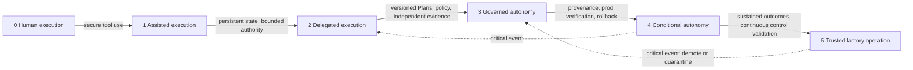
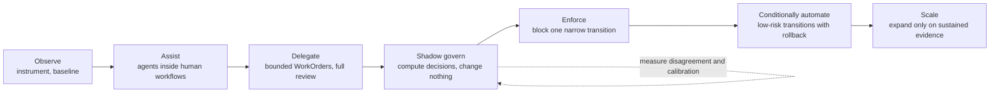
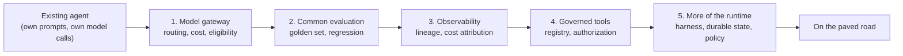
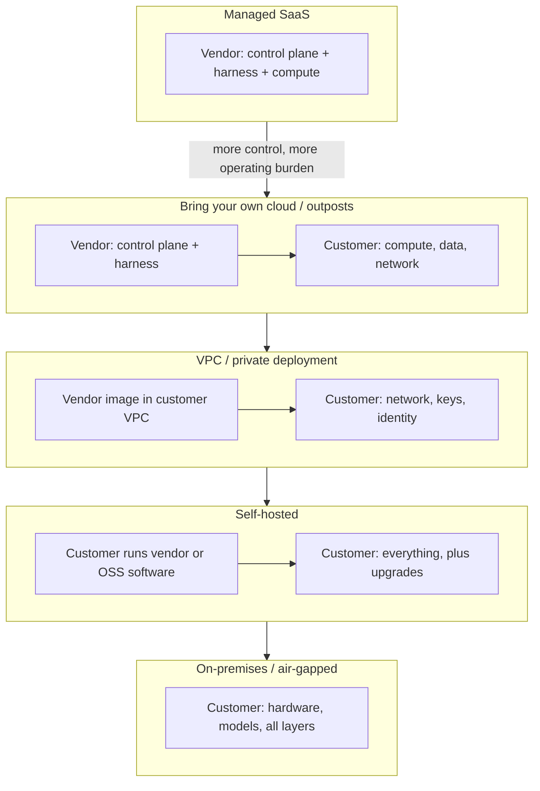

# 31. Enterprise adoption and the infrastructure landscape

The previous four chapters described how to run a factory. This one describes how an organization comes to be allowed to run one. It has three parts that usually get discussed separately and should not be: a **maturity model** that measures observable capability instead of ambition, an **adoption path** that expands autonomy one proven corridor at a time, and the **infrastructure landscape** of vendors, open-source projects, deployment topologies, and enterprise controls in which every one of those decisions is made. After reading it you should be able to rate a factory by dimension, defend the rating to a board, choose which layers to buy and which to build, and answer the security questionnaire before anyone sends it.

## The problem

Enterprises buy agent capability faster than they build the operating system required to govern it. A team can have excellent coding agents and no release governance; strong CI and no durable WorkOrder authority; a beautiful demo in one repository and nothing repeatable anywhere else. When leadership asks "how mature is our AI software factory?", the honest answer is a set of numbers by dimension and by scope, and what they usually get is a single adjective.

The label matters because it becomes authority. A team rated "advanced" is allowed to do things a team rated "pilot" is not. If the rating measures enthusiasm, model intelligence, or the percentage of code generated by AI, the authority it grants has no evidence behind it, and chapter [3](../01-understand/03-first-principles-trust-evidence-and-authority.md) explained why authority without evidence is the failure the whole factory exists to prevent.

The second problem is that the factory does not run in a vacuum. It runs on somebody's compute, inside somebody's network, under somebody's identity provider, subject to residency law and retention policy, and on top of a stack of languages, frameworks, model providers, and protocols that changes every quarter. The build-versus-buy question is not answered once. It is answered per layer, and the answer for an enterprise with data-residency obligations is different from the answer for a five-person startup. A factory that is technically excellent and cannot pass SSO, tenant isolation, and audit-retention review will not be deployed.

## How it works

### Maturity is observable capability, scoped

A maturity level describes what an organization can demonstrably do, with retained proof, in a specific scope. The scope is a repository, a workflow, a risk class, or an environment; it is never "the enterprise". The enterprise level, if anyone insists on one, is the lowest material capability required for the claimed use case, not the highest demo achieved anywhere.

The analogy is a hospital's accreditation. A hospital is not "Level 4" because its cardiology unit is excellent; the accreditation is per service line, the standards are about retained records and repeatable process, and a single serious event can suspend a service line's license the same week. Nobody would accept a hospital rated by how enthusiastic its surgeons are.

<!-- infographic: maturity-model -->
> **Infographic — The six maturity levels.** *(Jay's graphic goes here.)* Until then, the diagram below
> carries the same concept.

| Level | Operating mode | Required proof |
| --- | --- | --- |
| 0 — Human execution | AI suggests; humans perform and own all actions | Secure tool use and human review |
| 1 — Assisted execution | Human initiates bounded deterministic or generative tasks | Traceable inputs and outputs, conventional CI, no delegated authority |
| 2 — Delegated execution | Human approves a WorkOrder; factory implements; humans review material outputs | Persistent state, bounded authority, isolated Attempts, deterministic controls, review-ready PR |
| 3 — Governed autonomy | Factory may plan and execute within policy; independent validators prove quality; humans handle material risk | Versioned Plans, policy engine, independent evidence, recovery, audit, calibrated trust |
| 4 — Conditional autonomy | Policy may authorize merge or deployment for qualified low-risk scopes | Artifact provenance, production verification, rollback, SLOs, mature exception and demotion controls |
| 5 — Trusted factory operation | Humans govern policies and portfolios rather than routine individual work | Sustained evidence across production outcomes, continuous control validation, governed learning, rapid quarantine |

These levels line up with the autonomy levels of chapter [3](../01-understand/03-first-principles-trust-evidence-and-authority.md), but they describe the organization rather than a single scope's ceiling. Level 5 is an operating condition, not a badge. A critical event demotes or quarantines a scope immediately, and the dotted arrows in the diagram are as much part of the model as the solid ones.

An organization with widespread Copilot use and no governed WorkOrders is at Level 1 no matter how much code the assistants write, because nothing has been delegated: no persistent state, no bounded authority, no independent evidence. That is not a criticism. It is the correct starting point for the path below.

### Score eight dimensions, and let hard gates override averages

A single number hides the limiting constraint, so the model scores at least eight dimensions: specification, orchestration, quality and evidence, security and identity, delivery and operations, governance and roles, observability and economics, and learning and change control. Numeric scores show trends; bands (the levels above) communicate decisions. Two rules keep the scoring honest. The scope's level is the minimum across the dimensions that matter for the use case, not the mean. And hard gates override averages: a scope with a fabricated-evidence finding is not Level 3 however its other seven dimensions score.

### Advance through use-case corridors

Nobody transforms the whole SDLC at once. Adoption proceeds through a **corridor**: one repeatable, valuable, reversible use case, such as governed issue to validated pull request, the wedge workflow of chapter [20](../03-build/20-autonomous-engineering-workflows.md). The corridor gets a baseline before any agent touches it (lead time, change failure rate, human effort, wait time, satisfaction, control escapes) and is promoted only on evidence against that baseline. Prove Level 2 in the corridor, stabilize it, then run Level 3 decisions in shadow before enforcing any of them.

<!-- infographic: adoption-path -->
> **Infographic — The seven-step adoption path.** *(Jay's graphic goes here.)* Until then, the diagram below
> carries the same concept.

The seven steps are Observe, Assist, Delegate, Shadow govern, Enforce, Conditionally automate, and Scale. Shadow governance deserves a note because it is where most programmes quietly fail. Computing a policy or evidence decision without enforcing it is a learning phase only if the disagreement between the computed decision and the human decision is measured and the calibration is tracked. A shadow mode nobody reads is a delay, not a learning phase.

### Promote and demote on evidence

Moving a corridor from Level 2 to Level 3 needs a promotion rule stated in advance. The working default in this guide is at least 100 successful WorkOrders over 30 days, at least 99 percent independent validation success, zero critical policy or security violations, zero unauthorized actions, and an explicit human promotion decision. These are starting policy values, not universal science; riskier domains require more, and a payments repository should not use the same numbers as a documentation site.

Demotion is asymmetric. Failures decay in the scoring over time but never disappear from audit history. Some findings do not wait for the score: a security bypass, fabricated evidence, an unauthorized action, tampering with records, or a high-impact validation escape triggers immediate demotion or quarantine pending review. Chapter [7](../02-design/07-governance-policy-and-risk-proportional-approval.md) holds the policy mechanics; chapter [29](./29-resilience-incidents-and-the-control-tower.md) holds the quarantine mechanics.

### Change the organization, not only the tooling

A factory changes what each role is for. Product owners improve intent and acceptance criteria, because chapter [6](../02-design/06-intent-and-specification-engineering.md) made intent the input the whole system amplifies. Platform teams provide paved execution and evidence paths. Security encodes policy and reviews exceptions rather than reviewing every change. Quality engineers design assurance systems and adversarial validation rather than executing test plans. Staff engineers own invariants and architecture. Leaders measure customer value, risk, and cognitive load, not generated lines of code.

Adoption therefore needs training, role clarity, psychological safety for reporting failures (a factory whose operators hide escapes will never earn Level 3), and explicit accountability. Approval fatigue, the most common reason a Level 2 programme stalls, is reduced by evidence-centered reviews and exception routing, not by deleting accountability. The decision packet from chapter [30](./30-control-surfaces-event-contracts-and-storage.md) is the unit of that reduction.

Jay's platform-adoption notes describe the operating model that supports this: product-line design partners, builder listening sessions, forward-deployed engineers, internal champions, weekly usage reviews, release experiments, paved paths, migration support, a deprecation strategy, and adoption and reliability dashboards. The twelve adoption metrics on those dashboards are time to first successful workflow, task success, PR acceptance rate, human correction rate, model-routing quality, token cost per accepted outcome, reliability, repeat usage, time to onboard a new team, bespoke capabilities retired, builder satisfaction, and adoption across product organizations. They complement the delivery metrics of chapter [8](../02-design/08-economics-metrics-and-human-attention.md) by measuring whether the factory is used, not only whether it works.

### Tradeoffs: theater, uniformity, and hidden cost

Maturity models become compliance theater when they assess policy documents instead of workflows. The defence is to require retained proof and to rate what actually ran. Uniform enterprise standards improve control and suppress local learning; the resolution is to define mandatory boundaries centrally (identity, evidence, audit, quarantine) and let teams experiment inside them. Early automation shows fast savings while increasing hidden review and incident costs, so the measure is total human and operational effort, not agent hours saved.

### Build, buy, and compose

Chapter [2](../01-understand/02-the-factory-in-one-view.md) introduced the five-layer stack (compute, development environment, inner harness, outer harness, control plane and orchestration) as the frame for build-versus-buy. The practitioners in the HumanLayer and BAML conversation add the rule that makes the frame usable: **composition over inheritance**. Most buyers assume that whichever layer they buy at, they must also buy everything below it. The better answer is that an engineer should be able to choose each layer and plug open systems together.

Their own choices illustrate it. The BAML team picked the two layers they care about (orchestration and feedback-to-issue intake), explicitly do not want to own the harness because it changes all the time and should be swappable, and do not care whose box the compute runs on. HumanLayer sells the orchestration layer and expects you to bring your own harness. Cognition's Devin covers the top three layers and offers **outposts**: you run the compute, the outpost brings the harness and tooling into your environment, and vendor and customer co-own the development environment. Anthropic's Claude automations (routines, scheduled runs on a cron) bring the compute environment along with the harness, so a team that likes that harness can compose an all-in-one stack. A fully verticalized cloud agent, convenient as it is, brings friction in defining your development environment and limited choice of compute.

Two observations from that conversation matter for enterprises. First, enterprises want to bring the compute and probably parts of the development environment, and the largest will run the whole thing on-premises; a vendor that cannot separate harness from compute cannot sell to them. Second, on why there is no widely adopted open-source control plane: code is now so cheap to write that nobody wants someone else's control plane unless it arrives with the integrations built; the integrations (Slack, GitHub issues, a CLI, Linear) are the value; every company's working style has a different definition of what an issue even is; and the people building control planes want to sell products. The open-source options that exist tend to be another full stack that asks you to bring compute. So the control plane is the layer an enterprise is most likely to build or heavily adapt, and the harness is the layer to treat as replaceable.

The same conversation predicts that a LAMP-stack equivalent will eventually emerge for the factory stack. Until it does, the enterprise's protection is **extensibility**: an API surface into which Slack, the issue tracker, the CLI, and the company's own definitions can be plugged, and, since agents now write code, software that its users can extend. Chapter [36](../06-improve/36-where-this-is-going.md) follows that thread.

### Six questions per layer

Composition tells you that each layer is a separate decision. It does not tell you how to make it. For every layer, ask six questions, and write the answers down, because the answers change and the reasoning should be inspectable when they do.

<!-- infographic: build-vs-buy -->
> **Infographic — The six build-versus-buy questions.** *(Jay's graphic goes here.)* Until then, the table below
> carries the same concept.

| Question | What it is really asking | Points toward |
| --- | --- | --- |
| Differentiation | Does owning this create leverage no one else can give us? | Build if yes |
| Control | Do security, data, latency, or roadmap require us to hold it? | Build if yes |
| Maturity of the external option | Is there a stable, well-run solution, or a demo with a logo? | Adopt if mature |
| Switching cost | If we adopt and it goes wrong, how hard is leaving? | Adopt if an abstraction keeps exit cheap |
| Total cost of ownership | Build cost plus operate cost plus the opportunity cost of the team's attention | Adopt if the running cost dominates |
| Speed of learning | Which choice teaches us faster what the factory needs? | Whichever gets a real workflow running sooner |

The bias that falls out of those questions is consistent: build the durable control plane and the differentiating intelligence; adopt commodity infrastructure wherever an abstraction preserves optionality. In practice that means adopting an orchestration engine, an observability backend, and model providers, and owning the Agent Definition format, the evaluation contracts, the policy model, the builder experience, the capability interfaces, and the learning signals. The adopted pieces are replaceable behind a contract; the owned pieces *are* the contract. *Build where you need durable leverage; adopt where abstraction preserves optionality.*

### Existing agents: a gravity well, not a migration mandate

No enterprise starts from zero. By the time a platform team forms, product teams already have agents: a support bot, a test-generation script, a release helper, each with its own model calls, prompts, and half-built guardrails, each solving a real problem for the team that built it. The platform's first instinct, to mandate migration, is wrong twice over. It ignores what those agents got right, and it makes the platform the enemy of every team that has something working.

The better posture is a **gravity well**: make the platform the easiest place to be, one capability at a time, so that existing agents drift toward it because each step is worth taking on its own. The order matters, because each step has to pay for itself before the next is offered.

<!-- infographic: gravity-well -->
> **Infographic — Incremental adoption for existing agents.** *(Jay's graphic goes here.)* Until then, the diagram below
> carries the same concept.

The model gateway comes first because it is the cheapest step for the adopting team (change one endpoint) and the most valuable for the platform (cost attribution and model eligibility for everything that passes through it). Common evaluation comes second because a team that can see its agent's regression rate wants the next step. Observability, governed tools, and finally the runtime follow as trust accumulates. At no point is the team told to rewrite; at every point it is offered something that makes its existing agent better. *A gravity well, not a migration mandate.*

### The contribution model: centralize complexity, federate expertise

Once teams are on the platform, the question becomes who builds what. The answer that scales is a split along one line: the central platform team owns the contracts and the paved road; product organizations contribute domain intelligence inside those contracts.

<!-- infographic: contribution-model -->
> **Infographic — Centralize and federate.** *(Jay's graphic goes here.)* Until then, the table below
> carries the same concept.

| Centralized (platform team owns) | Federated (product organizations contribute) |
| --- | --- |
| Identity and authorization | Domain-specific skills |
| Model gateway and routing | Product knowledge and context sources |
| Harness and runtime | Specialized agents for a product's workflows |
| Tool governance (registry, contracts, policy) | Product-specific acceptance criteria |
| Skills framework (format, versioning, evaluation interface) | Differentiated workflows |
| Evaluation infrastructure | Evaluation cases for their domain |
| Observability and cost attribution | |
| Evidence interfaces and security controls | |

The left column is everything every team would otherwise rebuild badly; the right column is everything the platform team could never know well enough to build. *Centralize undifferentiated complexity; federate differentiated expertise.* Domain teams own their business workflows. The platform centralizes the expensive, risky, undifferentiated capabilities that would otherwise be reimplemented, with different bugs, in every organization.

### Forward-deployed engineering and its failure mode

An early platform needs engineers embedded with the teams adopting it. They see, in a way no dashboard shows, where onboarding breaks, where an abstraction does not fit the team's work, which capability is missing, and the exact moment a builder stops trusting the system. That is the right investment for the first year.

It has one failure mode, and it is common enough to plan against: the forward-deployed team becomes a permanent consulting layer whose skill at working around the platform hides the platform's weaknesses. The guard is a rule about where discoveries go. Every integration a forward-deployed engineer builds is a finding; the same integration built three times for three teams is a missing platform capability, and the third build is the one that should have been a platform ticket instead. The measure of the forward-deployed function is how quickly teams stop needing it. *Forward deployment accelerates the path to self-service; it does not replace it.*

### Multi-tenancy, layer by layer

A shared platform serving many product organizations is multi-tenant whether or not the word is used, and tenancy has to be designed at four layers, because each one leaks differently.

| Layer | What must be separated | Mechanism |
| --- | --- | --- |
| Identity | Who is asking, and which run is acting for them | Authenticated user plus a workload identity per run |
| Data | What context a run may see | Authorization applied *before* context reaches the model, not filtered from its output |
| Resources | Whose work runs when | Quotas, concurrency limits, and queue fairness against noisy neighbours |
| Memory | What the factory remembers across runs | Scoped by organization or domain unless deliberately promoted |

The data row is the one most often built wrong: filtering a model's *output* for things the user should not see is far weaker than never retrieving them, because the model's reasoning has already been shaped by what it read. The memory row is the one most often forgotten, because a shared memory that quietly learns one organization's conventions and applies them to another is a leak with no log entry. The aim is *a common platform with differentiated product behaviour*: shared rails, separate lanes.

### Three release clocks

A platform that ships everything on one release train is either too slow for its models or too fast for its contracts. Three clocks run at once.

<!-- infographic: release-clocks -->
> **Infographic — Three release clocks.** *(Jay's graphic goes here.)* Until then, the table below
> carries the same concept.

| Clock | What moves on it | Cadence and control |
| --- | --- | --- |
| Fast | Models, prompts, routing configuration | Continuous; evaluation-gated and instantly reversible |
| Medium | Skills and Agent Definitions | An artifact lifecycle: versioned, evaluated, promoted, deprecated |
| Slow | Runtime, APIs, durable contracts (execution manifest, evidence, event envelope) | Compatibility discipline, windows, and migration protocols (chapter [30](./30-control-surfaces-event-contracts-and-storage.md)) |

The fast clock exists because model quality and price change monthly and the factory should benefit without a release ceremony; the slow clock exists because running work is bound to the contracts and a change there is a migration. Versioning is what makes three clocks safe: Agent Definitions, skills, model configurations, tool contracts, evaluation sets, context policies, and runtime versions are all explicit, and nothing mutates silently. *You cannot operate a learning system safely if you cannot reconstruct which version learned what.*

### Deployment topologies

Where the factory runs is a distinct decision from who built it. Five topologies cover the enterprise conversation.

<!-- infographic: deployment-topologies -->
> **Infographic — Deployment topologies.** *(Jay's graphic goes here.)* Until then, the diagram below
> carries the same concept.

**Managed** SaaS is fastest to start and hardest to pass residency and egress review. **Bring your own cloud (BYOC)** and outposts keep source, secrets, and compute in the customer's account while the vendor operates the control plane; it is the topology the practitioners above expect enterprises to demand (chapter [14](../03-build/14-development-environments-sandboxes-and-compute.md) covers the execution-plane side). **VPC** deployment runs the vendor's software inside the customer's private network with customer-held keys. **Self-hosted** means the customer runs the software and owns upgrades. **On-premises or air-gapped** brings the models too, restricting the model choice of chapter [17](../03-build/17-models-routing-and-capability-selection.md) to what can be hosted. Each step trades operating burden for control; the maturity model applies identically in all of them, because topology does not change the evidence a level requires.

### The enterprise control checklist

The security questionnaire arrives whether or not the factory is ready for it. What it is really asking is whether your **AI Infrastructure** (the shared model, data, knowledge, tool, identity, runtime, environment, compute, telemetry, and evaluation services used to build and operate AI systems) has become **Enterprise AI Infrastructure**: the same services operated with explicit organizational identity, tenant isolation, data classification and residency, private networking, audit, policy, quota, support, lifecycle, and accountability requirements. Infrastructure supplies capabilities while product and control-plane contracts determine their authorized use, and "enterprise" names an operating obligation, not a product tier. The controls the questionnaire asks about fall into a stable set, and each maps to a chapter that explains how the factory provides it.

| Control | What the enterprise asks | Where the factory answers |
| --- | --- | --- |
| SSO, OIDC/SAML, SCIM | Can users and service identities be federated and deprovisioned automatically? | Identity model in chapter [26](../04-prove/26-security.md) |
| RBAC and ABAC | Are permissions by role and by attribute (repo, risk class, environment)? | Policy envelopes, chapter [7](../02-design/07-governance-policy-and-risk-proportional-approval.md) |
| Tenant isolation | Can one company, workspace, or repository see another's records or artifacts? | Scoped records and cross-scope tests, chapter [11](../03-build/11-control-plane-orchestrator-and-execution-plane.md) |
| Data residency and sovereignty | Where do records, artifacts, and model calls physically go? | Storage policy by data class, chapter [30](./30-control-surfaces-event-contracts-and-storage.md); model routing constraints, chapter [17](../03-build/17-models-routing-and-capability-selection.md) |
| Private networking | Can the execution plane run without public ingress? | Sandboxes and BYOC, chapter [14](../03-build/14-development-environments-sandboxes-and-compute.md) |
| DLP and egress controls | What can an agent send out, and to whom? | Egress policy and capability manifests, chapters [14](../03-build/14-development-environments-sandboxes-and-compute.md) and [26](../04-prove/26-security.md) |
| BYOK and key management | Who holds the encryption keys? | Secrets and key custody, chapter [26](../04-prove/26-security.md) |
| Audit retention and legal hold | How long are decision records kept, and can they be frozen? | Retention by data class, chapter [30](./30-control-surfaces-event-contracts-and-storage.md) |
| Quotas, chargeback, showback | Who pays for tokens and compute, and can it be attributed? | Budgets and cost attribution, chapter [8](../02-design/08-economics-metrics-and-human-attention.md) |
| Deployment topology | Managed, self-hosted, BYOC, VPC, or on-premises? | This chapter |
| Licensing model | Open source, open-core, or source-available? | This chapter |
| License governance | Are dependency and model licenses tracked and compatible? | Supply chain, chapter [26](../04-prove/26-security.md) |
| Maintainer and project-health risk | Will this project exist in three years? | This chapter |
| Upgrade and compatibility policy | How do versions change without breaking runs? | Compatibility windows, chapter [30](./30-control-surfaces-event-contracts-and-storage.md) |
| Enterprise support and SLA | Who answers at 3 a.m., and what is promised? | Platform SLOs, chapter [27](./27-the-factory-as-a-platform.md) |
| Extensibility and vendor-exit criteria | Can we plug in our tools, and can we leave? | This chapter |

Three rows are about the vendor rather than the factory. **Open source versus open-core versus source-available** decides what you may run, modify, and redistribute: open source grants all three; open-core keeps the enterprise features (usually exactly the SSO, RBAC, and audit rows) proprietary; source-available lets you read and often self-host but restricts commercial use. **Maintainer and project-health risk** asks whether a project with two maintainers and a venture-funded sponsor will exist when the three-year plan ends; bus factor, release cadence, issue response time, and governance model are the observable signals. **Vendor-exit criteria** are written before signing: records exportable in a documented schema, a replaceable harness, a control plane with an API rather than only a UI, and an evidence store readable without the vendor. Composition over inheritance is the design principle; exit criteria are its contractual form.

### The technology landscape, dated

The stack a factory runs on changes quickly, so any list is a snapshot. The table below summarises the categories from Jay's platform and runtime glossary as of September 2026, with representative examples rather than endorsements. When a vendor says "we do X", the reader should know which row X lives in and what the factory expects of that row.

| Category | Representative technologies | What the factory expects of it |
| --- | --- | --- |
| Languages and runtimes | Python (AI, agent, model services); TypeScript/JavaScript on Node.js (platform services, builder experiences) | Typed contracts at boundaries; mixed stacks are normal |
| Service frameworks | FastAPI; REST APIs; GitHub Apps and internal APIs | Authenticated, idempotent intake; provider boundaries owned by the control plane |
| Model providers | OpenAI, Anthropic Claude; Codex and Claude Code as coding harnesses | Abstraction and routing by capability, quality, security, latency, reliability, cost (ch. [17](../03-build/17-models-routing-and-capability-selection.md)) |
| Agent frameworks and SDKs | Agent SDKs; LangGraph (graph and state-machine orchestration); multi-agent patterns | Durable state outside model context; explicit loops (ch. [15](../03-build/15-agent-architecture.md), [18](../03-build/18-agent-and-loop-engineering.md)) |
| Harnesses | Codex, Claude Code behind generic harness contracts | Replaceable; normalized results; capability manifests (ch. [13](../03-build/13-coding-harnesses-and-agent-protocols.md)) |
| Tool protocols | MCP; FastMCP; tool registries | Governed tool exposure; per-capability policy |
| Knowledge and retrieval | RAG; embeddings; BM25; vector search; hybrid retrieval; reranking; citations; permission-aware retrieval | Provenance, freshness, source attribution; similarity is never evidence (ch. [16](../03-build/16-data-knowledge-semantic-and-context-engineering.md)) |
| Ingestion and data pipelines | ETL; Prefect; sources such as Jira, Confluence, Slack, internal documentation | Permission-aware ingestion with lineage |
| Durable state and storage | Convex (Mission Control's control-plane store); object stores; search indexes; vector databases; warehouses | Truth boundaries per store (ch. [30](./30-control-surfaces-event-contracts-and-storage.md)) |
| Execution environments | Docker; agent sandboxes; process isolation; git worktrees; worker runtimes | Isolation, leases, idempotency, teardown (ch. [12](../03-build/12-durable-execution.md), [14](../03-build/14-development-environments-sandboxes-and-compute.md)) |
| Observability and evaluation | Tracing; Langfuse; evals and retrieval evals; provenance records | Diagnostics distinct from acceptance evidence (ch. [23](../04-prove/23-evaluation-engineering.md), [28](./28-observability-telemetry-and-forensics.md)) |
| Delivery | Git and GitHub; CI/CD; progressive delivery; production evaluation | Independent verification before merge; rollback proof (ch. [25](../04-prove/25-cicd-progressive-delivery-and-production-verification.md)) |
| Developer tooling | Cursor; VS Code; Postman | Builder convenience; never a source of authority |

The same glossary places these technologies in a five-part enterprise composition: an **agent runtime** (harness plus execution platform) where agents execute; an **enterprise knowledge layer** where agents get trusted, permission-aware enterprise context; an **Agent Factory** where reusable capabilities are built and managed (chapter [10](../03-build/10-the-agent-factory.md)); the **Software Factory** that composes them with the existing supply chain into a governed path from builder intent to trusted production; and **Mission Control**, the control plane that governs the delivery. The one-line version: *the Agent Factory creates, the runtime executes, knowledge grounds, the Software Factory delivers, and Mission Control governs.* Language and framework choices are made per subsystem (Python where the model and retrieval work lives, TypeScript where the platform services and builder experiences live), not ideologically, and the lightest orchestration model that satisfies the workflow wins. Chapter [19](../03-build/19-the-12-layer-production-ai-agent-stack.md) gives the twelve-layer view of the same landscape from the agent's side.

### What breaks first at scale

The bottleneck in an agentic organization does not stay where it started. At the beginning it is generation: can the agents produce useful change at all? That constraint is gone within months, and four others take its place, usually in this order.

**Cost** breaks first, because experimentation outpaces attribution. Teams discover what agents can do faster than finance discovers what it cost, and the first sign is a bill nobody can explain by workflow. The cure is the cost-per-trusted-outcome ledger of chapter [28](./28-observability-telemetry-and-forensics.md), in place before the experiments, not after.

**Context** breaks second. Enterprise repositories are enormous, knowledge sources are scattered across wikis and trackers and chat, permission boundaries cut through all of them, and a meaningful fraction of the documentation is stale. Retrieval that worked for one team's repository fails for the organization, and it fails quietly, by grounding confident answers in obsolete documents.

**Supply-chain capacity** breaks third. Pull requests, CI minutes, security scans, artifact storage, and review demand were all sized for human-speed generation. A factory that produces ten times the pull requests produces ten times the CI load and ten times the review requests, and the review side cannot scale linearly, which is the argument of chapter [32](../06-improve/32-production-feedback-review-and-the-agentic-merge-queue.md).

**Trust** breaks last and worst. One visible autonomous mistake undoes months of adoption, and the technical system recovers from it faster than the developers do. Everything in Parts IV and V exists to keep that mistake from being visible, or from happening.

*The bottleneck will keep moving; design the factory to see where it moves next.* That is why the four kinds of health in chapter [28](./28-observability-telemetry-and-forensics.md) are all on the same dashboard.

### Five lessons from enterprise scale

Large platform organizations that have run agentic delivery across many product teams converge on the same lessons, and they are worth stating before the roadmap because the roadmap assumes them.

1. **The platform owns the workflow, not the model.** Models change under you; the harness, context, evaluation, and authority around them are what you keep.
2. **The paved road must beat the workaround.** Adoption cannot be mandated. If the governed path is slower than a laptop and a personal API key, the laptop wins, and the platform learns about it in an incident.
3. **Trust becomes the bottleneck as generation scales.** Producing change stops being hard long before proving it is safe does.
4. **Enterprise context and tools get complicated fast.** Retrieval is a permissions, provenance, freshness, and relevance problem before it is a search problem; and the moment a model gets a tool, intelligence becomes authority.
5. **Agent platforms become infrastructure earlier than expected.** The reliability dimensions of chapter [29](./29-resilience-incidents-and-the-control-tower.md) are needed months before anyone plans to need them.

The sentence that holds the five together: *do not just scale agents; scale the system that makes their work trustworthy.*

### The first year and the next five

The mission plan behind this guide lays out a twelve-month path that follows the corridor logic above, in six phases.

| Months | Phase | Produces |
| --- | --- | --- |
| 1–2 | Define | Manifesto, human-agent operating model, mission lifecycle, risk and autonomy model, initial architecture, success metrics, ideal customer profile, first workflow definition, product narrative. The one decision: which single workflow proves the model (governed issue-to-PR delivery). |
| 3–4 | Build the core | Mission creation, WorkOrder generation, agent registry, role and permission model, planning workflow, human approval gate, execution runner, evidence storage, audit trail, PR integration, basic cost tracking; end to end through the UI. |
| 5–6 | Establish validation | Automated test generation and execution, code-quality and security checks, agent review, acceptance-criteria verification, failure and retry handling, human escalation, final evidence package. Goal: one real mission from issue to validated PR. |
| 7–8 | Pilot | A real repository; at least ten defect, ten small-feature, five documentation, and five test-improvement missions. Measure time saved, human effort, success rate, failure modes, review quality, agent cost, defect outcomes. |
| 9–10 | Harden | Reliability, security, permissions, sandboxing, model routing, workflow recovery, observability, cost controls, policy configuration, enterprise integration. Two strong case studies. |
| 11–12 | Commercialize | Product demonstration, executive pitch, architecture brief, security overview, ROI model, pricing hypothesis, pilot package, onboarding process, design-partner agreement. Three to five serious design partners. |

The pilot phase is the Observe-through-Delegate stretch of the adoption path, run on purpose; hardening is where the enterprise checklist gets filled in.

The five-year roadmap extends the same shape. Year one proves the model: an MVP, one repeatable workflow, measurable results, design partners, a category narrative. Year two proves repeatability across workflows, repositories, and teams, improves governance, establishes ROI, builds a small expert team, and earns early revenue or a major internal mandate. Year three proves enterprise scale: multiple business units, enterprise system integration, strong security and compliance, organization-level productivity evidence, public recognition for the operating model. Year four leads the category, expanding beyond development into operations, incidents, security, and platform work, building an ecosystem of agents, models, tools, and workflow templates, and publishing the definitive playbook. Year five is the operating standard: the control plane becomes an enterprise control plane and the human-agent software factory a recognized field. Each year's claims rest on the previous year's retained evidence, which is the maturity model applied to the roadmap itself.

### The first ninety days, in outline

For the leader who inherits an organization already using agents, the twelve-month plan starts with a ninety-day stretch whose shape is the same in every enterprise. Chapter [35](../06-improve/35-mastering-the-factory.md) carries the full version; the outline here is enough to see how it connects to the adoption path above.

| Days | Emphasis | Output |
| --- | --- | --- |
| 1–30 | Understand before reorganizing: map existing agents, harnesses, tooling, CI/CD integration points, evaluation approaches, model usage, security boundaries, design partners, and expertise; baseline reliability, cost, adoption, evaluation coverage, and builder friction | What exists, what belongs centrally, the biggest risks, the first design-partner workflows |
| 30–60 | Align the founding team on a few durable contracts (Agent Definition, execution contract, tool-authorization boundary, context contract, evaluation interface, versioning, observability lineage); prove one end-to-end path with the design partners | A working workflow, a golden evaluation set, a cost baseline |
| 60–90 | Harden: move proven workflows toward self-service; stand up the contribution model, evaluation and production-readiness gates, initial SLOs, and operating ownership; put forward-deployed engineers where the friction is; make build-versus-buy decisions on evidence | A platform other teams can join without the founding team in the room |

Two things are deliberately absent from the first ninety days: a prebuilt architecture carried in from elsewhere, and a migration of existing agents. Also absent: scaling the team around speculative boundaries, adaptive model routing before evaluation data exists, and recursive self-improvement before a trustworthy baseline. *One complete workflow exposing real weaknesses beats ten disconnected demos.* And the closing caution: *the patterns transfer; the implementation has to be yours.*

### Explaining it to eight audiences

Adoption is a persuasion problem as much as an engineering one, and each audience needs the same system in its own terms.

To a **CEO**, the factory reduces the time between strategy and customer value; the company executes more continuously while humans stay accountable for consequential decisions.

To a **CFO**, it improves output per engineering dollar by automating repeatable execution, reducing rework, shortening cycle time, and allowing growth without headcount rising at the same rate; the chargeback and showback controls above are what make that claim auditable.

To a **CTO**, it is a governed platform for orchestrating AI agents across the lifecycle, with permissions, evaluations, human approval, auditability, and production feedback built in rather than bolted on.

To a **Chief Product Officer**, it shortens the delay between customer insight and validated product learning; product teams test smaller hypotheses faster while quality controls hold.

To a **security leader**, every agent operates through a defined identity, minimum permissions, approved tools, isolated environments, policy checks, and auditable actions; the control checklist above is the questionnaire answered in advance.

To an **engineering manager**, the role shifts from coordinating repetitive execution to defining outcomes, managing risk, developing people, improving systems, and reviewing the quality of decisions.

To a **developer**, the aim is not to remove judgment but to remove repetitive work and waiting, so time goes to architecture, product decisions, hard debugging, and technical creativity.

To a **board**, it is an engineering-leverage strategy with a governance model: faster delivery and better economics without accepting uncontrolled operational risk, and the credible message is "we expand proven corridors", never "AI transforms everything".

## How to build it

**Assess**

1. Pick the scope: one repository, workflow, risk class, or environment. Never rate "the company".
2. Score the eight dimensions using retained proof only, citing the artifact for every score.
3. Take the minimum across material dimensions as the level; let hard gates (fabricated evidence, unauthorized action, security bypass) cap it regardless of the rest.
4. Name the limiting dimension and the smallest 30-day experiment that would move it.

**Adopt**

1. Choose one repeatable, valuable, reversible corridor; governed issue to validated PR is the default.
2. Baseline it: lead time, change failure rate, human effort, wait time, satisfaction, control escapes.
3. Walk the seven steps in order; in shadow, record disagreement and calibration.
4. Write the promotion rule and the immediate-demotion triggers before the first run.
5. Stand up the adoption operating model (design partners, builder listening sessions, forward-deployed engineers, champions, weekly usage reviews, paved paths, migration support, deprecation strategy) and the dashboard carrying the twelve adoption metrics.
6. Change roles explicitly, train for them, and protect the reporting of escapes.

**Choose infrastructure**

1. Decide layer by layer whether to buy, build, or compose, answering the six questions (differentiation, control, external maturity, switching cost, total cost of ownership, speed of learning) in writing. Treat the harness as replaceable and the control plane as the layer you will most likely adapt.
2. Bring existing agents in through the gravity-well order: model gateway, common evaluation, observability, governed tools, runtime. No migration mandate.
3. Publish the contribution model (centralized contracts and paved road; federated domain skills, knowledge, agents, acceptance criteria) and the three release clocks with their controls.
4. Design tenancy at all four layers: identity, data, resources, memory.
5. Fund forward-deployed engineers with an explicit rule that a third repeated integration becomes a platform capability, and measure how quickly teams stop needing them.
6. Choose the deployment topology from residency, networking, and key-custody requirements, not convenience.
7. Fill the enterprise control checklist before the questionnaire arrives; for each row name the mechanism and the retained evidence.
8. For every vendor and open-source dependency record licensing model, project-health signals, upgrade policy, support terms, and vendor-exit criteria (exportable records, replaceable harness, API surface, readable evidence store).
9. Date the landscape table and revisit it quarterly.

**Communicate**

1. Prepare the eight audience paragraphs for your own factory, each grounded in a retained metric.
2. Build the maturity evidence dashboard: per repository and workflow, prerequisites, last accepted proof, incidents, exceptions, autonomy ceiling, next gate.

## Failure modes

**Enthusiasm rated as maturity.** The rating reflects model quality, demo impressiveness, or percentage of AI-written code. Ask for the retained proof behind each dimension; if the answer is a slide, the rating is a slide.

**One label for the enterprise.** A Level 3 documentation bot lifts the whole company to "Level 3" and a payments repository inherits authority it never earned. Scope every rating and publish the limiting dimension per scope.

**Shadow mode as delay.** Policy decisions are computed and nobody compares them with human decisions. The absence of a disagreement metric is the tell; calibration is the exit criterion.

**Compliance theater.** The assessment reviews policy documents while the real workflow bypasses them. Assess a random real WorkOrder against the policy; rate workflows, not documents.

**Promotion without a rule, demotion that waits for the score.** A corridor is promoted because a quarter ended, or a fabricated-evidence finding is averaged away. Look for the promotion decision record and its evidence; check that hard-gate findings exist in the model at all.

**Hidden cost.** Agent hours saved are reported while review and incident hours grow. Measure total human and operational effort against the corridor baseline.

**Buying the whole stack by accident, or a vendor without an exit.** A team buys orchestration and discovers it has also bought the harness, the compute, and a residency problem; or records live only in the vendor's UI. Check each layer against the exit criteria at contract time and attempt an export before signing.

**The migration mandate.** Existing agents are ordered onto the platform, the teams that own them dig in, and the platform's first year is spent in negotiations instead of on workflows. Offer the model gateway first and let the value pull.

**The permanent consulting layer.** Forward-deployed engineers become the way anything gets done, each integration is bespoke, and the platform never learns what it is missing. Count repeated integrations; the third one is a platform ticket. Measure teams that no longer need help.

**One release train.** Model updates wait for a quarterly runtime release, or a runtime contract changes on a model's cadence and breaks running work. Separate the three clocks and give each its own control.

**Building everything first.** The platform team ships a universal memory layer, adaptive routing, a multi-agent orchestrator, and a hundred generic skills before a single workflow runs end to end. Each is a hypothesis without production evidence. Prove one path with design partners; protect the seams (identity, interfaces, policy, evidence, evaluation, versioning); do not generalize before the abstraction is earned.

**Unmaintained dependency.** The harness or framework the factory depends on stops releasing. Review project-health signals quarterly; keep the harness replaceable.

**Questionnaire surprise.** The security review arrives and the factory has no answer for SCIM, tenant isolation, or legal hold. Fill the control checklist before the pilot and treat each row as a factory requirement, not a sales obstacle.

## In Mission Control

The v1 assessment was pinned at [`a490648`](https://github.com/jaydubya818/MissionControl/tree/a49064875d0711253d74029e3066cc74c7c1c2a5), with staged-only work excluded from any maturity claim. At that commit Mission Control expressed several Level 2 foundations: governed Missions, Plans, and WorkOrders; Tasks and Attempts; leases; execution manifests; receipts; approval records; policy concepts; model routing; and operator views, with study branches adding stronger sandbox and publication controls. It had not earned a product-wide Level 3 claim: QC adapters were mocked, release automation ran in shadow mode, policy configuration had blocked the golden path, and the complete browser-initiated flow lacked accepted retained evidence. The honest rating was capability-specific: architecture and domain model approached Level 2/3 design; the supported end-to-end operating proof remained below that.

The later study commit [`d902fae`](https://github.com/jaydubya818/MissionControl/tree/d902fae7032c0696b531c44ae88829c652516fc6) adds material for the enterprise checklist: company, workspace, and repository boundaries with membership authorization, scoped records, and cross-scope tests (tenant isolation); server-side permissions, risk classes, policy envelopes, approval records, and separation of duties (RBAC and governance); feature flags, immutable versions, and migration guidance (upgrade policy); presentation modes that do not alter authority. Fleet-scale and cross-organization load are not established by repository tests, broad adoption remains a future operating proof, and the production admission packet remained blocked by operator configuration. Against the four tenancy layers, identity and data scoping are the layers with evidence; resource fairness across organizations and organization-scoped memory promotion are not demonstrated. Mission Control is an active personal project with the control-plane architecture and substantial deterministic qualification implemented; it is not positioned as fleet-scale production running hundreds of live agents, and no contribution model, forward-deployed function, or three-clock release process exists around it.

Future: a maturity evidence dashboard by repository and workflow (prerequisites, last accepted proof, incidents, exceptions, autonomy ceiling, next gate). The first promotion target remains governed issue to validated pull request; deployment autonomy waits for signed artifact identity, production observation, and rollback proof. SSO/SCIM federation, BYOK, residency controls, DLP and egress policy, and chargeback are not claimed.

## Retain this

- Maturity is observable capability with retained proof, scored per scope and per dimension; the level is the minimum across material dimensions, and hard gates override averages.
- Six levels: human execution, assisted, delegated, governed autonomy, conditional autonomy, trusted factory operation. Level 5 is an operating condition; a critical event demotes or quarantines immediately.
- Advance through one corridor at a time along seven steps: Observe, Assist, Delegate, Shadow govern, Enforce, Conditionally automate, Scale. Shadow mode counts only when disagreement and calibration are measured.
- Write the promotion rule and the demotion triggers before the first run. Failures decay in scores and never leave the audit.
- Change roles, not only tools; reduce approval fatigue with evidence-centered review and exception routing, never by deleting accountability.
- Build, buy, and compose layer by layer, on six questions: differentiation, control, external maturity, switching cost, total cost of ownership, speed of learning. Build where you need durable leverage; adopt where abstraction preserves optionality. The harness is replaceable; the control plane is the layer you will most likely adapt; enterprises bring their own compute and parts of the dev environment.
- Existing agents are a gravity well, not a migration mandate: model gateway, then common evaluation, then observability, then governed tools, then the runtime.
- Centralize undifferentiated complexity (identity, gateway, runtime, tool governance, skills framework, evaluation, observability, cost, evidence, security); federate differentiated expertise (domain skills, knowledge, specialized agents, acceptance criteria, workflows).
- Forward deployment accelerates self-service; it does not replace it. The same integration built three times is a missing platform capability.
- Tenancy has four layers (identity, data, resources, memory); authorize before context reaches the model. Three release clocks (models and routing; skills and definitions; runtime and contracts), all explicitly versioned.
- What breaks first at scale: cost, then context, then supply-chain capacity, then trust. The bottleneck keeps moving; build the factory to see where it moves next.
- Five lessons: the platform owns the workflow; the paved road must beat the workaround; trust becomes the bottleneck; context and tools get complicated fast; agent platforms become infrastructure early. Scale the system that makes agents' work trustworthy, not just the agents.
- The first ninety days: understand, then align on a few durable contracts and prove one workflow, then harden toward self-service. No imported architecture, no migration mandate, no self-improvement before a baseline.
- Choose topology (managed, BYOC, VPC, self-hosted, on-premises) from residency, networking, and key custody. Fill the enterprise control checklist before it is sent to you, and write vendor-exit criteria before signing.
- The credible executive message is "we expand proven corridors."

## Go deeper

- Related chapters: [2. The factory in one view](../01-understand/02-the-factory-in-one-view.md) · [3. First principles](../01-understand/03-first-principles-trust-evidence-and-authority.md) · [7. Governance, policy, and risk-proportional approval](../02-design/07-governance-policy-and-risk-proportional-approval.md) · [8. Economics, metrics, and human attention](../02-design/08-economics-metrics-and-human-attention.md) · [14. Development environments, sandboxes, and compute](../03-build/14-development-environments-sandboxes-and-compute.md) · [19. The 12-layer production AI agent stack](../03-build/19-the-12-layer-production-ai-agent-stack.md) · [26. Security](../04-prove/26-security.md) · [27. The factory as a platform](./27-the-factory-as-a-platform.md) · [33. Governed learning and compounding engineering](../06-improve/33-governed-learning-and-compounding-engineering.md) · [35. Mastering the factory](../06-improve/35-mastering-the-factory.md) · [36. Where this is going](../06-improve/36-where-this-is-going.md)
- Glossary: [maturity level, corridor, shadow governance, BYOC, vendor-exit criteria](../appendix/glossary.md)
- Case studies: [Mission Control implementation maturity and evidence map](../appendix/mission-control/01-implementation-maturity-and-evidence-map.md) · [Capability, workflow, and admission map](../appendix/mission-control/03-capability-workflow-and-admission-map.md) · [Coverage and maturity](../appendix/coverage-and-maturity.md)
- Sources: HumanLayer × BAML livestream, "Software factory design patterns" (Dexter and Vaibhav), on composition over inheritance, outposts, and why there is no open-source control plane; Jay West, "The 12-layer production AI agent stack" coverage audit, section 13 (enterprise and open-source infrastructure); Jay West, agent platform and runtime technology glossary; Jay West, AI Software Factory mission (twelve-month plan, five-year roadmap, adoption metrics); Jay West, audience-framing notes (the eight audiences); Jay West, factory architecture notes, on build versus buy, the contribution model, existing agents, forward-deployed engineering, multi-tenancy, release clocks, scale bottlenecks, the five lessons, and the first ninety days
- External canon: [DORA delivery metrics](https://dora.dev/) · [NIST Secure Software Development Framework](https://csrc.nist.gov/projects/ssdf) · Team Topologies (Skelton and Pais) · Google SRE
