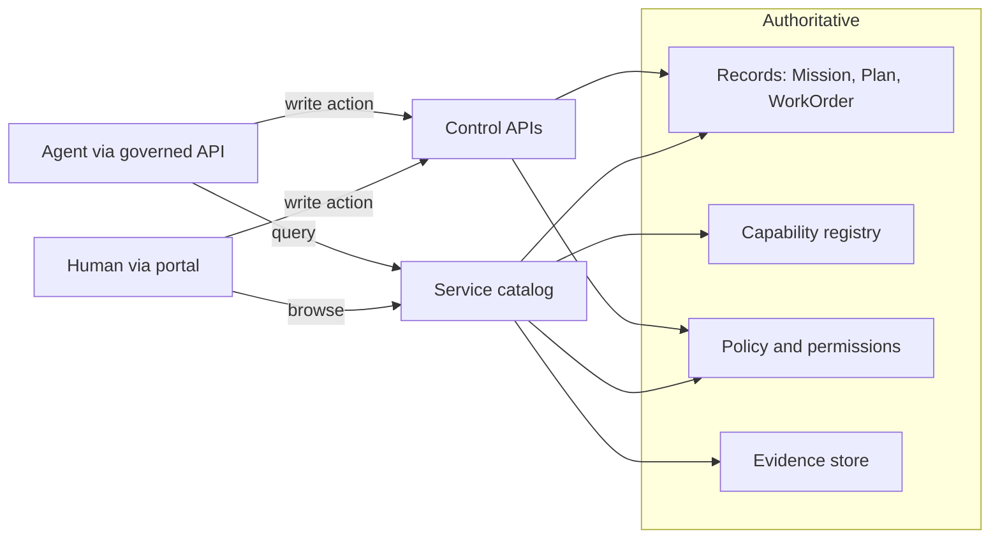
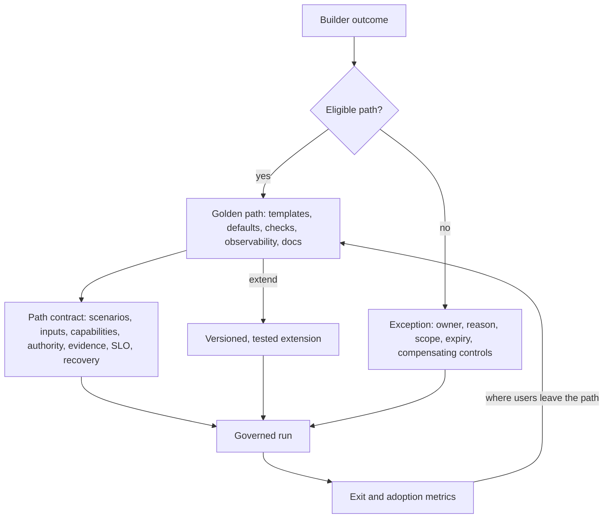
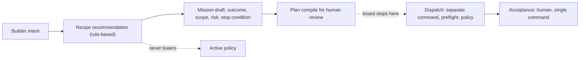
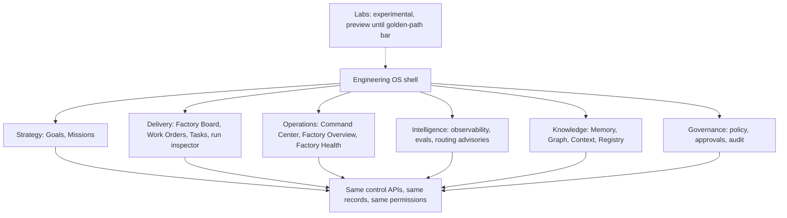
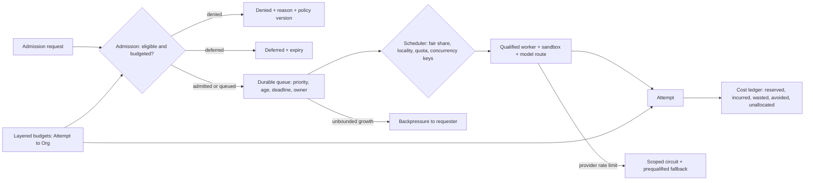

# 34. The factory as a platform

Parts II through IV described a machine that can take an intent and turn it into a validated change. This chapter is about what happens when that machine has to serve hundreds of builders and thousands of runs at once. Two things change. First, the factory becomes a **product** that people and agents must be able to discover, understand, and use without a specialist standing beside them. Second, it becomes a **shared resource** whose model quota, sandboxes, tool budgets, and reviewer hours are finite, so somebody has to decide who goes first, who waits, and who pays. By the end of this chapter you should be able to design a portal and catalog that do not become a second control plane, define a golden path with a contract and an escape hatch, and write a scheduling policy that a finance lead and an on-call engineer can both read.

## The problem

A sophisticated factory can fail for a mundane reason: builders cannot work out which workflow applies to their problem, what a capability actually does, why their work is blocked, or who owns the next decision. When that happens teams route around the system. They wire up shadow integrations, keep a private fork of a workflow, or learn that the only way to get something done is to find the one platform engineer who knows. Agents have exactly the same discoverability problem, only through APIs and tool listings rather than through a screen.

The root cause is a mismatch of shapes. Platform architecture is organised by services: the orchestrator, the evidence store, the model gateway. Users think in outcomes: fix this defect, onboard this repository, approve this plan, recover this run. Ownership and documentation drift across the two. A portal built on top of the services can become a decorative dashboard whose buttons do not map to anything authoritative.

The second problem is demand. Autonomous workloads generate unbounded appetite. One complex run may consume hundreds of model calls, several sandboxes, thousands of tool requests, a stack of retries, and two human reviews. Without admission control and budgets, urgent work queues behind experiments, providers rate-limit the whole fleet, costs cannot be attributed to anything, and teams compete for capacity through informal escalation in chat.

Capacity is hard because it is multidimensional and changes by the minute. A worker may have free CPU yet lack a qualified sandbox, remaining model quota, a repository credential, access to the right region, or a reviewer with time. Task duration is uncertain. Retry storms amplify provider failures. A simple first-in-first-out queue ignores business priority, fairness between tenants, deadlines, and risk. The v1 note put it well: a queue is where business priority becomes runtime reality, and if its policy is implicit the factory has an invisible governance system.

## How it works

### Operate the factory as an internal product

The organising decision is to treat the factory as an **internal product** with target users, defined journeys, service levels, adoption measures, support, a feedback channel, and a roadmap. The platform team owns *ease of safe use*. That is **platform ownership**: a named team is accountable for the paved paths, their service levels, their deprecations, and the experience of using them, so that "the platform" is never an orphan that everyone depends on and nobody answers for. Consuming teams keep responsibility for product intent and domain risk, exactly as the [operating model](../02-design/04-the-human-agent-operating-model.md) already assigns them. This division matters because the alternative is a platform that either abdicates ("we just run the agents") or overreaches ("we approve your changes").

Jay's own platform notes describe the operating model that makes this real, and it looks much more like running a product than running infrastructure. **Design partners** from specific product lines adopt early and shape the roadmap. **Builder conversations** are scheduled, not opportunistic. **Forward-deployed engineers** sit with adopting teams for the first weeks and bring friction back as tickets. **Internal champions** in each organisation carry the practice after the forward-deployed engineer leaves. A **weekly usage review** looks at who used what, what failed, and where people exited a supported path. **Release experiments** compare a new default against the current one before it becomes the default. **Paved paths** (the golden paths below) are the primary unit of support. **Migration support** and a published **deprecation strategy** mean a team never discovers that the workflow they depend on quietly stopped working. **Adoption and reliability dashboards** are reviewed side by side, because adoption without reliability is churn waiting to happen.

The metrics that tell you whether the product is working are outcome measures, not activity counts: time to first successful workflow, task success rate, PR acceptance rate, human correction rate, model-routing quality, token cost per accepted outcome, reliability, repeat usage, time to onboard a new team, number of bespoke capabilities retired, builder satisfaction, and adoption across product organisations. Adoption is evidence about product fit. Requiring training is reasonable; requiring a specialist for routine use is a platform defect.

One principle from the same notes deserves to be stated plainly: **builder intent is the interface**. The platform serves developers first, then product managers, QA, designers, and other builders, and none of them should have to understand the agent architecture underneath to get a governed outcome.

### One catalog for humans and agents

The **service catalog** is the factory's directory. It connects services, repositories, owners, workflows, capabilities, environments, APIs, schemas, runbooks, evidence, maturity ratings, and dependencies into one navigable graph. Humans browse it through the **developer portal**; agents query it through governed APIs. Both resolve to the same [authoritative records](../02-design/05-authoritative-records.md) and the same permissions.

The catalog is a map of the city, not the city. The portal is a view generated from authoritative services, and every write action a user can take from it invokes a governed control API. If a page lets you approve a plan, the approval is recorded by the same service and under the same authorisation that a CLI or an agent would use. A portal that keeps its own state, or exposes an action that has no API behind it, has become a **shadow control plane**: a second place where authority appears to live. That is the one thing a portal must never be.

The property to check in a design review is **action parity**: anything the UI can do, the API can do, under the same rules, and vice versa. An authorised agent should be able to find the exact API and capability for its task without screen-scraping or hidden routes.

### Golden paths

A **golden path** is a supported, paved route to an outcome. It bundles templates, sensible defaults, automated checks, built-in observability, documentation, and an explicit escape mechanism. The analogy is a marked trail through a national park: you can leave it, but the trail is maintained, signposted, and someone will come looking if you do not return.

The paths that repay investment first are the ones builders hit most often: repository onboarding, bounded feature delivery, dependency remediation, incident investigation, and progressive release. Each corresponds to one of the [autonomous workflows](../03-build/26-autonomous-engineering-workflows.md), wrapped in a product.

What separates a golden path from a template is that it exposes a contract. A path declares:

- the scenarios it supports and its non-goals;
- the inputs it requires and who owns them;
- the capabilities it generates or selects;
- its authority and approval boundaries;
- the evidence it will produce and the service level it promises;
- its common failures and their recovery; and
- its extension points, with compatibility obligations attached.

<!-- infographic: platform-golden-path -->
> **Infographic — The golden path and its escape hatch.**

The escape hatch is deliberate. Teams need explicit extension and exception mechanisms, because domain needs are real and a platform that denies them creates forks. The **extension model** is the published answer to "how do I add something the path does not do": which points may be extended (a skill, a verifier, a tool, a policy hook), what an extension must declare, and what compatibility it must keep. **Extensions** are versioned and tested against the path's compatibility obligations. **Exceptions** have an owner, a reason, a scope, an expiry, and compensating controls, the same discipline as any [policy exception](../02-design/07-governance-policy-and-risk-proportional-approval.md). Silent forks are the thing to prevent; they fragment the platform and hide risk. Strong standardisation improves reliability and can also constrain legitimate needs, so build a small number of well-supported paths and measure where users exit them. The exit points are your roadmap.

### The Factory Board: guided entry that never dispatches

The first golden path most builders meet is the front door. A **Factory Board** is the guided entry surface: it asks what the builder is trying to do, recommends a **recipe** (the eight postures of [Chapter 7](../02-design/07-governance-policy-and-risk-proportional-approval.md), from read-only Scout to Full SDLC), drafts a Mission from the answers, requires a stop condition on the draft, and compiles a Plan for the builder to review. Then it stops. The Factory Board never dispatches and never accepts. Dispatch is a later command, checked by preflight and policy; acceptance is a human decision through the single acceptance command. The board's whole value is that it lowers the cost of starting well without touching the cost of authority, and a board that grows a "run it" button has become a task launcher, which is the thing a control plane is built not to be.

<!-- infographic: factory-board -->
> **Infographic — Factory Board: recipe → Mission draft → Plan compile, and no further.**

### Factory Health and the Engineering OS shell

A platform needs a small set of measures that say whether it is turning into leverage rather than into a faster way to generate work for people. **Factory Health** is that KPI set, and three of its measures are worth naming because they are the ones that move when the factory is working:

| Factory Health KPI | What it measures | Direction of health |
| --- | --- | --- |
| Human touches per agent task | Manual overrides, approvals, and takeovers per unit of agent work ([Chapter 4](../02-design/04-the-human-agent-operating-model.md)) | Falling, with authority touches the only remainder |
| Shared component contributions | Skills, verifiers, recipes, and context packages contributed to the shared registry by consuming teams | Rising: the compounding loop is running |
| Workflow versus interactive token spend | The share of model spend inside governed workflows against the share in interactive chat sessions | Workflow share rising: work is moving onto the paved road |

The third is the platform's adoption measure in disguise. Interactive spend is not bad, but it is ungoverned, unverified, and unshared; every token that moves from a chat window into a workflow is a token whose output can be checked and whose lesson can be harvested.

The surfaces that carry all of this sit inside one shell. An **Engineering OS** (EOS) is the outcome-oriented shell that organises the factory's surfaces by what an engineering organisation is trying to do rather than by which service renders them: **Strategy** (Goals and Missions), **Delivery** (Factory Board, Work Orders, Tasks, the run inspector), **Operations** (Command Center, Factory Overview, Factory Health, incidents), **Intelligence** (observability, evals, routing advisories), **Knowledge** (Memory, Graph, Context, the Registry), and **Governance** (policy, approvals, audit). The catalog and action-parity rules above apply to every surface in the shell; the shell adds only navigation.

<!-- infographic: engineering-os-shell -->
> **Infographic — The Engineering OS shell.**

One more area belongs beside the shell rather than in it. **Labs** is where experimental surfaces live: explicitly labelled, navigable, and in **preview** until they meet the golden-path bar (a contract, an owner, a service level, observability, and evidence of a complete journey). A component does not become a product feature by existing in the codebase, and Labs is the honest place to keep it until it has earned the move.

### A controlled execution system, not a dark factory

It is worth saying what the platform is aiming at, because the industry has a name for the wrong target. A **dark factory** is a fully unattended autonomous factory: intent in, software out, nobody watching. It is an aspiration some teams state and none of them run safely, and it is not a safe default for anyone, because it removes the human from exactly the decisions (intent, irreversible actions, acceptance) that this book has argued only a human can be held to. The design target the 2026 landscape supports instead is a **controlled execution system**: isolated execution environments, lifecycle hooks at every consequential step, durable checkpoints, independent verification, and evidence correlation from intent to outcome. That is not an unattended agent swarm with a dashboard; it is a factory in which every automated step can be stopped, inspected, and attributed.

The doctrine that gets an organisation from here to more autonomy is **progressive autonomy**: human-led for intent and for irreversible decisions; agent-orchestrated for decomposition and execution; automatic acceptance only for low-risk actions that policy explicitly covers, and only after the evidence and trust calibration of [Chapter 7](../02-design/07-governance-policy-and-risk-proportional-approval.md) have been earned. The platform's job is to make each step of that progression measurable, with Factory Health as the gauge, rather than to promise the last step first.

### Closed-loop factory infrastructure: five criteria

The controlled execution system needs infrastructure underneath it, and there is a useful public checklist for judging that infrastructure, whether you build it or buy it. Warp's account of a closed-loop cloud software factory sets five evaluation criteria, and each one maps onto something this chapter has already asked the platform to own.

1. **The factory is defined as code.** A **factory manifest** plus a directory of agent definitions, skills, MCP servers, and model-routing rules, version controlled and editable by agents as well as people, in the way infrastructure is. In this guide's vocabulary the manifest is the Factory Version of [Chapter 11](../03-build/11-the-agent-factory.md) written to a file that a pull request can change.
2. **It lives in the cloud.** Agents on laptops sleep; traces, definitions, and telemetry are stored centrally; a factory is a team concept tied to a set of repositories and a product, reachable from the chat, tracker, and source-control tools where signals arrive. This is the same argument [Chapter 2](../01-understand/02-the-factory-in-one-view.md) makes for owning the development-environment layer, applied to where the factory itself runs.
3. **The runtime is API-first, not UI-first.** APIs to launch, steer, and retrieve history and telemetry come first, and CLIs, MCP servers, and consoles are built on top, so that agents can observe and operate the factory as well as people. That is the action-parity rule from the catalog section, stated as a purchasing criterion.
4. **Evals, improvement loops, and benchmarks are built in.** Scoring, self-improvement, and benchmark matrices are part of the infrastructure, not a project someone runs later ([Chapter 41](../06-improve/41-meta-loops-and-the-closed-loop-factory.md#the-closed-loop-factory-factory-as-code-scorers-and-benchmarks) covers the scorers and benchmarks themselves).
5. **It is inherently multi-model and multi-agent.** Routing across models and composition of agents are first-class, so that no single provider's roadmap is the factory's ceiling ([Chapter 21](../03-build/21-models-and-capability-selection.md)).

The first criterion carries the others, and its benefits are worth spelling out because they are the platform-side reasons for the extra discipline. Factory as code gives a **measurable baseline**: with this configuration, the factory merged this share of agent pull requests at this cost per pull request, routing across these models, with these skills, and any change is a change against that number. It gives **version control**: rollback, branching, approvals, and history, which makes the factory instantiable and testable in the way an environment is. And it gives the property that the closed loop depends on: **agents can propose diffs to the factory definition**, reviewed and merged as pull requests by people, which is the mechanical basis of self-improvement and the reason a factory in a settings screen can never learn. In this guide's terms the diff is an ImprovementProposal, the merge is governed promotion, and none of it changes who holds authority; it changes how cheap a well-evidenced improvement is to make.

### Factory opinions: opinionated defaults, open contracts

The last thing a platform supplies is a point of view. **Factory opinions** are reusable, evidence-backed default workflows and choices, encoded so that they apply unless overridden: how a review is done here, how a security review differs from it, how a migration is staged, how an incident is investigated. They sit between a rigid workflow that cannot handle a variant and a blank agent that reinvents the procedure every run, and they are what make a golden path feel paved rather than merely permitted. [Chapter 12](../03-build/12-skills-as-packages.md#factory-opinions-canonical-workflows-and-workflow-specialisation) treats opinions as registry capabilities, specialised by layer; here the point is the platform stance they express.

That stance is **opinionated defaults, open contracts**. The platform ships strong defaults for common workflows, so that a builder never has to choose a model, a harness, a verifier, or a review depth to get good work. Everything those defaults are built from stays portable: the calling convention, the tool schemas, the skill format, the context package, the state records, the verification contract. Defaults are where the platform's opinion lives; contracts are what stop the opinion from becoming a dependency, and they are the same contracts [Chapter 22](../03-build/22-routing-and-the-escalation-ladder.md#opinionated-defaults-open-contracts) uses to keep model choice reversible. A platform with defaults and no contracts is a lock-in; a platform with contracts and no defaults is a parts catalogue. The golden path is where the two meet, and the exit points from it are where an opinion has been wrong for someone, which is the platform's roadmap.

### Admission is not scheduling

Now the shared-resource half. The single most useful separation is between **admission** and **scheduling**. **Admission control** answers whether a piece of work is eligible and budgeted at all. Scheduling chooses when and where eligible work runs. An admitted WorkOrder may wait a long time. A free worker may sit idle because it cannot satisfy the execution contract of anything in the queue. Both are correct outcomes, and conflating the two decisions is how factories end up running ineligible work quickly and eligible work never.

An **admission request** binds the workflow, tenant, priority class, deadline, risk, resource estimate, model/tool/environment constraints, concurrency keys, monetary and token ceilings, and required human-review capacity. Admission returns one of four answers: `admitted`, `queued`, `deferred`, or `denied`, always with a reason, a reservation where one was made, an expiry, and the version of the policy that decided. The reservation holds scarce capacity for a window and is released on expiry or cancellation.

Scheduling policy is explicit. Its inputs include priority, deadline, risk, tenant, workflow class, dependency readiness, estimated resources, locality, provider quotas, environment availability, cost budget, age in queue, and human-review capacity. The decision and its reason are observable, so a builder can be told why they are waiting and what alternatives exist. And one rule is absolute: scheduling never silently changes the risk class, capability, region, or model profile of work in order to make it fit. If capacity forces a substitution, that is a new admission decision, not a scheduler shortcut.

Think of a hospital triage desk and the operating-theatre roster as two different jobs. Triage decides that you need surgery and how urgently. The roster decides which theatre, which surgeon, and when. Nobody would let the roster quietly downgrade your surgery to a consultation because the theatre was busy.

<!-- infographic: scheduling-and-capacity -->
> **Infographic — Admission, scheduling, budgets, and backpressure.**

### Budgets, fairness, backpressure, and preemption

Budgets are **layered**. The dimensions are model tokens, provider spend, wall time, attempts, tool calls, environment hours, storage, network, and human attention. The levels are Attempt, WorkOrder, Mission, workspace, workflow, and organisation. Every level bounds the one below it, and a fallback route cannot evade the parent's budget: switching to a cheaper or faster model does not reset the ceiling. Some capacity is always reserved for incidents and recovery, so a runaway experiment cannot consume the ability to cancel it.

**Fairness** uses weighted fair sharing so that one tenant or workflow cannot monopolise the fleet. **Aging** raises the effective priority of work that has waited, which prevents starvation of low-priority classes. **Concurrency limits** with scoped keys serialise conflicting effects on the same repository or environment, and lease expiry prevents a dead holder from blocking others forever. **Backpressure** slows intake or rejects low-priority work before queues become unbounded, and it reaches the requester with the current state and the alternatives; a queue is never an unbounded promise.

**Preemption**, stopping lower-priority work to make room, is the most dangerous control. It needs checkpoint or cancellation semantics, cleanup, accounting of the sunk cost, and preservation of the evidence produced so far. Non-idempotent external effects are never killed blindly; prefer draining at safe boundaries, which the [durable execution](../03-build/14-durable-execution.md) model provides.

| Control | Required behaviour | Failure protection |
| --- | --- | --- |
| Queue | Durable order, age, deadline, owner, cancellation | Reconcile orphaned and expired work |
| Priority | Finite classes with documented tie-breaks | Aging prevents starvation |
| Fairness | Per-tenant and per-workflow shares | Weighted fair scheduling and burst limits |
| Reservation | Hold scarce capacity for an admitted window | Expiry and release on cancellation |
| Quota | Bound aggregate consumption | Hard limit plus governed exception |
| Rate limit | Bound request velocity | Backoff and retry-after semantics |
| Concurrency | Serialise conflicting repository/environment effects | Scoped keys and lease expiry |
| Preemption | Stop lower-priority resumable work at a safe checkpoint | Preserve state and account sunk cost |
| Budget | Reserve a maximum and meter actual usage | Stop before exhaustion; preserve containment capacity |

### Overload and provider failure

Under overload, admission sheds optional work before critical work, respects tenant fairness, and protects reserved capacity for pause, cancellation, verification, and incident response. **Provider limits** (the rate, concurrency, token-per-minute, and spend ceilings a model or compute vendor enforces on your account) are a shared resource in their own right, and the scheduler must treat them as capacity to be allocated rather than a surprise to be retried through. When a provider rate-limits or degrades, the response is a **scoped circuit breaker** rather than a fleet-wide halt, and a **prequalified fallback** is used only when its quality, data handling, region, latency, and cost constraints remain eligible for that work. Retry storms are prevented structurally: centralised retry budgets, jittered backoff, and deadline-aware cancellation. Those mechanisms live in the [model router](../03-build/21-models-and-capability-selection.md) and the runtime; the scheduler's job is to honour them rather than to route around them.

Capacity planning feeds all of this. It uses arrival rates, service-time distributions, retry rates, failure bursts, rollout overlap, provider quotas, recovery reserves, and human-review demand to forecast what the fleet needs by workflow and capability. The forecast is what lets an operator reserve recovery capacity in advance instead of discovering the shortfall during an incident.

### Cost belongs to accepted outcomes

Token price is the number everyone can see and the least useful one. The measure that matters is **cost per accepted outcome** (written **cost-per-accepted-outcome** where it appears as a metric name): the total cost of producing a WorkOrder that a human accepted, including every retry, every failed attempt, the environments, the verification, the waiting, and the human intervention. The [economics chapter](../02-design/08-economics-metrics-and-human-attention.md) explains why; this chapter explains how to compute it.

A **cost record** captures model input, output, and cached tokens; tools and external APIs; workers; environments; storage; network; retrieval; evaluation; CI; delivery; retries; failed attempts; and human review. Shared costs are allocated by a versioned rule, so the allocation itself is auditable. Reports slice by Mission, workflow, repository, tenant, capability, Attempt, accepted outcome, and failure class. Five amounts are preserved rather than collapsed: **reserved**, **incurred**, **wasted** (failed or discarded work), **avoided** (work prevented by a cache or a cheaper route), and **unallocated**. Failed-work cost is never hidden inside a platform average.

Two reporting modes follow. **Showback** tells each team what it consumed without charging for it; it is where most organisations start, and it is often enough to change behaviour. **Chargeback** debits a team's actual budget. Chargeback needs the attribution rule to be stable and agreed before the first invoice, because the moment cost has consequences every ambiguity in the allocation becomes a dispute. Either mode needs quotas at the same boundaries it reports on. These are the same quota, chargeback, and showback controls that enterprise buyers will ask for in [Chapter 38](./38-enterprise-adoption-and-the-infrastructure-landscape.md).

Practitioners look at a smaller set of views day to day: token usage over time, and cost by model, sliced by who is spending. The HumanLayer and BAML conversation showed exactly that dashboard being pulled up live, and the interesting observation was not the totals but the pattern behind them: expensive models used deliberately for the work that needs them (UI and writing, in that case) and cheaper execution models for the bulk of engineering. A cost view that cannot show that split is not helping anyone route better. [Chapter 35](./35-observability-telemetry-and-forensics.md) covers how the numbers are captured.

## How to build it

Build the product side and the scheduling side in parallel; each is useless without the other.

**Product foundation**

1. Name the target users and the first three journeys (typically repository onboarding, a bounded feature, and a defect fix). Write the service level for each.
2. Stand up the catalog as a projection over authoritative services. Populate owners, workflows, capabilities, environments, runbooks, and maturity for every entry; an entry without an owner is not published.
3. Enforce action parity: list every portal action and the control API it calls. Any action without an API is removed or rebuilt.
4. Ship one golden path with its full contract (the seven items above), an extension point, and an exception process with owner, reason, scope, expiry, and compensating controls.
5. Assign design partners, a forward-deployed engineer, and an internal champion for the first adopting organisation. Put the weekly usage review on the calendar.
6. Publish the deprecation policy before anything is deprecated: notice period, migration support, and what happens to in-flight work.
7. Build the adoption dashboard and the reliability dashboard on the same page.

**Scheduling foundation**

1. Define a finite set of priority classes with written tie-breaks. Four is usually enough: incident, deadline-bound, routine, and experiment.
2. Write the admission contract and implement the four responses with reasons and policy versions.
3. Establish budgets at every level from Attempt to organisation for at least tokens, spend, wall time, attempts, and human attention. Reserve incident and recovery capacity explicitly.
4. Add per-tenant and per-workflow fair shares, aging, and scoped concurrency keys.
5. Implement backpressure that reaches the requester with state and alternatives.
6. Implement preemption only for work with checkpoint or safe-cancellation semantics; everything else drains.
7. Stand up the cost ledger with the five preserved amounts and a versioned allocation rule. Start with showback.

**Review checklist**

- Can a new builder reach a first successful workflow without a specialist?
- Does every portal write go through a governed API?
- Does every golden path publish its contract and its exit metric?
- Can an operator explain any queue decision from the recorded inputs?
- Can any fallback evade a parent budget? (It must not.)
- Is incident and recovery capacity reserved, and has it been tested under load?
- Is wasted cost visible per workflow rather than averaged away?

## Failure modes

**The portal becomes a shadow control plane.** Detected when a portal action has no API equivalent, or when portal state and authoritative state disagree. Fix by removing the local state and routing the action through the control API.

**Routine use requires a specialist.** Detected by support-ticket volume and by the time-to-first-successful-workflow metric. This is a product defect, not a training gap.

**Silent forks.** A team copies a workflow and maintains it privately. Detected through the catalog (an unregistered workflow producing runs) and through exit metrics. Fix with a versioned extension point or a recorded exception.

**Invisible queue policy.** Nobody can explain why work waited. Detected when scheduling decisions lack recorded inputs. Fix by making the decision and reason part of the queue record.

**Tenant starvation.** One tenant's burst monopolises capacity. Detected by queue-age and fair-share metrics per tenant. Contain by rebalancing weights and capping the noisy tenant; recovery is verified when the fairness window returns to objective.

**Retry storm.** A provider blip multiplies into fleet saturation. Detected by retry budget exhaustion and dependency saturation. Contain by opening the circuit and shedding optional work; recover when the dependency is stable and the backlog reconciled.

**Budget evasion through fallback.** A cheaper route is used to keep spending past the ceiling. Detected by reservation-versus-actual comparison at the parent level. Fix by enforcing the parent budget on every route.

**Unsafe preemption.** A non-idempotent external effect is killed mid-flight, producing a duplicate or a half-applied change. Detected by reconciliation finding an unknown effect. Fix by restricting preemption to checkpointed work and draining everything else.

**Cost blocks valuable investigation.** A hard ceiling stops a run that was about to find something. Provide scoped escalation with an owner and expiry rather than raising the global limit.

**Predictive scheduling penalises novel work.** Duration models learned from routine work misjudge new workflow classes. Keep priority and risk policy independent of predicted duration, and review forecast error per class.

**The Factory Board grows a run button.** The guided entry starts dispatching or accepting, so the front door has become a task launcher with hidden authority. Detected when a dispatch or acceptance record names the board as its actor. Fix by keeping the board to recipe, Mission draft, and Plan compile, and routing dispatch and acceptance through their own commands.

**Interactive spend never moves.** Token spend stays in chat sessions while workflow spend is flat, and Factory Health cannot show adoption of the paved road. Detected in the workflow-versus-interactive split. Fix by removing friction from the governed path, not by restricting the chat window.

**Labs shipped as product.** An experimental surface appears in the main navigation without a contract, an owner, or evidence of a complete journey. Detected when a route has no golden-path record. Fix by returning it to Labs as preview until the bar is met.

**Dark factory as roadmap.** Unattended operation is promised before intent capture, irreversible decisions, and acceptance have been separated and measured. Detected when the roadmap has an autonomy milestone with no Factory Health gate. Fix with progressive autonomy: earn each step with evidence.

## In Mission Control

At the pinned study commit [`d902fae`](https://github.com/jaydubya818/MissionControl/tree/d902fae7032c0696b531c44ae88829c652516fc6), Mission Control provides operator surfaces for intent, plans, workflows, evidence, approvals, runtime state, and review, and the guide's capability map describes the authorised-action parity those surfaces are meant to honour. Basic, intermediate, and advanced presentation modes, feature flags, immutable versions, and migration guidance exist; the presentation modes do not alter authority.

On the scheduling side, the runtime has queues, leases, worker capabilities, retry and Attempt budgets, model routing with an exact route identity, provider rate limits, concurrency controls, and health metrics. These support bounded execution.

The repository glossary and lexicon reviewed 2026-09-02 name the surfaces in this chapter as Mission Control's: a Factory Board that recommends a recipe, drafts the Mission, and compiles the Plan and never dispatches or accepts; a Factory Health surface with human touches per agent task, shared component contributions, and workflow-versus-interactive token spend; an Engineering OS shell organising Strategy, Delivery, Operations, Intelligence, Knowledge, and Governance; and a Labs area whose surfaces stay in preview until they meet the golden-path bar. The lexicon also states the design target as a controlled execution system under progressive autonomy, with the dark factory named as an aspiration and not a safe default. Those are named surfaces and doctrine at the review date; whether each KPI has a measured series is pinned in [Chapter 42](../06-improve/42-mission-control-as-a-living-case-study.md), and this chapter does not claim one.

What is not implemented, and what this chapter should therefore be read as design guidance for rather than as a description of the product: a complete developer portal, a service catalog, self-service repository onboarding, a golden-path ownership model, an extension marketplace, adoption analytics, a full admission-and-scheduling policy, a fairness model, a preemption protocol, capacity forecasting, a reviewer-capacity constraint, and end-to-end cost attribution to accepted outcomes. The economic metrics Mission Control records need this operational layer to become actionable.

## Retain this

- The factory is an internal product. The platform team owns ease of safe use; consuming teams own intent and domain risk. Adoption is evidence about product fit, and needing a specialist for routine use is a defect.
- The portal is a view and the catalog is a map. Every write action goes through a governed API, and humans and agents resolve to the same records and permissions. A portal with its own authority is a shadow control plane.
- Admission decides whether work is eligible and budgeted; scheduling decides when and where. Neither silently changes risk, capability, region, or model profile.
- Cost belongs to accepted outcomes and preserves reserved, incurred, wasted, avoided, and unallocated amounts. Start with showback; move to chargeback only once the allocation rule is stable.
- The Factory Board is guided entry: recipe → Mission draft (with a stop condition) → Plan compile, and nothing further. It never dispatches or accepts.
- Aim at a controlled execution system (isolated environments, lifecycle hooks, durable checkpoints, independent verification, evidence correlation), not a dark factory. Progressive autonomy is the doctrine: human-led for intent and irreversible decisions, agent-orchestrated for decomposition and execution, auto-accept only for low-risk, policy-covered actions.
- Opinionated defaults, open contracts: factory opinions make the paved road paved; portable contracts keep the opinion from becoming a dependency.

## Go deeper

- [Chapter 4, The human–agent operating model](../02-design/04-the-human-agent-operating-model.md) for the responsibility split the platform inherits.
- [Chapter 8, Economics, metrics, and human attention](../02-design/08-economics-metrics-and-human-attention.md) for why cost per accepted outcome is the measure.
- [Chapter 13](../03-build/13-control-plane-orchestrator-and-execution-plane.md) and [Chapter 14](../03-build/14-durable-execution.md) for the queues, leases, and checkpoints the scheduler relies on.
- [Chapter 21, Models: routing, profiles, and capability selection](../03-build/21-models-and-capability-selection.md) for prequalified fallbacks and circuit breakers.
- [Chapter 35, Observability, telemetry, and forensics](./35-observability-telemetry-and-forensics.md) for how usage and cost are captured.
- [Chapter 38, Enterprise adoption and the infrastructure landscape](./38-enterprise-adoption-and-the-infrastructure-landscape.md) for quotas, chargeback, and showback as enterprise requirements.
- Primary references: Backstage Software Catalog documentation (accessed 2026-08-30); DORA, platform engineering capability (accessed 2026-08-30).
- Sources: Jay West, platform operating model and adoption metrics notes ("Factory in one line"); HumanLayer × BAML livestream, "Software factory design patterns" (Dexter and Vaibhav), on cost-by-model dashboards and the control plane as the underserved layer; Mission Control repository glossary and lexicon, reviewed 2026-09-02 (Factory Board, Factory Health KPIs, the Engineering OS shell, Labs, controlled execution system, dark factory, progressive autonomy); Warp, *Closing the loop with self-improving cloud software factories* (2026), for the five infrastructure criteria and the factory-as-code benefits; public practitioner talks, 2026, for factory opinions and opinionated defaults with open contracts.
