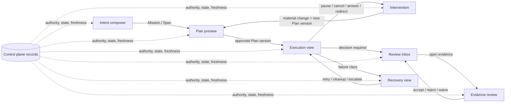
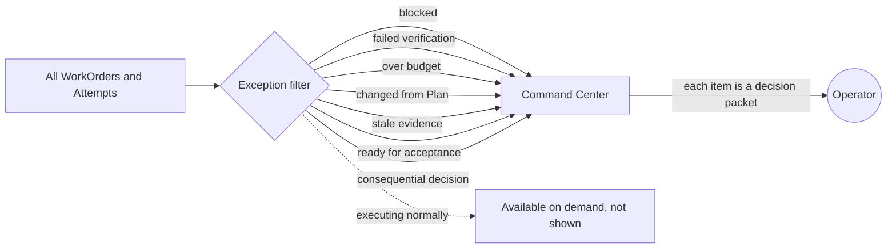
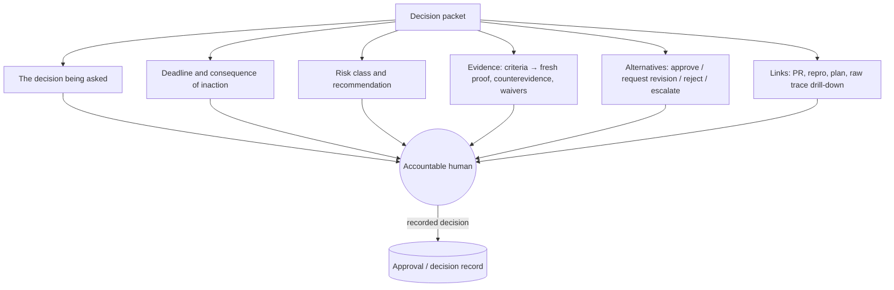
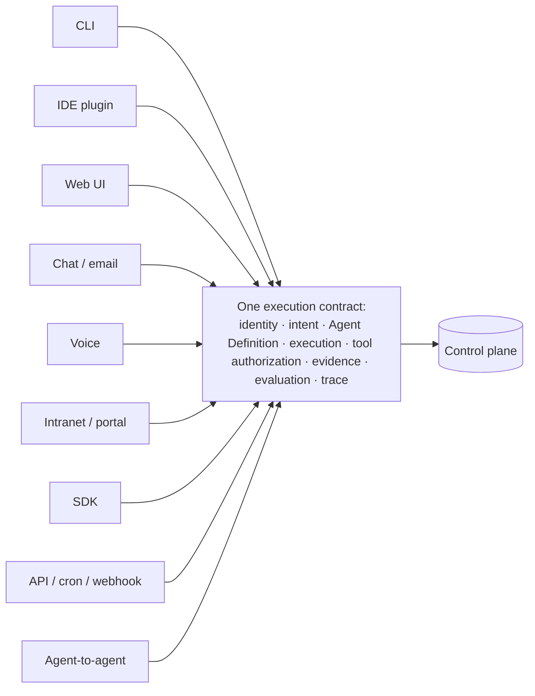
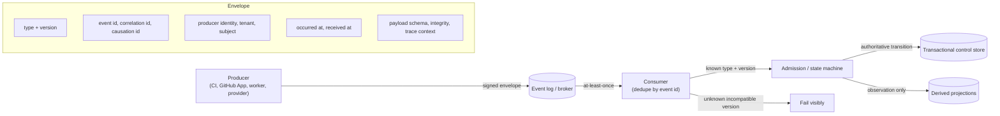
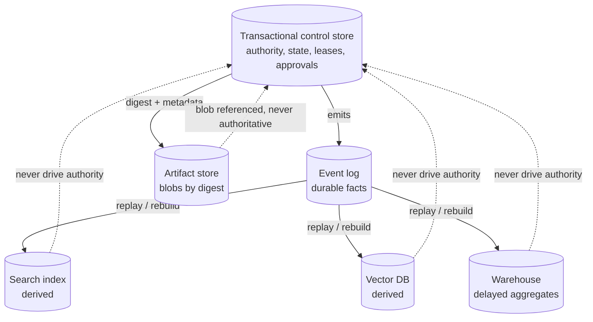

# 37. Control surfaces, event contracts, and storage

A factory that runs well but cannot be seen, steered, or stopped is not operable. This chapter covers the two halves of that problem. The first half is the **control surface**: the screens and notifications through which a person understands what the factory is pursuing, what it has done, what it is waiting for, and what decision it needs. The second half is what sits underneath those screens: the typed **event contracts**, versioned workflow definitions, and storage boundaries that decide whether the state on the screen is actually true. After reading it you should be able to design an operator experience around decisions rather than chat, and to draw the truth boundary of every store and event feed in your factory.

## The problem

Most agent interfaces were built for conversation. They stream tokens, show a spinner labelled "thinking", and end with a text bubble. That is fine for one person talking to one assistant. It is useless for an operator supervising a dozen WorkOrders across three repositories, several of which are waiting on something.

What that operator needs to know is specific: which outcome each run is pursuing, which Plan and which authority are active, what has changed, why a run is waiting, what failed, which evidence is missing, and which decision is now required of a human. Raw traces contain all of that and communicate none of it. Vague progress ("working on it...") destroys trust faster than silence, because it implies the system knows something it will not say.

The people building the first real software factories describe the same gap. In the HumanLayer and BAML "Software factory design patterns" conversation, the control plane is named the most underserved layer of the stack, and the wish-list is essentially a list of control surfaces: dispatch new work, look at session traces, read the plans and architecture documents the agents produce, schedule runs nightly or on a cron or in response to webhooks, review and iterate on code in something PR-shaped that need not live in GitHub, manage permissions and audit (who can talk to what, who can see which services), and manage spend and budgets. Nobody asked for a better chat window.

The second half of the problem is quieter. A factory integrates issue trackers, source control, workers, tools, model providers, CI, artifact registries, deployment systems, observability, and human decisions. Events from those systems arrive late, duplicated, out of order, or in an older schema than the consumer expects. Workflow definitions change while runs are still active on the old one. Large artifacts and retrieval indexes do not fit safely in the same database as authoritative state. Build the operator's screen on top of that without discipline and the screen lies, and an operator lied to once by a status display stops reading it.

## How it works

### Interfaces display authority; they do not create it

The first principle of a control surface is that it renders records; it does not become one. Authority lives in the control plane's durable state (chapter [13](../03-build/13-control-plane-orchestrator-and-execution-plane.md)): the approved Plan version, the policy decision, the lease, the approval record. The interface computes, from those records, what is true right now, what is fresh, and which actions are safe, and shows that calmly. An agent may explain its own contract and uncertainty on screen, and that is useful, but the interface calculates authority, evidence freshness, and the set of safe actions from the records, not from what the agent says about itself.

The analogy is an aircraft cockpit rather than a chat log. A pilot does not read the engine's raw telemetry; the instruments summarise it into a handful of authoritative states and a small number of decisions. The instruments do not fly the aircraft. They make the state legible enough that the accountable person can.

The same rule applies to the numbers on the instruments. Observability and evaluation are diagnostic: a dashboard score, an evaluation pass rate, or a trend line can tell a person that a WorkOrder is probably fine, and it can inform the policy that decides how much evidence a risk class requires. What it must never do is accept the WorkOrder by itself. A score of 0.94 is not an approval record, and the moment a threshold on a chart starts advancing work without a validator and a decision record behind it, the chart has become an unaudited authority. *Metrics can inform authority; they should not quietly become authority.* [Chapter 35](./35-observability-telemetry-and-forensics.md) draws the same line from the telemetry side.

### Design around decisions and state

Human decisions in a factory are not one thing. A person may need to clarify intent, approve a plan, grant an exception, stop work, accept evidence, merge, release, or promote autonomy. Compressing all of those into a single "Approve" button hides both the meaning and the risk of what is being approved. So the control surface is organised around decision types and authoritative states, and each of the seven primary surfaces exists because a distinct kind of decision lives there.

<!-- infographic: operator-surface -->
> **Infographic — The seven operator surfaces.**

The **intent composer** is where a Mission begins. It captures the outcome wanted, the reason, the constraints, the acceptance criteria, the owner, the risk class, and the explicit non-goals. It is a form, not a prompt box, because those fields are what chapter [6](../02-design/06-intent-and-specification-engineering.md) needs before any agent runs.

The **plan preview** shows what the factory proposes to do before it does it: steps, the planner's assumptions, affected systems, the capabilities and skills it will use, the tests it will run, rollout and rollback, expected cost, and where the plan is uncertain. A person approves a Plan version here, and the approval binds to exactly that version.

The **execution view** is the live picture of one WorkOrder: current authoritative state, completed and pending work, the active Attempt, remaining budgets, changes made so far, blockers, and the safe controls available right now. It is also where session traces and the plans and architecture documents an agent has written become readable, which is the "look at the session traces, look at the plans" item from the wish-list.

The **intervention** surface changes the course of running work without breaking the records: pause, cancel, answer a question the agent raised, redirect within the approved scope, request a revision, or escalate. The rule that keeps it honest is that material replanning creates a new Plan version or a new authority decision. You can nudge a run inside its scope; you cannot silently expand its scope from a text box.

The **review inbox** is an ordered queue of decisions waiting on a specific person. Each item carries a deadline, a risk level, a recommendation, the evidence, the alternatives, and the consequence of doing nothing. In a small team it is often a Slack message, and the message should carry the same content; more on that below.

The **evidence review** surface maps each acceptance criterion to fresh proof. It shows counterevidence rather than hiding it, waivers with who granted them and why, lineage from candidate to check to result, the known limitations of the checks, and a drill-down into raw artifacts. Chapter [31](../04-prove/31-quality-contracts-proof-packages-and-certificates.md) defines the proof package; this is where a human reads one.

The **recovery view** appears when something has failed. It names the failure class, the retained state, whether a retry is eligible under the retry budget, whether the hypothesis behind the work has changed, what cleanup is needed, and who owns the next step, in the incident vocabulary of chapter [36](./36-resilience-incidents-and-the-control-tower.md).

### The exception-first Command Center

The seven surfaces answer "what is this run doing?" The **Command Center** answers a different question, the one an operator with forty WorkOrders in flight actually has: "what needs me?" It is the home screen, and it is deliberately not an activity feed. Activity feeds are what you build when you assume the operator wants to watch agents work. Nobody supervising forty of them wants that; they want the short list of things that cannot proceed without a person.

So the Command Center is **exception-first**. It surfaces exactly seven conditions and hides the rest:

| Condition | Why a person is needed |
| --- | --- |
| Blocked | A run has stopped at a gate it cannot pass on its own |
| Failed verification | The candidate exists and the evidence says no |
| Over budget | Spend, time, or retries exceeded the reservation |
| Changed from the approved Plan | Execution diverged from the revision a human approved |
| Stale evidence | The subject moved and the proof no longer binds to it |
| Ready for acceptance | Verification passed; only authority is missing |
| Consequential decision needed | An action whose blast radius policy reserves for a human |

Everything else (runs executing normally, tools being called, tokens being spent) is available one click down, and is not on the home screen. *The scarce resource is not agents; it is human attention.* A hundred agents and one operator is a fine ratio if the operator only ever sees the seven conditions above; it is an impossible ratio if the operator is expected to watch. The shift is from supervising activity to managing exceptions and authority, and the screen has to enforce it, because an operator offered a feed will read the feed.

<!-- infographic: command-center -->
> **Infographic — The exception-first Command Center.**

The Command Center is also where the sequence of states the factory insists on becomes visible as separate rows rather than one green tick. *Execution completed ≠ verification passed ≠ acceptance ≠ merge ≠ production verified.* "Ready for acceptance" and "failed verification" are different exceptions because they are different states with different owners, and a home screen that merged them would be lying by summary.

### Make status precise

Status words are contracts. A run is *awaiting plan approval*, *queued for capacity*, *executing*, *awaiting input*, *independently verifying*, *blocked by stale evidence*, *eligible for release*, *observing outcome*, or *quarantined*. Each of those is a state in the durable state machine of chapter [14](../03-build/14-durable-execution.md), and each tells the operator both what is happening and who, if anyone, is on the hook. "Thinking" is not an operational status. It tells the operator nothing about authority, blockers, or what comes next, and it invites the false urgency of watching a spinner.

### Stream useful progress, not tokens

**Live progress** is the execution view's running account of what a run has done and what it expects to do next, updated as the run proceeds rather than when it ends. Its unit is the **progress event**, a summary written for a person: the decisions completed since the last event, any material discovery (a dependency nobody mentioned, a test that was already broken), any change to scope, evidence produced, budget consumed, and the next transition the run expects. Token streams and tool-call streams remain available as diagnostics for the engineer who wants them, but they are not the default view.

Notifications built on progress events need four properties. They are deduplicated, so that three retries of one failure do not produce three pages. They are severity-aware, so that a stale-evidence block and a budget-exhausted halt are not styled the same as a routine completion. They are accessible. And they are routed to the accountable person, not to a channel where responsibility diffuses.

### The decision packet

The most valuable artifact a control surface produces is what this guide calls a **decision packet**: everything a person needs to make one decision well, in one place, with the decision itself clearly framed. It is what a review inbox item contains, and it is what the factory should send when it has to interrupt someone.

The HumanLayer team's pipeline shows the shape in practice. When their factory classifies an incoming issue it assigns a human shepherd, then pings that shepherd in Slack with a packet: here is the bug, here is the reproduction, here is the fix, here is the PR to read. For hard cases the packet changes shape: here is a plan; either pull it into your local agent and implement it yourself, or tell me the plan is good and I will implement it. That packet is not "I'm working on your issue" and it is not a transcript. It is a framed decision with the evidence attached, and its stated aim is to push human time as low as possible without pushing human authority away.

<!-- infographic: decision-packet -->
> **Infographic — Anatomy of a decision packet.**

What goes in the packet is not negotiable downward. A reviewer asked to approve a change gets the Plan it was executed against, the diff, the risk class, the tests and their results, the evaluation results, the policy decisions that fired, and the evidence bound to the exact candidate; not an approve button with a summary sentence above it. The reason is the one chapter [7](../02-design/07-governance-policy-and-risk-proportional-approval.md) gives for risk-based authority: a human asked to approve after every action without evidence will rubber-stamp, and rubber-stamping is worse than no gate because it looks like one. The corollary is that the human should never be compensating for missing automation. If the packet cannot show the test results because nothing ran the tests, the fix is to run the tests, not to ask a person to imagine them.

A decision packet also enforces the distinction between rejecting and requesting a revision. Rejection ends the proposal and records why. Request-revision keeps the Plan alive and sends it back with a specific ask. Collapsing the two loses the record of what the human actually wanted, and it is exactly the kind of loss that chapter [40](../06-improve/40-governed-learning.md) later needs to mine.

### Preserve safe human control

Pause and cancel are different operations, and the interface has to say which it is doing. **Pause/resume** is one reversible pair: pause holds the lease and retained state so the run can resume from the same point; cancel releases the lease, records the terminal state, and may trigger cleanup or compensation. Before any approval the interface previews the side effects it will unlock (which repositories, environments, spend), and after an action is accepted it confirms what was recorded, so the operator never guesses whether the click landed.

Operational interfaces are used under stress, at odd hours, by people with different abilities in different time zones. Keyboard navigation, screen-reader support, contrast, reduced motion, time-zone rendering, and localisation are not polish for a factory console; they decide whether an operator can act at 3 a.m.

### Teach failure, not only the happy path

A run explorer that only ever shows green runs trains operators to expect green. Jay's product notes for the Factory Run Explorer insist on at least one deterministic scenario in which agent execution completes and independent verification fails: execution complete, quality contract failed, behavioural evaluation 8 of 10 against a required 9 of 10, delivery blocked. The lesson is the one this guide keeps returning to: **completion is not acceptance**. A producing agent or harness reporting "done" is never sufficient evidence for acceptance, and the surface must show that rather than smooth it over. The scenario lets the person inspect what completed, what failed, which evidence failed, who owns the decision, why delivery was blocked, and which recovery options exist next; that is exactly what the recovery view and evidence review show for a real run, and the teaching scenario guarantees an operator has seen it before the first real one arrives.

### Measure attention, not clicks

Chapter [8](../02-design/08-economics-metrics-and-human-attention.md) argued that human attention is the factory's scarce resource. The control surface is where it is spent, so it is measured there: time to decision, unnecessary interrupts, approval rework (decisions revisited), false urgency (notifications that did not need a person), evidence-review time, escalation quality, abandonment (packets nobody acted on), and operator confidence as operators report it. Faster clicks do not prove better judgment; an inbox optimised for throughput alone trains people to approve without reading.

### Tradeoffs: detail, chat, and structure

More detail means more transparency and more cognitive load; the resolution is progressive disclosure, decision summary first, trace and artifacts on demand. Chat is flexible and good for clarification but poor at showing parallel state and evidence lineage; structured interfaces are clear and can feel rigid. The workable combination is a structured surface that permits conversational clarification, with the rule that a conversation never bypasses the records. When a chat exchange changes the plan materially, it creates a new Plan revision, exactly as an intervention would.

### One execution contract, many interfaces

Operators are not the only people who reach the factory, and the screen is not the only door. A developer arrives through the CLI or an IDE plugin; a product manager through a web form; a collaborator through chat, email, voice, an intranet, or a service portal; a platform team through an SDK; a scheduled job through the API; another agent through an agent-to-agent call. The temptation is to build each door as its own small product with its own notion of a run. The rule that prevents that is: be opinionated about the contract and flexible about the interface. Every door, whatever it looks like, produces the same durable concepts, and the control plane recognises nothing else:

- an **identity** (who or what is asking, and on whose behalf);
- an **intent** (the Mission or Spec being pursued);
- an **Agent Definition** (which versioned capability contract will run);
- an **execution** (the Attempt, with its manifest and lease);
- a **tool authorization** (what the run may touch);
- **evidence** and **evaluation** (what proved the result); and
- a **trace** (the lineage that makes the run debuggable).

<!-- infographic: execution-contract -->
> **Infographic — Many interfaces, one execution contract.**

*Multiple experiences should converge on one execution contract.* The practical test is that a run started from the CLI and a run started from the UI are indistinguishable in the control plane's records, and that a policy written once governs both. When that holds, adding a new interface is a week's work; when it does not, every interface is a new place for authority to leak.

#### Channel adapters preserve identity and provenance

A **channel adapter** translates one touchpoint into the common intake contract and translates progress or decisions back to that touchpoint. It is a protocol and presentation boundary, not an orchestrator and not an authority source. Chat membership, an email sender field, a caller ID, a forwarded message, or a bot mention is never sufficient proof that the person may start or approve work.

Every normalized `IntakeRequest` preserves the authenticated channel principal and any represented principal; tenant; channel, conversation, and message identifiers; original content and attachment digests; modality; transcription service and confidence when voice is involved; sent and received times; locale; reply destination; correlation and idempotency keys; and the adapter version. Attachments, quoted messages, links, and transcripts remain untrusted content. The adapter may extract candidate intent, but admission resolves identity, scope, risk, applicable policy, and budget before a WorkOrder exists.

Voice and forwarded content need an extra rule because transformation can change meaning. A low-confidence transcript, ambiguous identity, or consequential request must be confirmed against the normalized intent before planning or action. An outbound response carries the same correlation identity and reports the authoritative state—received, awaiting clarification, awaiting approval, executing, blocked, completed, or rejected—rather than inventing a channel-specific status. Adding a channel is complete only when the same request, denial, approval, progress, accessibility, and recovery semantics work through it and appear in the shared control-plane record.

### Underneath the surface: triggers are intake, not authority

Everything above assumes the screen is showing the truth. That depends on how the factory ingests the world. Schedules, webhooks, messages, API calls, and repository events all create or update *proposed* work through an intake path that is authenticated and idempotent. None of them starts execution on their own. **Admission** then verifies the current owner, the scope, the applicable policy, the risk class, readiness (is the environment and configuration present?), and budget before anything runs. A webhook is a claim from a provider about its own state. It may be forged, replayed, or incomplete, so the factory treats it as intake and lets the control plane decide.

This is the cron-and-webhook item on the control plane wish-list done properly. **Triggers, schedules, and webhooks** are the three intake shapes: a trigger is any authenticated signal that proposes work, a schedule is a trigger that fires on a clock, and a webhook is a trigger that fires when an external system reports a change. "Run every night" and "run when Linear changes" are triggers into intake; the nightly run still passes admission, and still binds to an approved workflow version.

### Typed event envelopes

Every event that crosses a boundary inside the factory carries a typed **event envelope**. The envelope is the contract that lets consumers deduplicate, order, verify, and route without parsing the payload. Underneath it sits **durable messaging**: the events are written to a persistent log or broker before any consumer sees them, delivered at least once, and retained long enough to replay, so a consumer that was down when the fact occurred still receives it. **Event schemas**, kept in a schema registry with advertised version ranges, define what each payload type contains and how it may evolve.

<!-- infographic: event-contract -->
> **Infographic — The event envelope and its journey.**

The fields are fixed. Canonical type and version say what kind of fact this is and which payload schema it follows. Event identity lets consumers deduplicate; correlation identity ties the event to the WorkOrder or Attempt it concerns; causation identity names the prior event that caused this one, which is what makes causal replay possible. Producer identity and tenant say who emitted it and for whom, and are what the signature is checked against. Subject names the record the event is about. Occurred-at and received-at are both kept, because the gap between them is where late delivery hides. Payload schema, an integrity digest, and trace context complete the envelope.

Consumers deduplicate on event identity and tolerate a defined ordering (usually per-subject, not global). An event whose type and version the consumer does not understand fails visibly; silently dropping it is how a factory loses a "verification failed" fact and ships anyway. The line to remember is that an event is evidence that a producer reported something. The control plane still decides whether that report is authentic, current, relevant, and sufficient for an authoritative transition. Delivery is not acceptance.

### Version the workflow definition

**Declarative workflows** describe what a workflow consists of rather than scripting how to run it, which is what makes them inspectable before execution and diffable between versions. A **workflow contract** (or workflow DSL) is that declaration: for each workflow, its nodes with their inputs and outputs, the dependencies between them, the triggers that may start it, timeouts, retry policy, budgets, cancellation behaviour, compensation steps, human gates, completion states, and the evidence each completion requires. Declaring this makes the workflow inspectable in the plan preview and reviewable by policy, which is the argument for a DSL. The risk is that flexibility invites unsafe dynamic behaviour, so types, policy checks, and a migration protocol are not optional.

**Workflow versioning** follows from the declaration: every change to a workflow contract produces a new immutable version with a digest, and the binding rule is that a running WorkOrder stays bound to the workflow version approved when it started. Changing the definition does not change running work. Migrating an active run is a new decision with its own authority, done through a replay-safe transition that leaves the history of both versions intact.

### Evolve schemas as a rollout

Schemas for events, workflows, and projections change, and a **compatibility window** is how they change without breaking consumers. Additive changes (a new optional field) go first, ahead of consumer migration. Semantic changes (a field whose meaning shifts) require an explicit new version. Producers and consumers advertise the version ranges they support. The migration is a sequence of monitored states, not a deployment: backfill the new shape, dual-read or dual-write during the overlap, validate that the two agree, cut over, then contract by removing the old shape. Each state has an exit condition and is visible on the operator's health surface.

### Compensate partial effects explicitly

A distributed workflow cannot assume a global rollback. If a run has pushed a branch, opened a PR, and posted a comment before failing, there is no transaction to abort. The pattern is a **saga**: the workflow records each completed effect and the approved compensation for it, and on failure runs the compensations that apply. **Compensation** is a recorded, forward action that neutralizes a completed effect (closing the PR, deleting the branch, posting a retraction), and it is not undo; it is a new action with its own authority and its own failure path. Ambiguous effects, where the factory does not know whether an external call landed, go to **reconciliation**: query the provider, compare, record what was true. Chapter [14](../03-build/14-durable-execution.md) covers the runtime side; here the point is that the recovery view must show completed effects and pending compensations, not just "failed".

### Assign every store a truth boundary

The last contract is about where facts live. Each kind of store is good at one thing and lies about others, so each gets an explicit **truth boundary**: what it is authoritative for, and what it merely reflects.

| Store | Appropriate content | Important limit |
| --- | --- | --- |
| Transactional control store | Authority, state, policy decisions, leases, approvals | Avoid large unbounded artifacts |
| Event log or message broker | Durable facts and asynchronous delivery | Delivery does not equal acceptance |
| Object or artifact store (**artifact storage**) | Logs, diffs, test output, packages, evidence blobs, addressed by content digest | Metadata and digest must remain authoritative elsewhere |
| Search index | Discoverable projections | Derived, stale, rebuildable |
| Vector database | Semantic retrieval candidates | Similarity is not authority or evidence |
| Analytics warehouse | Aggregates and trends | Delayed projections cannot drive immediate authority blindly |

Two of these deserve a sentence. Artifacts go to the blob store by content digest, with digest and metadata recorded in the control store, so the control store stays small and an artifact cannot be swapped without the digest changing. A vector database is rebuilt whenever its corpus, embedding model, or chunking changes, without ceremony, because nothing authoritative lives in it; if a retrieval index is ever the only place a fact exists, the boundary has been violated.

Storage policy then applies by data class rather than by store: tenancy, retention, residency, encryption, and cost. **Retention** follows the record, not the technology. Decision records, approvals, and evidence digests are kept for the audit horizon (for regulated tenants, including legal hold); raw token streams and diagnostic traces age out on a short schedule; artifacts live as long as the evidence that references them. Chapter [35](./35-observability-telemetry-and-forensics.md) covers the telemetry side; chapter [38](./38-enterprise-adoption-and-the-infrastructure-landscape.md) covers the enterprise controls that shape it.

### Tradeoffs: one store or many

A single database simplifies transactions and becomes a scaling and retention bottleneck as artifacts and events pile up; specialised stores fit their content and add reconciliation burden. Exactly-once delivery is rarely available across boundaries, so the achievable target is idempotent effects and effectively-once outcomes, which is why the envelope carries an event id and every external effect is keyed. A flexible workflow DSL accelerates composition and expands the security and migration surface in proportion. None of these is decided once.

## How to build it

**Control surface**

1. Enumerate the decision types the factory asks of humans (clarify, approve plan, grant exception, stop, accept evidence, merge, release, promote). Each gets a distinct action and a distinct record.
2. Build the seven surfaces as views over control-plane records. No surface writes authority directly; every action is a server-side transition.
3. Forbid free-text status. Map every runtime state to the authoritative vocabulary above.
4. Define the progress event schema (decisions, discoveries, scope changes, evidence, budget, next transition) and keep token and tool-call streams on a separate diagnostic channel.
5. Use the decision packet everywhere a human is interrupted: review inbox, Slack or email pings, escalations.
6. Give pause and cancel, and reject and request-revision, distinct semantics and distinct records. Preview side effects before approval; confirm the recorded outcome after.
7. Deduplicate notifications, carry severity, route to the accountable person.
8. Ship a deterministic "execution complete, verification failed, delivery blocked" scenario in the run explorer.
9. Instrument attention (time to decision, unnecessary interrupts, approval rework, false urgency, evidence-review time, escalation quality, abandonment, operator confidence).
10. Test keyboard, screen-reader, contrast, reduced-motion, time-zone, and localisation behaviour, and the loading, empty, error, success, paused, cancelled, stale-evidence, and escalation states of each screen.

**Event and workflow contracts**

1. Adopt one event envelope (CloudEvents is a reasonable base) and keep it in a schema registry with advertised version ranges.
2. Make every intake path (cron, webhook, chat, email, voice, portal, API, repository event, agent-to-agent call) authenticated and idempotent; normalize it through a versioned channel adapter that preserves principal, tenant, source-message identity, content digests, modality and transformation provenance, timestamps, correlation, and reply destination; make admission the only path to execution.
3. Write workflow definitions as typed, versioned contracts declaring nodes, inputs, outputs, dependencies, triggers, timeouts, retries, budgets, cancellation, compensation, human gates, completion states, and required evidence.
4. Bind running WorkOrders to their approved version; migrate only through an explicit, authorised, replay-safe transition.
5. Run schema evolution as monitored states (backfill, dual-read/dual-write, validate, cut over, contract) with side-by-side compatibility tests.
6. Record completed effects and approved compensations per workflow; route ambiguous effects to reconciliation.
7. Fail visibly on unknown incompatible event versions.

**Storage**

1. Publish the truth-boundary table for your own stores, one line per store.
2. Store artifacts by content digest; record digest and metadata in the control store.
3. Keep a replay tool that rebuilds every projection (search, vector, warehouse) from the event log.
4. Define storage policy per data class: tenancy, retention, residency, encryption, cost, legal hold.
5. Give operators tooling to replay events, inspect causation chains, migrate eligible active runs, and reconcile provider state without rewriting history.

## Failure modes

**Status theatre.** The screen shows "in progress" for a run that is blocked on a stale-evidence check nobody has been told about. Detect it by comparing displayed status against the state machine; fix it by forbidding any status word that is not an authoritative state.

**The activity feed as home screen.** The default view streams everything every agent is doing, the operator learns to skim, and the one blocked run scrolls past. Measure how many home-screen items required no action; make the Command Center exception-first and move activity one click down.

**The dashboard that approves.** A threshold on an evaluation score advances WorkOrders with no validator and no decision record. Audit what each transition consumed as input; anything that is a metric rather than an evidence receipt is an unaudited authority.

**The interface that owns a concept.** The CLI has its own idea of a run that the UI cannot see, or a scheduled job bypasses the Agent Definition. Check that every entry point produces the same seven records; a door that produces fewer is a hole.

**The undifferentiated approve button.** A reviewer approves a plan, an exception, and a release through the same control, and the audit record cannot say which. Split decision types at the record level, not the button label.

**Notification storms.** Retries and duplicate events each page the shepherd, who mutes the channel. The attention metrics (unnecessary interrupts, false urgency) show it; envelope-based deduplication and severity-aware routing fix it.

**Chat that rewrites the plan.** An operator "just asks" the agent to also handle the adjacent module, and scope grows without a new Plan version. Diff what was executed against the approved Plan; make material replanning create a new version from any input channel.

**Channel privilege laundering.** A forwarded email, copied chat message, voice transcript, or agent-to-agent request is treated as though the original author directly authenticated and approved it. Compare represented identity with the authenticated principal, preserve the source chain, and require admission or confirmation appropriate to the requested effect; content never carries authority.

**Silent schema drops and webhooks as authority.** A consumer discards an event version it does not understand, so a verification failure never reaches the gate; or a forged or replayed "checks passed" webhook advances a WorkOrder. A dead-letter count that should be zero catches the first; producer identity and integrity checks on every envelope, plus admission before any transition, catch the second.

**Migration under running work.** A workflow definition is edited in place and active runs pick up steps nobody approved. Bind runs to a version id, alert when the definition's hash changes, and migrate only through explicit decisions.

**Compensation mistaken for rollback.** A failed run is marked "rolled back" while the PR it opened is still open. List recorded effects without recorded compensation; use saga records and reconciliation for ambiguous effects.

**Authority in the wrong store.** A search index or vector database becomes the only place a fact exists and a rebuild loses it; or logs and diffs pile up inline in the transactional database until it can neither scale nor purge. Rebuild projections regularly and diff; move blobs to the artifact store by digest; enforce the truth-boundary table.

**Retention by accident.** Evidence an auditor needs ages out with the traces, or raw token streams are kept forever at enormous cost. Define retention per data class, not per store.

## In Mission Control

At the studied commit [`d902fae`](https://github.com/jaydubya818/MissionControl/tree/d902fae7032c0696b531c44ae88829c652516fc6), a React/Vite application provides the operator surfaces, Convex owns authoritative durable state and server-side transitions, and a Hono orchestration service hosts execution adapters and provider boundaries. Product doctrine favours an exception-first operator experience over agent activity feeds, which is the right instinct for this chapter; the seven-condition Command Center described above is that doctrine stated precisely, and the studied evidence shows exception queues as a defined surface rather than a verified single home screen implementing all seven conditions. Harness contracts for several coding agents share one execution path, which is the execution-contract convergence this chapter asks for, at the harness boundary; a CLI and SDK producing the same records is a design intent rather than a demonstrated parity.

Implemented: operator screens for Missions, Plans, Attempts, evidence, approval, review, release, health, and learning; run events, traces, observations, model/token/cost fields, and inspector views; Tasks, immutable Attempts, leases, heartbeats, retry budgets, events, artifacts, and pause/drain/kill controls; approval records with separation of duties; a GitHub App connection boundary; a workflow compatibility contract with structured completion. Human workflow preferences are distinguished from authority, so a presentation mode never changes what a user may do.

Partial: builder surfaces are defined in the North Star and V1 strategy (Mission intake, plan review, exception queues, run inspection, review packages, release decisions), but there is no repository-wide action-parity manifest or browser proof for every surface, and no single interaction model covering plan preview, live progress, pause and resume, intervention, notification, review inbox, accessibility, and attention measures. Webhook evidence ingestion had recorded defects at the earlier assessment. Ambiguous external effects still require manual reconciliation.

Future: a canonical event envelope, workflow migration protocol, compensation model, schema registry, and storage responsibility map spanning the whole factory do not yet exist as single artifacts, and the deterministic "verification failed" teaching scenario is a product requirement, not a shipped feature. Current screens should be judged against this chapter's surface model rather than treated as sufficient because they expose records.

## Retain this

- Interfaces display authority; they do not create it. Every action on a control surface is a server-side transition over a durable record.
- Design around decision types and authoritative states, across seven surfaces: intent composer, plan preview, execution view, intervention, review inbox, evidence review, recovery view.
- The home screen is an exception-first Command Center: blocked, failed verification, over budget, changed from the approved Plan, stale evidence, ready for acceptance, consequential decision needed. The scarce resource is not agents; it is human attention. Manage exceptions and authority, not activity.
- Metrics can inform authority; they should not quietly become authority. A dashboard score never accepts a WorkOrder.
- Interrupt humans with a decision packet: decision, deadline, risk, recommendation, evidence with counterevidence, alternatives, links. A reviewer gets the Plan, diff, risk class, tests, evaluations, and policy decisions, not an approve button. A Slack ping carries the same packet. The human never compensates for missing automation.
- Channels and triggers are intake, not authority; versioned adapters preserve identity, source-message and transformation provenance, and correlation before admission decides. Events carry a typed envelope, bind to an approved workflow version, and are deduplicated and failed visibly on unknown versions. Delivery is not acceptance.
- Every store has a truth boundary. Authority lives in the transactional store; artifacts are referenced by digest; projections are rebuildable; similarity is not evidence.

## Go deeper

- Related chapters: [4. The human–agent operating model](../02-design/04-the-human-agent-operating-model.md) · [7. Governance, policy, and risk-proportional approval](../02-design/07-governance-policy-and-risk-proportional-approval.md) · [8. Economics, metrics, and human attention](../02-design/08-economics-metrics-and-human-attention.md) · [13. Control plane, orchestrator, and execution plane](../03-build/13-control-plane-orchestrator-and-execution-plane.md) · [14. Durable execution](../03-build/14-durable-execution.md) · [26. Autonomous engineering workflows](../03-build/26-autonomous-engineering-workflows.md) · [31. Quality contracts, proof packages, and certificates](../04-prove/31-quality-contracts-proof-packages-and-certificates.md) · [35. Observability, telemetry, and forensics](./35-observability-telemetry-and-forensics.md) · [36. Resilience, incidents, and the control tower](./36-resilience-incidents-and-the-control-tower.md) · [40. Governed learning and compounding engineering](../06-improve/40-governed-learning.md)
- Glossary: [Agent–User Interaction Protocol, decision packet, event envelope, saga, truth boundary](../appendix/glossary.md)
- Case study: [Mission Control capability, workflow, and admission map](../appendix/mission-control/03-capability-workflow-and-admission-map.md), assessed at `d902fae`
- Sources: HumanLayer × BAML livestream, "Software factory design patterns" (Dexter and Vaibhav), on the control plane as the underserved layer and the Slack shepherd packet; Sivasankar Natarajan, *Agentic AI Architecture* (user-supplied visual, reviewed 2026-09-04), used for the cross-channel touchpoint prompt and reconciled with the guide's identity, intake, and authority model; Jay West, "Use the factory run to teach failure" (Factory Run Explorer product notes); Jay West, factory architecture notes and Mission Control walkthrough, on the exception-first Command Center, reviewer packets, metrics versus authority, and the single execution contract across interfaces
- Primary references: [CloudEvents specification](https://cloudevents.io/) · [OpenAI Agents SDK human-in-the-loop guide](https://openai.github.io/openai-agents-python/human_in_the_loop/) · [Web Content Accessibility Guidelines 2.2](https://www.w3.org/TR/WCAG22/)
