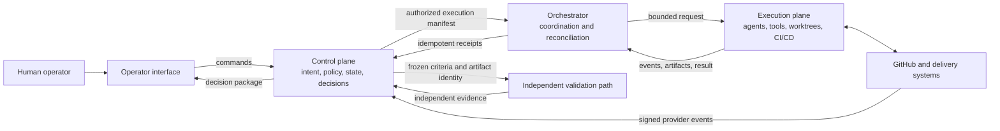

# Control Plane and Execution Plane

## 1. The problem

An AI Software Factory must both decide what work is allowed and perform that
work. Those responsibilities have different safety properties. Authorization,
policy, workflow state, approvals, and acceptance require consistency and
durability. Repository editing, model calls, test execution, and deployment are
long-running, failure-prone, and often occur on external machines.

When one process owns both decisions and effects, execution can accidentally
become authority. A worker may widen its own scope, mark itself successful,
retry without a budget, or continue after its approval expires. When authority
and state are pushed entirely into execution workers, the organization loses a
reliable answer to the question, “Why was this action permitted?”

The opposite design also fails. A database-oriented backend should not become
responsible for every model stream, subprocess, worktree, compiler, browser,
and deployment connection. Those workloads have different time limits,
resource needs, security boundaries, and recovery behavior.

The control-plane and execution-plane separation exists to keep governed truth
stable while allowing execution technology to remain replaceable and failure
tolerant.

## 2. Why the problem exists

Traditional delivery pipelines usually execute predefined steps. Agentic
workflows make decisions during execution. A worker may inspect the repository,
form a hypothesis, select tools, revise a local approach, and produce artifacts
that were not known when the workflow began. This flexibility increases the
importance of the authority envelope around the worker.

Execution also crosses unreliable boundaries. Processes crash. Hosts restart.
Networks partition. Webhooks arrive twice or out of order. Leases expire.
Credentials are revoked. A branch advances after evidence is recorded. Models
return plausible but unsupported claims. The factory must preserve its
authoritative state through every one of these conditions.

Teams often confuse deployment topology with architectural responsibility. A
React application may display control-plane data, but the browser cannot be the
authority boundary. A Hono server may coordinate work, but some of its code may
belong logically to control and some to execution. Convex may store execution
events without performing the execution. The distinction is determined by what
a component owns, not where it runs.

## 3. Enduring Principle

### The control plane decides; the execution plane performs

The control plane owns governed intent and the rules for changing authoritative
state. The execution plane consumes a bounded grant of authority, performs
effects, and returns observations. Execution results may inform a decision, but
they do not approve themselves.

The orchestrator sits at the boundary. It sequences work and reconciles events,
but it does not own the authority it coordinates. If it can approve its own
plan, change policy, widen repository scope, or accept its own evidence, the
separation has failed.

### Control-plane responsibilities

The control plane owns:

- human and service identity;
- Company, Workspace, Repository, and environment scope;
- versioned Factory Configuration;
- Mission, Plan, WorkOrder, and acceptance contracts;
- policy evaluation and risk classification;
- approvals, exceptions, budgets, and autonomy ceilings;
- dispatch eligibility and idempotency;
- leases, lifecycle state, cancellation, and retry authority;
- evidence requirements, freshness, waivers, and acceptance;
- immutable audit history; and
- the operator's required decision and safe options.

The control plane may calculate projections and recommendations. It should not
perform repository mutation simply because it stores the WorkOrder.

### Execution-plane responsibilities

The execution plane owns:

- model and agent runtime processes;
- repository checkout and attempt-specific worktrees;
- tool invocation and subprocess management;
- implementation, tests, builds, and browser operations;
- ephemeral runtime context;
- ordered execution events;
- output artifacts and hashes;
- heartbeats, local cancellation, and health signals; and
- interaction with authorized CI/CD or deployment systems.

The execution plane may report completion. It may not convert that report into
acceptance or grant itself another attempt.

### The interface is an execution contract

The control plane should dispatch an immutable execution manifest. At minimum,
the manifest identifies:

- Mission, Plan, WorkOrder, Task, and Attempt;
- exact repository, base commit, branch, and worktree;
- Factory Configuration, workflow, executor, model, and policy versions;
- allowed tools, paths, network access, secrets, and environment;
- acceptance criteria and required evidence;
- cost, time, token, concurrency, and retry budgets;
- lease, heartbeat, cancellation, and expiry rules; and
- idempotency and correlation identifiers.

The worker should reject a manifest it cannot satisfy. It must not silently
weaken isolation or substitute an unauthorized environment.

Execution returns ordered events and artifacts. Each event should carry an
Attempt identity, sequence number, timestamp, producer, correlation identifier,
and bounded metadata. The control plane treats delivery as at-least-once unless
the transport proves otherwise. Idempotency and reconciliation are therefore
part of correctness, not optional hardening.

### State ownership

| State | Authoritative owner | Why |
| --- | --- | --- |
| Intent and acceptance criteria | Control plane | They express human-governed purpose |
| Approval and policy decision | Control plane | Execution cannot grant itself authority |
| WorkOrder and Attempt lifecycle | Control plane | Durable recovery requires one shared truth |
| Process-local progress | Execution plane | The running worker observes it first |
| Durable execution event | Control plane after validated ingestion | Operators need replayable history |
| Working files in an active worktree | Execution plane | They are transient effects of the Attempt |
| Commit, PR, and CI facts | Source provider, referenced by control plane | GitHub remains authoritative for GitHub state |
| Evidence acceptance | Control plane | A receipt is an input to governance, not the decision itself |

### Independent validation is a separate execution path

Validation belongs to the factory's governance model but runs through an
execution path separate from implementation. The control plane freezes the
criteria and artifact identity. A validator receives no authority to alter the
implementation it evaluates. It emits independent evidence, and the control
plane determines whether that evidence satisfies policy.

Different people or models can strengthen independence, but technical
separation is essential: separate execution identity, clean environment,
independent commands, fresh evidence, and immutable receipts.

### Failure must be contained

The execution plane is expected to fail. A safe design assumes workers can
crash, hang, duplicate events, lose connectivity, or produce incorrect output.
The control plane responds through leases, timeouts, bounded retry, cancellation,
stale-evidence rules, and explicit reconciliation.

A retry is a new Attempt with a recorded reason and a new hypothesis. Resume is
valid only when the executor can prove deterministic checkpoint semantics. An
expired lease prevents new effects but does not erase late events; the control
plane retains and classifies them without allowing them to overwrite the
authoritative outcome.

## 4. Tradeoffs and alternatives

Separation adds infrastructure and latency. The factory needs service identity,
command signing, event ingestion, idempotency, health checks, and reconciliation.
A small prototype may run all components in one process, but it should preserve
the logical boundary in interfaces and state ownership so the system can be
separated later.

A control-plane-only architecture is operationally simple. It becomes fragile
when database functions have short execution limits or when work needs
persistent streams, subprocesses, local repositories, and long-lived leases.

A fully distributed execution architecture can scale and isolate workloads. It
also increases the number of partial failures and the difficulty of proving
exactly-once effects. Durable commands plus idempotent reconciliation are more
realistic than assuming reliable delivery.

Centralized orchestration makes policy and sequencing easier to understand. It
can become a bottleneck or single failure domain. Distributed orchestrators may
improve availability, but only if they share one authoritative control-plane
state and cannot create competing ownership.

The control plane may govern an external deployment system rather than replace
it. This preserves existing delivery investments but requires precise mapping
between factory decisions and provider state.

## 5. Current Mission Control Implementation

This assessment uses Mission Control commit
[`8014d5af427b43ff5c5a63cfdf82ec92742c208c`](https://github.com/jaydubya818/MissionControl/tree/8014d5af427b43ff5c5a63cfdf82ec92742c208c),
studied on 2026-08-08. The Mission Control working tree contained unrelated
in-progress changes, so all claims and links below refer to the pinned commit.

### Operator interface

The React application connects to Convex through `ConvexReactClient`. Clerk may
provide authenticated user identity. React renders commands, state, approvals,
exceptions, and evidence, but Convex mutations remain the server authority. A
disabled or manipulated client control must not bypass those mutations.

### Convex control plane

Convex is the durable source of truth for Mission Control. It stores the domain
hierarchy, Factory Configuration versions, WorkflowRuns, approvals, evidence,
events, artifacts, GitHub integration records, and audit data. Queries expose
projections. Mutations and actions enforce lifecycle changes.

Governed WorkOrder dispatch evaluates the active Factory version, readiness
assessment, configuration digest, repository and GitHub state, workflow,
executor, policy, verifiers, host, budget, recovery controls, worktree, and
concurrent mutation. Successful dispatch records the selected versions and
boundaries on the WorkflowRun.

Explicit WorkOrder acceptance is separate. Active execution, missing completed
runs, failed criteria, stale evidence, and unsatisfied approvals block it.

### Hono orchestration boundary

Mission Control runs a standalone Hono service under
`apps/orchestration-server`. It exposes authenticated routes for governed
dispatch, already-dispatched execution, approval and receipt handling, Mission
handoffs, validation results, acceptance, revisions, run events, and artifacts.

The original orchestration ADR placed the service under `packages/server`; the
implementation later moved to `apps/orchestration-server`. The architectural
decision—Hono coordinates while Convex remains authoritative—survived the path
change. This is an example of enduring intent outliving an implementation
detail.

Protected routes use bearer-token authentication. Production fails closed when
no orchestration token is configured. Development permits tokenless access,
which is convenient locally but cannot be treated as production evidence.

High-impact service commands currently use a signed envelope. The orchestration
service creates an HMAC signature over service identity, capability, project,
repository, command identity, time window, and payload digest. At the studied
commit, the narrow signed capabilities are WorkOrder dispatch and receipt
ingestion. Other orchestration routes do not yet share one universal service
command envelope.

### Workflow executor and adapter boundary

`apps/workflow-executor` is a long-lived process that polls Convex for WorkflowRuns
and executes workflow steps through `@mission-control/workflow-engine`. It has
graceful shutdown handling and an optional health endpoint.

The executor adapter interface defines capability discovery, configuration
validation, estimates, execution events, cancellation, optional resume, and
health. Mission Control selects `codex/v1` as the V1 production executor.

`CodexV1ExecutorAdapter` launches an ephemeral Codex CLI process. It checks that
repository and working-directory paths are absolute and contained, allowed
paths cannot traverse upward, prompts are present, and timeouts are bounded. It
supports read-only and workspace-write isolation, ordered events, cancellation,
bounded output, and basic credential redaction. It does not claim resume.

The repository root is expected to be an Attempt-specific worktree. The adapter
records allowed paths, but the executor contract explicitly states that exact
post-run changed-file enforcement remains part of the dispatch and golden-path
responsibility before pull-request creation.

### GitHub and external delivery

Mission Control stores repository connections and GitHub App capability state.
It records webhook deliveries for replay and idempotency, ingests head-SHA-specific
pull-request and CI evidence, and retains merge facts. GitHub remains the source
of truth for repository and pull-request state; Mission Control owns the
governed interpretation of whether those facts satisfy progression policy.

### Capability assessment

| Capability | Status at studied commit | Interpretation |
| --- | --- | --- |
| React-to-Convex operator path | Implemented | The UI subscribes and issues commands through Convex clients. |
| Durable control-plane state | Implemented | Convex stores authoritative domain, governance, and execution records. |
| Versioned governed dispatch | Implemented mechanism | Preflight and WorkflowRun snapshots bind execution to current Factory authority. |
| Standalone Hono orchestration | Implemented | Authenticated routes coordinate dispatch, receipts, events, and governance commands. |
| Signed service commands | Partial | Dispatch and receipt ingestion use signed envelopes; the pattern is not universal across every route. |
| Executor adapter contract | Implemented | The interface and `codex/v1` adapter define capabilities, isolation, events, cancellation, and health. |
| Attempt-specific worktree boundary | Contracted and partially enforced | Dispatch requires a worktree and the adapter contains execution, but exact changed-file enforcement remains a stated gap. |
| Independent validator path | Implemented in domain and selected workflows; end-to-end proof incomplete | Separate validator roles and receipts exist, but this chapter did not operate the complete browser golden path. |
| Event reconciliation under duplicate, late, or lost delivery | Partial | Idempotency records and event sequencing exist; comprehensive failure proof was not performed here. |
| Autonomous deployment | Outside the first proof | Mission Control governs release concepts, but Level 4 deployment authority is not claimed. |

### Verification boundary

The cited source and test files were inspected at the pinned commit. No fresh
browser journey or live executor run was performed for this chapter. The
chapter therefore establishes a source-backed architecture assessment, not
proof that the complete Mission-to-pull-request path currently works.

## 6. Future Vision

Mission Control should converge on one explicit execution-manifest contract for
every executor. The manifest should freeze every authority input and be hashed
into the Attempt record. Workers should attest to the manifest they consumed,
and all events and artifacts should carry that identity.

Every control-to-execution command should use scoped workload identity,
short-lived credentials, capability authorization, replay protection, and an
expiry window. Every execution-to-control event should be validated,
idempotently ingested, ordered, and reconciled against the current lease.

Repository enforcement should compare actual changed files, commits, and head
SHA with the authorized scope before a pull request is considered review-ready.
Independent validation should start from a clean environment and exact artifact
identity rather than inherit worker state.

The operator should see control-plane truth: current authority, actual
execution, missing or conflicting evidence, safe recovery actions, and the
decision required. Raw agent activity should remain drill-down detail.

This becomes a proven capability only after browser and runtime evidence shows
normal execution, policy rejection, cancellation, lost lease, duplicate event,
validator failure, corrective Attempt, and exact GitHub lineage without direct
database repair.

## 7. Versioned references

- [Mission Control North Star](https://github.com/jaydubya818/MissionControl/blob/8014d5af427b43ff5c5a63cfdf82ec92742c208c/docs/product/mission-control-north-star.md)
- [Mission Control V1 Product Strategy](https://github.com/jaydubya818/MissionControl/blob/8014d5af427b43ff5c5a63cfdf82ec92742c208c/docs/product/mission-control-v1-product-strategy.md)
- [Orchestration Architecture ADR](https://github.com/jaydubya818/MissionControl/blob/8014d5af427b43ff5c5a63cfdf82ec92742c208c/docs/decisions/001-orchestration-architecture.md)
- [Executor Adapter Contract](https://github.com/jaydubya818/MissionControl/blob/8014d5af427b43ff5c5a63cfdf82ec92742c208c/docs/architecture/executor-adapter-contract.md)
- [React application entry point](https://github.com/jaydubya818/MissionControl/blob/8014d5af427b43ff5c5a63cfdf82ec92742c208c/apps/mission-control-ui/src/main.tsx)
- [Convex schema](https://github.com/jaydubya818/MissionControl/blob/8014d5af427b43ff5c5a63cfdf82ec92742c208c/convex/schema.ts)
- [Governed WorkOrder commands](https://github.com/jaydubya818/MissionControl/blob/8014d5af427b43ff5c5a63cfdf82ec92742c208c/convex/workOrders.ts)
- [Factory dispatch preflight](https://github.com/jaydubya818/MissionControl/blob/8014d5af427b43ff5c5a63cfdf82ec92742c208c/convex/lib/factoryDispatch.ts)
- [Hono orchestration service](https://github.com/jaydubya818/MissionControl/blob/8014d5af427b43ff5c5a63cfdf82ec92742c208c/apps/orchestration-server/src/index.ts)
- [Signed service-command client](https://github.com/jaydubya818/MissionControl/blob/8014d5af427b43ff5c5a63cfdf82ec92742c208c/apps/orchestration-server/src/serviceCommandClient.ts)
- [Executor adapter interface](https://github.com/jaydubya818/MissionControl/blob/8014d5af427b43ff5c5a63cfdf82ec92742c208c/packages/workflow-engine/src/executorAdapter.ts)
- [Codex V1 executor adapter](https://github.com/jaydubya818/MissionControl/blob/8014d5af427b43ff5c5a63cfdf82ec92742c208c/apps/orchestration-server/src/codexExecutorAdapter.ts)
- [Workflow executor process](https://github.com/jaydubya818/MissionControl/blob/8014d5af427b43ff5c5a63cfdf82ec92742c208c/apps/workflow-executor/src/index.ts)

## 8. Notes and lessons learned

My current conclusions are:

- Authority and state ownership define the plane, not deployment topology.
- The browser is an operator surface, never the final policy boundary.
- The orchestrator coordinates authority but must not manufacture it.
- Convex can own durable execution state without performing long-running work.
- Executors are replaceable when they consume one stable manifest and emit one
  stable event contract.
- External systems remain authoritative for their own facts; Mission Control
  owns the governance decision based on those facts.
- At-least-once delivery, duplicate commands, late events, and lost workers are
  normal design conditions.
- An execution-complete event is evidence, not acceptance.
- Logical separation should exist even when every component initially runs on
  one laptop.

## 9. Interview and discussion questions

1. Define the control plane without naming a technology.
2. Define the execution plane without naming a model or agent framework.
3. Why is the React UI not the authority boundary?
4. Why should Hono not maintain a competing source of truth?
5. Which responsibilities make the orchestrator a boundary component?
6. What belongs in an immutable execution manifest?
7. How should the control plane handle a duplicate completion event?
8. What happens when a worker completes after its lease expires?
9. Why is executor-reported success insufficient for acceptance?
10. How does independent validation cross the two planes?
11. When is resume safer than creating a new Attempt?
12. Why should GitHub remain authoritative for pull-request state?
13. Which parts of Mission Control's boundary are implemented, partial, or
    unproven?
14. How would this architecture change for thousands of concurrent workers?

## 10. Whiteboard exercise

Draw the control plane, orchestrator, implementation executor, independent
validator, GitHub, and deployment system. Place every authoritative record in
one plane. Draw commands moving outward and events moving inward.

Then explain four failure paths:

1. dispatch is delivered twice;
2. the executor loses its heartbeat while the subprocess continues;
3. validation passes for an old head SHA;
4. Hono restarts after execution succeeds but before it records completion.

For each path, identify the authoritative state, idempotency key, reconciliation
action, retained evidence, and required human decision.

## 11. Hands-on lab

### Objective

Trace one governed dispatch from the React operator action through Convex, Hono,
the executor boundary, durable events, and the resulting operator projection.

### Starting version

- Repository: `jaydubya818/MissionControl`
- Commit: `8014d5af427b43ff5c5a63cfdf82ec92742c208c`
- Study date: 2026-08-08

### Tasks

1. Locate the UI command that initiates WorkOrder dispatch.
2. Trace the server-owned Convex mutation and every preflight input.
3. Record the exact Factory, policy, repository, workflow, executor, worktree,
   and budget versions written to the WorkflowRun.
4. Trace the Hono dispatch route and signed service-command envelope.
5. Trace the workflow executor and `ExecutorAdapter` interface.
6. Explain how `codex/v1` maps isolation and allowed paths into the CLI process.
7. Trace execution events and artifacts back into Convex.
8. Show why completion does not satisfy WorkOrder acceptance.
9. Replay the same dispatch command and verify idempotent behavior.
10. Inject one failed preflight and one duplicate or late execution event.
11. Record what the operator sees and how safe recovery proceeds.

### Required evidence

- exact commit and code-path trace;
- control-plane and execution-plane sequence diagram;
- dispatch manifest or equivalent WorkflowRun snapshot;
- preflight rejection and remediation;
- executor capability and health output;
- ordered event and artifact records;
- duplicate or late-event reconciliation result;
- acceptance state before and after independent Evidence; and
- five-minute developer and executive teach-backs.

### Cleanup

Use seeded data, a controlled repository, and an isolated worktree. Revoke or
remove temporary credentials. Do not modify the Mission Control product while
performing the documentation trace.

## Mastery standard

The chapter is mastered when I can place every responsibility in the correct
plane, trace one command and event cycle through Mission Control, explain how
authority survives executor failure, diagnose a split-brain design, and defend
the architecture to a developer, CTO, and security leader without notes.
