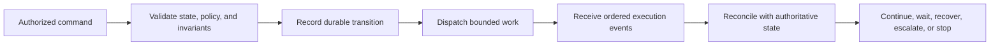
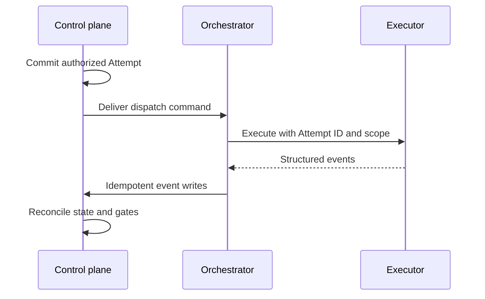

# Runtime Orchestration and State Machines

## 1. The problem

Approving a WorkOrder does not execute it. Between authorization and a
review-ready result lies a distributed process that may run for minutes or
hours, cross process and provider boundaries, survive restarts, wait for human
decisions, and receive duplicated or delayed events. An agent conversation is
not a sufficient runtime for this process. If the conversation ends, the work
must still have an authoritative state, owner, budget, and recovery path.

The orchestrator must turn an approved contract into controlled progress
without becoming a second source of truth. It must know what may run, what is
running, what happened, what can be retried, and which decision is now required.

## 2. Why the problem exists

Execution combines deterministic coordination with probabilistic workers.
Networks retry. Webhooks arrive twice. A process can crash after causing an
external side effect but before recording success. A model can emit malformed
output. A validator can fail after implementation succeeds. Humans can pause or
cancel while an executor is still reporting events.

These are not exceptional edge cases. They are the normal conditions of a
long-running distributed workflow. A sequence of mutable status labels cannot
explain them. The system needs explicit commands, events, invariants, and
reconciliation.

## 3. Enduring Principle

### Orchestration coordinates authority; workers perform bounded execution

The control plane owns durable intent, policy, state, and decisions. The
execution plane performs one authorized unit of work and reports structured
facts. The orchestrator connects them without allowing an executor to approve
its own work or invent its next authority.

### Commands request; events report; state is derived under rules

A command expresses intent: dispatch, pause, resume, cancel, retry, approve.
It may be rejected. An event reports an observed fact: process started, command
completed, artifact produced, validation failed. Events do not automatically
grant authority for the next action.

State machines define legal transitions and their guards. Useful runtime
invariants include:

- no execution before an approved, current contract;
- at most one active Attempt for a Task unless parallelism is explicit;
- terminal records do not silently reopen;
- completion cannot bypass required validation or acceptance;
- cancellation prevents new work even if late success arrives;
- every external side effect has a stable idempotency key;
- retries create new history rather than rewriting failed history; and
- every transition identifies actor, reason, time, governing version, and
  evidence.

### Persist before crossing an unreliable boundary

The safe pattern is to record the command or intent before dispatch, attach a
stable identity, and reconcile the eventual result. This prevents an HTTP
timeout from becoming uncertainty about whether work was authorized.

Exactly-once delivery is generally unavailable. Aim for at-least-once delivery
with effectively-once effects: stable keys, atomic claims, conditional writes,
and reconciliation against provider truth.

### Model the lifecycle at several levels

Mission, WorkOrder, Task, Attempt, workflow step, tool call, pull request, and
release have different state machines. A lower-level terminal state does not
imply a higher-level decision. An Attempt may complete while its Task awaits
review; a Task may finish while its WorkOrder lacks acceptance evidence.

### Treat waiting as a real state

Paused, blocked, awaiting approval, and awaiting evidence are not failures.
They identify what prevents progress and who or what can resolve it. Each wait
state should contain a reason, owner, deadline, required action, and automatic
resume behavior.

### Reconciliation is part of orchestration

The control plane must periodically compare its records with executor,
repository, CI, and delivery-provider facts. Reconciliation handles lost
responses, late events, expired leases, stale approvals, and provider actions
that happened outside the factory. It should repair projections or escalate
ambiguity without erasing history.

## 4. Tradeoffs and alternatives

A database-driven orchestrator is simple and observable but can create polling
load and contention. A queue improves delivery and backpressure but adds another
operational system. A workflow engine offers durable timers and retries but can
duplicate domain state if it becomes the business source of truth.

Event sourcing provides excellent history but increases projection and schema
complexity. Mission Control uses durable records plus append-only event streams,
a pragmatic middle ground. The important choice is not the brand of queue or
engine; it is the location of authority and the invariants around transition.

Parallelism reduces lead time but increases conflicts, cost, and coordination.
Concurrency should be bounded by dependency graphs, repository isolation,
budget, and merge strategy rather than maximized by default.

## 5. Current Mission Control Implementation

This assessment uses commit
[`b31e27564deb1c03c167e61b5ee094567c2ba7b1`](https://github.com/jaydubya818/MissionControl/tree/b31e27564deb1c03c167e61b5ee094567c2ba7b1),
studied on 2026-08-09.

Mission Control’s accepted orchestration decision places durable state in
Convex and long-running coordination in a Hono/Node process. The orchestration
server uses a Convex client, exposes protected operational routes, runs a
coordinator tick, and hosts executor adapters. It must not become an independent
state store.

Workflow definitions compile into linear or DAG graphs. The graph layer
validates duplicate IDs, unknown dependencies, self-dependencies, cycles,
conditions, output contracts, and bounded concurrency. WorkflowRuns retain a
snapshot, steps, current step, status, retry counts, timestamps, and links to
WorkOrders and Tasks.

Run events have sequence numbers and stable types for starts, steps, tools,
commands, files, artifacts, checkpoints, retries, human intervention, pause,
resume, failure, and completion. Events and artifacts accept idempotency keys.
Terminal failure or cancellation reconciles unfinished steps into failed,
blocked, or skipped states instead of leaving optimistic work behind.

The `codex/v1` adapter contract is narrower than the orchestration server. It
executes an already-authorized Attempt, validates repository and path scope,
emits ordered events, supports cancellation, and does not claim resumability.
It cannot approve, accept, merge, release, or widen authority.

The committed system is nevertheless incomplete at the real factory boundary.
The generic coordinator contains older task-decomposition behavior, and the
complete leased worker that turns a Factory-dispatched Attempt into an isolated
worktree, Codex execution, GitHub branch, exact-lineage PR, and restart-safe
completion remains part of uncommitted todo-024 work. The retained golden-path
lab therefore stopped before execution.

## 6. Future Vision

The production orchestrator should use one canonical command envelope, one
atomic Attempt claim, explicit lease and heartbeat semantics, durable timers,
bounded queues, and deterministic reconciliation. It should classify failures
into authorization, configuration, capacity, provider, executor, validation,
repository, and internal-system categories, each with a permitted response.

Promotion to current capability requires restart tests, duplicate and
out-of-order event tests, cancellation races, provider reconciliation, budget
stops, exact source provenance, and a browser-operated PR from a clean commit.

## 7. Versioned references

- [ADR-001: Orchestration Architecture](https://github.com/jaydubya818/MissionControl/blob/b31e27564deb1c03c167e61b5ee094567c2ba7b1/docs/decisions/001-orchestration-architecture.md)
- [Executor adapter contract](https://github.com/jaydubya818/MissionControl/blob/b31e27564deb1c03c167e61b5ee094567c2ba7b1/docs/architecture/executor-adapter-contract.md)
- [WorkflowRuns](https://github.com/jaydubya818/MissionControl/blob/b31e27564deb1c03c167e61b5ee094567c2ba7b1/convex/workflowRuns.ts)
- [Workflow state reconciliation](https://github.com/jaydubya818/MissionControl/blob/b31e27564deb1c03c167e61b5ee094567c2ba7b1/convex/lib/workflowRunState.ts)
- [Workflow graph](https://github.com/jaydubya818/MissionControl/blob/b31e27564deb1c03c167e61b5ee094567c2ba7b1/packages/workflow-engine/src/graph.ts)
- [Workflow executor](https://github.com/jaydubya818/MissionControl/blob/b31e27564deb1c03c167e61b5ee094567c2ba7b1/packages/workflow-engine/src/executor.ts)
- [Hono orchestration server](https://github.com/jaydubya818/MissionControl/blob/b31e27564deb1c03c167e61b5ee094567c2ba7b1/apps/orchestration-server/src/index.ts)
- [Golden-path assessment](../10-labs/evidence/2026-08-08-golden-path/README.md)

## 8. Notes and lessons learned

The key distinction is between an agent loop and an engineering workflow. The
loop reasons about the next action. The workflow owns durable progress and
authority even when no model process is alive.

Mission Control already contains several sound mechanisms, but they do not yet
compose into the completed production path. Architecture diagrams must not
collapse “adapter exists” into “factory execution works end to end.”

## 9. Interview and discussion questions

1. Why is exactly-once delivery usually the wrong promise?
2. What must be committed before an executor starts?
3. How do commands differ from events?
4. What should happen when completion arrives after cancellation?
5. Why must Task, Attempt, and WorkOrder state remain separate?
6. When would you adopt a workflow engine instead of database-backed state?
7. How do you prove restart safety?
8. Which Mission Control orchestration claims are implemented, partial, and
   future?

## 10. Whiteboard exercise

Draw dispatch through completion with Convex, Hono, an executor, a worktree,
GitHub, and CI. Add a process crash after GitHub accepts a PR creation request
but before Mission Control records the response. Show the idempotency key,
provider reconciliation, and authoritative records that prevent a duplicate PR.

## 11. Hands-on lab

Trace one committed WorkflowRun from creation through events, step transitions,
pause/resume, failure, and terminal reconciliation at commit `b31e275`. Record
the symbols, state guards, idempotency keys, and event sequence. Then design—but
do not claim as implemented—the missing lease and restart path for todo 024.

Required evidence: code-path notes, a state-transition table, one duplicate
event test, one late-event scenario, and five-minute developer and CTO
teach-backs. Cleanup is read-only; do not mutate the golden-path records.
