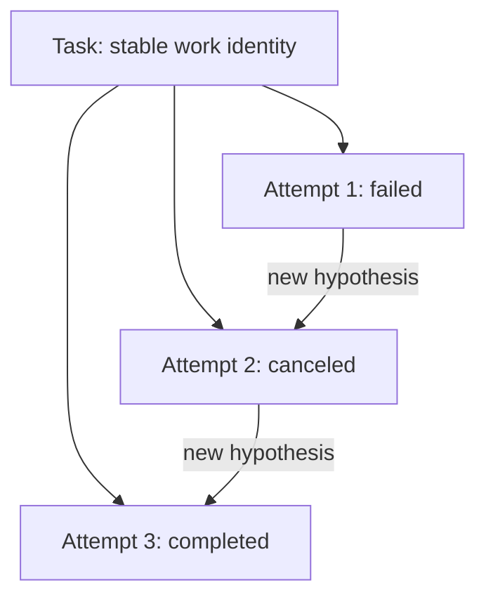

# Tasks, Attempts, Leases, Idempotency, and Recovery

## 1. The problem

Agent execution fails in ambiguous ways. A worker can disappear while its
process continues. A retry can duplicate a commit or pull request. A stale
worker can report success after another worker has taken over. If a Task and an
execution try are treated as the same record, recovery rewrites history and
operators cannot determine what actually happened.

## 2. Why the problem exists

A Task describes bounded work. An Attempt describes one historical try to
perform it. Distributed ownership is temporary, messages are delivered more
than once, and external systems do not participate in the factory’s database
transaction. Recovery therefore requires explicit identity, ownership time,
deduplication, and a new hypothesis.

## 3. Enduring Principle

### Preserve the Task; append Attempts

The Task retains objective, scope, dependencies, and lifecycle. Each Attempt
freezes executor, model, context, policy, base SHA, worktree, budget, start time,
and recovery relationship. Failed, timed-out, and canceled Attempts remain
immutable evidence. Retry creates Attempt N+1.

### A lease is temporary execution ownership

A worker atomically claims a pending Attempt with a lease owner, token or
fencing generation, expiry, and heartbeat. Renewal extends ownership only when
the caller still holds the current fence. Expiry makes the Attempt suspect, not
automatically failed: reconciliation must determine whether external effects
occurred.

A fencing token prevents a stale worker from writing after ownership transfers.
Every material completion write should prove the current lease generation.

### Idempotency identifies a logical operation

An idempotency key must be stable across transport retries and unique across
different logical operations. `create-pr:{attemptId}:{headSha}` is meaningful;
`create-pr:{timestamp}` defeats deduplication.

Idempotency belongs at every side-effect boundary: dispatch, event ingestion,
commit, push, PR creation, approval, receipt, and webhook processing. The
recorded result should be returned on replay. A database key cannot by itself
deduplicate a provider call; reconciliation must use provider identity as well.

### Recovery requires classification and a changed hypothesis

Retry is appropriate only when the failure is transient or a concrete input,
environment, plan, or implementation has changed. Repeating the same action
without new evidence wastes budget and can compound damage.

| Failure class | Default response |
| --- | --- |
| Authorization or policy | Stop and obtain valid authority; never retry blindly |
| Invalid configuration or context | Repair versioned configuration, then create a new Attempt |
| Capacity or rate limit | Back off within budget and deadline |
| Executor crash or lost lease | Reconcile external effects, then resume only if supported or create a new Attempt |
| Validation failure | Correct the defect through a new Attempt |
| Repository conflict | Rebase or replan with exact lineage |
| Unknown or contradictory evidence | Quarantine and escalate |

### Cancellation is a protocol

Cancellation first prevents new work, then signals the executor, records
acknowledgment or timeout, reconciles external effects, and terminates the
Attempt. It cannot guarantee that already-issued provider calls vanish. Late
events remain in history but cannot reopen authority.

### Retry budgets are multidimensional

Bound attempts, time, cost, tokens, repeated failure signatures, and human
interruptions. Exhaustion should create an attention item that explains what
was tried, what changed, and why another automatic Attempt is unsafe.

## 4. Tradeoffs and alternatives

Short leases detect failure quickly but cause false expiry during long tools;
long leases delay recovery. Heartbeat cadence, expiry, and reconciliation must
reflect operation duration.

Resuming a process can save work but requires trustworthy checkpoints and
exactly defined context. Starting a clean Attempt is simpler and more auditable.
Mission Control’s V1 Codex adapter correctly declares cancel support without
claiming resume.

Automatic retry improves availability for transient failures. It is dangerous
for authorization errors, unknown side effects, and deterministic validation
failures. Policy should control retry by failure class.

## 5. Current Mission Control Implementation

At commit
[`b31e27564deb1c03c167e61b5ee094567c2ba7b1`](https://github.com/jaydubya818/MissionControl/tree/b31e27564deb1c03c167e61b5ee094567c2ba7b1),
Mission Control models Task Attempts as WorkflowRuns linked by `parentTaskId`.

The governed scheduler requires an explicit canonical Child Task when one
exists. It rejects foreign, cross-workspace, ungoverned, Inbox, Review, Done,
and Canceled Tasks. Only Ready-compatible or In Progress Tasks can run. The
first dispatch is allowed only with no prior Attempt. Retry requires no active
Attempt, the latest failed Attempt, the same Task, and a recovery reason of at
least ten characters.

Each successful dispatch appends a WorkflowRun with Attempt and retry numbers.
The previous failure remains. Dispatch checks idempotency before event creation,
and Task transitions also retain idempotency keys and audited context. The
browser evidence for the bounded scheduler demonstrated two Attempts under one
Task, retained failure history, reload persistence, and no duplicate Task card.

This is not yet a production lease system. The committed baseline prevents
multiple active Attempts through state inspection, but it does not prove an
atomic leased worker with heartbeat, fencing token, stale-lease reconciliation,
or restart-safe Codex-to-GitHub ownership. Those mechanisms are being developed
under todo 024 and must remain Future Vision until committed and verified.

## 6. Future Vision

The Attempt record should include claim status, worker identity, lease
generation, heartbeat, expiry, execution manifest digest, worktree identity,
base and head SHAs, provider-side operation keys, and reconciliation state.
Late completion must be rejected when the fence is stale while its event is
retained for audit.

Recovery should surface a timeline of hypotheses, actions, evidence, cost, and
remaining budget. The factory should detect repeated failure signatures and
escalate rather than exhaust the budget mechanically.

## 7. Versioned references

- [Task Attempt Scheduler architecture](https://github.com/jaydubya818/MissionControl/blob/b31e27564deb1c03c167e61b5ee094567c2ba7b1/docs/architecture/task-attempt-scheduler-pr2.md)
- [Task–WorkOrder linkage](https://github.com/jaydubya818/MissionControl/blob/b31e27564deb1c03c167e61b5ee094567c2ba7b1/docs/architecture/task-workorder-linkage-pr1.md)
- [Attempt scheduler rules](https://github.com/jaydubya818/MissionControl/blob/b31e27564deb1c03c167e61b5ee094567c2ba7b1/convex/lib/taskAttemptScheduler.ts)
- [Task workflow rules](https://github.com/jaydubya818/MissionControl/blob/b31e27564deb1c03c167e61b5ee094567c2ba7b1/convex/lib/taskWorkflowState.ts)
- [Tasks](https://github.com/jaydubya818/MissionControl/blob/b31e27564deb1c03c167e61b5ee094567c2ba7b1/convex/tasks.ts)
- [Scheduler test results](https://github.com/jaydubya818/MissionControl/blob/b31e27564deb1c03c167e61b5ee094567c2ba7b1/docs/testing/task-attempt-scheduler-results.md)

## 8. Notes and lessons learned

The scheduler is an instructive example of progressive hardening. It proves
Attempt identity and reasoned retry without pretending that state inspection is
a lease. That precise language is more valuable than a broader autonomy claim.

## 9. Interview and discussion questions

1. Why is a retry a new Attempt?
2. What does a fencing token prevent?
3. How do you reconcile a timeout after a provider side effect?
4. Which failures must never be automatically retried?
5. What makes an idempotency key stable?
6. How does cancellation interact with late completion?
7. What has Mission Control actually proven about Attempts?

## 10. Whiteboard exercise

Draw two workers racing to claim one Attempt. Add lease expiry, a stale
heartbeat, a GitHub PR created before a network timeout, and a replacement
worker. Show the fence, provider reconciliation, immutable events, and the point
where human escalation becomes necessary.

## 11. Hands-on lab

At commit `b31e275`, trace the first dispatch and the latest-failed retry path.
Write a table of every rejection reason and its invariant. Then specify an
atomic `claimAttempt`, `renewLease`, and `completeAttempt` contract with fencing
without implementing it in Mission Control.

Required evidence: exact code paths, two Attempt IDs from retained browser
evidence, an idempotent replay test, a stale-worker scenario, and a recovery
teach-back. Cleanup is read-only.
