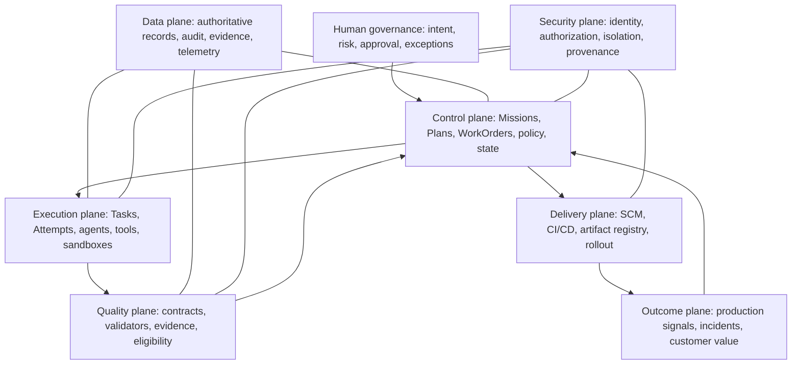

# AI Software Factory Reference Architecture

## 1. The problem

Individual components—agents, queues, policy engines, CI, evidence stores—do not explain how a factory remains governable. A reference architecture must connect business authority to execution, assurance, delivery, and feedback while preserving clear ownership of every decision.

## 2. Why the problem exists

Architectures often center the most novel component, usually the model. This hides the durable system: identities, state machines, contracts, isolation, evidence, policy, and human decisions. It also encourages duplicate sources of truth and direct UI-to-executor coupling.

## 3. Enduring Principle

### Organize the factory into cooperating planes

Planes are responsibility boundaries, not necessarily deployable services. A small V1 may implement several in one codebase while preserving their contracts.

### Control plane

Owns authoritative hierarchy, specification baselines, policy evaluation, approvals, dispatch eligibility, lifecycle transitions, exceptions, and reconciliation. It decides what may happen; it should not perform arbitrary repository mutation.

### Execution plane

Accepts frozen, bounded execution manifests. It claims work through leases, invokes models and atomic tools, operates in isolated sandboxes, produces artifacts and structured completion reports, and tolerates retries. It cannot expand its own authority or accept its own WorkOrder.

### Quality plane

Compiles quality contracts, runs independent deterministic and probabilistic validators, normalizes evidence, evaluates freshness and contradictions, and recommends or records eligibility under policy. Builder and validator execution contexts are logically separate.

### Delivery and outcome planes

The factory governs delivery but may delegate mechanics to GitHub Actions, Argo CD, or another system. It binds approvals and evidence to exact artifacts, observes canaries and production outcomes, and reopens or quarantines work when reality contradicts pre-release claims.

### Data plane

Maintain distinct stores or logical record classes for authoritative domain state, append-only audit history, immutable evidence, large artifacts, and sampled telemetry. Use one correlation spine, classification, retention, encryption, backup, and tenant isolation model. Never reconstruct authority from logs.

### Security plane

Every human, service, agent configuration, worker, and tool endpoint has an identity. Authorization is capability- and scope-based. Dangerous actions require explicit grants, risk gates, and short-lived credentials. Sandboxing, network/file boundaries, secret brokering, provenance, and tamper resistance constrain compromise.

### Human governance

Humans own Mission intent, material Plan approval, risk exceptions, authority promotion, consequential deployment, and policy/learning promotion. Operators should see evidence and surprises, not supervise every token.

### Preserve agent parity without equal authority

Any supported operator outcome should be achievable through an authorized tool/API path so agents are not second-class automators. That does not mean agents receive every human permission. Parity concerns reachable outcomes and composable primitives; governance determines who may invoke which primitive, for which subject, under which conditions.

### Use one orchestrator and event-driven contracts

A unified orchestration authority coordinates lifecycle state while workers remain replaceable. Commands request work; events report facts; domain mutations decide authoritative transitions. Idempotency keys, leases, compare-and-set transitions, outbox/inbox patterns, and reconciliation protect at-least-once delivery.

### Prefer atomic tools and explicit completion

Expose narrow primitives—read file, run test, create branch, publish PR—not opaque mega-tools that plan, mutate, approve, and report success. The orchestrator composes them under a manifest. Completion requires a structured report containing exact outputs, lineage, evidence references, and unresolved findings.

## 4. Tradeoffs

Plane separation improves reasoning and security but adds contracts and operational overhead. A modular monolith is often the right V1: one deployment, explicit modules, separate identities for external execution, and stable events. Microservices should follow demonstrated scale or isolation needs, not the diagram.

Multi-agent orchestration is a capability, not a mandatory topology. A single executor is preferable when specialization adds coordination cost without independent assurance.

## 5. Current Mission Control Implementation

Mission Control’s React UI and Convex functions form much of the control/data plane. The Hono orchestration server, executor adapters, worktrees, GitHub App integration, leases, run events, and artifacts form an emerging execution plane. QC runs, verification receipts, approval decisions, GitHub checks, and release-gate automation form an incomplete quality/delivery plane. Identity, permissions, governance policy, and sandbox controls supply parts of the security plane.

The boundaries are not equally mature. `convex/qcRuns.ts` still invokes mock adapters and contains a policy TODO; `convex/governance/releaseGateAutomation.ts` operates in `SHADOW`; PR publication and remote sandbox controls live on study branches rather than the cited main baseline; and the browser-operated Mission-to-validated-PR path remains the decisive proof gap.

## 6. Future Vision

Do not add more planes or top-level products. Complete one vertical slice: governed Mission, approved Plan, bounded WorkOrder, isolated Attempt, signed lineage, independent evidence, policy decision, review-ready PR, and human acceptance. Then extend the same contracts to deployment and production feedback.

## 7. Versioned references

- Mission Control main baseline: `b31e27564deb1c03c167e61b5ee094567c2ba7b1`
- Local source HEAD: `a49064875d0711253d74029e3066cc74c7c1c2a5`; staged-only runtime work is not a product claim
- Product sources: `convex/missions.ts`, `convex/factory/attempts.ts`, `convex/qcRuns.ts`, `convex/governance/releaseGateAutomation.ts`, `apps/orchestration-server/src/index.ts`, `apps/mission-control-ui/src/eos/`
- Related mastery chapters: control/execution planes, runtime state machines, security, quality, and specification engineering

## 8. Personal notes and lessons learned

- The model is a replaceable execution dependency; authority and evidence are the architecture.
- A plane is useful only if I can name the decision it owns and the records it may mutate.
- Agent-native parity should improve composability without erasing human accountability.
- V1 should be a vertical proof, not a catalog of horizontal platforms.

## 9. Interview questions

1. Why separate control and execution planes?
2. Is the quality plane a service, a team, or a responsibility boundary?
3. How do you support agent parity while preserving separation of duties?
4. When would you split the modular monolith?
5. How does at-least-once messaging affect Attempt and evidence design?

## 10. Whiteboard exercise

Draw all planes and the golden path in ten minutes. For every arrow state the command/event, identity, authoritative record, failure mode, idempotency strategy, and human decision. Then redraw it as a three-deployment V1 and defend what you combined.

## 11. Hands-on lab

Trace one Mission Control golden path across UI, Convex, Hono, executor, worktree, GitHub, validator, and review UI. Produce a sequence diagram and plane ownership table. Identify one direct coupling that violates the architecture, one missing identity boundary, and one place telemetry is being mistaken for evidence.
