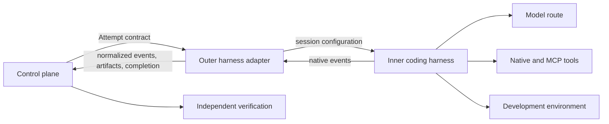

# Coding Harnesses, Adapters, and Agent Protocols

## 1. The problem

Coding harnesses expose different tools, permission models, session formats,
hooks, subagents, context behavior, output events, sandboxes, and completion
semantics. A factory that shells out to a CLI may appear provider-neutral while
silently depending on undocumented transcript files, terminal text, or one
product's lifecycle behavior.

Protocols improve interoperability at specific boundaries, but no one protocol
connects models, tools, editors, user interfaces, remote agents, development
environments, and factory governance. The architecture must say which boundary
each protocol serves and which controls remain local.

## 2. Why the problem exists

Interactive coding tools were designed to collaborate with a person, not to be
leased workers inside a durable distributed system. Human users can interpret
terminal output, approve prompts, notice an idle session, repair authentication,
and decide whether “done” is credible. A factory needs structured and
machine-verifiable equivalents.

Harness products also change rapidly. A feature matrix copied into enduring
architecture becomes stale. The stable design object is therefore a capability
contract and adapter conformance suite, not a permanent ranking of products.

## 3. Enduring Principle

### Separate the inner harness from the outer harness

The **inner harness** owns one model-tool loop. It prepares model input, manages
context, exposes tools, executes tool calls under its local permission model,
streams observations, compacts or resumes the session, and identifies when the
loop stops.

The **outer harness** makes that loop operable inside the factory. It validates
the frozen manifest, provisions the environment, starts or resumes the inner
harness, converts native events into the factory schema, enforces budgets and
timeouts, requests policy decisions, captures artifacts, classifies completion,
and tears down resources.

Neither harness owns Mission approval, WorkOrder acceptance, independent
verification, publication authority, merge, or release.

### Define a portable harness lifecycle

A factory adapter should support or explicitly reject:

- capability discovery and version negotiation;
- preflight and configuration validation;
- start, attach, resume, pause, cancel, drain, and terminate;
- user input and structured human-decision requests;
- model, tool, file, command, subagent, progress, warning, and cost events;
- permission and policy-decision callbacks;
- checkpoints, compaction, and session identity;
- structured terminal completion and unresolved-work reporting;
- artifact and receipt export;
- timeout, crash, malformed-output, and unavailable-provider classification;
- secret redaction and content-retention controls; and
- environment teardown and reconciliation.

Unsupported behavior must be visible in a **Harness Capability Manifest**.
Adapters should fail closed when a WorkOrder requires a capability the harness
cannot prove.

### Prefer structured programmatic execution over terminal scraping

Headless or non-interactive execution should emit typed events or a stable
structured stream such as JSON Lines. Terminal text may remain a diagnostic
artifact, but should not be the authoritative completion contract.

The factory should retain the adapter version, native session identity,
harness configuration, model route, instructions, tool grants, context digest,
environment digest, event ordering, exit state, and raw artifact references.
Never assume that process exit zero means the engineering task is complete.

### Treat hooks as integration points, not authority

Lifecycle hooks can observe or intercept session start, tool calls, file
changes, subagents, permissions, stop, and completion. They are useful for
logging, policy callbacks, credential injection, validation, notifications, and
cleanup.

A native hook is not automatically trustworthy. The factory must know whether
the hook is synchronous, bypassable, ordered, retryable, authenticated, and
covered by the harness's own configuration hierarchy. Consequential policy
belongs in an external authoritative control path or a qualified enforcement
point, not solely in a user-editable hook.

### Map protocols to their actual boundaries

| Protocol | Primary boundary | Useful for | Does not establish |
| --- | --- | --- | --- |
| MCP | Agent or host to tools, resources, prompts, and extensions | Tool discovery and invocation | Business authority, trustworthy tools, or acceptance |
| Agent Client Protocol (ACP) | Coding agent to editor or client | Portable agent/editor sessions and interaction | Factory workflow, environment qualification, or release governance |
| AG-UI | Agent backend to user-facing application | Bidirectional event streaming, state, tool, and user interaction | Durable domain authority or independent verification |
| Agent2Agent (A2A) | Independent agent application to agent application | Capability discovery, delegation, messaging, and remote task coordination | Permission to delegate factory authority or trust a remote agent |

The acronym **ACP** is ambiguous in the wider ecosystem. This guide uses it for
the Agent Client Protocol associated with editor-agent interoperability and
must pin the specification or implementation version whenever behavior matters.

Protocols may coexist. An editor can communicate with a coding agent through
ACP; that agent can reach tools through MCP; a factory UI can receive events
through AG-UI; and a remote specialist can be contacted through A2A. The
control plane still authenticates principals, scopes authority, freezes
contracts, reconciles state, and evaluates evidence.

### Test adapters through behavior, not product names

A conformance suite should test:

- capability truthfulness and unsupported features;
- event ordering, duplication, loss, and redaction;
- cancellation before, during, and after tool effects;
- timeout and process-crash recovery;
- permission denial and human-decision waits;
- context compaction and session resume;
- out-of-scope filesystem and network attempts;
- output-schema violations and false completion;
- model or provider fallback visibility;
- teardown and orphan detection; and
- exact lineage from native session to factory Attempt.

Two adapters are substitutable only for a specified workload and policy set.
One may be eligible for read-only analysis and ineligible for code mutation or
long-running recovery.

### Keep product comparisons dated

Codex and Claude Code are useful coding-harness case studies. Their model,
local/cloud, CLI, SDK, hooks, tools, permissions, session, and automation
features must be verified against current official documentation and a pinned
runtime before use. The durable lesson is that the product name may describe a
suite of experiences while the factory integrates with one exact harness and
version.

## 4. Tradeoffs and alternatives

Wrapping a mature harness provides rapid capability and creates adapter work
when native behavior changes. Building an inner harness provides control and
requires sustained investment in tool execution, context management, model
integration, permissions, user experience, and safety.

A thin adapter preserves native features but exposes the control plane to
provider differences. A thick adapter normalizes behavior and may erase useful
capabilities or create a false lowest-common-denominator abstraction. Preserve
native payloads as diagnostic artifacts while translating only the events and
commands required by factory contracts.

## 5. Current Mission Control Implementation

At study commit
[`d902fae`](https://github.com/jaydubya818/MissionControl/tree/d902fae7032c0696b531c44ae88829c652516fc6),
Mission Control defines a provider-neutral harness lifecycle, exact capability
manifests, structured results, Execution Manifest bindings, persistent-worker
and remote-sandbox backends, and a `codex/v1` adapter. It also separates
executing harnesses from independent verification and publication authority.

The studied Codex and DeepSeek capability manifests declared MCP unsupported,
and no first-class production MCP gateway was verified. The evidence also does
not establish an ACP, AG-UI, or A2A bridge, cross-harness conformance suite, or
complete proof of session resume and behaviorally equivalent substitution.
Generic harness architecture was present, while production execution remained
unconfigured.

## 6. Future Vision

Mission Control should expose one canonical harness contract with explicit
optional capabilities and native-extension envelopes. Each adapter should ship
with a pinned manifest, compatibility range, conformance results, security
review, event mapping, known loss of fidelity, and rollback path.

Protocol bridges should terminate at a policy-aware gateway. The operator must
be able to trace a UI event, editor session, remote delegation, tool call, and
native harness event back to one authorized Attempt without treating protocol
identity as authority. Promotion requires negative tests, version-upgrade
tests, cancellation races, content-redaction tests, and live canaries.

## 7. Versioned references

- [Software Factory Stack Boundaries](../00-overview/05-software-factory-stack-boundaries.md)
- [Model Context Protocol specification](https://modelcontextprotocol.io/specification/2026-07-28), version 2026-07-28
- [Zed: Agent Client Protocol](https://zed.dev/acp), accessed 2026-08-30
- [AG-UI protocol overview](https://docs.ag-ui.com/), accessed 2026-08-30
- [A2A Protocol specification](https://a2a-protocol.org/dev/specification/), accessed 2026-08-30
- [OpenAI: Unrolling the Codex Agent Loop](https://openai.com/index/unrolling-the-codex-agent-loop/), accessed 2026-08-30
- [Claude Code: programmatic execution](https://code.claude.com/docs/en/headless), accessed 2026-08-30
- [Claude Code: hooks](https://code.claude.com/docs/en/hooks), accessed 2026-08-30
- [Mission Control capability, workflow, and admission map](../09-mission-control-case-studies/03-capability-workflow-and-admission-map.md), assessed at `d902fae`

## 8. Notes and lessons learned

- A protocol standardizes messages at one boundary; it does not standardize the
  whole factory.
- Hooks are capabilities whose enforcement and failure behavior must be
  qualified.
- Portability means preserving required behavior and controls, not merely
  starting a process with a different command.
- Product names belong in dated case studies; contract vocabulary belongs in
  the canon.

## 9. Interview and discussion questions

1. How do inner and outer harness responsibilities differ?
2. What must a headless coding harness emit for reliable orchestration?
3. How do MCP, ACP, AG-UI, and A2A solve different problems?
4. Why can a native lifecycle hook be an unsafe policy boundary?
5. What would prove that two harnesses are safely substitutable?
6. When is a thick adapter preferable to a thin adapter?

## 10. Whiteboard exercise

Draw a factory using a web UI, control plane, outer harness, two interchangeable
coding harnesses, a development environment, MCP tools, and one remote A2A
specialist. Add an ACP editor client and AG-UI event stream. Mark authentication,
authority, lifecycle events, cancellation, evidence, and every place protocol
compatibility does not imply trust.

## 11. Hands-on lab

Build read-only adapters around two pinned coding-harness versions. Normalize
capability discovery, start, tool events, file observations, cancellation,
completion, and cost into one local schema. Run the same repository-analysis
task through both adapters and compare native and normalized traces.

Required evidence: capability manifests, version pins, event mapping, raw and
normalized traces, cancellation test, unsupported-capability failure, redaction
test, trajectory comparison, and a statement of where behavior was lost in
translation. Cleanup must terminate sessions and remove temporary credentials
and checkouts.
