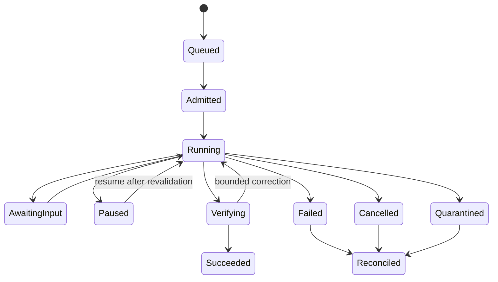

# Orchestration Component Model and Runtime Contracts

## Quick Read

- **Purpose:** Define the twelve component families that turn authorized work
  into bounded, durable, observable execution.
- **Control rule:** The orchestrator advances authoritative workflow state;
  models and workers propose actions but cannot widen authority or accept their
  own results.
- **Reliability rule:** Every loop has measurable acceptance, budgets, stop
  conditions, and a recovery path.
- **Deployment:** These are responsibilities and interfaces. A small V1 can
  implement several in one modular application.

## 1. The problem

A model call is not a runtime. Production orchestration must route intent,
freeze context and capability versions, manage durable state, authorize every
side effect, withstand duplicates and outages, stop nonconverging work,
produce independent evidence, and support human intervention. When these
responsibilities are implicit inside an agent loop, failure becomes
unreproducible and authority becomes ambiguous.

## 2. Enduring Principle

### Keep durable control outside probabilistic execution

The control plane owns workflows, transitions, policy, budgets, approvals, and
reconciliation. Workers receive immutable manifests and return structured
observations. The orchestration layer coordinates models, knowledge, tools,
memory, policy, reliability, telemetry, and humans without allowing one
dependency to become the source of truth for the whole run.

## 3. Canonical component catalog

| Family | Responsibility | Authoritative input | Owned output | Explicit non-responsibility |
|---|---|---|---|---|
| Intent and capability router | Classify request and choose an eligible workflow family | Intent, actor, inventory, risk, catalog | Routing decision with confidence and fallback | Changing intent or granting authority |
| Workflow and agent controller | Advance durable graph, dispatch, join, pause, cancel, reconcile | Approved plan, manifest, events | Workflow state and commands | Performing arbitrary tool effects |
| Prompt and context compiler | Assemble instruction hierarchy and immutable context | Task, policy, source selections, budgets | Prompt/context package with lineage | Treating retrieved text as authority |
| Model gateway and router | Select approved model profile and mediate inference | Task profile, policy, availability, cost | Model response, usage, version, finish state | Accepting task completion |
| Retrieval coordinator | Generate, filter, rank, and attribute candidates | Retrieval request and identity | Candidate and context-selection records | Altering source permissions |
| Tool and function manager | Validate, authorize, invoke, deduplicate, reconcile | Tool call proposal, grant, schema | Result, side-effect receipt, error | Broad workflow planning or approval |
| Session, state, and memory manager | Maintain scoped working state and governed durable memory | Events, policy, retention | Versioned state snapshots and memory proposals | Promoting observations to authority |
| Policy and authorization enforcer | Decide action eligibility and issue scoped grants | Identity, subject, action, resource, context | Allow/deny/condition decision and grant | Business acceptance |
| Guardrails and validation | Validate inputs, outputs, plans, actions, and artifacts | Exact subject and quality/policy contract | Findings, scores, eligibility inputs | Producer self-certification |
| Reliability controller | Apply timeout, retry, backoff, circuit break, fallback, compensation | Error taxonomy, operation contract, state | Recovery command and reconciled result | Retrying unknown side effects blindly |
| Observability, audit, evidence, and forensics | Correlate runtime facts and convert eligible proof | Events, traces, artifacts, evaluator results | Telemetry, audit, proof references, forensic bundle | Reconstructing authority from logs |
| Budget, rate, capacity, and concurrency controller | Admit and constrain resource use fairly | Priority, quota, costs, capacity, deadline | Reservation, limit, charge attribution | Overriding safety stop conditions for throughput |

## 4. Runtime contract envelope

```json
{
  "contractVersion": "1.0",
  "correlationId": "mission-184",
  "commandId": "cmd-991",
  "idempotencyKey": "attempt-7:tool-4",
  "actor": {"identity": "workload://worker/42", "grant": "grant-83"},
  "subject": {"type": "attempt", "id": "attempt-7", "version": 12},
  "tenant": "tenant-a",
  "classification": "confidential",
  "deadline": "2026-08-30T18:30:00Z",
  "budget": {"toolCalls": 20, "tokens": 90000, "costUsd": 8.0},
  "payload": {},
  "policyDecision": "decision-51",
  "traceContext": "00-...",
  "replyContract": "tool-result@2"
}
```

Consumers authenticate the sender, validate scope and schema, compare the
expected state version, reserve capacity, persist acceptance, and dispatch.
They return a durable acknowledgement distinct from completion. Results bind
the exact input digest, environment, dependency versions, outputs, costs,
errors, side-effect receipt, and unresolved uncertainty.

## 5. Workflow and attempt state



Only the state owner performs transitions. Events may request or inform a
transition but do not mutate the projection directly. Resume revalidates
manifest, source versions, policy, grants, leases, capability qualification,
budgets, and environment. If any governing input changes materially, create a
new attempt or explicit replan rather than pretending continuity.

## 6. Stop-condition table

| Condition | Detection | Terminal or intervention state | Required evidence |
|---|---|---|---|
| Acceptance satisfied | Independent quality contract passes | Verifying to succeeded | Eligible proof package |
| Maximum attempts | Durable attempt count | Failed or escalate | Attempt summaries and last findings |
| Maximum tool calls | Gateway counter | Pause or failed | Tool-call ledger |
| Elapsed-time budget | Monotonic deadline | Cancel or escalate | Deadline and control event |
| Token or monetary budget | Reserved plus actual usage | Pause before overrun | Usage and reservation ledger |
| No measurable improvement | Evaluator delta below threshold for N iterations | Stop correction; escalate or accept known gap by policy | Run comparison |
| Repeated equivalent failure | Normalized error fingerprint | Circuit open and escalate | Failure cluster |
| Human escalation requested | Decision event | Awaiting input | Request, owner, deadline |
| Policy denial | Authorization decision | Blocked or quarantined | Policy version and denial reason |
| Cancellation | Authorized command | Cancelled then reconciled | Command and acknowledgements |
| Dependency unavailable | Health, timeout, circuit state | Retry, fallback, pause, or fail by contract | Dependency and fallback events |
| Irrecoverable system failure | Reconciliation cannot establish safe state | Quarantine | State snapshot and incident reference |

Safety limits are hard boundaries. A model cannot negotiate extra attempts,
authority, or budget. Budget extension is a new human or policy decision.

## 7. Error and recovery taxonomy

- **Business rejection:** Correct the plan or output; do not retry unchanged.
- **Deterministic contract error:** Fail fast; fix schema or configuration.
- **Transient infrastructure error:** Retry only idempotent work with bounded
  exponential backoff and jitter.
- **Unknown external result:** Reconcile using idempotency key or provider
  query before any retry.
- **Capacity or rate denial:** Queue, shed, or route under policy; preserve
  fairness and deadlines.
- **Security or policy failure:** Fail closed, preserve evidence, and contain.
- **Quality nonconvergence:** Stop after measured limit and escalate with the
  best artifact plus unresolved findings.

Fallbacks are prequalified substitutions, not improvisation. They declare
semantic equivalence, changed cost/latency/quality, and any lower autonomy
ceiling.

## 8. Human intervention points

Humans approve material plans, exceptions, authority promotion, destructive or
privileged actions, consequential release, disputed evidence, and learning
promotion. Operators may pause, cancel, quarantine, reroute to an approved
fallback, request evidence, or start reconciliation. The interface displays
current state, pending effect, authority, evidence, uncertainty, alternatives,
deadline, and recovery implication.

## 9. Observability and evidence

All families emit correlated spans, structured events, logs, metrics, and cost
records using stable internal semantics. Minimum fields include workflow,
task, attempt, actor, capability/model/tool/evaluator versions, state before
and after, policy decision, environment, duration, usage, result class, and
error fingerprint. High-cardinality identifiers belong in traces and events,
not unbounded metric labels. Evidence eligibility additionally requires exact
subject binding, provenance, independence, freshness, and tamper protection.

## 10. Performance, capacity, and availability

Define SLOs separately for admission, dispatch, model/tool latency, state
commit, control actions, verification, and reconciliation. Reserve capacity
for cancellation and containment. Use concurrency keys for repositories,
environments, and privileged resources. Backpressure propagates to admission;
queues never create invisible promises beyond the declared deadline or budget.

## 11. Versioning and compatibility

Contracts use explicit versions and a producer/consumer support window.
Additive fields require tolerant readers; changed meaning or state semantics
require a new major version, dual-read/write migration, replay tests, and
rollback. Capability or policy revocation supersedes ordinary compatibility.
Retain decoders for evidence and audit records for their full retention period.

## 12. Tradeoffs, nonclaims, and maturity

A general workflow engine supplies durable execution but not factory-specific
authority, evidence, or capability semantics. A custom loop is simple but
quickly accumulates hidden state and recovery debt. Start with deterministic
graphs and isolated probabilistic steps. This review-ready specification does
not prove throughput, failover, state correctness, or cost behavior in an
implementation.

## 13. Interview and hands-on lab

Whiteboard a task that times out after an external mutation. Explain why an
immediate retry is unsafe, how reconciliation works, which state owner decides,
and what evidence remains. Then complete the
[Orchestration Failure, Recovery, and Cost Lab](../10-labs/11-orchestration-failure-recovery-and-cost-lab.md).
