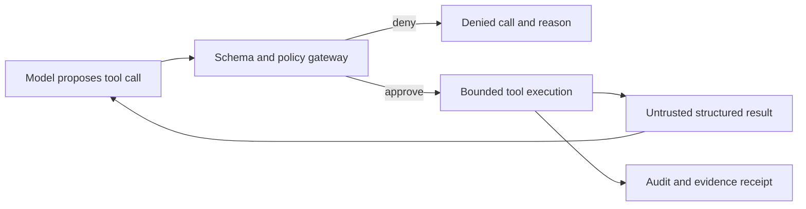

# Agent Architecture, MCP, Tools, Context, and Memory

## 1. The problem

A language model can reason about text, but an engineering agent must observe a
repository, use tools, preserve state, respect authority, and produce verifiable
artifacts. Adding more prompt text does not solve these requirements. It often
creates an opaque worker whose instructions, context, capabilities, and memory
cannot be versioned or audited.

## 2. Why the problem exists

Models are stateless between calls unless a system provides state. Context
windows are finite. Tool outputs and retrieved documents are untrusted. The
same model can behave differently as prompts, tools, dependencies, and provider
versions change. Multi-agent designs add specialization but also coordination,
correlated error, cost, and unclear accountability.

## 3. Enduring Principle

### An agent is a governed runtime composition

An engineering agent is not merely a model. It is a versioned composition of:

`identity + objective + instructions + model + tools + context + memory + policy + budgets + evaluation`

The execution manifest should freeze those inputs for an Attempt. Changing a
prompt, skill, model, tool grant, or context package changes the worker and may
invalidate prior evidence.

### Separate reasoning from authority

The model may select or propose a tool call. The runtime validates schema,
identity, policy, scope, risk, budget, and approval before execution. Tool
results return as untrusted observations and must not become instructions.

### MCP standardizes connection, not governance

The Model Context Protocol can expose tools, resources, and prompts through a
common interface. That improves portability and discovery. It does not prove
that a server is trustworthy, that its output is safe, or that an agent is
authorized to use it.

An enterprise MCP gateway should authenticate the agent runtime and server,
filter capabilities by WorkOrder, validate tool schemas, apply policy, redact
secrets, bound output, log calls, and support revocation. Each MCP server is a
supply-chain and data-egress boundary.

### Context engineering is controlled compilation

Context should be assembled from the WorkOrder, approved Plan, repository
facts, applicable policies, selected skills, relevant history, and current
evidence. Selection should be explainable and reproducible.

Good context architecture distinguishes:

- **authoritative context:** approved contracts, policy, exact source state;
- **reference context:** documentation and retrieved knowledge;
- **working context:** transient hypotheses and scratch state;
- **evidence:** observations tied to artifacts; and
- **instructions:** trusted runtime directives separated from retrieved data.

More context is not automatically better. Irrelevant context consumes tokens,
increases conflicting cues, and can hide the governing constraint.

### Memory is governed, typed, and revisable

Session memory supports one Attempt. Episodic memory records what happened.
Semantic memory stores claims and relationships. Procedural memory stores
skills, workflows, prompts, and runbooks.

Memory must retain source, scope, time, confidence, sensitivity, owner,
lifecycle, and contradiction. Operational records remain authoritative;
memory may reference or project them but must not silently rewrite them.

Promotion from observation to reusable procedure requires evaluation and human
approval. Memory poisoning is an authorization and integrity problem, not only
a retrieval-quality problem.

### Use multiple agents only for a reason

Multi-agent execution is a required factory capability, not a mandatory design
for every task. Add specialization when it improves independence, parallelism,
context isolation, or domain expertise. Do not add agents merely to simulate an
organization.

Useful roles include planner, implementer, validator, security reviewer, and
release analyst. Their contracts, inputs, outputs, and authority must remain
explicit. Independent validation requires more than a different persona name.

## 4. Tradeoffs and alternatives

A large general agent is simpler to operate but accumulates broad authority and
context. Specialized agents reduce cognitive scope but add handoff loss and
coordination cost. Deterministic code should handle parsing, policy, hashing,
routing rules, and state transitions where possible; models should handle
ambiguous interpretation and generation.

Long-term memory improves continuity but can amplify stale assumptions. RAG
reduces prompt size but introduces retrieval error. A knowledge graph improves
lineage and traversal at the cost of ingestion and consistency. Each mechanism
needs an evaluation proving that it improves the target workflow.

## 5. Current Mission Control Implementation

At commit
[`b31e27564deb1c03c167e61b5ee094567c2ba7b1`](https://github.com/jaydubya818/MissionControl/tree/b31e27564deb1c03c167e61b5ee094567c2ba7b1),
Mission Control contains several agent-platform components at different levels
of maturity.

Agent templates, versions, instances, and identities provide versioned registry
records. The older agent model also stores role, allowed task types and tools,
budgets, status, and heartbeats. A context router combines deterministic rules,
classification, confidence, capacity, and budget to choose clarification,
deferral, one Task, or coordinator decomposition.

The Context Registry supports versioned packages, semantic version ranges,
repository manifests, lock files, published content hashes, installation
records, verifiers, and idempotent activation receipts. Executor-facing
activation rejects unpublished or hash-mismatched content and links the locked
package set to a WorkflowRun. This is a strong example of compiling context
rather than copying arbitrary prompt text.

Mission Control records tool calls and applies risk policy, while the executor
adapter freezes repository root, allowed paths, isolation, timeout, and model.
Provider packages implement structured model tool-call formats.

Memory is partial. `packages/memory` implements session, project, and global
in-memory abstractions. Convex records run episodes and execution traces and can
consolidate batches into knowledge graph nodes. The proposed GraphRAG design
correctly identifies missing provenance, contradiction, permission-aware
retrieval, ingestion checkpoints, evaluation, and correction lifecycle. The
live audit described an empty operational graph, so the proposal must not be
presented as a production memory system.

MCP is currently adjacent rather than a canonical governed subsystem. Product
documents and plugin guidance describe MCP integrations, but the committed
baseline does not prove a first-class MCP server registry, policy gateway,
capability lifecycle, and end-to-end factory execution through MCP. That remains
future work.

## 6. Future Vision

Every Attempt should retain an execution-manifest digest covering agent version,
model, prompt, tool grants, MCP servers, context lock, memory snapshot, policy,
and budgets. The runtime should expose only WorkOrder-scoped tools through a
governed gateway.

Memory ingestion should be idempotent and checkpointed. Retrieval should filter
by tenant, repository, time, lifecycle, sensitivity, and agent authority and
return citations plus “why retrieved.” Promotion of prompts, skills, workflows,
and learned rules should require evaluation and human approval.

## 7. Versioned references

- [Agent identities](https://github.com/jaydubya818/MissionControl/blob/b31e27564deb1c03c167e61b5ee094567c2ba7b1/convex/registry/agentIdentities.ts)
- [Agent versions](https://github.com/jaydubya818/MissionControl/blob/b31e27564deb1c03c167e61b5ee094567c2ba7b1/convex/registry/agentVersions.ts)
- [Context manifests](https://github.com/jaydubya818/MissionControl/blob/b31e27564deb1c03c167e61b5ee094567c2ba7b1/convex/context/manifests.ts)
- [Context activation](https://github.com/jaydubya818/MissionControl/blob/b31e27564deb1c03c167e61b5ee094567c2ba7b1/convex/context/activation.ts)
- [Context router](https://github.com/jaydubya818/MissionControl/blob/b31e27564deb1c03c167e61b5ee094567c2ba7b1/packages/context-router/src/router.ts)
- [Memory lifecycle](https://github.com/jaydubya818/MissionControl/blob/b31e27564deb1c03c167e61b5ee094567c2ba7b1/convex/memoryLifecycle.ts)
- [Graph-assisted memory proposal](https://github.com/jaydubya818/MissionControl/blob/b31e27564deb1c03c167e61b5ee094567c2ba7b1/docs/plans/memory-graphrag-architecture.md)
- [Plugin and MCP guidance](https://github.com/jaydubya818/MissionControl/blob/b31e27564deb1c03c167e61b5ee094567c2ba7b1/docs/CREATING_PLUGINS.md)

## 8. Notes and lessons learned

Context locks are one of Mission Control’s most transferable ideas. They make
the invisible inputs to agent behavior versioned and attributable. The next
step is to apply that same rigor to the complete execution manifest.

## 9. Interview and discussion questions

1. What makes an agent different from a model call?
2. What problems does MCP solve, and what does it not solve?
3. How do you prevent retrieved text from becoming authority?
4. When is multi-agent orchestration justified?
5. How should memory contradictions be represented?
6. Which inputs must an execution manifest freeze?
7. What has Mission Control proven about context and memory today?

## 10. Whiteboard exercise

Draw an agent runtime with a model, tool/MCP gateway, context compiler, memory,
policy engine, and evidence stream. Show a malicious repository document asking
the agent to exfiltrate a secret. Explain every boundary that prevents it.

## 11. Hands-on lab

Trace a repository manifest through version resolution, lock creation, context
activation, and WorkflowRun receipt at commit `b31e275`. Change a package hash
in a disposable fixture and prove activation fails. Then design the complete
execution manifest that todo 024 should retain.

Required evidence: manifest, lock, package versions and hashes, activation
receipt, failure output, and teach-backs for an AI engineer and CTO.
