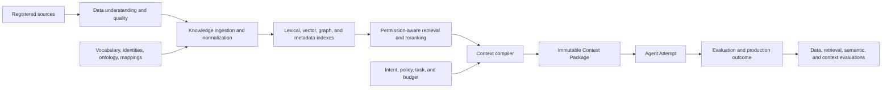

# Data, Knowledge, Context, and Semantic Engineering

## 1. The problem

An agent cannot compensate reliably for missing, stale, contradictory, or
misunderstood information. If a source omits the latest policy, two systems use
different meanings for the same term, or retrieval selects the wrong document,
the model receives a defective decision environment before reasoning begins.

Agent failures are therefore often data, knowledge, context, or semantic
failures presented as model failures. Treating all four as “RAG” hides which
engineering system must be corrected.

## 2. Why the problem exists

Operational information is distributed across repositories, requirements,
design documents, tickets, incidents, conversations, telemetry, and databases.
Each source has different authority, freshness, permissions, structure, and
failure modes. Retrieval can return a relevant but obsolete document. A correct
document can use language the agent maps to the wrong domain concept. A large
context window can hold all of it and still emphasize the wrong evidence.

The four disciplines operate at different times:

- **Data Understanding** determines whether source data is fit for use.
- **Knowledge Engineering** transforms approved sources into retrievable,
  traceable knowledge.
- **Semantic Engineering** makes terms and identities mean the same thing
  across sources and systems.
- **Context Engineering** selects and assembles the smallest sufficient input
  for one decision or Attempt.

## 3. Enduring Principle

### Preserve the handoff from source fact to model context

Every handoff should retain source identity, version or observation time,
authority class, sensitivity, tenant, transformation lineage, and reason for
selection. A model citation is useful only when the system can resolve it back
to the exact source material that was used.

### Engineer data fitness before retrieval

A source profile should answer:

- Is required data present, or is it missing?
- Is it current enough for this decision?
- Is its schema and meaning stable?
- Is it duplicated or contradictory?
- Which system and owner are authoritative?
- Which tenants, identities, and purposes may use it?
- Which transformations have been applied?
- How are correction, retention, and deletion propagated?

A **Data Contract** makes these expectations explicit: schema, semantics,
quality thresholds, freshness, owner, sensitivity, lineage, allowed uses, and
failure behavior. Missing data should produce an explicit unknown or blocked
state when the workflow cannot proceed safely; it should not be converted into
a confident default.

### Build knowledge as a governed lifecycle

Knowledge Engineering includes source registration, connector identity,
checkpointed ingestion, parsing, normalization, chunking, metadata enrichment,
indexing, correction, reprocessing, and retirement. The system should know
which source version and transformation produced every indexed unit.

Retrieval may combine:

- lexical search such as BM25 for exact names and uncommon tokens;
- dense vector search for conceptual similarity;
- metadata and relationship filters for scope and authority;
- hybrid fusion for complementary candidate sets;
- graph traversal for explicit relationships and lineage; and
- reranking to order candidates for the actual task.

No retrieval method is universally best. Code symbols, policy identifiers,
natural-language concepts, and dependency relationships reward different
methods. Evaluate the complete retrieval pipeline on representative queries.

### Treat semantics as executable infrastructure

A controlled vocabulary defines preferred terms, aliases, and deprecated
terms. A taxonomy organizes concepts. An ontology adds typed relationships and
constraints. Entity resolution maps different source identifiers to one
canonical entity while preserving source-specific identities.

A **Semantic Contract** should define canonical concepts, identifiers, allowed
relationships, disambiguation rules, source mappings, owner, version, and
compatibility policy. An unresolved term should remain ambiguous rather than be
silently mapped. Semantic changes can invalidate retrieval results, context
packages, evaluations, and downstream evidence.

### Compile context for the decision, not the corpus

The context compiler begins with task requirements, policy, risk, actor,
repository scope, model limits, and a token budget. It then selects,
deduplicates, orders, compresses, and attributes material according to explicit
rules.

Useful controls include:

- authority tiers separating approved contracts from reference material;
- recency and lifecycle filters;
- permission-aware retrieval before ranking;
- diversity controls that avoid ten near-identical chunks;
- contradiction detection and source comparison;
- token allocation by context class;
- compaction with retained decisions and unresolved issues;
- cache keys bound to source and policy versions; and
- “why retrieved” metadata for inspection and evaluation.

Context is an Attempt input, not an authority record. Retrieved text cannot
alter the approved Mission, policy, tool grants, or acceptance criteria.

### Evaluate each layer separately and together

Data evaluations measure completeness, freshness, validity, consistency, and
permission correctness. Retrieval evaluations measure candidate recall,
ranking, and source coverage. Semantic evaluations test aliases, identity
resolution, ambiguity, and relationship correctness. Context evaluations test
whether the final package is sufficient, minimal, current, attributable, and
free of governing contradictions.

End-to-end task success remains necessary but is not diagnostic. A system that
only records final success cannot determine whether improvement should target
the source, ingestion, semantics, retrieval, context policy, model, or tool.

## 4. Tradeoffs and alternatives

Centralizing knowledge simplifies governance and discovery but can create a
stale copy of systems that already have authoritative APIs. Live retrieval
preserves currentness but increases latency and dependency risk. A hybrid
approach may index discovery metadata while resolving consequential facts from
the source at decision time.

Fine-grained chunking improves targeted retrieval but can remove necessary
context. Large chunks preserve narrative structure but consume budget and blur
ranking. Knowledge graphs improve explicit traversal and lineage at the cost of
modeling, ingestion, and consistency work.

An ontology is valuable when several sources repeatedly disagree about meaning.
It is premature when a small controlled vocabulary and stable identifiers solve
the actual problem. Semantic engineering should remove measured ambiguity, not
create a speculative enterprise model of everything.

## 5. Current Mission Control Implementation

At study commit
[`d902fae`](https://github.com/jaydubya818/MissionControl/tree/d902fae7032c0696b531c44ae88829c652516fc6),
Mission Control has provenance-backed retrieval, graph relationships, planning,
Attempt-bound Context Packages, context evaluations, configuration drift scans,
versioned context manifests, and content-hash checks. Factory Memory is
advisory and cannot satisfy acceptance.

These mechanisms provide a strong context-governance foundation. The studied
evidence does not establish a complete production source registry, connector
and checkpoint lifecycle, data-quality gate, semantic-contract registry,
permission-aware hybrid retrieval service, or independently benchmarked
reranking pipeline. The graph and memory mechanisms should therefore not be
presented as a general enterprise knowledge system.

## 6. Future Vision

Mission Control should register approved sources with ownership, authority,
classification, retention, and ingestion policy. It should produce versioned
knowledge artifacts and semantic contracts, evaluate retrieval by workflow and
persona, and freeze the resulting context selection into each Execution
Manifest.

An operator should be able to inspect missing required data, stale sources,
semantic ambiguity, retrieval candidates, reranking decisions, excluded
sources, token allocation, citations, and the exact context package used by an
Attempt. Promotion requires tenant-isolation tests, correction propagation,
deletion tests, representative retrieval evaluations, and end-to-end outcome
evidence.

## 7. Versioned references

- [Agent Architecture, MCP, Tools, Context, and Memory](./01-agent-architecture-mcp-tools-context-and-memory.md)
- [Mission Control capability, workflow, and admission map](../09-mission-control-case-studies/03-capability-workflow-and-admission-map.md), assessed at `d902fae`
- [NIST AI Risk Management Framework](https://airc.nist.gov/airmf-resources/airmf/), accessed 2026-08-30
- [Lewis et al.: Retrieval-Augmented Generation](https://arxiv.org/abs/2005.11401), version accessed 2026-08-30
- [Robertson and Zaragoza: The Probabilistic Relevance Framework](https://www.staff.city.ac.uk/~sbrp622/papers/foundations_bm25_review.pdf), accessed 2026-08-30
- [Cormack, Clarke, and Buettcher: Reciprocal Rank Fusion](https://dl.acm.org/doi/10.1145/1571941.1572114), accessed 2026-08-30

## 8. Notes and lessons learned

- Knowledge is prepared for reuse; context is compiled for one decision.
- A citation without source identity, version, and permission is decoration.
- The semantic layer should be as small as possible and as explicit as
  necessary.
- “The model missed it” is not a root cause until upstream layers are ruled out.

## 9. Interview and discussion questions

1. How do Data Understanding, Knowledge Engineering, Semantic Engineering, and
   Context Engineering differ?
2. When would lexical retrieval outperform vector retrieval for code work?
3. What must be retained to reproduce a Context Package?
4. How should the system behave when authoritative sources disagree?
5. Which semantic changes invalidate prior evaluation evidence?
6. Why must permission filtering occur before context reaches the model?

## 10. Whiteboard exercise

Design a knowledge and context path for a multi-repository security change.
Include source registration, missing-data checks, lexical and vector retrieval,
entity resolution, reranking, permission filters, contradiction handling,
context budgeting, citations, and four distinct evaluation layers. Introduce an
obsolete policy document that ranks highly and show how the system detects it.

## 11. Hands-on lab

Create a synthetic corpus containing two repository manifests, three policy
versions, conflicting aliases for one service, and one intentionally missing
ownership record. Build a small evaluation set covering exact identifiers,
conceptual queries, permissions, staleness, and ambiguity. Compare lexical,
vector, and hybrid retrieval, then compile an immutable Context Package for one
test WorkOrder.

Required evidence: source registry, data-quality report, semantic mappings,
dataset version, retrieval metrics, selected and excluded sources, context
digest, citations, and a failure demonstrating that missing authoritative data
blocks the Attempt. Cleanup must remove disposable indexes and synthetic data.
