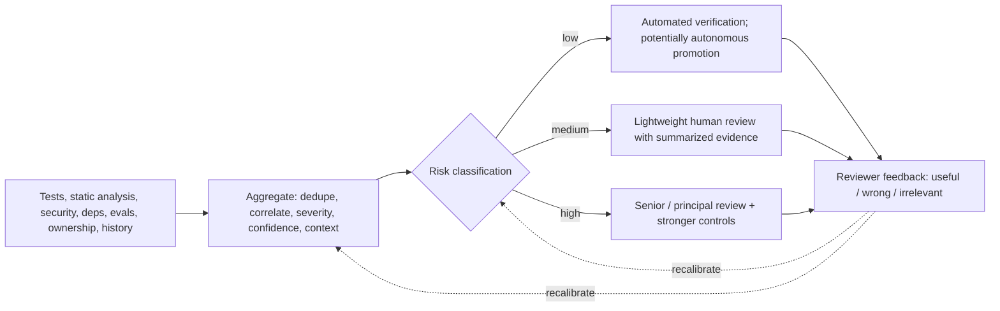
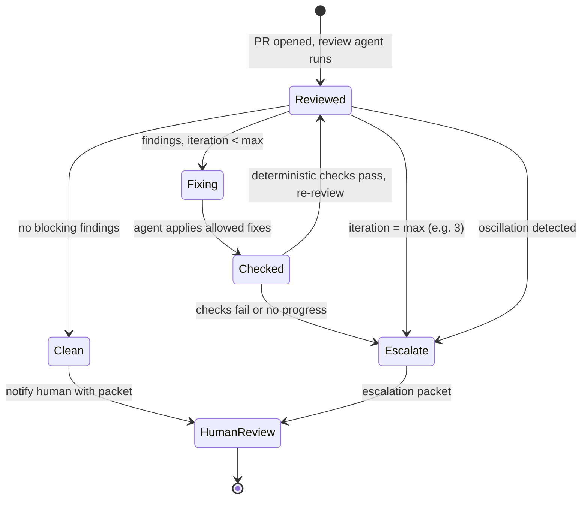
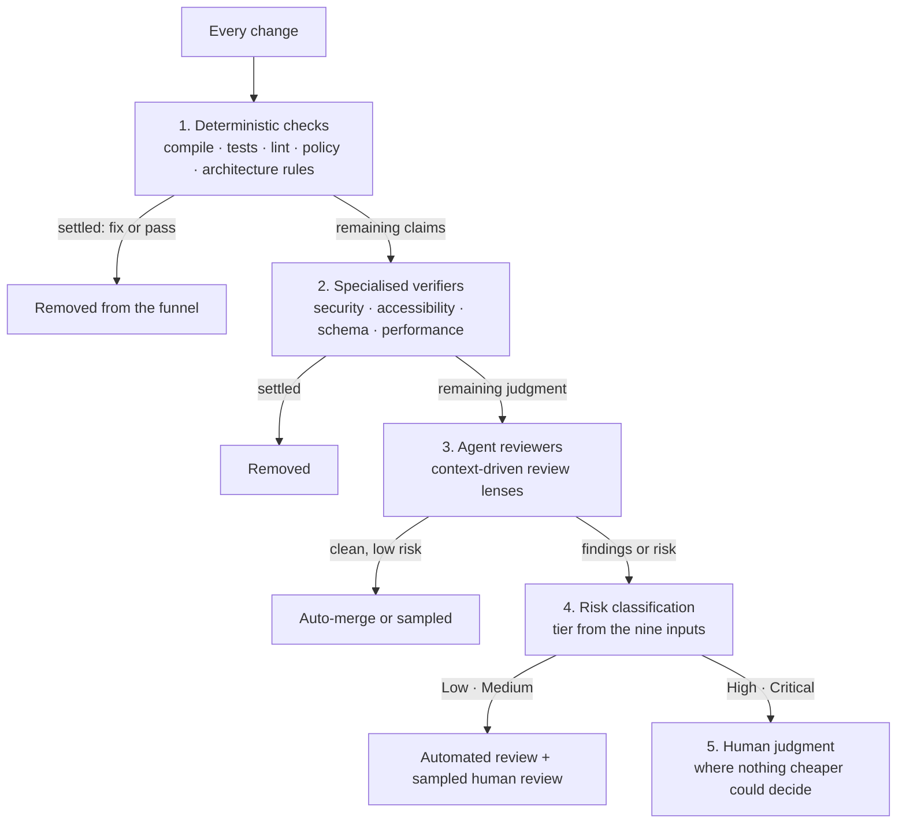
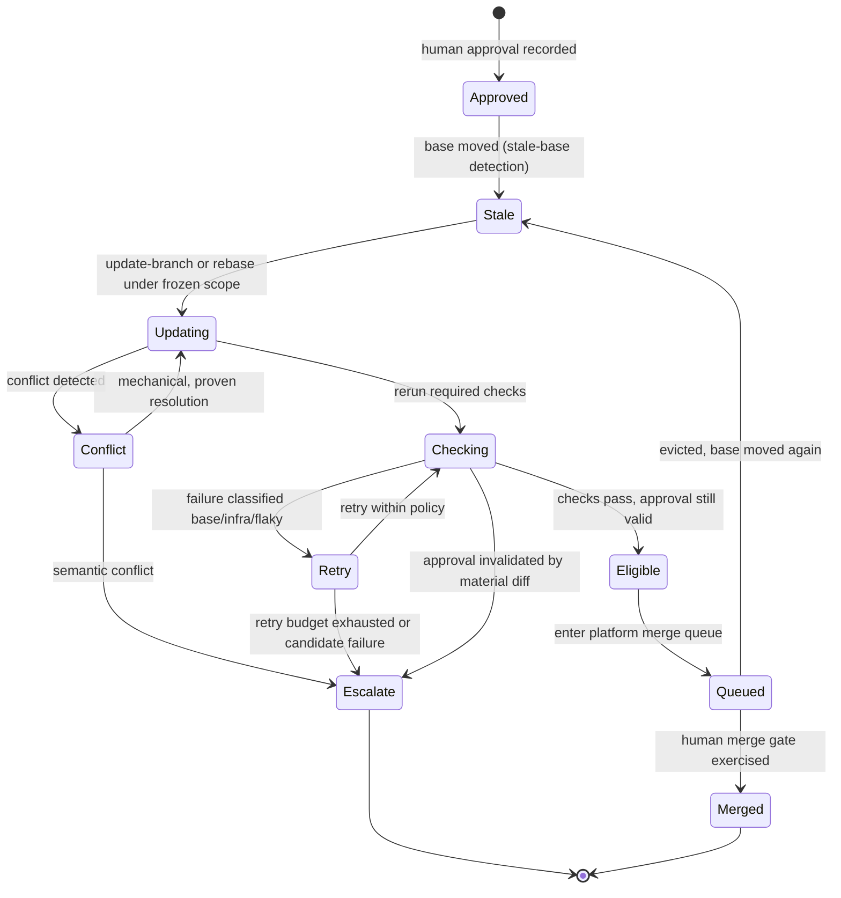
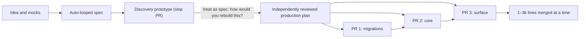

# 32. Production feedback, automated review, and the agentic merge queue

Part IV showed how the factory proves a change before it ships. This chapter
follows the change after it ships: a user reports something wrong, the factory
has to decide whether the report is real, reproduce it, fix it, get the fix
reviewed, and land it — and the last mile of review and merge is where most of
the remaining human time quietly goes. After reading it you should be able to
draw the path from an untrusted bug report to a merged fix and say, at every
step, which record carries the authority and which does not.

## The problem

User feedback is valuable and incomplete. A report may describe a version that
was fixed last week, duplicate a symptom someone else already filed, leave out
the operating conditions that matter, or blame the wrong component. If every
report becomes an engineering issue, the backlog fills with low-confidence
work. If an agent is allowed to "just fix" the report as written, an
unverified observation has been turned into authority to change the codebase.

The pain does not end once a valid fix exists. Automated reviewers post
comments; the base branch moves; CI takes forty minutes; a conflict appears;
the merge queue evicts the candidate; someone has to notice and push again.
One team described this as being buried under an overwhelming number of tiny
pull requests, each of which would improve the product, each of which costs a
human a slice of attention to shepherd through review and merge. The factory
needs a governed path from uncertain feedback to reproducible evidence, and
then from an approved candidate to a merged commit — without a person polling
GitHub all afternoon.

## How it works

### Six records, not one

The path from report to merge passes through feedback, issue, reproduction,
fix, pull request, review, and merge. These are different records, and most of
the damage in feedback handling comes from collapsing them. Each collapse
produces a false claim: a report is treated as proof of a defect; a generated
reproduction is treated as authoritative; a passing reproduction is treated as
root cause; an automated review comment is treated as an acceptance gate;
resolving every comment is treated as proof of quality; entering a merge queue
is treated as permission to merge.

The whole design below is a chain of promotions. Feedback becomes more
authoritative only as its evidence improves, and every promotion leaves the
earlier record intact. Think of a hospital triage desk: the patient's own
description is recorded verbatim, but it is the nurse's observation and then
the physician's diagnosis that authorize treatment, and the chart keeps all
three.

### From untrusted feedback to a verified reproduction

<!-- infographic: feedback-to-reproduction -->
> **Infographic — From untrusted feedback to a verified reproduction.** *(Jay's graphic goes here.)* Until then, the diagram below
> carries the same concept.

```mermaid
flowchart LR
    Report["Untrusted feedback"] --> Normalize["Normalize, redact, identify version"]
    Normalize --> Current{"Still present on latest eligible version?"}
    Current -->|no| Notify["Explain status, notify reporter"]
    Current -->|unknown| Human["Human investigation"]
    Current -->|yes| Dedupe["Cluster and deduplicate"]
    Dedupe --> Repro["Generate N reproductions, verify independently"]
    Repro -->|insufficient| Human
    Repro -->|verified| Issue["Promote to governed issue or Mission"]
    Issue --> Classify["Classify severity, priority, difficulty"]
    Classify --> Shepherd["Assign human shepherd, ping in Slack"]
    Shepherd --> Fix["Plan, implement, verify"]
    Fix --> Regression["Retain regression case, run on every PR"]
    Regression --> Review["Automated and human review"]
    Review --> Merge["Bounded merge maintenance"]
```

The pipeline begins from a stance that sounds cynical and is simply accurate:
**untrusted feedback intake** treats every report as an observation of unknown
quality, because users report things however they report them. The first step
is **feedback normalization** — parse the report into a structured record,
redact personal data, and pin down the product, build, and version the user was
actually on.

The second step is **latest-version verification**. Before spending any
engineering effort, check whether the reported behavior still exists on the
current eligible version. A surprising fraction of reports describe already-fixed
behavior, and those users can be told so quickly, which is both the cheapest
outcome and the one that most improves the reporter's trust. The check can be
wrong — a flaky defect may look fixed on one run — so the answer is three-way:
present, absent, or unknown, and "unknown" routes to a person rather than to a
confident guess.

The third step is **feedback deduplication and clustering**: search for an
existing reproduction or issue that matches. Clustering may group reports by
symptom, affected component, error signature, or reproduction, but similar
text does not prove the same root cause, and deduplication must be kept
separate from **equivalence**. Record the confidence and rationale for linking
or separating reports, permit later splitting and merging, and preserve each
reporter's specific impact so the eventual notification is accurate. Nobody has
seen a deduplication agent that is good; but an agent that correctly collapses
half the duplicates saves half the human time, and that is the standard to hold
it to. The practitioners who built this pipeline attach an expected accuracy to
each subsystem and accept that each one will be wrong at some cadence.
Partial automation that safely resolves or routes a large, measurable subset is
the goal; fictional full autonomy is not.

The fourth step is the one worth the most engineering: **reproduction generation**,
the agent workflow that turns an untrusted report into a runnable, repeatable
failing case the factory owns. Because the report cannot be trusted, the
factory burns its own tokens to produce a **canonical or minimal
reproduction** — and it is worth
generating several candidates and picking the best, then running a separate
verification path before the reproduction earns any standing. A useful
reproduction specifies:

- exact product, build, configuration, environment, account or tenant class,
  and dependency versions;
- preconditions and test data;
- minimal ordered actions;
- expected and observed behavior;
- deterministic assertions or bounded observation criteria;
- frequency, timing, and known flakiness;
- logs, traces, screenshots, or other attributable artifacts;
- cleanup and isolation requirements; and
- confidence, limitations, and unresolved external dependencies.

The last item is the **reproduction confidence**. Some distributed or timing
failures cannot be made fully deterministic, and a bounded statistical
reproduction ("fails 3 of 20 runs under this load profile") is the honest
artifact. If no clear reproduction can be established, route to a human rather
than inventing a confident bug. The line at the top of the practitioners'
whiteboard said it plainly: this works for issues with clear code reproductions;
if reproduction is hard, you need something else, and the something else is
usually a person.

### Issue promotion, classification, and the human shepherd

Only now is an issue created. The rule that organizes the whole pipeline is
that **issues are created post-feedback**, not from feedback: **issue
promotion** turns a verified reproduction into a governed issue or Mission, and
the promoted record retains the original report, affected version, source,
privacy treatment, deduplication decision, every reproduction Attempt, the
remaining uncertainty, and a named human owner.

**Issue triage** then classifies **severity, priority, and difficulty**:
severity is how bad the defect is for users, priority is how soon the
organization wants it fixed, and difficulty is how much work the fix is
expected to take. **Difficulty classification** is an agent task with an
evaluation behind it: once a team has
enough historical issues, those become a dataset, and every version of the
classifier is measured against it before it is trusted. The practitioners
building this aimed for roughly 60 percent correct as good enough to be useful,
with a cheap corrective: measure the fix that actually landed by lines of
code, and if an issue classified as small produced a 500-line change,
reclassify it after the fact so the dataset and the routing both improve.

Every promoted issue gets a **human shepherd**. The shepherd is not a queue
name; the system pings that person in Slack with a specific packet — here is
the bug, here is the reproduction, here is either the fix to read or, for
harder issues, a plan you can approve or pull into your own local agent. That
packet is an **escalation packet**, and its shape matters: the shepherd should
be spending attention on ambiguity and consequence, not reconstructing
context. The same rule applied later when review or merge stops: the loop
produces a packet, not a notification.

From the shepherd's decision, the work is either planned or fixed directly, and
then enters the ordinary review-and-merge path. Risk policy should also permit
immediate containment for severe, obvious incidents while the reproduction is
still being developed; requiring a reproduction before any action would delay
the cases that matter most.

### Regression assets and every-PR execution

After a defect is confirmed, its minimal reproduction, or a privacy-safe
derivative, joins the appropriate test or evaluation dataset as an
**incident-derived eval case**. Bind it to the issue, the fix, the affected
versions, the expected result, an owner, and a retirement policy.

The cheap, stable cases then run on every relevant pull request —
**every-PR regression execution**. The practitioners' insight is that this is
mostly CPU time: checking whether every known issue is still fixed costs almost
nothing when the reproduction is a code-level test, so the check runs on every
PR, always. Expensive cases — stateful, browser-driven, or dependent on external
systems — are scheduled by risk and cost rather than on every push. A case that
becomes flaky enters quarantine with an owner; it must not silently alternate
between blocking and being ignored. Two metrics belong on the dashboard from
day one: **time-to-triage** and **time-to-reproduction**.

The final step closes the loop with the reporter: a notification that says what
happened — fixed in version X, already fixed, could not reproduce, or under
investigation — grounded in the records above rather than in a guess.

### Signal quality is a product problem

Before any reviewer, human or automated, reads the change, the factory has
already produced a pile of signals about it: test results, static analysis,
security scans, dependency reports, architectural checks, evaluation results,
and the review agent's own findings. More of them is not better. A pull request
that arrives with a hundred and fifty warnings gets all hundred and fifty
ignored, and the one that mattered goes with them. The answer to "AI produces
more PRs and more signals" cannot be "more analysis"; it has to be better
signal.

That makes **signal aggregation** a product problem with a product's
obligations. Duplicates are collapsed. Related findings are correlated into one
(the failing test, the lint error, and the security warning that all point at
the same line are one finding). Each surviving finding carries a severity, a
confidence, the ownership context (whose code, whose module, who has fixed this
class of thing before), a risk classification, and a sentence on why it
matters here. The output is the smallest set of findings that could change the
reviewer's decision, and nothing else. The measure of the aggregator is
*maximum decision quality per unit of human attention, not maximum signal
volume.*

The findings should also teach. A junior engineer who receives "architectural
boundary violated" learns nothing; one who receives *which* boundary, *why* the
risk matters here, *what* evidence shows it, *what* to inspect, and the
organizational context behind the rule has been mentored by the tool while it
executed. Restricting tools for less experienced engineers is the wrong
instinct; explaining findings well is the right one, alongside the human
mentoring nothing replaces. *The platform should increase engineering
capability, not merely coding throughput.*

Finally, the reviewer's reaction to each finding is captured: useful, wrong,
or correct but irrelevant. That reaction is one of the highest-value learning
signals the factory has, because it calibrates both the aggregator's confidence
and the risk classifier below, and it feeds the loop of
[Chapter 33](./33-governed-learning-and-compounding-engineering.md).

### Risk-tiered review

Human review cannot scale linearly with generated code. If every AI-produced
change gets the same senior review a hand-written change would, the reviewers
become the factory's throughput limit within the first quarter, and they
respond the way overloaded reviewers always do, by skimming. So review depth is
set by the change's risk, and explicitly not by who or what produced it.
*Review depth should be proportional to risk, not to the fact that AI generated
the change.*

**Risk classification** scores each change on nine dimensions: blast radius,
reversibility, security sensitivity, data sensitivity, dependency impact,
architecture impact, production criticality, novelty, and the strength of the
verification already attached. The evidence it aggregates is the signal set
above (tests, static analysis, security, dependency risk, architectural
impact, evaluation results, ownership context) plus the history of what has
failed before in this area. The tier that comes out decides the review path.

<!-- infographic: signal-to-review-path -->
> **Infographic — From signals to a risk-tiered review path.** *(Jay's graphic goes here.)* Until then, the diagram below
> carries the same concept.

| Tier | Typical changes | Verification | Review path |
| --- | --- | --- | --- |
| Low | Documentation, mechanical configuration, deterministic or generated changes with strong tests | Automated verification against the quality contract | Potentially autonomous promotion under policy, with rollback |
| Medium | A known dependency update, a bounded feature inside an existing pattern | Automated verification plus evaluation results | Lightweight human review of summarized evidence; one reviewer, one packet |
| High | Architecture changes, authentication and authorization, sensitive data, large blast radius, novel patterns | Full verification, independent evaluation, security review | Senior or principal review with stronger controls and explicit approval records |

The tier is a starting position, not a permanent one. Reviewer feedback
(this "low" change should have been "medium"; this "high" finding was noise)
improves the classifier and the evaluators behind it, so the boundaries move
as evidence accumulates. And the direction of movement follows a rule that
governs autonomy everywhere in this guide: *autonomy should scale with
reversibility, not confidence.* A change earns a lighter review path because
it is bounded and undoable and its verification is strong, never because the
model sounded sure. The aim of the whole arrangement is *to scale trust, not
human review.*

### Automated review and the bounded fix-review loop

An **Automated PR Review Agent** reads a pull request and identifies potential
defects, policy violations, maintainability concerns, and requirement gaps.
CodeRabbit is the current product example, and it is worth treating as a
**versioned case study** — the enduring architecture is the review agent with a
versioned configuration and a review contract, and the product behind it will
change.

**Review-comment ingestion** turns the reviewer's output into records the
factory can reason about. Every finding needs a **finding identity**: reviewer
identity and version, target commit, file and line identity, category,
severity, explanation, suggested action, thread state, resolution, and the
commit that resolved it. New commits trigger incremental review without
erasing prior findings, so a finding that moved lines is the same finding, and a
finding the reviewer stopped reporting is recorded as such rather than
vanishing.

<!-- infographic: fix-review-loop -->
> **Infographic — The bounded fix-review loop.** *(Jay's graphic goes here.)* Until then, the diagram below
> carries the same concept.

The **fix-review loop** is a hard-coded while loop, and one team was explicit
that it is exactly that: fix what the review agent flagged, push, wait for the
re-review, repeat until the reviewer is satisfied — with a **maximum review iterations**
count of three, a harness-level parameter after which the loop boots the PR
out to a human.
The human is not notified until either the reviewer is happy or the budget is
spent. That is the whole point: the person sees the PR once, in a good state,
instead of watching each round.

The loop's contract must define which findings may be auto-fixed; maximum
iterations and spend; no-progress and oscillation detection (the same two
findings alternating is a stop condition, not progress); how stale comments and
moved lines are handled; **false-positive handling** and suppression feedback
so a wrong finding can be marked wrong and fed back into the reviewer's
calibration; the deterministic checks that must pass after every fix; the
independence required for consequential findings; and the escalation packet
produced when the loop stops.

Two rules protect the rest of the factory from the reviewer. First, automated
reviewer satisfaction is not WorkOrder acceptance — a reviewer with zero open
comments is a clean input to human review, not a substitute for it. Second,
**reviewer independence**: a reviewer that suggested a fix cannot be the only
verifier certifying that fix. Blocking authority should be extended to the
review agent only as measured precision, recall, severity calibration, and the
rate of human correction justify it; until then it advises.

### Advisory first, then gate

"Until then it advises" deserves its own mechanics, because the way a review
agent is promoted from commentator to gate is where most rollouts go wrong.
The public review products now converging on this shape (Tessl's code review
is one documented example) share a discipline worth adopting whatever tool is
behind it.

Run the reviewer in **advisory mode** first. In advisory mode the check never
concludes failure: it posts findings, it is measured, and it is deliberately
kept out of branch protection, because a required check that cannot yet be
trusted trains everyone to override it. Only after precision, recall, and
severity calibration are known does it move to **gate mode**, where it can
request changes and block the merge. The move is a promotion decision in the
sense of [Chapter 23](../04-prove/23-evaluation-engineering.md): predeclared
thresholds, a measured baseline, and a way back.

Severity is computed, not felt. The reviewer assesses each finding on
**consequence** (what happens if this ships), **likelihood** (how probable
that outcome is), its own confidence, and the relationship between the
finding and the change. The published severity is derived from consequence
multiplied by likelihood, which is the same arithmetic the risk classifier
above uses on whole changes, applied to one finding. A **request-changes
threshold** then names the severity at which a finding stops being a comment
and becomes a request for changes, and a review mode sets how much blocking
strength a finding needs before it can hold the merge. Profiles and lenses
route which reviewers apply to which repositories and file classes, in
configuration that is versioned with the reviewer.

Re-review is stateful. When a new commit lands, the reviewer accounts for
replies, resolved threads, and its own earlier findings: an unresolved earlier
finding stays visible on the new review rather than being silently dropped
because the line moved. That is the finding-identity rule from the previous
section enforced by the reviewer itself.

Currentness is enforced by construction. One review runs at a time per pull
request; a newer run waits for or cancels the superseded one; and the head
commit is verified again immediately before the review is published, so a
review is never posted against a commit that is no longer the head. That is
the exact-current PR gate this guide applies to verification evidence
([Chapter 24](../04-prove/24-quality-contracts-proof-packages-and-certificates.md)),
applied to review. And gate mode **fails closed**: if the reviewer returns no
boolean verdict, because it timed out, errored, or produced prose instead of a
decision, the check fails rather than passes. A missing verdict is not
approval.

Finally, keep two questions in two checks. A **change-risk policy** is a
repository-owned rule that decides whether this pull request needs a human
reviewer at all: it judges the change (its blast radius, the paths it touches,
its novelty), not the code, and it is the tier assignment from "Risk-tiered
review" made executable. **Change-verify invariants** are targeted, binary,
observable checks on the resulting files (every new component exports a test
identifier, no migration lacks a down step), emitted as CI annotations. The
first routes; the second verifies. Merging them into one score reproduces the
composite-score failure Chapter 23 warns about.

### Scaling automated review across a large estate

One repository with one reviewer agent is a demo. A large organisation has hundreds of repositories, some of them decades-old products with millions of lines and their own conventions, and the design question is how automated review stays accurate, cheap, and governable across all of them at once. Before the mechanisms, the shape of the problem, because it is the problem the whole factory eventually runs into.

The **review bottleneck** is the state in which agent production exceeds the human capacity to inspect and approve it. It arrives on a schedule. In traditional delivery the bottleneck is writing code. In agent-assisted delivery it moves to reviewing code, because writing got cheap and reviewing did not. In a factory it moves again, to defining what correct means, verifying that it was met, and handling the exceptions — which is what human review was silently doing all along. A team that automates implementation and leaves review untouched has not removed a bottleneck; it has relocated one to the people least able to absorb it ([Chapter 8](../02-design/08-economics-metrics-and-human-attention.md) calls the pattern bottleneck migration).

The answer is **review compression**: a funnel of five stages in which each stage removes what it can settle before the next, so that human judgment is applied only where nothing cheaper could decide.

<!-- infographic: review-compression -->
> **Infographic — The review compression funnel.** *(Jay's graphic goes here.)* Until then, the diagram below carries the same concept.

Deterministic checks go first because they are exact and free; a reviewer, human or agent, should never be the one to discover that the build is broken. Specialised verifiers go second because they settle whole classes of claim — no accessibility regression, no secret in source, migration has a down step — that a general reviewer would only notice sometimes. Agent reviewers go third, on what remains, with the context described below. Risk classification then decides who sees the result, and human judgment is the last stage, not the first. Each stage's throughput is the next stage's ceiling, and the funnel is measured by how much reaches the bottom: the share of changes that need a human at all, and the touchpoints per accepted outcome that [Chapter 8](../02-design/08-economics-metrics-and-human-attention.md) tracks. The five-row risk-based autonomy table of [Chapter 7](../02-design/07-governance-policy-and-risk-proportional-approval.md) is this funnel read as policy.

Stage three is where most automated review stalls, and the reason is what the reviewer is given. **Generic review** hands the reviewer a diff and asks whether it is good; the answer is the model's general opinion of code, which is the same opinion for every repository and wrong for most of them. **Context-driven review** hands the reviewer the diff *and* the repository profile, the architecture, the applicable standards, the historical decisions in this area, the relevant skills, and the component's own rules, and asks whether the change is correct *here*. The difference is not model quality; it is that the second reviewer can say "this violates the dependency direction this repository enforces" and the first can only say "consider whether this dependency is appropriate."

Context-driven review is delivered through a **specialised review lens**: a targeted review capability activated by the characteristics of the change rather than by the repository or the reviewer's mood. Four lenses cover most changes, and change classification (below) is what activates them:

| Change characteristic | Lens | What it reviews for |
| --- | --- | --- |
| Frontend | UI lens | Accessibility, design-system conformance, UI architecture, copy and consistency |
| Backend | Service lens | API contracts, reliability, data handling, performance budgets |
| Authentication or authorisation | Security lens | Identity, session handling, privilege boundaries, secrets |
| Infrastructure | Platform lens | Security posture, cost, reliability, blast radius of configuration |

A lens is a skill in the sense of [Chapter 10](../03-build/10-the-agent-factory.md) — versioned, owned, evaluated on its own eval set — and a change that touches two surfaces activates two lenses, each with its own findings and its own precision record. The specialised-reviewers row in the table below is the fleet of lenses; this is what each one is.

There is one more move, and it is the one that shrinks the funnel from the top instead of the bottom. **Context shift-left** gives the standard to the producing agent, not only to the reviewer. If the accessibility rule reaches only the review lens, every violation is generated, caught, sent back, and regenerated at full cost. If it reaches the implementer, most violations are never generated. The sequence becomes standards → generate correctly → verify, and review becomes defence in depth rather than the first line. [Chapter 16](../03-build/16-data-knowledge-semantic-and-context-engineering.md) owns the mechanism — the Definition of Correct is the same artifact on both sides, and context routing puts it there — and the consequence for this chapter is that the best review pipeline is the one whose lenses find less every quarter, because the standards they enforce reached the producer first. A lens whose finding rate never falls is a standard that has not been shifted left.

With the shape in place, the mechanisms. There are ten, and they work together; each one removes a specific way the naive design fails.

<!-- infographic: review-at-scale -->
> **Infographic — Review at scale: profile, index, classify, tier, contextualise, specialise, evaluate, escalate, report, govern.** *(Jay's graphic goes here.)* Until then, the table below carries the same concept.

| Mechanism | What it does | The failure it removes |
| --- | --- | --- |
| **Repository profiling** | A readiness record per repository: languages, build and test commands, ownership, conventions, hot paths, historical defect density, risk classification, which workflows are admitted ([Chapter 20](../03-build/20-autonomous-engineering-workflows.md)) | One reviewer configuration applied to every repository, wrong for most of them |
| **Incremental code indexing** | A codebase index (symbols, dependencies, ownership, tests-to-code mapping) updated per commit rather than rebuilt per review, with the index version recorded on every finding | Re-reading the repository on every pull request; reviews that cost more than the change |
| **Change classification** | Every PR classified before review: kind (bug fix, feature, refactor, migration, security or policy change, dependency update), surface touched (public API, schema, auth, payments, infrastructure), size, and blast radius, from the diff plus the index | Treating a typo fix and a schema migration as the same review job |
| **Risk-tiered review** | The classification selects a tier, and the tier selects depth: which reviewers run, which checks are mandatory, whether a human is required, and the request-changes threshold (see "Risk-tiered review" above) | Uniform depth: too shallow for the dangerous change, too expensive for the trivial one |
| **Hierarchical context** | Context assembled in layers — global engineering standards, product-line conventions, repository-specific rules and recent history — with the more specific layer overriding the general one, and the layers versioned ([Chapter 16](../03-build/16-data-knowledge-semantic-and-context-engineering.md)) | A single prompt that is either too generic to catch product-specific mistakes or too large to fit |
| **Specialised reviewers** | Separate reviewers for security, performance, accessibility, API compatibility, data migration, and domain logic, each with its own rubric and eval set, routed by classification ([Chapter 10](../03-build/10-the-agent-factory.md)) | One generalist reviewer that is mediocre at everything and cannot be improved in one dimension without regressing another |
| **Evaluation by repository or workload class** | Precision, recall, false-positive rate, cost, and latency measured per repository class and per change kind, against benchmarks built from that class's real PRs with known defects ([Chapter 17](../03-build/17-models-routing-and-capability-selection.md), [Chapter 23](../04-prove/23-evaluation-engineering.md)) | A fleet-wide average that hides the repository where the reviewer is worse than nothing |
| **Budget-aware escalation** | Each review runs under a token, time, and cost budget set by tier; when the budget is exhausted or confidence is below threshold, the reviewer stops and escalates to a human with what it found rather than guessing ([Chapter 8](../02-design/08-economics-metrics-and-human-attention.md)) | Reviews that burn unbounded tokens on a hard change, or that fabricate a verdict to finish |
| **Structured findings with evidence** | Every finding is a typed record: location, category, severity from consequence × likelihood, the evidence (failing test, trace, rule, prior incident), the suggested fix, and the reviewer and index versions that produced it | Free-text review comments that cannot be counted, deduplicated, evaluated, or acted on by the next agent |
| **Global, product, and repository policy layers** | Policy as code in three layers — organisation-wide (always), product line (inherits and tightens), repository (inherits and tightens) — with the tightest applicable rule winning and every layer versioned and audited ([Chapter 7](../02-design/07-governance-policy-and-risk-proportional-approval.md)) | Policy that is either centrally rigid or locally chaotic; exceptions that nobody can trace |

Read together, the ten form a pipeline: *profile* the repository once, *index* it continuously, *classify* each change, pick the *tier*, assemble *hierarchical context*, dispatch the *specialised reviewers* under a *budget*, emit *structured findings*, and *evaluate* the whole thing per class against *layered policy*. The order matters because each step narrows the next one's work; the cost of review then scales with the risk of the change, not with the size of the estate.

Laid out end to end, with the human and the outcome included, the pipeline has twelve steps, and the last two are what make it a factory rather than a linter.

<!-- infographic: review-pipeline -->
> **Infographic — The twelve-step review pipeline.** *(Jay's graphic goes here.)* Until then, the diagram below carries the same concept.

```mermaid
flowchart LR
    PR["1. PR"] --> PF["2. Profile<br/>repository profile"]
    PF --> AN["3. Analyze<br/>diff, changed symbols,<br/>dependency impact"]
    AN --> CL["4. Classify<br/>kind, surface, risk tier"]
    CL --> RC["5. Retrieve context<br/>hierarchical, review history"]
    RC --> RT["6. Route<br/>reviewers and budget by tier"]
    RT --> SR["7. Specialised reviewers"]
    SR --> AG["8. Aggregate<br/>dedupe, suppress, threshold"]
    AG --> VF["9. Verify<br/>independent check of findings"]
    VF --> HU["10. Human<br/>by tier; baseline"]
    HU --> OC["11. Outcome<br/>merged, reverted, incident"]
    OC --> LN["12. Learn<br/>repository memory"]
    LN -.-> PF
    LN -.-> AG
```

Steps 8 and 10 carry vocabulary the ten mechanisms did not need on their own. Aggregation is three operations in a fixed order. **Finding deduplication** collapses findings that name the same defect from different reviewers, different rules, or different lines of the same hunk into one record with all of its evidence attached, keyed on affected code and category rather than on wording. **Noise suppression** then removes findings the repository has already ruled on: categories the profile marks as not applicable, patterns a maintainer has dismissed with a reason before, findings whose severity falls below the tier's request-changes threshold. Finally a **confidence threshold** decides what happens to what remains by the reviewer's calibrated confidence: above the threshold, publish; in a band below it, route to a person as a question rather than a finding; below the band, drop and count. The threshold is set per repository class from measured precision, and the dropped findings are retained so that a later incident on those lines can show the threshold was wrong.

Step 10 needs a **human-review baseline**: the measured precision, recall, and time-to-review of human-only review on the same class of change, taken before the reviewer was introduced and refreshed periodically. Without it, "the reviewer finds 40 percent of defects" has no meaning, because nobody knows what the humans it is meant to assist were finding. The baseline is what a reviewer is promoted against from advisory to gate mode, and what its autonomy is demoted against when precision falls.

Steps 11 and 12 close the loop. An **accepted finding** is one a human acted on and whose action survived to merge; it is the positive label the reviewer's precision is computed from, and it is joined to the outcome (did the change ship clean, or come back as an incident) before it is trusted. Those labels, the dismissals with their reasons, the overrides, and the incidents accumulate into **repository memory**: the per-repository, versioned record of what the reviewer has been right and wrong about here, which findings this codebase's maintainers accept, and which patterns have escaped before. **Review history**, the raw sequence of past reviews, comments, and their resolutions, is the source that memory is distilled from, and it is also retrieved as context in step 5 so that a reviewer can say "this pattern was rejected in PR 4127 for this reason" rather than discovering the argument again. Memory feeds the profile (step 2) and the suppression and threshold rules (step 8), which is why the dotted arrows return there and not to the reviewer's prompt. Learning changes the pipeline's configuration through the promotion gate of [Chapter 33](./33-governed-learning-and-compounding-engineering.md), never the reviewer's instructions in place.

What makes the design governable rather than merely scalable is that every step leaves a record the control plane can act on: the profile is a readiness gate, the classification is an input to the risk tier, the findings are evidence in the decision packet, and the per-class evaluation is what earns a reviewer more autonomy or demotes it. The reviewer never decides its own tier, never widens its own budget, and never grades its own findings.

### Mergeability and the agentic merge queue

Once a human has approved the candidate, the remaining work is keeping it
mergeable. That is a distinct state machine and a distinct, narrower authority.

<!-- infographic: agentic-merge-queue -->
> **Infographic — The agentic merge queue.** *(Jay's graphic goes here.)* Until then, the diagram below
> carries the same concept.

A repository **merge queue** (GitHub's, for instance) orders eligible pull
requests and evaluates each against the latest target state, often as a
**merge train** that tests several candidates together. That is platform
machinery. **Agentic merge maintenance** — the practitioners call it **merge babysitting**,
and the resulting system an **agentic merge queue** — is an agent
that keeps a human-approved candidate eligible: it watches the base branch,
performs the **update-branch or rebase loop** when policy allows, reruns
checks, resolves bounded mechanical conflicts, and escalates the rest. The
motivation was concrete: CI takes a long time, conflicts happen, the queue
evicts candidates, and a human should say "I am happy, land this" exactly once
and then walk away.

The **mergeability state machine** above names the mechanics. **Stale-base
detection** notices that the target branch moved. **CI retry classification**
sorts a failed check into candidate, base, infrastructure, or flaky, and only
the last three are retried, and only under an explicit retry policy with a
budget. **Conflict detection and bounded resolution** distinguishes a
mechanical conflict — the same import block reordered, a lockfile regenerated —
from a semantic one where two changes disagree about behavior; the agent may
resolve the first when it can prove the resolution, and must hand over the
second. **Dependency-aware merge order** matters when several candidates
depend on one another: land the migration before the code that reads the new
column, and land shared library changes before the consumers.

The invariant that makes this safe fits in one sentence: an agent may
keep a human-approved candidate mergeable, but it must not silently expand
scope or replace the human merge decision. "Keep this mergeable" is a much
narrower and safer authority than "merge this." Concretely, the maintenance
agent may update the candidate to the current base under a frozen scope,
classify CI failures, retry within policy, resolve proven mechanical conflicts,
refresh currentness-bound evidence such as head-SHA checks, and report when the
approved candidate has materially changed. It may not broaden scope, bypass
required checks, dismiss blocking evidence, approve its own material changes,
or exercise the **human merge gate**. The teams running this do not merge
automatically; a human hits merge.

Merge maintenance trades waiting for a real risk: the artifact can change after
the human reviewed it. A material diff must invalidate the approval, and the
loop must stop on scope growth, semantic conflict, new risk, invalidated
approval, critical review disagreement, or an exhausted retry budget. Every
stop produces a packet.

### Slicing large changes

The pipeline above assumes reviewable pull requests. Prototyping produces the
opposite. A common pattern: queue fifteen prompts overnight — implement,
review, have a second harness review, compact, repeat — and wake up to a
working 20,000-line branch that clarifies exactly what the feature should be.
That branch is a **discovery prototype**, sometimes called a slop PR or slot
PR. It is design evidence and a reference implementation, not an acceptable
change. Nobody should be asked to review 20,000 lines; the author will not hold
it to production quality and the reviewer will resent it.

**PR slicing** uses the prototype as the specification: ask the model how it
would implement this from scratch, and how it breaks into digestible chunks
that ship incremental value or are at least independently understandable,
testable, and reversible. An independently reviewed production plan then
divides the work into coherent pull requests with explicit dependencies,
**migration ordering across PRs**, integration invariants, and rollback. In
practice the result is one to three thousand lines merged at a time, roughly one
a day, and it is normal for the fifth PR to prompt a colleague to say "I don't
like how this is architected" — which is a digestible disagreement precisely
because the slice is small. **Stacked PRs** reduce review size further at the
cost of base-branch and invalidation complexity: when PR 1 changes, PRs 2 and 3
must be re-based and their evidence refreshed. About ninety percent of work is
small enough to do in one pass; slicing is for the large, experimental
prototype that needs to become a vision before it becomes a change.

## How to build it

Build the pipeline as a chain of records with explicit promotion, and instrument
every stage with its own accuracy metric.

1. **Define the feedback record.** Fields: source and channel, reporter class,
   original text (retained verbatim), redaction decisions, product, build,
   version, environment, timestamp, privacy classification, and linked cluster.
2. **Implement latest-version verification** as a three-way check (present,
   absent, unknown) that runs before any other work and can send the "already
   fixed" notification directly.
3. **Implement clustering with recorded rationale.** Store link confidence,
   the basis (symptom, component, error, reproduction), and allow split and
   merge later. Measure the false-deduplication rate, not just the dedup rate.
4. **Build the reproduction generator and a separate verifier.** Generate N
   candidates; verify in a clean environment on a path the generator does not
   control; store a reproduction manifest using the field list above; route
   "insufficient" to a human with what was tried.
5. **Promote explicitly.** Create the issue or Mission only from a verified
   reproduction; carry forward the report, version, dedup decision, Attempts,
   uncertainty, and owner.
6. **Classify with an eval behind it.** Treat historical issues as the dataset;
   version the classifier; reclassify by landed lines of code; target a useful
   accuracy (around 60 percent is a reasonable first bar) and improve from
   measured error.
7. **Assign and ping a shepherd** with an escalation packet: outcome, risk,
   evidence, uncertainty, options, recommendation, deadline, resume behavior.
8. **Retain the regression case** bound to issue, fix, versions, expected
   result, owner, retirement policy; run cheap cases on every PR; schedule
   expensive ones; quarantine flaky ones with an owner.
9. **Aggregate signals before anyone reads them**: deduplicate, correlate,
   attach severity, confidence, ownership context, and risk; surface the
   smallest decision-changing set; explain each finding well enough to teach.
   Capture the reviewer's useful / wrong / irrelevant reaction on every one.
10. **Classify risk on the nine dimensions** and route by tier: low to
    automated verification and policy-governed promotion, medium to one
    reviewer with a summarized packet, high to senior review with stronger
    controls. Let reviewer feedback move the boundaries.
11. **Ingest review findings** with full finding identity; support incremental
    review and false-positive feedback.
12. **Run the fix-review loop** under a written contract: allowed fixes, max
    iterations (start at three), spend cap, oscillation detection, required
    deterministic checks after every fix, independence for consequential
    findings, escalation packet on stop.
13. **Run merge maintenance** as a separate worker on a sandboxed machine, not a
    developer workstation, under a written policy: frozen scope, allowed update
    strategy, retry classification and budget, mechanical-conflict rules,
    invalidation-on-material-diff, human merge gate.
14. **Notify the reporter** from the records, and measure triage accuracy,
    reproduction yield, false-deduplication rate, review precision, human
    attention per accepted outcome, merge latency, and change-failure rate.

Merge-maintenance policy checklist:

- Scope is frozen at approval; any file outside the approved set stops the loop.
- Update strategy (merge from base vs rebase) is chosen per repository policy.
- Retries: only for base, infrastructure, or flaky classifications; budget
  explicit; every retry recorded with its classification.
- Mechanical conflict resolution only with a proof (identical result under both
  orderings, regenerated artifact, or a deterministic tool).
- A material diff after approval invalidates approval and produces a packet.
- Required checks are never bypassed; blocking evidence is never dismissed.
- The merge button belongs to a human.

## Failure modes

| Failure | How to detect it | What to do |
| --- | --- | --- |
| Raw feedback creates issues directly | Issue count tracks report count; low reproduction yield | Insert latest-version check and reproduction gate; promote only verified cases |
| Confident false reproduction | Fix passes repro but incident recurs | Verify reproductions on an independent path; record confidence; route ambiguity to a human |
| False deduplication hides a distinct defect | Reporter says "still broken" after a linked fix | Record link rationale and confidence; allow split; measure false-merge rate |
| Flaky regression case toggles between blocking and ignored | Case alternates pass/fail without a code change | Quarantine with owner and retirement date |
| Signal flood | Dozens of findings per PR; reviewers resolve them in bulk without reading | Deduplicate and correlate; surface the smallest decision-changing set; measure decision quality per unit of attention |
| Uniform review depth | Every AI-generated change gets senior review; review queue becomes the throughput limit | Classify on the nine risk dimensions; route by tier; let feedback move the boundaries |
| Tier drift unnoticed | Changes classified low keep producing rework or incidents | Feed reviewer corrections and production outcomes back into the classifier; audit tier accuracy by outcome |
| Reviewer noise and review churn | Rising iteration counts, low finding precision | Measure precision and recall; suppress with feedback; limit blocking authority |
| Fix-review oscillation | Same findings alternate across iterations | Detect no-progress; stop at max iterations; escalate with packet |
| Reviewer certifies its own suggestion | Same identity proposed and verified the change | Require an independent verifier for consequential findings |
| Merge agent expands scope | Files outside approved set in the updated branch | Freeze scope; stop and invalidate approval |
| Approval silently stale after rebase | Material diff since approval commit | Head-SHA currentness check; invalidate; re-request human review |
| Infinite CI retry | Retry count climbs; flake rate hides real failure | Classify every failure; enforce retry budget |
| Semantic conflict "resolved" mechanically | Behavior change with no reviewer awareness | Restrict auto-resolution to proven mechanical cases; escalate the rest |
| 20k-line PR asked for review | Review latency and resentment | Treat as prototype; slice via reviewed plan; order migrations |
| Stacked PRs invalidated by upstream change | Downstream evidence older than upstream head | Re-base and refresh evidence automatically; re-review if material |
| Reproduction required before containment | Severe incident waits on repro | Risk policy permits containment first; reproduction proceeds in parallel |
| Reviewer made a required check while still advisory | Overrides climb; findings ignored in bulk | Keep advisory out of branch protection; promote to gate on measured precision and calibration |
| Review posted against a superseded head | Findings reference lines that no longer exist; stale approvals | One run per PR head; cancel superseded runs; re-verify head before publication |
| Missing verdict treated as pass | Reviewer timeout or error lets a PR through | Fail closed in gate mode; a non-verdict is a failure |
| Unresolved finding vanishes on re-review | Earlier blocking finding absent after a new push, never addressed | Carry unresolved findings forward across reviews |
| Risk routing and file invariants fused into one score | Low-risk PRs blocked on style; risky PRs pass on clean lint | Separate change-risk policy (needs a human?) from change-verify invariants (are the files right?) |
| Reviewer measured against nothing | "Finds 40 percent of defects" with no human-review baseline for the same change class | Measure human-only precision, recall, and time-to-review first; promote and demote against it |
| Threshold set by feel | Confidence threshold chosen once, never compared with outcomes; dropped findings discarded | Set per repository class from measured precision; retain dropped findings and check them against later incidents |
| Memory in the prompt | Repository lessons appended to the reviewer's instructions in place; nobody can say which version learned what | Keep repository memory as a versioned record that feeds the profile and suppression rules through the promotion gate |
| Duplicates counted as findings | The same defect reported three times inflates finding counts and reviewer precision | Deduplicate on affected code and category before aggregation; one record, all evidence |
| Human review at the top of the funnel | People discover broken builds and lint failures; the share of changes needing a human never falls | Compress: deterministic checks, then specialised verifiers, then agent reviewers, then risk classification, then human judgment |
| Generic reviewer on every repository | Findings are the model's general opinion of code; maintainers dismiss most of them | Context-driven review: diff plus profile, architecture, standards, history, skills, component rules; activate lenses by change characteristic |
| Standard lives only in the reviewer | The same violation is generated, caught, and regenerated on every PR; the lens's finding rate never falls | Shift the standard left to the producer; review becomes defence in depth |

## In Mission Control

At study commit
[`d902fae`](https://github.com/jaydubya818/MissionControl/tree/d902fae7032c0696b531c44ae88829c652516fc6),
Mission Control has deterministic learning signals, clusters, improvement
candidates, dataset and experiment records, GitHub App publication, head-SHA
currentness checks, PR check ingestion, independent verification, human
WorkOrder acceptance, and separate merge and release states. V1 doctrine links
production defects, incidents, and rollbacks to governed issues bound to an
exact repository and commit. Those pieces are real substrate for this chapter,
and the currentness check in particular is the seed of stale-base detection.

Risk classes, policy envelopes, and risk-proportional approval records exist
at that commit, which is the substrate a tiered review path needs; a signal
aggregator with confidence and ownership context, and a classifier scoring the
nine risk dimensions from aggregated evidence, are not demonstrated.

The studied evidence does not establish a general feedback intake service, a
current-version checker, a reproduction generator and independent verifier, an
issue-difficulty classifier, a CodeRabbit or other review-agent integration, a
bounded automated fix-review loop, or an agentic merge-maintenance worker. The
feedback pipeline and the agentic merge queue described here are the intended
shape — drawn from practitioners who are running them — not proven Mission
Control capability. When built, the operator should see confidence, impact,
affected versions, reproduction evidence, linked reports, and the exact decision
required; and production promotion of the pipeline itself should require
measured triage accuracy, reproduction yield, false-deduplication rate, review
precision, human attention, merge latency, and change-failure outcomes.

## Retain this

- Review at scale is ten mechanisms in order: repository profiling, incremental indexing, change classification, risk-tiered depth, hierarchical context, specialised reviewers, per-class evaluation, budget-aware escalation, structured findings with evidence, and layered policy. Cost then scales with the risk of the change, not the size of the estate.
- End to end the pipeline is twelve steps: PR → Profile → Analyze → Classify → Retrieve context → Route → Specialised reviewers → Aggregate → Verify → Human → Outcome → Learn. Aggregation is deduplication, then noise suppression, then a confidence threshold set from measured precision. A reviewer is promoted and demoted against a human-review baseline; accepted findings joined to outcomes become repository memory, distilled from review history and fed back to the profile and suppression rules through the promotion gate.
- Feedback is untrusted evidence about an observation. It becomes more
  authoritative only through explicit promotion, and every earlier record is
  kept.
- Check the latest version first, deduplicate second, reproduce third. Issues
  are created after reproduction, never from raw feedback.
- A verified reproduction is one of the highest-leverage assets in an
  autonomous maintenance loop; spend tokens generating several and verify on an
  independent path. If none is clear, a human gets it.
- Every subsystem has an accuracy number. Sixty percent useful is worth
  shipping; measure by landed lines of code and reclassify.
- Cheap regression cases run on every PR; expensive ones by risk; flaky ones are
  quarantined with an owner.
- Signal quality is a product problem: deduplicate, correlate, attach severity,
  confidence, ownership, and risk; surface the smallest set that can change the
  decision; explain findings well enough to teach. Maximum decision quality per
  unit of human attention, not maximum signal volume.
- Review depth is proportional to risk, not to the fact that AI generated the
  change. Low risk goes to automated verification and possibly autonomous
  promotion; medium to one reviewer with a summarized packet; high to senior
  review with stronger controls. Reviewer feedback recalibrates the tiers.
- Autonomy scales with reversibility, not confidence. Scale trust, not human
  review.
- The fix-review loop is a while loop with a maximum of three iterations, then
  a human. Reviewer satisfaction is not acceptance, and a reviewer cannot
  certify its own fix.
- An agent may keep a human-approved candidate mergeable; it must not expand
  scope or take the merge decision. A material diff invalidates approval.
- A 20,000-line prototype is a specification, not a PR. Slice it through a
  reviewed plan with migrations ordered first.
- Roll a review agent out advisory first, then gate. Severity is consequence
  times likelihood; a threshold decides what requests changes; unresolved
  findings carry forward; one review per head, re-verified before publication;
  no verdict means fail.
- "Does this PR need a human?" and "are the files right?" are two checks:
  change-risk policy and change-verify invariants.
- The review bottleneck moves from writing to reviewing to defining correctness
  and verification. Compress review through five stages — deterministic checks,
  specialised verifiers, agent reviewers, risk classification, human judgment —
  and measure the share of changes that reach the bottom.
- Context-driven review beats generic review: diff plus repository profile,
  architecture, standards, history, skills, and component rules, delivered
  through specialised lenses (frontend, backend, auth, infra) activated by the
  change. Shift the standard left to the producer so that review is defence in
  depth; a lens whose finding rate never falls is a standard that never moved.

## Go deeper

- [Chapter 20 — Autonomous engineering workflows](../03-build/20-autonomous-engineering-workflows.md)
  for the issue-to-PR wedge this chapter extends.
- [Chapter 22 — Testing strategy for agentic change](../04-prove/22-testing-strategy-for-agentic-change.md)
  and [Chapter 24 — Quality contracts, proof packages, and certificates](../04-prove/24-quality-contracts-proof-packages-and-certificates.md)
  for why reviewer satisfaction is not acceptance.
- [Chapter 25 — CI/CD, progressive delivery, and production verification](../04-prove/25-cicd-progressive-delivery-and-production-verification.md)
  for release, production feedback, and factory SRE.
- [Chapter 29 — Resilience, incidents, and the control tower](../05-operate/29-resilience-incidents-and-the-control-tower.md)
  for containment-first incident handling.
- [Chapter 33 — Governed learning and compounding engineering](./33-governed-learning-and-compounding-engineering.md)
  for what the factory learns from this pipeline.
- [Chapter 9 — Multi-repository design](../02-design/09-multi-repository-design.md)
  for coordinated PRs and merge ordering across repositories.
- [Mission Control capability, workflow, and admission map](../appendix/mission-control/03-capability-workflow-and-admission-map.md), assessed at `d902fae`.
- [Glossary](../appendix/glossary.md).
- Sources: HumanLayer (Dexter) and BAML (Vaibhav), "Software factory design
  patterns" livestream — the feedback-to-reproduction pipeline, the
  fix-CodeRabbit-until-mergeable loop, the agentic merge queue, and
  prototype-to-sliced-PR workflow; "The 12-layer production AI agent stack"
  coverage audit, sections 8 and 9; Jay West, factory architecture notes, on
  signal aggregation, risk-tiered review, reviewer feedback as a learning
  signal, review findings that teach, the twelve-step review pipeline,
  finding deduplication and noise suppression, confidence thresholds, the
  human-review baseline, and repository memory; public practitioner talks,
  2026 — the review bottleneck and its migration, review compression,
  context-driven review versus generic review, specialised review lenses, and
  context shift-left.
- [Chapter 7 — Governance, policy, and risk-proportional approval](../02-design/07-governance-policy-and-risk-proportional-approval.md)
  for the five-row risk-based autonomy table the funnel implements;
  [Chapter 8 — Economics, metrics, and human attention](../02-design/08-economics-metrics-and-human-attention.md)
  for touchpoints per accepted outcome and bottleneck migration.
- [Chapter 16 — Data, knowledge, semantic, and context engineering](../03-build/16-data-knowledge-semantic-and-context-engineering.md)
  for changed-symbol retrieval and repository profiles as review context;
  [Chapter 28 — Observability, telemetry, and forensics](../05-operate/28-observability-telemetry-and-forensics.md)
  for the structured-evidence fields every finding carries.
- Tessl documentation (docs.tessl.io), 2026: advisory and gate modes for
  agentic code review, consequence-times-likelihood severity, the
  request-changes threshold, stateful re-review, head re-verification before
  publication, fail-closed verdicts, and change-risk policy versus
  change-verify invariants.
- CodeRabbit pull-request review documentation and review commands (accessed
  2026-08-30); GitHub, "Managing a merge queue" and "About stacked pull
  requests" (accessed 2026-08-30).
