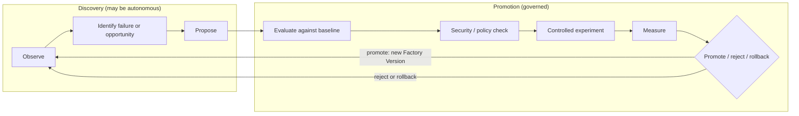
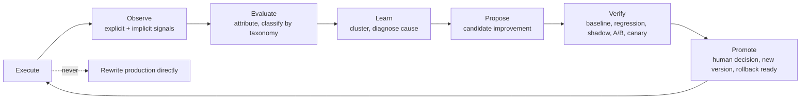
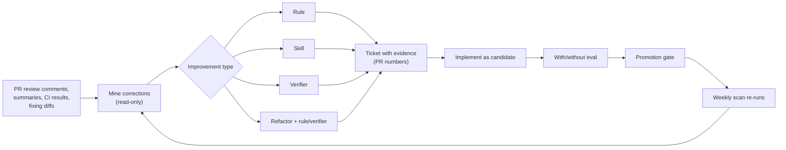

# 33. Governed learning and compounding engineering

Every chapter so far has described a factory that runs. This one describes a
factory that gets better at running. It answers a question the mission
document puts as its tenth principle — the system must improve from
experience; every failure and human correction should make future execution
better — and it answers it under a constraint: the factory may learn on its own,
but it may not promote its own learning into active behavior. After reading it
you should be able to trace a single production failure or repeated human
correction through observation, proposal, evaluation, human promotion, canary,
and rollback, and say why each of those is a separate record.

## The problem

A factory that never learns repeats its failures and requires permanent manual
tuning. Engineers correct the same repository convention, the same missing test,
the same architectural boundary, the same review preference, day after day,
inside individual conversations that nobody else sees. One practitioner
describes it as an entire engineering team yelling the same thing at Claude or
Codex all day. If those corrections stay in the chat, the organization pays for
the same lesson on every session. That accumulated, unharvested friction is
**learning debt**.

The opposite failure is worse. A factory that automatically edits its own
prompts, policies, workflows, evaluators, or authority from noisy feedback
becomes unpredictable: a local preference becomes an institutional rule, a
mistaken correction becomes a standing instruction, and the system being
evaluated generates the fix that confirms its own evaluation. The signals are
real — production outcomes, failed runs, human overrides, validator
disagreements, cost anomalies, new research — and they are mixed with noise,
malicious content, correlation without causation, and recommendations optimized
for the wrong metric. The factory needs to learn from all of it without letting
any observation authorize its own promotion.

## How it works

### Learning can be autonomous; promotion is governed

The organizing rule is one sentence: automate observation and proposal; govern
promotion. The factory may continuously collect, normalize, deduplicate, and
analyze signals, and it may propose a change to a prompt, skill, workflow,
policy, evaluator, model route, or architecture. Promotion to active behavior
requires an explicit human decision based on independent evaluation.

The 12-layer production agent stack names this layer **Continual Learning**
and defines it exactly that way: turn recurring production feedback into
evaluated, human-approved system improvements. Its position at the top of the
stack is the point — every layer below it is something Continual Learning may
propose to change, and none of them may change themselves.

The mission document's **Learning Layer** lists what the factory should capture
from every mission, and the list doubles as the schema for a learning signal:

- What plan was proposed?
- What was changed?
- What failed?
- What did humans modify?
- Which tests detected problems?
- What reached production?
- What customer outcome followed?
- What should change in the workflow?

The first seven are observations the factory can record automatically. The
eighth is a proposal. Keeping the two apart is the whole discipline.

### Three loops

Practitioners building software factories describe three nested loops, and the
vocabulary is worth adopting because it says where learning lives.

The **inner loop** is what the agent iterates on while building: the skills,
plugins, formatters, and fast test suite it uses to check its own work. The
better the inner loop, the more often the agent lands on the right answer
without anyone looking. The **outer loop** runs in a separate process and is
slower and more expensive: validate, review, release, observe the outcome. It
is the final gate, meant to catch what the inner loop missed. The **meta loop**
sits around both, watching what slipped through — review comments, failed CI
checks, human edits — and proposing changes to the inner or outer loop so that,
in the phrase one team uses, you only make a mistake once and never tell the
agent the same thing twice.

The meta loop has the most leverage, because a change to it alters every future
run. That is exactly why it requires the strongest evidence and the tightest
promotion control. A change to one PR affects one PR; a change to the review
skill affects every PR from now on.

One practical consequence: Tessl's team outlawed local configuration.
Everything that improves the agent is checked into the repository so an
improvement improves for everyone — that is the compound loop. Personal
preferences exist (more on scope below), but the mechanism of learning is the
shared repo, not the individual's dotfiles.

### The learning loop

<!-- infographic: learning-loop -->
> **Infographic — The governed learning loop.** *(Jay's graphic goes here.)* Until then, the diagram below
> carries the same concept.

```mermaid
flowchart LR
    Signals["Failures, outcomes, overrides, research"] --> Normalize["Provenance, dedupe, risk"]
    Normalize --> Cluster["Cluster and diagnose cause"]
    Cluster --> Suggest["Versioned improvement proposal"]
    Suggest --> Evaluate["Offline and shadow evaluation vs baseline"]
    Evaluate --> Decide["Human promotion decision"]
    Decide --> Work["Governed Mission or WorkOrder"]
    Work --> Canary["Bounded canary"]
    Canary --> Measure["Outcome and regression window"]
    Measure -->|retain, revise, rollback| Suggest
```

**Learning signals** come from everywhere the factory touches: human
corrections, repeated instructions, context misses, tool errors, routing
mismatches, retries, validation failures, incidents, review findings, cost
anomalies, and — easy to forget — successful low-attention strategies. Each
signal records source, subject, severity, attribution, evidence, and
uncertainty. Production feedback is biased toward visible failures and vocal
users, so the signal set must deliberately include quiet successes and silent
overrides.

Normalization adds provenance, deduplicates, and assigns risk. **Research and
memory are untrusted inputs**: every source needs identity, retrieval time,
content hash, classification, license or usage constraint, sensitivity, and
provenance; every extracted claim needs supporting evidence, confidence,
contradictions, and a lifecycle. Source content cannot change instructions,
invoke tools, or grant authority. A paper the factory read, a memory it wrote
last week, and a comment a reviewer left are all evidence; none of them is an
instruction.

The **versioned improvement proposal** is the meta loop's output. It is a
record, not a change. It names the hypothesis, the affected components, the
baseline, the expected benefit, the risk, the dataset and metrics, guardrails,
scope, rollback, and an owner. It should expose why the recommendation exists,
which evidence supports it, what could falsify it, and — once decided — who
promoted it. No model or source reputation bypasses those controls.

The proposal then stays inside the delivery hierarchy. An accepted
recommendation becomes a governed Mission or WorkOrder with scope, criteria,
budget, risk, and owner. It does not mutate production configuration directly.
The same execution, validation, evidence, and release rules that apply to
customer software apply to the factory improving itself. This is the analogy
that makes recursive improvement safe: a factory retooling its own line files
the same work order, passes the same inspection, and ships under the same
release process as the products it makes. The recursive object changes;
accountability does not.

### Signals and source diagnosis

A thumbs-up is not a learning signal; it is one bit of one person's mood at
one moment. The signals worth collecting connect execution behaviour to
outcomes, and the full list is longer than most teams instrument on day one:

- accepted and rejected outputs;
- human edits, and specifically **how much** was changed (a one-line tweak
  and a rewrite are different verdicts on the same output);
- reviewer feedback on findings (useful, wrong, correct but irrelevant);
- evaluation failures;
- tool failures;
- **unnecessary tool calls** (the run succeeded, but took nine calls where
  three would do);
- expensive trajectories (success at a cost that would not survive a budget);
- production defects and rollbacks traced back to the change that caused them;
- model performance by task class;
- retrieval quality, and in particular **which retrieved context actually
  contributed** to the output versus which was ignored; and
- direct builder feedback.

A signal is only useful once it is attributed to a source, and the sources are
the components in the execution lineage of
[Chapter 28](../05-operate/28-observability-telemetry-and-forensics.md):
the Agent Definition, the skill, the model route, the prompt, the context
retrieval, the tool's behaviour, or the evaluation coverage. Diagnosis is the
step that turns a complaint into engineering data.

<!-- infographic: signal-diagnosis -->
> **Infographic — From signal to source.** *(Jay's graphic goes here.)* Until then, the table below
> carries the same concept.

| Signal | Sources it usually points at |
| --- | --- |
| Large human edits on accepted output | Prompt or Agent Definition instructions; missing context |
| Repeated rejection on one task class | Model route; skill fit; evaluation coverage that let it through |
| Unnecessary tool calls or expensive trajectories | Skill design; tool schema clarity; stopping conditions in the definition |
| Tool failures | Tool contract; argument validation; environment |
| Retrieved context that never contributed | Retrieval ranking, chunking, or freshness; context policy |
| Evaluation failures that reviewers disagree with | Evaluator calibration; dataset drift |
| Production defect after a clean pass | Evaluation coverage; verification strength; risk classification |

The table is a starting hypothesis in each row, not a verdict, which is why
the causal-diagnosis step below tests it before anything is proposed.

### Implicit and explicit feedback

Signals arrive in two registers, and a learning system that listens to only
one of them hears a distorted version of the factory. **Explicit feedback**
is what a person deliberately says about an output: a review comment, a
thumbs-down with a reason, a correction typed into a form, a builder marking
a finding wrong. It is precise, rare, and biased toward the vocal. **Implicit
feedback** is what a person does, recorded without being asked: the finding
they acted on and the one they scrolled past, the suggestion they merged
unchanged and the one they rewrote, the change that shipped clean and the one
that came back as an incident three weeks later. It is abundant, noisy, and
far more representative, because it comes from everyone rather than from the
people who bother to comment.

The implicit register is where **builder behavior signals** live, and four
of them carry most of the information:

| Behavior signal | What it says | What it does not say |
| --- | --- | --- |
| **Comment acceptance** | The builder acted on a finding (fixed, replied, resolved with a change) | That the finding was correct; only that it was worth attention |
| **Reviewer override** | A human reversed an automated decision: unblocked a blocked change, or blocked a passed one | Which side was right, until the outcome is known |
| **Dismissed finding** | A finding closed with no change and no reply | Whether it was wrong, irrelevant here, or right but ignored under deadline |
| **Later incident** | A change that passed every gate caused a production defect or rollback | Which component let it through, until diagnosis attributes it |

Each one becomes useful only once it is joined to the record it concerns
(the finding, the reviewer, the change, the configuration that produced it)
and then to the outcome that followed. A dismissed finding followed by a
later incident on the same lines is a strong signal that the finding was
right and the dismissal was the error; a dismissed finding with no incident
in the observation window is a weak signal that the finding was noise. The
join is what turns behavior into evidence, and the join needs the lineage of
[Chapter 28](../05-operate/28-observability-telemetry-and-forensics.md).

Once signals are attributed, they are sorted into a **failure taxonomy**: a
versioned classification of the ways the factory gets things wrong, by cause
rather than by symptom. Wrong context retrieved; right context ignored; tool
misuse; specification gap; unsafe action attempted and blocked; unsafe action
attempted and not blocked; evaluator miss; routing mismatch; budget
exhaustion; human-process failure. The taxonomy is what lets a thousand
individual signals become a dozen clusters with counts, trends, and owners,
and it is the input the source-diagnosis table above is applied to. A
taxonomy that is not versioned drifts into a folder of ad-hoc labels; a
taxonomy that is not shared across teams hides the pattern that recurs in
all of them.

### Discovery versus promotion: the recursive loop

The learning loop above can be drawn with one more distinction made explicit,
and it is the distinction the rest of the chapter depends on. **Discovery** is
the part that may run on its own: analysing failures, edits, rejections,
expensive trajectories, and outcomes, and proposing a better Agent Definition,
skill, model route, retrieval configuration, missing evaluation, or a piece of
deterministic automation to replace a reasoning step. **Promotion** is the part
that may not: baseline comparison, regression evaluation, security and policy
checks, a controlled experiment or rollout, measurement, and only then promote,
reject, or roll back.

<!-- infographic: recursive-loop -->
> **Infographic — The recursive improvement loop.** *(Jay's graphic goes here.)* Until then, the diagram below
> carries the same concept.

Mission Control names the same stages in its own vocabulary, and the naming is
useful because each stage is a record: **Research → Verify → Recommend →
Approve → Implement → Validate → Measure → Iterate**. Evidence produces
signals; signals cluster into recurring patterns; patterns become
**Improvement Candidates**; candidates run as experiments; experiments produce
recommendations (a better skill, route, prompt, verifier, workflow, or policy);
and an accepted recommendation returns to the factory through a new Mission
and a governed Plan, the same door every other change uses. The line that
summarises both drawings: *autonomous discovery, not autonomous authority.*

### The seven-step loop, and the step it must never skip

Stripped to its verbs, the loop the whole chapter describes is seven steps
long, and the shape to keep is the one it is *not*: it is never Execute →
automatically rewrite production.

<!-- infographic: seven-step-loop -->
> **Infographic — Execute → Observe → Evaluate → Learn → Propose → Verify → Promote.** *(Jay's graphic goes here.)* Until then, the diagram below
> carries the same concept.

Two words in the loop name the difference between a good idea and a change
the factory may run on. A **candidate improvement** is the output of Propose:
a versioned proposal with a hypothesis, evidence, scope, and rollback, which
has earned nothing yet. A **controlled improvement** is a candidate that has
passed Verify under the experiment discipline of
[Chapter 23](../04-prove/23-evaluation-engineering.md) and been promoted by a
person with the authority the change's blast radius requires. The whole
loop, run against the factory's own components, is **recursive system
improvement**: the same machinery that improves customer software improves
the machinery, with the same records and the same gates.

Verify is the step with the most instruments, and they are ordered by how
much reality they expose the candidate to. **Regression testing** against
the frozen baseline comes first and costs nothing real. **Shadow evaluation**
runs the candidate beside the incumbent on live inputs with no authority to
affect anything; disagreements are recorded and reviewed. **A/B testing**
splits real work between incumbent and candidate under a predeclared
hypothesis, sample size, and stop rule, so that the comparison is a
measurement rather than an impression. **Canary rollout** gives the candidate
a bounded share of real authority with a risk stop and an observation window,
and is the last vote before the candidate becomes the default. No instrument
substitutes for the one before it: a canary without a regression run exposes
users to a candidate nobody checked offline, and a regression run without a
canary promotes a candidate production has never seen.

### Compounding engineering: harvesting corrections

<!-- infographic: correction-to-skill -->
> **Infographic — From repeated correction to reusable capability.** *(Jay's graphic goes here.)* Until then, the diagram below
> carries the same concept.

```mermaid
flowchart LR
    Work["Agent and human work"] --> Friction["Corrections, overrides, delays, failures"]
    Friction --> Harvest["Correction Records with provenance"]
    Harvest --> Cluster["Normalize and cluster recurring patterns"]
    Cluster --> Scope["Classify scope: personal, repo, team, workflow, org"]
    Scope --> Mechanism["Choose narrowest durable mechanism"]
    Mechanism --> Proposal["Versioned improvement proposal"]
    Proposal --> Eval["Baseline vs candidate evaluation"]
    Eval --> Review["Owner and risk review"]
    Review --> Canary["Scoped canary"]
    Canary --> Promote["Promote, revise, or roll back"]
```

**Compounding engineering** is the practice of turning recurring, attributable
human corrections and production outcomes into reviewed improvements to
instructions, skills, tools, tests, context policies, workflows, documentation,
or deterministic software. It operates below the broader learning loop above:
it supplies concrete improvement candidates and never changes active behavior
by itself. The control-plane framing from the "Software factory design
patterns" conversation is the memorable version: if all your engineers are
saying the same thing to the agent all day, how do you incorporate that into
the outer harness?

A concrete example of the harvest, from one of the practitioners' own writing
process: rather than accept three pages of generated prose, he has the model
write two or three sentences at a time, edits them, tells it to read what he
changed and do the next section without repeating the mistake, and after four
or five iterations the session has learned a tone. He then flushes that tone
out into a document listing the anti-patterns the model produces by default.
That document is a harvested correction set — an **anti-pattern catalog** —
and the next session starts with it instead of relearning it. The same shape
applies to code: when judgment is dense (writing, design, architecture,
ambiguous product work), short iterative increments calibrate better than one
large generated artifact; the human supplies examples through edits, the agent
applies the emerging pattern to the next bounded section, and once a pattern
repeats it is extracted into a style guide, anti-pattern catalog, example set,
or skill. When the work is mechanical with strong specifications and tests,
larger autonomous increments are fine. Interaction granularity is a workflow
design choice, not a universal preference.

**Correction harvesting** starts with a **Correction Record** containing:

- source Attempt, artifact, and exact before/after behavior;
- human actor and role;
- reason, affected criterion, and confidence;
- correction type: factual, procedural, stylistic, architectural, policy,
  safety, or outcome;
- proposed scope: personal, repository, team, workflow, or organization;
- sensitivity, retention, and consent;
- recurrence evidence and related incidents; and
- candidate destination such as test, instruction, skill, tool, or code.

Do not learn from acceptance alone. A reviewer may accept under deadline, fix
the result silently, or miss a defect. Capture explicit corrections and the
downstream outcomes — did the change fail in production, did a later reviewer
undo it — because those are the signals that survive contact with reality.

**Pattern mining** then clusters the records: the same correction across ten
engineers and three harnesses is one pattern with strong recurrence evidence,
and recurrence is what earns a place in the proposal queue. The output of
mining is **skill extraction and codification** — or, more precisely, a
decision about which mechanism should hold the lesson. This is the
**feedback-to-skill loop**, and the name is slightly misleading, because a
skill is often the wrong destination.

### Promote to the narrowest durable mechanism

Use the least probabilistic mechanism that solves the recurring problem:

| Repeated problem | Preferred durable mechanism |
| --- | --- |
| Formatting or syntax rule | Formatter, linter, schema, or deterministic test |
| Repository command or sequence | Versioned repository instruction or skill |
| Missing domain fact | Correct authoritative source and retrieval path |
| Repeated implementation mistake | Regression test, invariant, or library API |
| Review preference | Scoped review rule with precision measurement |
| Task-routing mismatch | Evaluated model or capability profile |
| Ambiguous product decision | Specification template or required human decision |
| Unsafe action | Policy, permission, or architectural boundary |

An instruction is not automatically the best answer. Repeatedly telling an
agent not to violate a structural invariant is weaker than making the invalid
state impossible or testable. The best improvement often removes an agent
decision entirely — a rule becomes deterministic, a tool becomes clearer, the
required context becomes reliably available. Compounding should make the next
correction less likely, not merely make the next prompt longer.

### Diagnose before optimizing

Outcomes are caused by interacting components. A failure blamed on the prompt
may come from missing data, a confusing tool schema, the environment, a policy,
or the evaluator. Successful behavior may rest on accidental context or hidden
human help. So the learning system clusters related signals, tests causal
hypotheses, and only then chooses the smallest durable remedy:

- deterministic code or policy for rules that should not remain probabilistic;
- prompt or Agent Definition change for reasoning and communication behavior;
- skill update for a reusable task method;
- tool change for missing or confusing capability;
- context or semantic change for unavailable or misunderstood knowledge;
- route change for capability, latency, availability, or cost mismatch;
- evaluator or dataset change for a measurement failure; or
- workflow change for incorrect decomposition, authority, or recovery.

Two of those remedies have names worth keeping. **Prompt optimization** is
controlled experimentation that changes instructions or prompt composition to
improve defined outcomes without widening authority; it requires holdout
evaluation, regression controls, and versioned promotion, or it is just
editing. **Skill improvement** is a governed update to a reusable task method
based on diagnosed evidence, followed by evaluation, certification, promotion,
and rollback planning. Whichever remedy the diagnosis selects, its output is a
**promotion recommendation**: the evidence-backed suggestion that a validated
improvement be adopted into the standing factory configuration. It remains a
recommendation until a human with the relevant authority accepts it.

Learning from success needs the same care. Compare successful runs to matched
baselines and identify the strategies associated with acceptance, low retry,
low cost, low review effort, and safe recovery. Do not copy private data,
incidental repository text, or one-off reasoning into standing instructions; a
strategy that worked once because of an accident of context is not a pattern.

### Skills that improve from their own traces

Skill improvement has a natural automation, and at least one large engineering
organisation running thousands of skills has published it as its next step.
Every skill execution leaves a trace, and the trace records the **papercuts**:
the retry that was needed, the argument the skill got wrong, the tool result it
had to re-fetch, the step a human corrected afterwards. Record those papercuts
per skill, cluster them across executions, and auto-generate a proposed skill
update from the traces, so the skill's own history writes its next revision.
The same organisation's session analytics is moving in parallel from batch
detection of anti-patterns (the dashboard of
[Chapter 8](../02-design/08-economics-metrics-and-human-attention.md)) to
continuous trace monitoring that guides the engineer in real time, inside the
session, before the expensive turn happens rather than in a report afterwards.

Both are discovery, in this chapter's terms, and both belong in the meta loop.
What they are not, in this guide's model, is promotion. An auto-generated skill
update is a versioned improvement candidate like any other: it carries its
trace evidence and its recurrence count, it is evaluated against the current
skill as baseline on a development set and an untouched holdout, it must clear
the quality floor, and it goes live only through the
[promotion gate](#baseline-candidate-and-the-promotion-gate), as a bounded
tuning or a capability change depending on what it touches. A skill that
rewrites itself from its own traces without beating a baseline is the
self-authorised mutation of the first failure-mode row, wearing a more
sophisticated pipeline. Real-time guidance is safer, because it advises a
person rather than changing a capability, but the advice is still derived
from the anti-pattern catalog, and that catalog is versioned and evaluated
like any other evaluator. *Traces may propose; the gate promotes.*

### Mining corrections: from review history to durable assets

Skill traces are one mine. The richer one, in most organizations, is the pull
request history, because every review comment that led to a diff is a
correction with its evidence already attached. Public harness-engineering
tooling now ships this as a read-only skill: read the PR review comments,
review summaries, CI results, and the diffs that addressed them; categorize
each correction into an **improvement type**; and propose a concrete next
step. The output is a list of findings, not a change. That is discovery, in
this chapter's terms, done against the record the factory already keeps.

The four improvement types are a decision table for where a fix belongs, and
they refine the "narrowest durable mechanism" table above for the corrections
that come out of review:

| Improvement type | Use it when the correction is | Example |
| --- | --- | --- |
| **Rule** | An always-on convention the agent should never have to discover (eager push, [Chapter 10](../03-build/10-the-agent-factory.md)) | "Use the shared HTTP client, never a raw fetch" |
| **Skill** | A multi-step procedure needed only for some tasks (lazy push) | The playbook for adding a CLI command end to end |
| **Verifier** | A binary, observable invariant on committed files that a judge can check | "Every component file exports an element with a test identifier" |
| **Refactor** | A structural change to the code that removes the temptation, paired with a rule or verifier so it stays removed | Extract the duplicated validation so there is one place to get it right |

The order of preference runs from the bottom of that table upward whenever the
correction can be made deterministic: a verifier or refactor removes a class
of mistake; a rule prevents it at some context cost; a skill teaches it on
demand. The finding names its type, the evidence (the PR numbers where the
correction recurred), and the proposed next step.

Then the improvement follows the ordinary path: file a ticket carrying the
evidence, implement the rule, skill, verifier, or refactor as a versioned
candidate, prove it with the with-and-without evaluation of
[Chapter 23](../04-prove/23-evaluation-engineering.md) so the delta is
measured rather than assumed, and keep the skill quality gate in CI. Schedule
the scan weekly, with manual dispatch for after a large merge, and write its
findings to an artifact the team reviews. The loop that results is the meta
loop in one sentence: *agents write code, the scan surfaces patterns, people
improve skills and rules, agents get better.*

A sibling scan mines the same history for chores instead of corrections. Read
ninety days of pull requests for repeated manual work and coordination
patterns (the dependency bump somebody does every Monday, the changelog
someone always fixes, the cross-repository ping that precedes every release),
classify each pattern as established or emerging, state why automating it is
worth it, cite the evidence PRs, and suggest an execution mode: **scheduled**
(a cron workflow) or **triggered** (on a PR event or label). That is
find-automations, and it feeds the maturity lifecycle of Chapter 10 from the
other side: work that is already deterministic should leave the reasoning
budget entirely.

In this guide's model, every finding either scan produces is a governed
candidate. A mined rule is not appended to the repository instructions because
a scan suggested it; it is a versioned improvement proposal with recurrence
evidence, it is evaluated with and without, and it goes live only through the
[promotion gate](#baseline-candidate-and-the-promotion-gate). The scan is
allowed to be read-only precisely so that nobody has to trust it.

### Scope: personal fit versus organizational truth

Corrections occur at different scopes. "Use this tone in my draft" is a
personal preference. "Run this repository's generated-code check" is a local
procedure. "Never let an executor hold publication credentials" is an
organizational control. Treating them as one kind of memory creates conflict and
unsafe promotion, so the Correction Record's scope field is a gate, not a tag: a
personal preference may not become a team rule without the same evidence and
review as any other proposal, and it must never grant tools, change policy,
lower a quality gate, or alter business authority. Local preferences live only
inside organizational policy and quality boundaries. The mechanism for holding
personal fit — the Human Workflow Profile — and the human-attention accounting
that goes with it belong to [Chapter 8](../02-design/08-economics-metrics-and-human-attention.md);
here the rule is simply that scope is classified before anything is proposed.

### Baseline, candidate, and the promotion gate

<!-- infographic: promotion-gate -->
> **Infographic — The promotion gate.** *(Jay's graphic goes here.)* Until then, the diagram below
> carries the same concept.

```mermaid
stateDiagram-v2
    [*] --> Proposed: versioned improvement candidate
    Proposed --> Offline: baseline vs candidate on dev set
    Offline --> Rejected: quality floor breached or no gain
    Offline --> Holdout: untouched holdout evaluation
    Holdout --> Rejected: regression, gaming, or burden shift
    Holdout --> Decision: promotion packet to human
    Decision --> Rejected: human declines
    Decision --> Canary: human promotes; new Factory Version
    Canary --> RolledBack: risk stop or regression in window
    Canary --> Active: observation window clean
    Active --> RolledBack: later regression attributed
    Rejected --> [*]
    RolledBack --> [*]
    Active --> [*]
```

An improvement experiment defines baseline, candidate, comparable cases,
primary metric, quality floor, risk stop, budget, observation window, and
rollback. Faster or cheaper is not improvement when validation, security,
reliability, or human attention worsens; the **quality floor** is the set of
metrics that may not move down regardless of what the primary metric does.
Offline evaluation precedes any canary, and offline evaluation itself is split:
a development set the candidate may be tuned against, and an untouched holdout
it may not, because automated prompt search will explore more candidates than a
person could and will overfit the evaluator if allowed to see it.

**Regression control** means running broad regression, adversarial, security,
policy, cost, and human-factor suites against the candidate — not just the
metric the proposal was written to improve — because regression suites guard
the whole capability graph, not one component. Watch specifically for **reward
hacking**: metric gaming, longer hidden work that moves cost off the measured
path, evaluator agreement without real correctness, and improvements that shift
burden onto reviewers or production. A metric improvement can raise total human
cost, and that counts as a regression.

Promotion is human-owned and creates something new: a new immutable capability
version and a new Factory Version. It never edits historical runs, so any past
decision can be replayed against the configuration that made it. After
promotion, a bounded canary and an observation window follow, with automatic
stop on risk. Offline evaluations are reproducible but may not represent
production; online canaries are realistic but expose users and systems. Use
staged evidence and strict risk ceilings, and let the canary window be the
final vote.

Two more rules close the loop. Frequent optimization adapts quickly and creates
version churn, so batch low-severity signals and escalate critical ones
immediately. And **autonomy is calibrated from outcomes**: sustained validated
outcomes may make a factory, a capability, or a workflow eligible for greater
autonomy, while critical violations, fabricated evidence, security escapes, or
repeated failure should demote or quarantine it automatically. Demotion can be
automatic; promotion stays with a person.

### Asymmetric autonomy per action class

"Promotion stays with a person" is the safe default, and it is also too coarse
to hold for long, because it makes a one-point change to a retrieval parameter
wait in the same queue as a change to tool permissions. The refinement is
**asymmetric autonomy**: the level of autonomy is defined per action class,
by reversibility and blast radius, not as one setting for the system. The
question that sets the level is never "how confident is the model?" It is
*"what happens if this is wrong, and how easily can we reverse it?"*

<!-- infographic: autonomy-by-action-class -->
> **Infographic — Autonomy by action class.** *(Jay's graphic goes here.)* Until then, the table below
> carries the same concept.

| Action class | Examples | If wrong | Autonomy |
| --- | --- | --- | --- |
| Bounded tuning | A prompt refinement inside a fixed template; a retrieval parameter; a routing weight between two qualified models | Quality dips on a slice; instantly reversible | May auto-promote after repeatedly beating baseline, if low-risk and under a risk stop |
| Capability change | A new skill version; an Agent Definition instruction change; a new evaluator | Behaviour changes across a workflow; reversible by version | Human promotion with the full packet; canary |
| Authority change | Permissions, security boundaries, tool authority, destructive operations, deployment authority | Blast radius outside the factory; may not be reversible | Never autonomous; separate risk class, separate approvers, step-up authorization |

The first row is where autonomy is earned back cheaply, and it should be, or
the learning loop spends its human budget on trivia. The third row does not
move with confidence, evidence, or track record; a routing weight that has
beaten baseline a thousand times still says nothing about whether the system
should be allowed to widen its own permissions.

### The boundary with reward modeling

Everything in this chapter is learning in the engineering sense: production
feedback and evaluation signals (acceptance, edits, preferences, evaluation
outcomes, production behaviour) used to improve routing, prompts, skills, and
evaluators. A team that runs it well will eventually be tempted by the next
step: preference pairs, a reward model, fine-tuning against the factory's own
outcomes. Those techniques are real, and the people running the loop should
understand them, including their failure modes of reward hacking and
distribution shift. But the upstream problem comes first, and it is the one
this chapter is about: generating trustworthy learning signals from real
workflows, with attribution good enough that the signal means what it appears
to mean. Sophisticated optimization against noisy or poorly attributed
feedback does not fail gracefully; *it learns the wrong thing faster.* A
factory whose edit-size signal is polluted by reformatting, or whose acceptance
signal is polluted by deadline approvals, should fix the signal before it
fine-tunes anything on it.

### The adaptation ladder

The narrowest-durable-mechanism table above chose a remedy per problem. Seen
from the other side, the remedies form a ladder, ordered by how much of the
system each one changes, how reversible it is, how much evidence it needs,
and how hard it is to attribute a later failure to it. The **adaptation
ladder** runs Rules → Retrieval/Context → Prompt → Skill → Routing →
Fine-tuning → Preference optimization and training, and the rule for
climbing it is the whole point: *never jump straight to training*.

<!-- infographic: adaptation-ladder -->
> **Infographic — The adaptation ladder.** *(Jay's graphic goes here.)* Until then, the table below
> carries the same concept.

| Rung | What changes | Reversibility | Evidence needed to climb past it |
| --- | --- | --- | --- |
| 1. Rules | Deterministic code, linters, schemas, policy; a decision is removed from the model | Instant | The behavior cannot be expressed as a rule |
| 2. Retrieval / context | What the model is shown: sources, ranking, freshness, the context policy | Instant | The right context was present and the behavior still failed |
| 3. Prompt | Instructions in the Agent Definition | Instant, by version | The instruction is followed in evaluation and still fails in the slice |
| 4. Skill | A versioned reusable method for a task class | By version | The behavior recurs across tasks and cannot be taught per prompt |
| 5. Routing | Which model, or which deterministic path, serves the task class | By configuration | No eligible route reaches the quality floor at acceptable cost |
| 6. Fine-tuning | The model's weights, for a stable, well-specified behavior | By model version; expensive to re-evaluate | Stable behavior, a governed dataset, and a benchmark that shows rungs 1–5 exhausted |
| 7. Preference optimization / training | The model's preferences from human preference data, via a reward model | Slowest and least attributable | Trustworthy, attributed preference signals at scale, and a reason the behavior cannot live in rungs 1–6 |

The bottom of the ladder holds the mechanisms that do not touch the model at
all, and most recurring problems are solved there. Rung 1 makes a decision
deterministic; rung 2 changes what the model sees; rung 3 changes what it is
told; rung 4 packages a method it can be handed; rung 5 changes which model
answers. Each of these is a configuration or artifact change, promotable and
reversible on the fast or medium release clock, and each failure they cause
can be attributed by diffing two runs' lineage.

The top two rungs change the model itself, and they are where the vocabulary
of machine learning enters the factory. **Fine-tuning** updates a model's
**weights** on a governed dataset so that a stable behavior no longer has to
be re-taught in every context window; **adapters** are the cheaper form, a
small set of additional weights trained on top of a frozen base so that the
tuned behavior can be attached, versioned, and detached without retraining the
whole model, which is also what makes the base model replaceable underneath
it ([Chapter 17](../03-build/17-models-routing-and-capability-selection.md)).
**Domain-level tuning** applies this to a body of knowledge or convention that
is stable across a product line, a code style or a domain vocabulary, and is
the most defensible use, because the thing being learned changes slowly.
**Behavioral adaptation** applies it to how the model acts (how it plans,
when it asks, how it reports uncertainty) and is harder to specify, harder to
evaluate, and easier to get subtly wrong. **Preference optimization** goes one
step further: rather than examples of correct output, it learns from **human
preference data** (pairs of outputs with a judgment about which is better),
either directly or through a **reward model** trained to predict that
judgment; **RLHF**, reinforcement learning from human feedback, is the
best-known family of such methods. The factory's acceptance, edit, override,
and dismissal signals are exactly the raw material these methods consume,
which is why the previous section insisted that the signals be trustworthy
first.

Three things follow. First, the ladder is climbed one rung at a time, with the
evidence in the last column: a problem that reaches rung 6 should carry a
record of why rungs 1 through 5 were tried and were not enough, because a
behavior that could have been a rule and became a fine-tune is now
unattributable, slow to reverse, and bound to one model version. Second, the
upper rungs change the release clock: a tuned model or an adapter is an
artifact with its own evaluation benchmark, certification, and rollback, and a
preference-optimized model is a training run whose inputs (the dataset version,
the reward model version, the experiment manifest) are governed records the
learning system hands to specialists, never raw traces
([Chapter 2](../01-understand/02-the-factory-in-one-view.md)). Third, the
ladder is a diagnosis tool in reverse: when a team proposes training, ask
which rung the problem actually lives on. Most of the time the answer is
lower, cheaper, and reversible by lunchtime.

### What not to build first

The loop described here is the last thing a factory should build, not the
first. Sophisticated autonomous learning before a trustworthy baseline exists
optimizes against noise; ML-based routing before evaluation data exists routes
on folklore; a universal memory layer before context governance exists is a
stale-truth generator; hundreds of generic skills before one workflow runs end
to end are hypotheses wearing version numbers. The order that works is the one
the promotion gate implies: first a representative **golden evaluation set**
(real tasks, known failures, adversarial and high-risk cases, previously
escaped defects), because *without a stable baseline, improvement becomes
anecdotal*; then observability and lineage good enough to attribute a signal
to a source; then the discovery half of the loop, proposing to humans; and only
then, per action class, the autonomy of the first table row. *Do not
generalize before you have earned the abstraction.*

## How to build it

Build the meta loop as ordinary governed engineering pointed at the factory.

0. **Build the golden evaluation set first**, and the lineage that attributes
   a signal to a source. No autonomous learning before both exist.
1. **Define the learning-signal schema** using the mission's eight questions
   plus source, subject, severity, attribution, evidence, and uncertainty.
   Ingest from workflow failures, validator disagreement, review findings,
   human edits to agent output (with edit size), unnecessary tool calls,
   expensive trajectories, tool failures, retrieval contribution, production
   defects and rollbacks, incidents, cost anomalies, builder feedback, and
   low-attention successes.
2. **Register sources.** Every research or memory input gets identity,
   retrieval time, content hash, classification, license, sensitivity, and
   provenance; adapters are read-only; content never carries instructions.
3. **Harvest corrections** with the Correction Record fields, under a consent
   and retention policy, capturing only what serves a defined improvement
   purpose and letting users inspect or challenge derived preferences.
4. **Cluster and diagnose.** Group by pattern; record recurrence evidence;
   test causal hypotheses across data, tool, environment, policy, and
   evaluator before blaming the prompt.
5. **Classify scope** (personal, repository, team, workflow, organization)
   before proposing anything; personal never promotes to organizational
   without evidence and review.
6. **Choose the narrowest durable mechanism** from the table above; prefer
   deterministic code, tests, and schemas over instructions.
7. **Write the improvement candidate**: hypothesis, affected components,
   baseline, expected benefit, risk, dataset, metrics, guardrails, scope,
   rollback, owner; plus why it exists, what evidence supports it, and what
   would falsify it.
8. **Evaluate offline** against baseline on a development set and an untouched
   holdout; run the full regression, adversarial, security, policy, cost, and
   human-factor suites; check the quality floor.
9. **Materialize accepted proposals as governed work** — a Mission or
   WorkOrder with the same execution, validation, evidence, and release rules
   as customer software.
10. **Promote by human decision** into a new immutable capability and Factory
    Version; never mutate historical runs or live configuration in place.
    Define autonomy per action class: bounded tuning may auto-promote under a
    risk stop; capability changes need a human; authority changes never
    self-promote.
11. **Canary with a risk stop and observation window**; roll back or demote
    automatically on regression; retain, revise, or roll back at the end.
12. **Measure the loop itself**: which corrections recur, how much human time
    they cost, which improvement reduced them, and whether the change harmed
    quality or created new friction. If you cannot measure the agent, you cannot
    improve it.

Promotion packet checklist:

- Proposal version, owner, scope, and the mechanism chosen (and why not a
  narrower one).
- Baseline and candidate results on development and holdout sets, with the
  quality floor and every gated suite reported.
- Evidence list with provenance; contradictions and falsifiers stated.
- Blast radius, canary plan, risk stop, observation window, rollback.
- Who promoted it and when; the Factory Version it created.

Automatic demotion triggers: critical policy violation, fabricated evidence,
security escape, quality-floor breach during canary, repeated failure above
threshold.

## Failure modes

| Failure | How to detect it | What to do |
| --- | --- | --- |
| Self-authorized mutation (prompt or memory edited from feedback) | Behavior change with no proposal or promotion record | Route every change through proposal → evaluation → human promotion |
| Self-confirming evidence | Proposer and evaluator share identity or context | Independent evaluation; untouched holdout; separate verifier |
| Memory or research poisoning | Instructions or tool calls appearing inside source content | Untrusted-input handling; provenance; content never grants authority |
| Personal preference promoted to org rule | Scope missing or skipped on the record | Scope classification gate; separate review for scope escalation |
| Learning from acceptance alone | High acceptance, unchanged correction rate | Capture explicit corrections and downstream outcomes |
| Blaming the prompt | Repeated prompt edits for the same failure | Causal diagnosis across data, tool, environment, policy, evaluator |
| Prompt bloat instead of determinism | Growing instruction length, same failures | Narrowest durable mechanism; convert to test, schema, or code |
| Evaluator overfitting | Dev-set gains, holdout flat or worse | Untouched holdout; controlled search; human promotion |
| Reward hacking | Metric up, hidden work or reviewer burden up | Human-factor and cost suites in the gate; treat burden shift as regression |
| Faster-but-worse promoted | Primary metric improves, quality floor breached | Quality floor is a hard gate regardless of primary metric |
| Version churn | Constant Factory Version changes for minor signals | Batch low-severity; escalate critical immediately |
| Canary without a stop | Regression observed, canary continues | Risk stop with automatic rollback; observation window enforced |
| Historical runs edited | Replay disagrees with recorded decision | Promotion creates new versions only; history immutable |
| Surveillance instead of learning | Corrections captured without purpose or consent | Capture minimally; consent and retention policy; user inspection |
| Learning debt | Same correction cluster recurring across teams for weeks | Measure recurrence and human cost; prioritize harvest by cost |
| Autonomy never earned or never lost | Trust level static despite outcomes | Calibrate from validated outcomes; automatic demotion, human promotion |
| One autonomy level for the whole system | Routing tweaks queue behind permission changes, or permission changes ride a tuning fast-path | Define autonomy per action class by reversibility and blast radius |
| Optimizing against noisy signals | Fine-tuning or reward modeling on unattributed acceptance and edit data; behaviour drifts confidently | Fix attribution and signal quality upstream; learn the wrong thing slower, not faster |
| Autonomous learning before a baseline | Improvements are anecdotal; no golden set; regressions undetectable | Build the golden evaluation set and lineage first; propose to humans before automating anything |
| Listening only to explicit feedback | Signals come from a handful of vocal reviewers; quiet dismissals and later incidents are never joined to the findings they concern | Capture implicit behavior signals (comment acceptance, override, dismissal, later incident) and join them to records and outcomes |
| Unversioned failure taxonomy | Clusters are labeled ad hoc per team; the same cause has five names and no trend | Version the taxonomy, classify by cause, share it across teams |
| Candidate treated as controlled | A proposal is promoted on its own evidence without regression, shadow, A/B, or canary | Every candidate passes Verify in order; no instrument substitutes for the one before it |
| Jumping straight to training | A behavior that could have been a rule or a retrieval fix is fine-tuned; the failure is now unattributable and bound to one model version | Climb the adaptation ladder one rung at a time and record why each lower rung was insufficient |
| Preference data without provenance | RLHF or a reward model trained on acceptance signals polluted by deadlines and reformatting | Hand specialists governed dataset versions and experiment manifests, never raw traces; fix signal quality first |

## In Mission Control

Two study commits are relevant. GitHub `main` at
[`b31e275`](https://github.com/jaydubya818/MissionControl/tree/b31e27564deb1c03c167e61b5ee094567c2ba7b1)
contains Loop Engineering, graph workflows, context evaluations, meta-loop
suggestions, verifier records, workflow-failure signal ingestion, and human
conversion of accepted suggestions into governed WorkOrders and Tasks; the graph
workflow has browser evidence for explicit dispatch, DAG visibility, failure
containment, and terminal human approval boundaries. Study commit
[`9d5f8e3`](https://github.com/jaydubya818/MissionControl/tree/9d5f8e36aff45a001a8848cc0516b3dc800e29b8)
(PR #64) adds Phase 0 controls for governed continuous learning and proves, in an
isolated canary, atomic ownership, pause/drain modes, budget admission,
heartbeat, stale recovery, reasoned retry, cancellation, quarantine, independent
verification, and operator-visible Task semantics. Continuous scheduling stayed
off, the preserved Research Lab queue was not mutated, Phase 1 still needs a
governed source registry and ingestion policy, and the broader plan remains
proposed.

At
[`d902fae`](https://github.com/jaydubya818/MissionControl/tree/d902fae7032c0696b531c44ae88829c652516fc6),
Mission Control additionally has human decision rights, risk-proportional
approvals, exception-first operator doctrine, decision packets, deterministic
learning signals, failure clusters, improvement candidates, datasets,
experiments, skills, context evaluations, canaries, human promotion boundaries,
recursive-improvement boundaries, trust changes, and versioned configuration,
and identifies prompts, skills, tools, context, routing, evaluators, and
deterministic controls as improvement targets. The Research → Verify →
Recommend → Approve → Implement → Validate → Measure → Iterate sequence is
Mission Control's stated design for the loop, with the improvement-candidate,
experiment, and human-promotion records above as its implemented substrate;
the full sequence running unattended end to end is not demonstrated, and
per-action-class auto-promotion of bounded tuning is a design position rather
than a shipped control.

What the evidence does not establish: a production correction-harvesting
pipeline, scoped Human Workflow Profiles, anti-pattern extraction, automatic
suggestion of deterministic replacements, cross-team correction recurrence,
end-to-end attention accounting, a complete optimization service,
success-pattern analysis, prompt or tool experimentation, holdout protection,
automated regression attribution, or promotion and rollback across the
capability registry. Mission Control has a governed improvement substrate, not
a self-operating learning factory.

## Retain this

- Learning can be autonomous. Promotion is governed. The factory observes,
  clusters, and proposes on its own; a human promotes, on independent evidence.
- Three loops: inner (the agent checks itself), outer (validate, review,
  release, observe), meta (learn from what slipped through). The meta loop has
  the most leverage and therefore the strictest gate.
- A learning signal answers the mission's eight questions; the eighth — what
  should change — is a proposal, never a change.
- Compounding engineering harvests repeated corrections, with provenance and
  scope, and promotes each to the narrowest durable mechanism. A test, schema,
  or policy usually beats more prompt text.
- Signals connect behaviour to outcomes: acceptance and rejection, edit size,
  reviewer feedback, evaluation and tool failures, unnecessary tool calls,
  expensive trajectories, defects and rollbacks, which context contributed,
  builder feedback. Each is diagnosed to a source: Agent Definition, skill,
  model route, prompt, retrieval, tool behaviour, or evaluation coverage.
- Discovery may be autonomous (observe, identify, propose); promotion is
  governed (baseline evaluation, security and policy check, controlled
  experiment, measure, promote or reject or roll back). Autonomous discovery,
  not autonomous authority.
- Diagnose before optimizing; the prompt is the last suspect, not the first.
- Skills can improve from their own traces: record papercuts per execution,
  cluster them, and auto-generate the next revision; session analytics can move
  from batch anti-pattern reports to real-time guidance. Both are discovery.
  An auto-generated skill update is a governed candidate that must beat the
  current skill as baseline at the promotion gate. Traces may propose; the gate
  promotes.
- Mine PR review history for corrections and sort each into Rule, Skill,
  Verifier, or Refactor; prefer the deterministic end. File tickets with the
  evidence PRs, prove with a with/without eval, scan weekly. Mine the same
  history for chores and turn them into scheduled or triggered automations.
  Every mined finding is a governed candidate through the promotion gate.
- Autonomy is set per action class by reversibility and blast radius, never by
  model confidence: bounded tuning may auto-promote; capability changes need a
  human; authority changes never self-promote.
- Trustworthy, attributed signals come before any reward modeling. Sophisticated
  optimization against noisy feedback learns the wrong thing faster.
- Build the golden evaluation set and lineage before any autonomous learning.
  Without a stable baseline, improvement is anecdotal.
- Every candidate is evaluated against a baseline, on a development set and an
  untouched holdout, with a quality floor and full regression suites; promotion
  creates a new immutable Factory Version; canaries carry a risk stop.
- Personal fit is not organizational truth; scope is classified before
  anything is proposed.
- Autonomy is earned from validated outcomes and lost automatically on critical
  failure. The recursive object changes; accountability does not.
- Feedback has two registers: explicit (what people say) and implicit (what
  they do). Builder behavior signals (comment acceptance, reviewer override,
  dismissed finding, later incident) become evidence only when joined to the
  record they concern and the outcome that followed, then sorted into a
  versioned failure taxonomy by cause.
- The loop is Execute → Observe → Evaluate → Learn → Propose → Verify →
  Promote, never Execute → rewrite production. A candidate improvement earns
  nothing until Verify (regression, shadow evaluation, A/B, canary rollout, in
  that order) makes it a controlled improvement; run against the factory
  itself, that is recursive system improvement.
- The adaptation ladder runs Rules → Retrieval/Context → Prompt → Skill →
  Routing → Fine-tuning → Preference optimization and training. Climb one rung
  at a time with the evidence that the rung below was insufficient. Never jump
  straight to training.

## Go deeper

- [Chapter 3 — First principles: trust, evidence, and authority](../01-understand/03-first-principles-trust-evidence-and-authority.md)
  for autonomy levels and earned trust.
- [Chapter 8 — Economics, metrics, and human attention](../02-design/08-economics-metrics-and-human-attention.md)
  for Human Workflow Profiles, attention budgets, and the human-attention half
  of compounding engineering.
- [Chapter 10 — The Agent Factory](../03-build/10-the-agent-factory.md)
  for capability evaluation, certification, promotion, and retirement.
- [Chapter 18 — Agent and loop engineering](../03-build/18-agent-and-loop-engineering.md)
  and [Chapter 19 — The 12-layer production AI agent stack](../03-build/19-the-12-layer-production-ai-agent-stack.md)
  for Loop Engineering and the Continual Learning layer.
- [Chapter 23 — Evaluation engineering](../04-prove/23-evaluation-engineering.md)
  for evaluation science and controlled experimentation.
- [Chapter 32 — Production feedback, automated review, and the agentic merge queue](./32-production-feedback-review-and-the-agentic-merge-queue.md)
  for the feedback-to-reproduction pipeline that feeds this loop.
- [Chapter 34 — Mission Control as a living case study](./34-mission-control-as-a-living-case-study.md).
- [Mission Control capability, workflow, and admission map](../appendix/mission-control/03-capability-workflow-and-admission-map.md), assessed at `d902fae`.
- [Glossary](../appendix/glossary.md).
- Mission Control references: Loop Engineering and Graph Engineering docs and
  the meta-loop implementation at `b31e275`; the governed continuous-learning
  plan, Phase 0 operational evidence, and Todo 028 at `9d5f8e3`.
- Sources: Jay's AI Software Factory mission (Learning Layer, principle 10);
  HumanLayer (Dexter) and BAML (Vaibhav), "Software factory design patterns"
  (compounding engineering in the control plane; the anti-pattern document as a
  harvested correction set); HumanLayer at AI Engineer SF, "How to get to a
  software factory" (inner, outer, and meta loops; "only make a mistake once";
  no local configuration); IndyDevDan, "Software factories give leverage on
  your prompt" (if you cannot measure it, you cannot improve it); "The 12-layer
  production AI agent stack" (Continual Learning definition); Jay West, factory
  architecture notes and Mission Control walkthrough, on the feedback signal
  list and source diagnosis, discovery versus promotion, asymmetric autonomy by
  action class, the reward-modeling boundary, what not to build first,
  implicit versus explicit feedback and builder behavior signals, the failure
  taxonomy, the seven-step loop with candidate versus controlled improvement,
  and the adaptation ladder.
- [Chapter 17 — Models: routing, profiles, and capability selection](../03-build/17-models-routing-and-capability-selection.md)
  for the routing rung and for adapters as the edge where a replaceable model
  is tuned.
- [Chapter 25 — CI/CD, progressive delivery, and production verification](../04-prove/25-cicd-progressive-delivery-and-production-verification.md)
  for canary mechanics and rollback.
- Public source: Uber Engineering, *Running a Software Factory Efficiently at
  Uber Scale* (2026), for continuous skill improvement from execution traces
  and the move from batch anti-pattern detection to real-time guidance.
- Tessl documentation (docs.tessl.io), 2026: the find-optimizations skill
  (PR review mining into Rule / Skill / Verifier / Refactor improvement types,
  evidence-linked tickets, with/without proof, weekly scan) and the
  find-automations skill (PR history mining for scheduled or triggered
  automations).
- Team Topologies, The DevOps Handbook, and the Toyota Production System, as
  referenced in the research canon.
