# 33. Governed learning and compounding engineering

Every chapter so far has described a factory that runs. This one describes a
factory that gets better at running. It answers a question the mission
document puts as its tenth principle — the system must improve from
experience; every failure and human correction should make future execution
better — and it answers it under a constraint: the factory may learn on its own,
but it may not promote its own learning into active behavior. After reading it
you should be able to trace a single production failure or repeated human
correction through observation, proposal, evaluation, human promotion, canary,
and rollback, and say why each of those is a separate record.

## The problem

A factory that never learns repeats its failures and requires permanent manual
tuning. Engineers correct the same repository convention, the same missing test,
the same architectural boundary, the same review preference, day after day,
inside individual conversations that nobody else sees. One practitioner
describes it as an entire engineering team yelling the same thing at Claude or
Codex all day. If those corrections stay in the chat, the organization pays for
the same lesson on every session. That accumulated, unharvested friction is
**learning debt**.

The opposite failure is worse. A factory that automatically edits its own
prompts, policies, workflows, evaluators, or authority from noisy feedback
becomes unpredictable: a local preference becomes an institutional rule, a
mistaken correction becomes a standing instruction, and the system being
evaluated generates the fix that confirms its own evaluation. The signals are
real — production outcomes, failed runs, human overrides, validator
disagreements, cost anomalies, new research — and they are mixed with noise,
malicious content, correlation without causation, and recommendations optimized
for the wrong metric. The factory needs to learn from all of it without letting
any observation authorize its own promotion.

## How it works

### Learning can be autonomous; promotion is governed

The organizing rule is one sentence: automate observation and proposal; govern
promotion. The factory may continuously collect, normalize, deduplicate, and
analyze signals, and it may propose a change to a prompt, skill, workflow,
policy, evaluator, model route, or architecture. Promotion to active behavior
requires an explicit human decision based on independent evaluation.

The 12-layer production agent stack names this layer **Continual Learning**
and defines it exactly that way: turn recurring production feedback into
evaluated, human-approved system improvements. Its position at the top of the
stack is the point — every layer below it is something Continual Learning may
propose to change, and none of them may change themselves.

The mission document's **Learning Layer** lists what the factory should capture
from every mission, and the list doubles as the schema for a learning signal:

- What plan was proposed?
- What was changed?
- What failed?
- What did humans modify?
- Which tests detected problems?
- What reached production?
- What customer outcome followed?
- What should change in the workflow?

The first seven are observations the factory can record automatically. The
eighth is a proposal. Keeping the two apart is the whole discipline.

### Three loops

Practitioners building software factories describe three nested loops, and the
vocabulary is worth adopting because it says where learning lives.

The **inner loop** is what the agent iterates on while building: the skills,
plugins, formatters, and fast test suite it uses to check its own work. The
better the inner loop, the more often the agent lands on the right answer
without anyone looking. The **outer loop** runs in a separate process and is
slower and more expensive: validate, review, release, observe the outcome. It
is the final gate, meant to catch what the inner loop missed. The **meta loop**
sits around both, watching what slipped through — review comments, failed CI
checks, human edits — and proposing changes to the inner or outer loop so that,
in the phrase one team uses, you only make a mistake once and never tell the
agent the same thing twice.

The meta loop has the most leverage, because a change to it alters every future
run. That is exactly why it requires the strongest evidence and the tightest
promotion control. A change to one PR affects one PR; a change to the review
skill affects every PR from now on.

One practical consequence: Tessl's team outlawed local configuration.
Everything that improves the agent is checked into the repository so an
improvement improves for everyone — that is the compound loop. Personal
preferences exist (more on scope below), but the mechanism of learning is the
shared repo, not the individual's dotfiles.

### The learning loop

<!-- infographic: learning-loop -->
> **Infographic — The governed learning loop.** *(Jay's graphic goes here.)* Until then, the diagram below
> carries the same concept.

```mermaid
flowchart LR
    Signals["Failures, outcomes, overrides, research"] --> Normalize["Provenance, dedupe, risk"]
    Normalize --> Cluster["Cluster and diagnose cause"]
    Cluster --> Suggest["Versioned improvement proposal"]
    Suggest --> Evaluate["Offline and shadow evaluation vs baseline"]
    Evaluate --> Decide["Human promotion decision"]
    Decide --> Work["Governed Mission or WorkOrder"]
    Work --> Canary["Bounded canary"]
    Canary --> Measure["Outcome and regression window"]
    Measure -->|retain, revise, rollback| Suggest
```

**Learning signals** come from everywhere the factory touches: human
corrections, repeated instructions, context misses, tool errors, routing
mismatches, retries, validation failures, incidents, review findings, cost
anomalies, and — easy to forget — successful low-attention strategies. Each
signal records source, subject, severity, attribution, evidence, and
uncertainty. Production feedback is biased toward visible failures and vocal
users, so the signal set must deliberately include quiet successes and silent
overrides.

Normalization adds provenance, deduplicates, and assigns risk. **Research and
memory are untrusted inputs**: every source needs identity, retrieval time,
content hash, classification, license or usage constraint, sensitivity, and
provenance; every extracted claim needs supporting evidence, confidence,
contradictions, and a lifecycle. Source content cannot change instructions,
invoke tools, or grant authority. A paper the factory read, a memory it wrote
last week, and a comment a reviewer left are all evidence; none of them is an
instruction.

The **versioned improvement proposal** is the meta loop's output. It is a
record, not a change. It names the hypothesis, the affected components, the
baseline, the expected benefit, the risk, the dataset and metrics, guardrails,
scope, rollback, and an owner. It should expose why the recommendation exists,
which evidence supports it, what could falsify it, and — once decided — who
promoted it. No model or source reputation bypasses those controls.

The proposal then stays inside the delivery hierarchy. An accepted
recommendation becomes a governed Mission or WorkOrder with scope, criteria,
budget, risk, and owner. It does not mutate production configuration directly.
The same execution, validation, evidence, and release rules that apply to
customer software apply to the factory improving itself. This is the analogy
that makes recursive improvement safe: a factory retooling its own line files
the same work order, passes the same inspection, and ships under the same
release process as the products it makes. The recursive object changes;
accountability does not.

### Compounding engineering: harvesting corrections

<!-- infographic: correction-to-skill -->
> **Infographic — From repeated correction to reusable capability.** *(Jay's graphic goes here.)* Until then, the diagram below
> carries the same concept.

```mermaid
flowchart LR
    Work["Agent and human work"] --> Friction["Corrections, overrides, delays, failures"]
    Friction --> Harvest["Correction Records with provenance"]
    Harvest --> Cluster["Normalize and cluster recurring patterns"]
    Cluster --> Scope["Classify scope: personal, repo, team, workflow, org"]
    Scope --> Mechanism["Choose narrowest durable mechanism"]
    Mechanism --> Proposal["Versioned improvement proposal"]
    Proposal --> Eval["Baseline vs candidate evaluation"]
    Eval --> Review["Owner and risk review"]
    Review --> Canary["Scoped canary"]
    Canary --> Promote["Promote, revise, or roll back"]
```

**Compounding engineering** is the practice of turning recurring, attributable
human corrections and production outcomes into reviewed improvements to
instructions, skills, tools, tests, context policies, workflows, documentation,
or deterministic software. It operates below the broader learning loop above:
it supplies concrete improvement candidates and never changes active behavior
by itself. The control-plane framing from the "Software factory design
patterns" conversation is the memorable version: if all your engineers are
saying the same thing to the agent all day, how do you incorporate that into
the outer harness?

A concrete example of the harvest, from one of the practitioners' own writing
process: rather than accept three pages of generated prose, he has the model
write two or three sentences at a time, edits them, tells it to read what he
changed and do the next section without repeating the mistake, and after four
or five iterations the session has learned a tone. He then flushes that tone
out into a document listing the anti-patterns the model produces by default.
That document is a harvested correction set — an **anti-pattern catalog** —
and the next session starts with it instead of relearning it. The same shape
applies to code: when judgment is dense (writing, design, architecture,
ambiguous product work), short iterative increments calibrate better than one
large generated artifact; the human supplies examples through edits, the agent
applies the emerging pattern to the next bounded section, and once a pattern
repeats it is extracted into a style guide, anti-pattern catalog, example set,
or skill. When the work is mechanical with strong specifications and tests,
larger autonomous increments are fine. Interaction granularity is a workflow
design choice, not a universal preference.

**Correction harvesting** starts with a **Correction Record** containing:

- source Attempt, artifact, and exact before/after behavior;
- human actor and role;
- reason, affected criterion, and confidence;
- correction type: factual, procedural, stylistic, architectural, policy,
  safety, or outcome;
- proposed scope: personal, repository, team, workflow, or organization;
- sensitivity, retention, and consent;
- recurrence evidence and related incidents; and
- candidate destination such as test, instruction, skill, tool, or code.

Do not learn from acceptance alone. A reviewer may accept under deadline, fix
the result silently, or miss a defect. Capture explicit corrections and the
downstream outcomes — did the change fail in production, did a later reviewer
undo it — because those are the signals that survive contact with reality.

**Pattern mining** then clusters the records: the same correction across ten
engineers and three harnesses is one pattern with strong recurrence evidence,
and recurrence is what earns a place in the proposal queue. The output of
mining is **skill extraction and codification** — or, more precisely, a
decision about which mechanism should hold the lesson. This is the
**feedback-to-skill loop**, and the name is slightly misleading, because a
skill is often the wrong destination.

### Promote to the narrowest durable mechanism

Use the least probabilistic mechanism that solves the recurring problem:

| Repeated problem | Preferred durable mechanism |
| --- | --- |
| Formatting or syntax rule | Formatter, linter, schema, or deterministic test |
| Repository command or sequence | Versioned repository instruction or skill |
| Missing domain fact | Correct authoritative source and retrieval path |
| Repeated implementation mistake | Regression test, invariant, or library API |
| Review preference | Scoped review rule with precision measurement |
| Task-routing mismatch | Evaluated model or capability profile |
| Ambiguous product decision | Specification template or required human decision |
| Unsafe action | Policy, permission, or architectural boundary |

An instruction is not automatically the best answer. Repeatedly telling an
agent not to violate a structural invariant is weaker than making the invalid
state impossible or testable. The best improvement often removes an agent
decision entirely — a rule becomes deterministic, a tool becomes clearer, the
required context becomes reliably available. Compounding should make the next
correction less likely, not merely make the next prompt longer.

### Diagnose before optimizing

Outcomes are caused by interacting components. A failure blamed on the prompt
may come from missing data, a confusing tool schema, the environment, a policy,
or the evaluator. Successful behavior may rest on accidental context or hidden
human help. So the learning system clusters related signals, tests causal
hypotheses, and only then chooses the smallest durable remedy:

- deterministic code or policy for rules that should not remain probabilistic;
- prompt or Agent Definition change for reasoning and communication behavior;
- skill update for a reusable task method;
- tool change for missing or confusing capability;
- context or semantic change for unavailable or misunderstood knowledge;
- route change for capability, latency, availability, or cost mismatch;
- evaluator or dataset change for a measurement failure; or
- workflow change for incorrect decomposition, authority, or recovery.

Two of those remedies have names worth keeping. **Prompt optimization** is
controlled experimentation that changes instructions or prompt composition to
improve defined outcomes without widening authority; it requires holdout
evaluation, regression controls, and versioned promotion, or it is just
editing. **Skill improvement** is a governed update to a reusable task method
based on diagnosed evidence, followed by evaluation, certification, promotion,
and rollback planning. Whichever remedy the diagnosis selects, its output is a
**promotion recommendation**: the evidence-backed suggestion that a validated
improvement be adopted into the standing factory configuration. It remains a
recommendation until a human with the relevant authority accepts it.

Learning from success needs the same care. Compare successful runs to matched
baselines and identify the strategies associated with acceptance, low retry,
low cost, low review effort, and safe recovery. Do not copy private data,
incidental repository text, or one-off reasoning into standing instructions; a
strategy that worked once because of an accident of context is not a pattern.

### Scope: personal fit versus organizational truth

Corrections occur at different scopes. "Use this tone in my draft" is a
personal preference. "Run this repository's generated-code check" is a local
procedure. "Never let an executor hold publication credentials" is an
organizational control. Treating them as one kind of memory creates conflict and
unsafe promotion, so the Correction Record's scope field is a gate, not a tag: a
personal preference may not become a team rule without the same evidence and
review as any other proposal, and it must never grant tools, change policy,
lower a quality gate, or alter business authority. Local preferences live only
inside organizational policy and quality boundaries. The mechanism for holding
personal fit — the Human Workflow Profile — and the human-attention accounting
that goes with it belong to [Chapter 8](../02-design/08-economics-metrics-and-human-attention.md);
here the rule is simply that scope is classified before anything is proposed.

### Baseline, candidate, and the promotion gate

<!-- infographic: promotion-gate -->
> **Infographic — The promotion gate.** *(Jay's graphic goes here.)* Until then, the diagram below
> carries the same concept.

```mermaid
stateDiagram-v2
    [*] --> Proposed: versioned improvement candidate
    Proposed --> Offline: baseline vs candidate on dev set
    Offline --> Rejected: quality floor breached or no gain
    Offline --> Holdout: untouched holdout evaluation
    Holdout --> Rejected: regression, gaming, or burden shift
    Holdout --> Decision: promotion packet to human
    Decision --> Rejected: human declines
    Decision --> Canary: human promotes; new Factory Version
    Canary --> RolledBack: risk stop or regression in window
    Canary --> Active: observation window clean
    Active --> RolledBack: later regression attributed
    Rejected --> [*]
    RolledBack --> [*]
    Active --> [*]
```

An improvement experiment defines baseline, candidate, comparable cases,
primary metric, quality floor, risk stop, budget, observation window, and
rollback. Faster or cheaper is not improvement when validation, security,
reliability, or human attention worsens; the **quality floor** is the set of
metrics that may not move down regardless of what the primary metric does.
Offline evaluation precedes any canary, and offline evaluation itself is split:
a development set the candidate may be tuned against, and an untouched holdout
it may not, because automated prompt search will explore more candidates than a
person could and will overfit the evaluator if allowed to see it.

**Regression control** means running broad regression, adversarial, security,
policy, cost, and human-factor suites against the candidate — not just the
metric the proposal was written to improve — because regression suites guard
the whole capability graph, not one component. Watch specifically for **reward
hacking**: metric gaming, longer hidden work that moves cost off the measured
path, evaluator agreement without real correctness, and improvements that shift
burden onto reviewers or production. A metric improvement can raise total human
cost, and that counts as a regression.

Promotion is human-owned and creates something new: a new immutable capability
version and a new Factory Version. It never edits historical runs, so any past
decision can be replayed against the configuration that made it. After
promotion, a bounded canary and an observation window follow, with automatic
stop on risk. Offline evaluations are reproducible but may not represent
production; online canaries are realistic but expose users and systems. Use
staged evidence and strict risk ceilings, and let the canary window be the
final vote.

Two more rules close the loop. Frequent optimization adapts quickly and creates
version churn, so batch low-severity signals and escalate critical ones
immediately. And **autonomy is calibrated from outcomes**: sustained validated
outcomes may make a factory, a capability, or a workflow eligible for greater
autonomy, while critical violations, fabricated evidence, security escapes, or
repeated failure should demote or quarantine it automatically. Demotion can be
automatic; promotion stays with a person.

## How to build it

Build the meta loop as ordinary governed engineering pointed at the factory.

1. **Define the learning-signal schema** using the mission's eight questions
   plus source, subject, severity, attribution, evidence, and uncertainty.
   Ingest from workflow failures, validator disagreement, review findings,
   human edits to agent output, incidents, cost anomalies, and low-attention
   successes.
2. **Register sources.** Every research or memory input gets identity,
   retrieval time, content hash, classification, license, sensitivity, and
   provenance; adapters are read-only; content never carries instructions.
3. **Harvest corrections** with the Correction Record fields, under a consent
   and retention policy, capturing only what serves a defined improvement
   purpose and letting users inspect or challenge derived preferences.
4. **Cluster and diagnose.** Group by pattern; record recurrence evidence;
   test causal hypotheses across data, tool, environment, policy, and
   evaluator before blaming the prompt.
5. **Classify scope** (personal, repository, team, workflow, organization)
   before proposing anything; personal never promotes to organizational
   without evidence and review.
6. **Choose the narrowest durable mechanism** from the table above; prefer
   deterministic code, tests, and schemas over instructions.
7. **Write the improvement candidate**: hypothesis, affected components,
   baseline, expected benefit, risk, dataset, metrics, guardrails, scope,
   rollback, owner; plus why it exists, what evidence supports it, and what
   would falsify it.
8. **Evaluate offline** against baseline on a development set and an untouched
   holdout; run the full regression, adversarial, security, policy, cost, and
   human-factor suites; check the quality floor.
9. **Materialize accepted proposals as governed work** — a Mission or
   WorkOrder with the same execution, validation, evidence, and release rules
   as customer software.
10. **Promote by human decision** into a new immutable capability and Factory
    Version; never mutate historical runs or live configuration in place.
11. **Canary with a risk stop and observation window**; roll back or demote
    automatically on regression; retain, revise, or roll back at the end.
12. **Measure the loop itself**: which corrections recur, how much human time
    they cost, which improvement reduced them, and whether the change harmed
    quality or created new friction. If you cannot measure the agent, you cannot
    improve it.

Promotion packet checklist:

- Proposal version, owner, scope, and the mechanism chosen (and why not a
  narrower one).
- Baseline and candidate results on development and holdout sets, with the
  quality floor and every gated suite reported.
- Evidence list with provenance; contradictions and falsifiers stated.
- Blast radius, canary plan, risk stop, observation window, rollback.
- Who promoted it and when; the Factory Version it created.

Automatic demotion triggers: critical policy violation, fabricated evidence,
security escape, quality-floor breach during canary, repeated failure above
threshold.

## Failure modes

| Failure | How to detect it | What to do |
| --- | --- | --- |
| Self-authorized mutation (prompt or memory edited from feedback) | Behavior change with no proposal or promotion record | Route every change through proposal → evaluation → human promotion |
| Self-confirming evidence | Proposer and evaluator share identity or context | Independent evaluation; untouched holdout; separate verifier |
| Memory or research poisoning | Instructions or tool calls appearing inside source content | Untrusted-input handling; provenance; content never grants authority |
| Personal preference promoted to org rule | Scope missing or skipped on the record | Scope classification gate; separate review for scope escalation |
| Learning from acceptance alone | High acceptance, unchanged correction rate | Capture explicit corrections and downstream outcomes |
| Blaming the prompt | Repeated prompt edits for the same failure | Causal diagnosis across data, tool, environment, policy, evaluator |
| Prompt bloat instead of determinism | Growing instruction length, same failures | Narrowest durable mechanism; convert to test, schema, or code |
| Evaluator overfitting | Dev-set gains, holdout flat or worse | Untouched holdout; controlled search; human promotion |
| Reward hacking | Metric up, hidden work or reviewer burden up | Human-factor and cost suites in the gate; treat burden shift as regression |
| Faster-but-worse promoted | Primary metric improves, quality floor breached | Quality floor is a hard gate regardless of primary metric |
| Version churn | Constant Factory Version changes for minor signals | Batch low-severity; escalate critical immediately |
| Canary without a stop | Regression observed, canary continues | Risk stop with automatic rollback; observation window enforced |
| Historical runs edited | Replay disagrees with recorded decision | Promotion creates new versions only; history immutable |
| Surveillance instead of learning | Corrections captured without purpose or consent | Capture minimally; consent and retention policy; user inspection |
| Learning debt | Same correction cluster recurring across teams for weeks | Measure recurrence and human cost; prioritize harvest by cost |
| Autonomy never earned or never lost | Trust level static despite outcomes | Calibrate from validated outcomes; automatic demotion, human promotion |

## In Mission Control

Two study commits are relevant. GitHub `main` at
[`b31e275`](https://github.com/jaydubya818/MissionControl/tree/b31e27564deb1c03c167e61b5ee094567c2ba7b1)
contains Loop Engineering, graph workflows, context evaluations, meta-loop
suggestions, verifier records, workflow-failure signal ingestion, and human
conversion of accepted suggestions into governed WorkOrders and Tasks; the graph
workflow has browser evidence for explicit dispatch, DAG visibility, failure
containment, and terminal human approval boundaries. Study commit
[`9d5f8e3`](https://github.com/jaydubya818/MissionControl/tree/9d5f8e36aff45a001a8848cc0516b3dc800e29b8)
(PR #64) adds Phase 0 controls for governed continuous learning and proves, in an
isolated canary, atomic ownership, pause/drain modes, budget admission,
heartbeat, stale recovery, reasoned retry, cancellation, quarantine, independent
verification, and operator-visible Task semantics. Continuous scheduling stayed
off, the preserved Research Lab queue was not mutated, Phase 1 still needs a
governed source registry and ingestion policy, and the broader plan remains
proposed.

At
[`d902fae`](https://github.com/jaydubya818/MissionControl/tree/d902fae7032c0696b531c44ae88829c652516fc6),
Mission Control additionally has human decision rights, risk-proportional
approvals, exception-first operator doctrine, decision packets, deterministic
learning signals, failure clusters, improvement candidates, datasets,
experiments, skills, context evaluations, canaries, human promotion boundaries,
recursive-improvement boundaries, trust changes, and versioned configuration,
and identifies prompts, skills, tools, context, routing, evaluators, and
deterministic controls as improvement targets.

What the evidence does not establish: a production correction-harvesting
pipeline, scoped Human Workflow Profiles, anti-pattern extraction, automatic
suggestion of deterministic replacements, cross-team correction recurrence,
end-to-end attention accounting, a complete optimization service,
success-pattern analysis, prompt or tool experimentation, holdout protection,
automated regression attribution, or promotion and rollback across the
capability registry. Mission Control has a governed improvement substrate, not
a self-operating learning factory.

## Retain this

- Learning can be autonomous. Promotion is governed. The factory observes,
  clusters, and proposes on its own; a human promotes, on independent evidence.
- Three loops: inner (the agent checks itself), outer (validate, review,
  release, observe), meta (learn from what slipped through). The meta loop has
  the most leverage and therefore the strictest gate.
- A learning signal answers the mission's eight questions; the eighth — what
  should change — is a proposal, never a change.
- Compounding engineering harvests repeated corrections, with provenance and
  scope, and promotes each to the narrowest durable mechanism. A test, schema,
  or policy usually beats more prompt text.
- Diagnose before optimizing; the prompt is the last suspect, not the first.
- Every candidate is evaluated against a baseline, on a development set and an
  untouched holdout, with a quality floor and full regression suites; promotion
  creates a new immutable Factory Version; canaries carry a risk stop.
- Personal fit is not organizational truth; scope is classified before
  anything is proposed.
- Autonomy is earned from validated outcomes and lost automatically on critical
  failure. The recursive object changes; accountability does not.

## Go deeper

- [Chapter 3 — First principles: trust, evidence, and authority](../01-understand/03-first-principles-trust-evidence-and-authority.md)
  for autonomy levels and earned trust.
- [Chapter 8 — Economics, metrics, and human attention](../02-design/08-economics-metrics-and-human-attention.md)
  for Human Workflow Profiles, attention budgets, and the human-attention half
  of compounding engineering.
- [Chapter 10 — The Agent Factory](../03-build/10-the-agent-factory.md)
  for capability evaluation, certification, promotion, and retirement.
- [Chapter 18 — Agent and loop engineering](../03-build/18-agent-and-loop-engineering.md)
  and [Chapter 19 — The 12-layer production AI agent stack](../03-build/19-the-12-layer-production-ai-agent-stack.md)
  for Loop Engineering and the Continual Learning layer.
- [Chapter 23 — Evaluation engineering](../04-prove/23-evaluation-engineering.md)
  for evaluation science and controlled experimentation.
- [Chapter 32 — Production feedback, automated review, and the agentic merge queue](./32-production-feedback-review-and-the-agentic-merge-queue.md)
  for the feedback-to-reproduction pipeline that feeds this loop.
- [Chapter 34 — Mission Control as a living case study](./34-mission-control-as-a-living-case-study.md).
- Labs: [Continual improvement promotion](../appendix/labs/08-continual-improvement-promotion-lab.md);
  [Knowledge poisoning, revocation, and retrieval](../appendix/labs/12-knowledge-poisoning-revocation-and-retrieval-lab.md);
  [Capability certification and revocation](../appendix/labs/03-capability-certification-and-revocation-lab.md).
- [Mission Control capability, workflow, and admission map](../appendix/mission-control/03-capability-workflow-and-admission-map.md), assessed at `d902fae`.
- [Glossary](../appendix/glossary.md).
- Mission Control references: Loop Engineering and Graph Engineering docs and
  the meta-loop implementation at `b31e275`; the governed continuous-learning
  plan, Phase 0 operational evidence, and Todo 028 at `9d5f8e3`.
- Sources: Jay's AI Software Factory mission (Learning Layer, principle 10);
  HumanLayer (Dexter) and BAML (Vaibhav), "Software factory design patterns"
  (compounding engineering in the control plane; the anti-pattern document as a
  harvested correction set); HumanLayer at AI Engineer SF, "How to get to a
  software factory" (inner, outer, and meta loops; "only make a mistake once";
  no local configuration); IndyDevDan, "Software factories give leverage on
  your prompt" (if you cannot measure it, you cannot improve it); "The 12-layer
  production AI agent stack" (Continual Learning definition).
- Team Topologies, The DevOps Handbook, and the Toyota Production System, as
  referenced in the research canon.
