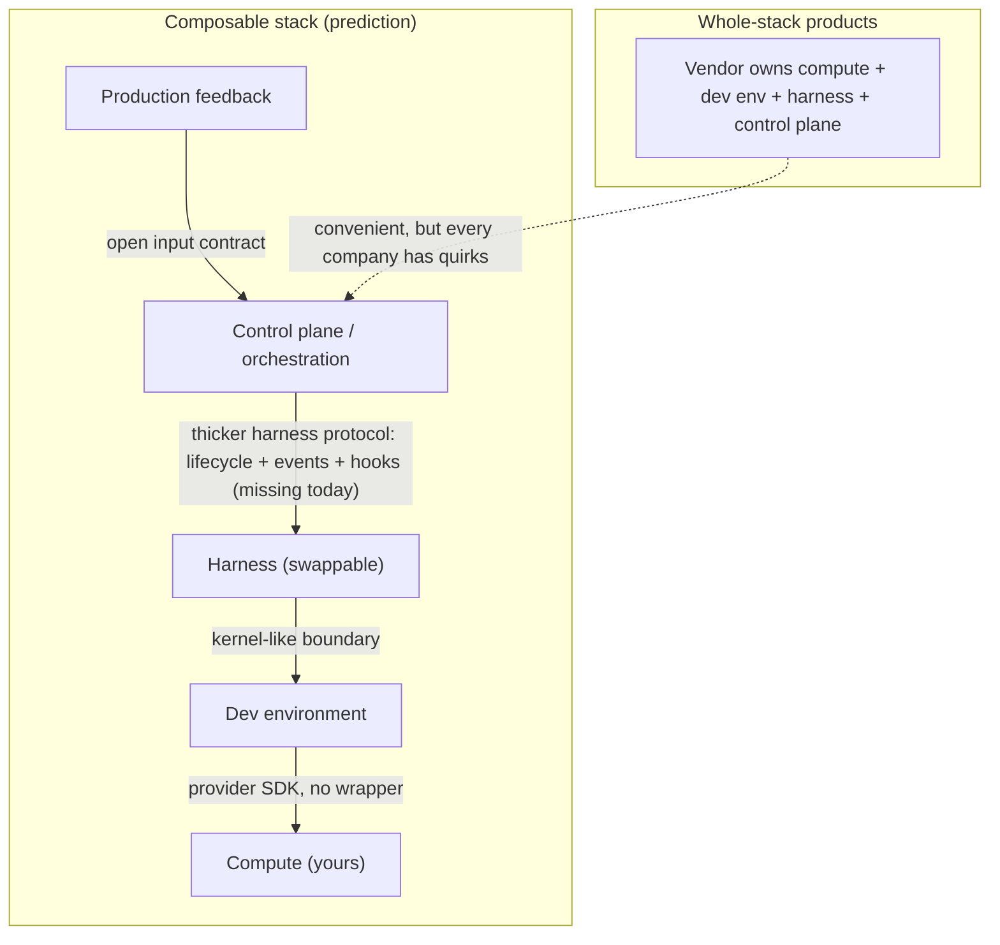
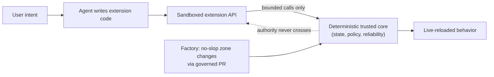

# 36. Where this is going

Every chapter so far has been about what a factory is and how to prove one.
This last chapter is about what the ground under it is doing. The stack is
young, the interfaces between its layers are unsettled, the vendors are
placing bets, and some of the most interesting ideas — software that extends
itself by letting agents write code against a trusted core — are not yet
requirements for anyone's V1. After reading it you should be able to say
which parts of this guide are likely to survive the next several years
unchanged, which parts are wagers, and which questions nobody has answered
yet. Everything in this chapter that is not a description of something
already built is a **prediction**, and it is marked as one.

## The problem

A factory is built on layers — compute, development environment, harness,
control plane, feedback — and in 2026 none of those layers has a stable
boundary with its neighbors. That creates three practical problems for
anyone building one.

The first is the whole-stack trap. Every vendor would like to sell you all
the layers at once, and the convenience is real: sign up, send a Slack
message, watch work start. But every company has quirks in how its internal
systems work, what counts as an issue, where its compute lives, and what it
refuses to run on someone else's infrastructure. A stack that cannot know
those quirks either fights them or forces you to fit its definitions. The
alternative — build everything yourself — is now cheap enough to be tempting
and expensive enough in integrations to be a mistake.

The second is that the interfaces do not exist yet. The protocols that do
exist are narrow, and the thing most factories need — a way to lifecycle a
harness, observe its events, and intervene — is exactly the thing no protocol
standardizes, because every harness is its own bespoke user interface.

The third is that predictions leak into requirements. A chapter like this
one, or a conference talk, describes a plausible future, and six months later
someone is building it into a roadmap as though it were proven. The
discipline this guide has applied to Mission Control applies here too:
separate what is built from what is claimed from what is guessed.

## How it works

### The stack, and where its seams are

Recall the five-layer picture from [Chapter 2](../01-understand/02-the-factory-in-one-view.md)
and [Chapter 14](../03-build/14-development-environments-sandboxes-and-compute.md):
compute at the bottom, then the development environment, then the harness
(inner and outer), then the control plane and orchestration, with feedback
loops closing back from production. The practitioners running factories in
2026 agree on the layers and disagree on almost everything else, and the
disagreements cluster at the seams.

<!-- infographic: composable-future -->
> **Infographic — The composable future.** *(Jay's graphic goes here.)* Until then, the diagram below
> carries the same concept.

Between the control plane and the harness, the **Agent Client Protocol**
exists, but it is narrow: an editor-to-agent transport with capability
negotiation. **AG-UI** broadcasts events and UI state. Neither supports
**hooks** — the mechanism a control plane needs to lifecycle a harness and
react to its events with policy checks, evidence capture, or intervention —
and the harnesses themselves disagree about what a hook is. One harness ships
hooks as shell-level interceptors, another as a plugin system where hooks are
a different concept altogether, a third has no equivalent. There is no
standard because, so far, there rightly cannot be one: the harnesses embody
different tradeoffs (one is "bring it and it is good", another is "configure
every detail and get control"), and the abstraction that would represent all
of them has not been discovered. The analogy the practitioners reach for is
the web before React: dozens of frameworks, no shared concept, until someone
noticed that state was the boundary and everything else devolved from it.
Nobody has found the equivalent boundary for harnesses yet. That is a
prediction about the shape of the answer, not the answer.

Between the harness and the development environment the boundary looks more
like an operating-system kernel: what APIs does the environment expose, what
control do you have, how do you set it up. Attempts at a universal compute
SDK have tended to turn into benchmarks instead, and the practitioner view is
that this layer does not need abstracting: once a company is large enough it
is an AWS shop or a GCP shop, a Daytona user or not, and the provider's own
SDK and CLI are already good. The older rule applies — do not wrap APIs with
APIs. A thin client that passes most calls through and forces you to add a
method for every new endpoint is worse than calling the official SDK at the
call site.

Between production and the control plane sits the least-discussed seam: the
**input control plane** that decides what counts as an issue. A team that
receives untrusted feedback from other users' agents cannot hand it straight
to an orchestration product; it has to run its own triage first (the pipeline
in [Chapter 32](./32-production-feedback-review-and-the-agentic-merge-queue.md)).
This is the concrete reason the same team stopped using a single issue
tracker as its source of truth: it needed two definitions of an issue and no
product offered them.

### Composition over inheritance

The prediction that follows from those seams is the one this chapter is
named for. Today, whatever layer you buy at, you tend to inherit everything
below it: buy orchestration and get the vendor's harness, sandbox, and
compute whether you wanted them or not. The composable alternative is that
each layer has an open interface and the engineer chooses per layer — buy the
orchestration, bring your own harness, run on your own compute. It is
composition over inheritance applied to the stack. Vendors are already
moving: one orchestration product makes its harness swappable and declines
to own compute because its serious customers prefer a good interface on top
of infrastructure they own; one whole-stack vendor offers "outposts" that
bring the harness and tooling into the customer's compute so the two co-own
the environment; a model vendor sells its harness as a building block or as a
full stack with scheduled automations. Enterprises, in this view, bring the
compute and probably parts of the development environment and buy above
that.

The most useful framing is that the product question at any one layer
matters less than the open interfaces that let people mix and match. MCP is
the existence proof: a narrow interface that created an ecosystem in which
agent clients, harness builders, and integration builders could combine
freely. Whether the next such interface arrives depends on whether the major
harness vendors want to interoperate — and the early signs (rival
configuration-file conventions, changing APIs) are that owning the harness is
being treated the way owning the browser or owning mobile once was: a
position worth fighting for because it pays. Call this the **harness war**,
and expect it to slow standardization for a while.

### Will there be a LAMP stack?

Asked whether a LAMP-stack equivalent will emerge for factories, the
practitioners say yes, eventually, and not the way people expect. It will
not be a particular web framework and database; it will be a conventional
combination at the harness, development environment, and infrastructure
layers, with the development environment playing the role Docker played.

Asked why there is no open-source control plane today, they give three
reasons, all of which are worth keeping. First, it is now so easy to write
code that nobody wants someone else's control plane unless it already has the
integrations they need. Second, everyone building one wants to sell it, which
is reasonable given how much design goes into it. Third, every company's
working style has a different definition of an issue, a plan, and done, and a
generic product cannot know them. The one open-source option people point to
is itself another full stack that you bring compute to. The prediction is
that an open control plane will come, but only after vendors have watched
enough companies succeed and fail to know what the shared interface is — you
could not build React the first time the web was invented — and that a
vendor with a good production stack will be the one to open it. Where this
guide's own thesis meets that prediction: the authoritative records and
negative authority described in [Chapter 5](../02-design/05-authoritative-records.md)
are a candidate for the part that does not vary between companies, even when
the definition of an issue does.

### Extensible software and the agentic shell

The second large prediction is about what software itself becomes when
agents can write code cheaply.

<!-- infographic: extensible-software -->
> **Infographic — Extensible software: trusted core, untrusted extensions.** *(Jay's graphic goes here.)* Until then, the diagram below
> carries the same concept.

The idea is called **code mode**: the best way to extend software is to let
an agent write code against it. Instead of a visual integration manager
where you configure "when a webhook arrives, transform it this way, then run
this workflow", you write the code that does it — or your agent does — and
the application runs it. The observed versions are modest and already real:
a coding harness whose customization is a plugin an agent can write and
live-reload; an orchestration product configured by dropping TypeScript
files into a directory; a product where users could, in principle, define
their own columns and small workflows and add their own agent loops. Scheduled
automations are the degenerate case — a cron job is "while true, at this
time, run this code" — and the value people would pay for is the reliability
underneath: if the server is down at that minute, it still runs a minute
later somewhere else. Buy the reliability; write your own workflows.

The architecture that makes this safe is the **trusted core with an
untrusted extension boundary**: a deterministic core that owns state, policy,
and reliability, and a **sandboxed extension API** through which
agent-written or user-written code can act, with bounded calls and no path
for authority to cross back. Teams already describe their codebases this way
— a functional core and a "no-slop zone" where changes go through the factory
and a governed pull request, surrounded by zones where pragmatic, generated
code is welcome. The phrase for the whole shape is an **agentic shell around a
deterministic core**. What crosses the boundary is **dynamic code
generation**: code written at run time, for this user and this moment, rather
than shipped in a release, and the units it produces are **agent-generated
extensions**, small versioned pieces of behavior that an agent authored and
that the core loads through the sandboxed API with the same lifecycle
(publish, activate, revoke) as any human-written plugin. Push it to its
conclusion and the prediction is that
every piece of software becomes a harness: an application that exposes a
core and lets agents extend it in real time, the way editor extensions let a
new tool work in the editor without the editor updating. The hard parts are
unglamorous and unsolved: deciding what is core and what is code, which
interfaces the code may call, and how to keep the sandbox honest. Nobody has
a convincing demonstration yet; the demos that exist break during the
livestream.

For a factory this matters in two directions. Outward, the factory is the
mechanism that changes the no-slop zone — every extension boundary needs a
governed path for changing the core. Inward, the factory itself is a piece
of software with a deterministic core (the control plane and its records) and
an obvious appetite for extensions (workflows, recipes, verifiers, learning
signals), and the same boundary discipline applies: an extension may propose,
never accept.

### The adjacent patterns, ranked as adjacent

A coverage audit of the practitioner material sorted a set of patterns as
lower priority than the production gaps — useful, adjacent, and not V1
requirements. They belong here rather than in the build chapters.

The first cluster is about prototypes as a way of learning before committing.
**Prototype-as-spec** is a large generated prototype used as the specification
itself, then sliced into reviewed PRs as in Chapter 32. An **interaction mock**
is a clickable, generated approximation of a user interface built to test how
something should feel before anyone decides how it should work. A **discovery
prototype** is a throwaway built to answer one product question (will users
understand this flow, does this data exist) and discarded once the answer is
recorded. A **tracer bullet**, also called a **technical spike**, is a thin
end-to-end slice through every layer of a proposed architecture, built to
prove the path is passable rather than to deliver a feature, and kept only if
it proves out. Beside them sit the **prototype-to-production rewrite** and
**visual regression evidence** as a first-class artifact.

The second cluster is the extensibility material above: agent-generated
extensions, code mode, dynamic code generation, the trusted-core boundary,
the sandboxed extension API, and the agentic shell. The audit's ordering is
the right posture: canonical
stack boundaries, context engineering, evaluation, environments, feedback,
multi-repository delivery, and the infrastructure landscape first;
prototype and extensibility patterns last.

### The research frontiers

Alongside the practitioner predictions sit the questions a research program
should be tracking. The Software Factory Research Lab charter names ten
topics: agentic software factories; autonomous software factories; **dark
software factories** (the fully lights-out plant, no human in the loop, whose
feasibility and desirability are both open); AI-native software development;
agent orchestration for software engineering; coding-agent harnesses;
**specification-driven development** (the spec as the executable source of
truth, which Chapter 6 treats as intent engineering and which Mission
Control's spec intake explores); **autonomous testing and verification**
(whether independent verification can itself be generated and still be
independent); human approval and governance models; and the current products,
frameworks, research, benchmarks, and implementations.

The charter's discipline matters as much as its topics, because this field
goes stale in months. Prefer sources published or materially updated within
twelve months; allow up to twenty-four only for foundational work, flagged as
such; reject undated content unless relevance is independently verified;
record publication, update, and retrieval dates; never say "latest" without
checking the date and searching for newer material; never rely on model
memory for current products, benchmarks, or claims. For every important
claim retain source, publisher, URL, dates, source type, supporting excerpt,
confidence, freshness, corroborating and contradictory sources — and label it
as verified fact, vendor claim, research finding, practitioner opinion,
system inference, or unverified hypothesis. Most of this chapter is
practitioner opinion and system inference; treat it accordingly.

### The five-year shape

Jay's own roadmap is a plan, not a prediction, but it is the horizon this
guide is written toward. **Year one** proves the model: MVP, one repeatable
workflow, measurable results, design partners, a category narrative. **Year
two** proves repeatability: more workflows, multiple repositories and teams,
improved governance, established ROI, a small expert team, early revenue or a
major internal mandate. **Year three** proves enterprise scale: multiple
business units, enterprise system integration, strong security and
compliance, organization-level productivity evidence, public recognition for
the operating model. **Year four** leads the category: expansion beyond
development into operations, incidents, security, and platform work; an
ecosystem of agents, models, tools, and workflow templates; partnerships; the
definitive playbook. **Year five** is the operating standard: Mission Control
as an enterprise control plane, and human-agent software factories as a
recognized field. Read against [Chapter 35](./35-mastering-the-factory.md),
year one is the twelve-month plan.

### Open questions

The [research canon](../appendix/research/initial-canon.md) lists what to
study; it does not claim answers. The questions this guide leaves open, in
rough order of how much depends on them:

1. What is the boundary abstraction for harnesses — the "state" of the
   harness world — that would let a control plane lifecycle any harness
   through one protocol with hooks?
2. Can independent verification be generated by agents and remain
   independent, or does autonomy in testing collapse the separation the
   whole factory rests on?
3. Which records are invariant across companies (this guide's wager: the
   authoritative hierarchy and negative authority) and which are local
   definitions (issue, plan, done) that no shared control plane can own?
4. Is a dark factory ever desirable for consequential software, or does the
   accountability model in [Chapter 4](../02-design/04-the-human-agent-operating-model.md)
   make "no human" a category error rather than a maturity level?
5. What is the safe extension boundary — which calls may untrusted,
   agent-written code make into a trusted core, and how is that sandbox
   itself verified?
6. Do outcome-normalized routing evidence and trust scores ever justify
   automatic autonomy promotion, and at what sample size?
7. Will the harness war end in an open interface, and who opens it?

## How to build it

You cannot build the future, but you can avoid building against it.

- **Choose per layer, and know why.** For compute, development environment,
  harness, control plane, and feedback, write down whether you buy, build, or
  bring, and the interface you expect to hold at each seam.
- **Keep the harness swappable.** A provider-neutral lifecycle contract
  (prepare, execute, cancel, collect, cleanup) and an exact capability
  manifest are the parts of this future you can build today.
- **Do not wrap provider SDKs.** Call them at the call site; abstract only
  where you have two real implementations.
- **Own your input control plane.** Define what an issue is for you and keep
  untrusted feedback outside the orchestration boundary until it earns
  standing.
- **Draw the no-slop zone.** Name the deterministic core, the governed path
  for changing it, and the zones where generated code is acceptable.
- **If you expose an extension API, write the boundary contract first:**
  which calls exist, what authority each may never acquire, how extensions
  are sandboxed, versioned, live-reloaded, and revoked, and how the core
  verifies the sandbox.
- **Run the research discipline.** Date every source, classify every claim,
  and re-review framework and protocol links at least quarterly.
- **Label your own roadmap.** Built, claimed, predicted. Keep the three words
  in every planning document.

## Failure modes

**Inheriting the stack.** Buying at one layer and discovering you own the
vendor's compute, sandbox, and definitions of done. Detect it when a change
at one layer requires renegotiating the others; prevent it by choosing per
layer with named interfaces.

**Wrapping the world.** A house abstraction over every provider that adds a
method per endpoint and drifts behind the official SDK. Detect it by counting
pass-through methods; fix it by deleting the wrapper.

**Predictions as requirements.** Extensible software, dark factories, and
open control planes appearing in a V1 backlog. Detect it when a roadmap item
has no evidence state; fix it with the built-claimed-predicted label.

**An extension boundary that leaks.** Agent-written code that can reach
policy, credentials, or acceptance. Detect it by enumerating what the
extension API can call and reconciling against the negative-authority table;
fix it before the first extension ships, not after.

**Stale research.** A brief that cites a benchmark or product capability from
eighteen months ago as current. Detect it by the retrieval dates; fix it by
the freshness policy.

**Waiting for the standard.** Refusing to build until the harness protocol
settles. The composable stack is a prediction; the swappable harness contract
is available now.

## In Mission Control

At [`d902fae`](https://github.com/jaydubya818/MissionControl/tree/d902fae7032c0696b531c44ae88829c652516fc6)
and `b3dfcee`, Mission Control has already made the composable choices this
chapter recommends: a provider-neutral Generic Harness Contract with exact
capability manifests and a swappable adapter registry (`codex/v1` admitted,
DeepSeek experimental, a pluggable engine adapter); a `SandboxProvider` abstraction with
local and remote backends; six versioned YAML workflows and a recipe catalog
that resolve to canonical workflows rather than a second engine; a skills
registry with `SKILL.md` parsing and linting; and a control plane that treats
Factory Memory, evals, and learning as advisory projections — a deterministic
core with advisory shells. The Research Lab workspace and operator-triggered
research path exist with atomic artifact, observation, cursor, and
verification-receipt lineage, and scheduled research still fails closed while
`continuousSchedulingEnabled` is `false`.

None of the predictions here is implemented. There is no code-mode extension
API, no sandboxed user- or agent-written extension boundary, no live-reloaded
extensions, no open harness lifecycle protocol beyond Mission Control's own
contract, no governed MCP gateway, no dark-factory mode, and exact skill
binding into the execution manifest was not observed. Those are future by the
repository's own labels, and this chapter does not promote them.

## Retain this

- The layers are agreed; the seams are not. The missing interface is a
  thicker harness protocol with lifecycle, events, and hooks, and nobody has
  found its "state" abstraction yet.
- Composition over inheritance: choose per layer, keep the harness swappable,
  bring your own compute, do not wrap provider SDKs.
- A LAMP-stack equivalent and an open control plane are predicted, later
  than people hope, after enough companies have shown what is shared. The
  harness war will slow it.
- Extensible software means an agentic shell around a deterministic core with
  a sandboxed extension boundary; every piece of software may become a
  harness. Adjacent, not V1.
- Research frontiers: dark factories, spec-driven development, autonomous
  testing and verification, governance models — tracked with dated sources
  and labeled claims.
- Five years: prove the model, prove repeatability, prove enterprise scale,
  lead the category, become the operating standard.
- Built, claimed, predicted. Keep the words apart.

## Go deeper

- [Chapter 2 — The factory in one view](../01-understand/02-the-factory-in-one-view.md)
  and [Chapter 14 — Development environments, sandboxes, and compute](../03-build/14-development-environments-sandboxes-and-compute.md)
  for the stack and build-versus-buy as they stand today.
- [Chapter 13 — Coding harnesses and agent protocols](../03-build/13-coding-harnesses-and-agent-protocols.md)
  for ACP, AG-UI, hooks, and the harness contract.
- [Chapter 6 — Intent and specification engineering](../02-design/06-intent-and-specification-engineering.md)
  for the spec-driven thread.
- [Chapter 31 — Enterprise adoption and the infrastructure landscape](../05-operate/31-enterprise-adoption-and-the-infrastructure-landscape.md)
  for the vendor landscape.
- [Chapter 32 — Production feedback, review, and the agentic merge queue](./32-production-feedback-review-and-the-agentic-merge-queue.md)
  for prototype-as-spec and the input control plane.
- [Chapter 34 — Mission Control as a living case study](./34-mission-control-as-a-living-case-study.md)
  and [Chapter 35 — Mastering the factory](./35-mastering-the-factory.md).
- [Appendix C — Research canon](../appendix/research/initial-canon.md) —
  the sources to study, and the maintenance rule that links are reviewed
  quarterly and specification versions pinned.
- [Glossary](../appendix/glossary.md).
- Sources: HumanLayer (Dexter) and BAML (Vaibhav), "Software factory design
  patterns" livestream — where the pattern is evolving, why interfaces matter,
  the LAMP-stack question, the harness war, and extensible software; "The
  12-layer production AI agent stack" coverage audit — the lower-priority
  material list and recommended documentation sequence; Jay West, "Software
  Factory Research Lab" PRD and mission — research topics, freshness and
  source-quality policy, claim classification; Jay West, "AI Software Factory
  Mission" — the five-year roadmap.
- Primary references for the interfaces named here: Agent Client Protocol;
  AG-UI documentation; Model Context Protocol specification 2026-07-28; Claude
  Code hooks reference (all listed in Appendix C).
