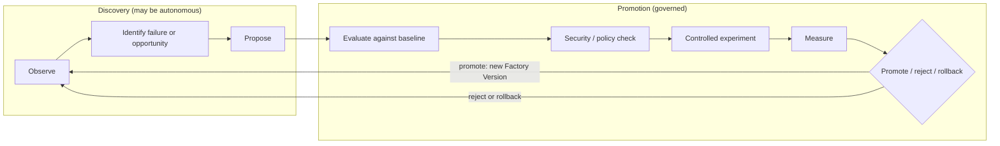
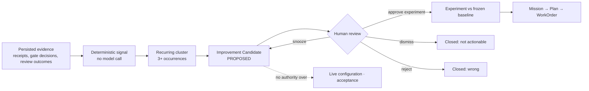
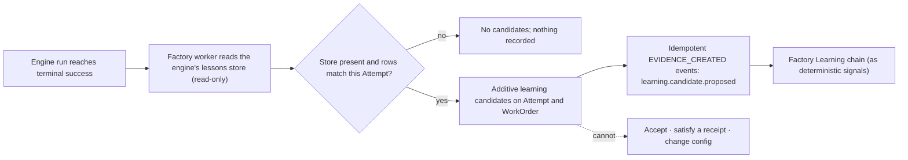
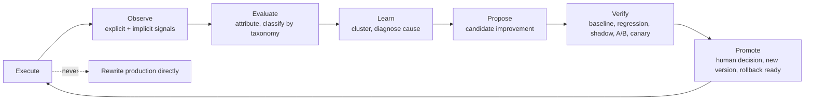

# 40. Governed learning

A factory should learn from failures and human corrections without allowing observations to rewrite active behavior. This chapter defines the governed learning chain from persisted evidence to deterministic signal, recurring cluster, Improvement Candidate, human review, experiment, and authorized work.

## The problem

A factory that never learns repeats its failures and requires permanent manual
tuning. Engineers correct the same repository convention, the same missing test,
the same architectural boundary, the same review preference, day after day,
inside individual conversations that nobody else sees. One practitioner
describes it as an entire engineering team yelling the same thing at Claude or
Codex all day. If those corrections stay in the chat, the organization pays for
the same lesson on every session. That accumulated, unharvested friction is
**learning debt**.

The opposite failure is worse. A factory that automatically edits its own
prompts, policies, workflows, evaluators, or authority from noisy feedback
becomes unpredictable: a local preference becomes an institutional rule, a
mistaken correction becomes a standing instruction, and the system being
evaluated generates the fix that confirms its own evaluation. The signals are
real — production outcomes, failed runs, human overrides, validator
disagreements, cost anomalies, new research — and they are mixed with noise,
malicious content, correlation without causation, and recommendations optimized
for the wrong metric. The factory needs to learn from all of it without letting
any observation authorize its own promotion.

## How it works

### Learning can be autonomous; promotion is governed

The organizing rule is one sentence: automate observation and proposal; govern
promotion. The factory may continuously collect, normalize, deduplicate, and
analyze signals, and it may propose a change to a prompt, skill, workflow,
policy, evaluator, model route, or architecture. Promotion to active behavior
requires an explicit human decision based on independent evaluation.

The 12-layer production agent stack names this layer **Continual Learning**
and defines it exactly that way: turn recurring production feedback into
evaluated, human-approved system improvements. Its position at the top of the
stack is the point — every layer below it is something Continual Learning may
propose to change, and none of them may change themselves.

The mission document's **Learning Layer** lists what the factory should capture
from every mission, and the list doubles as the schema for a learning signal:

- What plan was proposed?
- What was changed?
- What failed?
- What did humans modify?
- Which tests detected problems?
- What reached production?
- What customer outcome followed?
- What should change in the workflow?

The first seven are observations the factory can record automatically. The
eighth is a proposal. Keeping the two apart is the whole discipline.

### Three loops

Practitioners building software factories describe three nested loops, and the
vocabulary is worth adopting because it says where learning lives.

The **inner loop** is what the agent iterates on while building: the skills,
plugins, formatters, and fast test suite it uses to check its own work. The
better the inner loop, the more often the agent lands on the right answer
without anyone looking. The **outer loop** runs in a separate process and is
slower and more expensive: validate, review, release, observe the outcome. It
is the final gate, meant to catch what the inner loop missed. The **meta loop**
sits around both, watching what slipped through — review comments, failed CI
checks, human edits — and proposing changes to the inner or outer loop so that,
in the phrase one team uses, you only make a mistake once and never tell the
agent the same thing twice.

The meta loop has the most leverage, because a change to it alters every future
run. That is exactly why it requires the strongest evidence and the tightest
promotion control. A change to one PR affects one PR; a change to the review
skill affects every PR from now on.

One practical consequence: Tessl's team outlawed local configuration.
Everything that improves the agent is checked into the repository so an
improvement improves for everyone — that is the compound loop. Personal
preferences exist (more on scope below), but the mechanism of learning is the
shared repo, not the individual's dotfiles.
[Chapter 16](../03-build/16-harness-engineering.md#inner-loop-outer-loop-meta-loop)
gives the three loops their table, the question each answers, and the
objective each serves (autonomy, automation, improvement); this chapter is
about the third.

### Four loop layers

Cut the same machinery the other way, by what each loop consumes and
produces rather than by where it runs, and there are four layers. Each one
feeds the next, and a factory that skips a layer has a loop with nothing to
learn from.

<!-- infographic: loop-layers -->
> **Infographic — The four loop layers.** *(Jay's graphic goes here.)* Until then, the table below
> carries the same concept.

| Layer | What it does | Examples |
| --- | --- | --- |
| **Feedback loops** | Produce raw signals while and after the agent works | Tests, linters, type checks, security scans, build results |
| **Verification loops** | Turn signals into objective evidence before a result is trusted | Independent verifiers, review agents, acceptance validation, production checks |
| **Memory loops** | Retain what the factory has learned so it is available next time | Context, historical failures, successful patterns, repository profiles, the golden set |
| **Optimization (meta) loops** | Update the factory's own prompts, triggers, constraints, skills, and routing from measured outcomes | The learning loop of this chapter, the pruning of Chapter 16, the eval-driven changes below |

The agents in such a factory operate inside these layers rather than in
prompt-by-prompt interaction: harnesses, persistent memory, and independent
verification gates run, test, measure, and refine continuously, and the humans
move from writing every line to designing the contracts, owning the
governance, judging product intent, and supervising the review gates. The
feedback layer is the cheapest and the most often built; the memory layer is
the most often skipped, which is why the same failure is rediscovered by
every run; the meta layer is the one this chapter governs, because it is
the only layer that changes the other three.

### The learning loop

<!-- infographic: learning-loop -->
> **Infographic — The governed learning loop.** *(Jay's graphic goes here.)* Until then, the diagram below
> carries the same concept.

```mermaid
flowchart LR
    Signals["Failures, outcomes, overrides, research"] --> Normalize["Provenance, dedupe, risk"]
    Normalize --> Cluster["Cluster and diagnose cause"]
    Cluster --> Suggest["Versioned improvement proposal"]
    Suggest --> Evaluate["Offline and shadow evaluation vs baseline"]
    Evaluate --> Decide["Human promotion decision"]
    Decide --> Work["Governed Mission or WorkOrder"]
    Work --> Canary["Bounded canary"]
    Canary --> Measure["Outcome and regression window"]
    Measure -->|retain, revise, rollback| Suggest
```

**Learning signals** come from everywhere the factory touches: human
corrections, repeated instructions, context misses, tool errors, routing
mismatches, retries, validation failures, incidents, review findings, cost
anomalies, and — easy to forget — successful low-attention strategies. Each
signal records source, subject, severity, attribution, evidence, and
uncertainty. Production feedback is biased toward visible failures and vocal
users, so the signal set must deliberately include quiet successes and silent
overrides.

Normalization adds provenance, deduplicates, and assigns risk. **Research and
memory are untrusted inputs**: every source needs identity, retrieval time,
content hash, classification, license or usage constraint, sensitivity, and
provenance; every extracted claim needs supporting evidence, confidence,
contradictions, and a lifecycle. Source content cannot change instructions,
invoke tools, or grant authority. A paper the factory read, a memory it wrote
last week, and a comment a reviewer left are all evidence; none of them is an
instruction.

The **versioned improvement proposal** is the meta loop's output. It is a
record, not a change. It names the hypothesis, the affected components, the
baseline, the expected benefit, the risk, the dataset and metrics, guardrails,
scope, rollback, and an owner. It should expose why the recommendation exists,
which evidence supports it, what could falsify it, and — once decided — who
promoted it. No model or source reputation bypasses those controls.

The proposal then stays inside the delivery hierarchy. An accepted
recommendation becomes a governed Mission or WorkOrder with scope, criteria,
budget, risk, and owner. It does not mutate production configuration directly.
The same execution, validation, evidence, and release rules that apply to
customer software apply to the factory improving itself. This is the analogy
that makes recursive improvement safe: a factory retooling its own line files
the same work order, passes the same inspection, and ships under the same
release process as the products it makes. The recursive object changes;
accountability does not.

### Signals and source diagnosis

A thumbs-up is not a learning signal; it is one bit of one person's mood at
one moment. The signals worth collecting connect execution behaviour to
outcomes, and the full list is longer than most teams instrument on day one:

- accepted and rejected outputs;
- human edits, and specifically **how much** was changed (a one-line tweak
  and a rewrite are different verdicts on the same output);
- reviewer feedback on findings (useful, wrong, correct but irrelevant);
- evaluation failures;
- tool failures;
- **unnecessary tool calls** (the run succeeded, but took nine calls where
  three would do);
- expensive trajectories (success at a cost that would not survive a budget);
- production defects and rollbacks traced back to the change that caused them;
- model performance by task class;
- retrieval quality, and in particular **which retrieved context actually
  contributed** to the output versus which was ignored; and
- direct builder feedback.

A signal is only useful once it is attributed to a source, and the sources are
the components in the execution lineage of
[Chapter 35](../05-operate/35-observability-telemetry-and-forensics.md):
the Agent Definition, the skill, the model route, the prompt, the context
retrieval, the tool's behaviour, or the evaluation coverage. Diagnosis is the
step that turns a complaint into engineering data.

<!-- infographic: signal-diagnosis -->
> **Infographic — From signal to source.** *(Jay's graphic goes here.)* Until then, the table below
> carries the same concept.

| Signal | Sources it usually points at |
| --- | --- |
| Large human edits on accepted output | Prompt or Agent Definition instructions; missing context |
| Repeated rejection on one task class | Model route; skill fit; evaluation coverage that let it through |
| Unnecessary tool calls or expensive trajectories | Skill design; tool schema clarity; stopping conditions in the definition |
| Tool failures | Tool contract; argument validation; environment |
| Retrieved context that never contributed | Retrieval ranking, chunking, or freshness; context policy |
| Evaluation failures that reviewers disagree with | Evaluator calibration; dataset drift |
| Production defect after a clean pass | Evaluation coverage; verification strength; risk classification |

The table is a starting hypothesis in each row, not a verdict, which is why
the causal-diagnosis step below tests it before anything is proposed.

### Implicit and explicit feedback

Signals arrive in two registers, and a learning system that listens to only
one of them hears a distorted version of the factory. **Explicit feedback**
is what a person deliberately says about an output: a review comment, a
thumbs-down with a reason, a correction typed into a form, a builder marking
a finding wrong. It is precise, rare, and biased toward the vocal. **Implicit
feedback** is what a person does, recorded without being asked: the finding
they acted on and the one they scrolled past, the suggestion they merged
unchanged and the one they rewrote, the change that shipped clean and the one
that came back as an incident three weeks later. It is abundant, noisy, and
far more representative, because it comes from everyone rather than from the
people who bother to comment.

The implicit register is where **builder behavior signals** live, and four
of them carry most of the information:

| Behavior signal | What it says | What it does not say |
| --- | --- | --- |
| **Comment acceptance** | The builder acted on a finding (fixed, replied, resolved with a change) | That the finding was correct; only that it was worth attention |
| **Reviewer override** | A human reversed an automated decision: unblocked a blocked change, or blocked a passed one | Which side was right, until the outcome is known |
| **Dismissed finding** | A finding closed with no change and no reply | Whether it was wrong, irrelevant here, or right but ignored under deadline |
| **Later incident** | A change that passed every gate caused a production defect or rollback | Which component let it through, until diagnosis attributes it |

Each one becomes useful only once it is joined to the record it concerns
(the finding, the reviewer, the change, the configuration that produced it)
and then to the outcome that followed. A dismissed finding followed by a
later incident on the same lines is a strong signal that the finding was
right and the dismissal was the error; a dismissed finding with no incident
in the observation window is a weak signal that the finding was noise. The
join is what turns behavior into evidence, and the join needs the lineage of
[Chapter 35](../05-operate/35-observability-telemetry-and-forensics.md).

Once signals are attributed, they are sorted into a **failure taxonomy**: a
versioned classification of the ways the factory gets things wrong, by cause
rather than by symptom. Wrong context retrieved; right context ignored; tool
misuse; specification gap; unsafe action attempted and blocked; unsafe action
attempted and not blocked; evaluator miss; routing mismatch; budget
exhaustion; human-process failure. The taxonomy is what lets a thousand
individual signals become a dozen clusters with counts, trends, and owners,
and it is the input the source-diagnosis table above is applied to. A
taxonomy that is not versioned drifts into a folder of ad-hoc labels; a
taxonomy that is not shared across teams hides the pattern that recurs in
all of them.

### Discovery versus promotion: the recursive loop

The learning loop above can be drawn with one more distinction made explicit,
and it is the distinction the rest of the chapter depends on. **Discovery** is
the part that may run on its own: analysing failures, edits, rejections,
expensive trajectories, and outcomes, and proposing a better Agent Definition,
skill, model route, retrieval configuration, missing evaluation, or a piece of
deterministic automation to replace a reasoning step. **Promotion** is the part
that may not: baseline comparison, regression evaluation, security and policy
checks, a controlled experiment or rollout, measurement, and only then promote,
reject, or roll back.

<!-- infographic: recursive-loop -->
> **Infographic — The recursive improvement loop.** *(Jay's graphic goes here.)* Until then, the diagram below
> carries the same concept.

Mission Control names the same stages in its own vocabulary, and the naming is
useful because each stage is a record: **Research → Verify → Recommend →
Approve → Implement → Validate → Measure → Iterate**. Evidence produces
signals; signals cluster into recurring patterns; patterns become
**Improvement Candidates**; candidates run as experiments; experiments produce
recommendations (a better skill, route, prompt, verifier, workflow, or policy);
and an accepted recommendation returns to the factory through a new Mission
and a governed Plan, the same door every other change uses. The line that
summarises both drawings: *autonomous discovery, not autonomous authority.*

### The Factory Learning chain and the Improvement Candidate

Written as records rather than stages, the discovery half is a chain with a
fixed number of links, and each link is a type the next one consumes:

`persisted evidence → deterministic signal → recurring cluster → Improvement
Candidate → human review → experiment → Mission → Plan → WorkOrder`

<!-- infographic: factory-learning-chain -->
> **Infographic — The Factory Learning chain.** *(Jay's graphic goes here.)* Until then, the diagram below
> carries the same concept.

Three rules on that chain are what make it safe to run continuously.

*Signals are deterministic and a refresh makes zero model calls.* A learning
signal is computed by code from persisted evidence: this criterion failed on
this class of check for the third time this month; this reviewer overrode
this verifier again; this Attempt exceeded its budget on this repository. No
model reads the evidence to decide that a signal exists. That is what lets
the learning view be refreshed on a schedule, or on demand, without spending
inference and without a model quietly deciding which of the factory's
failures deserve attention. Models enter later, in the experiment, where
their output is measured against a frozen baseline.

*A cluster needs a small, policy-set number of occurrences — three is a
reasonable default — before it becomes a candidate.* One failure is an
incident; two are a coincidence worth noting; a handful of the same
deterministic signal, clustered by the versioned failure taxonomy, are a
pattern, and only a pattern earns an **Improvement Candidate**. Set the
threshold low enough to catch real recurrence early and high enough to keep
single loud failures from flooding the queue; a low-volume repository or a
severe failure class may reasonably set it lower, and a noisy, high-volume
one may set it higher.

*The candidate has four human verbs and no authority.* A reviewer can
**approve an experiment** (the candidate becomes a frozen baseline-versus-
candidate comparison), **snooze** it (it returns after a window, with its
recurrence count still accumulating), **dismiss** it (recorded as not
actionable, and the signal keeps counting so that a dismissed pattern that
keeps recurring resurfaces with its history), or **reject** it (recorded as
wrong, with the reason). None of those verbs, and nothing in the candidate
itself, touches live configuration or acceptance. An Improvement Candidate
cannot change a Factory Version, cannot alter a policy, cannot accept a
WorkOrder, and cannot satisfy a receipt; an approved experiment that wins
produces a recommendation that enters the factory as a Mission with its own
Plan approval, like any other change.

One recommendation type has a name because it closes a loop the others do
not. When the meta loop finds that a production failure or a recurring
correction was not covered by any evaluation, the recommendation is an
`EVAL_SCENARIO`: a new case for the golden evaluation set, drawn from the
exact failure. Accepting an `EVAL_SCENARIO` creates the scenario in the
evaluation registry with its **PR lineage** attached, the pull request and
commits in which the failure was fixed, so that the case can be traced to
the change that motivated it and re-derived when that code changes again.
That is the mechanism by which escaped defects update the regression suite
rather than the postmortem document.

### Learning writeback from an execution engine

A pluggable execution engine ([Chapter 13](../03-build/13-control-plane-orchestrator-and-execution-plane.md)
and [15](../03-build/15-coding-harnesses-and-agent-protocols.md)) often
keeps a lessons store of its own: notes it wrote to itself about what
worked, what failed, and what it would do differently in this repository.
That store is a learning signal the factory should not ignore and must not
trust. **Learning writeback** is the bounded way to use it.

<!-- infographic: learning-writeback -->
> **Infographic — Learning writeback: read-only, additive, advisory.** *(Jay's graphic goes here.)* Until then, the diagram below
> carries the same concept.

The mechanics are narrow on purpose, and the default is deliberately
conservative rather than the only defensible choice. After a terminal
*successful* engine run, and only then, the factory worker reads the
engine's lessons store read-only; it never writes to it, and by default it
does not read it after a failed or cancelled run, on the reasoning that
lessons written on the way to a failure are hypotheses the engine did not
get to test and so are more likely to be wrong than lessons from a run that
finished. A factory that wants signal from failed runs too can read them in,
provided it labels them separately as unverified and keeps them out of the
same candidate pool as lessons from success — the risk is treating an
untested hypothesis as if it had been. Rows that match this Attempt
become **learning candidates**, recorded additively on the Attempt and its
WorkOrder (nothing on either record is overwritten), and each one is emitted
as an idempotent `EVIDENCE_CREATED` event of type
`learning.candidate.proposed`, so that a re-poll after a crash produces the
same candidates once. If the store is missing, there are no candidates and
no error; an engine that does not keep lessons is not a defect.

The rule that keeps writeback from becoming a side channel is the one the
whole chapter rests on: *learning candidates are telemetry*. They cannot
accept a WorkOrder, cannot satisfy a verification receipt, and cannot change
a Factory Version. They enter the Factory Learning chain as inputs to a
deterministic signal and earn their way to an Improvement Candidate on
recurrence like any other evidence. An engine's own confidence that it
learned something is, in this guide's terms, one more claim.

### The seven-step loop, and the step it must never skip

Stripped to its verbs, the loop the whole chapter describes is seven steps
long, and the shape to keep is the one it is *not*: it is never Execute →
automatically rewrite production.

<!-- infographic: seven-step-loop -->
> **Infographic — Execute → Observe → Evaluate → Learn → Propose → Verify → Promote.** *(Jay's graphic goes here.)* Until then, the diagram below
> carries the same concept.

Two words in the loop name the difference between a good idea and a change
the factory may run on. A **candidate improvement** is the output of Propose:
a versioned proposal with a hypothesis, evidence, scope, and rollback, which
has earned nothing yet. A **controlled improvement** is a candidate that has
passed Verify under the experiment discipline of
[Chapter 29](../04-prove/29-evaluation-engineering.md) and been promoted by a
person with the authority the change's blast radius requires. The whole
loop, run against the factory's own components, is **recursive system
improvement**: the same machinery that improves customer software improves
the machinery, with the same records and the same gates.

Verify is the step with the most instruments, and they are ordered by how
much reality they expose the candidate to. **Regression testing** against
the frozen baseline comes first and costs nothing real. **Shadow evaluation**
runs the candidate beside the incumbent on live inputs with no authority to
affect anything; disagreements are recorded and reviewed. **A/B testing**
splits real work between incumbent and candidate under a predeclared
hypothesis, sample size, and stop rule, so that the comparison is a
measurement rather than an impression. **Canary rollout** gives the candidate
a bounded share of real authority with a risk stop and an observation window,
and is the last vote before the candidate becomes the default. No instrument
substitutes for the one before it: a canary without a regression run exposes
users to a candidate nobody checked offline, and a regression run without a
canary promotes a candidate production has never seen.

This four-instrument sequence is the reference default, not a fixed
requirement for every candidate at every risk tier. [Chapter 7's](../02-design/07-governance-policy-and-risk-proportional-approval.md)
risk tiers apply here as everywhere else: a low-risk, easily reversible
candidate (a documentation-only skill edit, a lint-rule addition) may be
sized down to regression plus a short canary by policy, while a candidate
that touches governance, security, or the promotion gate itself should
never skip an instrument. What must not happen, at any tier, is a later
instrument standing in for an earlier one that was never run.

### The six self-improvement levels

The seven-step loop says what happens. A second scale says how much of it
the factory is allowed to do on its own, and it is the scale to use when
someone asks whether a factory "self-improves", because the word covers six
different capabilities with six different risk profiles.

<!-- infographic: self-improvement-levels -->
> **Infographic — Six levels of self-improvement.** *(Jay's graphic goes here.)* Until then, the table below
> carries the same concept.

| Level | The factory can | What it produces | Who acts |
| --- | --- | --- | --- |
| 1. **Observe** | Collect executions, failures, corrections, and outcomes with lineage | Signals | Automation |
| 2. **Diagnose** | Attribute a signal to a component and a cause | A cluster with a source | Automation |
| 3. **Recommend** | Say what should change and why | A written recommendation for a person | Automation proposes; a person acts |
| 4. **Propose** | Produce the change itself: a pull request against a skill, a context file, a test, a verifier, or the harness | A reviewable diff | Automation proposes; a person reviews |
| 5. **Verify** | Run the regression suite and the with-and-without evaluation on its own proposal | Evidence attached to the diff | Automation |
| 6. **Promote** | Merge the verified proposal under a policy-defined approval | A new Factory Version | Policy: human for capability and authority changes; automatic only for the bounded-tuning class |

Two things about the scale matter more than the levels. First, level 4 is
where most factories should aim and most stop short: a factory that writes
recommendations nobody has time to implement has automated the part of
improvement that was never the bottleneck. A factory that opens the pull
request, with the evidence attached, has moved the human to the one
decision only a human should make. Second, level 6 is not the natural end of
the scale; it is a policy decision made per action class, and the line the
whole chapter rests on is drawn between levels 5 and 6: *autonomous proposal
is not autonomous promotion.* A factory can be fully autonomous through
level 5 and still never merge anything without the approval its policy names.

## How to build it

1. Build the golden evaluation set and lineage before autonomous learning.
2. Persist deterministic signals that join behavior, human correction, cost, evidence, and production outcome to the exact Attempt and Factory Version.
3. Read execution-engine lessons as untrusted telemetry: by default only after terminal success; admit failed-run lessons only in a separate stream labeled unverified.
4. Cluster recurring signals under a versioned failure taxonomy and diagnose the source before blaming the prompt.
5. Classify scope and create an Improvement Candidate with evidence, uncertainty, owner, and falsifier.
6. Give candidates no authority over live configuration, acceptance, or evidence.

## Failure modes

| Failure | Detection | Response |
| --- | --- | --- |
| Feedback mutates active behavior | Configuration changes without a proposal record | Route every change through candidate and promotion workflows |
| Failed-run lessons become trusted | Cancelled output enters the success stream | Default to terminal-success reads; isolate and label failed-run lessons unverified |
| Candidate gains authority | A recommendation edits configuration or satisfies a receipt | Keep candidates additive telemetry with human review verbs only |
| No stable baseline | Improvement is argued from anecdotes | Build the golden set and lineage first |
| Personal preference becomes policy | Scope is absent from the signal | Classify scope before clustering or promotion |

## In Mission Control

Mission Control has deterministic learning signals, failure clusters, Improvement Candidates, human review actions, and flag-gated engine writeback contracts. The retained evidence shows proposal with automatic promotion disabled; it does not establish a self-operating production learning factory.

## Retain this

- Learning may observe, cluster, diagnose, and propose autonomously; promotion remains governed.
- The chain is evidence → deterministic signal → recurring cluster → Improvement Candidate → human review → experiment → authorized work.
- Execution-engine lessons are read-only and default to terminal-success runs; failed-run lessons are separate and explicitly labeled unverified.
- A candidate is telemetry with provenance and uncertainty; it cannot accept work, satisfy evidence, or mutate live configuration.
- Build the golden evaluation set and lineage first, classify scope, and diagnose the source before optimizing.

## Go deeper

- [40. Governed learning](./40-governed-learning.md) for the foundation this chapter builds on.
- [Canonical glossary](../appendix/glossary.md) for the terms and boundaries used here.
- Return to the [book map](../README.md) for the complete reading sequence.
