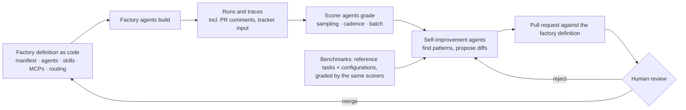
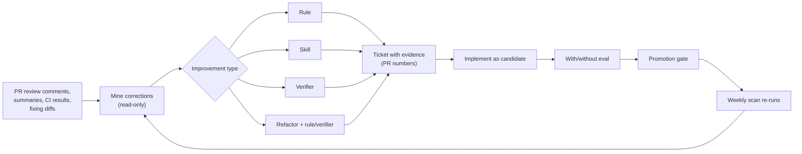
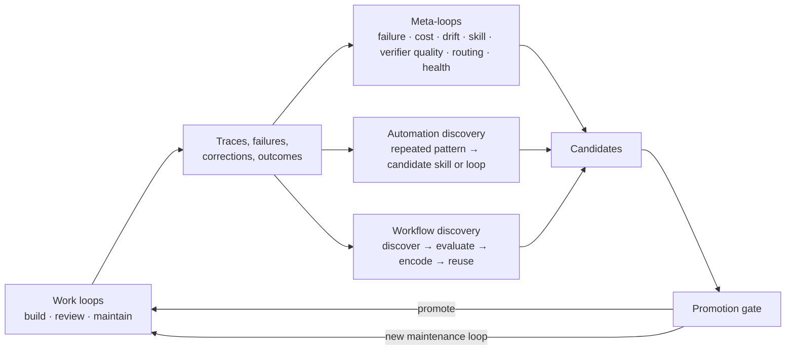
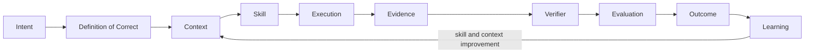

# 41. Meta-loops and the closed-loop factory

The closed-loop factory makes its own definitions diffable, scores real runs, harvests repeated corrections, and proposes the narrowest durable improvement. Meta-loops may discover and verify changes; promotion remains asymmetric by action class and authority changes never self-promote.

## The problem

Learning systems fail when they optimize noisy signals, generalize personal preference into organizational truth, or let the loop change its own judge. Factory improvement therefore needs versioned baselines, scoped evidence, independent evaluation, explicit action classes, canaries, and rollback.

## How it works

### The closed-loop factory: factory as code, scorers, and benchmarks

One published pattern makes the six levels concrete, and its vocabulary is
worth borrowing. Warp's description of a **closed-loop cloud software
factory** starts from an engineering mindset applied to coding agents: every
agent in the factory is tracked and measured against the organization's own
data and workflows, not a leaderboard. The pattern has four parts.

**The factory is defined as code.** A **factory manifest** plus a directory of
agent definitions, skills, MCP servers, and model-routing rules, version
controlled and editable by agents as well as people, the way infrastructure
is. That buys a measurable baseline ("with this configuration we merged this
share of agent pull requests at this cost per pull request, routing across
these models, with these skills"), version control with rollback, branching,
approvals, and history, and the property the rest of the loop depends on:
the factory becomes instantiable and testable, and an agent can propose a
diff to it. In this guide's terms the manifest is the Factory Version of
[Chapter 11](../03-build/11-the-agent-factory.md) written as a file, and the
metrics it baselines (pull-request throughput, average cost per pull
request, automation percentage as average human touchpoints per pull request,
savings over human work) are the inner-loop economics of
[Chapter 8](../02-design/08-economics-metrics-and-human-attention.md).

**Scorers grade runs.** A **scorer** is a function from an input (agent runs
and traces, including the human interactions around them: pull-request
comments, tracker input) to a grade against a rubric, and it can be graded
by a human, by code, or by a model as judge. Default dimensions are
correctness, cost efficiency, and verbosity. Scorers cost money to run, so
each has a configured sampling rate, a cadence (every few hours, not every
run), and a batch size. That is the observe-and-evaluate half of the
seven-step loop, made explicit as a budgeted job rather than a dashboard.

**Self-improvement agents propose diffs.** They read the scored runs, find
patterns in the failures and successes, and propose diffs to the factory
definition. Humans review those diffs as pull requests and merge them. That
is level 4 of the scale above, with the review at level 6 exactly where this
chapter puts it: factory agents build, scorer agents grade, self-improvement
agents suggest, humans review and merge factory-definition pull requests.

**Benchmarks are configuration matrices.** A factory benchmark is not an A/B
test on live traffic. It picks five to ten representative **reference
tasks**, from scratch or from past runs, varies the configuration (the model
mix or any other factory primitive), runs the variants in parallel, grades
them with the same scorers, and produces a results matrix; an agent then
synthesizes the matrix into a diff that updates the affected primitive, such
as the routing rules. The loop closes when that diff is reviewed and merged
like any other.

<!-- infographic: closed-loop-factory -->
> **Infographic — The closed-loop factory.** *(Jay's graphic goes here.)* Until then, the diagram below
> carries the same concept.

Read against this chapter, the pattern is the Factory Learning chain with a
different surface: the scorer is the deterministic signal or the LLM-judge
evaluator, the pattern-finding agent is discovery, the pull request is the
Improvement Candidate, and the merge is promotion. What the pattern adds is
the insistence that the factory itself be a diffable artifact, which is the
precondition for an agent proposing a change to it, and the reminder that
grading has a cost that must be sampled and scheduled like any other spend.

### Eval-driven factory engineering

The pattern generalizes into a working rhythm for the people who own the
factory: **hypothesis → change → eval → compare → promote or reject**. It is
test-driven development applied to the factory. A hypothesis names the
component and the expected effect ("adding the architecture verifier will cut
review comments on layering by half at no more than a tenth more cost per
run"); the change is made as a versioned candidate; the eval runs the
reference tasks with and without it; the comparison reads the delta on
quality, success, intervention, latency, tokens, and cost; and the outcome is
promote or reject, recorded either way. The evaluation machinery (reference
tasks, graders, the with-and-without discipline, statistical care, and the
promotion ladder from offline to production) is
[Chapter 30](../04-prove/30-evals-as-factory-assets.md#context-evals-with-and-without)'s
subject and is not repeated here; what this chapter adds is that every
change to the factory, including the ones the factory proposes about
itself, goes through that rhythm, and that a change without a hypothesis is
an experiment nobody can learn from.

### Compounding engineering: harvesting corrections

<!-- infographic: correction-to-skill -->
> **Infographic — From repeated correction to reusable capability.** *(Jay's graphic goes here.)* Until then, the diagram below
> carries the same concept.

```mermaid
flowchart LR
    Work["Agent and human work"] --> Friction["Corrections, overrides, delays, failures"]
    Friction --> Harvest["Correction Records with provenance"]
    Harvest --> Cluster["Normalize and cluster recurring patterns"]
    Cluster --> Scope["Classify scope: personal, repo, team, workflow, org"]
    Scope --> Mechanism["Choose narrowest durable mechanism"]
    Mechanism --> Proposal["Versioned improvement proposal"]
    Proposal --> Eval["Baseline vs candidate evaluation"]
    Eval --> Review["Owner and risk review"]
    Review --> Canary["Scoped canary"]
    Canary --> Promote["Promote, revise, or roll back"]
```

**Compounding engineering** is the practice of turning recurring, attributable
human corrections and production outcomes into reviewed improvements to
instructions, skills, tools, tests, context policies, workflows, documentation,
or deterministic software. It operates below the broader learning loop above:
it supplies concrete improvement candidates and never changes active behavior
by itself. The control-plane framing from the "Software factory design
patterns" conversation is the memorable version: if all your engineers are
saying the same thing to the agent all day, how do you incorporate that into
the outer harness?

A concrete example of the harvest, from one of the practitioners' own writing
process: rather than accept three pages of generated prose, he has the model
write two or three sentences at a time, edits them, tells it to read what he
changed and do the next section without repeating the mistake, and after four
or five iterations the session has learned a tone. He then flushes that tone
out into a document listing the anti-patterns the model produces by default.
That document is a harvested correction set — an **anti-pattern catalog** —
and the next session starts with it instead of relearning it. The same shape
applies to code: when judgment is dense (writing, design, architecture,
ambiguous product work), short iterative increments calibrate better than one
large generated artifact; the human supplies examples through edits, the agent
applies the emerging pattern to the next bounded section, and once a pattern
repeats it is extracted into a style guide, anti-pattern catalog, example set,
or skill. When the work is mechanical with strong specifications and tests,
larger autonomous increments are fine. Interaction granularity is a workflow
design choice, not a universal preference.

**Correction harvesting** starts with a **Correction Record** containing:

- source Attempt, artifact, and exact before/after behavior;
- human actor and role;
- reason, affected criterion, and confidence;
- correction type: factual, procedural, stylistic, architectural, policy,
  safety, or outcome;
- proposed scope: personal, repository, team, workflow, or organization;
- sensitivity, retention, and consent;
- recurrence evidence and related incidents; and
- candidate destination such as test, instruction, skill, tool, or code.

Do not learn from acceptance alone. A reviewer may accept under deadline, fix
the result silently, or miss a defect. Capture explicit corrections and the
downstream outcomes — did the change fail in production, did a later reviewer
undo it — because those are the signals that survive contact with reality.

**Pattern mining** then clusters the records: the same correction across ten
engineers and three harnesses is one pattern with strong recurrence evidence,
and recurrence is what earns a place in the proposal queue. The output of
mining is **skill extraction and codification** — or, more precisely, a
decision about which mechanism should hold the lesson. This is the
**feedback-to-skill loop**, and the name is slightly misleading, because a
skill is often the wrong destination.

### Promote to the narrowest durable mechanism

Use the least probabilistic mechanism that solves the recurring problem:

| Repeated problem | Preferred durable mechanism |
| --- | --- |
| Formatting or syntax rule | Formatter, linter, schema, or deterministic test |
| Repository command or sequence | Versioned repository instruction or skill |
| Missing domain fact | Correct authoritative source and retrieval path |
| Repeated implementation mistake | Regression test, invariant, or library API |
| Review preference | Scoped review rule with precision measurement |
| Task-routing mismatch | Evaluated model or capability profile |
| Ambiguous product decision | Specification template or required human decision |
| Unsafe action | Policy, permission, or architectural boundary |

An instruction is not automatically the best answer. Repeatedly telling an
agent not to violate a structural invariant is weaker than making the invalid
state impossible or testable. The best improvement often removes an agent
decision entirely — a rule becomes deterministic, a tool becomes clearer, the
required context becomes reliably available. Compounding should make the next
correction less likely, not merely make the next prompt longer.

### Diagnose before optimizing

Outcomes are caused by interacting components. A failure blamed on the prompt
may come from missing data, a confusing tool schema, the environment, a policy,
or the evaluator. Successful behavior may rest on accidental context or hidden
human help. So the learning system clusters related signals, tests causal
hypotheses, and only then chooses the smallest durable remedy:

- deterministic code or policy for rules that should not remain probabilistic;
- prompt or Agent Definition change for reasoning and communication behavior;
- skill update for a reusable task method;
- tool change for missing or confusing capability;
- context or semantic change for unavailable or misunderstood knowledge;
- route change for capability, latency, availability, or cost mismatch;
- evaluator or dataset change for a measurement failure; or
- workflow change for incorrect decomposition, authority, or recovery.

Two of those remedies have names worth keeping. **Prompt optimization** is
controlled experimentation that changes instructions or prompt composition to
improve defined outcomes without widening authority; it requires holdout
evaluation, regression controls, and versioned promotion, or it is just
editing. **Skill improvement** is a governed update to a reusable task method
based on diagnosed evidence, followed by evaluation, certification, promotion,
and rollback planning. Whichever remedy the diagnosis selects, its output is a
**promotion recommendation**: the evidence-backed suggestion that a validated
improvement be adopted into the standing factory configuration. It remains a
recommendation until a human with the relevant authority accepts it.

Learning from success needs the same care. Compare successful runs to matched
baselines and identify the strategies associated with acceptance, low retry,
low cost, low review effort, and safe recovery. Do not copy private data,
incidental repository text, or one-off reasoning into standing instructions; a
strategy that worked once because of an accident of context is not a pattern.

### Skills that improve from their own traces

Skill improvement has a natural automation, and at least one large engineering
organisation running thousands of skills has published it as its next step.
Every skill execution leaves a trace, and the trace records the **papercuts**:
the retry that was needed, the argument the skill got wrong, the tool result it
had to re-fetch, the step a human corrected afterwards. Record those papercuts
per skill, cluster them across executions, and auto-generate a proposed skill
update from the traces, so the skill's own history writes its next revision.
The same organisation's session analytics is moving in parallel from batch
detection of anti-patterns (the dashboard of
[Chapter 8](../02-design/08-economics-metrics-and-human-attention.md)) to
continuous trace monitoring that guides the engineer in real time, inside the
session, before the expensive turn happens rather than in a report afterwards.

Both are discovery, in this chapter's terms, and both belong in the meta loop.
What they are not, in this guide's model, is promotion. An auto-generated skill
update is a versioned improvement candidate like any other: it carries its
trace evidence and its recurrence count, it is evaluated against the current
skill as baseline on a development set and an untouched holdout, it must clear
the quality floor, and it goes live only through the
[promotion gate](#baseline-candidate-and-the-promotion-gate), as a bounded
tuning or a capability change depending on what it touches. A skill that
rewrites itself from its own traces without beating a baseline is the
self-authorised mutation of the first failure-mode row, wearing a more
sophisticated pipeline. Real-time guidance is safer, because it advises a
person rather than changing a capability, but the advice is still derived
from the anti-pattern catalog, and that catalog is versioned and evaluated
like any other evaluator. *Traces may propose; the gate promotes.*

### Mining corrections: from review history to durable assets

Skill traces are one mine. The richer one, in most organizations, is the pull
request history, because every review comment that led to a diff is a
correction with its evidence already attached. Public harness-engineering
tooling now ships this as a read-only skill: read the PR review comments,
review summaries, CI results, and the diffs that addressed them; categorize
each correction into an **improvement type**; and propose a concrete next
step. The output is a list of findings, not a change. That is discovery, in
this chapter's terms, done against the record the factory already keeps.

The four improvement types are a decision table for where a fix belongs, and
they refine the "narrowest durable mechanism" table above for the corrections
that come out of review:

| Improvement type | Use it when the correction is | Example |
| --- | --- | --- |
| **Rule** | An always-on convention the agent should never have to discover (eager push, [Chapter 11](../03-build/11-the-agent-factory.md)) | "Use the shared HTTP client, never a raw fetch" |
| **Skill** | A multi-step procedure needed only for some tasks (lazy push) | The playbook for adding a CLI command end to end |
| **Verifier** | A binary, observable invariant on committed files that a judge can check | "Every component file exports an element with a test identifier" |
| **Refactor** | A structural change to the code that removes the temptation, paired with a rule or verifier so it stays removed | Extract the duplicated validation so there is one place to get it right |

The order of preference runs from the bottom of that table upward whenever the
correction can be made deterministic: a verifier or refactor removes a class
of mistake; a rule prevents it at some context cost; a skill teaches it on
demand. The finding names its type, the evidence (the PR numbers where the
correction recurred), and the proposed next step.

Then the improvement follows the ordinary path: file a ticket carrying the
evidence, implement the rule, skill, verifier, or refactor as a versioned
candidate, prove it with the with-and-without evaluation of
[Chapter 29](../04-prove/29-evaluation-engineering.md) so the delta is
measured rather than assumed, and keep the skill quality gate in CI. Schedule
the scan weekly, with manual dispatch for after a large merge, and write its
findings to an artifact the team reviews. The loop that results is the meta
loop in one sentence: *agents write code, the scan surfaces patterns, people
improve skills and rules, agents get better.*

A sibling scan mines the same history for chores instead of corrections. Read
ninety days of pull requests for repeated manual work and coordination
patterns (the dependency bump somebody does every Monday, the changelog
someone always fixes, the cross-repository ping that precedes every release),
classify each pattern as established or emerging, state why automating it is
worth it, cite the evidence PRs, and suggest an execution mode: **scheduled**
(a cron workflow) or **triggered** (on a PR event or label). That is
find-automations, and it feeds the maturity lifecycle of Chapter 12 from the
other side: work that is already deterministic should leave the reasoning
budget entirely.

In this guide's model, every finding either scan produces is a governed
candidate. A mined rule is not appended to the repository instructions because
a scan suggested it; it is a versioned improvement proposal with recurrence
evidence, it is evaluated with and without, and it goes live only through the
[promotion gate](#baseline-candidate-and-the-promotion-gate). The scan is
allowed to be read-only precisely so that nobody has to trust it.

### Meta-loops, maintenance loops, and discovery

The two scans above are instances of a general kind. A **meta-loop** is a
loop whose subject is other loops: it observes, evaluates, diagnoses, and
proposes improvements to the loops that do the factory's work. Seven are
common enough to name, and a mature factory runs most of them on a schedule:

- a **failure analyzer**, which clusters run failures by the taxonomy and
  proposes the fix that removes the class;
- a **cost optimizer**, which finds the trajectories, routes, and context
  loads that spend without contributing;
- a **context-drift detector**, which finds instructions and skills that
  still describe the framework, architecture, or standard the organization
  has moved away from;
- a **skill optimizer**, which reads skill traces for papercuts and drafts
  the next revision;
- a **verifier-quality monitor**, which checks the verifiers against later
  outcomes so that a verifier passing bad work or failing good work is
  itself a finding;
- a **routing optimizer**, which reads the model × harness results and the
  workload distribution and proposes routing changes; and
- a **factory-health monitor**, which watches the autonomy, automation,
  quality, and economics figures for the trends the others should be asked
  to explain.

Every one of them is discovery. Every one produces candidates for the
promotion gate, and the verifier-quality monitor deserves the strictest
gate of all, because a loop that can change the judge can reward-hack the
rest.

Beside the meta-loops sit **maintenance loops**: recurring workflows that
keep software healthy without waiting for a backlog to prioritize them.
Dependency upgrades, flaky-test repair, coverage, documentation,
accessibility, security remediation, architecture conformance, dead-code
removal, modernization, brand consistency, and debt reduction are all work
that never competed well for engineering time and that a loop can do on a
cadence with a verifier attached. The **maintenance agent** is the
specialized agent that runs one of them, continuously monitoring and
improving one dimension: test health, dependency health, documentation,
architecture conformance, context drift, cost, readiness, security hygiene,
flaky tests, technical debt. The ownership rule is the one to retain: *humans
own domains; agents maintain dimensions.* A person is accountable for the
payments service; a maintenance agent keeps its dependencies current across
every service, and files its work through the same pull-request path as
everything else.

**Automation discovery** is how new loops are found. Agents read the issues,
pull requests, comments, logs, CI failures, and repeated commands of a
repository, find the repeated pattern, and propose it as a **candidate
skill** (if it is a method) or a **candidate loop** (if it is a recurring
job with a trigger). The find-automations scan above is one implementation;
the general rule is that anything a person does the same way three times is
a candidate for a skill, and anything a skill does on a schedule is a
candidate for a loop.

**Workflow discovery** is the same idea one level up. A workflow (the
reason → retrieve → tool → observe → replan → execute → verify sequence an
agent actually follows) is a versioned, evaluated artifact, and traces and
evaluations will show that certain sequences reliably solve a class of task
while others reliably do not. The cycle is **discover → evaluate → encode →
reuse**: find the sequence in the traces, evaluate it against the class on
reference tasks, encode it as a canonical workflow with its specializations
by organization, product, and repository, and reuse it wherever the class
recurs. That is how a factory ends up with a small library of proven
workflows rather than a hundred thousand unrelated ones, and every encoded
workflow enters through the same gate as a skill.

### Scope: personal fit versus organizational truth

Corrections occur at different scopes. "Use this tone in my draft" is a
personal preference. "Run this repository's generated-code check" is a local
procedure. "Never let an executor hold publication credentials" is an
organizational control. Treating them as one kind of memory creates conflict and
unsafe promotion, so the Correction Record's scope field is a gate, not a tag: a
personal preference may not become a team rule without the same evidence and
review as any other proposal, and it must never grant tools, change policy,
lower a quality gate, or alter business authority. Local preferences live only
inside organizational policy and quality boundaries. The mechanism for holding
personal fit — the Human Workflow Profile — and the human-attention accounting
that goes with it belong to [Chapter 8](../02-design/08-economics-metrics-and-human-attention.md);
here the rule is simply that scope is classified before anything is proposed.

### Baseline, candidate, and the promotion gate

<!-- infographic: promotion-gate -->
> **Infographic — The promotion gate.** *(Jay's graphic goes here.)* Until then, the diagram below
> carries the same concept.

```mermaid
stateDiagram-v2
    [*] --> Proposed: versioned improvement candidate
    Proposed --> Offline: baseline vs candidate on dev set
    Offline --> Rejected: quality floor breached or no gain
    Offline --> Holdout: untouched holdout evaluation
    Holdout --> Rejected: regression, gaming, or burden shift
    Holdout --> Decision: promotion packet to human
    Decision --> Rejected: human declines
    Decision --> Canary: human promotes; new Factory Version
    Canary --> RolledBack: risk stop or regression in window
    Canary --> Active: observation window clean
    Active --> RolledBack: later regression attributed
    Rejected --> [*]
    RolledBack --> [*]
    Active --> [*]
```

An improvement experiment defines baseline, candidate, comparable cases,
primary metric, quality floor, risk stop, budget, observation window, and
rollback. Faster or cheaper is not improvement when validation, security,
reliability, or human attention worsens; the **quality floor** is the set of
metrics that may not move down regardless of what the primary metric does.
Offline evaluation precedes any canary, and offline evaluation itself is split:
a development set the candidate may be tuned against, and an untouched holdout
it may not, because automated prompt search will explore more candidates than a
person could and will overfit the evaluator if allowed to see it.

**Regression control** means running broad regression, adversarial, security,
policy, cost, and human-factor suites against the candidate — not just the
metric the proposal was written to improve — because regression suites guard
the whole capability graph, not one component. Watch specifically for **reward
hacking**: metric gaming, longer hidden work that moves cost off the measured
path, evaluator agreement without real correctness, and improvements that shift
burden onto reviewers or production. A metric improvement can raise total human
cost, and that counts as a regression.

Promotion is human-owned and creates something new: a new immutable capability
version and a new Factory Version. It never edits historical runs, so any past
decision can be replayed against the configuration that made it. After
promotion, a bounded canary and an observation window follow, with automatic
stop on risk. Offline evaluations are reproducible but may not represent
production; online canaries are realistic but expose users and systems. Use
staged evidence and strict risk ceilings, and let the canary window be the
final vote.

Two more rules close the loop. Frequent optimization adapts quickly and creates
version churn, so batch low-severity signals and escalate critical ones
immediately. And **autonomy is calibrated from outcomes**: sustained validated
outcomes may make a factory, a capability, or a workflow eligible for greater
autonomy, while critical violations, fabricated evidence, security escapes, or
repeated failure should demote or quarantine it automatically. Demotion can be
automatic; promotion stays with a person.

### Asymmetric autonomy per action class

"Promotion stays with a person" is the safe default, and it is also too coarse
to hold for long, because it makes a one-point change to a retrieval parameter
wait in the same queue as a change to tool permissions. The refinement is
**asymmetric autonomy**: the level of autonomy is defined per action class,
by reversibility and blast radius, not as one setting for the system. The
question that sets the level is never "how confident is the model?" It is
*"what happens if this is wrong, and how easily can we reverse it?"*

<!-- infographic: autonomy-by-action-class -->
> **Infographic — Autonomy by action class.** *(Jay's graphic goes here.)* Until then, the table below
> carries the same concept.

| Action class | Examples | If wrong | Autonomy |
| --- | --- | --- | --- |
| Bounded tuning | A prompt refinement inside a fixed template; a retrieval parameter; a routing weight between two qualified models | Quality dips on a slice; instantly reversible | May auto-promote after repeatedly beating baseline, if low-risk and under a risk stop |
| Capability change | A new skill version; an Agent Definition instruction change; a new evaluator | Behaviour changes across a workflow; reversible by version | Human promotion with the full packet; canary |
| Authority change | Permissions, security boundaries, tool authority, destructive operations, deployment authority | Blast radius outside the factory; may not be reversible | Never autonomous; separate risk class, separate approvers, step-up authorization |

The first row is where autonomy is earned back cheaply, and it should be, or
the learning loop spends its human budget on trivia. The third row does not
move with confidence, evidence, or track record; a routing weight that has
beaten baseline a thousand times still says nothing about whether the system
should be allowed to widen its own permissions.

### The boundary with reward modeling

Everything in this chapter is learning in the engineering sense: production
feedback and evaluation signals (acceptance, edits, preferences, evaluation
outcomes, production behaviour) used to improve routing, prompts, skills, and
evaluators. A team that runs it well will eventually be tempted by the next
step: preference pairs, a reward model, fine-tuning against the factory's own
outcomes. Those techniques are real, and the people running the loop should
understand them, including their failure modes of reward hacking and
distribution shift. But the upstream problem comes first, and it is the one
this chapter is about: generating trustworthy learning signals from real
workflows, with attribution good enough that the signal means what it appears
to mean. Sophisticated optimization against noisy or poorly attributed
feedback does not fail gracefully; *it learns the wrong thing faster.* A
factory whose edit-size signal is polluted by reformatting, or whose acceptance
signal is polluted by deadline approvals, should fix the signal before it
fine-tunes anything on it.

### The adaptation ladder

The narrowest-durable-mechanism table above chose a remedy per problem. Seen
from the other side, the remedies form a ladder, ordered by how much of the
system each one changes, how reversible it is, how much evidence it needs,
and how hard it is to attribute a later failure to it. The **adaptation
ladder** runs Rules → Retrieval/Context → Prompt → Skill → Routing →
Fine-tuning → Preference optimization and training, and the rule for
climbing it is the whole point: *never jump straight to training*.

<!-- infographic: adaptation-ladder -->
> **Infographic — The adaptation ladder.** *(Jay's graphic goes here.)* Until then, the table below
> carries the same concept.

| Rung | What changes | Reversibility | Evidence needed to climb past it |
| --- | --- | --- | --- |
| 1. Rules | Deterministic code, linters, schemas, policy; a decision is removed from the model | Instant | The behavior cannot be expressed as a rule |
| 2. Retrieval / context | What the model is shown: sources, ranking, freshness, the context policy | Instant | The right context was present and the behavior still failed |
| 3. Prompt | Instructions in the Agent Definition | Instant, by version | The instruction is followed in evaluation and still fails in the slice |
| 4. Skill | A versioned reusable method for a task class | By version | The behavior recurs across tasks and cannot be taught per prompt |
| 5. Routing | Which model, or which deterministic path, serves the task class | By configuration | No eligible route reaches the quality floor at acceptable cost |
| 6. Fine-tuning | The model's weights, for a stable, well-specified behavior | By model version; expensive to re-evaluate | Stable behavior, a governed dataset, and a benchmark that shows rungs 1–5 exhausted |
| 7. Preference optimization / training | The model's preferences from human preference data, via a reward model | Slowest and least attributable | Trustworthy, attributed preference signals at scale, and a reason the behavior cannot live in rungs 1–6 |

The bottom of the ladder holds the mechanisms that do not touch the model at
all, and most recurring problems are solved there. Rung 1 makes a decision
deterministic; rung 2 changes what the model sees; rung 3 changes what it is
told; rung 4 packages a method it can be handed; rung 5 changes which model
answers. Each of these is a configuration or artifact change, promotable and
reversible on the fast or medium release clock, and each failure they cause
can be attributed by diffing two runs' lineage.

The top two rungs change the model itself, and they are where the vocabulary
of machine learning enters the factory. **Fine-tuning** updates a model's
**weights** on a governed dataset so that a stable behavior no longer has to
be re-taught in every context window; **adapters** are the cheaper form, a
small set of additional weights trained on top of a frozen base so that the
tuned behavior can be attached, versioned, and detached without retraining the
whole model, which is also what makes the base model replaceable underneath
it ([Chapter 21](../03-build/21-models-and-capability-selection.md)).
**Domain-level tuning** applies this to a body of knowledge or convention that
is stable across a product line, a code style or a domain vocabulary, and is
the most defensible use, because the thing being learned changes slowly.
**Behavioral adaptation** applies it to how the model acts (how it plans,
when it asks, how it reports uncertainty) and is harder to specify, harder to
evaluate, and easier to get subtly wrong. **Preference optimization** goes one
step further: rather than examples of correct output, it learns from **human
preference data** (pairs of outputs with a judgment about which is better),
either directly or through a **reward model** trained to predict that
judgment; **RLHF**, reinforcement learning from human feedback, is the
best-known family of such methods. The factory's acceptance, edit, override,
and dismissal signals are exactly the raw material these methods consume,
which is why the previous section insisted that the signals be trustworthy
first.

Three things follow. First, the ladder is climbed one rung at a time, with the
evidence in the last column: a problem that reaches rung 6 should carry a
record of why rungs 1 through 5 were tried and were not enough, because a
behavior that could have been a rule and became a fine-tune is now
unattributable, slow to reverse, and bound to one model version. Second, the
upper rungs change the release clock: a tuned model or an adapter is an
artifact with its own evaluation benchmark, certification, and rollback, and a
preference-optimized model is a training run whose inputs (the dataset version,
the reward model version, the experiment manifest) are governed records the
learning system hands to specialists, never raw traces
([Chapter 2](../01-understand/02-the-factory-in-one-view.md)). Third, the
ladder is a diagnosis tool in reverse: when a team proposes training, ask
which rung the problem actually lives on. Most of the time the answer is
lower, cheaper, and reversible by lunchtime.

### The factory flywheel

Put every loop in this chapter end to end and the factory has one shape,
which is the reason to build any of it. Intent becomes a **Definition of
Correct** (what good looks like for this task, repository, or domain,
written down well enough that an agent and a verifier can both reason
about it); the definition becomes context; context is packaged into a skill;
the skill is executed; execution produces evidence; a verifier judges the
evidence; the judgment is evaluated against the outcome; the outcome is
learned from; and the learning improves the skill and the context for the
next turn.

<!-- infographic: factory-flywheel -->
> **Infographic — The factory flywheel.** *(Jay's graphic goes here.)* Until then, the diagram below
> carries the same concept.

The flywheel is a confidence spiral: higher quality earns higher autonomy,
higher autonomy produces more runs, more runs produce more evidence, more
evidence produces better context, better context produces better skills,
better skills produce better verification, and better verification produces
higher quality. Every loop in this chapter is a bearing on that wheel, and
the promotion gate is the brake that keeps it from spinning on a false
signal.

### What not to build first

The loop described here is the last thing a factory should build, not the
first. Sophisticated autonomous learning before a trustworthy baseline exists
optimizes against noise; ML-based routing before evaluation data exists routes
on folklore; a universal memory layer before context governance exists is a
stale-truth generator; hundreds of generic skills before one workflow runs end
to end are hypotheses wearing version numbers. The order that works is the one
the promotion gate implies: first a representative **golden evaluation set**
(real tasks, known failures, adversarial and high-risk cases, previously
escaped defects), because *without a stable baseline, improvement becomes
anecdotal*; then observability and lineage good enough to attribute a signal
to a source; then the discovery half of the loop, proposing to humans; and only
then, per action class, the autonomy of the first table row. *Do not
generalize before you have earned the abstraction.*

## How to build it

Build the meta loop as ordinary governed engineering pointed at the factory.

0. **Build the golden evaluation set first**, and the lineage that attributes
   a signal to a source. No autonomous learning before both exist.
1. **Define the learning-signal schema** using the mission's eight questions
   plus source, subject, severity, attribution, evidence, and uncertainty.
   Ingest from workflow failures, validator disagreement, review findings,
   human edits to agent output (with edit size), unnecessary tool calls,
   expensive trajectories, tool failures, retrieval contribution, production
   defects and rollbacks, incidents, cost anomalies, builder feedback, and
   low-attention successes.
2. **Register sources.** Every research or memory input gets identity,
   retrieval time, content hash, classification, license, sensitivity, and
   provenance; adapters are read-only; content never carries instructions.
3. **Harvest corrections** with the Correction Record fields, under a consent
   and retention policy, capturing only what serves a defined improvement
   purpose and letting users inspect or challenge derived preferences.
4. **Cluster and diagnose.** Group by pattern; record recurrence evidence;
   test causal hypotheses across data, tool, environment, policy, and
   evaluator before blaming the prompt.
5. **Classify scope** (personal, repository, team, workflow, organization)
   before proposing anything; personal never promotes to organizational
   without evidence and review.
6. **Choose the narrowest durable mechanism** from the table above; prefer
   deterministic code, tests, and schemas over instructions.
7. **Write the improvement candidate**: hypothesis, affected components,
   baseline, expected benefit, risk, dataset, metrics, guardrails, scope,
   rollback, owner; plus why it exists, what evidence supports it, and what
   would falsify it.
8. **Evaluate offline** against baseline on a development set and an untouched
   holdout; run the full regression, adversarial, security, policy, cost, and
   human-factor suites; check the quality floor.
9. **Materialize accepted proposals as governed work** — a Mission or
   WorkOrder with the same execution, validation, evidence, and release rules
   as customer software.
10. **Promote by human decision** into a new immutable capability and Factory
    Version; never mutate historical runs or live configuration in place.
    Define autonomy per action class: bounded tuning may auto-promote under a
    risk stop; capability changes need a human; authority changes never
    self-promote.
11. **Canary with a risk stop and observation window**; roll back or demote
    automatically on regression; retain, revise, or roll back at the end.
12. **Measure the loop itself**: which corrections recur, how much human time
    they cost, which improvement reduced them, and whether the change harmed
    quality or created new friction. If you cannot measure the agent, you cannot
    improve it.

Promotion packet checklist:

- Proposal version, owner, scope, and the mechanism chosen (and why not a
  narrower one).
- Baseline and candidate results on development and holdout sets, with the
  quality floor and every gated suite reported.
- Evidence list with provenance; contradictions and falsifiers stated.
- Blast radius, canary plan, risk stop, observation window, rollback.
- Who promoted it and when; the Factory Version it created.

Automatic demotion triggers: critical policy violation, fabricated evidence,
security escape, quality-floor breach during canary, repeated failure above
threshold.

## Failure modes

| Failure | How to detect it | What to do |
| --- | --- | --- |
| Self-authorized mutation (prompt or memory edited from feedback) | Behavior change with no proposal or promotion record | Route every change through proposal → evaluation → human promotion |
| Self-confirming evidence | Proposer and evaluator share identity or context | Independent evaluation; untouched holdout; separate verifier |
| Memory or research poisoning | Instructions or tool calls appearing inside source content | Untrusted-input handling; provenance; content never grants authority |
| Personal preference promoted to org rule | Scope missing or skipped on the record | Scope classification gate; separate review for scope escalation |
| Learning from acceptance alone | High acceptance, unchanged correction rate | Capture explicit corrections and downstream outcomes |
| Blaming the prompt | Repeated prompt edits for the same failure | Causal diagnosis across data, tool, environment, policy, evaluator |
| Prompt bloat instead of determinism | Growing instruction length, same failures | Narrowest durable mechanism; convert to test, schema, or code |
| Evaluator overfitting | Dev-set gains, holdout flat or worse | Untouched holdout; controlled search; human promotion |
| Reward hacking | Metric up, hidden work or reviewer burden up | Human-factor and cost suites in the gate; treat burden shift as regression |
| Faster-but-worse promoted | Primary metric improves, quality floor breached | Quality floor is a hard gate regardless of primary metric |
| Version churn | Constant Factory Version changes for minor signals | Batch low-severity; escalate critical immediately |
| Canary without a stop | Regression observed, canary continues | Risk stop with automatic rollback; observation window enforced |
| Historical runs edited | Replay disagrees with recorded decision | Promotion creates new versions only; history immutable |
| Surveillance instead of learning | Corrections captured without purpose or consent | Capture minimally; consent and retention policy; user inspection |
| Learning debt | Same correction cluster recurring across teams for weeks | Measure recurrence and human cost; prioritize harvest by cost |
| Autonomy never earned or never lost | Trust level static despite outcomes | Calibrate from validated outcomes; automatic demotion, human promotion |
| One autonomy level for the whole system | Routing tweaks queue behind permission changes, or permission changes ride a tuning fast-path | Define autonomy per action class by reversibility and blast radius |
| Optimizing against noisy signals | Fine-tuning or reward modeling on unattributed acceptance and edit data; behaviour drifts confidently | Fix attribution and signal quality upstream; learn the wrong thing slower, not faster |
| Autonomous learning before a baseline | Improvements are anecdotal; no golden set; regressions undetectable | Build the golden evaluation set and lineage first; propose to humans before automating anything |
| Listening only to explicit feedback | Signals come from a handful of vocal reviewers; quiet dismissals and later incidents are never joined to the findings they concern | Capture implicit behavior signals (comment acceptance, override, dismissal, later incident) and join them to records and outcomes |
| Unversioned failure taxonomy | Clusters are labeled ad hoc per team; the same cause has five names and no trend | Version the taxonomy, classify by cause, share it across teams |
| Candidate treated as controlled | A proposal is promoted on its own evidence without regression, shadow, A/B, or canary | Every candidate passes Verify in order; no instrument substitutes for the one before it |
| Jumping straight to training | A behavior that could have been a rule or a retrieval fix is fine-tuned; the failure is now unattributable and bound to one model version | Climb the adaptation ladder one rung at a time and record why each lower rung was insufficient |
| Preference data without provenance | RLHF or a reward model trained on acceptance signals polluted by deadlines and reformatting | Hand specialists governed dataset versions and experiment manifests, never raw traces; fix signal quality first |
| Model in the signal path | Refreshing the learning view spends inference; a model decides which failures count | Signals are deterministic over persisted evidence; zero model calls on refresh |
| Candidate from one occurrence | The queue fills with single failures dressed as patterns | Cluster by the versioned taxonomy; require a policy-set minimum occurrence count (three is a reasonable default) before a candidate |
| Candidate with authority | An Improvement Candidate edits live configuration or satisfies a receipt | Four human verbs only (approve experiment, snooze, dismiss, reject); recommendations enter as a Mission |
| Engine lessons trusted | An engine's lessons store is written into instructions or counted as evidence | Read-only after terminal success; additive candidates; telemetry that cannot accept or satisfy receipts |
| Writeback after failure | Lessons from a failed or cancelled run become candidates | Read the store only after terminal success by default; if failed-run lessons are admitted, label them unverified and isolate them from successful-run candidates; missing store means no candidates |
| Self-improvement agent merges its own diff | A factory-definition change lands with no human review record; level 6 reached by default | Self-improvement agents open pull requests; a policy-named approver merges; autonomous proposal is never autonomous promotion |
| Factory not diffable | Agents, skills, routing, and MCP configuration live in a UI or in scattered settings; no baseline, no rollback, nothing an agent can propose a change to | Define the factory as code: a versioned manifest plus definitions; every change is a diff |
| Scorer without a budget | Every run is graded on every dimension by a model judge; grading spend rivals building spend | Configure sampling, cadence, and batch size per scorer; use code and rules where the claim is deterministic |
| Recommendations nobody implements | The factory stops at level 3; a backlog of findings grows and the same failures recur | Move to level 4: open the pull request with evidence attached, so the human decision is review, not implementation |
| Meta-loop that can change the judge | A verifier-quality monitor or skill optimizer edits the verifier or evaluator it is measured by | Evaluator and verifier changes take the human path with a separate approver; no loop promotes its own judge |
| Maintenance loop without a verifier | A dependency-upgrade or dead-code loop merges on green CI alone; regressions surface weeks later | Every maintenance loop pairs with an independent verifier and the same risk classification as human-initiated change |
| Missing memory layer | Each run rediscovers the failure the last run hit; context never retains historical failures or successful patterns | Build the memory layer: repository profiles, failure history, the golden set, promoted learnings, with provenance |
| Workflow encoded from one trace | A sequence that worked once is promoted as the canonical workflow for a class | Discover in traces, evaluate on reference tasks for the class, then encode; specialize by layer rather than by copy |

## In Mission Control

Two study commits are relevant. GitHub `main` at
[`b31e275`](https://github.com/jaydubya818/MissionControl/tree/b31e27564deb1c03c167e61b5ee094567c2ba7b1)
contains Loop Engineering, graph workflows, context evaluations, meta-loop
suggestions, verifier records, workflow-failure signal ingestion, and human
conversion of accepted suggestions into governed WorkOrders and Tasks; the graph
workflow has browser evidence for explicit dispatch, DAG visibility, failure
containment, and terminal human approval boundaries. Study commit
[`9d5f8e3`](https://github.com/jaydubya818/MissionControl/tree/9d5f8e36aff45a001a8848cc0516b3dc800e29b8)
(PR #64) adds Phase 0 controls for governed continuous learning and proves, in an
isolated canary, atomic ownership, pause/drain modes, budget admission,
heartbeat, stale recovery, reasoned retry, cancellation, quarantine, independent
verification, and operator-visible Task semantics. Continuous scheduling stayed
off, the preserved Research Lab queue was not mutated, Phase 1 still needs a
governed source registry and ingestion policy, and the broader plan remains
proposed.

At
[`d902fae`](https://github.com/jaydubya818/MissionControl/tree/d902fae7032c0696b531c44ae88829c652516fc6),
Mission Control additionally has human decision rights, risk-proportional
approvals, exception-first operator doctrine, decision packets, deterministic
learning signals, failure clusters, improvement candidates, datasets,
experiments, skills, context evaluations, canaries, human promotion boundaries,
recursive-improvement boundaries, trust changes, and versioned configuration,
and identifies prompts, skills, tools, context, routing, evaluators, and
deterministic controls as improvement targets. The Research → Verify →
Recommend → Approve → Implement → Validate → Measure → Iterate sequence is
Mission Control's stated design for the loop, with the improvement-candidate,
experiment, and human-promotion records above as its implemented substrate;
the full sequence running unattended end to end is not demonstrated, and
per-action-class auto-promotion of bounded tuning is a design position rather
than a shipped control.

The repository glossary and lexicon reviewed 2026-09-02 state the Factory
Learning chain (persisted evidence → deterministic signal → recurring cluster
→ Improvement Candidate → human review → experiment → Mission → Plan →
WorkOrder), the three-occurrence threshold, the four review verbs, the
zero-model-call refresh, the `EVAL_SCENARIO` recommendation with PR lineage,
and learning writeback from an execution engine's lessons store as contract.
The Production Factory Pilot V3 evidence in
[Chapter 42](./42-mission-control-as-a-living-case-study.md) shows Factory
Learning producing one `PROPOSED` candidate with automatic promotion
disabled; writeback belongs to a flag-gated experimental adapter that is off
by default, so it is contract, not retained evidence.

What the evidence does not establish: a production correction-harvesting
pipeline, scoped Human Workflow Profiles, anti-pattern extraction, automatic
suggestion of deterministic replacements, cross-team correction recurrence,
end-to-end attention accounting, a complete optimization service,
success-pattern analysis, prompt or tool experimentation, holdout protection,
automated regression attribution, or promotion and rollback across the
capability registry. Mission Control has a governed improvement substrate, not
a self-operating learning factory.

## Retain this

- Define the factory as versioned code so every proposed change is diffable, evaluable, and reversible.
- Promote repeated corrections to the narrowest durable mechanism: code, test, schema, policy, context, skill, route, then training.
- Meta-loops may recommend and verify; no loop changes its own evaluator, authority, or promotion gate.
- Autonomy is set by reversibility and blast radius per action class, never by model confidence.
- Every candidate competes with the baseline through regression, shadow, canary, observation, and rollback.

## Go deeper

- [Chapter 3 — First principles: trust, evidence, and authority](../01-understand/03-first-principles-trust-evidence-and-authority.md)
  for autonomy levels and earned trust.
- [Chapter 8 — Economics, metrics, and human attention](../02-design/08-economics-metrics-and-human-attention.md)
  for Human Workflow Profiles, attention budgets, and the human-attention half
  of compounding engineering.
- [Chapter 11 — The Agent Factory](../03-build/11-the-agent-factory.md)
  for capability evaluation, certification, promotion, and retirement.
- [Chapter 23 — Agent and loop engineering](../03-build/23-agent-and-loop-engineering.md)
  and [Chapter 25 — The 12-layer production AI agent stack](../03-build/25-the-12-layer-production-ai-agent-stack.md)
  for Loop Engineering and the Continual Learning layer.
- [Chapter 29 — Evaluation engineering](../04-prove/29-evaluation-engineering.md)
  for evaluation science and controlled experimentation.
- [Chapter 39 — Production feedback, automated review, and the agentic merge queue](./39-production-feedback-review-and-the-agentic-merge-queue.md)
  for the feedback-to-reproduction pipeline that feeds this loop.
- [Chapter 42 — Mission Control as a living case study](./42-mission-control-as-a-living-case-study.md).
- [Mission Control capability, workflow, and admission map](../appendix/mission-control/03-capability-workflow-and-admission-map.md), assessed at `d902fae`.
- [Glossary](../appendix/glossary.md).
- Mission Control references: Loop Engineering and Graph Engineering docs and
  the meta-loop implementation at `b31e275`; the governed continuous-learning
  plan, Phase 0 operational evidence, and Todo 028 at `9d5f8e3`.
- Sources: Jay's AI Software Factory mission (Learning Layer, principle 10);
  HumanLayer (Dexter) and BAML (Vaibhav), "Software factory design patterns"
  (compounding engineering in the control plane; the anti-pattern document as a
  harvested correction set); HumanLayer at AI Engineer SF, "How to get to a
  software factory" (inner, outer, and meta loops; "only make a mistake once";
  no local configuration); IndyDevDan, "Software factories give leverage on
  your prompt" (if you cannot measure it, you cannot improve it); "The 12-layer
  production AI agent stack" (Continual Learning definition); Jay West, factory
  architecture notes and Mission Control walkthrough, on the feedback signal
  list and source diagnosis, discovery versus promotion, asymmetric autonomy by
  action class, the reward-modeling boundary, what not to build first,
  implicit versus explicit feedback and builder behavior signals, the failure
  taxonomy, the seven-step loop with candidate versus controlled improvement,
  and the adaptation ladder.
- [Chapter 21 — Models: routing, profiles, and capability selection](../03-build/21-models-and-capability-selection.md)
  for the routing rung and for adapters as the edge where a replaceable model
  is tuned.
- [Chapter 32 — CI/CD, progressive delivery, and production verification](../04-prove/32-cicd-progressive-delivery-and-production-verification.md)
  for canary mechanics and rollback.
- Public source: Uber Engineering, *Running a Software Factory Efficiently at
  Uber Scale* (2026), for continuous skill improvement from execution traces
  and the move from batch anti-pattern detection to real-time guidance.
- Tessl documentation (docs.tessl.io), 2026: the find-optimizations skill
  (PR review mining into Rule / Skill / Verifier / Refactor improvement types,
  evidence-linked tickets, with/without proof, weekly scan) and the
  find-automations skill (PR history mining for scheduled or triggered
  automations).
- Warp, *Closing the loop with self-improving cloud software factories*
  (2026): the factory defined as code with a manifest, scorers as graded
  functions over runs with sampling, cadence, and batch size, self-improvement
  agents proposing factory-definition diffs reviewed as pull requests, and
  benchmarks as configuration matrices over reference tasks.
- Public practitioner talks (2026): the four loop layers, the seven
  meta-loops, maintenance loops and maintenance agents, automation discovery,
  the six self-improvement levels, workflow discovery, eval-driven factory
  engineering, and the factory flywheel.
- [Chapter 16 — Coding harnesses and agent protocols](../03-build/16-harness-engineering.md#inner-loop-outer-loop-meta-loop)
  for the three-loops table and harness pruning, the meta loop's most
  routine output.
- Team Topologies, The DevOps Handbook, and the Toyota Production System, as
  referenced in the research canon.
- Mission Control repository glossary and lexicon, reviewed 2026-09-02: the
  Factory Learning chain, Improvement Candidate rules, `EVAL_SCENARIO` with
  PR lineage, and learning writeback from an execution engine.
