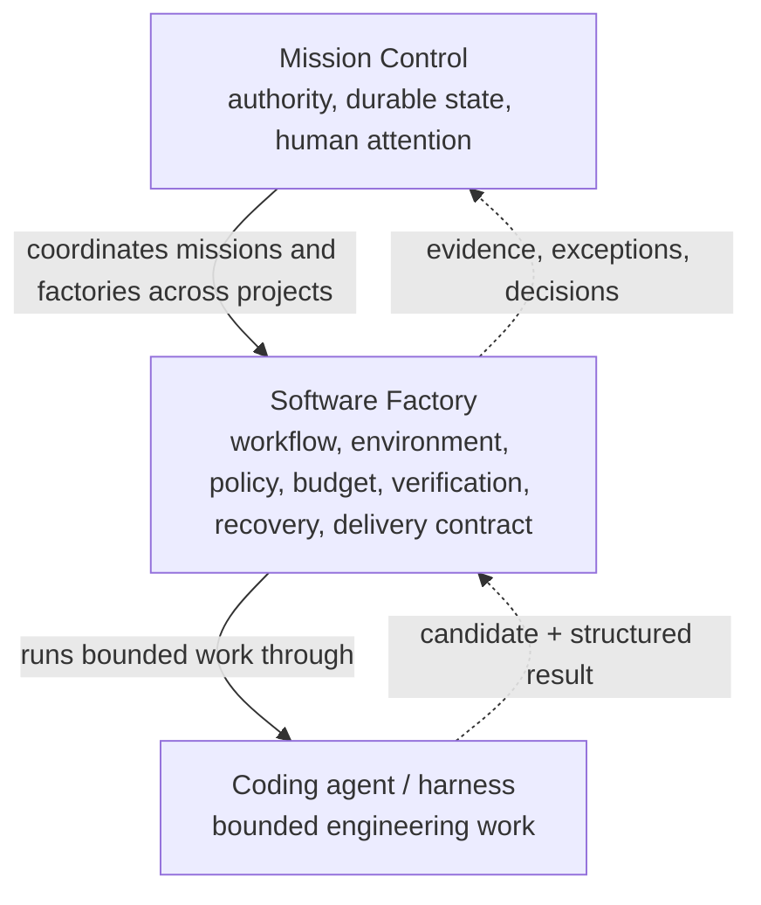
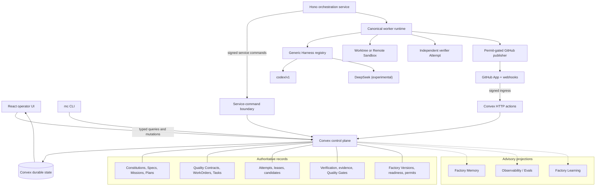
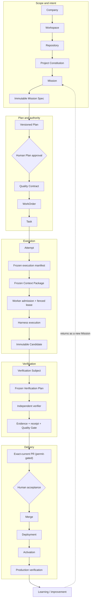
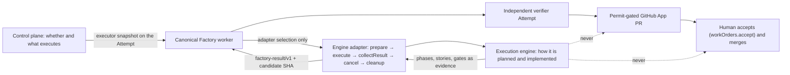

# 42. Mission Control as a living case study

The previous thirty-three chapters describe an AI Software Factory in the
abstract, with Mission Control appearing at the end of each as a short honesty
check. This chapter turns that around. It tells the story of one real control
plane: what it is made of, how a Mission travels through it, what its retained
evidence proves and refuses to prove, and why each of its architectural
decisions was made. After reading it you should be able to explain Mission
Control to a skeptical engineer in ten minutes, name the exact commit behind
every claim you make, and say without embarrassment which parts are proven,
which are partial, and which are still design.

The three appendix case studies remain the full reference: the
[implementation maturity and evidence map](../appendix/mission-control/01-implementation-maturity-and-evidence-map.md)
(assessed 2026-08-11 at `b31e275`), the
[verification-first case study](../appendix/mission-control/02-verification-first-software-factory.md)
(at `ff0524e`), and the
[capability, workflow, and admission map](../appendix/mission-control/03-capability-workflow-and-admission-map.md)
(at `d902fae`). This chapter condenses them into one narrative, adds the
Production Factory Pilot V3 evidence published at `b3dfcee`, and takes the
project's own public statement of what it is, what it has proven, and where
it stops from the README at `af414acf` (2026-08-31).

## The problem

Mission Control exists because an agent can generate code, run a test, and
confidently report success while still misunderstanding the request,
exceeding its authority, weakening the test system, or validating a different
artifact from the one it placed in a pull request. The problem is not only
model accuracy. Ordinary agentic coding collapses specification, execution,
verification, and acceptance into one actor and one conversation, and that
collapse makes four questions hard to answer from anything but the agent's own
narrative:

1. What exact outcome and constraints were authorized before implementation?
2. What exact source artifact was evaluated?
3. Which independent observations support each acceptance claim?
4. Which policy and which accountable human allowed the next material action?

The project began with a smaller, more personal version of that problem.
Adding a second and third coding agent to a working day did not add
throughput. It turned the human into the **scheduler**: the one person who
knew which agent held which branch, which plan it was following, what
permissions it had, what had passed, whether the code had changed since it
passed, what needed review, and what was consuming budget. All of that state
lived in one head, and the head was the bottleneck. The question that
followed was a control-plane design question rather than a model question:
what would the operating system look like if one person had to govern tens or
hundreds of autonomous workers without holding their state in memory?

> More agents without a control plane create more coordination, not
> necessarily more throughput. A chat interface scales conversations. A
> software factory scales governed work.

The [North Star](https://github.com/jaydubya818/MissionControl/blob/d902fae7032c0696b531c44ae88829c652516fc6/docs/product/mission-control-north-star.md)
states the intended answer as an operating model. Mission Control is to be the
operating system for **human-directed, agent-executed software development**:
during business hours developers define problems, outcomes, and acceptance
criteria, review and refine plans, weigh tradeoffs, review changes and test
results, approve merges, resolve ambiguity and escalations, and improve the
tools and guardrails; agents research the codebase, produce plans, write and
modify code and tests, run builds and scans, investigate failures, prepare
pull requests with evidence, respond to review, and keep working through the
day and overnight. A developer approves a plan before leaving; the next morning
there is a concise, evidence-based review package rather than a pile of logs.
The North Star's core principle is the sentence the whole product is built to
enforce: humans own intent, judgment, governance, and approval; agents own
execution, iteration, validation, and evidence collection. Mission Control must
never be a task launcher or a chat interface.

Everything below is the attempt to make that sentence true in code, and the
evidence of how far the attempt has gotten.

## How it works

### What Mission Control is, and is not

Mission Control is a personal software-factory control plane for governed
autonomous software delivery. The negatives are as important as the
positive. It is not a coding agent, not a chatbot, not a multi-agent chat
interface, not just a workflow engine, not just an evaluation framework, not
just CI/CD, and not a replacement for coding harnesses. It is the durable
authority, orchestration, verification, evidence, and lifecycle-control layer
that sits above all of those. Harnesses — Codex today, Claude Code, DeepSeek,
whatever comes next — remain replaceable execution backends behind one
contract.

> The harness executes. Mission Control governs. The coding agent is
> replaceable; the governed delivery contract isn't.

The README at `af414acf` sharpens the negatives into a list worth keeping,
because each item names a product that is easy to build by accident when the
goal is "manage many agents". Mission Control is deliberately not:

- an autonomous software executive;
- a general-purpose multi-agent chat application;
- a replacement for GitHub, CI, or code review;
- a model leaderboard that can bypass security eligibility;
- a test runner whose green result silently authorizes a merge;
- an agent-activity dashboard optimized for messages, tokens, or generated
  code;
- a self-modifying system that can promote its own policies or workflows; or
- a claim of production operation at hundred-agent or enterprise-fleet scale.

Read the list as a set of failure modes rather than a set of disclaimers. A
leaderboard that routes around eligibility, a test runner whose green
authorizes, and a dashboard that measures tokens are the three most common
ways a control plane quietly becomes something else. The purpose statement
the README pairs with the list is one sentence: turn approved software intent
into independently verified, review-ready pull requests without giving agents
authority to approve their own work.

### Three layers

<!-- infographic: three-layers -->
> **Infographic — Harness, factory, control plane.**



The system is easiest to hold as three layers, each with a different job. The
**coding agent or harness** performs bounded engineering work: read the
repository, change it, run what it is told to run, report. The **Software
Factory** is the production system around that work — workflow, execution
environment, policies, budgets, verification, recovery, and the delivery
contract — whose purpose is to produce trusted change repeatedly rather than
once. **Mission Control** is the control plane above the factory: it
coordinates Missions and factories across projects, preserves durable state
and authority, and routes the scarcest resource, human attention.

> The harness performs the work. The factory produces trusted change. Mission
> Control governs authority and attention.

### Who owns what

The responsibility model is a three-way split, and every later design choice
is an instance of it.

| Owner | Owns |
| --- | --- |
| Humans | Intent, Plan approval, consequential recommendations, acceptance, merge, release, risk decisions |
| Agents and harnesses | Planning support, investigation, code changes, bounded engineering work, Candidate production, structured handoff |
| Deterministic systems | Admission, scope, budgets, verification checks, digests and lineage, currentness, security boundaries, authority gates |

> Agents propose and execute. Deterministic systems validate and govern.
> Humans retain the decisions whose consequences require judgment or
> authority.

The three-way split is the principle. In the running system it resolves into
eight named actors, and the README at `af414acf` ("Who owns each decision")
states each one twice: what it owns, and what it cannot do on its own. The
second column is the useful one. A responsibility model that only lists
what each actor owns leaves the gaps to be filled by whoever is most
convenient, which in practice means the agent.

| Actor | Owns | Cannot independently do |
| --- | --- | --- |
| Human operator | Intent, Plan approval, risk decisions, acceptance, merge, release, and waivers within assigned authority | Bypass server-side policy or invent missing evidence |
| Planning agent | Repository research, implementation options, risk identification, and proposed Plans | Approve its own Plan or dispatch consequential work |
| Execution harness | Bounded code changes and structured result production inside one frozen Attempt | Expand scope, verify itself, publish, accept, merge, or deploy |
| Worker runtime | Admission, leasing, heartbeats, execution coordination, candidate collection, and recovery | Grant itself broader authority or accept output |
| Independent verifier | Execute the frozen Verification Plan against the exact candidate and produce evidence | Change the candidate, publish it, or accept the WorkOrder |
| GitHub App publisher | Publish an exact permitted candidate with a short-lived installation token | Verify, accept, merge, or deploy |
| Deterministic control plane | Identity, policy, budgets, digests, currentness, isolation, state transitions, and authority gates | Replace product judgment or silently waive a failed gate |
| Memory, observability, and learning systems | Advisory context, diagnostics, traces, scores, signals, and proposals | Gain execution, verification, acceptance, or promotion authority |

Notice that even the human row has a "cannot" entry. An operator can accept,
merge, and release, and cannot bypass server-side policy or conjure evidence
that was never produced. That is the sentence behind a line the README
insists on: human approval is not a decorative UI state; it is a
server-enforced authority boundary. Passing execution and passing
verification make a WorkOrder *eligible* for acceptance. They do not accept
it, and neither does a button in a browser — only the server-side mutation
that re-checks scope, approval, and currentness before writing.

### Seven operating principles

The README states the product's non-negotiable rules as seven principles.
Every chapter of this book has argued for them in general form; here they are
in Mission Control's own words, each with the one sentence that makes it
operational.

**Intent over activity.** The primary object is the desired outcome, never an
agent session, a chat message, a token count, or a generated task list.

**Exceptions over feeds.** Default operator surfaces put decisions, blockers,
failed or stale evidence, unsafe conditions, and aging work first; routine
activity stays available for inspection without competing for attention.

**Evidence over assertions.** A worker report or a `COMPLETED` status is not
proof; completion requires source-linked artifacts and independently produced
evidence against the approved acceptance criteria.

**Durable state over conversation.** Intent, plans, decisions, execution
state, events, artifacts, receipts, and approvals survive context limits,
process restarts, retries, model changes, and agent handoffs.

**Policy before autonomy.** Repository scope, identity, tools, secrets,
capabilities, risk, budgets, and recovery limits are resolved before execution
begins, and unknown or stale authority fails closed.

**Independent validation.** The actor that produced a material change cannot
be the sole authority that certifies it.

**One authoritative lifecycle.** Mission, Plan, WorkOrder, Task, Attempt,
evidence, pull request, acceptance, merge, deployment, and production
verification remain separate states, and no lower state silently completes
its parent.

The seventh is the one that holds the other six together. Most of the failures
in this book's Failure modes sections are a lower state completing its parent:
a completion report accepting a WorkOrder, a green check merging a PR, a merge
counting as production. Keeping the states separate is what gives the other
principles somewhere to attach.

### What Mission Control is made of

At the studied commits Mission Control is a TypeScript and pnpm monorepo with
three runtime pieces and two external boundaries. A **React** operator
application (Vite, Tailwind, shadcn/ui) provides the surfaces a human uses.
**Convex** owns authoritative durable state and every server-side transition;
there is no separate REST backend, and product data moves only through Convex
queries, mutations, actions, internal functions, and HTTP actions. A **Hono**
orchestration service hosts the execution side: the canonical worker runtime,
harness adapters, the sandbox runtime, the independent verifier, and the
GitHub App publisher. Below Hono sit the **executors** (the production-admitted
`codex/v1` adapter, an experimental DeepSeek harness, and a flag-gated
experimental adapter for a pluggable epic-delivery execution engine that is
not yet admitted), each running in an Attempt-scoped git **worktree** or a
remote sandbox. **GitHub** is the V1 git provider, reached only through a
least-privilege GitHub App with signed, deduplicated webhooks.

<!-- infographic: mission-control-architecture -->
> **Infographic — Mission Control architecture.**



The picture has a shape worth holding onto. Convex is the courthouse: the only
place a record becomes true. Hono is the workshop next door, where tools run
and things get built, but which cannot file a judgment. The three advisory
projections (memory, observability, learning) are the library: consulted
constantly, never allowed to sign anything. Everything that reaches the
courthouse from outside — a browser, a CLI, a webhook, the workshop — arrives
through a door that checks identity.

The repository's own documentation carries an explicit authority order:
product doctrine, then accepted decisions, then normative contracts, then
current implementation guides, then plans, then validation evidence, then
historical material. This chapter follows that order and uses code and
retained evidence to bound every present-tense claim.

### Five planes and a contract spine

Mission Control's documentation describes the factory as five cooperating
planes, each owning something and each forbidden from claiming something:

| Plane | Owns | Must not claim |
| --- | --- | --- |
| Builder experience | Intent capture, plan review, exception triage, evidence review, consequential decisions | Runtime or policy authority hidden in a client |
| Control plane | Identity, versions, policy, admission, lifecycle state, approvals, audit | That execution succeeded merely because it was dispatched |
| Execution plane | Harness, model calls, tools, sandbox, repository mutation, checkpoints, completion reports | Verification, publication, acceptance, or merge authority |
| Assurance and delivery | Independent evaluation, currentness, evidence, gates, publication, release, production verification | That telemetry or a worker assertion is proof |
| Learning plane | Outcome signals, failure clusters, datasets, experiments, improvement proposals | Silent mutation or promotion of active configuration |

Beneath the planes runs one **contract spine**, the chain of records that
makes intent, authority, execution, evidence, decision, delivery, outcome, and
learning independently attributable:

```text
Builder intent
  → Mission Spec revision
  → approved Plan version + Quality Contract projection
  → WorkOrder revision → Task
  → Factory Version + agent and skill bindings
  → frozen Execution Manifest
  → Attempt + Completion Report
  → immutable Candidate
  → independent Verification Run + Evidence
  → Quality Gate Decision
  → Publication Permit + Pull Request
  → Human acceptance
  → Release + Production Outcome
  → Learning Signal + governed Improvement Candidate
```

Names vary between products. The principle does not: no link in that chain is
allowed to write the next link's conclusion.

### The master chain

<!-- infographic: master-architecture-chain -->
> **Infographic — The master architecture chain.**



Read top to bottom, the chain is the whole product: Company → Workspace →
Repository → Project Constitution → Mission → immutable Mission Spec →
versioned Plan → human Plan approval → Quality Contract → governed WorkOrder
→ Task → Attempt → frozen execution manifest → frozen Context Package →
worker admission and fenced lease → harness execution → immutable Candidate →
Verification Subject → frozen Verification Plan → independent verifier →
evidence, receipt, and Quality Gate → exact-current pull request → human
acceptance → merge → deployment → activation → production verification →
learning. The property that holds the chain together is **negative
authority**: Plan approval does not dispatch; the harness does not verify;
verification does not publish; publication does not merge; merge does not
prove the production outcome. The North Star states the same ladder as work
attempted, completed, validated, approved, merged, deployed, and verified in
production — different states, never interchangeable.

The same chain can be said at two zoom levels, and it helps to have both.
Seen from the builder's chair it is the **Builder loop**: Intent → Plan →
Configure agents, harnesses, skills, and tools → Execute → Verify and
evaluate → Deliver → Observe → Improve. Seen from the control plane it is the
**governed delivery lifecycle**: Mission → approved Plan → WorkOrder → Task →
Attempt → candidate → independent evidence → pull request → human decision →
release → observed outcome → governed learning. The loop is what a person
experiences; the lifecycle is what the records enforce. The sentence that
joins them is the one to memorize:

> Each arrow is a gate, not an optimistic handoff.

The README lays the lifecycle out as eleven stages, and for each one states
what it does *not* authorize. That third column is the design, in the same
way the "cannot independently do" column was the design of the ownership
table. It is reproduced here because it is the most compact statement of
negative authority in the repository.

| Stage | What happens | What it does not authorize |
| --- | --- | --- |
| Define | A human records the desired outcome, business reason, constraints, scope, risks, stop condition, and acceptance criteria | Planning or execution |
| Specify | Immutable Mission Spec and Project Constitution revisions make requirements attributable and testable | Plan approval |
| Plan | An agent or operator proposes a versioned implementation plan, dependencies, WorkOrder blueprints, validation assertions, budget, and rollback approach | WorkOrder release or dispatch |
| Approve | An authorized human approves one exact Plan revision and its compiled Quality Contract | Agent execution |
| Release | Mission Control materializes governed WorkOrders idempotently from the approved Plan | Dispatch or acceptance |
| Preflight | Repository identity, code scope, Factory Version, executor capability, host health, policy, credentials, capacity, and budget are checked | Bypassing a failed or unknown readiness check |
| Execute | An admitted harness performs a bounded Attempt under a fenced lease in a local worktree or approved remote sandbox | Self-verification, publication, or acceptance |
| Recover | Failures are classified; immutable retries use a new Attempt; recovery is bounded by policy and budget | Repeating failed work indefinitely |
| Verify | A separate verifier evaluates the exact immutable candidate against a frozen Verification Plan and records criterion-level evidence | WorkOrder acceptance or merge |
| Publish | A candidate-bound permit and a short-lived GitHub App credential create or reconcile an exact-current pull request | Merge or release |
| Accept | An authorized human reviews the evidence package and accepts, rejects, or requests revision | Automatic merge or deployment |
| Learn | Accepted evidence may become advisory signals, experiments, and improvement proposals | Automatic policy, workflow, or repository mutation |

Two stages deserve a second look because they are the ones most factories
skip. **Preflight** is a fail-closed check of everything the manifest binds —
identity, scope, Factory Version, executor capability, host health, policy,
credentials, capacity, budget — before a lease is granted, and an unknown
readiness state is treated exactly like a failed one. **Recover** is a stage
with its own row rather than an exception path, because bounded, immutable
retry is part of the contract rather than something a worker improvises.

The rest of this section walks the chain one record at a time.

### Project Constitution

Company, workspace, and repository are the scope boundaries that server-side
authorization resolves before anything else happens. Inside a repository, the
**Project Constitution** is the first record with content: durable
architecture principles, governance expectations, repository rules, quality
expectations, and constraints that agents may not reinterpret. It exists
before any planner or agent reasons, which is the point. A rule that lives
only in a system prompt or in what a model happens to remember is a rule that
can be forgotten, argued with, or overwritten by something the agent reads.

> Intent and policy exist before intelligence is applied. Important system
> rules should not depend on model memory.

### Mission

A **Mission** is the desired outcome and its governed scope — "eliminate
this deprecated API safely", not "run agent X on this repository". The
distinction decides what is durable. Agents come and go, harness adapters get
swapped, a run fails and is retried; the Mission is the thing that persists
through all of that, and it is the record everything downstream cites.

### Mission Spec and its quality checks

With the default-off spec intake flag enabled, an immutable **Mission Spec**
revision turns the Mission into identifiable requirements with stable IDs,
measurable outcomes, explicit non-goals, structured clarifications,
acceptance expectations, and repository scope. Before planning is allowed,
a deterministic evaluator asks the questions a good analyst would: Are the
requirements individually identifiable? Are the outcomes measurable? Do any
requirements contradict each other? Are there unresolved clarifications? Is
the scope explicit? Is acceptance testable? `FINALIZED` means planning-ready
and nothing more. An agent may help the human sharpen the Spec; what it
cannot do is quietly change it while implementing.

> An agent can help clarify intent. It cannot silently redefine intent.

### Planner versus Plan, and what approval means

Agents or people propose a versioned **Plan**. The planner is a replaceable
component; the Plan is a governed record. A Plan binds the exact Mission Spec
and Constitution digests, decomposes requirements into WorkOrder blueprints,
and captures dependencies, risk, cost, rollback expectations, and
independent-verification requirements. Traceability runs the length of it:
Spec requirement → Plan assertion → WorkOrder blueprint → acceptance criterion
→ verification check and evidence expectation, so that any later piece of
evidence can be walked back to the requirement it serves.

A human approves one exact Plan revision. If intent changes, a new revision
is created and approved; a Plan is never mutated in place. And approval has a
precise meaning: it authorizes the release of governed WorkOrders. It does
not dispatch execution. That separation is what lets recommendation be
cheap and authority be deliberate.

> The Planner is replaceable. The Plan is governed. Intelligence can
> recommend; authority is granted separately.

### Quality Contract

The **Quality Contract** is the machine-readable projection of the approved
Plan: requirements, assertions, invariants, negative constraints, assurance
expectations, evidence requirements, approval policy, a three-boundary
**Change Budget** (files, change size, protected paths and permitted change
types), and a verification contract. Its job is to freeze how success will be
determined before any execution starts. Quality is not something the factory
infers after looking at what the agent produced; it is part of the contract
the agent executes against.

> Quality isn't inferred after generation. It's part of the execution
> contract.

### WorkOrder

A **WorkOrder** is the governed delivery contract for one bounded piece of
work: objective, repository and scope, acceptance criteria, risk, budget,
rollback expectation, verification requirement, and approval policy. It is
the unit of governance. "An agent run" is not — a run is an implementation
detail that can be retried, replaced, or moved between harnesses, and none of
that changes what was ordered or how it will be judged.

### Task versus Attempt

Each WorkOrder decomposes into **Tasks**, the bounded operational units, and
each Task is executed through **Attempts**. An Attempt is one immutable
execution try against an exact tuple: the WorkOrder revision, the Factory
Version, the worker lease, the execution manifest, and the frozen Context
Package. Attempts are preserved independently. A retry is a new Attempt with
its own record; nothing rewrites the history of the one that failed. This is
the same distinction as a flight and a flight number: the number is the Task,
each departure is an Attempt, and a cancelled departure stays in the log.

### Factory Version

A **Factory Version** is a reproducible execution configuration: runtime
configuration, model configuration, tools, policies, data classification,
verification configuration, and execution constraints, identified by an exact
digest. Every Attempt binds one. Its purpose is reconstruction after the
fact — when something fails, the first question is what actually ran, and
that question has to have a deterministic answer.

> If I can't reconstruct what ran, I can't reliably explain what failed.

### Frozen execution manifest

Before a Task runs, the control plane freezes an **execution manifest**
binding the active Factory Version and its digest, repository and revision,
code scopes, host, harness manifest and capability set, executor, governance
policy, execution environment and backend, branch, allowed tools, WorkOrder
revision, Quality Contract, optional Context Package, model route, budget,
data classification, verifier, and base SHA. Frozen means it never mutates
underneath the worker: a policy change or a route promotion made during the
run applies to the next Attempt, not this one. Saving the prompt reproduces
nothing; freezing the environment does.

> Reproducibility requires freezing the execution environment, not saving
> the prompt.

### Factory Memory versus Context Package

**Factory Memory** is advisory retrieval: prior outcomes, patterns, and
knowledge the platform can offer. What an Attempt actually receives is a
minimal, frozen, attributable **Context Package** — the specific items
selected for this execution, recorded so that later analysis can say which
context was present. The rule that separates the two is that retrieved
context cannot change the approved Mission or Plan. Memory is a library the
worker may consult, not a second author of the contract.

> Context should inform execution, not rewrite the contract.

### Durable workers and fenced leases

Server-authoritative worker admission checks identity, session, worker
generation, capabilities, capacity, Factory Version, and execution backend
before granting a **fenced lease**. Ownership of an Attempt is explicit and
visible in durable state. That gives two guarantees a fleet needs. A worker
that dies leaves work that can be recovered from durable state by another
worker. A stale worker that wakes up after ownership has transferred cannot
keep mutating, because its fence no longer matches and every hardened write
rechecks the tuple.

> Model intelligence does not remove the need for distributed-systems
> correctness.

### Idempotency

Every externally visible logical operation — a push, a PR creation, a comment
— gets a durable identity that belongs to the operation, not to the Attempt
that first tried it. Before a retry repeats a side effect, the platform checks
whether it already happened and, if so, adopts the existing result. Chapter
[14](../03-build/14-durable-execution.md) covers the general mechanism; the
Mission Control version is compact:

> Retry the intent, not the side effect. Attempt identity may change.
> Logical-operation identity should not.

### Bounded execution and data classification

An Attempt runs bound to an exact repository, code scope, capability set,
policy, budget, and execution manifest, and to a **data classification** —
`PUBLIC`, `INTERNAL`, `CONFIDENTIAL`, or `RESTRICTED` — frozen into the
contract, so that model route, tools, and backend can be admitted or refused
against it. Enforcement is server-side authorization, capability admission,
sandboxing, auditable authority, and fail-closed gates. None of it is
enforced by asking the model to behave.

> A model can reason about authority. It should never grant itself
> authority.

### Harness completion is not delivery

The harness runs in an Attempt-owned worktree or a remote sandbox and returns
a candidate plus a normalized, untrusted structured result. When the harness
reports that it has finished, Mission Control records an event. It does not
record a success.

> The agent saying "I'm done" is an event, not evidence.

### Immutable Candidate

A **Candidate** is exactly what execution produced: a committed source
subject with a SHA and a lineage back to its Attempt. It is not correct, not
verified, and not accepted; those are separate states with separate evidence.
Treating the Candidate as immutable is what makes everything after it
meaningful, because every check is a check of this SHA and no other.

> A Candidate is an output, not a success declaration.

### Independent verification

The verification flow is its own small chain. The Candidate is bound into a
**Verification Subject**; a **Verification Plan** is frozen from the Quality
Contract; a separate verifier Attempt — logically independent of the worker
that produced the change — executes the checks and records typed evidence
envelopes and criterion receipts against that exact SHA; a **Quality Gate
Decision** applies the versioned policy to the complete evidence set. Evidence
maps to the original acceptance criteria. Because the agent cannot change the
Candidate and inherit the old evidence, verification attaches to the artifact
rather than to anyone's confidence in it.

> Verification belongs to the artifact, not the agent's confidence.
> Independence is part of the trust model.

### Evidence versus claims

"Tests passed" written in a completion message is a claim. The test system's
recorded result, tied to the exact Candidate and produced by an Attempt the
worker did not control, is evidence. The whole assurance design comes down
to insisting on the second and refusing to promote the first.

> Evidence should come from the system performing the check, not from the
> system being checked.

### Currentness

Commit A was verified. Someone pushes commit B to the branch. The evidence
for A is now history, not proof. Mission Control binds Candidate,
Verification Subject, evidence, checks, and PR head together and recomputes
**exact-currentness** at every gate; a moved head preserves the old evidence
and blocks progress until a new lineage passes. A candidate-bound, expiring
**Publication Permit** gates the GitHub App push and pull request so that the
SHA published is the SHA checked.

> Passing verification on commit A doesn't authorize merge of commit B.
> Verified once does not mean verified forever.

### Acceptance versus verification

Verification asks whether the artifact satisfied the machine-checkable
contract. Acceptance asks whether we are authorizing progression — a human
decision, executed through `workOrders.accept`, the single canonical
acceptance mutation, by an authorized person. A verified Candidate can still
be declined, and nothing accepted can skip verification.

> Correctness and authority are separate concerns.

### The state machine, before and after merge

Every transition in the chain needs its own evidence and its own authority.
After acceptance the ladder continues: merge → deployment → activation →
production verification, each a distinct stage with its own record, none
implied by the one before it. Code complete is not factory complete.

The README writes the same rule as a chain of inequalities, and its version
has one more link than the short form used elsewhere in this book, because
it separates passing verification from being *exact-current* and eligible at
the gate:

```text
execution completed ≠ verification passed
verification passed ≠ exact-current gate eligible
gate eligible ≠ WorkOrder accepted
WorkOrder accepted ≠ pull request merged
pull request merged ≠ production verified
```

The extra link matters. Evidence can be complete and correct and still be
evidence for a SHA that is no longer the head of the branch; "verification
passed" is a fact about the past, and "gate eligible" is a fact about now.
The full six-term line is the one to carry:

> Execution completed ≠ verification passed ≠ gate eligible ≠ WorkOrder
> accepted ≠ PR merged ≠ production verified.

### The assurance records and what each does not prove

The verification-first design adds assurance records without replacing the
delivery hierarchy. The discipline is to know, for each record, what it does
not prove.

| Record | Responsibility | What it does not prove |
| --- | --- | --- |
| Quality Contract | Requirements, constraints, verification methods, gates, approvals, fixed before execution | That implementation succeeded |
| Change Budget | Bounds on files, change size, protected paths, permitted change types | That an in-budget change is correct |
| Attempt | One immutable execution try and its authority | That the result is acceptable |
| Candidate | The exact committed source subject | That checks passed |
| Verification Run | Execution of defined checks against an exact subject | That the WorkOrder may advance |
| Evidence Envelope | A typed claim bound to producer, method, time, artifact, and subject | That the claim is sufficient or authoritative |
| Quality Gate Decision | Versioned policy applied to contract plus evidence set | Permission for any future side effect |
| Publication Permit | One scoped, expiring external action | Merge, deployment, or Mission acceptance |
| Proof Package | Projection of the trace for human review and audit | A second source of truth |

The durable insight is the separation of observation from decision. A test
result, scan, or reviewer finding is evidence. Policy evaluates the complete
evidence set against the active contract. Approval accepts a specific risk or
grants a specific action. None substitutes for the others, and missing
evidence is an explicit negative state rather than an empty field that reads
as success.

### Production execution admission

A second workflow, less visible than the Mission flow but just as important,
decides whether execution is allowed at all. **Admission is a chain, not a
boolean.** The operator sequence recorded in the production admission packet
runs: canonical GitHub App installation → current structured workflow
registration → exact model-route registration → human, evidence-based route
promotion → immutable hardened Sandbox Profile creation → human profile
promotion → code scopes, agents, policy, and verifiers → exact Factory Version
creation → exact worker and Factory Version attestation → readiness
assessment and activation → human-selected local then remote canary →
independent verification → controlled publication canary.

Registration never counts as qualification. Promotion grants execution-only
eligibility, not routing, verification, publication, acceptance, merge, or
deployment authority. Worker admission compares exact repository, Factory
Version, configuration digest, harness manifest, effective configuration,
model route, backend, and Sandbox Profile identity. Cost or historical quality
may rank eligible candidates; it can never compensate for a failed hard
constraint. An exact model route matters because a provider and model name
alone do not describe the executable, adapter configuration, sandbox, or
effective capabilities that produced an artifact.

### Pluggable execution engines

The `codex/v1` adapter is a single-session coding harness. The Generic
Harness Contract was written so that something larger could be composed the
same way: an epic-delivery execution engine that plans, splits an epic into
stories, runs its own gates, and reports phases. Mission Control's design for
composing such an engine as a harness adapter is worth describing as
implemented in contract, because it is the sharpest statement in the
repository of what a control plane keeps and what it hands over. The engine
is unnamed here; the contract is what matters.

<!-- infographic: pluggable-execution-engine -->
> **Infographic — Composing an execution engine as a harness adapter.**



**The authority split.** The control plane decides whether and what
executes. The engine decides how it is planned and implemented. The control
plane independently verifies, publishes the pull request through its own
GitHub App, and accepts through `workOrders.accept`, the only acceptance
command; a human merges on GitHub. The engine never creates the PR and its
workers never push (their allowed remotes are empty). Engine-produced gates
are evidence: a failed engine gate makes the Attempt `failed` and the
WorkOrder BLOCKED, never DONE, and engine "done" without a candidate SHA is
BLOCKED as well. A completed engine run is not an accepted WorkOrder.

**The executor snapshot.** Dispatch copies the complete executor
configuration (adapter, version, planning backend, worker backend,
configuration version) onto the Attempt. The Attempt never re-resolves
repository policy files or the live Factory Version; editing, superseding, or
deleting the Factory Version never changes a historical Attempt; retry is a
new Attempt with a new engine identity. Backend selection is frozen on the
Factory Version as a pair; authentication is the operator's existing local
CLI login rather than API keys held by the factory; runtime configuration
reaches the engine as environment overrides that win over committed
repository policy, which is never mutated per Attempt.

**Admission.** Admission is maturity plus required external controls minus
prohibited authorities. The adapter is prohibited from holding worker leases,
verification subjects, verification plans, evidence authority, GitHub
publication, and acceptance. The canonical worker lease, sandbox policy,
repository-scope reconciliation, independent verification, and the
publication permit must exist outside it. The Factory Attempt worker selects
the adapter and runs those controls itself; there is no engine-specific
worker path. Engine status is polled and mapped onto the canonical run events
under the idempotency key `{workOrderId}:{runId}:{engineId}:{eventType}:{sequence}`;
engine phases map to WorkOrder tendencies, never transitions; stories live in
engine-owned nested worktrees beneath the epic worktree the Attempt records.
Cancellation runs control plane → adapter cancel → engine stop, and wins until
terminal success is durably reported. CI exercises the adapter against a
deterministic fake engine that returns a fixed epic id, status JSON, and
candidate SHA; live engine runs are operator evidence, never a CI gate. The
engine's unattended mode is not admitted: the posture is manual
approve-then-run with control-plane-attested approval.

**Learning writeback.** After a terminal successful engine run, the worker
reads the engine's own lessons store read-only. Matching rows become additive
learning candidates on the Attempt and WorkOrder, emitted as idempotent
`EVIDENCE_CREATED` events of type `learning.candidate.proposed`. They are
telemetry: they cannot accept and cannot satisfy verification receipts. A
missing store yields no candidates.

The whole design reduces to one line that the general chapters state in the
abstract and this adapter makes concrete: the engine is trusted with *how*,
and with nothing that decides *whether*.

### Security model

The security model follows the responsibility split rather than adding a
layer on top of it. Every boundary is enforced outside the model: scope is
resolved server-side from company, workspace, and repository; capability
admission decides which harness, route, backend, and Sandbox Profile may run;
each Attempt executes in an isolated worktree or sandbox with a protected
ownership manifest outside the agent-writable tree; the data classification
frozen into the manifest limits what the run may touch; publication requires
a scoped, expiring permit; every external request arrives through a door
that checks identity (signed webhooks, the HMAC service-command boundary,
authenticated clients that cannot claim `SYSTEM` or `AGENT` authority); and
every gate fails closed. The verification-plane threat model names the
attacks this must survive — candidate substitution, evidence replay, test
weakening, cross-tenant evidence — and the Failure modes section below shows
how each is prevented and detected. Nothing an agent reads, including
retrieved memory, can widen its permissions.

The README's "Security model" section starts from a single assumption that
the rest follows from: repository content, external text, memory, tool
output, model output, and worker result payloads are all **untrusted data**.
Not "untrusted unless it looks fine" — untrusted as a category, the way a web
server treats a request body. From that assumption it names twelve core
boundaries:

1. server-side human and service identity resolution;
2. company, workspace, repository, environment, and code-scope authorization;
3. named capabilities and default-deny admission;
4. separate human and service command surfaces;
5. HMAC-verified webhook and service-command ingress;
6. idempotency, replay protection, and durable audit records;
7. short-lived GitHub and inference credentials;
8. secrets excluded from browser configuration, events, artifacts, and logs;
9. repository classification and risk-proportional execution policy;
10. immutable candidates and exact-subject independent verification;
11. candidate-bound publication permits; and
12. bounded retries, budgets, cancellation, pause, and kill controls, under
    human acceptance, merge, release, and risk authority.

Three of these are easy to underestimate. Just-in-time GitHub App
**installation tokens** are minted for one publication and never persisted in
delivery records, so a leaked evidence package does not leak a credential.
Webhooks are signed and replay-protected, and when a delivery cannot be
matched to a WorkOrder and Attempt, the evidence is shown as *uncorrelated*
rather than attached to a guessed lineage. And **portable repository
identity** is separate from any developer's local checkout, so scope,
policy, and lineage attach to the repository the organization owns rather than
to the path on someone's laptop. Remote execution is not considered generally
certified: sensitive remote work fails closed unless the exact Factory and
sandbox profile satisfy the classification, isolation, credential, egress,
runtime, cleanup, and evidence requirements.

### Failure and recovery

When something goes wrong the workflow is: detect → classify as policy,
capability, environment, provider, execution, or result failure → contain
authority and preserve events → retry only a permitted class within Attempt
and wall-clock budgets → create an attributable new Attempt, or reconcile an
ambiguous external effect → quarantine, drain, kill, or escalate when safe
continuation is unavailable → independently re-evaluate the new exact
candidate. The workflow contract rejects heuristic `STATUS: done` completion
and requires structured status for non-gate steps. Historical runs are
projected read-only as current, legacy-but-valid, malformed, incomplete,
stale-schema, or invalid; compatibility logic never rewrites history or
invents a terminal outcome. Unknown or expired execution ownership becomes
`LOST`, preserves the workspace, and requires a new Attempt; cleanup is
non-forced and fails closed to `PRESERVED` on any ambiguity.

### Command Center: exception-first

The operator surface is built on one observation: the scarce resource in a
factory is not agents, it is human attention. So the **Command Center** does
not list everything that is running. It surfaces exceptions: what is blocked,
what failed verification, what exceeded its budget, what drifted from the
approved Plan, whose evidence has gone stale, what is ready for acceptance,
and which consequential decision is waiting on a person. A healthy Attempt
making progress is not news, and a view that shows it as news trains the
operator to stop looking.

> The scarce resource isn't agents. It's human attention.

The README's "Operator experience" section describes the person this is for
as a developer becoming an operator of multiple concurrent delivery streams,
and defines the default experience by the questions it must answer rather than
by the screens it has:

1. What outcome matters most right now?
2. Which work is blocked, and what exact decision will unblock it?
3. Which worker may change which repository and code scope?
4. What changed relative to the approved Plan?
5. Which acceptance criteria passed, failed, became stale, or were waived?
6. How much execution, retry, time, and cost budget remains?
7. Can the work be paused, cancelled, retried, or recovered safely?
8. What is actually ready for review, acceptance, merge, or release?

These are a good acceptance test for any operator surface. If a screen cannot
answer one of them from durable records, it is either decorative or it is
asking the human to reconstruct state from logs. The Command Center ranks
attention by risk, urgency, age, and evidence state; WorkOrders show scope,
risk, assignment, approval, execution, verification, and the next valid
action; the audit surface retains approvals, denials, lifecycle changes,
deployment events, and policy decisions so the work stays explainable after
the fact. The primary V1 routes map onto those jobs:

| Route | Operator job |
| --- | --- |
| `/v2/command-center` | Triage decisions, blockers, risk, and delivery attention |
| `/v2/missions` | Define outcomes and manage Mission planning |
| `/v2/mission-detail` | Inspect Plan, WorkOrders, execution, evidence, and acceptance |
| `/v2/factory` | Select a governed recipe and inspect recent Factory execution |
| `/v2/control-work-orders` | Govern, dispatch, verify, and accept WorkOrders |
| `/v2/tasks` | Inspect operational Tasks and Attempts |
| `/v2/projects` | Configure workspaces, repositories, code scopes, GitHub App readiness, and Factory versions |
| `/v2/trace-inspector` | Inspect execution trees, timelines, observations, evals, and datasets |
| `/v2/memory` | Inspect provenance-backed Memory, graph data, and Context Packages |
| `/v2/audit` | Review decisions, denials, policy outcomes, and lifecycle history |

One rule about the routes carries beyond this product. Preview and Demo
routes are explicitly labeled and can be hidden, because a component does not
become a production feature merely by existing in the codebase. The same
honesty that governs evidence governs the navigation. A `mc` command-line
client reaches the same Convex functions as the browser, which is the
authorized-action parity described below applied to the CLI.

### The operator surfaces

Mission Control's eleven operator-facing surfaces and the boundary each one refuses to cross now live in the [operator-surface catalog](../appendix/operator-surfaces.md):

- [Command Center](../appendix/operator-surfaces.md#command-center)
- [Factory Board](../appendix/operator-surfaces.md#factory-board)
- [Work Orders queue](../appendix/operator-surfaces.md#work-orders-queue)
- [Tasks board](../appendix/operator-surfaces.md#tasks-board)
- [Execution Run Inspector](../appendix/operator-surfaces.md#execution-run-inspector)
- [Factory Overview](../appendix/operator-surfaces.md#factory-overview)
- [Factory Health](../appendix/operator-surfaces.md#factory-health)
- [Knowledge → Memory](../appendix/operator-surfaces.md#knowledge-memory)
- [Registry](../appendix/operator-surfaces.md#registry)
- [Harness engineering](../appendix/operator-surfaces.md#harness-engineering)
- [Labs](../appendix/operator-surfaces.md#labs)

The surfaces share one authorization model and one record spine; none creates a parallel lifecycle or grants authority through presentation.

### The V1 program constraints

The V1 program is bounded by a written constraint set, ASF-001 through
ASF-008, and the constraints explain several decisions that would otherwise
look like missing features. The set includes: **GitHub only** as the git
provider, reached through the least-privilege App; **one production
executor**, the `codex/v1` adapter, with everything else experimental and
flag-gated; **human merge only**, so that V1 ends at an evidence-backed,
review-ready pull request and no band auto-merges; **sandboxed RED work**,
so that security-sensitive, destructive, or irreversible WorkOrders run in a
restricted sandbox rather than merely under extra review; and **tiered
evidence retention**, so that receipts, artifacts, and packages are kept by
classification and risk rather than forever or not at all. Read the set as
the shape of the pilot: it is what makes "qualified delivery kernel" a
bounded claim rather than a marketing one.

### Observability and evals are diagnostic, not authority

Traces, telemetry, eval scores, routing advisories, and Factory Memory are
projections. They explain what happened and suggest what might be improved;
they never accept a WorkOrder, publish a Candidate, or promote a
configuration. An eval score never becomes a verification receipt, and
unavailable telemetry is recorded as `null` rather than as zero. The reason
is that a metric that can accept work becomes, quietly and without a
decision, a source of authority, and it will be gamed or misread the moment
it matters.

> Metrics can inform authority. They should not quietly become authority.

### Learning and the recursive loop

Learning follows the same discipline described in
[Chapter 40](./40-governed-learning.md): Attempt,
verification, review, and production observations become deterministic
Learning Signals, then bounded recurring-pattern clusters, then a
human-reviewable Improvement Candidate, a frozen baseline-versus-candidate
experiment, a reviewed result, and a recommendation — a better skill, route,
prompt, verifier, workflow, or policy — which returns to the factory as a
submitted Mission Plan and a separate human Plan approval before the
ordinary WorkOrder lifecycle. Learning can be autonomous; promotion is
governed. The learning subsystem cannot accept, publish, merge, change an
active Factory Version, or grant itself authority.

The loop, seen from the human side, is recursive: Research → Verify →
Recommend → Approve → Implement → Validate → Measure → Iterate. Each
improvement is delivered by the same chain that delivers product change,
which is why the factory can improve itself without ever having authority
over itself.

> Autonomous discovery, not autonomous authority.

### Authorized action parity

Mission Control also keeps slice-level maps between UI actions, Convex
capabilities, and shared state, and treats them as a reusable discipline:
inventory each meaningful builder action and the state it changes; map it to
an authenticated API or tool outcome, or mark it human-only; require UI and
agent paths to use the same authoritative transition; apply the same policy,
scope, idempotency, and audit rules; surface the result immediately to the
operator; and test the resulting state, not the tool call. Parity concerns
outcomes, not buttons, and it does not mean an agent inherits every human
permission. A shadow agent API that bypasses the UI's controls is not parity;
it is a second control plane. Identity bootstrap, approval of consequential
authority, risk acceptance, and merge remain human-only, and marking them so is
clearer than leaving an accidental gap.

### Mission Control, the Agent Factory, and the Software Factory

Three names that are easy to confuse describe three different things. An
**Agent Factory** creates and manages reusable intelligence: agent
definitions, skills, tools, model configurations, and their evaluation
suites, with versioning, ownership, and deprecation. A **Software Factory**
is where that intelligence becomes trusted production software — the
workflow, environment, verification, and delivery contract described above.
**Mission Control** is the control plane that governs the delivery: it owns
the Mission, the Plan, the WorkOrders, execution authority, verification,
evidence, acceptance, and delivery. An Agent Factory can plug into Mission
Control as a capability source, and in Mission Control's current shape the
agent, skill, and route registries play that role. The generic five-system
form — runtime executes, knowledge grounds, Agent Factory creates, Software
Factory delivers, Mission Control governs — is in
[Chapter 13](../03-build/13-control-plane-orchestrator-and-execution-plane.md).

> The Agent Factory creates reusable intelligence. Mission Control governs
> how that intelligence becomes production work.

### The central thesis, and the six questions

Mission Control is not trying to make agents maximally autonomous. It is
trying to make increased autonomy operationally trustworthy, and the way it
does that is by insisting that the surrounding system can always answer six
questions from records rather than from anyone's recollection:

1. What was authorized?
2. What actually ran?
3. What changed?
4. What proved it correct?
5. Is that evidence still current?
6. Who has the authority to move it forward?

Every record in the master chain exists to answer one of those. When you
cannot answer one from a record, you have found either a gap in the factory
or a place where a model is being trusted with something that should be
deterministic.

> When autonomy increases, the surrounding system has to become more
> explicit about authority and evidence, not less.

## How to build it

### The stack

The choices are ordinary and deliberately so. TypeScript and Node throughout;
Convex for durable state and every server-side transition; REST where an
external boundary needs it; Git and GitHub through a least-privilege App;
per-Attempt worktrees; Docker and sandboxed execution with process isolation;
harness contracts for Codex, Claude, and Claude Code; leases, idempotency,
capability admission, recovery, and model routing in the control plane; and
evals, observability, tracing, provenance, currentness, and deterministic
gates in the assurance plane. Nothing on that list is exotic, which is the
point: the difficulty of a factory is in the contracts between the pieces,
not in the pieces.

The README's repository map shows how the pieces are cut, and the cut follows
the responsibility model rather than the technology:

| Path | Owns |
| --- | --- |
| `apps/mission-control-ui/` | React operator application and the EOS V2 shell |
| `apps/orchestration-server/` | Hono ingress, signed service commands, the canonical Factory worker, harness adapters, sandbox runtime, verifier, and GitHub publisher |
| `apps/workflow-executor/` | Standalone executor for versioned workflow graphs |
| `convex/` | Authoritative schema, lifecycle commands, policy, GitHub ingress, evidence, schedules, and projections |
| `packages/workflow-engine/` | Workflow graph, Generic Harness, Verification Subject and Plan, independence, and currentness contracts |
| `packages/policy-engine/` | Risk and policy evaluation primitives |
| `packages/agent-runtime/` | Agent lifecycle and heartbeat behavior |
| `packages/memory/` | Provider-neutral Memory ingestion, retrieval, graph, Context Package, and eval algorithms |
| `packages/context-router/`, `packages/context-tools/` | Context selection, routing, manifests, and activation |
| `packages/model-router/` | Model and executable Factory tuple routing |
| `workflows/` | Versioned YAML workflow definitions |
| `skills/` | Agent integration skills |
| `scripts/mc` | The `mc` CLI |
| `tests/e2e/` | Browser-operated critical paths and accessibility checks |
| `docs/testing/evidence/` | Revision-specific qualification and browser evidence |

The `convex/` row is the whole architecture in one line: schema, lifecycle
commands, policy, ingress, evidence, and projections all live in the one
place that can make a record true. Everything under `apps/` is a client of it
or a worker for it.

### Versioned workflows and the runtime contract

Two small rules in the README's "Development and verification" section are
the kind that only look small. The first concerns workflows. Seven versioned
YAML workflows live in `workflows/` — `bug-fix`, `code-review`,
`continuous-research`, `feature-dev`, `loop-engineering`, `quality-audit`,
and `security-audit` — and a workflow definition is **snapshotted onto the
run** that uses it. Editing a workflow later never rewrites the execution
contract of a historical Attempt. Without that rule, "what did this Attempt
actually run?" has an answer that changes every time someone improves the
workflow, and the frozen execution manifest is frozen in name only.

The second concerns the boundary between clients and the backend. The public
client/backend **runtime contract** is a single versioned number (v34 at
`af414acf`, v30 at `b3dfcee`), guarded by a test, and it changes only when
deployed clients and backend functions can no longer safely interoperate. Not
on every schema change, not on every new field — only on incompatibility. The
discipline is the same as an API version: bump it rarely, and when you do,
make it impossible to miss.

A third rule is operational rather than architectural, and it is printed as a
warning. The canonical `codex/v1` Factory worker is disabled by default, and
the README says not to enable it until the target repository, GitHub App
installation, Factory Version, worker identity, code scope, policy, host, and
verification readiness are all current and verified. The orchestration
process holds server-only credentials — the service auth token, service-command
secrets, GitHub App private keys, installation tokens, provider-management and
sandbox credentials — and none of them may ever appear in a browser-facing
`VITE_*` variable. A factory whose production worker starts on by default has
made the unsafe path the fast one.

### The key decisions and why

Mission Control's shape is the sum of a dozen decisions. Each has a reason, and
the reason is the part worth carrying to your own factory.

**Why Convex owns state.** A control plane needs transactional server
functions, reactive queries the UI can subscribe to, scheduling, and HTTP
ingress in one place, so that a lifecycle transition and the record it
changes are atomic and the browser sees the truth without polling. Putting
authority anywhere else invites a second source of truth. The cost is a
critical dependency and some latency; the mitigation is durable local
checkpoints and reconciliation in the execution plane, which let a worker
survive control-plane ambiguity without inventing authoritative state.

**Why Hono hosts orchestration.** Long-running processes, provider SDKs,
worktrees, and harness subprocesses do not belong inside short transactional
functions. Hono is a small, web-standard service that can hold that plumbing
and speak to Convex through a signed **service-command boundary**: a
replay-resistant HMAC envelope with service identity, named capability, scope,
command ID, issue and expiry time, and payload digest, with Convex retaining
accepted, denied, failed, succeeded, and replayed receipts. Hono does not own
a competing lifecycle.

**Why transitions are server-owned.** The browser never decides which
company, workspace, repository, or record a person may act on, and public
clients cannot claim `SYSTEM` or `AGENT` authority. Every consequential
transition, including `workOrders.accept`, is one server mutation that
re-checks scope, approvals, and (for policy-v2 work) exact-current
verification before writing. One acceptance authority, no duplicate control
planes.

**Why worktrees.** Each Attempt mutates an isolated, Attempt-owned checkout
with a protected ownership manifest recorded outside the agent-writable tree.
That gives file-scope enforcement, one active mutating Attempt per repository
across Missions, safe reconciliation after a process restart, and a clean tree
to materialize a sandbox patch into. Repository state is always recomputed
outside the harness.

**Why Attempts are immutable.** A retry is a new historical fact, not a
correction of the old story. New Attempt, new Verification Run, old evidence
preserved. This is what makes idempotent dispatch, duplicate-PR prevention, and
honest retry history possible; PR #62's cancellation, two failed retries, and
successful fourth Attempt exist as a readable record because nothing was
overwritten.

**Why verification is independent.** The worker that created a material
change cannot be its only validator. A separate verifier Attempt, a frozen
Verification Plan, and candidate identity as the join key connect
implementation, evidence, approval, and publication so that a green suite for
the wrong SHA proves nothing.

**Why policy rather than role checks.** A role says who someone is; a policy
says what this change, at this risk class, in this repository, with this
evidence, may do next. Risk classes, policy envelopes, approval records,
separation of duties, and publication permits let low-risk work use fewer
checks without ever publishing a different SHA from the one checked.

**Why event-driven.** Ordered Attempt and WorkOrder events, signed and
deduplicated webhook deliveries, and idempotent commands are what let the
system tolerate timeouts, retries, duplicate events, stale leases, and
ambiguous external results. Events are also what the run inspector and audit
surfaces replay from.

**Why lineage everywhere.** Every record carries the digests of what it was
derived from: Plan binds Spec and Constitution; manifest binds Factory Version;
candidate binds Attempt; evidence binds candidate; permit binds candidate,
Attempt, lease, and approval checkpoint. Lineage is what turns "who authorized
this and why did it ship" from archaeology into a query.

**Why the Quality Contract is a projection.** The verification-first ADRs
weighed a separate Quality Contract aggregate (clear ownership and reuse, but
parallel truth) against a versioned projection of the approved Plan
(preserves the hierarchy, needs disciplined versioning). At `b3dfcee` the
projection won: a Quality Contract has no independent mutable lifecycle, and
changing quality intent requires a new Plan revision, human approval, and a new
digest.

**Why advisory stays advisory.** Memory, traces, evals, and learning are
projections that explain and recommend. An eval score never becomes a
verification receipt; a retrieved context item never changes frozen intent;
unavailable telemetry stays `null` rather than becoming zero.

### The tradeoffs you accept

Verification-first architecture adds latency, storage, policy design, and
operator complexity. Independent environments cost more than self-review;
immutable records need explicit supersession instead of edits; failing closed
delays work when a verifier is down; strong candidate binding makes
harmless-looking post-verification changes require another run; exact
digests make drift fail closed and add configuration work; atomic tools
compose better while domain tools reduce calls and variance. All of it should
be proportional to risk, and none of it is an excuse to remove identity,
authority, lineage, or evidence integrity.

### Maturity, stated plainly

Mission Control is an active personal project. The control-plane
architecture and a substantial amount of deterministic qualification are
implemented and system-qualified, and a bounded human-governed production
pilot has been retained as evidence. It is not positioned as a fleet-scale
production system running hundreds of live agents, and it should not be
described as one. The "In Mission Control" section below pins each claim to
a commit and an evidence state; the discipline that section models — say
what is proven, partial, and future, and never let a proposal or an agent's
assertion pass as capability — is itself one of the things the project is
for.

### Reading any repository claim

Mission Control's reviews sort every claim into four evidence states before
repeating it: merged on main; committed and tested on an open branch; live or
browser evidence with a known limitation; uncommitted proposal. Use the same
sort for any factory, and refuse the usual substitutions: a screen is not a
capability, a unit test is not end-to-end proof, a registered model or sandbox
is not an admitted path, a completion message is not acceptance evidence,
telemetry is not proof, a learning proposal is not an approved change, and a
protocol task is not the governed Task record.

The README adds a precedence rule for the documents themselves, and it is the
rule this chapter has followed. Architecture documents define *intended*
contracts. Plans describe proposed or historical work. Evidence packages prove
behavior at an exact revision. When a status claim in one of them disagrees
with another, current source and retained evidence take precedence, and the
**Capability Maturity Ledger** — the single canonical record of each
capability's status, evidence, limitation, owner, and next promotion gate —
is what gets corrected. The ledger is the one place a reader should go to
find out what a capability is, rather than what it was designed to be or what
someone hoped it would become.

## Failure modes

The failures below are the ones Mission Control's own history exhibits or
guards against. Each is detectable from records.

**Control-plane path mistaken for a factory.** The
[Golden Path 01 run](../appendix/mission-control/evidence/2026-08-08-golden-path/README.md)
of 2026-08-08 proved, through the browser, Mission definition, repository
connection, versioned planning, a human plan decision, WorkOrder release, and
enforcement of a separate Validator WorkOrder (Mission Control refused to
submit a plan whose independent assertion was covered only by a Worker
WorkOrder). It proved no Task, Attempt, evidence, branch, commit, or PR,
because the GitHub App was unconfigured, no Governance Policy or Factory
Configuration was active, todo 024's durable worker was incomplete, and the
runtime was a dirty worktree at `8014d5a`. The lab result was `PARTIAL — does
not pass`, and the correct response was to say so. Detection: the acceptance
matrix has "Not run" rows. Remedy: configure the provider boundary, activate
policy and configuration, pin a clean commit, rerun from the same target tag
without changing the acceptance contract.

**Recovery by bypass.** After that run, PR #61 at `2fd0a5a` proved one real
App-authored, review-ready pull request with exact lineage and passing
checks. It did not retroactively pass the browser lab, because the recovery
used direct control-plane mutations when the browser Mission path could not
start the released Plan, preserve the implementation policy, or reconcile the
receipt. Detection: audit records show mutations without a corresponding
operator action. Remedy: the accepted lab still requires a clean,
browser-initiated run through the supported path.

**Qualified code presented as configured operation.** At `d902fae` the local
implementation qualification passed 17 composed gates, and the retained
production observation still found zero GitHub App installations, exact
routes, promoted Sandbox Profiles, current workflows, Factory Versions,
workers, and Attempts. The admission packet stayed
`BLOCKED_BY_OPERATOR_CONFIGURATION`, and no production mutation or canary was
fabricated. This is the most production-minded result in the repository: the
refusal to create plausible-looking evidence when prerequisites are absent.

**Candidate substitution, evidence replay, test weakening, cross-tenant
evidence.** The verification-plane threat model names these four. Prevention
is candidate binding, evidence-to-subject binding, negative constraints and
Change Budgets that protect test paths, and server-side scope resolution;
detection is exact-currentness recomputation at every gate; reconciliation is
a new subject and lineage.

**A moved PR head after approval.** Old evidence becomes history; eligibility
is blocked until a new exact lineage passes. Detection is automatic through
webhook ingestion (PR #63 proved a signature-valid `pull_request.edited`
delivery correlating to the right WorkOrder and Attempt without repair
commands).

**Duplicate or late completion events, stale leases, worker crash.** Fenced
leases bound to worker, session, generation, and a random fence ID; renewals
and hardened writes recheck the tuple; stale sessions cannot report evidence
or authorize publication; ownership becomes `LOST` and a new Attempt is
required.

**Engine completion counted as delivery.** An execution engine reports its
terminal phase and a surface, a notification, or an adapter treats the
WorkOrder as done. The contract prevents it by mapping phases to tendencies,
blocking on a missing candidate SHA, and reserving acceptance to
`workOrders.accept`; the Execution Run Inspector labels engine completion as
not acceptance. Detection: any WorkOrder transition whose actor is an
adapter, or any DONE WorkOrder whose Attempt has no Candidate.

**Incidental failures counted as the wrong evidence.** The golden-path run
also saw the operator shell time out on Convex query
`analytics:schematicOverview` and recover on reload, and saw some ref-based
automation clicks report success without changing UI state (the operator fell
back to DOM clicks and verified every durable outcome from later snapshots).
Both were retained as real observations; neither was allowed to stand in for
the lab's required independent-validation failure, and the click limitation
must be removed before a flow counts as deterministic browser evidence.

## In Mission Control

Because this whole chapter is about Mission Control, this section only pins
the evidence.

**Pinned commits.** `b31e275` (main, 2026-08-11), `ff0524e` (verification-first
P0, PR #75), `d902fae` (capability and admission map, 2026-08-28),
`b3dfcee` (Production Factory Pilot V3 evidence; execution baseline
`db44819`, runtime contract v30), and `af414acf` (public README,
2026-08-31, runtime contract v34).

**The honest current claim at `af414acf`.** The README states it in one
sentence, and this chapter adopts it as the ceiling on every present-tense
claim below: Mission Control is a strong, human-governed production-pilot
architecture with a qualified delivery kernel; it is not yet a fleet-scale
autonomous software factory or a generally certified Remote Sandbox platform.
The project describes itself as in active V1 development.

**What the README lists as proven at `af414acf`.** A browser-operated path
from Mission and approved Plan through WorkOrder, Task, Attempt, evidence,
pull request, and human acceptance. Real GitHub App pull requests with exact
repository, branch, commit, changed-file, check, Attempt, and Mission
lineage. Immutable cancellation, failure, retry, and recovery history.
Process restart and browser refresh without losing terminal state or creating
duplicate pull requests. Independent verification and exact-current evidence
before acceptance. The deterministic V3 qualification of 15 accepted
controlled workloads across bug fixes, features, refactors, security and
policy changes, and migrations. Seventeen deliberate failure injections that
failed closed. A bounded 3/3 live Remote Sandbox cohort with Attempt-scoped
credentials and verified cleanup. The evidence is retained in the real
Codex-to-GitHub golden path, the System Factory E2E V2 qualification, the
Production Factory Pilot V3 package, and the Capability Maturity Ledger.

**What the README lists as current limitations at `af414acf`.** The README
prefaces the list with the sentence this book's Prove part is built on:
qualification evidence proves contracts at exact revisions, and does not
prove general production safety, sustained organizational adoption, provider
economics, or operation at arbitrary scale. Then, in its own order:

- *Real product pilot pending.* The V3 population used controlled, disposable
  workload repositories and the real GitHub golden path was deliberately
  narrow; sustained consequential work on a named product repository is the
  next promotion gate.
- *Remote Sandbox: production-pilot eligible; Preview.* The status includes a
  3/3 live cohort, but outbound egress is not yet provider-enforced and the
  Codex installation is ephemeral — bounded live pilot evidence, not general
  certification.
- *Guarded Auto is disabled.* Model, harness, and backend routing stays
  advisory or pinned until sample size, quality margin, cost coverage, and
  hard eligibility meet policy.
- *Merge and deployment remain human decisions.* V1 stops at evidence-backed
  acceptance and review-ready pull requests.
- *Cost attribution is incomplete.* Token and latency data exist; complete
  model, provider, sandbox, and cost-per-accepted-outcome coverage does not.
- *Tool and MCP authority is incomplete.* Native allowlists exist, but there
  is no generally admitted, versioned MCP runtime; the README says the next
  proof should be one default-deny, read-only internal integration, not a
  connector catalog.
- *Incident response is fragmented.* Alerts, traces, run failures, and
  operator controls exist; the canonical browser-operable Factory Incident
  lifecycle is not complete.
- *Enterprise tenancy is not fully qualified.* Company, workspace, repository,
  and server-side authorization boundaries exist; sustained cross-company and
  service-identity evidence is still required before public multi-tenant
  claims.
- *Adoption is not production-proven.* No sustained design-partner cohort,
  onboarding baseline, satisfaction series, or fleet-scale reliability record.

The Capability Maturity Ledger is the canonical source for each capability's
status, evidence, limitation, and next promotion gate; where this chapter and
the ledger disagree, the ledger at the current revision wins.

**Retained evidence.** Golden Path 01 (partial, control plane only). PR #61,
#62, and #63: three App-authored PRs proving clean recovered Mission lineage,
immutable retry history with restart reconciliation and duplicate-PR
prevention, and browser-only evidence reconciliation with authenticated CI
ingestion; all nine checks passed, all closed unmerged after capture. System
Qualification V1 and V2 (deterministic, `FakeSandboxProvider`, fixture
lineage). Production Factory Pilot V3: 15 of 15 deterministic workloads (three
each of bug fix, feature, refactor, security or policy, and data or schema
migration) accepted through a valid terminal `factory-result/v1`, candidate
creation, independent exact-candidate verification, exact-current
eligibility, Review Package projection, and the canonical human acceptance
operation; 15 of 15 first-pass structured results and first-pass independent
verification; zero failed, replacement, retried, or cancelled Attempts; 51
required human governance actions and zero avoidable operator toil; a bounded
live remote cohort of 3 of 3 first-pass across bug fix, Security Configuration
D, and migration, sequential with maximum concurrency one, each with an
Attempt-scoped inference credential proved revoked and provider resources
proved absent; seventeen deliberate failure injections that failed closed and
recovered independently of the success workloads; `pnpm run qualify:factory`
passing all 17 gates; Factory Learning producing one `PROPOSED` candidate with
automatic promotion disabled; routing advisory with zero Guarded Auto
decisions. Acceptance authority stayed exactly `workOrders.accept` and no merge
was performed.

**Implemented and system-qualified.** Governed Missions and Plan approval;
Quality Contracts as Plan projections; Verification Factory and policy-v2
exact-subject fail-closed verification; the Generic Harness Contract with the
`codex/v1` production admission; worker identity, fenced leases, heartbeats,
retry budgets, and pause, drain, and kill controls; frozen execution
manifests; GitHub App publication with exact currentness; canonical human
acceptance; Factory Learning as an advisory proposal flow; observability and
evals as diagnostics; company, workspace, and repository boundaries with
server-side authorization; six versioned YAML workflows snapshotted onto
Attempts.

**Contract at the 2026-09-02 lexicon review, not retained evidence.** The
pluggable execution-engine design in "Pluggable execution engines" (the
authority split, the executor snapshot, the admission lists, the event
mapping and fake-engine fixture, and learning writeback) is stated in the
repository's glossary and lexicon as the Generic Harness Contract applied to
an epic-delivery engine. Its adapter is experimental: flag-gated, off by
default, and not admitted to remote sandbox execution. The surfaces table and
the ASF-001 to ASF-008 constraint set come from the same review. None of
this section's pinned evidence packages exercised that adapter, and this
chapter does not claim a live run through it.

**Partial.** Spec-driven intake: merged, qualified, default off. Factory
Memory: implemented, default off by phase. Skills: discoverable and linted,
but no exact skill digest was observed in `factory-execution-manifest/v1`, so
not provably bound. MCP: the studied harness manifests declare it unsupported
and no governed gateway was verified. Routing: exact-route identity and
guarded-auto gates exist, Guarded Auto is disabled, and the remote tuple has
three verified samples against a frozen five-sample threshold. Release,
deployment, activation, rollback, and production-outcome records exist and
are less proven than the pre-merge path. Some legacy service callers of
`workOrders.accept` still need migration before production promotion. Cost
telemetry is `null` because no provider exposed priced telemetry.

**Blocked or future.** Remote Sandbox remains Preview with unrestricted
egress and ephemeral Codex installation; V3 qualifies bounded human-governed
use, not general certification, and its workloads were disposable fixtures
with no external repository published or merged. The production admission
packet at `d902fae` was blocked by operator configuration. Still future: a
repository-wide action-parity manifest with CI drift checks, exact skill
binding, a governed MCP gateway, a browser-originated Mission-to-reviewed-PR
run with no direct mutation, retained post-merge production-outcome evidence,
Trust Score and automatic autonomy calibration, first-class Risk Review,
DeepSeek beyond experimental, admission of the experimental execution-engine
adapter (flag-gated, default off, and not admitted to remote sandbox
execution at the review date), supply-chain attestations across source,
build, dependencies, and deployment, additional git providers, fleet-scale
load, and measured multi-team adoption.

**Next evidence, in order.** Establish a clean pinned baseline; repair the
browser Mission path and webhook evidence reconciliation; configure the
controlled `mission-control-factory-lab` repository with the exact GitHub App,
active Governance Policy, and passing Factory Version; rerun Golden Path 01
from its pinned tag without direct mutations; retain Task, Attempt, lease,
manifest, commit, PR, receipt, failure, recovery, and review-package evidence;
only then extend proof into deployment and production outcome.

## Retain this

- The goal is not autonomous coding; it is governed autonomous software
  delivery. Mission Control exists because more agents without a control
  plane make the human the scheduler.
- Three layers: the harness executes, the factory produces trusted change,
  Mission Control governs authority and attention. The coding agent is
  replaceable; the governed delivery contract isn't.
- Seven operating principles: intent over activity; exceptions over feeds;
  evidence over assertions; durable state over conversation; policy before
  autonomy; independent validation; one authoritative lifecycle. The last one
  holds the rest together: no lower state silently completes its parent.
- Execution completed ≠ verification passed ≠ gate eligible ≠ WorkOrder
  accepted ≠ PR merged ≠ production verified. Correctness and authority are
  separate concerns, and currentness is a third.
- The system must always answer six questions from records: what was
  authorized, what ran, what changed, what proved it, is the evidence current,
  who may move it forward.
- The scarce resource isn't agents; it's human attention. The Command Center
  is exception-first.
- The honest claim at `af414acf`: a strong, human-governed production-pilot
  architecture with a qualified delivery kernel, evidenced at `b3dfcee` by
  15/15 accepted workloads, 17 fail-closed drills, and 3/3 live remote — not
  yet a fleet-scale autonomous factory or a certified Remote Sandbox platform.

## Go deeper

- [Chapter 5 — Authoritative records](../02-design/05-authoritative-records.md)
  and [Chapter 13 — Control plane, orchestrator, and execution plane](../03-build/13-control-plane-orchestrator-and-execution-plane.md)
  for the general form of the hierarchy and planes.
- [Chapter 14 — Durable execution](../03-build/14-durable-execution.md) for
  leases, idempotency, and recovery in the abstract.
- [Chapter 15 — Coding harnesses and agent protocols](../03-build/15-coding-harnesses-and-agent-protocols.md)
  for the Generic Harness Contract's lineage.
- [Chapter 31 — Quality contracts, proof packages, and certificates](../04-prove/31-quality-contracts-proof-packages-and-certificates.md)
  for the assurance records in full.
- [Chapter 40 — Governed learning and compounding engineering](./40-governed-learning.md)
  for the learning plane.
- Appendix B: [implementation maturity and evidence map](../appendix/mission-control/01-implementation-maturity-and-evidence-map.md),
  [verification-first case study](../appendix/mission-control/02-verification-first-software-factory.md),
  [capability, workflow, and admission map](../appendix/mission-control/03-capability-workflow-and-admission-map.md).
- Retained evidence: [Golden Path 01 assessment](../appendix/mission-control/evidence/2026-08-08-golden-path/README.md).
- [Glossary](../appendix/glossary.md).
- Mission Control sources: [main baseline `b31e275`](https://github.com/jaydubya818/MissionControl/tree/b31e27564deb1c03c167e61b5ee094567c2ba7b1),
  [study commit `9d5f8e3` and draft PR #64](https://github.com/jaydubya818/MissionControl/pull/64),
  [PR #61](https://github.com/jaydubya818/MissionControl/pull/61),
  [verification-first P0 at `ff0524e` and PR #75](https://github.com/jaydubya818/MissionControl/pull/75)
  with the [verification-first architecture decisions](https://github.com/jaydubya818/MissionControl/blob/ff0524ea0dac4159535d463fcf8787dc6dca0b91/docs/decisions/verification-first-architecture-decisions.md),
  [domain contracts](https://github.com/jaydubya818/MissionControl/blob/ff0524ea0dac4159535d463fcf8787dc6dca0b91/docs/software-factory/verification-first-domain-contracts.md),
  [state machines](https://github.com/jaydubya818/MissionControl/blob/ff0524ea0dac4159535d463fcf8787dc6dca0b91/docs/software-factory/verification-and-gate-state-machines.md),
  [threat model](https://github.com/jaydubya818/MissionControl/blob/ff0524ea0dac4159535d463fcf8787dc6dca0b91/docs/security/verification-plane-threat-model.md),
  [failure, recovery, and reconciliation](https://github.com/jaydubya818/MissionControl/blob/ff0524ea0dac4159535d463fcf8787dc6dca0b91/docs/software-factory/verification-failure-recovery-reconciliation.md),
  [V1 verification profile](https://github.com/jaydubya818/MissionControl/blob/ff0524ea0dac4159535d463fcf8787dc6dca0b91/docs/software-factory/v1-verification-profile.md),
  [golden-path manifest](https://github.com/jaydubya818/MissionControl/blob/ff0524ea0dac4159535d463fcf8787dc6dca0b91/docs/validation/verification-first-golden-path-manifest.md),
  and code traces `packages/workflow-engine/src/verification.ts`,
  `apps/orchestration-server/src/factoryVerification.ts`,
  `apps/orchestration-server/src/factoryAttemptWorker.ts`,
  `convex/lib/verificationPersistence.ts`, `convex/factory/attempts.ts`,
  `convex/schema.ts`.
- At `d902fae`: [README](https://github.com/jaydubya818/MissionControl/blob/d902fae7032c0696b531c44ae88829c652516fc6/README.md),
  [North Star](https://github.com/jaydubya818/MissionControl/blob/d902fae7032c0696b531c44ae88829c652516fc6/docs/product/mission-control-north-star.md),
  [V1 product strategy](https://github.com/jaydubya818/MissionControl/blob/d902fae7032c0696b531c44ae88829c652516fc6/docs/product/mission-control-v1-product-strategy.md),
  [documentation authority map](https://github.com/jaydubya818/MissionControl/blob/d902fae7032c0696b531c44ae88829c652516fc6/docs/software-factory/README.md),
  [Generic Harness Contract V1](https://github.com/jaydubya818/MissionControl/blob/d902fae7032c0696b531c44ae88829c652516fc6/docs/architecture/generic-harness-contract-v1.md),
  [execution routing V1](https://github.com/jaydubya818/MissionControl/blob/d902fae7032c0696b531c44ae88829c652516fc6/docs/architecture/execution-routing-v1.md),
  [Factory Memory](https://github.com/jaydubya818/MissionControl/blob/d902fae7032c0696b531c44ae88829c652516fc6/docs/architecture/factory-memory-context-intelligence.md),
  [Factory Learning](https://github.com/jaydubya818/MissionControl/blob/d902fae7032c0696b531c44ae88829c652516fc6/docs/architecture/factory-learning-continuous-improvement.md),
  [Graph Engineering capability map](https://github.com/jaydubya818/MissionControl/blob/d902fae7032c0696b531c44ae88829c652516fc6/docs/software-factory/GRAPH_ENGINEERING.md),
  `convex/lib/executionManifest.ts`, `convex/lib/modelRouteAdmission.ts`,
  `convex/lib/sandboxProfileAdmission.ts`, `convex/lib/factoryWorkflowContract.ts`,
  and the [production admission packet](https://github.com/jaydubya818/MissionControl/blob/d902fae7032c0696b531c44ae88829c652516fc6/docs/testing/evidence/production-execution-admission-foundation-v1/README.md)
  with its [operator sequence](https://github.com/jaydubya818/MissionControl/blob/d902fae7032c0696b531c44ae88829c652516fc6/docs/testing/evidence/production-execution-admission-foundation-v1/operator-configuration-sequence.md)
  and [final validation](https://github.com/jaydubya818/MissionControl/blob/d902fae7032c0696b531c44ae88829c652516fc6/docs/testing/evidence/production-execution-admission-foundation-v1/final-validation.md).
- At `b3dfcee`: [Production Factory Pilot V3 final readiness gate](https://github.com/jaydubya818/MissionControl/blob/b3dfcee/docs/testing/evidence/production-factory-pilot-v3/README.md)
  and the [real Codex-to-GitHub browser proof](https://github.com/jaydubya818/MissionControl/blob/b3dfcee/docs/testing/evidence/real-codex-github-pr-golden-path/README.md).
- At `af414acf` (2026-08-31): the public
  [README](https://github.com/jaydubya818/MissionControl/blob/af414acf/README.md),
  by section — "What Mission Control is" (the three layers and the
  deliberately-not list), "Operating principles" (the seven), "The governed
  delivery lifecycle" (hierarchy, two-level summary, eleven-stage table,
  inequality chain), "Who owns each decision" (eight actors), "Core
  capabilities", "Operator experience" (eight questions, routes, the
  Preview/Demo rule), "System architecture", "Project status and proof",
  "Current limitations", "Development and verification" (workflows, snapshot
  rule, runtime contract, production-worker warning), "Security model"
  (untrusted-data assumption and the twelve boundaries), "Repository map",
  and "Documentation" (the precedence rule). Linked from it: the
  [Capability Maturity Ledger](https://github.com/jaydubya818/MissionControl/blob/af414acf/docs/product/software-factory-capability-maturity.md),
  the [System Factory E2E V2 qualification](https://github.com/jaydubya818/MissionControl/blob/af414acf/docs/testing/evidence/system-factory-e2e-v2/README.md),
  the [Remote Sandbox threat model](https://github.com/jaydubya818/MissionControl/blob/af414acf/docs/security/remote-sandbox-threat-model.md),
  the [GitHub App connection model](https://github.com/jaydubya818/MissionControl/blob/af414acf/docs/security/github-app-connection.md),
  the [evidence retention policy](https://github.com/jaydubya818/MissionControl/blob/af414acf/docs/security/evidence-retention-policy.md),
  the [human and service authorization matrix](https://github.com/jaydubya818/MissionControl/blob/af414acf/docs/security/human-service-authorization-matrix.md),
  and `convex/lib/runtimeContract.ts`.
- Standards referenced by the admission map (accessed 2026-08-28): Model
  Context Protocol 2026-07-28 release; OpenTelemetry GenAI semantic
  conventions; NIST SP 800-218A; SLSA Provenance 1.2; OWASP Top 10 for Agentic
  Applications 2026.
- Source: Jay West, "Mission Control North Star" — the business-hours and
  overnight operating model, plan-before-execution, evidence-based
  development, and the measures of success.
- Source: Jay West, factory notes, "Mission Control — full walkthrough" —
  why the control plane exists, the three layers, the responsibility model,
  the master chain record by record, the Command Center, the stack, maturity,
  and the six questions.
- Source: Mission Control repository glossary and lexicon, reviewed
  2026-09-02 — the pluggable execution-engine contract (authority split,
  executor snapshot, admission, event mapping, learning writeback), the
  operator surfaces, the Engineering OS shell, and the ASF-001 to ASF-008 V1
  constraints.
