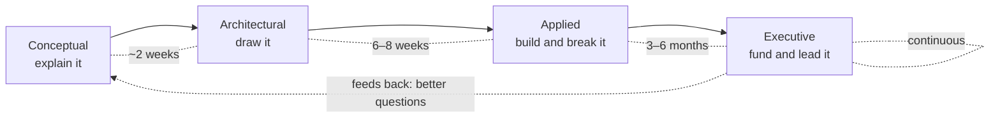
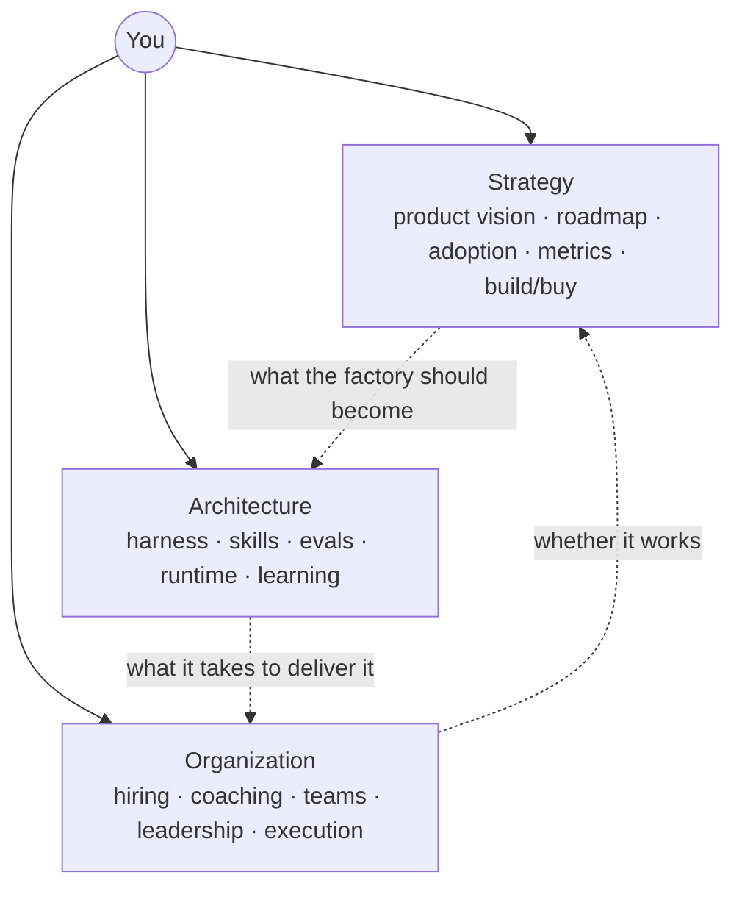
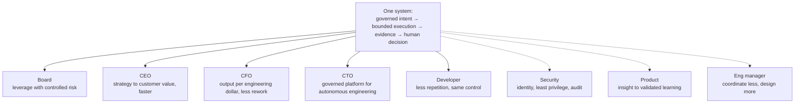
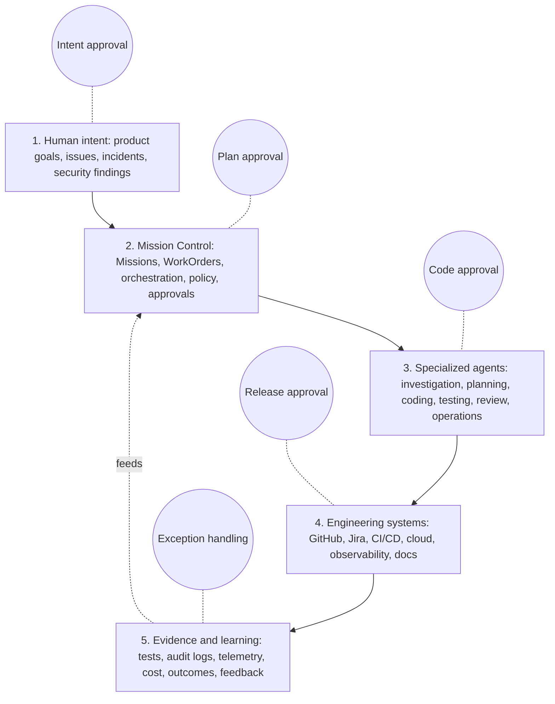
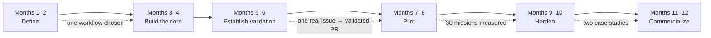
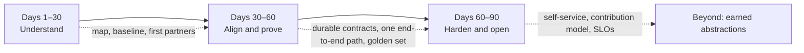
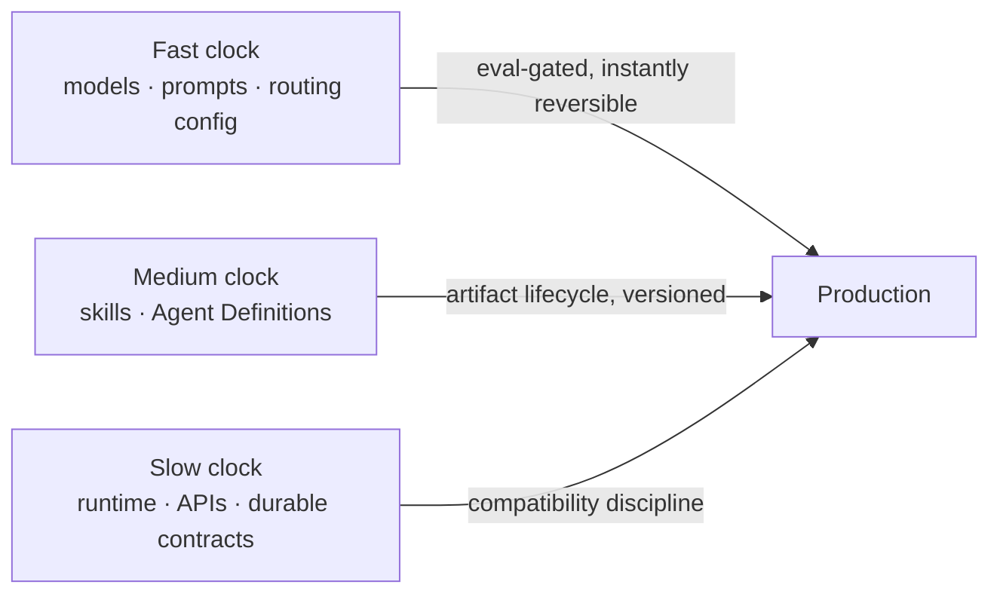

# 43. Mastering the factory: explaining, defending, and building it

Thirty-four chapters have described what a factory is and how Mission Control
attempts to be one. This chapter is about you: the person who has to build
the thing and also stand in front of a board, a CTO, a security lead, and a
room of developers and make each of them understand it in their own terms.
Mastery here has two halves that reinforce each other. You cannot explain
what you cannot build, and you cannot get the mandate to build what you
cannot explain. After reading it you should have a program — fluency levels,
audiences, objections, a build plan, and a weekly rhythm — that you can run
on yourself for a year.

[Appendix E, Software architecture and system design study guide](../appendix/architecture-communication.md),
keeps the reference form of the timed explanations, defense questions, and the
twenty-minute whiteboard. This chapter absorbs it into a program.

## The problem

Technical knowledge is not mastery until it can be reconstructed, defended,
and adapted under questioning. Executives need the business case and the risk
model. Architects need boundaries and invariants. Engineers need
implementation and failure behavior. A single memorized pitch fails all three.

The subject makes this harder than most. AI discussions invite vague claims,
and the words that matter — agent, autonomy, factory, trust, learning — are
used inconsistently by vendors, by the press, and inside your own company.
Every serious listener is testing whether you can separate vision from
implementation, respond to skepticism without retreating into jargon,
quantify value, and make a hard tradeoff out loud. The failure is usually not
ignorance. It is a leader who knows the system deeply and still describes it
as magic, or claims full autonomy as the starting point, or equates code
generation with productivity, or presents one general-purpose agent as the
architecture, or overstates what is already proven.

The other failure is the mirror image: a builder who can trace every Convex
mutation and cannot say in thirty seconds why the CFO should care. Both people
lose the mandate. The program below is designed so that neither is you.

## How it works

### One stable thesis

Everything you say should descend from one thesis, so that any question, at
any altitude, returns to the same place. An AI Software Factory is a governed
engineering operating model in which humans define intent, constraints,
priorities, and acceptable risk while bounded agents plan, implement,
validate, document, and improve software. Humans retain accountability;
agents provide execution. The goal is to reduce the time from business intent
to validated customer value while improving quality, governance, and
engineering leverage.

The supporting thesis is **trust the system, not the model**. The factory
assumes models will fail and uses bounded authority, independent validation,
evidence, policy, audit, recovery, and human decisions to make execution safe.
And the quality thesis, which is your particular advantage as someone who
came up through quality engineering: quality is not a gate, it is the
acceleration engine. More reliable validation produces more trust, more trust
permits more autonomy, more autonomy shortens cycle time. Without
high-confidence validation, organizations keep humans in every loop; with it,
they can remove unnecessary checkpoints safely.

Think of the thesis as a keel. Whatever wind a question brings — cost,
headcount, security, "why not wait for better models" — the boat heels and
then comes back upright on the same line.

### Four levels of fluency

<!-- infographic: mastery-levels -->
> **Infographic — Four fluency levels.**

Fluency in a factory resembles fluency in a language: first you can order
dinner, then argue, then write, then negotiate. Do not try to master
everything at once.

**Conceptual fluency** (about two weeks) means you can explain what an agent
is, what an AI Software Factory is, how agents use tools, how orchestration
works, why governance matters, why validation enables autonomy, what humans
continue to own, and how success is measured — each in one sentence, to an
engineer, and to a CEO. Part I of this guide is the syllabus.

**Architectural fluency** (six to eight weeks) means you understand agent
loops, tool calling, context management, memory, retrieval, multi-agent
coordination, workflow state, human approval, evaluations, observability,
sandboxing, permissions, model routing, and failure recovery well enough to
draw them and say what breaks. Parts II and III.

**Applied fluency** (three to six months) means you can design an issue-to-PR
workflow, define agent roles, write WorkOrder contracts, define approval
policies, identify failure modes, design evidence requirements, define
metrics, review a prototype, and explain architectural tradeoffs. Parts IV
and V.

**Executive mastery** (continuous) means you connect architecture to business
value, lead organizational transformation, make build-versus-buy decisions,
design phased adoption, explain risk to executives, evaluate economics, hire
the right team, set strategy, and communicate to boards, engineers, customers,
and investors. Part VI, and the rest of your career.

The levels are cumulative and the arrow runs both ways: executive questions
send you back to check a concept you thought you had.

### The capabilities a founder-architect must hold

The role this program prepares you for is not "the person who knows every AI
framework." It is **Founder and Executive Architect of the operating model**:
strong enough technically to challenge and guide the system, primarily
responsible for integration across engineering, quality, AI, product,
governance, organizational design, business value, change management, and
leadership. The standard for technical depth is not "I can implement every
component" but "I can evaluate architecture, identify failure modes,
challenge assumptions, make tradeoffs, and lead world-class engineers."

That role rests on five capability sets. **Technical**: agent architecture,
multi-agent orchestration, MCP and tool execution, software-development
agents, context engineering, retrieval, evaluation design, model routing,
human-in-the-loop systems, observability, AI security, agent permissions,
CI/CD, production experimentation, feature flags, automated testing,
reliability engineering. **Product**: customer discovery, high-value workflow
identification, ideal customer profile, quantified pain, simple adoption
paths, time to value, brutal prioritization, packaging, pricing, adoption and
retention measurement. **Business**: enterprise selling, security reviews,
procurement, SaaS economics, startup finance, equity and capitalization,
fundraising, partnerships, competitive positioning, category creation.
**Transformation**: moving organizations from human execution to human
supervision, static roles to human-agent teams, manual testing to continuous
validation, individual tools to orchestrated workflows, activity measurement
to outcome measurement, centralized decisions to policy-based autonomy.
**Executive communication**: the five audiences below.

What you are building is likewise five things at once: a technical platform,
an engineering operating model, a governance system, a measurement system,
and an organizational transformation playbook. A leader who only builds the
first is building a tool.

### The leader's three axes

<!-- infographic: three-axes -->
> **Infographic — The leader's three axes.**

The five capability sets above are what you must know. The three axes are
what you must do, and the job is to hold all three at once. On the
**strategy** axis: product vision, roadmap, adoption, metrics, and
build-versus-buy. On the **architecture** axis: the harness, the skills
framework, evaluations, the runtime, and the learning system. On the
**organization** axis: hiring, coaching, team structure, leadership, and
execution. A senior engineering leader standing up a factory is expected to
help determine what the factory should become, build the organization,
architect the platform, deliver it, drive adoption, and measure whether it
works — and to notice that those six verbs are the three axes read twice.

What the leader personally owns is narrower than the axes suggest and
broader than any one team: the architecture principles and platform
boundaries, the harness and runtime strategy, the Agent Definition model, the
skills framework, the evaluation strategy, the self-improvement architecture,
build-versus-buy, production-readiness standards, team structure, and
cross-organization adoption. Everything else is delegated.

> I own the coherence of the system, not every line of implementation.

### Five audiences, one system

<!-- infographic: five-audiences -->
> **Infographic — Five audiences, one system.**

The same system has to be said in five languages, and if you can do that you
become a different kind of leader. To the **board**: this is an
engineering-leverage strategy with a governance model — faster delivery and
better economics without accepting uncontrolled operational risk. To the
**CEO**: it shortens the time from strategy to customer value and lets the
company execute more continuously while preserving human accountability for
consequential decisions. To the **CFO**: it improves output per engineering
dollar by automating repeatable execution, reducing rework, shortening cycle
time, and allowing growth without headcount rising at the same rate. To the
**CTO**: it is a governed platform for orchestrating agents across the
lifecycle, with permissions, evaluations, human approval, auditability, and
production feedback built in. To the **developer**: it removes repetitive
work and waiting so you spend more time on architecture, product decisions,
complex debugging, and technical creativity — your judgment stays.

Three secondary audiences appear often enough to prepare. A **security
leader** hears: every agent operates through a defined identity, minimum
permissions, approved tools, isolated environments, policy checks, and
auditable actions. A **chief product officer** hears: less delay between
customer insight and validated product learning, smaller hypotheses tested
faster with quality controls intact. An **engineering manager** hears: the
role shifts from coordinating repetitive execution to defining outcomes,
managing risk, developing people, improving systems, and reviewing the
quality of decisions.

### Three lengths, one shape

Appendix E keeps the full texts; the shapes are what to internalize.

**Thirty seconds, CEO.** A factory turns a governed business objective into
validated software through bounded agent execution; it controls planning,
authorization, quality evidence, delivery, and learning, not just code;
humans stay accountable for risk; success is faster validated customer value,
stable or lower failure, and greater leverage.

**Two minutes, CTO.** Mission with outcome, constraints, acceptance criteria,
risk, and owner; agents propose a versioned Plan and a human approves one
version; that authority becomes WorkOrders and Tasks; each Attempt runs with
frozen policy, tools, context, scope, budget, and identity; independent
validators attach evidence to criteria; the control plane presents a
review-ready PR with exact lineage; CI/CD may deploy, but the factory governs
policy, evidence, approval, and production validation; autonomy rises only
after sustained outcomes and falls when trust degrades.

**Ten minutes, architecture.** Whiteboard scope, the Mission-through-release
hierarchy, control and execution planes, policy evaluation, versioned Factory
Configuration, Task and Attempt state, lease and idempotency, worktree
isolation, the agent, tool, and context manifest, independent validation,
evidence lineage, the GitHub boundary, production feedback, metrics, and
trust calibration — and for every arrow, the authoritative record, principal,
invariant, failure, and recovery.

Under pressure, any architecture answer has the same eight moves: clarify
outcome, actors, scale, risk, and non-goals; define the hierarchy; draw the
planes; resolve identity, policy, and authorization before execution; explain
durable state, Attempts, idempotency, and recovery; establish independent
validation and lineage; close the loop through delivery, production outcome,
and metrics; state tradeoffs, limitations, and staged adoption.

### The picture you draw

When someone hands you a marker, draw five horizontal layers and put the
humans beside them.

Close with one sentence: the architecture separates intent, execution,
governance, and evidence, which is what lets the organization increase
autonomy without losing control. Then, if the room is technical, erase the
vendor names and show that the architecture still works; do not let Mission
Control's stack become the universal definition of a factory.

### Distinguishing adjacent systems

Half of the confusion you will meet is category confusion, so carry the
table.

| System | Primary value | Missing factory responsibility |
| --- | --- | --- |
| Coding assistant | Suggests code in a human session | Durable workflow and governed lifecycle |
| AI agent | Pursues a bounded objective with tools | Organization-wide authority and outcome model |
| Agent platform | Runs and observes agents | Engineering-specific intent-to-production governance |
| AI Software Factory | Governs the full lifecycle to validated customer value | Must prove, not merely claim, every stage |

The positioning that follows from it: do not present Mission Control as
another coding-agent product. The category is the governance, orchestration,
and operating platform for autonomous software engineering — **the control
plane for AI Software Factories**. The coding agent performs tasks. The
control plane decides what work should happen, which agent performs it, what
tools it may use, what evidence is required, which human must approve,
whether the outcome is safe, what it cost, what happened in production, and
what the system should learn. That is a larger and more defensible position.

### The CI/CD analogy

The most useful comparison you can offer a room that has lived through the
last twenty years is CI/CD. Developers still build and test locally; nobody
took that away. But as organizations grew, shared build, test, artifact, and
deployment infrastructure meant that one improvement to the pipeline
benefited every team at once, and delivery became something you could
measure and improve rather than something each developer did their own way.
Agentic engineering is going the same direction. Interactive coding agents
in the IDE will remain, the way local builds remained. Work that is
repeatable and delegable, though, benefits from a common factory that
manages workflow, models, skills, evaluation, security, and telemetry for
everyone. Repeatability gives you measurement; measurement gives you
continuous improvement. The control plane manages the work and the workers
execute it, and an improvement made once benefits everyone.

> Do for agentic engineering what CI/CD did for build and delivery: turn
> individual practices into shared engineering infrastructure.

### Objections, answered through architecture

Every objection has an architectural answer; the skill is giving the answer
rather than a reassurance.

*"Models are probabilistic. Why trust them?"* Do not trust model confidence.
Trust a system that limits authority, validates independently, retains
evidence, and fails safely.

*"Isn't this just CI/CD plus agents?"* CI/CD executes build and delivery
steps. The factory begins at governed business intent and owns planning,
authorization, agent execution, evidence-based acceptance, deployment
governance, production feedback, and controlled learning.

*"Won't governance remove the speed?"* Poor governance does. Risk-based
policy automates routine decisions and escalates only surprises; evidence
packages remove review reconstruction.

*"Why not wait for better models?"* Better models improve a component. They
do not create identity, policy, isolation, audit, independent evidence, or
organizational accountability.

*"Are you trying to replace developers?"* No — to change where they spend
attention: less repetitive investigation, mechanical implementation, manual
validation, and coordination; more customers, architecture, tradeoffs, novel
problems, and consequential review. Workforce effects are real, and a
credible leader does not promise a fixed outcome from immature evidence.

*"Why not just a coding assistant?"* An assistant improves one task. The
opportunity is the whole workflow — planning, implementation, testing,
security, deployment, operations, evidence, approval — which needs an
operating model and a control plane.

*"What stops agents from causing damage?"* Risk-based permissions, isolated
execution, minimum access, deterministic validation, policy enforcement,
spending and execution limits, human approval for consequential actions,
complete audit, and autonomy earned per workflow.

*"How do you measure whether it works?"* Speed, quality, economics, human
impact, and agent reliability: lead time, plan-to-PR time, change failure
rate, escaped defects, human hours per item, agent cost, rework, developer
satisfaction, intervention rate, first-pass validation. Never code volume.

*"What would you build first?"* A governed issue-to-PR workflow for scoped,
low-risk changes — measurable, understandable, useful everywhere, and it
exercises every core capability from investigation to production validation.

*"What remains human?"* Customer understanding, strategic direction,
architecture, ethical judgment, risk tolerance, ambiguous tradeoffs,
leadership, high-impact approvals, accountability, exception handling.

*"How do you avoid creating more review work?"* Structured evidence rather
than more code; smaller changes; automatic validation; clear summaries;
routing by risk. Review burden is itself a metric: if agent output raises
human review time, the workflow is not yet delivering leverage.

*"What is the biggest risk?"* Deploying autonomy faster than the
organization can evaluate and govern it; hence progressive autonomy,
evidence-based advancement, and workflow-specific permissions.

*"How does the organization change?"* Engineers focus on intent,
architecture, judgment, and review; managers move from coordinating
execution to designing systems, managing risk, developing talent, and
improving decision quality; quality moves from a downstream function to
continuous validation.

Then the adversarial ones, which are where mastery shows. *Change failure
rate rose while lead time fell?* Slow the autonomy level for the affected
risk class, find which validator missed the defect class, add the evidence
requirement, and measure the cohort before re-expanding — speed bought with
defects is not speed. *A security validator fails while two others pass?* A
critical hard gate fails closed; no aggregate score outranks it. *An agent
produced a correct PR outside its WorkOrder scope?* Not acceptable; scope is
authority, and the fix is a new WorkOrder, not a waiver. *A board member wants
a headcount-reduction forecast?* Give the evidence you have, the metrics you
would require, and refuse to convert a roadmap into a present-tense claim.

### Sounding like the leader, not the enthusiast

Executive language is mostly the discipline of replacing a vague claim with a
bounded one. "AI can probably help developers work faster" becomes "AI can
reduce repetitive engineering execution, but the value depends on whether the
complete workflow gets faster without more defects, review burden, or
operational risk." "We want agents to do everything" becomes "we assign
autonomy by workflow and risk level and expand authority only when
reliability is demonstrated." "The agent checks the work" becomes "the
validation layer produces deterministic and model-based evidence that the
work meets acceptance, security, quality, and policy requirements." "Humans
are still involved" becomes "humans retain ownership of intent, consequential
decisions, risk acceptance, and final accountability." "This produces more
code" becomes "this reduces the time from intent to validated customer value."

The transitions that make an answer easy to follow are few: the core problem
is; the distinction I would make is; the operating principle is; the business
value comes from; the primary risk is; the evidence I would require is; I
would introduce this progressively; the first workflow I would prove is; the
outcome I would measure is; the role of leadership is. And the phrases that
carry confidence without pretending certainty: my thesis is; the model I
would test is; I would begin with; I would expand only after.

The narrative you should deliver in one breath: engineering is moving from
humans performing nearly every step to humans directing systems that execute
continuously; most companies are adding agents without redesigning the
operating model, producing fragmented tools, weak governance, uncertain
quality, and unclear accountability; the factory coordinates people and
agents across the whole lifecycle, humans setting objectives and staying
accountable, agents working within explicit policy; the goal is not more code
but less time from idea to validated customer value with better quality,
traceability, and control.

### Incidents and security, in one sequence

You will be asked what happens when it goes wrong, and the answer must be
the same every time. **Clarify → Contain → Observe → Isolate → Restore →
Correct → Prevent → Measure.** Clarify the affected builders, workflows,
tenants, repositories, data, and business impact. Contain unsafe execution
with scoped cancellation, authority reduction, credential revocation, or a
kill switch. Preserve traces, events, tool calls, policy decisions,
artifacts, and evidence. Isolate the failure to intent, context, model, tool,
state, policy, or evaluation. Restore a known-safe version, correct and
reconcile, add a regression evaluation and a stronger control, then measure
the affected cohort until confidence returns.

Practice it against the whole list: production-agent failure, reliability or
evaluation regression, model degradation or provider outage, tool misuse,
prompt injection, malicious repository content, secret exfiltration, MCP
poisoning, privilege escalation, unauthorized file or data access, sandbox
escape, approval bypass, supply-chain compromise, cross-tenant leakage, failed
deployment, runaway token spend. The security thesis behind every answer: an
agent receives the minimum context, tools, permissions, time, and budget the
task requires, and every consequential action produces evidence.

### Five lessons from enterprise scale

Large enterprise platform teams that have run agentic engineering across
many product organizations keep arriving at the same five lessons, and each
one is a sentence you should be able to defend with a story.

1. **The platform owns the workflow, not the model.** Models are swapped;
   the lifecycle, the contracts, and the evidence stay.
2. **The paved road must beat the workaround.** Adoption cannot be
   mandated. If the governed path is slower or clumsier than the ungoverned
   one, builders take the ungoverned one and the governance is fiction.
3. **Trust becomes the bottleneck as generation scales.** Once code is
   cheap, the constraint is how much of it anyone can trust, and that
   constraint does not yield to more generation.
4. **Enterprise context and tools get complicated fast.** Retrieval turns
   out to be a permissions, provenance, freshness, and relevance problem;
   tools turn out to be the point where intelligence becomes authority.
5. **Agent platforms become infrastructure earlier than expected.** Durable
   state, retries, idempotency, SLOs, rollback, and production ownership
   arrive long before anyone planned for them.

> Don't just scale agents. Scale the system that makes their work
> trustworthy.

### Six technical themes

If the whole guide had to be compressed to six phrases that a technical
audience will test you on, they are these: intent before execution; the
platform owns the workflow; durable execution, with state, authority,
retries, and evidence kept outside the model; trust at scale; risk-based
autonomy; and continuous intelligence — evaluation that starts before
promotion and never stops after deployment. Every architectural answer in
this chapter is one of the six applied to a specific question.

The line to close on, whatever the room: the first generation of AI
developer tooling made code generation faster. The next generation will be
judged by how much trustworthy change a platform can move from human intent
to production without scaling human effort linearly with it.

## How to build it

### The twelve-month build

<!-- infographic: twelve-month-plan -->
> **Infographic — The twelve-month implementation plan.**

**Months 1–2, Define.** Produce the factory manifesto, the human-agent
operating model, the Mission lifecycle, the risk and autonomy model, the
initial architecture, success metrics, the ideal customer profile, the first
workflow definition, and the product narrative. The one decision this phase
must make: which single workflow proves the model. The recommended answer is
governed issue-to-PR delivery.

**Months 3–4, Build the core.** Mission creation, WorkOrder generation, an
agent registry, a role and permission model, the planning workflow, the human
approval gate, an execution runner, evidence storage, an audit trail,
pull-request integration, basic cost tracking. The interface must work end to
end through the UI.

**Months 5–6, Establish validation.** Automated test generation, test
execution, code-quality checks, security checks, agent review,
acceptance-criteria verification, failure and retry handling, human
escalation, and the final evidence package. Goal: one real Mission from issue
to validated pull request.

**Months 7–8, Pilot.** Use the factory on a real repository: at least ten
defect missions, ten small feature missions, five documentation missions, and
five test-improvement missions. Measure time saved, human effort, success
rate, failure modes, review quality, agent cost, and defect outcomes.

**Months 9–10, Harden.** Reliability, security, permissions, sandboxing,
model routing, workflow recovery, observability, cost controls, policy
configuration, enterprise integration. Produce two strong case studies.

**Months 11–12, Commercialize.** A product demonstration, an executive pitch,
a technical architecture brief, a security overview, an ROI model, a pricing
hypothesis, a pilot package, a customer onboarding process, and a
design-partner agreement. Secure three to five serious design partners.

Read [Chapter 42](./42-mission-control-as-a-living-case-study.md) against this
plan and you can place Mission Control on it exactly: core and validation
built, pilot evidence retained for deterministic workloads, hardening under
way, commercialization not started.

### Standing up a factory inside an organization: 30/60/90

The twelve-month plan assumes you are building a product. The other common
situation is joining an organization that already has agents, harnesses,
scripts, and opinions scattered across teams, and being asked to turn them
into a factory. That calls for a different first ninety days, and the
governing rule is to understand before you reorganize.

<!-- infographic: ninety-day-plan -->
> **Infographic — The first ninety days inside an organization.**

**Days 1–30, understand.** Map what exists: agents, harnesses, tooling,
CI/CD integration points, evaluation approaches, model usage, security
boundaries, design partners, and where the expertise sits. Meet every team
that already runs an agentic workflow. Baseline reliability, cost, adoption,
evaluation coverage, and builder friction. The output is a document, not a
platform: what exists, what belongs centrally, the biggest risks, and the
first design-partner workflows.

**Days 30–60, align and prove.** Align the founding team on a small number
of durable contracts — the Agent Definition, the execution contract, the
tool-authorization boundary, the context contract, the evaluation interface,
versioning, and observability lineage. Pick the design-partner workflows and
prove one end-to-end path through them. Build the golden evaluation set and
the cost baseline. One complete workflow that exposes real weaknesses is
worth more than ten disconnected demonstrations.

**Days 60–90, harden and open.** Harden the proven workflows and move them
toward self-service. Define the contribution model. Put evaluation and
production-readiness gates in place, with initial SLOs and operating
ownership. Send forward-deployed engineers to find friction. Make
build-versus-buy decisions from evidence rather than preference.

**What not to do in the first ninety days.** Do not arrive with a prebuilt
architecture. Do not migrate existing agents. Do not scale the team around
boundaries you have not yet proven. Do not add adaptive routing before you
have evaluation data to route on. Do not start recursive self-improvement
before there is a trustworthy baseline to improve against.

> The patterns transfer. The implementation has to be yours.

### What to build first, and what not to build first

Resist building everything. Choose a few high-value workflows with design
partners and prove one end-to-end path. The minimum early architecture is
small: builder intent and a Plan; a versioned Agent Definition; a harness
with an execution loop; governed tool access; basic context management; an
evaluation baseline; traceability and observability; and a safe path into
the existing CI/CD. While building the minimum, protect the seams that will
matter later even when they are trivial now — identity, interfaces, policy,
evidence, evaluation, versioning — so that the next proof point does not
paint you into the next architecture.

What not to build first is a longer list, and every item on it is
attractive: sophisticated autonomous learning; highly dynamic multi-agent
swarms; machine-learned model routing; a large universal memory layer;
hundreds of generic skills; complex organizational structures. Each is a
hypothesis until production evidence exists.

> Don't generalize before you've earned the abstraction.

### The contribution model

A factory that serves many product organizations needs a clear answer to
who builds what. The central team owns the contracts and the paved road: the
Agent Definition format, the skills framework, tool contracts, identity,
policy, evaluation interfaces, observability, and the runtime. Product
organizations contribute domain-specific intelligence inside those
boundaries.

- **Centralize:** identity and authorization; the model gateway and routing;
  the harness and runtime; tool governance; the skills framework; evaluation
  infrastructure; observability; cost attribution; evidence interfaces;
  security controls.
- **Federate:** domain skills; product knowledge; specialized agents;
  product-specific acceptance criteria; differentiated workflows.

> Centralize undifferentiated complexity. Federate differentiated expertise.

Existing agents get no migration mandate. Understand what already works,
then offer incremental value in the order teams will accept it: the model
gateway first, then common evaluation, then observability, then governed
tools, then more of the runtime. The platform should be a gravity well that
teams fall into because each step is worth it, not a migration mandate they
resent.

### Forward-deployed engineering

For an early platform, engineers who sit with adopting teams are the right
investment. They see where onboarding breaks, where the abstractions do not
fit, which capabilities are missing, and the moment trust is lost, and none
of that shows up in a dashboard. The failure mode is that forward
deployment becomes a permanent consulting layer that hides platform
weaknesses instead of fixing them. The guard is a rule: discoveries flow
back into the platform, and the same integration solved three times by
hand is a missing platform capability, not a service to keep providing.

> Forward deployment accelerates the path to self-service; it does not
> replace it.

### Platform metrics

The metrics that are easy to collect — lines of code, prompts, agent count,
PR count, tokens — measure activity. The factory is measured on four
families:

- **Builder:** intent to prototype; intent to accepted PR; intent to trusted
  production; self-service onboarding; repeat usage.
- **Trust:** accepted-task success; human edit rate; defect escape; rollback
  rate; false-positive review rate; policy violations.
- **Economics:** cost per trusted outcome; model cost; CI cost; human review
  cost; rework.
- **Platform:** completion rate; reliability; latency; retry rate; tool
  failure rate; recovery time.

> Generation volume is an activity metric. Trusted outcomes are the product
> metric.

### Three release clocks

<!-- infographic: three-release-clocks -->
> **Infographic — Three release clocks.**

A factory is not one release train. Models, prompts, and routing
configuration move fast, gated by evaluation and reversible in minutes.
Skills and Agent Definitions move on a slower artifact lifecycle with
versions, owners, and deprecation. The runtime, its APIs, and the durable
contracts move slowest of all, under compatibility discipline, because
everything else depends on them. Trying to move all three on one clock
either freezes the fast layer or destabilizes the slow one.

### The first thirty days

Before the year, a month, because a month produces proof and a year produces
a plan.

- **Week 1, clarify the thesis.** Write concise answers: what is a factory;
  what problem does it solve; who has the problem; why are existing tools
  insufficient; why now; what is your unique approach; what is the first
  workflow; what does success look like.
- **Week 2, define the operating model.** Document human roles, agent roles,
  the Mission lifecycle, autonomy levels, approval policies, evidence
  requirements, escalation paths, and success metrics.
- **Week 3, define the product.** Produce the system map, the core domain
  model, the first user journey, the first workflow, MVP scope, explicit
  non-goals, the UI flow, and a demonstration scenario.
- **Week 4, execute.** Build or direct Mission intake, a planning agent,
  human plan approval, agent execution, test validation, pull-request
  creation, and an evidence dashboard.

At the end of thirty days you should have less conceptual breadth and more
concrete proof. That is progress.

### The weekly rhythm

A founder-architect's week is the twelve-month plan run at small scale.

- **Monday, strategy.** Review the North Star; choose the week's
  highest-value factory outcome; review risks and dependencies; confirm what
  will not be worked on.
- **Tuesday, product and customer.** Talk to users or engineering leaders;
  review workflows and product evidence; refine the problem definition.
- **Wednesday, architecture and execution.** Review system design; evaluate
  agent performance; resolve technical tradeoffs; ship a meaningful
  improvement.
- **Thursday, quality and governance.** Review failures; improve
  evaluations; tighten policies; analyze audit and traceability data.
- **Friday, business and communication.** Review metrics; write the executive
  summary; update the narrative; build relationships with partners,
  customers, hires, or investors.
- **Weekend reflection.** What did the factory actually accomplish? What did
  humans have to correct? Which workflow got more reliable? What should be
  removed? What did I learn about the market? What is the next constraint?

### Daily practice

Thirty minutes a day keeps the communication half honest: ten on terminology
(three terms, each in one sentence, to an engineer, to a CEO); ten of spoken
delivery (a recorded two-minute answer — slower pace, short sentences, real
pauses, no filler, direct conclusion); ten of executive writing (one
paragraph: situation, significance, recommendation, next step). Keep the
recordings so you can hear yourself drift.

### Progressive proof as the adoption strategy

Whatever the room, the adoption answer is the same and it is the same as the
architecture: begin with one controlled repository and one `Governed Issue →
Validated Pull Request` path; establish baselines; keep human merge
authority; classify risk; measure review burden and failure; increase
autonomy only after sustained evidence. Scale a proven operating model, not a
demo. The proofs that make the vision credible are five: a workflow that
took five days reaching a validated PR in one; faster execution with no rise
in escaped defects; developers measurably spending less time on execution and
more on decisions; a complete chain of intent, plan, actions, approvals,
evidence, and production outcome; and lower cost per validated change or
higher throughput without proportional headcount. Those five are the business
case, the executive narrative, and the sales foundation at once.

### The scorecard

Score yourself one to five on each; the program is working when every line is
at least four, and the lines under four are next week's Monday agenda.

| Area | Can I… |
| --- | --- |
| Vision | define the AI Software Factory in one sentence? |
| Problem | explain why current engineering models are inefficient? |
| Differentiation | distinguish a coding assistant from a software factory? |
| Architecture | explain Mission Control's layers and planes? |
| Governance | explain permissions, approvals, and progressive autonomy? |
| Quality | explain why validation enables speed? |
| Metrics | define measurable success? |
| Business value | explain the model to a CEO and a CFO? |
| Developer value | explain how engineers benefit? |
| Transformation | describe how roles and teams change? |
| Personal credibility | connect the vision to my own experience? |
| Delivery | answer clearly without rambling? |

Add the questions from Appendix E that a reviewer would put to you: why now,
and what evidence would slow adoption; how the factory changes economics and
organization design; which risks always stay human-owned; what a ninety-day
proving program must demonstrate; how you would design for a hundred
repositories and several risk tiers; how you prevent duplicate effects after
a worker crash; how policy, identity, context, validation, and trust
interact; what the minimum independent-validation boundary is. A claim
graduates only when you can trace it, operate it, break it, recover it, and
teach it without agent assistance.

## Failure modes

**The memorized pitch.** It works for one question and collapses on the
follow-up. You detect it when you cannot say why a design costs what it costs
or what evidence would change your mind; you fix it by practicing causal
chains — why the problem exists, which invariant matters, what the design
costs, how it fails, what would change your mind — instead of answers.
**Dogma** is its cousin: strong opinions show judgment, dogma shows shallow
understanding, so state the default, the conditions that justify it, and when
another design is better.

**The present-tense roadmap.** The hardest executive discipline is refusing
to convert a plan into a claim. Detect it when "will" turns into "does"; fix
it by pinning every capability claim to a commit and an evidence state, as
Chapter 42 does.

**The incomplete answer.** Technology with no customers, economics,
organization, or change management; humans described as approvers who click;
one general-purpose agent presented as the architecture; a term you cannot
unpack. If an answer contains no metric and no human role, it is not
finished.

**Building without explaining, explaining without building.** The two
failures that motivate this chapter. The cure for the first is Friday; the
cure for the second is Wednesday.

## In Mission Control

Appendix E was written against Mission Control at
[`b31e275`](https://github.com/jaydubya818/MissionControl/tree/b31e27564deb1c03c167e61b5ee094567c2ba7b1):
the Mission-to-Attempt hierarchy, versioned Factory Configuration and
readiness, policy and approval primitives, WorkflowRuns and events,
independent-evidence concepts, scoped context packages, service and GitHub
identity contracts, operational analytics, and a browser-proven control-plane
path through WorkOrder release — but not the complete browser-operated
Codex-to-GitHub path, because no active Governance Policy or Factory
Configuration existed, the GitHub App was unconfigured, todo 024 was
incomplete, and the runtime was dirty. Trust Score, automatic autonomy
calibration, first-class Risk Review, governed MCP, production memory,
complete deployment governance, and intent-to-customer-value economics were
partial or future.

At `d902fae` and the V3 evidence at `b3dfcee` the foundation is materially
larger ([Chapter 42](./42-mission-control-as-a-living-case-study.md)), and
the communication rule is unchanged: explain the implemented foundation and
the unproven boundary without embarrassment. Accurate limitation is an
architecture skill, and the defensible differentiation is not "our agents are
smarter" but that the operating system makes probabilistic execution
governable.

## Retain this

- One thesis, said at every altitude: humans define intent and accept risk;
  bounded agents execute; independent evidence decides; trust the system, not
  the model; quality is the acceleration engine.
- Four fluency levels — conceptual, architectural, applied, executive — and
  the arrow runs both ways.
- Five audiences: board (leverage with controlled risk), CEO (strategy to
  value, faster), CFO (output per dollar, less rework), CTO (governed
  platform), developer (less repetition, same control).
- Every objection has an architectural answer. Adversarial questions are where
  mastery shows: hard gates fail closed, scope is authority, roadmaps are not
  present-tense claims.
- Twelve months: Define, Build the core, Establish validation, Pilot, Harden,
  Commercialize. Thirty days to first proof. A weekly rhythm of strategy,
  customer, architecture, quality, business, reflection.
- Position the product as the control plane for AI Software Factories, and
  adopt through progressive proof from one repository and one workflow.
- Inside an organization: understand (30), align and prove one path (60),
  harden and open to contribution (90); no prebuilt architecture, no
  migration mandate, no adaptive routing or self-improvement before a
  baseline. Centralize undifferentiated complexity; federate differentiated
  expertise. Three release clocks, not one train. Trusted outcomes, not
  generation volume.

## Go deeper

- [Chapter 1 — Why software engineering is changing](../01-understand/01-why-software-engineering-is-changing.md)
  and [Chapter 3 — First principles](../01-understand/03-first-principles-trust-evidence-and-authority.md)
  for the thesis and the autonomy levels the objections rest on.
- [Chapter 4 — The human–agent operating model](../02-design/04-the-human-agent-operating-model.md)
  for what humans, agents, and shared work own.
- [Chapter 8 — Economics, metrics, and human attention](../02-design/08-economics-metrics-and-human-attention.md)
  for the metrics behind the CFO answer.
- [Chapter 26 — Autonomous engineering workflows](../03-build/26-autonomous-engineering-workflows.md)
  for the issue-to-PR wedge every adoption answer starts from.
- [Chapter 36 — Resilience, incidents, and the control tower](../05-operate/36-resilience-incidents-and-the-control-tower.md)
  for the incident sequence in operation.
- [Chapter 38 — Enterprise adoption and the infrastructure landscape](../05-operate/38-enterprise-adoption-and-the-infrastructure-landscape.md)
  for the maturity model behind progressive proof.
- [Chapter 42 — Mission Control as a living case study](./42-mission-control-as-a-living-case-study.md)
  for the evidence you cite.
- [Appendix E — Software architecture and system design study guide](../appendix/architecture-communication.md)
  for the full timed explanations, defense questions, twenty-minute
  whiteboard.
- [Glossary](../appendix/glossary.md).
- Mission Control sources at `b31e275`: [North Star](https://github.com/jaydubya818/MissionControl/blob/b31e27564deb1c03c167e61b5ee094567c2ba7b1/docs/product/mission-control-north-star.md),
  [V1 product strategy](https://github.com/jaydubya818/MissionControl/blob/b31e27564deb1c03c167e61b5ee094567c2ba7b1/docs/product/mission-control-v1-product-strategy.md),
  [AI Software Factory V1 decisions](https://github.com/jaydubya818/MissionControl/blob/b31e27564deb1c03c167e61b5ee094567c2ba7b1/docs/decisions/ai-software-factory-v1-decisions.md).
- Sources: Jay West, "AI Software Factory Mission" — capabilities to master,
  the twelve-month plan, the thirty-day plan, the weekly rhythm, market
  positioning, the executive narrative, and the five proofs; Jay West, "AI
  Software Factory study guide" — audiences (ch. 11), expected
  objections (ch. 16), fluency levels (ch. 18), daily practice (ch. 20),
  executive language (ch. 21), the whiteboard (ch. 24), mistakes (ch. 25),
  and the scorecard (ch. 26); Jay West, factory notes — the leader's three
  axes and what the leader owns, the 30/60/90 inside an organization, what to
  build first, the contribution model, forward-deployed engineering,
  platform metrics, the three release clocks, the CI/CD analogy, the five
  lessons from enterprise scale, the six themes, and the fifteen platform
  principles.
- [Chapter 34 — The factory as a platform](../05-operate/34-the-factory-as-a-platform.md)
  for the adoption operating model the contribution model and forward
  deployment sit inside.
