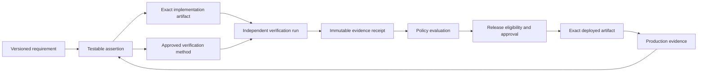

# Continuous Quality Contracts, Proof Packages, and Certificates

This chapter extends [Quality and Evidence Architecture](./01-quality-and-evidence-architecture.md).
That chapter defines evidence semantics. This chapter explains how to compile
requirements into a continuous quality-control system spanning the complete
software lifecycle.

## 1. The problem

Traditional quality control often begins after implementation. Requirements
live in prose, architecture decisions live elsewhere, tests express only part
of the expected behavior, and production telemetry is disconnected from the
original business intent. A green pipeline can therefore prove that selected
commands passed without proving that the right system was built, that material
risks were addressed, or that customer value appeared in production.

Agentic development makes this weakness more dangerous. The same model can
misread the requirement, write an incomplete implementation, generate tests
that preserve its misunderstanding, and confidently declare success. More
agent output increases the volume of claims; it does not increase their truth.

The factory needs a stronger release promise:

> No change may enter a governed release state unless a versioned quality
> contract is satisfied by current, artifact-bound, independently produced
> evidence and every required approval is present.

This is an engineerable guarantee about process, evidence, and authority. It is
not a guarantee that software contains no defect.

## 2. Why the problem exists

Quality is a set of claims made at different times by different methods.
Functional tests, static analysis, architecture review, threat modeling,
performance measurement, supply-chain provenance, deployment health, and
customer outcomes answer different questions. Combining their results into one
unqualified “passed” state destroys meaning.

Several structural problems recur:

- requirements are not testable or versioned;
- plans are evaluated only after code exists;
- builders control both the artifact and the success claim;
- test counts and coverage substitute for behavioral assurance;
- probabilistic evaluations are treated like deterministic proofs;
- evidence is not bound to an exact revision or artifact digest;
- quality scores average away blocking failures;
- release records stop at merge or deployment; and
- escaped defects do not update regression suites or autonomy policy.

These are operating-system failures, not model failures. Replacing the model
does not repair them.

## 3. Enduring Principle

### Build quality into every lifecycle transition

Use one continuous assurance loop:

`Intent -> Plan -> Build -> Verify -> Validate -> Release -> Observe -> Learn`

Each arrow is a governed transition. The current stage must produce sufficient
evidence for the next stage; work does not advance merely because an agent or
tool reports completion.

| Stage | Question | Minimum evidence before advancement |
| --- | --- | --- |
| Intent | What outcome and risk are being accepted? | Testable functional and non-functional requirements, constraints, failure modes, risk class, owner, and definition of done |
| Plan | Is the proposed approach sufficient and safe? | Requirement coverage, architecture alignment, dependency and security review, test strategy, migration, rollback, and unresolved assumptions |
| Build | Was only authorized work performed? | Attempt identity, frozen execution manifest, exact diff, tool events, path scope, dependency changes, and builder provenance |
| Verify | Does the artifact meet deterministic engineering controls? | Compile, type, lint, static analysis, tests, scans, coverage, build, and artifact provenance |
| Validate | Does behavior satisfy the intended outcome? | Independent criterion-level checks, adversarial tests, human or model evaluation where appropriate, and conflict resolution |
| Release | Is the exact artifact eligible for the governed environment? | Quality contract decision, risk decision, approvals, signed artifact identity, deployment and rollback plan |
| Observe | Does the release behave correctly under real conditions? | Canary/control comparison, SLOs, errors, security signals, cost, adoption, and customer-outcome measures |
| Learn | What must change because of observed outcomes? | Incident linkage, causal analysis, missing control or test, proposed update, independent evaluation, and human promotion |

NIST's Secure Software Development Framework supports this lifecycle view by
requiring security requirements, design review, code analysis, executable-code
testing, provenance, vulnerability response, and continuous improvement rather
than one terminal security scan.

### Compile executable requirements into a Quality Contract

A **Quality Contract** is the machine-readable assurance specification for one
version of a WorkOrder or release candidate. The agent does not decide what
“done” means during execution. Human-owned intent, organizational policy, risk,
and approved Factory Configuration compile the contract before mutation begins.

At minimum, the contract contains:

- subject identity: Mission, Plan revision, WorkOrder revision, repository, and
  intended environment;
- functional and non-functional requirements with stable identifiers;
- architecture, data, security, compliance, and dependency constraints;
- expected failure and recovery behavior;
- test and evaluation scenarios;
- required verifier capabilities and independence rules;
- evidence type, method, pass condition, freshness, and retention for every
  criterion;
- hard gates, scored dimensions, risk thresholds, and waiver rules;
- approval owners and separation-of-duty requirements;
- deployment, canary, rollback, and production-observation policy; and
- contract version, canonical digest, creator, approver, and validity window.

An abbreviated password-reset contract might look like this:

```yaml
quality_contract:
  id: QC-WO-8241-R3
  subject:
    work_order: WO-8241
    revision: 3
    repository: example/accounts
    base_sha: 7b93c0d
    environment: production
  risk:
    class: HIGH
    reasons: [identity, credential-recovery, customer-data]
  requirements:
    - id: REQ-101
      claim: Reset tokens expire after 15 minutes and are single-use.
      required_evidence: [unit-test, integration-test, independent-security-test]
    - id: REQ-102
      claim: The API does not reveal whether an account exists.
      required_evidence: [negative-api-test, rate-limit-test, security-review]
    - id: NFR-201
      claim: Reset request latency is below 300 ms at p95.
      required_evidence: [performance-run]
  hard_gates:
    critical_security_findings: 0
    required_criteria_satisfied: 100%
    required_test_failures: 0
    rollback_strategy: required
    independent_security_receipt: required
  approvals: [engineering-lead, security]
  production:
    rollout: canary
    signals: [error-rate, latency-p95, email-failure-rate, abuse-rate]
    rollback_on: [slo-breach, security-event]
    observation_window: 7d
```

The contract is executable when policy can determine, without interpreting a
completion narrative, whether every required proof exists and remains usable.

### Model quality as Specification -> Evidence -> Decision

The central data structure is a requirement-to-evidence graph, not a folder of
reports.



This resembles a structured assurance case: a claim is supported by an
argument and attributable evidence, while counterevidence remains visible. The
OMG Structured Assurance Case Metamodel provides a mature vocabulary for these
relationships. The factory does not need to implement the complete standard,
but it should preserve the distinction among claim, context, argument,
evidence, and challenge.

For a tenant-isolation requirement, the graph might connect authorization code,
unit tests, cross-tenant integration tests, a security review, the exact test
run, deployment identity, and production access-control telemetry. The graph
must also show what is missing, stale, waived, contradicted, or not applicable.

### Treat generated code and generated evidence as untrusted

Builder output enters quarantine. Deterministic tools should establish the
facts they can observe:

`Compile -> Lint -> Static analysis -> Unit -> Contract -> Integration -> E2E
-> Security -> Dependency -> Performance -> Build -> Provenance`

Not every change requires every control. Policy selects them by affected
surface, consequence, uncertainty, and environment. A documentation change and
an authorization change should not consume the same assurance budget.

Tool output is still not self-authenticating. Each result needs the artifact
digest, command or method, tool version, environment, inputs, producer identity,
timestamps, status, and raw-artifact reference. SLSA provenance establishes
where, when, and how a build artifact was produced. The in-toto Statement model
binds a typed claim to immutable subjects by digest. These standards provide a
sound envelope for factory evidence even though neither proves that the
artifact is functionally correct or secure.

### Separate verification from validation

**Verification** asks whether the artifact satisfies specified technical
controls. It favors deterministic tools and reproducible execution.

**Validation** asks whether the delivered behavior solves the intended problem
under realistic conditions. It may require domain judgment, adversarial
scenarios, user research, probabilistic evaluation, or production comparison.

The producer cannot be the sole judge of either. Separate execution identity,
environment, permissions, criteria, and receipts are more important than merely
using a differently named agent.

Useful verifier capabilities include requirements coverage, testing, security,
architecture, performance, accessibility, data migration, supply chain, and
risk. They do not necessarily require eight permanently running agents. A
factory may invoke deterministic tools, specialist agents, or qualified humans
according to the contract. Adding agents without independent methods creates
cost and correlated confidence, not assurance.

### Test outcomes, failure, and recovery—not coverage alone

Coverage reveals which code executed; it does not prove correct assertions.
The test portfolio should include the methods needed by the risk:

- unit, component, API contract, integration, end-to-end, and regression tests;
- negative, boundary, property-based, fuzz, and mutation tests;
- concurrency, retry, idempotency, timeout, cancellation, and recovery tests;
- performance, load, reliability, accessibility, and security tests; and
- migration, rollback, compatibility, and disaster-recovery exercises.

AI-enabled product behavior additionally needs versioned datasets and repeated
trials for task success, hallucination, prompt injection, retrieval quality,
tool selection, policy compliance, variance, latency, and cost. Agent
evaluations should combine code-based, model-based, and human graders. Model
graders require calibration against qualified humans; they are not independent
truth authorities merely because they run in a separate process.

Anthropic's 2026 agent-evaluation guidance distinguishes tasks, trials,
graders, assertions, and transcripts and recommends multiple evaluation layers.
NIST AI RMF likewise calls for documented, repeatable test, evaluation,
verification, and validation methods, production monitoring, and assessors who
were not the front-line developers.

### Separate Agent Trust, Artifact Trust, and Change Risk

These are different control inputs:

**Agent Trust** is historical evidence about a governed executor configuration:
success, escaped defects, policy violations, retries, reviewer disagreement,
rollback, evidence quality, and recovery.

**Artifact Trust** is confidence in one exact change and release candidate:
criterion coverage, evidence strength, independence, freshness, provenance,
reproducibility, and production behavior.

**Change Risk** is the consequence and likelihood of failure based on affected
systems, data, reversibility, blast radius, uncertainty, and regulation.

Together they determine the maximum eligible autonomy. A trusted agent making a
financial-calculation change still needs material human approval. A new agent
may produce a low-risk artifact with strong evidence, but its limited history
still constrains promotion.

### Use scores for prioritization, hard gates for safety

A quality-confidence score can summarize dimensions for trend analysis and
operator attention:

`Q = f(requirements, tests, security, architecture, performance,
observability, independent evaluation, provenance)`

The formula, inputs, weights, uncertainty, and missing-data treatment must be
versioned. Display a band with the dimension breakdown rather than false
precision. Do not permit compensation across non-compensable controls.

Release eligibility is better expressed as a policy predicate:

```text
eligible =
  all_required_criteria_satisfied
  AND all_hard_gates_pass
  AND no_blocking_counterevidence
  AND evidence_is_current_and_artifact_bound
  AND required_approvals_present
  AND confidence_meets_risk_threshold
```

A 98/100 score cannot override one critical security finding, missing
authorization test, unknown migration result, or absent approval. GitHub's own
artifact-attestation guidance makes the same conceptual distinction: provenance
supports integrity and origin decisions but is not a guarantee that an artifact
is secure.

### Produce a Quality Proof Package and a bounded certificate

The **Quality Proof Package** is the complete reviewable assurance case for one
release candidate. It contains:

- Quality Contract and digest;
- exact repository, source, diff, build, package, and deployment identities;
- requirement-to-evidence coverage graph;
- plan, architecture, security, migration, and rollback reviews;
- deterministic verification results and raw artifacts;
- independent validator receipts and disagreements;
- AI evaluation dataset versions, trials, graders, and uncertainty;
- risk classification, score breakdown, hard-gate results, waivers, and
  approvals;
- signed build provenance and dependency/SBOM references;
- release, canary, production, and customer-outcome evidence; and
- invalidation, supersession, incident, and corrective-work lineage.

The **Software Quality Certificate** is a concise, signed projection of that
package. It identifies the subject by digest, contract version, claims met,
blocking findings, assurance band, policy decision, approvers, issuer, issuance
time, expiry, and proof-package digest.

The certificate means only:

> At issuance time, this exact subject satisfied this version of the governed
> Quality Contract using the referenced evidence and approvals.

It does not mean defect-free, permanently safe, or valid for a different
artifact or environment. New code, dependency changes, expired evidence,
counterevidence, incident linkage, or policy revision can revoke or supersede
it. A certificate without verified provenance and accessible evidence is
decorative paperwork.

### Continue the proof in production

Pre-release evidence cannot reproduce every workload, dependency, customer, or
failure interaction. Release should progress through an explicit canary,
observation, and expansion policy. Compare canary with a control using
representative and attributable signals; also enforce absolute SLO limits.

Correlate traces, metrics, logs, deployment identity, feature configuration,
and business outcomes so the factory can connect a production fact to the
release and original requirement. OpenTelemetry supplies standardized signal
categories and correlation mechanisms; it does not define the product's SLO or
customer success measure.

When production contradicts pre-release evidence, the factory should contain or
roll back the change, mark relevant evidence stale, reopen or create governed
work, lower applicable autonomy, capture the missing scenario, and propose a
regression test or evaluation update. Promotion of prompts, policies, datasets,
or factory behavior remains human-governed.

## 4. Tradeoffs and alternatives

Comprehensive assurance increases compute, latency, storage, and review cost.
The answer is not universal gating; it is risk-proportional contract
compilation. Low-risk changes receive a smaller contract. High-risk and
irreversible changes require stronger methods, longer observation, and more
specialized approval.

A graph is more expressive than a checklist but harder to implement and query.
Start with stable criterion and receipt identifiers, then add richer claim and
counterevidence relationships where they improve decisions.

Cryptographic signing proves issuer and integrity, not truth. A perfectly
signed fabricated test result remains false. Independence, protected execution,
method quality, and raw evidence remain necessary.

Quality scores reduce complexity for operators but invite Goodhart's law and
approval theater. Keep the underlying dimensions visible, preserve uncertainty,
and make hard failures impossible to average away.

Automated rollback limits impact but may be unsafe for irreversible data or
external side effects. Some changes need roll-forward, containment, or a
human-directed recovery plan instead.

## 5. Current Mission Control Implementation

This assessment uses Mission Control GitHub `main` commit
[`b31e275`](https://github.com/jaydubya818/MissionControl/tree/b31e27564deb1c03c167e61b5ee094567c2ba7b1)
and the open study branch at
[`9d5f8e3`](https://github.com/jaydubya818/MissionControl/tree/9d5f8e36aff45a001a8848cc0516b3dc800e29b8),
reviewed on 2026-08-11.

Mission Control already has important pieces of this architecture:

- Mission Plans define validation assertions, pass conditions, evidence
  requirements, independence, and waiver policy;
- released Plans materialize revision-bound WorkOrders and criteria;
- verification receipts bind criteria, runs, methods, results, artifacts,
  verifiers, validity, waiver decisions, and invalidation history;
- WorkOrder governance blocks acceptance on missing, failed, stale, expired, or
  unapproved evidence;
- WorkOrder revision and reopen preserve history while selectively invalidating
  affected evidence;
- GitHub PR checks retain source and head-SHA lineage;
- QC records model rulesets, runs, findings, evidence packs, risk grades, scores,
  artifacts, and dashboards; and
- shadow release-gate evaluations can consume QC, context-evaluation, and
  GitHub CI signals linked to a deployment.

The score/gate separation in the QC design is directionally correct: the
quality score is informational, while failed delivery gates determine risk and
eligibility. That matches the doctrine in this chapter.

The present implementation is not yet one canonical continuous-quality system.
The older `qcRuns.execute` path explicitly uses mock assurance and agent-output
adapters, skips its policy evaluation TODO, and generates synthetic evidence
packs. Its release-gate integration operates in `SHADOW` mode. The newer
Mission/WorkOrder/verification-receipt path has stronger authority and evidence
semantics, but it is not unified with every QC, supply-chain, AI-evaluation,
deployment, telemetry, and customer-outcome signal.

Study branch PR #64 adds frozen execution manifests, structured completion,
bounded handoffs, path scope, durable leases, and a real GitHub App publication
proof. These strengthen build provenance and authority, but PR #64 remains open
and the browser-only golden path remains incomplete.

Mission Control therefore does not currently issue the Software Quality
Certificate defined here. It has several required primitives and one legacy
evidence-pack concept, but not the canonical contract compiler, assurance graph,
signed certificate, revocation workflow, or complete production feedback loop.

## 6. Future Vision

Mission Control should compile an approved WorkOrder and active Factory version
into one immutable Quality Contract before dispatch. That contract should
generate the required Worker, Validator, deterministic tool, approval,
deployment, and observation work.

One canonical assurance graph should connect Mission assertions, WorkOrder
criteria, execution manifests, source revisions, build provenance, artifacts,
verification receipts, policy decisions, approvals, releases, telemetry,
incidents, and learning proposals. Existing QC concepts should either migrate
into this graph or remain explicitly marked as legacy; parallel meanings of
“quality evidence” will otherwise undermine governance.

The first certificate should cover the controlled
`Governed Issue -> Validated Pull Request` demonstration. It should certify PR
eligibility, not production quality. A later release certificate can add build
attestation, deployment, canary, and production evidence once that lifecycle is
implemented and proven.

## 7. Versioned references

### Primary standards and engineering sources

- [NIST Secure Software Development Framework](https://csrc.nist.gov/projects/ssdf), SP 800-218 v1.1 and current project material, accessed 2026-08-11.
- [NIST AI Risk Management Framework Core](https://airc.nist.gov/airmf-resources/airmf/5-sec-core/), TEVV, independent assessment, and production monitoring, accessed 2026-08-11.
- [SLSA specification v1.2](https://slsa.dev/spec/v1.2/) and [provenance definition](https://slsa.dev/spec/v1.2/provenance), accessed 2026-08-11.
- [in-toto Attestation Statement v1](https://github.com/in-toto/attestation/blob/main/spec/v1/statement.md), artifact subject and typed predicate model, accessed 2026-08-11.
- [GitHub Artifact Attestations](https://docs.github.com/en/actions/concepts/security/artifact-attestations), provenance benefits and limits, accessed 2026-08-11.
- [OMG Structured Assurance Case Metamodel 2.3](https://www.omg.org/spec/SACM/About-SACM), claims, argument, and evidence structure, accessed 2026-08-11.
- [Anthropic: Demystifying Evals for AI Agents](https://www.anthropic.com/engineering/demystifying-evals-for-ai-agents), published 2026-01-09, accessed 2026-08-11.
- [OpenAI: Measuring Performance on Real-World Tasks](https://openai.com/index/gdpval/), rubrics, expert graders, and automated-grader limits, accessed 2026-08-11.
- [OWASP LLM01 Prompt Injection](https://genai.owasp.org/llmrisk/llm01-prompt-injection/) and [LLM06 Excessive Agency](https://genai.owasp.org/llmrisk/llm062025-excessive-agency/), accessed 2026-08-11.
- [Google SRE Workbook: Canarying Releases](https://sre.google/workbook/canarying-releases/), production comparison and attribution, accessed 2026-08-11.
- [OpenTelemetry Signals](https://opentelemetry.io/docs/concepts/signals/), traces, metrics, logs, and baggage, accessed 2026-08-11.
- [DORA Software Delivery Performance Metrics](https://dora.dev/guides/dora-metrics/), throughput and instability, accessed 2026-08-11.

### Mission Control implementation sources

- [Mission Control evidence schema](https://github.com/jaydubya818/MissionControl/blob/b31e27564deb1c03c167e61b5ee094567c2ba7b1/convex/schema.ts)
- [WorkOrder governance](https://github.com/jaydubya818/MissionControl/blob/b31e27564deb1c03c167e61b5ee094567c2ba7b1/convex/lib/workOrderGovernance.ts)
- [Mission governance](https://github.com/jaydubya818/MissionControl/blob/b31e27564deb1c03c167e61b5ee094567c2ba7b1/convex/lib/missionGovernance.ts)
- [QC execution](https://github.com/jaydubya818/MissionControl/blob/b31e27564deb1c03c167e61b5ee094567c2ba7b1/convex/qcRuns.ts)
- [Shadow release-gate automation](https://github.com/jaydubya818/MissionControl/blob/b31e27564deb1c03c167e61b5ee094567c2ba7b1/convex/governance/releaseGateAutomation.ts)
- [Pull-request checks](https://github.com/jaydubya818/MissionControl/blob/b31e27564deb1c03c167e61b5ee094567c2ba7b1/convex/factory/prChecks.ts)
- [QC implementation guide](https://github.com/jaydubya818/MissionControl/blob/b31e27564deb1c03c167e61b5ee094567c2ba7b1/QC_IMPLEMENTATION_GUIDE.md)
- [PR #64 execution hardening](https://github.com/jaydubya818/MissionControl/pull/64)

## 8. Notes and lessons learned

My current quality doctrine is:

1. No assertion without evidence.
2. No evidence without provenance.
3. No acceptance without independent validation.
4. No autonomy without calibrated trust.
5. No release without a satisfied Quality Contract.
6. No score may override a hard gate.
7. No certificate means more than its exact subject, policy, evidence, and time.
8. No production contradiction may be hidden by an earlier pass.
9. No learning proposal may promote itself.

The factory produces software plus an assurance case. That is stronger than
“CI is green” and more honest than promising defect-free software.

## 9. Interview and discussion questions

1. What can an AI Software Factory legitimately guarantee about quality?
2. How does a Quality Contract differ from acceptance criteria or a test plan?
3. What makes a requirement executable?
4. Why are verification and validation separate stages?
5. How do SLSA provenance and in-toto attestations support—but not prove—quality?
6. What belongs in a requirement-to-evidence graph?
7. How do you establish independent validation in a one-person company?
8. Why is code coverage insufficient?
9. How should probabilistic agent evaluations be represented?
10. What is the difference among Agent Trust, Artifact Trust, and Change Risk?
11. Why can a 98/100 release remain blocked?
12. What exactly does a Software Quality Certificate certify?
13. Which events revoke or supersede a certificate?
14. How should production evidence alter prior acceptance?
15. Which Mission Control components are canonical, partial, shadow, or mocked?

## 10. Whiteboard exercise

Whiteboard a password-reset change from governed Mission through seven-day
production observation. Include:

- Quality Contract compilation;
- functional, security, reliability, performance, and recovery assertions;
- Worker and independent Validator Attempts;
- deterministic checks and probabilistic evaluations;
- requirement-to-evidence graph;
- one critical security failure despite a 98/100 score;
- human approval and signed certificate;
- canary and control telemetry; and
- a production account-enumeration incident that revokes the certificate,
  demotes autonomy, and creates governed corrective work.

Explain every authority boundary and identify the exact artifact to which each
receipt applies.

## 11. Hands-on lab

### Prerequisites and starting version

- Use a read-only or disposable Mission Control checkout pinned to
  `b31e27564deb1c03c167e61b5ee094567c2ba7b1`.
- Use the controlled `mission-control-factory-lab` scenario; do not deploy or
  change production state.
- Read the existing Quality and Evidence Architecture chapter first.

### Exercise

1. Select one high-risk requirement such as tenant isolation or password reset.
2. Write and canonicalize a machine-readable Quality Contract.
3. Create at least one functional, security, reliability, performance, and
   production-observation assertion.
4. Map each assertion to method, verifier, artifact, pass condition, freshness,
   hard gate, and waiver policy.
5. Trace the closest Mission Control records and identify missing entities.
6. Create one passing receipt, one failed receipt, one stale receipt, and one
   conflicting probabilistic evaluation against explicit artifact digests.
7. Evaluate the release predicate and prove the hard failure cannot be averaged
   away by the quality score.
8. Produce a Quality Proof Package index and a draft Software Quality
   Certificate marked `NOT ELIGIBLE`.
9. Replace the failure with fresh independent evidence and issue a second
   certificate marked `ELIGIBLE FOR HUMAN APPROVAL`.
10. Simulate production counterevidence and record revocation, corrective work,
    regression coverage, and trust impact.

### Required evidence and cleanup

Retain the contract and digest, graph, receipts, policy evaluation, score
breakdown, certificate versions, revocation event, and developer/CTO/CEO
teach-backs. Store no secrets or customer data. Restore edited fixtures or
discard the disposable checkout; retain only sanitized learning artifacts and
checksums.

The lab passes only when a reviewer can reconstruct why the exact artifact was
blocked, became eligible, and was later revoked without trusting an agent's
narrative.
