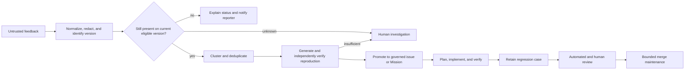

# Production Feedback, Reproduction, Automated Review, and Merge

## 1. The problem

User feedback is valuable and incomplete. A report may describe an obsolete
version, duplicate another symptom, omit the operating conditions, or attribute
the failure to the wrong component. Creating engineering issues directly from
raw feedback floods the system with low-confidence work. Letting an agent fix
the report immediately turns unverified input into mutation authority.

Even after a valid fix exists, automated review, changing base branches, slow
CI, conflicts, and merge queues can consume most of the remaining human time.
The factory needs a governed path from uncertain feedback to reproducible
evidence and then from approved candidate to a safely maintained merge state.

## 2. Why the problem exists

Feedback, issues, reproductions, fixes, pull requests, reviews, and merges are
different records. Collapsing them creates several false claims:

- a report is treated as proof of a defect;
- a generated reproduction is treated as authoritative;
- a passing reproduction is treated as root cause;
- an automated review comment is treated as an acceptance gate;
- resolving comments is treated as proof of quality; or
- entering a merge queue is treated as permission to merge.

The factory must improve flow without weakening those distinctions.

## 3. Enduring Principle

### Promote feedback only as its evidence improves

Raw feedback remains evidence about a user's observation, not proof of root
cause. Promotion should retain the original report, affected version, source,
privacy treatment, deduplication decision, reproduction Attempts, uncertainty,
and human ownership.

### Reproduce before granting implementation authority

A useful reproduction specifies:

- exact product, build, configuration, environment, account or tenant class,
  and dependency versions;
- preconditions and test data;
- minimal ordered actions;
- expected and observed behavior;
- deterministic assertions or bounded observation criteria;
- frequency, timing, and known flakiness;
- logs, traces, screenshots, or other attributable artifacts;
- cleanup and isolation requirements; and
- confidence, limitations, and unresolved external dependencies.

Generate several reproduction candidates when useful, but require a separate
verification path before promoting one into an issue contract. If no clear
reproduction can be established, route to a human rather than inventing a
confident bug.

### Separate deduplication from equivalence

Feedback clustering may group reports by symptom, affected component, error,
or reproduction. Similar text does not prove the same root cause. Record the
confidence and rationale for linking or separating reports, permit later
splitting and merging, and preserve reporter-specific impact.

Partial automation is valuable. A classifier that safely resolves or routes a
large, measurable subset can reduce attention even if the remainder goes to a
human. Optimize for bounded usefulness, not fictional full autonomy.

### Convert production failures into governed regression assets

After a defect is confirmed, add the minimal reproduction or a privacy-safe
derivative to the appropriate test or evaluation dataset. Bind it to the issue,
fix, affected versions, expected result, owner, and retirement policy.

Run cheap, stable regression assets on every relevant pull request. Schedule
expensive, stateful, browser, or external-dependency cases according to risk and
cost. A case that becomes flaky should enter quarantine with an owner; it should
not silently alternate between blocking and being ignored.

### Bound automated review loops

An automated PR reviewer can identify potential defects, policy issues,
maintainability concerns, and requirement gaps. CodeRabbit is one current
product example; the enduring architecture is an **Automated PR Review Agent**
with a versioned configuration and review contract.

For every finding, retain reviewer identity and version, target commit, file and
line identity, category, severity, explanation, suggested action, thread state,
resolution, and resulting commit. New commits should trigger incremental review
without erasing prior findings.

The fix-review loop must define:

- which findings may be auto-fixed;
- maximum iterations and spend;
- no-progress and oscillation detection;
- handling of stale comments and moved lines;
- false-positive and suppression feedback;
- required deterministic checks after a fix;
- independence requirements for consequential findings; and
- the escalation packet produced when the loop stops.

Automated reviewer satisfaction is not WorkOrder acceptance. A reviewer that
suggested a fix cannot be the only verifier certifying it.

### Distinguish platform merge queues from agentic merge maintenance

A repository **merge queue** orders eligible pull requests and evaluates them
against the latest target state. **Agentic merge maintenance** keeps a
human-approved candidate eligible by observing base changes, updating or
rebasing when policy allows, rerunning checks, resolving bounded mechanical
conflicts, and escalating semantic conflicts.

The maintenance agent may:

- update the candidate to the current base under a frozen scope;
- classify CI failures as candidate, base, infrastructure, or flaky;
- retry only under an explicit policy;
- resolve proven mechanical conflicts;
- refresh currentness-bound evidence; and
- report when the approved candidate materially changed.

It may not broaden scope, bypass required checks, dismiss blocking evidence,
approve its own material changes, or exercise the human merge decision.

### Slice large changes into reviewable, governed increments

A discovery prototype may clarify desired behavior without meeting production
quality. Treat it as design evidence or a reference implementation, not as an
automatically acceptable change.

Use an independently reviewed production plan to divide large work into
coherent pull requests with explicit dependencies, migration order, integration
invariants, and rollback. Stacked pull requests can reduce review size while
introducing base-branch and invalidation complexity. Each PR should be useful
or at least independently understandable, testable, and reversible.

## 4. Tradeoffs and alternatives

Requiring a reproduction improves quality and may delay action on severe,
obvious incidents. Risk policy should permit immediate containment while the
reproduction is developed. Some distributed or timing failures cannot be made
fully deterministic; a bounded statistical reproduction may be the correct
artifact.

Automated review increases coverage and can create noise, review churn, or
correlated confidence. Limit blocking authority until measured precision,
recall, severity calibration, and human correction justify it. Merge
maintenance reduces waiting and increases the risk that the artifact changes
after human review; material diffs must invalidate approval.

## 5. Current Mission Control Implementation

At study commit
[`d902fae`](https://github.com/jaydubya818/MissionControl/tree/d902fae7032c0696b531c44ae88829c652516fc6),
Mission Control has deterministic learning signals, clusters, improvement
candidates, dataset and experiment records, GitHub App publication, head-SHA
currentness checks, PR check ingestion, independent verification, human
WorkOrder acceptance, and separate merge and release states. V1 doctrine uses
governed issues linked to an exact repository and commit for production
defects, incidents, and rollbacks.

The studied evidence does not establish a general feedback intake service,
current-version checker, reproduction generator and verifier, issue-difficulty
classifier, CodeRabbit integration, bounded automated fix-review loop, or
agentic merge-maintenance worker. Existing GitHub and learning mechanisms are
useful substrate, not proof of this complete path.

## 6. Future Vision

Mission Control should ingest approved feedback sources as untrusted signals,
normalize and deduplicate them, create reproducibility Attempts, and promote
confirmed cases into governed Missions or WorkOrders. The operator should see
confidence, impact, affected versions, reproduction evidence, linked reports,
and the exact decision required.

After human approval, a merge-maintenance workflow should retain eligibility
without changing authority. It should stop on scope growth, semantic conflict,
new risk, invalidated approval, critical review disagreement, or exhausted
retry budget. Production promotion requires measured triage accuracy,
reproduction yield, false-deduplication rate, review precision, human attention,
merge latency, and change-failure outcomes.

## 7. Versioned references

- [Release, Production Feedback, and Factory SRE](./02-release-production-feedback-and-factory-sre.md)
- [Governed Continuous Learning and Recursive Improvement](../03-operating-model/03-governed-continuous-learning-and-recursive-improvement.md)
- [CodeRabbit pull-request review documentation](https://docs.coderabbit.ai/overview/pull-request-review), accessed 2026-08-30
- [CodeRabbit review commands](https://docs.coderabbit.ai/reference/review-commands), accessed 2026-08-30
- [GitHub: Managing a merge queue](https://docs.github.com/en/enterprise-cloud@latest/repositories/configuring-branches-and-merges-in-your-repository/configuring-pull-request-merges/managing-a-merge-queue), accessed 2026-08-30
- [GitHub: About stacked pull requests](https://docs.github.com/en/pull-requests/get-started/about-stacked-prs), accessed 2026-08-30
- [Mission Control capability, workflow, and admission map](../09-mission-control-case-studies/03-capability-workflow-and-admission-map.md), assessed at `d902fae`

## 8. Notes and lessons learned

- Feedback should become more authoritative only through explicit promotion.
- A verified reproduction is one of the highest-leverage assets in an
  autonomous maintenance workflow.
- Human attention should be spent on ambiguity and consequence, not repeatedly
  polling review and merge state.
- “Keep this mergeable” is a narrower and safer authority than “merge this.”

## 9. Interview and discussion questions

1. Why should raw feedback not create implementation authority directly?
2. What makes a reproduction good enough to promote into an issue?
3. How would you evaluate feedback deduplication without hiding false merges?
4. What should stop an automated PR review loop?
5. How does agentic merge maintenance differ from a repository merge queue?
6. When does an updated branch require renewed human approval?

## 10. Whiteboard exercise

Draw a feedback-to-merge system for a flaky browser defect. Include version
checking, deduplication, three reproduction Attempts, human escalation,
regression capture, automated review, a base-branch change, CI retry, semantic
conflict, approval invalidation, and reporter notification. Mark every record
that remains immutable.

## 11. Hands-on lab

Using synthetic feedback, create five reports representing three underlying
defects, one already-fixed behavior, and one unreproducible external issue.
Normalize and cluster them, generate reproduction candidates, independently
verify the valid cases, and promote only confirmed defects. Implement one fix
in two reviewable PRs and simulate automated review plus merge maintenance.

Required evidence: original reports, normalization and privacy decisions,
cluster rationale, reproduction manifests and results, promoted issue, linked
regression case, review findings and resolutions, iteration stop evidence,
currentness checks, merge decision packet, and user-notification outcome.
Cleanup must remove synthetic branches, data, and test environments.
