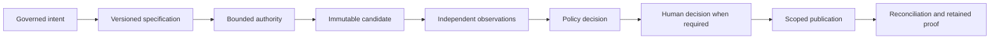

# Verification-First Software Factory — Mission Control Case Study

## The problem

An agent can generate code, run a test, and confidently report success while
still misunderstanding the request, exceeding its authority, weakening the
test system, or validating a different artifact from the one placed in a pull
request. The problem is not merely model accuracy. It is that ordinary agentic
coding workflows collapse specification, execution, verification, and
acceptance into one actor and one conversation.

That collapse makes four questions difficult to answer:

1. What exact outcome and constraints were authorized before implementation?
2. What exact source artifact was evaluated?
3. Which independent observations support each acceptance claim?
4. Which policy and accountable human allowed the next material action?

A serious AI Software Factory must answer those questions from durable records,
not from an agent's narrative.

## Why the problem exists

Large language models optimize for plausible continuation. They do not acquire
organizational authority, reliable memory, or accountability merely because
they can use tools. Repository state can also change between planning, testing,
approval, and publication. Distributed execution adds timeouts, retries,
duplicate events, stale leases, and ambiguous external results. Finally, a
green test suite proves only what the configured suite actually checked; it
does not prove requirement completeness, test integrity, architectural
conformance, or acceptable risk.

The architecture therefore has to make correctness claims explicit. It must
bind authorization, execution, evidence, and decisions to immutable subjects
and preserve disagreement and failure as first-class facts.

## Enduring Principle

The central principle is:

> No assertion without evidence. No autonomy without trust. No release without
> proof.

This does not mean a factory can prove software defect-free. It means no change
may enter a governed state unless it satisfies a predefined, measurable,
independently verified contract. The factory guarantees the integrity of the
process and evidence boundary, not perfection of the artifact.

The operating pattern is:

The durable insight is the separation of observation from decision. A test
result, security scan, or reviewer finding is evidence. Policy evaluates the
complete evidence set against the active contract. Approval accepts a specific
risk or grants a specific action. None of these records substitutes for the
others.

## Core domain model

The verification-first model adds assurance concepts without replacing the
authoritative delivery hierarchy.

| Concept | Responsibility | What it does not prove |
| --- | --- | --- |
| Quality Contract | Defines requirements, constraints, verification methods, gates, and approvals before execution | That implementation succeeded |
| Change Budget | Bounds files, change size, protected paths, and permitted change types | That an in-budget change is correct |
| Attempt | Preserves one immutable execution try and its authority | That the result is acceptable |
| Candidate | Identifies the exact committed source subject | That checks passed |
| Verification Run | Records the execution of defined checks against an exact subject | That the overall WorkOrder may advance |
| Evidence Envelope | Binds a typed claim, producer, method, time, and artifact to a subject | That the claim is sufficient or authoritative |
| Quality Gate Decision | Applies a versioned policy to the contract and evidence set | Permission for every future side effect |
| Publication Permit | Grants one scoped, expiring external action | Merge, deployment, or Mission acceptance |
| Proof Package | Projects the trace needed for human review and audit | A second source of truth |

The hierarchy remains Mission → Plan → WorkOrder → Task → Attempt → Evidence →
Pull Request. The assurance records explain why a transition is eligible; they
do not erase the separate ownership and acceptance boundaries in that
hierarchy.

## Tradeoffs

Verification-first architecture adds latency, storage, policy design, and
operator complexity. Independent environments cost more than self-review.
Immutable records require explicit supersession instead of convenient edits.
Failing closed can delay work when a verifier is unavailable. Strong candidate
binding makes seemingly harmless post-verification changes require another run.

These costs should be proportional to risk. Low-risk documentation work does
not need the same verifier set as authorization or migration code. However,
risk proportionality must not become an excuse to remove identity, authority,
lineage, or evidence integrity. A low-risk change can use fewer checks; it
cannot publish a different SHA from the one checked.

There is also a modeling tradeoff. Mission Control can create a separate
Quality Contract record or treat it as a versioned projection of the approved
Plan frozen into the WorkOrder. A separate record can clarify ownership and
reuse, but it can create parallel truth. A projection preserves the existing
hierarchy, but requires disciplined versioning and may produce a larger
WorkOrder contract. The product ADR set intentionally requires this question to
be settled before unnecessary schema expansion.

## Current Mission Control Implementation

At Mission Control commit
[`ff0524e`](https://github.com/jaydubya818/MissionControl/tree/ff0524ea0dac4159535d463fcf8787dc6dca0b91),
the P0 vertical slice is materially implemented. The WorkOrder contract can
carry typed requirements, negative constraints, a three-boundary Change
Budget, and a verification contract. The runtime creates candidate-bound
Verification Runs and Evidence Envelopes, recomputes verdicts server-side,
persists WorkOrder-level receipts, pauses for required human review, and issues
a continuation/publication authority before the durable GitHub path proceeds.

Useful implementation traces include:

- `packages/workflow-engine/src/verification.ts` for deterministic check and
  verdict semantics;
- `apps/orchestration-server/src/factoryVerification.ts` for verifier command
  execution;
- `apps/orchestration-server/src/factoryAttemptWorker.ts` for candidate,
  verification, review suspension, resume, and publication sequencing;
- `convex/lib/verificationPersistence.ts` for persisted verification evidence;
- `convex/factory/attempts.ts` for Attempt authority, approval, and terminal
  behavior; and
- `convex/schema.ts` for current durable records.

The implementation status is **partial P0**, not complete factory assurance.
The product documentation records a proposed explicit Quality Gate lifecycle,
a V1 verification profile, a threat model, recovery rules, and an integrated
golden-path manifest. Those documents now exist on `main`, but proposed records
and states remain design until source, tests, and browser evidence prove them.

The most important current boundary is evidence level. Component and runtime
tests demonstrate mechanisms. They do not yet satisfy the full browser-operated
Mission-to-verified-PR manifest with a deliberate failure and recovery.

## Future Vision

The longer-term system extends verification beyond pull-request eligibility.
Supply-chain attestations bind source, build, dependencies, and deployment
artifacts. Production policy governs canary progression through external CI/CD.
Telemetry verifies customer outcomes, SLOs, security, latency, and cost. Escaped
defects create governed recommendations for new tests, evaluations, prompts,
and policy changes. Humans explicitly promote those learning artifacts.

Agent Trust and Artifact Trust remain separate. Historical executor performance
determines eligible autonomy. Evidence for one exact candidate determines
confidence in that artifact. Policy combines trust eligibility, change risk,
and hard gates; no aggregate score overrides a critical failure.

## Notes and lessons learned

Use this section as a personal synthesis prompt. Do not copy product prose.

1. Verification is a plane of the architecture, but its decisions still belong
   in the control plane.
2. Candidate identity is the join key connecting implementation, evidence,
   approval, and publication.
3. Missing evidence is an explicit negative state, not an empty field that can
   be interpreted as success.
4. Retry is a new historical fact. It should create a new Attempt or
   Verification Run instead of cleaning up the old story.
5. A proof package is valuable only when it can be reproduced from canonical
   records and native artifacts.
6. Approval fatigue is reduced by explaining exceptions and evidence, not by
   hiding risk or asking humans to reread all generated code.

After studying the code, replace or expand these statements in your own words.
Record at least one disagreement with the current architecture and defend the
alternative.

## Design review questions

### Architecture

1. Why is an agent's report of passing tests not adequate evidence?
2. How would you bind verification to the exact pull-request artifact?
3. When should a changed candidate invalidate evidence?
4. How do observation, gate decision, approval, and publication authority
   differ?
5. Would you model the Quality Contract as its own aggregate or a projection of
   the approved Plan? Defend both sides.
6. How do idempotency and immutable Attempts interact during recovery?
7. What technical separation is sufficient for independent validation in a
   small company?

### Executive and skeptical CTO

1. Are you claiming the factory guarantees defect-free software?
2. How does verification-first engineering affect lead time and cost?
3. Why should the organization trust probabilistic agents at all?
4. How do you prevent approvals from becoming theater?
5. What evidence would you require before moving from delegated execution to
   governed autonomy?
6. Which parts of this architecture are implemented and which are still vision?

## Whiteboard exercises

### Exercise 1 — the assurance chain

From memory, draw Mission → Plan → WorkOrder → Attempt → Candidate →
Verification Run → Evidence → Gate Decision → Approval → Publication Permit →
Pull Request. Annotate each edge with the identity or authority that prevents a
stale subject from advancing.

Success means you can explain why no box can mark itself accepted.

### Exercise 2 — trust boundaries

Draw browser, Convex, Hono/orchestration, agent process, worktree, verifier,
GitHub, and CI. Mark credentials, untrusted inputs, immutable subjects, and
external side effects. Walk through candidate substitution, evidence replay,
test weakening, and cross-tenant evidence access.

Success means every threat has both a prevention control and a detection or
reconciliation path.

### Exercise 3 — three audiences

Explain verification-first architecture in:

- 30 seconds to a CEO, emphasizing accountable speed;
- two minutes to a CTO, emphasizing policy, evidence, and risk; and
- ten minutes to a principal engineer, including state, identity, failure, and
  tradeoffs.

## Hands-on mastery labs

### Lab operating contract

Use Mission Control commit `ff0524e` as the study baseline. Work in a disposable
worktree or read-only checkout and use only the controlled lab repository for
failure experiments. Before starting, be able to run repository search, inspect
TypeScript, follow Convex queries and mutations, and explain the authoritative
delivery hierarchy.

Retain a lab manifest containing the starting commit, duration, assistance
level, code paths studied, diagrams, answers, test or trace output, and a short
reflection. Large or sensitive recordings belong in private evidence storage
with a checksum reference. Remove disposable worktrees, branches, test records,
and local raw evidence after verifying retained proof; never rewrite product
history to make an exercise appear successful.

### Lab A — trace the implemented P0

At commit `ff0524e`, trace one typed requirement from WorkOrder persistence into
the verification engine, Evidence Envelope, human-review continuation, and
publication path. Produce a code-path diagram with file and symbol references.
Label every point where authority is checked and every value that binds the
candidate.

### Lab B — design a Quality Contract

Write a machine-readable contract for adding the required Business
Justification field to Mission creation. Include functional behavior,
non-functional constraints, negative constraints, Change Budget, risk,
required checks, evidence mappings, independence, freshness, and approval
policy. Introduce one ambiguity and one contradiction, then describe how plan
review should detect them.

### Lab C — break the proof

Model four failures: a missing required verifier, a passing result for the wrong
SHA, a duplicate late completion event, and a modified PR head after approval.
For each, identify the authoritative record, invalidated evidence, permitted
retry, need for a new Attempt or Verification Run, and operator recovery.

### Lab D — conduct the design review

Defend the architecture before a mock panel. One reviewer challenges cost and
latency, one challenges security and compromised verifiers, and one challenges
product usability. Record answers, identify weak explanations, and revise the
whiteboard.

### Mastery acceptance

This case study is mastered only when you can trace the implementation without
agent-supplied answers, identify current versus proposed behavior, design the
contract, recover a stale-subject failure on paper, and teach the system to a
developer, CTO, and CEO.

## Versioned references

- [Verification-First AI Software Factory](https://github.com/jaydubya818/MissionControl/blob/ff0524ea0dac4159535d463fcf8787dc6dca0b91/docs/software-factory/verification-first-ai-software-factory.md)
- [Software Factory Documentation Map](https://github.com/jaydubya818/MissionControl/blob/ff0524ea0dac4159535d463fcf8787dc6dca0b91/docs/software-factory/README.md)
- [Verification-First Architecture Decisions](https://github.com/jaydubya818/MissionControl/blob/ff0524ea0dac4159535d463fcf8787dc6dca0b91/docs/decisions/verification-first-architecture-decisions.md)
- [Quality Contract and Verification Domain Contracts](https://github.com/jaydubya818/MissionControl/blob/ff0524ea0dac4159535d463fcf8787dc6dca0b91/docs/software-factory/verification-first-domain-contracts.md)
- [Verification and Gate State Machines](https://github.com/jaydubya818/MissionControl/blob/ff0524ea0dac4159535d463fcf8787dc6dca0b91/docs/software-factory/verification-and-gate-state-machines.md)
- [Verification Plane Threat Model](https://github.com/jaydubya818/MissionControl/blob/ff0524ea0dac4159535d463fcf8787dc6dca0b91/docs/security/verification-plane-threat-model.md)
- [Failure, Recovery, and Reconciliation](https://github.com/jaydubya818/MissionControl/blob/ff0524ea0dac4159535d463fcf8787dc6dca0b91/docs/software-factory/verification-failure-recovery-reconciliation.md)
- [V1 Verification Profile](https://github.com/jaydubya818/MissionControl/blob/ff0524ea0dac4159535d463fcf8787dc6dca0b91/docs/software-factory/v1-verification-profile.md)
- [Golden-Path Demonstration Manifest](https://github.com/jaydubya818/MissionControl/blob/ff0524ea0dac4159535d463fcf8787dc6dca0b91/docs/validation/verification-first-golden-path-manifest.md)
- [Completion Plan](https://github.com/jaydubya818/MissionControl/blob/ff0524ea0dac4159535d463fcf8787dc6dca0b91/docs/plans/2026-08-11-feat-verification-first-completion-plan.md)
- [Verification engine source](https://github.com/jaydubya818/MissionControl/blob/ff0524ea0dac4159535d463fcf8787dc6dca0b91/packages/workflow-engine/src/verification.ts)
- [Factory verification runtime](https://github.com/jaydubya818/MissionControl/blob/ff0524ea0dac4159535d463fcf8787dc6dca0b91/apps/orchestration-server/src/factoryVerification.ts)
- [Factory Attempt worker](https://github.com/jaydubya818/MissionControl/blob/ff0524ea0dac4159535d463fcf8787dc6dca0b91/apps/orchestration-server/src/factoryAttemptWorker.ts)
- [Verification persistence](https://github.com/jaydubya818/MissionControl/blob/ff0524ea0dac4159535d463fcf8787dc6dca0b91/convex/lib/verificationPersistence.ts)
- [P0 validation evidence](https://github.com/jaydubya818/MissionControl/blob/ff0524ea0dac4159535d463fcf8787dc6dca0b91/docs/testing/evidence/verification-first-p0/README.md)
- [Mission Control PR #75](https://github.com/jaydubya818/MissionControl/pull/75)
