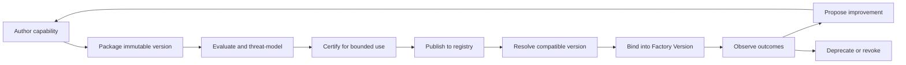

# Agent Factory Capability Supply Chain and Registries

## Quick Read

- **Purpose:** Explain how reusable agent capabilities move from an idea to an approved, discoverable, operable factory component.
- **Best for:** Platform architects, agent engineers, security engineers, and technical leaders defining the boundary between capability creation and delivery authority.
- **Prerequisites:** [Software Factory Stack Boundaries](../00-overview/05-software-factory-stack-boundaries.md) and [Agent Architecture](../06-ai-engineering/01-agent-architecture-mcp-tools-context-and-memory.md).
- **Reading time:** 14 minutes.
- **You will learn:** The records, gates, ownership, and lifecycle required for agent, skill, tool, prompt, model-profile, and evaluator registries.
- **Keep three ideas:** a registry is an authority surface, not a directory; a capability is a versioned dependency graph, not a name; and publication never authorizes delivery work.

## 1. The problem

Autonomous delivery depends on reusable capabilities, but many organizations manage those capabilities as loose prompt files, copied scripts, tool connections, and undocumented model settings. The same agent name can then resolve to different instructions, permissions, tools, and evaluation results across repositories. Operators cannot answer which version ran, who owns it, what it may access, whether it is compatible with the current harness, or how to revoke it.

This creates two failure classes. First, teams duplicate behavior and learn the same lesson repeatedly. Second, a convenient capability silently becomes production infrastructure without the controls normally applied to code, packages, identities, or deployment artifacts.

## 2. Why the problem exists

Agent components cross several ownership boundaries. A domain team may write a skill, a platform team may host its tools, security may approve its permissions, and a quality team may own its evaluation suite. Models and protocols also evolve independently. Filesystems and source repositories are useful authoring locations, but they do not provide runtime resolution, promotion status, revocation, compatibility, or organization-wide discovery.

The word “registry” is often applied too early. A searchable list is a catalog. A governed registry also owns canonical identity, immutable versions, provenance, dependencies, eligibility, lifecycle status, and policy-enforced resolution.

## 3. Enduring Principle

### Treat capabilities as governed supply-chain artifacts

The Agent Factory creates and manages reusable capabilities. The Software Factory consumes exact, approved versions to execute authorized delivery work. Keep those responsibilities separate:

### Use one capability identity model

Every registered capability needs:

- a stable identity, type, owner, source, license, and support tier;
- immutable version and digest;
- declared inputs, outputs, side effects, permissions, and data classifications;
- dependencies on tools, protocols, models, runtimes, policies, and other capabilities;
- evaluation suites, results, limitations, and known failure modes;
- compatibility ranges and qualified environment combinations;
- lifecycle state such as draft, candidate, certified, deprecated, quarantined, or revoked; and
- provenance from source revision through package and signature.

Agents, skills, tools, prompts, model profiles, evaluators, context packages, and workflow recipes share this envelope while retaining type-specific contracts. A tool needs executable schemas and side-effect declarations. A prompt needs parameter and output contracts. A skill needs decision criteria, examples, tools, and evaluation cases. An agent definition composes several of these artifacts.

### Separate catalogs from registries

The catalog is optimized for people and agents to discover capabilities. The registry is optimized for authoritative resolution. Search may use natural language, tags, domains, and examples; execution must resolve a canonical identity, version, digest, policy decision, and compatibility result.

### Make resolution fail closed

The resolver evaluates the entire dependency graph. It must reject missing versions, revoked transitive dependencies, incompatible harness features, unapproved data access, expired certification, or ambiguous ownership. “Latest” is not a reproducible execution binding.

## 4. Tradeoffs and alternatives

A central registry improves consistency and revocation but can become a bottleneck. Federated authoring with centrally enforced publication contracts usually preserves team autonomy while retaining common controls. Small organizations can begin with signed manifests in source control, provided runtime resolution and lifecycle state remain authoritative.

One universal schema simplifies tooling but can flatten meaningful differences between tools, prompts, skills, and agents. Use a shared envelope plus type-specific manifests. Avoid a single quality score: eligibility is multidimensional and risk-specific.

## 5. Current Mission Control Implementation

The current curriculum and studied implementation contain versioned agent records, skill discovery and linting, model routes, context packages, harness manifests, sandbox profiles, evaluation mechanisms, and Factory Version bindings. These are important components of an Agent Factory.

The current material does not yet demonstrate one canonical registry boundary with unified publication, dependency resolution, compatibility qualification, deprecation, quarantine, and revocation across every capability type. Exact skill-version binding and a complete capability promotion path remain incomplete. This chapter defines the missing operating contract; it does not claim the full registry exists in production.

## 6. Future Vision

An operator should be able to inspect any Attempt and traverse from the resolved capability graph to source, ownership, policy, evaluations, vulnerabilities, compatibility results, and later revocations. Agents should discover only capabilities eligible for their scope. A revoked component should block new resolution and identify every active Factory Version that requires remediation.

Promotion into current capability requires registry APIs, signed immutable manifests, policy tests, dependency resolution tests, revocation propagation, tenant isolation, and evidence from live resolution and rollback exercises.

## 7. Versioned references

- [Software Factory Stack Boundaries](../00-overview/05-software-factory-stack-boundaries.md)
- [Factory Configuration, Workflow Contracts, and Execution Manifests](../04-domain-model/02-factory-configuration-workflows-and-execution-manifests.md)
- [Coding Harnesses, Adapters, and Agent Protocols](../05-runtime-architecture/08-coding-harnesses-adapters-and-agent-protocols.md)
- [NIST Secure Software Development Framework](https://csrc.nist.gov/projects/ssdf), accessed 2026-08-30
- [SLSA specification](https://slsa.dev/spec/), accessed 2026-08-30

## 8. Notes and lessons learned

Capability reuse becomes safe only after ownership, identity, evidence, and retirement are as easy to inspect as the capability itself. The useful analogy is not an app store; it is a package registry combined with policy, qualification, and operational inventory.

## 9. Design review questions

1. Why is a searchable list not necessarily a registry?
2. Which metadata belongs in the shared capability envelope?
3. How should a resolver react to a revoked transitive tool dependency?
4. What should certification prove, and what can it never prove?
5. Why must capability publication remain separate from delivery authorization?

## 10. Whiteboard exercise

Draw the supply chain for an agent that composes two skills, three tools, a model profile, a context policy, and an evaluator. Add one incompatible harness, one revoked tool, one unowned dependency, and one expired evaluation. Mark where each condition is detected and who can approve an exception.

## 11. Hands-on lab

Create manifests for one agent, skill, and tool in a disposable directory. Give each a stable identity, immutable version, digest, owner, permissions, compatibility, evaluation reference, and lifecycle state. Implement or simulate resolution into one frozen Factory Version. Then revoke the tool and prove that new resolution fails while historical Attempts remain explainable.

Retain the manifests, resolver trace, failed-resolution evidence, and a short teach-back. Delete only disposable runtime files; preserve the evidence package.
