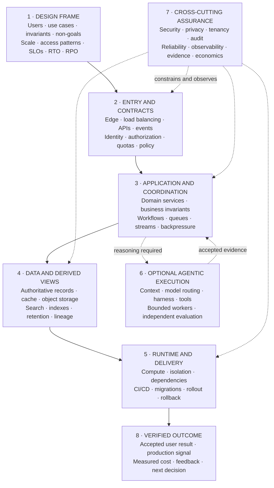
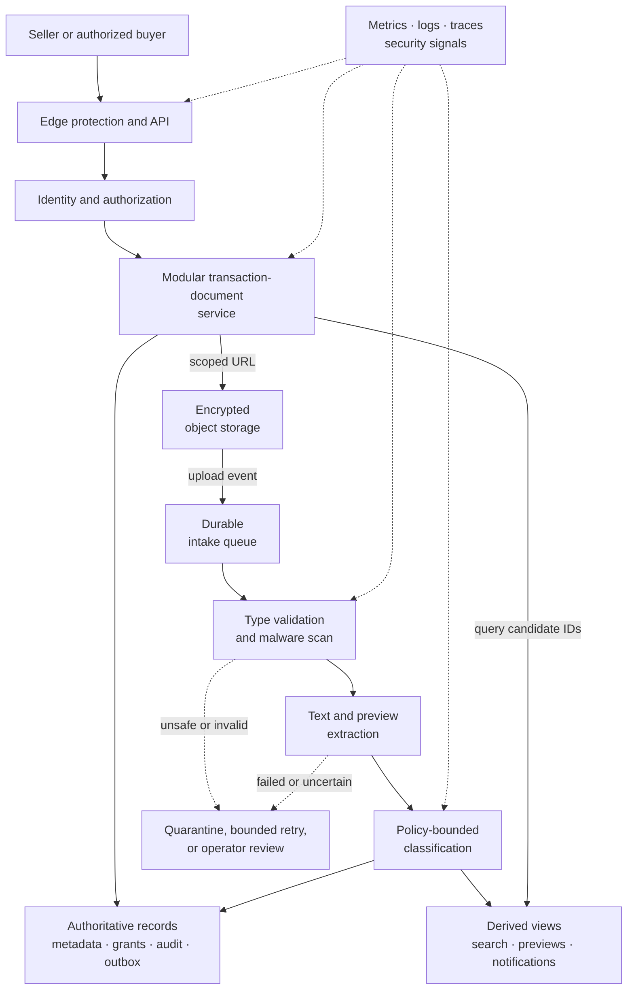

# Software Architecture and System Design Study Guide

## 1. The problem

Technical knowledge is not mastery until it can be reconstructed, defended,
and adapted under questioning. Executives need the business case and risk
model. Architects need boundaries and invariants. Engineers need implementation
and failure behavior. Operators need failure, recovery, and observability. A
single memorized pitch fails all four audiences.

## 2. Why the problem exists

AI discussions invite vague claims. Terms such as agent, autonomy, factory,
trust, and learning are used inconsistently. Reviewers and decision-makers test
whether a leader can separate vision from implementation, respond to
skepticism, quantify value, and make a hard tradeoff without hiding behind
jargon.

## 3. Enduring Principle

### Explain from one stable thesis

An AI Software Factory is a governed engineering operating model where humans
define intent, constraints, priorities, and acceptable risk while autonomous
agents plan, implement, validate, document, and improve software. Humans retain
accountability. Agents provide execution. The goal is to reduce the time from
business intent to validated customer value while improving quality,
governance, and engineering leverage.

The supporting thesis is: **trust the system, not the model**. The factory
assumes models will fail and uses bounded authority, independent validation,
evidence, policy, audit, recovery, and human decisions to make execution safe.

### Use audience-scaled explanations

**Thirty seconds — CEO:**

An AI Software Factory turns a governed business objective into validated
software through bounded agent execution. It is more than an AI coding tool:
it controls planning, authorization, quality evidence, delivery, and learning.
Humans remain accountable for risk. Success means faster validated customer
value, stable or lower failure, and greater engineering leverage.

**Two minutes — CTO:**

Start with a Mission containing outcome, constraints, acceptance criteria, risk,
and owner. Agents propose a versioned Plan; a human approves the relevant
version. The factory converts that authority into WorkOrders and Tasks. Each
Attempt runs with frozen policy, tools, context, repository scope, budget, and
identity. Independent validators attach evidence to criteria. The control plane
then presents a review-ready PR with exact lineage. Deployment may be performed
by existing CI/CD, but the factory governs policy, evidence, approval, and
production validation. Autonomy rises only after sustained outcomes and falls
when trust degrades.

**Ten minutes — architecture:**

Whiteboard company and repository scope, Mission through release hierarchy,
control and execution planes, policy evaluation, versioned Factory
Configuration, Task/Attempt state, lease and idempotency, worktree isolation,
agent/tool/context manifest, independent validation, evidence lineage, GitHub
boundary, production feedback, metrics, and trust calibration. For each arrow,
name the authoritative record, principal, invariant, failure, and recovery.

### Distinguish adjacent systems

| System | Primary value | Missing factory responsibility |
| --- | --- | --- |
| Coding assistant | Suggests code in a human session | Durable workflow and governed lifecycle |
| AI agent | Pursues a bounded objective with tools | Organization-wide authority and outcome model |
| Agent platform | Runs and observes agents | Engineering-specific intent-to-production governance |
| AI Software Factory | Governs the full lifecycle to validated customer value | Must prove, not merely claim, every stage |

### Answer objections through architecture

**“Models are probabilistic. Why trust them?”** Do not trust model confidence.
Trust a system that limits authority, validates independently, retains evidence,
and fails safely.

**“Isn’t this just CI/CD plus agents?”** CI/CD executes build and delivery
steps. The factory begins at governed business intent and owns planning,
authorization, agent execution, evidence-based acceptance, deployment
governance, production feedback, and controlled learning.

**“Won’t governance remove the speed?”** Poor governance does. Risk-based
policy automates routine decisions and escalates only surprises. Evidence
packages reduce review reconstruction.

**“Why not wait for better models?”** Better models improve a component. They
do not create identity, policy, isolation, audit, independent evidence, or
organizational accountability.

**“Will this replace engineers?”** It changes the unit of work and raises the
importance of intent, architecture, quality systems, product judgment, and
governance. Workforce effects are real, but a credible leader does not promise a
fixed outcome from immature evidence.

### Structure architecture answers

Use this sequence under pressure:

1. Clarify users, use cases, outcome, constraints, risk, and non-goals.
2. Quantify scale, access patterns, latency, availability, retention, and
   recovery objectives.
3. Define API, event, data, ownership, and state-transition contracts.
4. Draw the high-level request and data flows before naming products.
5. Resolve identity, policy, authorization, privacy, and trust boundaries.
6. Explain consistency, concurrency, idempotency, failure, and recovery.
7. Establish verification, observability, evidence, and operational ownership.
8. State the primary tradeoff, current limitation, cost envelope, and staged
   rollout.

Use this memory line:

> **Requirements → Scale → Contracts → Data flow → Trust boundaries → Failure
> semantics → Operations → Economics → Tradeoffs → Rollout**

### The vendor-neutral master architecture map

This is a reasoning map, not a prescribed stack. Start at the user-visible
outcome, trace the request and data paths, and then apply the cross-cutting
controls. Add the agentic lane only when the workload requires probabilistic
reasoning or tool use.

For every arrow, be able to name the contract, principal, timeout, retry or
replay rule, data classification, observable signal, and owner. If one of those
answers is missing, the boundary is not ready to ship.

### Translate layer diagrams into the canonical models

Reference diagrams often use labels such as interface, planner, router,
runtime, sandbox, verification, approval, and learning. Treat that stack as an
**implementation view**, not a third top-level architecture. Translate it back
to the guide's two canonical models before using it:

| Reference-diagram concern | Six-area owner | Eight-stage location |
| --- | --- | --- |
| Builder interfaces, intent capture, and planning | **Intent** | Builder Intent and Plan |
| Workload classification and model or capability routing | **Model** and **Capability** | Define Agent |
| Harness, tools, context, state, and sandbox | **Harness**, **Capability**, and **Trust** | Define Agent through Apply Skills |
| Implementation, tests, scanning, review, and evaluation | **Harness** and **Trust** | Execute through Harness through Evaluate |
| Human approval, merge, and release | **Intent** and **Trust** | Deliver Software |
| Outcomes, telemetry, feedback, and controlled adaptation | **Learning** | Improve and Deliver Software |

This translation keeps an implementation diagram useful without asking the
reader to memorize another lifecycle. If a box cannot be assigned an owner and
a stage, the diagram is hiding a responsibility or inventing an ungoverned
side path.

### Classify agent configurations on independent axes

Reference diagrams also present *reactive agent*, *deliberative agent*,
*tool-using agent*, *retrieval-based agent*, and *multi-agent system* as five
agent types. That framing mixes independent axes. Reactive versus deliberative
describes control behavior; tool use describes a capability; retrieval
describes a knowledge path; and multi-agent describes a topology. A production
configuration can occupy all four descriptions at once.

Use the labels as a detail lens for an Agent Definition, not as another
architecture or maturity ladder:

| Axis | Question | Examples |
|---|---|---|
| Trigger | What starts a turn? | Human request, repository event, schedule, webhook, another agent |
| Control behavior | How much judgment and planning occurs before action? | Deterministic reaction, bounded loop, explicit multi-step plan |
| Capability profile | What can the configuration observe and do? | Retrieve, analyze, generate, call tools, modify state |
| Knowledge mode | Where does decision context come from? | Frozen inputs, live APIs, governed retrieval, semantic or graph traversal |
| Topology | How is work divided? | Single agent, router, delegation, creator–verifier, parallel specialists |
| Authority and autonomy | Which actions may proceed, for how long, under which gates? | Read-only, propose-only, reversible mutation, consequential action; per-step or exception-based review |

Start from the workload and select one value on each axis. A low-latency
notification may use deterministic reaction with no model at all. A repository
migration may use a deliberative loop with tools and retrieval, followed by a
fresh-context verifier. Multi-agent is not the destination at the right edge of
a maturity chart, and retrieval is not a species of worker. Treating traits as
types creates duplicate runtimes, bundles broad permissions with broad labels,
and makes evaluation impossible to attribute. One governed runtime with
task-specific profiles is usually the simpler system.

This correction was prompted by two user-supplied visuals reviewed on
2026-09-04: Quantumatix Technologies' *Types of AI Agents* and the unattributed
*Must-Know Agentic AI Concepts*. The former supplied the mixed labels; the
latter corroborated the guide's existing loop, memory, context, state, quality,
control, safety, routing, and coordination coverage. Neither visual is treated
as implementation evidence or a new canonical model.

### Open with questions that change the design

Do not begin by drawing boxes. Establish the decision frame first:

- Who are the users and systems, and what are their highest-value workflows?
- Which operations are reads, writes, streams, batches, or long-running jobs?
- What is the expected and peak load, payload size, concurrency, and growth?
- Which data must be strongly consistent, durable, private, retained, deleted,
  or region-bound?
- What are the latency, availability, recovery-time, and recovery-point goals?
- Which actions are irreversible or require human or policy authority?
- What is explicitly out of scope for this version?

State reasonable assumptions when an answer is unavailable. A visible
assumption can be challenged; a hidden assumption becomes an accidental
architecture decision.

### Quantify scale before selecting technology

Back-of-the-envelope estimates need not be perfect. They need to expose the
dominant constraint. Estimate:

- average and peak requests or events per second;
- read-to-write ratio and concurrent active work;
- payload and object sizes, retention period, and annual storage growth;
- ingress, egress, replication, and model or compute demand;
- acceptable p50, p95, and p99 latency for the critical path;
- availability target, capacity headroom, RTO, and RPO.

Use simple arithmetic and narrate it. Requests per second are daily requests
divided by active seconds, adjusted by a peak factor. Bandwidth is throughput
times payload size. Storage growth is writes times record size times retention,
plus indexes and replicas. These estimates tell you whether a single database,
a cache, partitioning, asynchronous work, or regional placement is actually
necessary.

Numbers such as 15,000 builders or 100,000 repositories are useful stress-test
inputs. Treat them as scenario assumptions, not factual claims about a named
organization, unless the research record includes an attributable source,
date, URL, and the claims derived from it.

### Define contracts and data ownership

For each boundary, name the contract and its owner. An API contract includes
request and response schemas, authentication, authorization, idempotency,
pagination, rate limits, error semantics, timeouts, and versioning. An event
contract adds ordering scope, partition key, delivery expectation, schema
evolution, replay policy, and sensitive-data rules.

For each important entity, identify:

- the authoritative source of truth;
- legal state transitions and invariants;
- the write owner and allowed readers;
- the transaction boundary;
- indexes and access paths;
- retention, deletion, lineage, and audit requirements.

Choose storage from access and correctness requirements. Relational stores are
the default when transactions, constraints, and joins matter. Key-value and
document stores fit simple, high-scale access patterns. Object stores fit large
immutable artifacts. Search and vector systems are derived indexes, not the
authoritative record, unless the design explicitly proves otherwise.

### Make distributed-system semantics explicit

| Concern | Decision to state | Common failure |
| --- | --- | --- |
| Consistency | Which operations need strong, causal, session, or eventual consistency? | Applying one global consistency model without regard to user-visible invariants |
| Transactions | What is atomic locally, and how are cross-service changes coordinated? | Treating a distributed workflow as one database transaction |
| Messaging | What are the delivery, ordering, retry, dead-letter, and replay semantics? | Claiming exactly-once delivery without idempotency and deduplication |
| Concurrency | Where are optimistic checks, locks, leases, or compare-and-set required? | Last-write-wins silently violating a business invariant |
| Partitioning | What is the partition key, and what creates hot keys or skew? | Sharding before knowing the access pattern |
| Caching | What is cached, for how long, and how is staleness bounded or invalidated? | Adding a cache without an invalidation and failure policy |
| Time | Which decisions depend on wall-clock order, deadlines, or expiration? | Assuming clocks across machines are perfectly ordered |

At-least-once delivery plus idempotent consumers is a sound default for many
workflows. If a business operation must occur once, enforce that invariant with
an idempotency key, uniqueness constraint, transactional outbox, or durable
deduplication record—not with a broker slogan.

### Choose an architecture style deliberately

Start with the simplest deployable boundary that meets the requirements. A
modular monolith is often the right first production architecture for a small
team because transactions, local reasoning, and operations remain simple.
Separate services when independent scaling, release cadence, ownership,
failure isolation, data sensitivity, or regulatory boundaries justify their
coordination cost.

Use synchronous calls when the caller needs an immediate result and the
dependency can fit inside the latency and availability budget. Use queues or
streams to absorb bursts, decouple availability, preserve events, or run work
outside the request path. Use batch for bounded datasets and relaxed freshness;
use streaming when continuous low-latency reaction materially changes the
outcome. Each additional boundary creates versioning, observability, security,
and failure work that must be owned.

### Trace traffic and regional topology

Trace one request from the client through DNS, edge protection or CDN, gateway
or load balancer, application service, cache, database, queue, and downstream
dependencies. State where TLS terminates, authentication and rate limits are
enforced, services are discovered, health is checked, and connection pools are
bounded. Explain whether large uploads or downloads pass through application
servers or use scoped object-store URLs.

For regional design, choose intentionally among one region, active–passive, or
active–active operation. Identify the write authority, replication direction,
failover trigger, traffic-shift mechanism, data-residency boundary, and user-
visible behavior during partition or recovery. Multi-region compute does not
create multi-region correctness by itself.

### Design failure, overload, and recovery together

For every critical dependency, ask what happens when it is slow, unavailable,
duplicated, partially successful, or returns stale or malformed data. Cover:

- deadlines and timeouts at every remote boundary;
- bounded retries with exponential backoff and jitter;
- idempotency and reconciliation for partial success;
- circuit breakers, bulkheads, admission control, and load shedding;
- queue limits, backpressure, priority, fairness, and dead-letter handling;
- graceful degradation and which features may be disabled first;
- zone or region loss, failover, backup restoration, RTO, and RPO;
- replay, repair, and operator-controlled recovery.

A retry is additional load on a system already failing. A queue is not infinite
capacity. A backup is not a recovery plan until restoration is tested. Describe
the failure path with the same precision as the happy path.

### Treat security, privacy, and tenancy as architecture

Draw trust boundaries and identify the principal on every consequential call.
Separate authentication from authorization. Use workload identity and
short-lived credentials, apply least privilege, encrypt data in transit and at
rest, and audit material decisions.

For multi-tenant systems, state how identity, authorization, storage, caches,
queues, encryption keys, quotas, telemetry, and operator access preserve tenant
isolation. Address noisy-neighbor controls as well as data leakage. Classify
sensitive data and define collection, use, retention, deletion, residency, and
redaction rules. Threat-model assets, entry points, abuse paths, supply-chain
dependencies, and recovery—not only the login endpoint.

### Make the system operable

Define service-level indicators around user-visible outcomes, then set service-
level objectives and an error-budget policy. Include saturation and dependency
health, not only request counts. Correlate logs, metrics, traces, state changes,
deployments, and audit events with stable identifiers so an operator can
reconstruct a failed transaction or workflow.

Name the owner, alert, runbook, dashboard, escalation path, and recovery action
for each critical failure mode. Observability explains what happened;
evaluation or acceptance evidence determines whether the result was good.

### Close requirements with a production-quality checklist

This is a **design checklist**, not another architecture model. Give each item
a measurable target, an owner, and a proof method:

| Quality | Decision that must be explicit |
| --- | --- |
| Scalability | Expected and peak load, capacity headroom, and first bottleneck |
| Security | Human and workload identities, least privilege, data boundaries, and threat model |
| Reliability | Availability target, degraded behavior, failover, RTO, and RPO |
| Performance | Critical-path p50, p95, and p99 targets and the synchronous/asynchronous split |
| Observability | Correlation identifiers, logs, metrics, traces, audit events, and actionable alerts |
| Cost efficiency | Budget, dominant cost driver, and cost per accepted outcome |
| Extensibility | Versioned contracts for replacing or adding models, tools, skills, and integrations |
| Usability | Paved workflow, accessibility, visible state, and recovery from user-visible failure |
| Governance | Risk classification, policy enforcement, approval authority, and retained evidence |
| Maintainability | Ownership, modular boundaries, change safety, runbooks, and tested restoration |

"Enterprise-grade" is not a requirement. A target and a way to verify it are.

### Design for safe evolution

Architecture includes how the system changes while it is running. Cover API and
event compatibility, schema evolution, feature flags, configuration versioning,
canary or progressive delivery, and rollback. Prefer expand–migrate–contract
for schema changes: add compatible structures, migrate and verify, switch
readers and writers, then remove the old form only after evidence shows it is
unused.

Rollback does not automatically reverse emitted events, external side effects,
or data migrations. Name the compensating or forward-fix path. Version every
behavior-changing dependency and make the release unit observable and
reversible where practical.

### Prove the architecture, not only the code

Turn the important claims into tests. Use contract tests for APIs and events,
integration tests for boundaries, load and soak tests for capacity assumptions,
fault injection for degraded dependencies, security tests for trust boundaries,
and restore drills for recovery promises. Shadow traffic, canaries, and
production verification test assumptions that pre-production environments
cannot reproduce safely.

Record consequential choices in short architecture decision records: context,
decision, alternatives, consequences, owner, and the measured condition that
would cause reconsideration. A diagram shows components. A decision record
explains why those components and boundaries should exist.

### Add the agentic layer only after the base system is sound

Agentic systems add probabilistic planning, context selection, model routing,
tool use, and semantic evaluation; they do not replace conventional system
design. Apply the preceding capacity, contract, data, security, reliability,
and operations decisions first. Then add:

- a stable capability contract with model-specific adapters;
- a deterministic control plane around probabilistic execution;
- permission-aware context with provenance and data boundaries;
- ephemeral workers with externally enforced identity, tools, network, time,
  compute, and budget limits;
- deterministic tests plus independent semantic evaluation;
- replayable evidence for model, prompt, context, tool, and policy versions;
- governed fallback, rollout, learning, and promotion.

The model may propose. Policy authorizes. The runtime executes. Independent
evidence supports acceptance.

### Design code review as a layered service

Estate-scale code review should not become one generic reviewer or one bespoke
agent per repository. Use one shared service with four layers of specialization:

1. **Shared control:** security policy, finding taxonomy, model and capability
   routing, evaluation, observability, and common severity rules.
2. **Product or domain:** language and framework standards, product
   architecture, shared libraries, and known failure patterns.
3. **Repository:** a versioned profile containing ownership, build and deploy
   metadata, repository instructions, relevant history, dependency impact, and
   repository-specific context.
4. **Governed learning:** dismissed and accepted findings, corrections, and
   incidents become proposals; offline evaluation and risk-based approval
   decide whether a change is promoted and at which scope.

Measure actionable-finding precision, severe misses, reviewer correction and
dismissal burden, time to reviewed change, cost per accepted finding, and
outcomes after merge. Finding count alone rewards noise. [Chapter 26](../03-build/26-autonomous-engineering-workflows.md)
owns repository intelligence at estate scale; [Chapter 39](../06-improve/39-production-feedback-review-and-the-agentic-merge-queue.md)
owns the review system and merge queue.

### Practice implementation, not only explanation

Use a consistent build sequence: clarify inputs, outputs, constraints, and edge
cases; state the design; implement the smallest working path; add tests; explain
tradeoffs and the next improvement; then revise from feedback. Practice with
small components whose boundaries are visible. Small-first is a sequencing
rule, not permission to postpone safety. The first slice may omit horizontal
scale, adaptive routing, and durable recovery. It may not omit a required
authorization check, an externally enforced stop condition, deterministic
input and output validation, or an explicit failure result when the component
can spend money or cause an effect.

Give every implementation the same compact contract: typed input and output,
state owner, allowed side effects, authority check, resource budget, externally
observable completion condition, failure classes, and evidence emitted. Then
use this matrix to decide whether the small implementation is credible:

| Component | Smallest credible behavior | Boundary tests that earn the next step |
| --- | --- | --- |
| Model router | Filters to eligible, policy-compliant profiles, then selects the lowest-cost route that meets the quality and latency bar | Missing requirements, sensitive workload, oversized context, preferred route unavailable, and no eligible route |
| Tool registry and gateway | Registers a versioned schema; resolves the requested tool; authorizes the exact action; validates arguments and result; records a receipt | Unknown tool, malformed arguments, denied scope, timeout, unsafe result, and duplicate side-effect request |
| Bounded agent loop | Accepts a goal, proposes and authorizes one action at a time, observes structured results, measures progress, and stops outside the model | Success, max iterations, repeated failure, no progress, malformed output, cancellation, exhausted budget, and escalation |
| Task-graph scheduler | Validates an acyclic graph, releases only dependency-ready work, and enforces a concurrency limit | Cycle, missing dependency, failed predecessor, duplicate completion, partial branch failure, restart, and conflicting writers |
| Retry and circuit boundary | Retries only classified transient failures with backoff and jitter; opens after the threshold; preserves the final error | Permanent error, authorization denial, lost response after a side effect, exhausted retry budget, half-open probe, and recovery |
| Execution budget | Reserves estimated capacity before work, records actual model, tool, compute, and retry cost, and prevents overspend | Estimate exceeds remainder, concurrent reservations, actual cost exceeds estimate, cancellation, and optional-work shedding |
| Evaluation runner | Runs the same versioned cases against baseline and candidate, separates subject from evaluator, and emits replayable results | Subject failure, evaluator failure, malformed result, missing evidence, non-determinism, and a severe regression hidden by a better average |
| Code-review pipeline | Runs deterministic checks first, applies semantic review to the smallest sufficient context, normalizes findings, and preserves human authority | Stale head, duplicate and suppressed finding, hostile repository instruction, unsupported severity, unavailable reviewer, and required human gate |

Cover six failure families across the set: invalid or oversized input; unavailable
or malformed dependencies; time, token, compute, and concurrency exhaustion;
duplicate, out-of-order, partial, or crash-recovered state; unauthorized tools,
data, or instructions; and concurrent mutation of shared state. Add complexity
only when a failing test or measured production risk justifies it.

These are implementation slices, not miniature production platforms. The
owning chapters are [14](../03-build/14-durable-execution.md),
[18](../03-build/18-agent-architecture.md),
[21](../03-build/21-models-and-capability-selection.md),
[22](../03-build/22-routing-and-the-escalation-ladder.md),
[23](../03-build/23-agent-and-loop-engineering.md),
[29](../04-prove/29-evaluation-engineering.md), and
[39](../06-improve/39-production-feedback-review-and-the-agentic-merge-queue.md).

### Handle reliability and security incidents consistently

Use one operating sequence under pressure:

> **Clarify → Contain → Observe → Isolate → Restore → Correct → Prevent →
> Measure**

Clarify the affected builders, workflows, tenants, repositories, data, and
business impact. Contain unsafe execution with scoped cancellation, authority
reduction, credential revocation, or a kill switch. Preserve traces, events,
tool calls, policy decisions, artifacts, and evidence. Isolate the failure to
intent, context, model, tool, state, policy, or evaluation. Restore a known-safe
version, correct and reconcile the defect, add a regression evaluation and
stronger control, then measure the affected cohort until confidence returns.

Practice the sequence against production-agent failure, reliability or
evaluation regression, model degradation or provider outage, tool misuse,
prompt injection, malicious repository content, secret exfiltration, MCP
poisoning, privilege escalation, unauthorized file or data access, sandbox
escape, approval bypass, supply-chain compromise, cross-tenant leakage, failed
deployment, and runaway token spend.

The governing security thesis is: **an agent should receive the minimum
context, tools, permissions, time, and budget required for the task—and every
consequential action should produce evidence.**

### Lead adoption through progressive proof

A serious adoption begins with one controlled repository and one
`Governed Issue → Validated Pull Request` path. Establish baselines, keep human
merge authority, classify risk, measure review burden and failure, and increase
autonomy only after sustained evidence. Scale a proven operating model, not a
demo.

### Make the technical thesis falsifiable

A point of view becomes useful when it predicts something the program can
measure. Test five propositions rather than presenting them as inevitable:

| Proposition | Evidence to demand |
| --- | --- |
| Intent becomes the interface | More roles can initiate governed work without lower acceptance quality or more clarification loops |
| Models become execution resources | Routing changes cost or quality while workflow contracts and authority remain stable |
| Harnesses become control infrastructure | Runtime controls reduce unsafe effects, failed recovery, and unreconstructable runs |
| Verification becomes the bottleneck | Accepted throughput is constrained more by trustworthy proof and human review than by code generation |
| Learning becomes governed infrastructure | Promoted changes improve held-out and production outcomes without unacceptable regression |

State what result would weaken each proposition. Technical vision should guide
investment and experiments; it should not turn a plausible future into a
present-tense fact.

## 4. Tradeoffs and alternatives

Strong opinions demonstrate judgment, but dogma signals shallow understanding.
State the default, the conditions that justify it, and when another design is
better. Do not use Mission Control’s stack as the universal definition of a
factory.

Close every design with a decision ledger:

| Decision | What to say |
| --- | --- |
| Primary choice | The simplest architecture that satisfies the stated constraints |
| Rejected alternative | Why it loses under this workload, team, risk, or cost profile |
| Bottleneck | The first resource or dependency expected to saturate |
| Failure boundary | What can fail independently and how the system responds |
| Correctness boundary | Which invariant cannot be relaxed |
| Cost driver | Which request, byte, replica, model call, or human review dominates cost |
| Evidence | Which metric, test, trace, or experiment would validate the decision |
| Evolution trigger | What measured change would justify a more complex design |

Memorized answers are useful scaffolding but fail under follow-up. Practice
causal chains: why the problem exists, which invariant matters, what the design
costs, how it fails, and what evidence changes your mind.

## 5. Current Mission Control Implementation

Mission Control at commit
[`b31e27564deb1c03c167e61b5ee094567c2ba7b1`](https://github.com/jaydubya818/MissionControl/tree/b31e27564deb1c03c167e61b5ee094567c2ba7b1)
is a living case study, not a completed factory.

It has the Mission/Plan/WorkOrder/Task/Attempt hierarchy, versioned Factory
Configuration and readiness, policy and approval primitives, WorkflowRuns and
events, independent evidence concepts, scoped context packages, service and
GitHub identity contracts, operational analytics, and a browser-proven
control-plane path through WorkOrder release.

It has not yet proven the complete browser-operated real Codex-to-GitHub path.
The retained run stopped because no active Governance Policy and Factory
Configuration existed, the GitHub App was not configured, todo 024 was
incomplete, and the runtime was dirty. Trust Score, automatic autonomy
calibration, first-class Risk Review, governed MCP, production memory, complete
deployment governance, and intent-to-customer-value economics remain partial or
future.

The strongest review posture is to explain both the implemented foundation
and the unproven boundary without embarrassment. Accurate limitation is an
architecture skill.

## 6. Ongoing practice

The guide maintains accepted lab evidence, recorded whiteboards, timed
explanations, objection drills, and post-review retrospectives. A claim
graduates only when it can be traced, operated, broken, recovered, and taught
without agent assistance.

## 7. Versioned references

- [Mission Control North Star](https://github.com/jaydubya818/MissionControl/blob/b31e27564deb1c03c167e61b5ee094567c2ba7b1/docs/product/mission-control-north-star.md)
- [V1 Product Strategy](https://github.com/jaydubya818/MissionControl/blob/b31e27564deb1c03c167e61b5ee094567c2ba7b1/docs/product/mission-control-v1-product-strategy.md)
- [AI Software Factory V1 decisions](https://github.com/jaydubya818/MissionControl/blob/b31e27564deb1c03c167e61b5ee094567c2ba7b1/docs/decisions/ai-software-factory-v1-decisions.md)
- [Golden-path assessment](./mission-control/evidence/2026-08-08-golden-path/README.md)
- [Guide writing standard](../../archive/guide-v1/writing-standard.md)
- [Platform Blueprint and Operating Playbook](../01-understand/02-the-factory-in-one-view.md)

### External foundations

| Author and exact source | Publication / access | Source type | Claims derived here |
| --- | --- | --- | --- |
| Salim Virji, James Youngman, Henry Robertson, Stephen Thorne, Dave Rensin, and Zoltan Egyed, with Richard Bondi, [“Introducing Non-Abstract Large System Design”](https://sre.google/workbook/non-abstract-design/) | 2018 / 2026-09-03 | Official documentation | Begin with requirements, quantify resource assumptions, and iterate for feasibility and resilience. |
| Steven Thurgood and David Ferguson, with Alex Hidalgo and Betsy Beyer, [“Implementing SLOs”](https://sre.google/workbook/implementing-slos/) | 2018 / 2026-09-03 | Official documentation | Define user-centered SLIs and SLOs, then use error budgets to make reliability tradeoffs. |
| Marc Brooker, [“Timeouts, retries, and backoff with jitter”](https://d1.awsstatic.com/builderslibrary/pdfs/timeouts-retries-and-backoff-with-jitter.pdf) | 2019 / 2026-09-03 | Vendor claim | Remote calls need timeouts; retries add load and should be bounded with backoff and jitter. |
| Malcolm Featonby, [“Making retries safe with idempotent APIs”](https://aws.amazon.com/builders-library/making-retries-safe-with-idempotent-APIs/) | Publication date not shown / 2026-09-03 | Vendor claim | Retried operations need explicit idempotency semantics when duplicate side effects are unacceptable. |
| Scott Rose, Oliver Borchert, Stu Mitchell, and Sean Connelly, [NIST SP 800-207, “Zero Trust Architecture”](https://csrc.nist.gov/pubs/sp/800/207/final) | 2020-08 / 2026-09-03 | Official documentation | Do not grant implicit trust by network location; make authentication, authorization, and resource access explicit. |
| OWASP GenAI Security Project, [“Securing Agentic Applications Guide 1.0”](https://genai.owasp.org/resource/securing-agentic-applications-guide-1-0/) | 2025-07-27 / 2026-09-03 | Official documentation | Agentic applications require concrete controls for model, context, tool, identity, and autonomous-action risks. |

The supplied study graphics have unknown provenance. They informed the practice
prompts only and are not evidence for named-company scale, implementation, or
industry claims.

## 8. Notes and lessons learned

The most defensible differentiation is not “our agents are smarter.” It is that
the operating system makes probabilistic execution governable. The hardest
executive discipline is refusing to convert a roadmap into a present-tense
claim.

## 9. Architecture and system-design questions

### Executive

1. Why now, and what evidence would cause you to slow adoption?
2. How does the factory change engineering economics and organization design?
3. Which risks always remain human-owned?
4. What does a 90-day proving program need to demonstrate?

### Architecture

1. Design the factory for 100 repositories and several risk tiers.
2. How do you prevent duplicate effects after a worker crash?
3. How do policy, identity, context, validation, and trust interact?
4. What is the minimum independent-validation boundary?

### Requirements and scale

1. Which requirement most changes this design, and what is explicitly out of
   scope?
2. Estimate peak throughput, bandwidth, storage growth, and concurrency.
3. Which path owns the p99 latency budget, and where can work become
   asynchronous?
4. What are the availability, RTO, and RPO targets, and what do they cost?

### APIs, data, and distributed systems

1. What is the source of truth for each core entity, and who may write it?
2. Which invariants require a transaction or strong consistency?
3. How are duplicate messages, partial success, replay, and out-of-order events
   handled?
4. What is the partition key, and how does the design handle hot partitions?
5. What can be cached, how stale may it become, and what is the invalidation
   strategy?
6. How do contracts and schemas evolve without coordinated downtime?

### Reliability and operations

1. What happens when the slowest dependency times out for ten minutes?
2. How does the system behave when the queue is full or demand exceeds safe
   capacity?
3. Can the team restore from backup inside the promised recovery objective?
4. Which user-visible SLIs define success, and which alerts require action?
5. How are a failed release, irreversible side effect, or incomplete migration
   recovered?

### Security, privacy, and tenancy

1. Where are the trust boundaries, and which principal performs each action?
2. How is tenant isolation preserved across storage, cache, queue, telemetry,
   and operator access?
3. What sensitive data is collected, where may it travel, and when is it
   deleted?
4. What supply-chain or privileged-tool compromise creates the largest blast
   radius?

### Agentic systems

1. Which decisions require model reasoning, and which should remain
   deterministic?
2. What prevents retrieved instructions from gaining authority?
3. How are model, prompt, context, tool, policy, and evaluator versions replayed
   and compared?
4. What is the independent acceptance boundary when the producer is
   probabilistic?
5. What evidence permits a fallback model, higher autonomy, or a learned change
   to reach production?

### Adversarial

1. Your change failure rate rose while lead time fell. What do you do?
2. A security validator fails while two other validators pass. What happens?
3. An agent created a correct PR outside its WorkOrder scope. Is it acceptable?
4. A board member asks for a headcount reduction forecast. How do you answer?

## 10. Whiteboard exercise

In 20 minutes, design one realistic system from user intent to a verified
outcome:

1. Spend three minutes clarifying requirements, scale, SLOs, risk, and
   non-goals.
2. Spend four minutes defining APIs or events, the core data model, and the
   authoritative records.
3. Spend five minutes drawing the happy-path request and data flow with trust
   boundaries.
4. Spend four minutes on overload, partial failure, retry, recovery, and
   observability.
5. Spend four minutes on the primary tradeoff, cost driver, rollout, and the
   evidence that would change the design.

Practice with a file-processing service, marketplace transaction flow,
notification platform, multi-tenant workflow engine, repository-indexing
service, and governed agent execution platform. Remove all product names and
prove that each architectural choice still follows from the requirements.

Score the result from one to five on requirements, estimates, contracts, data,
reliability, security, operations, tradeoffs, and communication. Any score
below four becomes the next study drill.

## 11. Worked example: secure transaction-document processing

### The prompt

Design a multi-tenant service where sellers upload confidential transaction
documents, authorized buyers can search and review them, and every access or
processing action is auditable. Files may require malware scanning, text
extraction, classification, and optional assisted review before publication.

The goal is not to name every possible component. The goal is to show how the
study method produces a simple, trustworthy V1.

### Clarify requirements and non-goals

**Core workflows:**

1. A seller creates a transaction workspace and grants access to named users.
2. An authorized seller requests an upload and sends a file directly to object
   storage through a short-lived scoped URL.
3. The service validates, scans, extracts, classifies, and indexes the file.
4. An authorized buyer lists, searches, previews, and downloads published
   documents.
5. A seller revokes access, replaces a document, or requests deletion.
6. An operator investigates failed processing without gaining unnecessary
   access to document contents.

**Correctness and trust requirements:**

- A user must never read a document without a current access grant.
- An unscanned or quarantined file must never be published.
- A document version becomes visible only after required processing succeeds.
- Revocation must affect new reads immediately; search results may be briefly
  stale but cannot grant access.
- Upload, processing, publication, access, revocation, and deletion decisions
  must be reconstructable from audit records.

**V1 non-goals:** payment movement, anonymous public links, legal conclusions,
guaranteed automated classification, and active–active writes across regions.
Those concerns materially change the trust and compliance design and should not
be smuggled into the first release.

### State the scale assumptions

Assume 5,000 tenant organizations, 20,000 uploads per day, a 10 MB average file,
and a 25-upload-per-second peak. That is roughly 200 GB of new object data per
day before versions and replicas. Metadata and audit traffic are much smaller
than file traffic, while text extraction and previews dominate compute.

Target p95 under 300 ms for metadata operations, p95 under five minutes from
upload completion to a processed or actionable failed state, and 99.9%
availability for metadata and authorized download initiation. Use a 15-minute
metadata RPO and two-hour RTO for V1, then validate whether the business and
regulatory requirements demand more. Keep capacity for a peak backlog without
letting uploads exhaust interactive database or API capacity.

### Define the authoritative records

| Record | Purpose and invariant |
| --- | --- |
| Tenant | Security and billing boundary; every governed record belongs to exactly one tenant |
| User and Membership | Principal and role inside a tenant or transaction workspace |
| Transaction Workspace | Container for participants, documents, policy, and retention |
| Access Grant | Current authority to list or read workspace content; checked on every read |
| Document | Stable logical identity and seller-controlled metadata |
| Document Version | Immutable object reference, checksum, state, and publication decision |
| Processing Attempt | Versioned worker, step state, timestamps, errors, and retry lineage |
| Audit Event | Append-only record of material requests and decisions |

Use a relational database as the source of truth for identity, grants, document
metadata, processing state, and publication. Store immutable file bytes and
generated previews in object storage. Treat search as a rebuildable derived
index. A search hit is never proof of authorization; the read path rechecks the
current grant against the authoritative store before issuing a download URL.

The document-version state machine is explicit:

> **Initiated → Uploaded → Scanning → Processing → Ready for review → Published**

Any processing state may move to **Failed** or **Quarantined**. Publication and
deletion are policy-controlled transitions, not arbitrary field updates.

### Define the external contracts

- `POST /workspaces/{workspaceId}/documents/uploads` creates a document version
  and returns a short-lived upload URL. A client idempotency key prevents
  duplicate versions after a retry.
- `POST /documents/{documentId}/versions/{versionId}/complete` verifies object
  existence, size, checksum, and ownership, then records one durable
  `DocumentUploaded` event.
- `GET /documents/{documentId}` returns authorized metadata and current
  processing state.
- `POST /documents/{documentId}/download` reauthorizes the caller and returns a
  short-lived, content-disposition-safe download URL only for a published
  version.
- `POST /workspaces/{workspaceId}/grants` and `DELETE .../grants/{grantId}` are
  strongly consistent authority changes with audit events.

Every request carries an authenticated principal, tenant context, request ID,
deadline, and versioned contract. Errors distinguish invalid input, denied
authority, conflict, rate limit, unavailable dependency, and internal failure
without leaking the existence of unauthorized documents.

### Draw the concrete architecture

Use a modular application service plus asynchronous workers for V1. This keeps
authorization and document invariants inside one deployment and transaction
boundary while isolating variable, expensive processing from interactive
requests. Separate scanning, extraction, or search into independently owned
services only when their scale, release cadence, security boundary, or team
ownership justifies it.

### Explain delivery and failure semantics

The upload-complete transaction updates the version and writes an outbox record
atomically. A publisher delivers that event to the queue at least once. Each
processing step uses the tuple `(document version, step, processor version)` as
its idempotency identity. Duplicate delivery may repeat safe computation but
cannot publish twice or skip a required step.

Workers use bounded leases and heartbeats. A lost worker releases its lease for
another attempt. Transient dependency failures receive bounded retries with
backoff and jitter. Invalid, encrypted, unsupported, or malicious files move to
a terminal or human-review state with a specific reason. A dead-letter queue is
an investigation surface, not permanent storage; a reconciler finds uploaded
objects with missing or stalled workflow state.

Backpressure is enforced at admission and processing:

- per-tenant upload-rate and storage quotas;
- bounded queue depth or age alarms;
- separate worker pools for scanning and extraction;
- reserved database and API capacity for interactive reads and revocation;
- load shedding for optional previews or assisted classification before core
  authorization and audit functions;
- an operator-controlled pause that stops publication without losing uploads.

### Protect data and tenant boundaries

Authorize every metadata, search-result, preview, and download request against
the current tenant and workspace grant. Do not encode lasting authority into a
long-lived URL. Keep scoped URLs short-lived, bind them to one object and
operation, and record issuance separately from actual object access where the
storage platform permits it.

Encrypt in transit and at rest, separate production duties, rotate workload
credentials, redact document content from application logs, and restrict
operator tooling by purpose. Validate declared and detected file type, sanitize
filenames and response headers, quarantine suspicious objects, and scan before
rendering or indexing. Define retention, legal hold, deletion, backup expiry,
and search-index removal as one lifecycle rather than independent cleanup jobs.

Avoid cross-tenant content deduplication in V1. It saves storage but can create
existence leaks, key-management complexity, and deletion ambiguity. Reconsider
only if measured storage cost justifies a design that preserves isolation.

### Bound optional assisted processing

Text classification or sensitive-content suggestions can use a model when
deterministic rules are insufficient, but model output does not grant access,
publish a file, or make a legal determination. Send only the minimum permitted
content to an approved provider or isolated model, record the model and policy
versions, retain confidence and evidence, and route uncertain or high-impact
results to human review. Customer content is not reused for training without an
explicit, separately governed decision.

### Operate and evolve the service

Monitor authorization denials, publication without complete evidence, queue
age, processing duration by step, quarantine rate, retry rate, worker
saturation, object-store failures, stale search lag, audit-write failures, and
cost per processed document. Page on user-visible SLO or security-boundary
violations; ticket slow trends that do not require immediate action.

Use contract tests for every API and event, load tests for upload bursts, fault
injection for scanner and object-store failure, tenant-isolation tests, malformed
file corpora, and scheduled restore drills. Version workers and record the
version on every attempt so documents can be selectively reprocessed after a
bug. Evolve schemas with expand–migrate–contract and deploy API and worker
changes progressively with a stop and rollback path.

### Close with the tradeoff

The V1 chooses a single-region modular service, managed relational storage,
object storage, a durable queue, and a derived search index. It favors clear
authority, operational simplicity, and recoverable asynchronous work over
active–active availability or premature service decomposition.

The dominant cost drivers are retained object bytes, preview and extraction
compute, search indexing, model calls, and download egress. The likely first
bottleneck is processing backlog rather than metadata storage. Split components
or add regions only when measured load, recovery requirements, residency, or
team ownership crosses the stated boundary. That is the architecture decision,
not merely the diagram.
