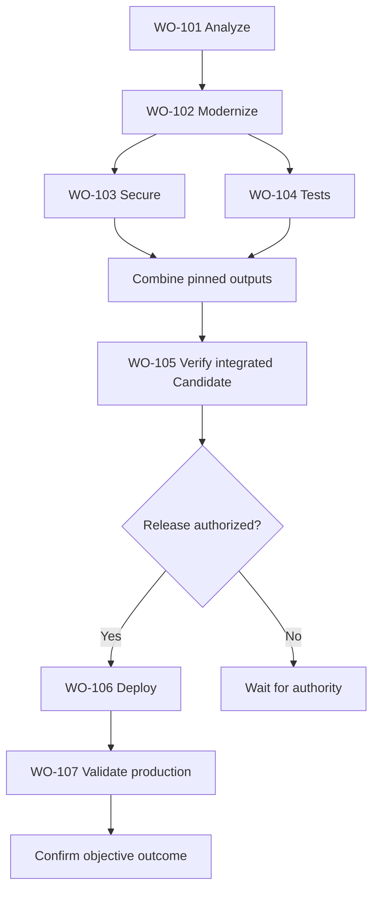
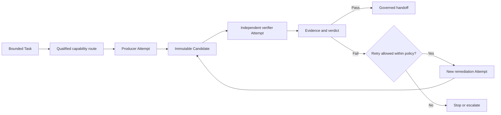

# Enterprise multi-factory software delivery

A large enterprise objective rarely fits inside one coding session. Modernizing a payments platform can require migration, vulnerability remediation, test engineering, integration, release, and production validation. The builder should describe the outcome. The platform should propose a governed composition of the capabilities needed to achieve it.

**Many factories. One governed objective.** Mission Control owns the cross-factory Plan and execution record. Each selected factory owns bounded execution inside a WorkOrder. Independent evidence determines what is eligible to advance; the accountable authority decides which consequential actions are permitted.

This is a reference architecture and implementation recommendation. It does not certify that every described capability is implemented in Mission Control or available commercially. The catalog, version labels, profile counts, and enterprise scale figures in the diagram are illustrative. Consult the [implementation evidence map](./mission-control/01-implementation-maturity-and-evidence-map.md) for evidenced behavior and [FDLC Enterprise](https://www.fdlc.ai/enterprise#pricing) for commercial scope and pricing discussions.

## Read the diagram at the right level

<!-- infographic: enterprise-multi-factory-delivery -->
> **Infographic — Enterprise multi-factory software delivery**

The top row describes eight stages of delivery across factories. Panels A–F expand the mechanisms: the governed Plan, factory internals, two levels of verification, the factory catalog, versioning, and outcomes. The text below supplies the readable companion to the poster.

| View | Question it answers | Relationship to this diagram |
| --- | --- | --- |
| Seven-stage FDLC | How do we design, qualify, operate, and improve the factory? | The outer lifecycle governs the factories used here. |
| Guide’s eight-stage value stream | How does software move through a factory? | Intent, planning, harnesses, capabilities, evaluation, improvement, and delivery remain the inner execution model. |
| Enterprise delivery flow | How do multiple factories achieve one objective? | This diagram adds cross-factory routing, dependency management, integrated verification, and release authority. |
| Six architecture areas | Which responsibilities must exist? | Intent, Harness, Capability, Model, Trust, and Learning support all these views. |

The diagram is a teaching view, not a literal state machine. In particular, its release arrow must be read with the explicit authority gate below. “Ready for release” is not “released,” and an objective with production criteria is not complete until those criteria are observed.

## 1. Builder intent and objective classification

Start with a natural-language or structured request: “Modernize payments to Java 21, remediate vulnerabilities, improve test coverage, and deploy safely.” Normalize it into a durable Objective with identity, owner, repository scope, desired outcomes, acceptance criteria, constraints, risk, budget, deadline, provenance, and authority context. Keep the original request as evidence. Execution should not repeatedly reinterpret an uncontrolled conversation.

Enrich the Objective with authorized repository and enterprise context: language manifests, dependency graphs, software bills of materials, CI configuration, ownership, data classification, target environments, and relevant policy. Model reasoning can help classify the work, but deterministic constraints define what is allowed.

The result identifies required capability domains: modernization, security remediation, test engineering, verification, delivery, and reliability. It does not grant access to a repository or select an unrestricted model. If necessary context is missing, return a specific clarification or blocked state.

## 2. The planner proposes; the Plan persists

The planner is replaceable intelligence. The Plan is a durable execution contract. Approval binds a specific Plan revision and digest, including its WorkOrders, dependencies, verification requirements, budgets, and authority gates. Changing that approved contract creates a new revision with the required reevaluation and approval.

| Plan or WorkOrder field | What it makes explicit |
| --- | --- |
| Objective, Plan, and WorkOrder IDs | Scope, ownership, and the chain back to the builder’s outcome |
| Desired outcome and acceptance criteria | The state to produce and the evidence needed to accept it |
| Dependencies and required states | Which verified prerequisites release this unit of work |
| Input and output artifact identities | Exact revisions consumed and produced, with provenance |
| Factory and profile constraints | Required capabilities, language, risk, environment, and qualification envelope |
| Verification contract | Independent checks, evaluator identity, policy version, evidence, and freshness |
| Authority and security context | Principals, permissions, sandbox, network policy, and approval boundaries |
| Budget, deadline, and stop conditions | Limits across tokens, compute, tools, elapsed time, and retries |
| State and authoritative result | Which Attempt and verified Candidate currently represent the WorkOrder |
| Recovery and release conditions | Cancellation behavior, escalation, publication, deployment, and rollback requirements |

A Plan must remain operable after the planner’s session disappears. The control plane reconstructs readiness and recovery from records, not from agent memory.

## 3. Three levels of routing

| Level | Decision | Output |
| --- | --- | --- |
| Objective routing | What capabilities does this outcome require? | Capability requirements that inform the governed Plan |
| WorkOrder routing | Which qualified factory may execute this WorkOrder? | Pinned Factory Version, Execution Profile, and recorded route decision |
| Task or capability routing | Which resources should perform this bounded Task? | Qualified skills, model routes, harnesses, tools, and context strategy |

At every level, separate eligibility from optimization. First filter for authorization, repository compatibility, data classification, environment, required capabilities, valid qualification, and available execution backends. Then rank eligible choices using evidence for similar workloads: verified quality, reliability, capability and context fit, latency, cost, and risk. If no choice is eligible, block or escalate; never relax a hard gate to produce a route.

Treat a route score as a workload-specific policy, not a universal formula. Normalize measures before combining them. Record the eligible set, rejected alternatives and reasons, policy and evaluation versions, evidence window, selected composition, and any authorized override. Sparse or stale evidence should lower confidence and restrict admission. Historical success on easy repositories does not establish fitness for a high-risk migration.

## 4. Governed dependencies and artifact handoffs

The worked example uses seven WorkOrders. Factories execute graph nodes; Mission Control owns graph semantics.

Security and test engineering may run concurrently only when they consume pinned inputs and work in isolated execution environments. If their changes conflict, integration must resolve the conflict and verify the resulting Candidate. Tests that passed on an earlier branch do not establish that the final security changes pass.

Every handoff carries an artifact identity or digest, producing Factory Version and Execution Profile, WorkOrder and Attempt identities, input lineage, verification state, evidence references, and applicable policy. Informal messages can aid coordination; they cannot substitute for the authoritative handoff.

Mission Control evaluates readiness, blocked dependencies, available parallelism, critical path, evidence freshness, budget, cancellation, and recovery position. A conceptual WorkOrder progression is **planned → ready → routed → running → candidate → verifying → verified → complete**. Implementations may use different state names, but must distinguish blocked, failed, retryable, awaiting authority, invalidated, and cancelled outcomes.

### When an upstream artifact changes

Suppose WO-103 verified security remediation against modernization artifact A. WO-102 then produces corrected artifact B. Evidence about A remains historical evidence; it is not proof about B. The control plane identifies affected descendants, invalidates stale readiness, and requires the appropriate rerun or requalification against B. Retain the old evidence for audit rather than rewriting it.

An immutable Candidate cannot absorb a later fix under the same identity. A changed Candidate receives a new identity and new verification. Approval of an earlier digest does not silently authorize the new one.

## 5. Execution inside a factory

A Factory Supervisor reads the approved WorkOrder and Plan, decomposes execution into Tasks, coordinates specialists, manages dependencies and context, monitors progress, and proposes recovery within the allowed budget. The harness and control plane enforce permissions and stop conditions outside the model.

The composition can include research, authorized retrieval, security analysis, a coding harness, test engineering, and build tooling. Not every capability needs to be an agent. Compilers, artifact digest checks, policy engines, and repeatable deployment steps should remain deterministic where possible.

Define maximum Attempts, aggregate budget, repeated-failure thresholds, alternate-route eligibility, cancellation behavior, and escalation ownership. A timeout or tool failure should not erase consumed budget. Replaying a consequential operation requires idempotency or reconciliation of whether its side effect already occurred. On recovery, fence stale workers so two Attempts cannot both publish authoritative results.

## 6. Local and global verification

**Local verification asks whether the factory satisfied its WorkOrder against the exact inputs it consumed. Global verification asks whether the integrated result satisfies the Objective.** A local PASS is necessary for the relevant handoff but insufficient for objective acceptance.

| Boundary | Evidence to examine | Meaning of a passing result |
| --- | --- | --- |
| Local, per WorkOrder | Acceptance criteria; build and tests; static analysis and scans; policy; artifact integrity; input/output provenance; required evidence; verifier identity | This exact Candidate satisfies this bounded contract within its qualification and evidence scope. |
| Global, pre-release | Required upstream WorkOrders; authoritative artifact versions; integrated Candidate; end-to-end and regression behavior; security; performance; original objective criteria; release readiness | This composition meets the applicable pre-release contract and may proceed to its authority decision. |
| Production validation | Release identity; environment; observation window; health and SLO signals; user or business criteria; incident and rollback evidence | The deployed result satisfies the defined post-release conditions, or requires remediation or rollback. |

“All WorkOrders complete” cannot be a prerequisite for a pre-release gate when deployment and production validation are themselves downstream WorkOrders. The gate requires all **prerequisite** WorkOrders. Final objective closure requires every mandatory WorkOrder and its associated acceptance conditions.

Independent verification is not necessarily another LLM. Use deterministic tests, specialized evaluators, security tools, policy engines, model-assisted judgment, and human review as the contract requires. Producer and verifier should not share authority to publish or approve the producer’s result. Consider correlated failures from identical models, prompts, context construction, tools, and assumptions. Different model routes can help, but diversity alone does not prove independence or correctness.

Bind evidence to the Objective, Plan revision, WorkOrder, Factory Version, Execution Profile, producer Attempt, input artifacts, Candidate digest, verifier Attempt, policy, evaluator versions, results, and evidence validity conditions. Record failed and inconclusive checks as faithfully as passing ones. A missing required check is not a PASS.

## 7. Human authority, release, and rollback

Keep these transitions distinct: **Candidate → verified → authorized → published → released → observed**. The exact names may vary; their responsibilities must not collapse. Verification provides evidence. Authority grants permission to act on that evidence for a specific scope.

Name the release owner and define the artifact, environment, rollout ring, permitted window, observation gates, exceptions, and rollback authority. Policy can preauthorize bounded low-risk transitions where explicitly permitted. It must not convert a high model-confidence score into unrestricted production authority.

Separate two rollback decisions. **Factory rollback** changes future admissions to a previously qualified composition that remains eligible under current policy. **Application rollback** restores or mitigates a deployed software change, including data compatibility and irreversible side effects. One does not accomplish the other. Reverting a router cannot reverse a database migration.

## 8. A reusable factory catalog

Start with reusable capability domains and specialize their operating envelopes with qualified profiles. Scale through WorkOrders, Tasks, Attempts, queues, and controlled runtime concurrency. Builder or repository count is not a prescription for factory count.

| Factory Definition | Typical scope | Qualification focus |
| --- | --- | --- |
| Software Delivery | Bounded features, defects, and refactoring | Repository understanding, implementation, acceptance, build, and regression behavior |
| Modernization | Language, framework, runtime, and API migration | Representative migrations, compatibility, dependency behavior, and regressions |
| Security Remediation | Vulnerable dependencies and insecure patterns | Remediation effectiveness, security tools, restricted access, and regression evidence |
| Test Engineering | Coverage gaps, regression suites, flaky tests | Relevant defect detection, test stability, mutation or negative cases where appropriate |
| Verification | Integrated Candidate and objective acceptance | Independent end-to-end, policy, security, performance, and evidence evaluation |
| Delivery | Build, packaging, and approved deployment | Artifact integrity, deterministic execution, authorization, and rollout behavior |
| Reliability | Production validation and recovery analysis | Health signals, SLOs, observation windows, recovery, and rollback procedures |

The boundaries should reflect distinct contracts and failure modes. Do not split a factory merely because a new business unit uses it. Do not force unrelated high-assurance work into a universal factory simply to reduce the catalog count.

## 9. Immutable versions and qualified profiles

A Factory Definition names the capability. A Factory Version identifies an immutable composition. An Execution Profile defines a versioned operating configuration within that composition’s qualified envelope. Pin the supervisor recipe, skills, model routes, harnesses, tool versions, context policies, sandbox/runtime, verification contract, and governance policy.

For illustration, a security-remediation version could expose Java high-assurance and Node standard profiles with different permitted tools, context budgets, network constraints, and verification requirements. These examples describe an architecture, not available SKUs.

Qualifying each component separately does not qualify their interaction. Test the assembled composition against representative and adversarial workloads, regression cases, security and policy constraints, reliability, latency, and cost. A change to a skill, harness, model route, or context policy creates a candidate composition requiring the relevant qualification.

The lifecycle is **develop → qualify → promote → activate → observe → improve**, with suspension and rollback when needed. Promotion approves the version for a defined scope; activation admits it to routing for that scope. Published, qualified, and activated are separate states. Use rollout rings and retain attributable baselines. Where a provider cannot guarantee an immutable model snapshot, record that limitation, monitor drift, and reevaluate; a version label alone cannot promise exact replay.

## 10. Enterprise controls and ownership

| Area | Decisions to make before expanding the pilot |
| --- | --- |
| Identity and isolation | Tenant and business-unit boundaries; SSO and provisioning needs; service identities; delegated authority; least privilege; isolated sandboxes |
| Data and knowledge | Permitted repositories and context sources; residency and retention needs; secret handling; network egress; attributable retrieval |
| Policy and audit | Approval scope and expiry; separation of duties; evidence integrity and export; exception ownership; incident investigation |
| Capacity and economics | Per-tenant queue fairness; concurrency limits; admission backpressure; provider quotas; budgets; cost attribution; cancellation |
| Operations and recovery | Durable orchestration; leases and fencing; retry limits; idempotency; incident owner; recovery objectives; rollback exercises |
| Integration and adoption | Existing source control, CI/CD, identity, security and ticketing systems; builder entry points; operator training; adoption measures |
| Commercial and deployment scope | Deployment topology; supported integrations; onboarding; support expectations; service commitments; portability and exit requirements |

These are requirements to evaluate with stakeholders, not claims that FDLC Enterprise currently ships every item. Keep the platform team accountable for the control plane, factory owners accountable for qualification and operations, security and governance owners accountable for policy, and business owners accountable for objectives and risk acceptance.

## 11. Outcomes, economics, and governed learning

Measure delivered value, including the effort and failures needed to obtain it. Declare workload class, time window, sample size, risk tier, Factory Version, and profile before comparing results.

| Dimension | Useful measures |
| --- | --- |
| Outcome and quality | Accepted objective rate, escaped defects, regressions, Candidate rejection, first-attempt verification |
| Velocity and recovery | End-to-end cycle time, queue time, retries per WorkOrder, blocked duration, rollback rate, recovery time |
| Economics | Inference, compute, tools, sandbox, verification, retries, and human intervention per accepted outcome |
| Human attention | Review minutes, escalation rate, override rate, abandonment, and operator feedback |
| Adoption and security | Repeat usage in the eligible cohort, accepted results, policy violations, introduced and remediated vulnerabilities |

Keep verification and acceptance denominators separate. Missing cost is unknown, not zero. If no outcomes are accepted, cost per accepted outcome is undefined. A lower token bill with more review effort can be a worse result. Use the [economics chapter](../02-design/09-tokenomics-and-factory-economics.md) and [FDLC measurement contract](https://www.fdlc.ai/benchmarks) for fuller definitions.

Outcomes feed an attributable learning loop: **signal → evidence → hypothesis → Improvement Candidate → evaluation → qualification → controlled promotion**. Compare like workloads and retain rejected candidates. Counterfactual routing regret is an estimate requiring evaluation, not proof that an untried route would have succeeded. Learning can propose new skills, context strategies, routes, profiles, or versions; it cannot silently mutate the live composition.

## 12. Recommended adoption and pricing discussion

Begin with one bounded workflow that has business value, representative repositories, a measurable baseline, independent verification, and a safe release and recovery path. Agree on success criteria and stop conditions with the builder, platform owner, security owner, and release authority.

Move through four phases: **scope** the workflow and baseline; **prove** it in constrained execution; **expand** only to qualified repositories, teams, and risk classes; **operate** with service health, economics, adoption, and version governance. Increase autonomy only where retained evidence and authority support it. A large enterprise rollout should be the result of a proven operating model, not its first experiment.

For large organizations, **[contact FDLC Enterprise at support@fdlc.ai](mailto:support@fdlc.ai?subject=FDLC%20Enterprise%20pricing%20and%20scope)** for details on pricing, design partnerships, deployment requirements, and phased adoption. Bring:

- Target workflows, expected outcomes, and current delivery baseline.
- Repository, language, team, and business-unit scope.
- Expected work volume, concurrency, and execution environments.
- Identity, security, residency, retention, and audit requirements.
- Existing integrations, onboarding needs, and support expectations.
- Pilot success measures, budget constraints, ownership, and desired rollout sequence.

These inputs support scoping; they are not published pricing units. FDLC Enterprise remains a proposed commercial offering and is not generally available. Pricing, deployment options, service levels, support, and packaged availability require confirmation for the agreed scope. The framework and guide remain open.

## Retain this

- Builders express outcomes; intent does not grant authority.
- The planner proposes. The approved Plan persists and survives recovery.
- Mission Control owns the graph; factories execute bounded WorkOrders.
- Qualification constrains every routing decision before optimization.
- Local verification checks the node; global verification checks the composition.
- Release authority and production observation remain distinct from verification.
- Immutable compositions, explicit recovery, and attributable outcomes make learning governable.

## Go deeper

[The factory in one view](../01-understand/02-the-factory-in-one-view.md) · [Multi-repository design](../02-design/10-multi-repository-design.md) · [Control and execution planes](../03-build/13-control-plane-orchestrator-and-execution-plane.md) · [Routing](../03-build/22-routing-and-the-escalation-ladder.md) · [Quality and evidence](../04-prove/27-quality-and-evidence-architecture.md) · [Enterprise adoption](../05-operate/38-enterprise-adoption-and-the-infrastructure-landscape.md) · [Governed learning](../06-improve/40-governed-learning.md)

Source: Jay West’s supplied enterprise multi-factory delivery diagram and accompanying narrative notes, consolidated and extended with the failure handling, authority, evidence, and adoption contracts in the Guide. Example identifiers and quantities remain illustrative.
