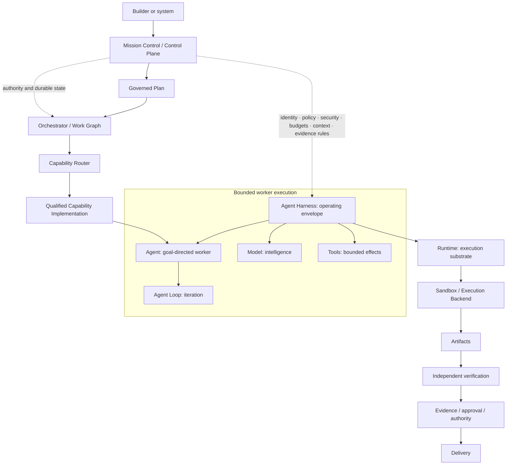

# Execution boundaries and canonical terminology

Most disagreement about the meaning of “agent harness” is a boundary
disagreement. Some people mean the loop inside a worker. Some mean the operating
environment around the worker. Some mean the workflow that coordinates many
workers. Others include enterprise policy, identity, budgets, and kill switches
under the same term. FDLC separates these concerns so that each layer has a clear
responsibility, owner, lifecycle, and qualification boundary.

Do not ask only, “What is a harness?” Ask which boundary you are discussing: the
iteration loop, the operating envelope, the work graph, the execution substrate,
or the enterprise control plane.

## The compact mental model

| Term | FDLC meaning | Governing question |
| --- | --- | --- |
| **Model** | An inference engine that supplies reasoning, generation, classification, or other model intelligence | What intelligence is available? |
| **Agent** | A goal-directed worker using model intelligence, instructions, context, state, and capabilities | Who is pursuing the task? |
| **Agent Loop** | The worker’s bounded iteration cycle | How does this worker make progress and stop? |
| **Agent Harness** | The operating envelope governing how the agent interacts with models, context, tools, state, resources, and external systems | Under what conditions may this worker operate? |
| **Work Graph** | The explicit topology of nodes, dependencies, branches, joins, gates, interrupts, cycles, error transitions, and terminal states | What work can happen next? |
| **Orchestrator** | The durable coordinator that advances the Work Graph and its task state | Which eligible work executes next, and how does the overall run progress? |
| **Runtime** | The substrate that starts, hosts, persists, resumes, and terminates execution | Where and how does execution live and survive? |
| **Sandbox** | An isolated execution environment provisioned by or beneath the Runtime | What can this execution affect? |
| **Capability** | A qualified ability to perform a defined type of work | What outcome can be delegated with evidence? |
| **Factory** | A governed, versioned composition designed to produce one defined class of outcome | What complete production system delivers the outcome? |
| **Factory Platform** | Shared enterprise infrastructure supporting many governed Factories | Which services and controls should every Factory reuse? |

These are responsibilities. One deployment may implement several, and one
product may package several together. Categorize a component by the
responsibility it performs at the boundary being discussed, not by its product
category or marketing name.

## Three meanings commonly collapsed into “harness”

### 1. The Agent Loop

```text
Load State → Plan / Select → Act / Call → Observe Result
           → Evaluate → Update / Replan → Repeat
```

The loop answers, “How does this worker make progress?” FDLC calls this the
**Agent Loop** or **Execution Loop**, and the discipline that improves it **Loop
Engineering**. Some external material calls the loop an inner harness; translate
that usage to Agent Loop when writing canonical FDLC architecture.

The loop stops when success criteria are met, a turn, time, token, or cost budget
is exhausted, progress has stalled, policy requires escalation, or a human
decision is required. The agent may propose continuation. A deterministic
boundary evaluates whether continuation is permitted.

### 2. The Work Graph

```text
Intake → Route → Specialist → Tool Action → Human Gate → Join → Verify → Done
```

The graph answers, “What work happens next?” Nodes perform bounded work. Edges
determine the next eligible node from durable state. **Graph Engineering**
designs dependencies, parallel branches, joins, gates, interrupts, failure
transitions, cycles, and terminal states. The Agent Loop can operate inside one
node; it is not the graph.

The **Orchestrator** advances this graph. It coordinates tasks, agents, harness
invocations, dependencies, retries, handoffs, human waits, compensation,
recovery, and completion. The harness controls a worker’s operating envelope;
the orchestrator coordinates the work across workers and time.

### 3. The Agent Harness

```text
Context · Tools · Permissions · State · Budgets
Recovery · Stopping · Telemetry · Provenance · Artifacts
```

The harness answers, “Under what conditions may this worker operate?” It turns
raw model intelligence into an operational capability by binding the task
contract, instructions, context construction and compression, state and memory
views, model and tool interfaces, the Agent Loop, permissions, capability
restrictions, retry and recovery behavior, stopping conditions, resource
budgets, artifact handling, telemetry, provenance, and validation of tool
results.

**A harness determines how an agent is allowed to operate.** It may enforce
controls locally, but it does not own every enterprise policy or grant itself
authority. These three layers cooperate; they should not be collapsed into one
architectural primitive.

## Harness, Runtime, Sandbox, and Control Plane

The **Runtime** supplies process lifecycle, compute, containers or virtual
machines, queues, leases, persistence, checkpoint storage, resume, retry
infrastructure, filesystem lifecycle, network access, credential injection,
isolation, concurrency, and side-effect recovery support. The Runtime answers
where and how execution lives and survives. The Harness answers how the agent is
allowed to operate. A Runtime may host many harness invocations, and a harness
adapter may run on several qualified runtimes.

The **Sandbox** is the isolated environment provisioned by or beneath the
Runtime. It enforces filesystem and process isolation, network restrictions,
scoped credentials, resource limits, dependency-installation boundaries, and
blast-radius reduction. Runtime and Sandbox are related records, not synonyms:
the Runtime manages execution lifecycle; the Sandbox contains one execution.

The **Control Plane** is the external authority governing agents, harnesses,
runtimes, orchestrators, and Factories. It owns identity, authentication,
authorization, policy, Execution Profiles, budgets, routing authority,
capability grants, approval requirements, emergency controls, tenant boundaries,
audit and evidence requirements, governance, and release authority.

> **Enforcement and authority are not the same thing.**

A Coding Harness may enforce maximum turns, allowed tools, local filesystem
scope, and output limits. Those limits may originate in the Factory Version,
Execution Profile, policy engine, capability qualification, or user and
organizational authority. Policy authority should remain external to the
replaceable harness wherever practical. This preserves portability, governance
consistency, model and harness independence, reproducibility, auditability,
centralized revocation, and enterprise control.

The phrase **AI harness** is not a canonical FDLC primitive because it does not
identify a boundary. Translate it to Model Harness, Agent Harness, Coding
Harness, Evaluation Harness, Runtime, Orchestrator, or Control Plane after
establishing which responsibility is meant.

## Coding and IDE Harnesses

A **Coding Harness** is an Agent Harness specialized for software engineering.
It can expose repository access, file manipulation, code search, shell and
compiler execution, tests, build and package systems, Git operations, diffs,
patches, diagnostics, language servers, repository instructions, checkpoints,
repair loops, test feedback, and artifacts.

An **IDE Harness** is a Coding Harness whose primary interaction and execution
experience is integrated into an editor. It may consume open files, cursor and
selection state, diagnostics, language-server data, terminal state, Git status,
diffs, workspace state, and user approvals. An IDE is not inherently a harness;
it can host or expose one. A terminal-based Coding Harness remains a Coding
Harness without being an IDE Harness.

For a familiar classification example:

| Component | FDLC classification |
| --- | --- |
| Claude | Model |
| Claude Code | Coding Harness or coding-agent operating environment |
| Hardened container or remote execution environment | Runtime Artifact, Execution Backend, or Sandbox according to the boundary being discussed |
| Temporal-style workflow or another durable graph executor | Orchestrator |
| FDLC Mission Control | Control Plane and factory coordination |
| Software Delivery Factory | Governed outcome-producing composition using the components above |

Vendor boundaries differ internally. FDLC classifies components by architectural
responsibility rather than marketing terminology. The Coding Harness is not the
entire Runtime, Orchestrator, Factory Platform, or Factory.

## Capability and Capability Implementation

A **Capability** is a qualified ability to perform a defined type of work, such
as code modification, test generation, dependency analysis, security scanning,
incident investigation, browser interaction, database analysis, or
documentation generation. Capability is not synonymous with Agent. A model,
agent, Coding Harness, deterministic tool, MCP capability, API, workflow, human,
or hybrid composition can implement one.

A **Capability Implementation** is a concrete, qualified way to supply the
Capability. It can bind an Agent Recipe, Harness version, Model Route, Runtime
Artifact, Execution Backend, tools, Context Policy, qualification evidence, cost
profile, and latency profile.

```text
Capability: Code Modification

Implementation A
  Coding Harness: adapter A@version
  Model Route: route A@version
  Runtime Artifact: image digest A
  Execution Backend: sandbox profile A
  Qualification: evidence set A

Implementation B
  Coding Harness: adapter B@version
  Model Route: route B@version
  Runtime Artifact: image digest B
  Execution Backend: sandbox profile B
  Qualification: evidence set B
```

Routing should select among eligible Capability Implementations whose complete
composition meets the workload’s quality, security, latency, cost, availability,
and authority requirements. Selecting only “an agent” hides the model, harness,
runtime, tool, context, and qualification identities that made the result
possible.

## Factory, Factory Version, and Factory Platform

A **Factory** is a governed, versioned composition of workflows, capabilities,
policies, context, execution environments, verification rules, evidence
requirements, and authority designed to produce a defined outcome. A Software
Delivery Factory, Modernization Factory, and Security Remediation Factory may
reuse the same Coding Harness and Runtime while binding different work graphs,
capabilities, risk policies, and acceptance contracts.

A **Factory Platform** supplies the shared enterprise foundation: Mission
Control, identity, policy, Capability Registry, model gateway, context and
retrieval, orchestration, runtime and sandbox infrastructure, observability,
evaluation, evidence, approvals, and release integration. One platform supports
many Factory Definitions and Factory Versions without duplicating the underlying
infrastructure.

A **Factory Version** binds the qualified immutable composition used for a class
of execution. Keep these identities separate:

- Model identity;
- Model Route identity;
- Agent Recipe or Agent Definition identity;
- Harness identity and version;
- Runtime Artifact identity;
- Execution Backend and Sandbox Profile identity;
- Capability and Capability Implementation identity;
- Qualification identity; and
- Factory Version identity.

The routable unit remains the governed Factory Version or another explicit
execution composition defined by the current architecture. An Execution Profile
binds the eligible runtime, harness, model, tools, environment, and applicable
policy for an Attempt. The immutable execution manifest resolves that composition
for one Attempt. Mutable runtime discovery cannot silently change it.

## Canonical relationship

> **Diagram — Authority, execution, and evidence boundaries.**



The diagram is conceptual. Implementations may deploy these responsibilities as
peers or combine several into one service. Ownership and immutable references,
not visual nesting, define the boundary.

## Diagnose the boundary that failed

When an autonomous run fails, ask these questions in order:

1. **Did the Agent choose a poor next action or fail to make progress?** Inspect
   Loop Engineering: context sufficiency, action selection, evaluation,
   replanning, progress detection, and stopping.
2. **Did the workflow route incorrectly or coordinate work badly?** Inspect
   Graph Engineering and Orchestration: dependencies, eligibility, fan-out,
   joins, retries, handoffs, human gates, and failure transitions.
3. **Did the worker see, spend, retry, call, or modify beyond its intended
   authority?** Inspect Harness Engineering and the Control Plane: local
   enforcement, the originating grant, policy version, and observed revocation.
4. **Did execution disappear, fail to resume, lose state, or corrupt external
   effects?** Inspect Runtime and durable orchestration: leases, checkpoints,
   persistence, idempotency, reconciliation, compensation, and recovery.
5. **Was an output accepted without adequate proof?** Inspect Verification,
   Evidence, and Authority: subject binding, verifier independence, currentness,
   required gates, and the accountable decision.

This keeps a workflow, infrastructure, or governance defect from being filed as
a generic “agent problem.”

## Explain it in thirty seconds

The model supplies intelligence. The agent is the goal-directed worker. The
Agent Loop is how that worker iterates. The Agent Harness is the operating
envelope controlling what the worker can see and do. The Work Graph describes
the topology of the larger job, and the Orchestrator advances it. The Runtime
keeps execution alive, while a Sandbox contains its effects. A Capability is an
ability qualified through one exact implementation. A Factory composes those
pieces to produce an outcome, and the Factory Platform supplies shared enterprise
authority and infrastructure. Enforcement can happen inside a harness; authority
remains in the Control Plane.

## Go deeper

- [Chapter 13 — Control plane, orchestrator, and execution plane](../03-build/13-control-plane-orchestrator-and-execution-plane.md)
- [Chapter 14 — Durable execution](../03-build/14-durable-execution.md)
- [Chapter 15 — Coding harnesses and agent protocols](../03-build/15-coding-harnesses-and-agent-protocols.md)
- [Chapter 16 — Harness engineering](../03-build/16-harness-engineering.md)
- [Chapter 17 — Development environments, sandboxes, and compute](../03-build/17-development-environments-sandboxes-and-compute.md)
- [Chapter 18 — Agent architecture](../03-build/18-agent-architecture.md)
- [Chapter 23 — Agent and loop engineering](../03-build/23-agent-and-loop-engineering.md)
- [Canonical glossary](./glossary.md)
