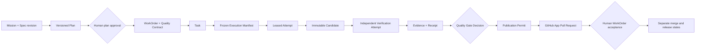

# Mission Control Capability, Workflow, and Admission Map

> Evidence boundary: this assessment uses the tracked Mission Control files at
> checked-out commit `d902fae`. The checkout was detached from a branch, and its
> local `origin/main` ref pointed to `4700573`. Untracked review artifacts were
> excluded. The implementation passed its retained local qualification, but the
> production admission packet remained `BLOCKED_BY_OPERATOR_CONFIGURATION`.
> Therefore, this chapter distinguishes implemented mechanisms, qualified local
> composition, configured production capability, and live operational proof.

## 1. The problem

A mature agentic software factory contains more than an agent loop. It contains
builder interfaces, specifications, plans, agent and skill versions, model
routes, harnesses, sandboxes, durable state, policy, independent verification,
publication controls, release records, production outcomes, and learning.

Without a capability and workflow map, several unsafe substitutions become
easy:

- a route or screen is mistaken for an operable product capability;
- a passing unit test is mistaken for end-to-end system proof;
- a registered model or sandbox is mistaken for an admitted execution path;
- a worker completion message is mistaken for independent acceptance evidence;
- telemetry is mistaken for proof;
- a proposal from the learning system is mistaken for an approved change; or
- a protocol task is mistaken for the factory's governed Task record.

The purpose of this case study is to connect the factory's memorable lifecycle
to Mission Control's current records, code paths, workflows, and evidence while
preserving those distinctions.

## 2. Why the problem exists

Mission Control is a large, evolving repository. It contains active product
doctrine, accepted decisions, current code, retained evidence, historical
documents, previews, demos, plans, and legacy product surfaces. Those sources
answer different questions.

The implementation also separates configuration from authority. A model route
can exist but remain disabled. A Sandbox Profile can be qualified but not
promoted. A Factory Version can be created but not ready. A worker can be alive
but unable to attest the exact version. An Attempt can produce a candidate but
cannot verify or publish it. A verified candidate can be review-ready without
being accepted, merged, deployed, or proven valuable in production.

This is intentional. Production reliability comes from preserving the chain of
claims rather than compressing it into a convenient `DONE` label.

## 3. The enduring principle

### Map every builder outcome to an authoritative contract

The one-line value stream is:

> **Intent → Plan → Define Agent → Execute through Harness → Apply Skills →
> Evaluate → Improve → Deliver Software**

The durable contract spine behind it is:

```text
Builder Intent
  → Mission Spec revision
  → approved Plan version + Quality Contract
  → WorkOrder revision
  → Task
  → Factory Version + Agent/Skill bindings
  → frozen Execution Manifest
  → Attempt + Completion Report
  → immutable Candidate
  → independent Verification Run + Evidence
  → Quality Gate Decision
  → Publication Permit + Pull Request
  → Human Acceptance
  → Release + Production Outcome
  → Learning Signal + governed Improvement Candidate
```

Names can vary. The principle is that intent, authority, execution, evidence,
decision, delivery, outcome, and learning remain independently attributable.

### Use five cooperating planes

| Plane | Owns | Must not claim |
| --- | --- | --- |
| Builder experience | Intent capture, plan review, exception triage, evidence review, and consequential decisions | Runtime or policy authority hidden in a client |
| Control plane | Identity, versions, policy, admission, lifecycle state, approvals, and audit | That execution succeeded merely because it was dispatched |
| Execution plane | Harness, model calls, tools, sandbox, repository mutation, checkpoints, and completion reports | Verification, publication, acceptance, or merge authority |
| Assurance and delivery plane | Independent evaluation, currentness, evidence, gates, publication, release, and production verification | That telemetry or a worker assertion is proof |
| Learning plane | Outcome signals, failure clusters, datasets, experiments, and improvement proposals | Silent mutation or promotion of active configuration |

### Treat admission as a chain, not a boolean

Execution is eligible only when the exact combination of intent, repository,
workflow, agent, model route, harness, sandbox, worker, policy, budget, and
environment is current and permitted. Cost or historical quality may rank
eligible candidates; it must never compensate for a failed hard constraint.

### Preserve authorized action parity

Every builder outcome supported by a product surface should have a governed API
or tool path that reaches the same authoritative state. Parity concerns
outcomes, not a one-to-one mapping of buttons to tools. It also does not mean an
agent inherits every human permission: identity, scope, approval, and evidence
requirements still apply.

## 4. Tradeoffs and alternatives

Exact versioning and digest binding make runs reproducible and auditable, but
increase configuration work and make drift fail closed. A lighter system could
move faster for low-risk experiments, but it should label that lower assurance
instead of implying equivalent production readiness.

Atomic tools improve composability and emergent problem solving. Domain tools
reduce calls and variance for repeated workflows. Keep policy enforcement,
credential boundaries, exact schemas, and irreversible actions deterministic;
let the agent apply judgment within those boundaries.

A single authoritative control plane improves consistency but may add latency
and create a critical dependency. Durable local checkpoints and reconciliation
help execution survive temporary control-plane or provider ambiguity without
allowing a worker to invent authoritative state.

Action parity increases product usefulness and test surface. Some actions must
remain human-only, including identity bootstrap, approval of consequential
authority, risk acceptance, merge, and other irreversible decisions. Marking an
action `human-only` is clearer than leaving an accidental capability gap.

## 5. Current Mission Control implementation

### Repository and authority model

At the studied commit, Mission Control is a TypeScript and pnpm monorepo. The
React/Vite application provides operator surfaces, Convex owns authoritative
durable state and server-side transitions, and the Hono orchestration service
hosts execution adapters and provider boundaries. Current product doctrine
prioritizes an exception-first operator experience over agent activity feeds.

The repository's Software Factory documentation defines an authority order:
product doctrine, accepted decisions, normative contracts, current
implementation guides, plans, validation evidence, and historical material.
This case study follows that order and uses code and retained evidence to bound
present-tense claims.

### Lifecycle map

| Factory stage | Mission Control realization at `d902fae` | Assessment |
| --- | --- | --- |
| Intent | Project Constitution, immutable Mission Spec revisions, Missions, stable requirements, acceptance expectations, and source references | Implemented mechanisms; spec-driven intake is feature-gated and default off |
| Plan | Versioned Mission Plans, human approval, WorkOrder blueprints, validation assertions, and a Quality Contract projection | Implemented and system-qualified for the bounded V1 path |
| Define Agent | Agent templates/versions plus Attempt-bound hashes for the agent genome, prompt bundle, tool manifest, provider, and model | Material binding exists; not yet one universal Agent Definition record |
| Execute through Harness | Provider-neutral harness lifecycle, `codex/v1`, exact capability manifest, persistent-worker or remote-sandbox backend, lease, budgets, and structured result | Generic harness is production architecture; current production execution remains unconfigured |
| Apply Skills | Skill discovery, import, frontmatter validation, linting, context evaluation, and configuration scanning | Registry and quality mechanisms exist; exact skill-version binding in the execution manifest was not found |
| Evaluate | Policy V2 Verification Subjects and Plans, separate verifier Attempts, evidence and receipts, exact-currentness checks, and Quality Gate Decisions | Implemented and system-qualified; the executing harness cannot certify the candidate |
| Improve | Deterministic learning signals, clusters, improvement candidates, datasets, experiments, and submitted Mission Plans | Implemented as advisory proposal flow; no automatic promotion |
| Deliver Software | GitHub App publication boundary, PR currentness, human WorkOrder acceptance, release-gate records, deployments, activation, and production evidence | Mechanisms exist at different maturity levels; production admission packet remained blocked |

### Capability map

| Capability | Current evidence | Boundary or missing proof |
| --- | --- | --- |
| Builder surfaces | North Star and V1 strategy define Mission intake, plan review, exception queues, run inspection, review packages, and release decisions | No current repository-wide action-parity manifest or browser proof for every surface |
| Intent recognition | Mission Spec quality evaluation, clarification, decisions, and requirement identities exist | Default-off feature and bounded V1 journey; not general natural-language intent autonomy |
| Planning and decomposition | Plans release governed WorkOrder blueprints; graph workflows support explicit dependencies | Plan approval does not dispatch, and graph execution does not grant new scope |
| Agent definitions | Versioned agent records and exact agent hashes are frozen into execution | Exact skills, credentials, and all policy fields are not consolidated into one definition |
| Model gateway and routing | Model catalog, exact route identity, evidence qualification, advisory routing, guarded-auto gates, and immutable decision snapshots exist | Production catalog had zero qualified routes; Guarded Auto remained disabled |
| Context and memory | Provenance-backed retrieval, graph relationships, planning, Attempt-bound Context Packages, context evals, and configuration drift scans exist | Factory Memory is advisory and gated by phase; it cannot satisfy acceptance |
| Tools and MCP | Harness manifests freeze native tool support and permitted capabilities | The studied Codex and DeepSeek manifests declare MCP unsupported; no first-class production MCP gateway was verified |
| Skills | `SKILL.md` parsing, linting, registry import, eval scenarios, and local repository scanning exist | No exact skill digest/version was observed in `factory-execution-manifest/v1` |
| Harness and sandbox | Generic lifecycle, normalized results, capability manifests, Sandbox Profiles, credential and teardown contracts, and local/remote backends exist | Hardened remote production use requires operator promotion and live canary proof |
| State and recovery | Tasks, immutable Attempts, leases, heartbeats, retry budgets, events, artifacts, pause/drain/kill controls, and compatibility projections exist | Ambiguous external effects still require reconciliation; old runs remain historical, not current evidence |
| Evaluation | Independent Verification Factory, criterion-linked evidence, receipts, exact-currentness, and fail-closed gates exist | A complete production outcome proof remains outside the retained admission packet |
| Feedback and learning | Signals, clusters, candidates, experiments, baseline/candidate comparison, and promotion history exist | Promotion stops at a submitted Plan and requires a different human approval |
| Policy and approvals | Server-side permissions, risk classes, policy envelopes, approval records, separation of duties, and publication permits exist | Production identities and configuration must be established legitimately; no service identity may simulate human promotion |
| Observability | Run events, traces, observations, model/token/cost fields, inspector views, and eval records exist | Diagnostic observations are not acceptance evidence; unavailable telemetry remains unknown rather than zero |
| Deployment and release | Separate PR, acceptance, release, deployment, activation, rollback, and production-evidence records exist | Current V1 proof is stronger before merge than after production outcome validation |
| Multi-tenancy | Company/workspace/repository boundaries, membership authorization, scoped records, and cross-scope tests exist | Fleet-scale and cross-organization production load are not established by repository tests |
| Adoption and versioning | Basic/intermediate/advanced presentation, feature flags, immutable versions, migration guidance, and docs exist | Presentation modes do not alter authority; broad company adoption remains a future operating proof |

### Workflow 1: governed intent to review-ready change



The important property is negative authority: Plan approval does not dispatch;
the harness does not verify; verification does not publish; publication does
not merge; and merge does not prove the production outcome.

### Workflow 2: production execution admission

The admission packet records the following operator sequence:

```text
Canonical GitHub App installation
  → current structured workflow registration
  → exact model-route registration
  → human evidence-based route promotion
  → immutable hardened Sandbox Profile creation
  → human profile promotion
  → code scopes + agents + policy + verifiers
  → exact Factory Version creation
  → exact worker/Factory Version attestation
  → readiness assessment and activation
  → human-selected local then remote canary
  → independent verification
  → controlled publication canary
```

Registration never counts as qualification. Promotion grants execution-only
eligibility, not routing, verification, publication, acceptance, merge, or
deployment authority. Worker admission compares exact repository, Factory
Version, configuration digest, harness manifest, effective configuration,
model route, backend, and Sandbox Profile identity.

The local implementation qualification passed 17 composed gates. The retained
production observation still found zero GitHub App installations, exact routes,
promoted Sandbox Profiles, current production workflows, Factory Versions,
workers, and Attempts. No production mutation or canary was fabricated. This is
a strong example of honest blocking: qualified code is not the same as an
operationally configured factory.

### Workflow 3: failure, recovery, and reconciliation

```text
Detect failure
  → classify policy / capability / environment / provider / execution / result
  → contain authority and preserve events
  → retry only a permitted failure class within Attempt and wall-clock budgets
  → create attributable new Attempt or reconcile ambiguous external effects
  → quarantine, drain, kill, or escalate when safe continuation is unavailable
  → independently re-evaluate the new exact candidate
```

The workflow contract rejects heuristic `STATUS: done` completion and requires
structured status for non-gate steps. Historical runs are projected read-only
as current, legacy-but-valid, malformed, incomplete, stale-schema, or truly
invalid. Compatibility logic does not rewrite history or invent a terminal
outcome.

### Workflow 4: governed learning

```text
Attempt, verification, review, and production observations
  → deterministic Learning Signals
  → bounded failure or opportunity clusters
  → human-reviewable Improvement Candidate
  → frozen baseline/candidate experiment
  → reviewed result
  → submitted Mission Plan
  → separate human Plan approval
  → ordinary WorkOrder and execution lifecycle
```

This is the practical meaning of: **Learning can be autonomous. Promotion
should be governed.** The learning subsystem is prohibited from accepting,
publishing, merging, changing an active Factory Version, or granting itself new
authority.

### Workflow 5: authorized action parity

Mission Control contains slice-level capability maps, including Graph
Engineering mappings between UI actions, Convex capabilities, and shared state.
The reusable factory workflow is:

1. inventory each meaningful builder action and the state it changes;
2. map it to an authenticated API or tool outcome, or mark it human-only;
3. require UI and agent paths to use the same authoritative transition;
4. apply the same policy, scope, idempotency, and audit rules;
5. surface the result and receipt immediately to the operator; and
6. test the resulting state, not merely the selected tool call.

A repository-wide parity map and drift check would make this discipline
continuous rather than case-study-specific.

## 6. Future vision

Mission Control should promote the following only after retained evidence meets
the same bar as its existing governed path:

- a repository-wide builder-action-to-agent-capability map with CI drift checks;
- exact skill IDs, versions, digests, dependencies, and evaluation status in
  every relevant execution manifest;
- a governed MCP gateway with explicit client/server identity, capability
  discovery, per-tool authorization, consent, rate limits, audit, and result
  provenance;
- a legitimate production configuration and bounded local/remote canary;
- outcome-normalized routing evidence before enabling Guarded Auto;
- one browser-originated Mission-to-reviewed-PR path without direct data
  mutation or operational bypass;
- retained post-merge deployment, activation, rollback, and production-outcome
  evidence; and
- measured adoption across teams before making fleet-scale claims.

Evidence required to move these into current capability includes exact commits,
server-side authorization tests, retained runtime and browser artifacts,
failure/recovery drills, refresh/restart durability, cross-tenant negative
tests, and an operator-readable decision package.

## 7. Versioned references

Mission Control sources at studied commit `d902fae7032c0696b531c44ae88829c652516fc6`:

- [Mission Control README](https://github.com/jaydubya818/MissionControl/blob/d902fae7032c0696b531c44ae88829c652516fc6/README.md)
- [Mission Control North Star](https://github.com/jaydubya818/MissionControl/blob/d902fae7032c0696b531c44ae88829c652516fc6/docs/product/mission-control-north-star.md)
- [Mission Control V1 Product Strategy](https://github.com/jaydubya818/MissionControl/blob/d902fae7032c0696b531c44ae88829c652516fc6/docs/product/mission-control-v1-product-strategy.md)
- [Software Factory documentation authority map](https://github.com/jaydubya818/MissionControl/blob/d902fae7032c0696b531c44ae88829c652516fc6/docs/software-factory/README.md)
- [Generic Harness Contract V1](https://github.com/jaydubya818/MissionControl/blob/d902fae7032c0696b531c44ae88829c652516fc6/docs/architecture/generic-harness-contract-v1.md)
- [Autonomous Execution Routing V1](https://github.com/jaydubya818/MissionControl/blob/d902fae7032c0696b531c44ae88829c652516fc6/docs/architecture/execution-routing-v1.md)
- [Factory Memory and Context Intelligence](https://github.com/jaydubya818/MissionControl/blob/d902fae7032c0696b531c44ae88829c652516fc6/docs/architecture/factory-memory-context-intelligence.md)
- [Factory Learning and Continuous Improvement](https://github.com/jaydubya818/MissionControl/blob/d902fae7032c0696b531c44ae88829c652516fc6/docs/architecture/factory-learning-continuous-improvement.md)
- [Graph Engineering capability map](https://github.com/jaydubya818/MissionControl/blob/d902fae7032c0696b531c44ae88829c652516fc6/docs/software-factory/GRAPH_ENGINEERING.md)
- [Execution Manifest implementation](https://github.com/jaydubya818/MissionControl/blob/d902fae7032c0696b531c44ae88829c652516fc6/convex/lib/executionManifest.ts)
- [Exact Model Route admission](https://github.com/jaydubya818/MissionControl/blob/d902fae7032c0696b531c44ae88829c652516fc6/convex/lib/modelRouteAdmission.ts)
- [Sandbox Profile admission](https://github.com/jaydubya818/MissionControl/blob/d902fae7032c0696b531c44ae88829c652516fc6/convex/lib/sandboxProfileAdmission.ts)
- [Workflow compatibility and structured completion](https://github.com/jaydubya818/MissionControl/blob/d902fae7032c0696b531c44ae88829c652516fc6/convex/lib/factoryWorkflowContract.ts)
- [Production admission evidence packet](https://github.com/jaydubya818/MissionControl/blob/d902fae7032c0696b531c44ae88829c652516fc6/docs/testing/evidence/production-execution-admission-foundation-v1/README.md)
- [Production admission operator sequence](https://github.com/jaydubya818/MissionControl/blob/d902fae7032c0696b531c44ae88829c652516fc6/docs/testing/evidence/production-execution-admission-foundation-v1/operator-configuration-sequence.md)
- [Production admission final validation](https://github.com/jaydubya818/MissionControl/blob/d902fae7032c0696b531c44ae88829c652516fc6/docs/testing/evidence/production-execution-admission-foundation-v1/final-validation.md)

External standards and current interoperability references, accessed
2026-08-28:

- [Model Context Protocol 2026-07-28 release](https://blog.modelcontextprotocol.io/posts/2026-07-28/) — stateless requests, explicit discovery, authorization hardening, Tasks extension, and current deprecations.
- [OpenTelemetry GenAI semantic conventions](https://github.com/open-telemetry/semantic-conventions-genai/blob/main/docs/gen-ai/README.md) — development-stage conventions for model, agent, workflow, plan, and tool spans.
- [NIST SP 800-218A](https://csrc.nist.gov/pubs/sp/800/218/a/final) — secure software-development practices for AI model producers, system producers, and acquirers.
- [SLSA Provenance 1.2](https://slsa.dev/spec/v1.2/provenance) — artifact subjects, build definitions, run details, and builder identity.
- [OWASP Top 10 for Agentic Applications 2026](https://genai.owasp.org/resource/owasp-top-10-for-agentic-applications-for-2026/) — current agentic application threat taxonomy.

## 8. Notes and lessons learned

- The most production-minded result in the current admission work is the
  refusal to create plausible-looking production evidence when prerequisites
  are absent.
- Exact model and harness identity matters because a provider/model name alone
  does not describe the executable, adapter configuration, sandbox, or
  effective capabilities that produced an artifact.
- Skills are part of the factory configuration only when exact evaluated
  versions are bound to the Attempt; a registry by itself is not runtime proof.
- MCP standardizes an interoperability surface. It does not replace product
  authorization, tenant isolation, tool policy, evidence, or acceptance.
- Capability parity must be combined with authority parity. A shadow agent API
  that bypasses the UI's controls is not parity; it is a second control plane.
- Telemetry explains a run. Evidence supports or refutes a criterion. The same
  artifact may contribute to both only when its producer, subject, method,
  provenance, and policy meaning are explicit.

## 9. Design review questions

1. Why is an exact model route more than a provider and model name?
2. Which admission checks are hard constraints, and which signals may influence
   ranking after eligibility?
3. Why can a locally qualified implementation remain legitimately blocked in
   production?
4. What would prove that Skills are bound rather than merely discoverable?
5. How does authorized action parity differ from giving an agent human powers?
6. Why is an MCP Task not a substitute for a WorkOrder, Task, or Attempt?
7. Which records must be reconciled after an ambiguous GitHub or sandbox side
   effect?
8. What evidence would justify enabling Guarded Auto for one risk class?

## 10. Whiteboard exercise

Draw the five planes and the full delivery spine. Add the production admission
chain as a precondition to Attempt claim. For every transition, name the actor,
authoritative record, digest or version, hard policy check, emitted evidence,
failure state, recovery path, and human-only authority. Circle every place
where telemetry could be mistaken for evidence or registration for promotion.

